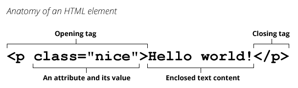

# HTML

## 软件和应用程序

- 软件的定义：一系列按照特定顺序组织的==计算机数据和指令==，是电脑的==非有型部分==

- 软件开发就是告诉计算机一系列的==指令==，这些指令也称之为==程序==

- 软件开发和应用程序的区别

  

- 完整的软件系统（网易云音乐为例）

  


## 认识网页和网站

- 网页的定义

  - 网页的专业术语叫做 ==Web Page==
  - 打开浏览器==查看到的页面==，是网络中的==一“页”==
  - 网页的内容可以非常丰富，包括==文字、链接、图片、音乐、视频==等

- 网站的定义：由==多个网页组成==的集合，通常一个网站由N（N >= 1）个网页组成

- 上世纪 90 年代，Berners-Lee上线了世界上 [第一个网站](http://info.cern.ch/hypertext/WWW/TheProject.html)


### 网页的显示过程

- 用户角度

  1. 用户在浏览器中输入一个==网站地址==
  2. 浏览器会找到对应的==服务器地址==（DNS 服务解析域名得到对应的 IP 地址），请求==静态资源==
  3. 服务器==返回==静态资源给浏览器
  4. 浏览器对静态资源进行==解析和展示==

  

- 前端工程师角度

  1. 开发项目（HTML/CSS/JavaScript/Vue/React）
  2. 打包、部署项目到服务器里面

  


### 服务器

- 日常生活接触到的基本都属于==客户端、前端==的内容（比如浏览器、微信、QQ、小程序）

- 服务器本质上也是一台类似电脑的==主机==，但是这个主机有几个特点
  - 二十四小时不关机（稳定运行）
  - 不需要显示器
  - 一般装的是 ==Linux== 操作系统（比如 CentOS ）
- 目前公司大部分用的是==云服务器==


### 网页的组成

- 网页的组成

  - 阶段一：HTML 元素

  - 阶段二：HTML 元素 + CSS 样式

  - 阶段三：HTML 元素 + CSS 样式 + JavaScript 脚本

- HTML：网页的==内容结构==
- CSS：网页的==视觉体验==

- JavaScript：网页的==交互处理==


## 认识浏览器

### 浏览器作用

- 网页的组成部分：HTML + CSS + JavaScript
- 浏览器可以将编写的代码==渲染==成多彩的网页
- 浏览器最核心的部分其实是==浏览器内核==


### 浏览器内核

- 浏览器最核心的部分是==渲染引擎（Rendering Engine）==，一般也称为==浏览器内核==
  - 负责==解析==网页元素，并==渲染==网页

- 不同浏览器的内核
  - ==Trident==:  IE、360安全浏览器、搜狗高速浏览器、百度浏览器、UC 浏览器
  - ==Gecko==:  Mozilla Firefox
  - ==Presto== -> ==Blink==:  Opera
  - ==Webkit==:  Safari、360极速浏览器、搜狗高速浏览器、移动端浏览器（Android、IOS）
  - ==Webkit== -> ==Blink==:  Google Chrome
- 不同的浏览器内核有不同的解析、渲染规则，所以同一网页在不同内核的浏览器中的渲染效果也可能不同


## 认识 HTML

- ==**超文本标记语言**==（Hypertext Markup Language，简称：HTML）是一种用于创建网页的标准==标记语言==
  
  - HTML 元素是构建网站的基石
  - HTML 属于标记语言，并不属于编程语言
- 标记语言
  - 由无数个标记（标签）组成
  - 是对某些内容进行特殊的标记，以供其他解释器识别处理
  - 比如使用 `h2` 标记的文本会被识别为 **标题**
  - 由标签和内容组成的称为==元素（element）==
- 超文本
  - 表示不仅仅可以插入普通的文本，还可以插入图片、音频、视频等内容
  - 还可以表示超链接，从一个网页跳转到另一个网页

- HTML 文件的拓展名有 `.htm`、`.html`

  - 因历史遗留问题，Win95/Win98 系统的文件拓展名不能超过 3 个字符，所以使用 .htm
  - 现在统一使用 `.html`

- HTML文件结构

  ```html
  <html>
    <head>
      <title>Hello HTML</title>
    </head>
    <body></body>
  </html>
  ```


## 认识元素

- HTML 本质上是由一系列的==元素（Element）==构成的

- 元素是网页的一部分

  - 一个元素可以包含一个数据项，或是一段文本，或是一张图片，亦或是什么也不包含
  
- HTML 元素参考：https://developer.mozilla.org/zh-CN/docs/Web/HTML/Element

- 元素的组成：开始标签 + 内容 + 结束标签（对于双标签元素）

  - ==开始标签==：包含元素的名称，被左、右尖括号所包围。表示元素从这里开始或者开始起作用
  - ==结束标签==：==双标签==元素才需要。与开始标签相似，只是其在元素名之前包含了一个斜杠 `/` ，这表示着元素的结尾
  - ==内容==：元素的内容

  

- 元素的属性

  - 属性包含元素的额外信息，这些信息通常不会出现在实际的内容中
  - 由多对 `key=value` 组成
  - 属性的分类
    - 公共属性：每一个元素都可以设置，比如 class、id、title
    - 特有属性：比如 meta 元素的 charset 属性、img 元素的 alt 属性

- 单标签元素和双标签元素

  - 大部分看到的元素都是双标签的，比如 html、body、head、h2、p、a
  - 一些元素是只有一个标签，比如 br、img、hr、meta、input

- HTML 元素不区分大小写，但是推荐小写

- HTML 的注释：`<!-- 注释内容-->`


## HTML 结构分析

### 结构组成

一个完整的 HTML 结构包含几个部分

- ==文档声明==
- ==html== 元素
  - head 元素
  - body 元素

```html
<!DOCTYPE html>
<html lang="en">
<head>
  <meta charset="UTF-8">
  <title>Document</title>
</head>
<body></body>
</html>
```


### 文档声明

- HTML 最上方的一段文本称之为==文档类型声明== ，用于声明==文档类型==
- `<!DOCTYPE html>`
  - HTML 文档声明，告诉浏览器当前页面是 ==HTML5== 页面
  - 让浏览器用 HTML5 的标准去==解析识别==内容
  - 必须放在 HTML 文档的==最前面==，不能省略，省略了可能出现兼容性问题


### html 元素

- `html` 元素表示一个 HTML 文档的==根==（顶级元素），所以它也被称为==根元素==
  - 所有其他元素必须是此元素的==后代==

- W3C 标准建议为 html 元素增加一个 `lang` 属性
  - 帮助语音合成工具确定要使用的发音
  - 帮助翻译工具确定要使用的翻译规则
  - 常见值：`en`、`zh-CN`


### head 元素

- `head` 元素规定文档相关的==配置信息==（元数据），包括文档的标题、引用的文档样式和脚本等
- 网页的标题：`title` 元素
- 网页的编码：`meta` 元素
  - 可以用于设置网页的==字符编码==，不设置或者设置错误会导致乱码
  - 一般都使用 ==UTF-8== 编码，涵盖了世界上几乎所有的文字

```html
<head>
  <meta charset="UTF-8">
  <title>Document</title>
</head>
```


### body 元素

- `body` 元素里面的内容将是在浏览器窗口中看到的东西，也就是网页的具体==内容和结构==

- 大部分 HTML 元素都是在 body 中编写呈现的

```html
<body>
  <div>11</div>
  <span>22</span>
</body>
```


## HTML 元素

### 基本元素

#### h 元素

- 在一个页面中通常会有一些比较重要的文字作为==标题==，这个时候可以使用 ==h 元素==

- ==h1==~==h6== 标题 (Heading) 元素呈现了六个不同的级别的标题
- 其实他们没有本质的区别，区别仅仅在于浏览器给他们加入了==不同的 CSS 样式==
- h元素通常和 ==SEO 优化== 有关系


#### p 元素

用于表示一个==段落==

```html
<p>这是一个段落</p>
```


#### img 元素

- HTML `img` 元素将一份图像嵌入文档。事实上 `img` 是一个[==可替换元素==](https://developer.mozilla.org/zh-CN/docs/Web/CSS/Replaced_element)（replaced element）
  
- img 元素的两个常见属性
  - `src` 属性：表示==源==，包含嵌入的图片的文件==路径==（网络图片地址或本地路径）
  - `alt` 属性：不是强制性的，有两个作用
    - 当图片加载不成功（错误的地址或者图片资源不存在），那么会显示这段文本
    - 屏幕阅读器会将这些描述读给需要使用阅读器的使用者听（无障碍），让他们知道图像的含义
- 支持的图片格式：https://developer.mozilla.org/zh-CN/docs/Web/Media/Formats/Image_types


#### a 元素

- 定义==超链接==，用于打开新的 URL

- `a` 元素的两个常见属性
  
  - `href`：Hypertext Reference 的简称，指定要打开的 ==URL== 地址或本地地址
  - `target`：该属性指定在何处显示链接的资源
    - `_self`：默认值，在当前窗口打开 URL
    - `_blank`：在一个新的窗口中打开 URL
  
  ```html
  <a href="https://developer.mozilla.org/zh-CN/docs/Web/CSS/Replaced_element" target="_blank">
    可替换元素
  </a>
  ```
  
  

>
>
>a元素 — 锚点链接

- 锚点链接可以实现：跳转到网页中的具体位置

- 实现方式

  - 在跳转目标元素上定义一个 `id` 属性
  - 定义 a 元素，并且 a 元素的 `href` 指向对应的 ==id==

  ```html
  <a href="#target1">跳转至标题一</a>
  <a href="#target2">跳转至标题二</a>
  
  <h2 id="target1">标题一</h2>
  <h2 id="target2">标题二</h2>
  ```

  

>
>
>a元素 — 图片链接

- img 元素跟 a 元素 一起使用，可以实现图片链接

```html
<a href="https://prettier.io/">
  
</a>
```


>
>
>a元素 — 其他 URL 地址

```html
<a href="https://github.com/facebook/react/archive/refs/heads/main.zip">点击下载</a>
<a href="mailto:12345@qq.com">发邮件</a>
```


#### iframe 元素

- 利用 `iframe` 元素可以实现：在一个 HTML 文档中嵌入其他 HTML 文档
  - `frameborder` 属性：用于规定是否显示边框（"1"：显示；"0"：不显示）

- a 元素的 `target` 属性还有两个其他值
  - `_parent` ：在父窗口中打开 URL
  - `_top` ：在顶层窗口中打开 URL（存在 iframe 嵌套时）
- 通过设置==响应头==中的 `X-Frame-Options` 可以规定当前HTML页面能否被其他网页通过iframe元素引用，它有两个值
  - `DENY`：不光在别人的网站 frame 嵌入时会无法加载，在同域名页面中同样会无法加载
  - `SAMEORIGIN`：页面就可以在同域名页面的 frame 中嵌套

```html
<iframe src="https://taobao.com" frameborder="1"></iframe>
```


#### div 元素 / span 元素

- 产生的历史
  - 网页的发展早期没有 CSS，为了丰富网页，开始添加一些带有样式的 HTML 元素，比如 h、strong、i、del 元素
  - 随着网页越来越复杂和丰富，就产生了 CSS，通过 CSS 来设置所有元素的样式，HTML 元素只需负责网页的结构
  - 这个时候就出现了 `div/span` 来编写 HTML 结构所有的结构，样式都交给 CSS 来处理（走向另一个极端）
  - 随着 HTML5 的推出，增加了许多==语义化==的元素（用最合适的元素去做最正确的事）

- div 元素和 span 元素都是纯粹的==容器（盒子）==

- div 元素：div 元素包裹的内容会==独占一行==
  - 一般作为其他元素的父容器，把其他元素包住，代表一个整体
  - 用于把网页分割为多个独立的部分
- span 元素：多个 span 元素包裹的内容会在==同一行==显示
  - 默认情况下，跟普通文本几乎没差别
  - 用于区分特殊文本和普通文本，比如用来显示一些关键字

```html
<div>块级元素</div>
<span>行内元素</span>
```


### 高级元素

#### 列表元素

- HTML 提供了 3 组常用的用来展示列表的元素
- ol 与 ul 没有本质区别，仅在于 CSS 属性 `list-style-type` 默认不同

>
>
>有序列表 ol - li

- `ol`：==有序列表==，直接子元素只能是 li
- `li`：列表中的每一项

```html
<h2>水果排行</h2>
<ol>
  <li>香蕉</li>
  <li>西瓜</li>
  <li>葡萄</li>
</ol>
```


>
>
>无序列表 ul - li

- `ol`：==有序列表==，直接子元素只能是 li
- `li`：列表中的每一项

```html
<h2>编程语言</h2>
<ul>
  <li>C</li>
  <li>C++</li>
  <li>Go</li>
</ul>
```


>
>
>定义列表 dl - dt - dd

- `dl`：==定义列表==，直接子元素只能是 dt、dd

- `dt`：列表中每一项的项目名
- `dd`：列表中每一项的具体描述 ，是对 dt 的描述、解释、补充
  - 一个 dt 后面一般紧跟着 1 个或多个 dd

```html
<h2>前端开发</h2>
<dl>
  <dt>前端基础</dt>
  <dd>HTML</dd>
  <dd>CSS</dd>
  <dd>JavaScript</dd>
</dl>
```


#### 表格元素

>
>
>基本元素

- `table`：表格
- `tr`：表格中的行
- `td`：表格中的列
- `caption`：表格的标题
- `thead`：表格的表头
  - `th`：表格的表头单元格
- `tbody`：表格的主体
- `tfoot`：表格的页脚
- 表格有很多相关的标签属性可以设置表格的样式 , 但是已经不推荐使用了
  - `border-collapse`：用来决定表格的边框是 ==分开==（`separate`） 还是==合并==（`collapse`）

```html
<table>
    <caption>商品列表</caption>
    <thead>
      <tr>
        <th>商品分类</th>
        <th>商品名称</th>
        <th>商品价格</th>
      </tr>
    </thead>
    <tbody>
      <tr>
        <td>手机</td>
        <td>一加10pro</td>
        <td>4599</td>
      </tr>
      <tr>
        <td>食品</td>
        <td>AD钙</td>
        <td>48</td>
      </tr>
    </tbody>
  </table>
```

```css
table {
  border-collapse: collapse;
}
th, td {
  text-align: center;
  border: 1px solid #333;
  padding: 5px;
}
```


>
>
>单元格合并

- 在某些特殊的情况下，一个单元格可能会==跨多行==或==多列==来使用

- 单元格合并分成两种情况

  - 跨列合并：使用 `colspan`
    - 在==最左边==的开始合并单元格添加 colspan 属性 , 并且省略掉合并的 td
  - 跨行合并：使用 `rowspan`
    - 在==最上面==的开始合并单元格添加 rowspan 属性 , 并且省略掉后面 tr 中的 td

  ```html
  <table>
    <tr>
      <td>1-1</td>
      <td colspan="2">1-2</td>
      <!-- <td>1-3</td> -->
    </tr>
    <tr>
      <td rowspan="2">2-1</td>
      <td>2-2</td>
      <td>2-3</td>
    </tr>
    <tr>
      <!-- <td>3-1</td> -->
      <td>3-2</td>
      <td>3-3</td>
    </tr>
  </table>
  ```

  


#### 表单元素

HTML 表单元素是==和用户交互==的重要方式之一 ，在很多网站都需要使用表单

##### input 元素

- 表单元素使用最多的是 `input` 元素

- input 元素的常见属性（https://developer.mozilla.org/zh-CN/docs/Web/HTML/Element/Input）

  - `type`：表单的类型
    - `text`：文本输入框（明文输入）
    - `password`：文本输入框（密文输入）
    - `radio`：单选框
    - `checkbox`：复选框
    - `button`：按钮
    - `submit`：提交表单数据给服务器
    - `file`：文件上传
  - `readonly`：只读
  - `disabled`：禁用
  - `checked`：默认被选中。只有当 type 为 radio 或 checkbox 时可用
  - `autofocus`：当页面加载时，自动聚焦
  - `placeholder`：输入框的占位文字
  - `name`：名字。在提交数据给服务器时，可用于区分数据类型
  - `value`：取值

- 布尔属性

  - 布尔属性可以没有属性值， 写上属性名就代表使用这个属性
  - 如果要给布尔属性设值，值就是属性名本身

  ```html
  <input type="text" disabled>
  <input type="radio" checked="checked">
  ```

- 表单可以实现按钮效果

  - 普通按钮（`type = button`）：使用 value 属性设置按钮文字

  - 重置按钮（`type = reset`）：重置它所属 form 的所有表单元素（包括 input、textarea、select）

  - 提交按钮（`type = submit`）：提交它所属 form 的表单数据给服务器（包括 input、textarea、select）

    ```html
    <input type="button" value="普通按钮">
    <input type="reset" value="重置按钮">
    <input type="submit" value="提交按钮">
    ```

  - 按钮（button）也可以实现同样的效

    ```html
    <button type="button">普通按钮</button>
    <button type="reset">重置按钮</button>
    <button type="submit">提交按钮</button>
    ```

- input 和 label 的关系

  - label 元素一般跟 input 配合使用，用来表示 input 的标题
  - labe 可以跟某个 input 绑定（`for` 与 `id` 绑定），点击 label 就可以使对应的 input 聚焦

  ```html
  <div>
    <label for="username">用户名</label>
    <input type="text" id="username">
  </div>
  <div>
    <label for="password">
      密码 <input type="password" id="password">
    </label>
  </div>
  ```

- 属于同一种类型的 checkbox 和 radio，其 `name` 值要保持一致

  ```html
  <div>
    爱好:
    <label for="running">
      跑步 <input id="running" type="checkbox" value="running" name="hoby">
    </label>
    <label for="swimming">
      游泳 <input id="swimming" type="checkbox" value="swimming" name="hoby">
    </label>
  </div>
  ```


##### textarea 元素

- 展示一个文本域，用于多行文本输入

- 缩放的 CSS 设置 `resize`

  - `none`：禁止缩放
  - `horizontal`：水平缩放
  - `vertical`：垂直缩放
  - `both`：水平垂直缩放

  ```css
  textarea {
    resize: vertical;
  }
  ```

  

##### select 元素

- `option` 是 `select` 的子元素，一个 option 代表一个选项
- select 常用属性
  - `multiple`：可以多选
  - `size`：显示多少项
- option 常用属性
  - `selected`：默认被选中

```html
<select name="fruits">
  <option value="apple">苹果</option>
  <option value="banana">香蕉</option>
</select>
```


##### form 元素

- form 通常作为表单元素的父元素

  - form 可以将整个表单作为一个整体来进行操作
  - 比如对整个表单进行==重置==、对整个表单的数据进行==提交==

- form 的常见属性

  - `action`：用于提交表单数据的 请求 URL
  - `method`：请求方法（get 和 post ），默认是 get
  - `target`：在什么地方打开 提交 URL （类似 a 元素的 target 属性）

  ```html
  <form action="http://localhost:2222" target="_self" method="post">
    <div>
      <label for="username">用户名</label>
      <input type="text" id="username" name="username">
    </div>
    <div>
      <label for="password">密码</label>
      <input type="password" id="password" name="password">
    </div>
    <div>
      <label for="fruits">密码</label>
      <select name="fruits" id="fruits">
        <option value="apple">苹果</option>
        <option value="banana">香蕉</option>
      </select>
    </div>
    <button type="submit">提交</button>
  </form>
  ```


### HTML 5 新增元素

#### 语义化元素

HTML5 新增了一些语义化元素（有利于 SEO）

- `header`：头部元素
- `nav`：导航元素
- `section`：定义文档某个区域的元素
- `article`：内容元素
- `aside`：侧边栏元素
- `footer`：尾部元素


#### audio / video

HTML5 增加了对媒体类型的支持（之前通过 flash 实现，弊端较多）

>
>
>audio — 音频

- `audio` 元素用于在文档中嵌入==音频==内容

- 常见属性

  | 常见属性 | 值的类型           | 属性作用                                                   |
  | -------- | ------------------ | ---------------------------------------------------------- |
  | src      | 资源URL地址        | 音频资源的地址                                             |
  | controls | Boolean 类型       | 是否显示控制栏，包括音量、进度、暂停/恢复播放              |
  | autoplay | Boolean 类型       | 音频是否自动播放（某些浏览器还需要设置 `muted` 才可能生效 ） |
  | muted    | Boolean 类型       | 是否静音                                                   |
  | preload  | none/metadata/auto | 是否预加载音频，metadata 表示预加载元数据（比如时长）       |

- 每个浏览器的 audio 支持的 [格式](https://developer.mozilla.org/en-US/docs/Web/Media/Formats/Audio_codecs) 可能不同，甚至可能不支持 audio 元素

  ```html
  <audio src="./assets/demo.mp3" controls>
    <!-- source可以指定多种兼容格式 -->
    <source src="./assets/demo.ogg">
    <!-- 浏览器不支持时的替换文本 -->
    <p>当前浏览器不支持audio元素</p>
  </audio>
  ```


>
>
>video — 视频

- `video` 元素 用于在 HTML 或 XHTML 文档中嵌入媒体播放器，用于支持文档内的==视频==播放

- 常见属性

  | 常见属性     | 值的类型           | 属性作用                                                   |
  | ------------ | ------------------ | ---------------------------------------------------------- |
  | src          | 资源URL地址        | 视频资源的地址                                             |
  | width/height | px                 | 设置宽度/高度                                              |
  | controls     | Boolean 类型       | 是否显示控制栏，包括音量、跨帧、暂停/恢复播放              |
  | autoplay     | Boolean 类型       | 音频是否自动播放（某些浏览器还需要设置 muted 才可能生效 ） |
  | muted        | Boolean 类型       | 是否静音                                                   |
  | preload      | none/metadata/auto | 是否预加载视频，matadata表示预加载元数据（比如时长）       |
  | poster       | URL地址            | 海报帧图片 URL，用于在视频处于下载中的状态时显示           |

- 每个浏览器的 video 支持的 [格式](https://developer.mozilla.org/en-US/docs/Web/Media/Formats/Containers) 可能不同，甚至可能不支持 video 元素

  ```html
  <video src="./assets/demo.mp4" controls>
    <!-- source可以指定多种兼容格式 -->
    <source src="./assets/demo.3gp">
    <!-- 浏览器不支持时的替换文本 -->
    <p>当前浏览器不支持video元素</p>
  </video>
  ```

  

### HTML 全局属性

- 某些属性只能设置在特定的元素，比如 a 元素的 href 属性

- [==全局属性==](https://developer.mozilla.org/zh-CN/docs/Web/HTML/Global_attributes) 是所有 HTML 元素共有的属性；它们可以用于所有元素，即使属性可能对某些元素不起作用

- 常见的全局属性

  - `id`：定义唯一标识符，该标识符在整个文档中必须是唯一的。其目的是在链接（使用片段标识符），脚本或样
    式（使用 CSS ）时标识元素
  - `class`： 一个以空格分隔的元素的类名列表，它允许 CSS 和 JavaScript 通过类选择器或 DOM 方法来选择和访问特定的元素
  - `style` ：给元素添加内联样式
  - `title`：包含表示与其所属元素相关信息的文本，这些信息通常可以作为提示呈现给用户，但不是必须的
  - `data-*`：一类被称为 **自定义数据属性** 的属性，它赋予我们在所有 HTML 元素上嵌入自定义数据属性的能力
    - 设置的属性可以在 JavaScript 的 DOM 操作中通过 `dataset` 获取到
    - 通常用于 HTML 和 JavaScript 数据之间的传递
  - `hidden`：设置 hidden 后，相当于设置了 `display: none` 的 CSS ==样式==


## 扩展知识

### 字符实体

- HTML 元素需要通过浏览器去解析

- 某些情况下，一些特殊的字符可能会导致 HTML 无法正常解析

  ```html
  <span><h</span>
  ```

  - HTML中的 `<` ，浏览器会将其后的文本解析为一个==标签==
  - 这个时候就可以借助==字符实体==来替换一些特殊字符

- 字符实体是一段以==连字符 `&` 开头==、以==分号 `;` 结尾==的文本字符串

  - 字符实体常常用于显示==保留字符==（会被解析成 HTML 代码的字符）和==不可见字符==（如换行符和空格）
  - 也可以使用字符实体代替一些难以用标准键盘键入的字符

- 常见的字符实体

  |      |   描述   | 实体名称 | 实体编号 |
  | :--: | :------: | :------: | :------: |
  |      |   空格   | `&nbsp;` | `&#160;` |
  |  \<   |   小于   |  `&lt;`  | `&#60;`  |
  |  >   |   大于   |  `&gt;`  | `&#62;`  |
  |  ©   |   版权   | `&copy;` | `&#169;` |
  |  ®   | 注册商标 | `&reg;`  | `&#174;` |

  

### URL

>
>
>认识URL

- URL：==统一资源定位符==（ Uniform Resource Locator）
- URL 就是一个给定的独特资源在 Web 上的地址
  - 理论上说，每个有效的 URL 都指向一个==唯一==的资源
  - 这个资源可以是一个 HTML 页面，一个 CSS 资源，一张图片等其他


>
>
>URL的格式

- URL的标准格式：==【协议类型】://【服务器地址】:【端口号】/【文件路径】/【文件名】?【查询】#【片段 ID】==

  - 格式

    

  - 例如

    


>
>
>URI

- URL 和 URI的区别
  - URI：统一资源==标志符==， 用于标识 Web 技术使用的==逻辑或物理资源==。URI可被视为定位符（URL），名称（URN）或两者兼备
  - URL：统一资源==定位符==， 俗称网络地址
- URI 在某一个规则下能把一个资源独一无二的识别出来
  - URL 作为一个网络 Web 资源的地址，可以唯一将一个资源识别出来，所以 URL 是一个 URI
  - 但是 URI 并不一定是 URL


### 元素语义化和 SEO

>
>
>元素语义化

- 元素的语义化：==用正确的元素做正确的事情==
- 元素语义化的好处
  - 方便代码维护
  - 能让语音合成工具正确识别网页元素的用途，以便作出正确的反应
  - 有利于 ==SEO 优化==


>
>
>SEO

- 搜索引擎优化（SEO）是通过了解搜索引擎的运作规则来调整网站，以及提高网站在有关搜索引擎内==排名==的方式

- 搜索引擎的工作流程

  - 搜索引擎定期爬取网页
  - 尝试分析网页的主题内容，编入索引
  - 用户搜索时，分析关键字内容，去索引库中查找对应索引，再根据索引去查询对应收录的网站
  
  
  


### 字符编码

- 计算机只可以直接存储和处理==二进制数字==

  - 计算机一开始发明出来时是用来解决数字计算问题的，后来人们发现，计算机还可以做更多的事，例如文本处理 
  - 计算机只“认识” `010110111000…` 这样由 0 和 1 两个数字组成的二进制数字
  - 因为计算机的底层硬件实现就是用==电路的开和闭==两种状态来表示 0 和 1 两个数字

- 字符编码的产生

  - 为了在计算机上也能==表示、存储和处理==像文字、符号等之类的字符 ，就必须将这些字符转换成二进制数字
  - 因此必须制定一个==统一的、标准的==转换规则
  - 目前使用最为广泛的字符编码是 ==UTF-8==

  


### link 元素

- link 元素是==外部资源链接==元素，规范了==文档与外部资源==的关系。通常是在 head 元素中

- link 元素最常用于链接==样式表==（CSS），此外也可以被用来创建==站点图标==

- link 元素常见的属性

  - `rel` ：指定 [链接类型](https://developer.mozilla.org/zh-CN/docs/Web/HTML/Link_types)
    - `icon`：站点图标
    - `stylesheet`：CSS 样式文件
  - `href` ：指定被链接资源的 URL

  ```css
  <link rel="icon" href="/favicon.ico">
  <!-- 兼容IE写法 -->
  <link rel="shortcut icon" href="/favicon.ico">
  <link rel="stylesheet" href="/index.css">
  <!-- 网页打不开时替换链接 -->
  <link ref="alternate" href="https://github.com/">
  ```


### meta 元素

- `meta` 元素用于定义元数据

  - head 中用于定义元数据，比如标题 title、样式 style、link 外部资源等
  - meta 用于定义那些不能使用其他相关 HTML 元素定义的任何元数据信息

- `meta` 元素定义的元数据的类型包括以下几种

  - 设置 `charset` 属性，用于字符集声明，告诉文档使用哪种字符编码

    ```html
    <meta charset="UTF-8">
    ```

  - 设置 `http-equiv` 属性， 指定编译指令

    ```html
    <!-- 告知 IE 浏览器去模仿 Edge 浏览器的行为 -->
    <meta http-equiv="X-UA-Compatible" content="IE=edge">
    ```

  - 设置 `name` 属性（[参考规则](https://developer.mozilla.org/zh-CN/docs/Web/HTML/Element/meta/name)），提供的是文档级别的元数据，应用于整个页面

    - `robots`：文档被爬虫时应该遵守的规则
    - `author`：文档作者
    - `description`：一段简短而精确的、对页面内容的描述
    - `keywords`：与页面内容相关的关键词，使用逗号分隔，某些搜索引擎会进行收录（SEO）

    ```html
    <meta name="robots" content="index, follow">
    <meta name="description" content="The MDN Web Docs site provides information about Open Web technologies including HTML, CSS, and APIs for both Web sites and progressive web apps.">
    <meta name="keyword" content="淘宝,掏宝,网上购物">
    ```
