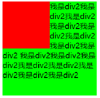

# CSS

## 认识 CSS

- CSS：层叠样式表（ Cascading Style Sheet ）是为网页添加==样式==的代码

- CSS 是一种计算机语言，但是不算是一种编程语言

- CSS 的历史

  - 早期为了使 HTML 页面可以更加丰富，增加了很多具备==特殊样式==的元素（比如 i 、strong 、del）

  - 后来也有不同的浏览器实现各自的样式语言 ，但是没有统一的规范

  - 1994 年，Hakon Wium Lie 和 Bert Bos 合作设计 CSS ，在 1996 年发布了 ==CSS1==

  - 直到 1997 年初，W3C 组织才专门成立了 CSS 的工作组，1998 年 5 月发布了 ==CSS2==

  - 在 2006~2009 非常流行 ==“DIV+CSS ”== 布局 的方式来替代所有的 html 标签

  - 从 CSS3 开始，所有的 CSS 分成了不同的==模块==（modules），每一个 module 都有于 CSS2 中额外增加的功能，以及==向后兼容==

    

  - 直到 2011 年 6 月 7 日， 第一个 module —— ==CSS 3 Color Module== 终于发布

- CSS 的出现是为了美化 HTML，并且让 结构 (HTML) 与样式 (CSS) 分离

  - 为 HTML 添加各种各样的样式 ，比如颜色、字体、大小、下划线等
  - 对 HTML 进行布局 ，按照某种结构显示


## CSS 的编写方式

- 声明一个 单独的 CSS 规则：==属性名: 属性值;==

  - 属性名：要添加的 CSS 规则的名称
  - 属性值：要添加的 CSS 规则的值

  

- CSS 的注释：使用 `/*注释内容*/`

- CSS 的引入方式

  - ==内联==样式
  - ==内部==样式表
  - ==外部==样式表


### 内联样式

内联样式表存在于 HTML 元素的 `style` 属性之中，CSS 样式之间用==分号==隔开

```html
<div style="color: red; font-size: 20px">
  内联样式
</div>
```


### 内部样式

将 CSS 放在 HTML 文件 `head` 元素内的 `style` 元素之中

```html
<head>
  <meta charset="UTF-8">
  <title>Document</title>
  <style>
    div {
      color: red;
      font-size: 20px;
    }
  </style>
</head>
```


### 外部样式

- 外部样式表：将 CSS 编写在一个独立的文件中，并且 通过 `link` 元素引入进来

  ```html
  <head>
    <link rel="stylesheet" href="./demo.css">
  </head>
  ```

- `@import`：可以在 style 元素或者 CSS 文件中==导入==其他的 CSS 文件

  ```css
  @import url('./demo.css');
  ```


## CSS 选择器

CSS 选择器：按照一定的规则==选出符合条件==的元素 ，为之添加 CSS 样式

### 通配选择器

- 可以选中所有的元素，一般用来给所有元素做一些通用性的设置（如样式重置）

- 由于此选择器会去匹配所有的元素，==性能较差==，不推荐使用

- 规则：使用 `*` 匹配

  ```css
  * {
    padding: 0;
    margin: 0;
  }
  ```


### 简单选择器

- ==元素==选择器（ type selectors ）, 使用元素的==名称==
- ==类==选择器（ class selectors ）, 使用 `.类名`

- ==id== 选择器（ id selectors ）, 使用 `#id`

  - 一个 HTML 文档里面的 id 值是==唯一==的，不能重复
  - id 值如果由多个单词组成，单词之间可以用 ==连字符（-）== 、==下划线（_）== 连接 ，也可以使用驼峰标识（不推荐）


  ```css
  div {
    color: red;
  }
  .box {
    font-size: 20px;
  }
  #app {
    margin: 0;
  }
  ```


### 标签属性选择器

- 拥有某一个属性：`[att]`

- 属性等于某个值：`[att=val]`


```html
<style>
  div[title] {
    color: red;
  }
  [id=app] {
    color: skyblue;
  }
</style>

<div title="div">
  <span id="app">11</span>
</div>
```


### 后代选择器

- 选择==所有==的后代（直接/间接的后代）：选择器之间以==空格==分割

  ```css
  .box span {
    color: red;
  }
  ```

- 直接子代选择器（必须是直接子代）：选择器之间以 `>` 分割

  ```css
  .box > span {
    color: purple;
  }
  ```

  

### 兄弟选择器

- 相邻兄弟选择器（该元素后面紧跟的一个兄弟元素）：使用符号 `+` 进行连接

- 普遍兄弟选择器（该元素后面所有的兄弟元素）：使用符号 `~` 进行连接


```html
<style>
  d.first + span {
    color: red;
  }
  .first ~ span {
    color: skyblue;
  }
</style>

<div>
  <span class="first">11</span>
  <span>22</span>
  <span>33</span>
</div>
```


### 选择器组

- ==交集==选择器：需要同时符合两个选择器条件（两个选择器紧密连接）

  ```css
  /* 类名为box的div元素 */
  div.box {
    color: red;
  }
  ```

- ==并集==选择器 : 符合一个选择器条件即可（两个选择器以 `,` 号分割）

  ```css
  div, span {
    color: red;
  }
  ```

  

### 伪类选择器

[伪类](https://developer.mozilla.org/zh-CN/docs/Web/CSS/Pseudo-classes) 是选择器的一种 ，它用于选择处于==特定状态==的元素

>
>
>动态伪类

- `:link` ：选中尚未访问的链接
- `:visited` ：选中已访问过的链接
- `:hover`：鼠标悬停在元素上时
- `:active` ：匹配被用户激活的元素（如用户按下按键和松开按键之间的状态）
- `:focus`：选中获得焦点的元素（如表单输入）
- 当直接对元素设置CSS时，相当于对上面所有的动态伪类都设置生效了

```css
a:link {
  color: blue;
}
input:focus {
  color: red;
}
div {
  color: red;
}
```


>
>
>目标伪类

- `:target`：代表一个唯一的页面元素 (目标元素)，其 id 与当前 URL ==片段（Fragment）==匹配

  ```css
  /* 选择一个 ID 与当前 URL 片段匹配的元素*/
  :target {
    border: 2px solid black;
  }
  ```


>
>
>元素状态伪类

- `:enabled` ：被启用的（enabled：一个元素能够被激活（如选择、点击或接受文本输入），或者能够获取焦点）元素
- `:disabled` ：被禁用的元素
- `:checked`：匹配任意被勾选/选中的 radio(单选按钮)、checkbox(复选框)、或 option(select 中的一项)

```css
input:enabled {
  color: #2b2;
}

input:disabled {
  color: #aaa;
}

:checked {
  margin-left: 25px;
  border: 1px solid blue;
}
```


>
>
>结构伪类

- `:nth-child()`

  - :nth-child(1)：父元素中的第一个子元素
  - :nth-child(2n)：父元素中==偶数==个的子元素（n 可以取==自然数==）
  - :nth-child(-n + 2)：选择前 2 个子元素

- `:nth-last-child()` 的语法跟 :nth-child() 类似，从==最后==一个子元素开始==往前==计数

- `:nth-of-type()` 与 `:nth-child()` 区别

  - :nth-of-type 计数时只计算==同种==类型的元素（先找元素再确定个数）
  - :nth-child 计数时包含不同类型的元素（先找个数再确定元素）

  ```html
  <style>
    .box div:nth-of-type(1) {
      color: orange; /* 选中222的div元素 */
    }
    .box div:nth-child(3){
      color: red; /* 选中333的div元素 */
    }
  </style>
  
  <div class="box">
    <span>111</span>
    <div>222</div>
    <div>333</div>
  </div>
  ```

- 其他伪类

  - `:first-child`：第同于 `:nth-child(1)`
  - `last-of-type`：等同于 `:nth-last-of-type(1)`
  - `:only-child`：是父元素中唯一的子元素
  - `:only-of-type`：是父元素中唯一的这种类型的子元素
  - `:root`：根元素，就是 html 元素
  - `:empty`：无子节点的元素


>
>
>否定伪类

- `:not(x)`：x 是一个简单选择器，表示==除 x 以外的元素==


### 伪元素选择器

- 伪元素是一个附加至选择器末的关键词，允许你对被选择元素的特定部分修改样式
- 为了区分伪元素和伪类，建议伪元素使用 2 个冒号，比如 ::first line

- 常见伪元素

>
>
>::first-line 和 ::first-letter

- `::first-line`：可以针对 首行文本设置属性
- `::first-letter`：可以针对 首字母设置属性


>
>
>::before 和 ::after

- `::before` 和 `::after` 用来在一个元素的==内容之前或之后==插入其他内容 （可以是文字、图片）

  - 常通过 `content` 属性来为一个元素添加修饰性的内容

    ```css
    .box::before {
      content: 'prefix';
    }
    ```

  - 可以通过指定 `url` 来引入图片文件

    ```css
    .box::after {
      content: url('./images/logo.svg');
    }
    ```

  - 添加的内容默认为==**行内级非替换元素**==（不支持设置宽高）

    ```css
    .box::after {
      content: '';
      display: inline-block;
      width: 8px;
      height: 8px;
      background-color: orange;
    }
    ```

  - 使用该伪元素时，即使没有文本内容，`content` 属性也==不能省略==，否则无法生效


## CSS 属性 — 文本

### text-decoration

- 用于设置文字的==装饰线==

- 常见取值

  - `none`：无任何装饰线，可以去除 `a` 元素默认的下划线
  - `underline`：下划线
  - `line-through`：删除线
  - `overline`：上划线

  

### text-transform

- 用于设置文字的==大小写转换==
- 常见取值
  - `none`：不设置
  - `capitalize`：将每个单词的首字母大写
  - `uppercase`：将每个单词的所有字符变为大写
  - `lowercase`：将每个单词的所有字符变为小写


### text-indent

- 用于设置==第一行==内容的==缩进==

- 对于==行内非替换元素==无效

- `text-indent: 2em;`：缩进2个文字

  

### text-align

- 定义==行内级元素==（文字、图片、input 等）如何相对它的==块父元素==对齐（水平方向上）
- 常见取值
  - `left` ( 默认 ) ：左对齐
  - `right`：右对齐
  - `center`：居中对齐
  - `justify`：两端对齐，对最后一行无效（如果要强制生效可设置 `text-align-last: justify` ）


### letter/word-spacing

- `letter-spacing`：设置==字符==之间的间距
- `word-spacing`：设置==单词==之间的间距
- 默认都是 0，可以设置 `px`、`em`、百分比等，也可以设置负数


## CSS 属性 — 字体

### font-size

- 用于设置文字的==字体大小==
- 常见的设置
  - ==具体数值 + 单位==：比如 100px，2em
  - ==百分比==：基于==父元素==的 `font-size` 计算，比如 50% 表示等于父元素 font-size 的一半


### font-family

- 用于设置文字的==字体名称==
  - 可以设置 1 个或多个字体名称
  - 浏览器会选择列表中第一个==计算机上==有安装的字体，找不到则依次匹配，计算机上的字体都不匹配则使用浏览器的默认字体
- 也可以通过 `@font-face` 指定自定义字体


### font-weight

- 用于设置文字的==粗细==
- 常见取值
  - ==数字==：一个介于 1 和 1000 (包含) 之间的 number 类型值（`[1, 1000]`）
  - `normal`：等价于 400
  - `bold`：等价于 700


### font-style/variant

- `font-style`：用于设置文字的常规、斜体显示

  - `normal`：常规显示
  - `italic`：用字体的斜体显示（通常会有专门的字体斜体）
  - `oblique`：文本倾斜显示（仅仅是让文字倾斜）

- `font-variant`：影响小写字母的显示形式

  - `normal` ：常规显示
  - `small-caps`：将小写字母展示为大写字母，但高度还是保持小写字母

  ```html
  <div style="font-variant: small-caps;">
    Integer elementum massa at nulla placerat varius. Suspendisse in libero risus, in interdum massa.     Vestibulum ac leo vitae metus faucibus gravida ac in neque. Nullam est eros, suscipit sed dictum       quis, accumsan a ligula.
  </div>
  ```

  


###  line-height

- 用于设置文本的==行高==（一行文字所占据的高度）

- 行高的严格定义是： 两行文字==基线== (baseline) 之间的间距

  - 基线 (baseline)：与小写字母 x 最底部对齐的线

  

- height 和 line-height 的区别
  - `height`：元素的整体高度
  - `line-height` ：元素中每一行文字所占据的高度
  - 假设 ==块级==元素中只有一行文字，设置==行高 = 高度==可以使这行文字在 d块级元素内部==垂直居中==
  
- 设置行高可以将==块级元素、inline-block 元素==的高度撑起来，但对于==行内非替换元素==则无效


### font 缩写属性

- font 是一个简写属性
  - 可以用来作为 font-style, font-variant, font-weight, font-size, line-height 和 font-family 属性的简写
  
  - 语法

    ```text
    font-style font-variant font-weight font-size/line-height font-family
    ```

- 简写规则

  - font-style 、font-variant 、font-weight 可以随意调换顺序，也可以省略
  - `/line-height` 可以省略，如果不省略，必须跟在 font-size 后面，如果行高设置为==数字==，则是相对于 font-size 的大小
  - `font-size` 、`font-family` 不可以调换顺序，不可以省略

  ```css
  body {
    font: 12px/1.5 tahoma, arial, 'Hiragino Sans GB', '\5b8b\4f53', sans-serif;
  }
  ```


## CSS 特性

### 继承性

- CSS 的某些属性具有==继承性==
  - 如果一个属性具备继承性 , 那么在该元素上设置后 , 它的==后代元素==都可以继承这个属性
  - 如果后代元素自己有设置该属性 , 那么优先使用后代元素==自己的属性==（不管继承过来的属性权重多高）

- 常见的 `font-size`、`font-family`、`font-weight`、`line-height`、`color`、`text-align` 都具有继承性，另外 ==MDN== 文档中每个属性都有标明其继承性

  

- 属性值继承的是==计算值==（比如父元素使用了相对单位，继承给子元素的是运算后的绝对值）

- 强制继承方式

  ```html
  <style>
    .box {
      border: 1px solid orange;
    }
    .box .content {
      border: inherit; /* 强制继承父元素border */
    }
  </style>
  
  <div class="box">
    <span class="content">111</span>
  </div>
  ```

  

### 层叠性

- CSS 的层叠性

  - 对于一个元素的==相同==属性，可以通过不同的选择器给它进行多次设置
  - 那么属性会被一层层覆盖上去，但是最终只有一个会生效

- CSS 样式的层叠规则

  - 选择器的权重大的生效 , 根据权重可以判断出优先级
  - 权重相同时 , 后面设置的生效

- 为了方便比较 CSS 属性的==优先级==，可以给 CSS 属性定义一个权值（权重）

  - `!important`：==10000==
  - 内联样式：==1000==
  - id 选择器： ==100==
  - 类选择器、属性选择器、伪类： ==10==
    - 否定（`:not()`）和任意匹配（`:is()`）伪类本身对优先级没有影响，但它们的参数则会带来影响。参数中，对优先级算法有贡献的参数的优先级的==最大值==将作为该伪类选择器的优先级
  - 元素选择器、伪元素： ==1==
  - 通配符： ==0==
  - ==继承属性的权重最低==

  | 选择器                                    | ID   | 类   | 元素 | 优先级 |
  | :---------------------------------------- | :--- | :--- | :--- | :----- |
  | `h1`                                      | 0    | 0    | 1    | 0-0-1  |
  | `h1 + p::first-letter`                    | 0    | 0    | 3    | 0-0-3  |
  | `li > a[href*="en-US"] > .inline-warning` | 0    | 2    | 2    | 0-2-2  |
  | `#identifier`                             | 1    | 0    | 0    | 1-0-0  |
  | `button:not(#mainBtn, .cta)`              | 1    | 0    | 1    | 1-0-1  |


### CSS 元素类型

- 为了区分哪些元素需要独占一行 , 哪些元素不需要独占一行 , HTML 将元素区分（本质是通过 CSS）成了两类
  - ==块级元素==（block level elements）: 独占==父元素==内的一行
  - ==行内级元素==（inline level elements）：多个行内级元素可以在父元素内的同一行中显示

- 通过 `display` 属性，能修改元素的显示类型
  - `block`：让元素显示为块级元素
  - `inline`：让元素显示为行内元素
  - `inline-block` ：让元素同时具备行内、块级元素的特征
  - `none` ：隐藏元素

- display 值的特性
  - ==block== 元素
    - 独占父元素的一行
    - 可以设置宽高，设置后依然独占一行
    - 高度默认由内容决定
  - ==inline-block== 元素
    - 跟其他行内级元素在同一行显示
    - 可以设置宽高，宽高默认由内容决定
    - 对外来说，它是一个行内级元素；对内来说，它是一个块级元素
  - ==inline== 元素
    - 跟其他行内级元素在同一行显示
    - 不可以设置宽高（行内级==可替换==元素可以设置，比如 img、input等）
    - 宽高都由内容决定

- 编写 HTML 时的规范
  - 块级元素、 inline-block 元素
    - 一般情况下，可以包含其他任何元素 （比如块级元素、行内元素、inline-block 元素）
    - 特殊情况，p 元素不能包含其他块级元素（浏览器可能无法正常解析）
  - 行内级元素（比如 a、span、strong 等）
    - 一般情况下，只能包含行内级元素


## CSS 盒子模型

### 盒子模型概述

- HTML 中的每一个元素都可以看做是一个盒子，具备 4 个属性

  - ==内容==（content）：元素的内容 width/height
  - ==内边距==（padding）：元素和内容之间的间距
  - ==边框==（border）：元素自己的边框
  - ==外边距==（margin）：元素和其他元素之间的间距

  

- 因为盒子有==四边== , 所以 margin/padding/border 都包括 top/right/bottom/left 四个边

  


### 内容 — 宽度和高度

- 设置内容是通过宽度和高度设置的
  - 宽度设置 ：`width`，默认为 ==auto==
  - 高度设置：`height`，默认为 ==auto==
- 对于==行内级非替换元素== , 设置宽高是无效的
- 移动端适配时 , 可以设置最大宽度和最小宽度
  - `min-width/height`：最小宽度/高度，无论内容多少，宽度/高度都大于或等于 min-width/height
  - `max-width/height`：最大宽度/高度，无论内容多少，宽度/高度都小于或等于 max-width/height


### 内边距 — padding

- `padding` 属性用于设置盒子的==内边距== , 通常用于设置==边框和内容==之间的间距

- padding 包括四个方向 , 所以有如下的取值

  - `padding-top`：上内边距
  - `padding-right`：右内边距
  - `padding-bottom`：下内边距
  - `padding-left`：左内边距

- padding 单独编写是一个缩写属性

  - padding-top、padding-right、padding-bottom、padding-left 的简写属性
  - padding 缩写属性是从==零点钟==方向开始 , 沿着==顺时针转动== , 也就是==上右下左==

  ```css
  .box {
    padding: 10px 20px 30px 40px;
  }
  ```

- padding 并非必须是四个值 , 也可以有其他值

  | padding 值个数 |         padding 例子          |                  释义                  |
  | :------------: | :---------------------------: | :------------------------------------: |
  |       4        | padding: 10px 20px 30px 40px; | 上: 10px, 右: 20px, 下: 30px, 左: 40px |
  |       3        |   padding: 10px 20px 30px;    |     上: 10px, 左右: 20px, 下: 30px     |
  |       2        |      padding: 10px 20px;      |         上下: 10px, 左右: 20px         |
  |       1        |        padding: 10px;         |            上下左右都是10px            |


### 边框 — border

>
>
>border

- `border` 用于设置盒子的==边框==

- 边框 相对于 content/padding/margin 来说特殊一些
  - 边框具备==宽度== width
  - 边框具备==样式== style
  - 边框具备==颜色== color

- 设置边框的方式
  - 边框宽度
    - border-top-width、border-right-width、border-bottom-width、border-left-width
    - `border-width` 是上面 4 个属性的简写属性（也支持设置不同数量，类似padding）
  - 边框颜色
    - border-top-color、border-right-color、border-bottom-color、border-left-color
    - `border-color` 是上面 4 个属性的简写属性
  - 边框样式
    - border-top-style、border-right-style、border-bottom-style、border-left-style
    - `border-style` 是上面 4 个属性的简写属性

- 如果我们相对某一边同时设置 宽度 样式 颜色 , 可以进行如下设置 

  - border-top/right/bottom/left
  - `border` ：统一设置 4 个方向的边框
  - 边框颜色、宽度、样式的编写顺序任意

  ```css
  .box {
    border: 1px solid #ccc;
    border-top: 2px dashed #aaa;
  }
  ```


>
>
>border-radius

- `border-radius` 用于设置盒子的==圆角==

- border-radius 常见的值

  - ==数值== : 通常用来设置小的圆角 , 比如 6px
  - ==百分比== : 通常用来设置一定的弧度或者圆形
    - 如果一个元素是正方形 , 设置 border-radius 大于或等于 ==50%== 时，就会变成一个==圆==

  ```css
  .box {
    border-radius: 5px;
  }
  #content {
    width: 100px;
    height: 100px;
    border-radius: 50%; /* 圆形 */
  }
  ```

- border-radius 事实上是一个缩写属性
  - border-top-left-radius：左上角的圆角效果
  - border-top-right-radius：右上角的圆角效果
  - border-bottom-right-radius：右下角的圆角效果
  - border-bottom-left-radius：左下角的圆角效果


### 外边距 — margin

- `margin` 属性用于设置盒子的==外边距== , 通常用于设置==元素和元素==之间的间距

- margin 包括四个方向 , 所以有如下的取值

  - `margin-top`：上外边距
  - `margin-right`：右外边距
  - `margin-bottom`：下外边距
  - `margin-left`：左外边距

- margin 单独编写是一个缩写属性

  - margin-top、margin-right、margin-bottom、margin-left 的简写属性
  - margin 缩写属性是从==零点钟==方向开始 , 沿着==顺时针转动== , 也就是==上右下左==

  ```css
  .box {
    padding: 10px 20px 30px 40px;
  }
  ```

- margin 并非必须是四个值 , 也可以有其他值（类似 padding）


>
>
>上下 margin 的传递（左右不会传递）

- margin-top 传递

  - 如果==块级==元素的顶部线和父元素的==顶部线重叠==，那么这个块级元素的 margin-top 值会传递给父元素

    ```html
    <style>
      .box {
        width: 200px;
        height: 200px;
        background-color: skyblue;
      }
      .content {
        width: 80px;
        height: 80px;
        background-color: orange;
        margin-top: 30px;
      }
    </style>
    
    <div class="box">
      <div class="content"></div>
    </div>
    ```

    

- margin-bottom 传递

  - 如果==块级==元素的底部线和父元素的==底部线重叠==，并且父元素的高度是 `auto`，那么这个块级元素的 margin-bottom 值会传递给父元素

- 防止出现传递的方式

  - 给父元素设置 ==padding== 代替子元素的 margin
  - 给父元素设置 ==border==
  - 触发父元素的 ==BFC==（如设置 `overflow: auto`）


>
>
>上下 margin 的折叠（左右不会折叠）

- ==垂直==方向上相邻的 2 个 margin (margin-top, margin-bottom) 有可能会合并为 1 个 margin，这种现象叫做 ==collapse== (折叠)

  - 两个兄弟块级元素之间 上下 margin 的折叠

    

  - 父子块级元素之间 margin 的折叠

    

- 折叠后最终值的计算规则：两个值进行比较， 取==较大==的值

- 防止 margin 折叠：只设置其中一个元素的 margin


### 行内级非替换元素的特殊性

- `width`、`height`、`margin-top`、`margin-bottom` 设置无效

- 以下属性对行内级非替换元素的效果比较特殊

  - `padding-top/bottom`、`border-top/bottom`：会撑起高度，但是==不会占据空间==

  ```html
  <span style="background-color: orange; padding: 20px; border: 20px solid red;">
    1111
  </span>
  222
  <div>222</div>
  ```

  


### 元素的水平居中

- 行内级元素（包括 inline-block 元素）：父元素中设置 `text-align: center`
- 块级元素：`margin: 0 auto`（非最好解决方法，flex 布局代替），居中原理：
  - ==块级元素占用的宽度 = 元素的 `width` + `padding` + `border` + `margin`==
  - 如果给块级元素一个固定的宽度，在 padding 、border 都没有设置时，由于块级元素占父元素的一整行，所以默认情况下浏览器会自动将剩余宽度分配给 `margin-right`
  - 当设置 `margin-left/right` 均为 `auto` 时，浏览器会将将剩余宽度自动==平均分配==给 `margin-left/right`，这样就实现了元素的==水平方向居中==


### 外轮廓 — outline

- `outline` 表示元素的==外轮廓==
  - ==不占用空间==
  - 默认显示在 border 的外面
- outline 相关属性（与 border 设置方式类似）
  - `outline-width` : 外轮廓的宽度
  - `outline-style` ：取值与 border 的样式一样
  - `outline-color` : 外轮廓的颜色
  - `outline`：简写属性，跟 border 用法类似
- 应用实例：去除 a 元素、input 元素 focus 状态下的 轮廓效果


### 盒子阴影 — box-shadow

- `box-shadow` 属性可以设置一个或多个==盒子阴影==

  - 每个阴影用 shadow 表示
  - 多个阴影之间用==逗号==隔开，从前到后叠加

- 设置语法

  ```
  box-shadow = none|<shadow>#
  
  <shadow> = <color>? && <length>{2,4} && inset?           
  ```

  - 第 1 个 length：offset-x，==水平==方向的偏移，正数往右偏移（必选）
  - 第 2 个 length：offset-y，==垂直==方向的偏移，正数往下偏移（必选）
  - 第 3 个 length：blur-radius，==模糊半径==
  - 第 4 个 length：spread-radius，==延伸半径==
  - color：阴影的颜色，默认跟随 color 属性的颜色
  - inset：向内的阴影

  ```css
  .box {
    box-shadow: 2px 2px 5px 2px orange, 4px 4px 5px skyblue;
  }
  ```

  


### 文字阴影 — text-shadow

- `text-shadow` 用法类似于 box-shadow ，用于添加==文字阴影==

- 设置语法

  ```
  text-shadow = none|<shadow-t>#
  
  <shadow-t> = <color>? && <length>{2,3}
  ```

  - 相对于 box-shadow, 它没有 spread-radius 和 inset

  ```css
  .text {
    text-shadow: 2px 2px 5px orchid, 4px 4px 5px green;
  }
  ```

  


### CSS 属性 — box-sizing

`box-sizing` 用来设置盒子模型中==宽高==的行为

- `content-box`（默认）

  - padding、border 不包含在 width、height 内
  - 元素的实际占用宽度 = border + padding + width
  - 元素的实际占用高度 = border + padding + height

  

- `border-box`（IE 盒子模型）

  - padding、border 包含在 width、height 内（向内部挤压）
  - 元素的实际占用宽度 = width
  - 元素的实际占用高度 = height

  


## CSS 设置背景

为了让网页更加美观 , 我们经常会设置各种各样的背景

### background-image

`background-image` 用于设置元素的==背景图片==，会==盖在==(不是覆盖) `background-color` 的上面

- 如果设置了多张图片，设置的第一张图片将显示在最上面，其他图片按顺序==层叠==在下面
- 如果设置了背景图片后，元素没有具体的==宽高==，背景图片是不会显示出来的

```css
.box {
  background-image: url('./images/bg.png');
}
```


### background-repeat

`background-repeat` 用于设置背景图片是否要==平铺==

- `repeat`：平铺
- `no-repeat`：不平铺
- `repeat-x` ：只在水平方向平铺
- `repeat-y` ：只在垂直方向平铺

```css
.box {
  background-image: url('./images/bg.png');
  background-repeat: no-repeat;
}
```


### background-size

`background-size` 用于设置背景图片的==大小==

- `auto`：默认值 , 以背景图本身大小显示
- `cover`：缩放背景图，以完全覆盖铺满元素，保持宽高比，可能背景图片部分看不见
- `contain`：缩放背景图，直到宽度或者高度铺满元素，保持宽高比
- \<percentage>：百分比，相对于背景区（盒子大小）
- \<length>：具体的大小，比如 100px

```css
.box {
  background-image: url('./images/bg.png');
  background-size: cover;
}
```


### background-position

`background-position` 用于设置背景图片在水平、垂直方向上的具体==位置==

- 可以设置具体的数值，比如 20px 30px
- 水平方向：left、center、right
- 垂直方向：top 、center、bottom
- 如果只设置了 1 个方向，另一个方向默认是 ==center==

```css
.box {
  background-image: url('./images/bg.png');
  background-position: top center;
}
```


### background-attachment

`background-attachment` 决定背景图像的位置是在视口内固定，或者随着包含它的区块==滚动==

- `scroll`：背景相对于元素==本身==固定，而不随着它的内容滚动
- `local`：背景相对于元素的==内容==固定，如果一个元素拥有滚动机制，背景将会随着元素的内容滚动
- `fixed`：背景相对于==视口==固定，即使一个元素拥有滚动机制，背景也不会随着元素的内容滚动

```css
body {
  background-image: url('./images/bg.png');
  background-attachment: fixed;
}
```


### background

`background` 是一系列背景相关属性的==简写属性==

- 格式

  ```
  background = [ <bg-layer># , ]? <final-bg-layer>  
  
  <bg-layer> = <bg-image> || <bg-position> [ / <bg-size> ]? || <repeat-style> || <attachment> ||
    <box> ||<box>         
  ```

- background-size 可以省略；如果不省略，`/background-size` 必须紧跟在 background-position 的后面

- 其他属性也都可以省略，而且顺序任意

  ```css
  .box {
    background: url() no-repeat left center/50px 50px;
  }
  ```

  


### background-image 和 img 对比

- 对比

  |                               |        img         | background-image |
  | :---------------------------: | :----------------: | :--------------: |
  |             性质              |      HTML元素      |     CSS样式      |
  |       图片是否占用空间        |         ✅          |        ❌         |
  |    浏览器右键直接查看地址     |         ✅          |        ❌         |
  | 是否支持 CSS Sprite（精灵图） |         ❌          |        ✅         |
  | 更有可能被搜索引擎收录（SEO） | ✅（结合 alt 属性） |        ❌         |

- img：作为网页内容的重要组成部分，比如广告图片、 LOGO 图片、文章配图、产品图片

- background-image：可有可无


## CSS 元素定位

### 标准流布局和认识定位

- 默认情况下，元素都是按照 normal flow（==标准流==）进行排布

  - 从左到右、从上到下按顺序摆放好
  - 默认情况下，互相之间不存在层叠现象

  ```html
  <body>
    <span>span1</span>
    
    <span style="display: inline-block;">span2</span>
    <div>div</div>
    <p>p</p>
    <span style="display: inline-block;">span3</span>
    <strong>strong</strong>
    <h1>h1</h1>
    <span>span4</span>
    <span style="display: inline-block;">span5</span>
    <span>span6</span>
  </body>
  ```

  

- 在标准流中，可以使用 margin、padding 对元素进行位置调整

  - 设置一个元素的 margin 或 padding ，通常会影响到标准流中其他元素的位置
  - 不便于实现元素层叠的效果

- 定位允许从正常的文档流布局中取出元素，并使它们具有不同的行为

- 利用 `position` 可以对元素进行定位，常用取值有 5 个

  - `static`：==静态==定位（默认值）
    - 元素按照标准流布局
    - left、right、top、bottom 没有任何作用
  - `relative`：==相对==定位
  - `absolute`：==绝对==定位
  - `fixed`：==固定==定位
  - `sticky`：==粘性==定位
  
- ==定位元素==：position 取值为 `relative`、`absolute`、`fixed`、`sticky` 的元素（除 static 外）


### 相对定位 - relative

- 元素按照==标准流==布局

- 可以通过 `left`、`right`、`top`、`bottom` 进行定位

  - 定位==参照对象==是元素==自己原来的位置==

- left、right、top、bottom 用来设置元素的具体位置

  

- 相对定位的应用场景：在不影响其他元素位置的前提下，对当前元素位置进行==微调==

  ```html
  <style>
    div span:last-child {
      font-size: 12px;
      position: relative;
      color: red;
      right: 0;
      bottom: 2px;
    }
  </style>
  
  <div>
    <span>11</span>
    <span>Hot</span>
  </div>
  ```

  

### 固定定位 - fixed

- 元素==脱离标准流==（脱标），不再占用位置
- 可以通过 left、right、top、bottom 进行定位
  - 定位参照对象是==视口==（viewport）
  - 当画布滚动时，固定不动

- 视口（Viewport）与画布（Canvas）

  - ==视口==：文档的==可视==区域
  - 画布：用于渲染文档的区域；文档内容超出视口范围，可以通过滚动查看
  - 画布 >= 视口

  


### 绝对定位 - absolute

- 元素==脱离标准流==（脱标），不再占用位置
- 可以通过 left、right、top、bottom 进行定位
  - 定位参照对象是==最邻近的定位祖先元素==
  - 如果找不到这样的祖先元素，参照对象是==视口==（但是可以随着内容进行滚动）
- ==“子绝父相”==概念
  - 父元素设置 `position: relative`，父元素成为定位元素，同时不脱离标准流
  - 子元素设置 `position: absolute`，子元素相对于父元素进行定位


### 绝对 / 固定定位元素特点

- 可以==设置宽高==

- 宽高默认由内容撑开

- 不再受标准流的约束

  - 不再严格按照从上到下、从左到右排布
  - 不再严格区分块级 (block)、行内 (inline)、行内块级 (inline-block)，很多特性都会消失

- 不再给父元素==汇报宽高==（高度塌陷）

- 脱标元素==内部==默认还是按照标准流布局

- 宽高计算公式

  - 定位参照对象的宽度 = left + right + padding-left/right + margin-left/right + border-left/right + 绝对定位元素的实际占用宽度
  - 定位参照对象的高度 = top + bottom + padding-top/bottom + margin-top/bottom + border-top/bottom + 绝对定位元素的实际占用高度

- 公式运用

  - 如果希望绝对 / 固定定位元素的宽高和定位参照对象一样大小，可以给定位元素设置

    ```css
    .box {
      left: 0;
      right: 0;
      top: 0;
      bottom: 0;
    }
    ```

  - 如果希望绝对 / 固定定位元素在定位参照对象中==水平/垂直居中==显示，可以给定位元素设置

    ```css
    .box {
      width: 200px; // 必须指定width，否则浏览器会优先将剩余宽度分配给width
      height: 200px; // 必须指定height，否则浏览器会优先将剩余高度分配给height
      left: 0;
      right: 0;
      top: 0;
      bottom: 0;
      margin: auto;
    }
    ```


### 粘性定位 - sticky

- `sticky` 可以看做是相对定位和固定/绝对定位的结合体
  - 它允许被定位的元素表现得像相对定位一样 ，直到它滚动到某个==阈值==点
  - 当达到这个阈值点时 , 就会变成==固定（绝对）定位==
- 须指定 `left`、`right`、`top`、`bottom` 四个阈值其中之一，才可使粘性定位生效，否则其行为与相对定位相同

- sticky 元素会“固定”在离它最近的一个拥有==“滚动机制”==的祖先元素上

  - 当 div.content 元素距离 div.box 顶部为 0 时，将会固定在这个位置，不再跟随一起向上滚动

  ```html
  <style>
    body {
      padding: 0;
      margin: 0;
    }
    .box {
      height: 800px;
      overflow: scroll;
    }
    .box .content {
      position: sticky;
      top: 0;
    }
  </style>
  
  <div class="box">
    <div style="height: 100px;"></div>
    <div class="content">222</div>
    <div style="height: 900px;"></div>
  </div>
  ```

  

### z-index

- `z-index` 属性用来设置定位元素的==层叠顺序== （仅对==定位元素==有效）

  - 取值可以是 ==正整数、负整数、 0==

- 比较原则

  - 如果是兄弟关系

    - z-index ==越大==，层叠在越上面
    - z-index 相等，写在后面的那个元素层叠在上面

    

  - 如果不是兄弟关系

    - 各自从元素自己的祖先元素中，找出最邻近的 2 个定位元素进行比较
    - 而且这 2 个定位元素必须有设置 z-index 的具体数值


## CSS 元素浮动

### 认识浮动

- `float` 属性可以指定一个元素应==沿其容器==的==左侧==或==右侧==放置，允许==文本和内联元素环绕它==
  - float 属性最初只用于在一段文本内浮动图像，实现==文字环绕==的效果
  - 但是早期的 CSS 标准中并没有提供好的==左右布局==方案 , 因此在一段时间里面它成为网页多列布局的最常用工具
- 绝对定位、浮动都会让元素==脱离标准流==
- 可以通过 float 属性让元素产生浮动效果，float 的常用取值
  - `none`：默认值，不浮动
  - `left`：向左浮动
  - `right`：向右浮动


### 浮动的规则

- 元素一旦浮动后，脱离标准流

  - 朝着向左或向右方向移动，直到自己的边界紧贴着==包含块==（不能超出包含块的边界）或==其他浮动元素的边界==为止
  - ==定位元素默认会层叠在浮动元素上面==

  

- 浮动元素之间不能层叠

  - 如果一个元素浮动，另一个浮动元素已经在那个位置了，后浮动的元素将紧贴着前一个浮动元素（左浮找左浮，右浮找右浮）
  - 如果水平方向剩余的空间不够显示浮动元素，浮动元素将向下移动，直到有充足的空间

- 浮动元素不能与==行内级内容==层叠，行内级内容将会被浮动元素推出

  - 比如行内元素、行内块元素、块级元素的文字内容

  

- 行内级元素、行内块元素浮动后，其顶部将与==所在行的顶部==对齐（只能在本行内浮动，不能向垂直方向上进行浮动）

  


### 清除浮动

- ==高度塌陷==

  - 由于浮动元素脱离了标准流，变成了脱标元素，所以不再向父元素汇报高度
  - 父元素计算总高度时，就不会计算浮动子元素的高度，导致了高度坍塌的问题
  - 通过==清除浮动==，父元素计算总高度的时候，就会把浮动子元素的高度算进去

- CSS 属性 `clear`：指定一个元素==是否必须移动（清除浮动后）到在它之前的浮动元素==下面

- clear 的常用取值

  - `left`：要求元素的顶部低于之前生成的所有==左==浮动元素的底部
  - `right`：要求元素的顶部低于之前生成的所有==右==浮动元素的底部
  - `both`：要求元素的==顶部低于==之前生成的==所有浮动元素的底部==
  - `none`：默认值，无特殊要求

- 清除浮动

  - 方法一：给父元素设置固定高度（扩展性差，不推荐）

  - 方法二：在父元素最后增加一个空的块级子元素，并且让它设置 `clear: both`（增加无意义标签，不推荐）

  - 方法三：给父元素添加一个伪元素（推荐）

    ```css
    .clear-fix::after {
      content: '';
      display: block;
      clear: both;
    
      /* 浏览器兼容 */
      visibility: hidden;
      height: 0;
    }
    .clear-fix {
      *zoom: 1; /* IE6/7兼容 */
    }
    ```

    


## CSS Flex 布局

### 认识 Flex 布局

- Flexbox：弹性盒子
  - ==弹性盒子==是一种用于==按行或按列==布局元素的==一维==布局方法
  - 元素可以膨胀以填充额外的空间，收缩以适应更小的空间
  - 通常我们使用 Flexbox 来进行布局的方案称之为 ==flex 布局==
- flex 布局是目前 web 开发中使用最多的布局方案
  - 目前特别在移动端已经完全普及
  - 在 PC 端也几乎已经完全普及和使用 , 只有非常少数的网站依然在用浮动来布局


### flex 布局的概念

- flex 布局的两个重要概念

  - 开启了 flex 布局的元素叫 ==flex container==
  - flex container 里面的==直接子元素==叫做 ==flex item==

- 当 flex container 中的子元素变成了 flex item 时，具备了==类似行内块级元素==的特点

  - flex item 的布局将 受 flex container 属性的设置来进行控制和布局
  - flex item 不再严格区分块级元素和行内级元素
  - flex item 默认情况下是包裹内容的 , 但是可以设置宽度和高度

- 设置 `display` 属性为 flex 或者 inline-flex 可以成为 flex container

  - `flex`：flex container 以 ==block-level== 形式存在
  - `inline-flex`：flex container 以 ==inline-level== 形式存在

  ```html
  <style>
    .box1 .item{
      display: flex;
    }
    .box2 .item{
      display: inline-flex;
    }
  </style>
  
  <div class="box1">
    <span>111</span>
    <div class="item">222</div>
    <span>333</span>
  </div>
  <div class="box2">
    <span>111</span>
    <div class="item">222</div>
    <span>333</span>
  </div>
  ```

  

- flex 布局的模型

  

  - main axis：==主轴==
    - main start：主轴开始线
    - main end：主轴终止线
  - cross axis：==交叉轴==
    - cross start：交叉轴开始线
    - cross end：交叉轴终止线


### flex container 的属性

#### flex-direction

flex items 默认都是沿着 main axis（主轴）从 main start 开始往 main end 方向排布

- `flex-direction` 决定了 ==主轴的方向==，有 4 个取值

  |     属性值      |     说明     |
  | :-------------: | :----------: |
  | ==row==（默认） | ==从左到右== |
  |   row-reverse   |   从右到左   |
  |   ==column==    | ==从上到下== |
  | column-reverse  |   从下到上   |

  


#### flex-wrap

`flex-wrap` 决定了 flex container 是单行还是多行

- `nowrap`（默认）：单行
- `wrap`：多行
- `wrap-reverse`：多行（对比 wrap，cross start 与 cross end 相反）


#### flex-flow

- `flex-flow` 属性是 flex-direction 和 flex-wrap 的简写

  - 顺序任意 , 并且都可以省略

  ```css
  .box {
    display: flex;
    flex-flow: column wrap;
  }
  ```


#### justify-content

`justify-content` 决定了 flex items 在==主轴==上的对齐方式

- `flex-start`（默认值）：与 main start 对齐

  

- `flex-end`：与 main end 对齐

  

- `center`：==居中对齐==

  

- `space-between`

  - flex items 之间的距离相等
  - 与 main start、main end ==两端对齐==

  

- `space-around`

  - flex items 之间的距离相等
  - flex items 与 main start、main end 之间的距离是 flex items 之间距离的==一半==

  

- `space-evenly`

  - flex items 之间的距离相等
  - flex items 与 main start、main end 之间的距离等于 flex items 之间的距离

  


#### align-items

`align-items` 决定了 flex items 在==交叉轴==上的对齐方式

- `flex-start`：与 cross start 对齐

  

- `flex-end`：与 cross end 对齐

  

- `center`：==居中对齐==

  

- `baseline`：与基线对齐

  

- `stretch`：当 flex items 在 交叉轴 方向的 size 为 ==auto== 时，会自动拉伸至填充 flex container

  

- `normal`（默认值）：在弹性布局中，效果和 stretch 一样


#### align-content

`align-content` 决定了==多行== flex items 在交叉轴上的对齐方式，用法与 justify-content 类似


### flex item 的属性

#### order

- `order` 决定了 flex items 的排布==顺序==

  - 可以设置任意==整数==，越小就越排在前面
  - 默认值是 0

  


#### align-self

`align-self` 可以覆盖 flex container 设置的 `align-items`

- `auto`（默认值）：遵从 flex container 的 align-items 设置
- stretch、flex start、flex end、center、baseline，效果跟 align-items 一致


#### flex-grow

- `flex-grow` 决定了 flex items 如何==扩展==（拉伸/成长）

  - 可以设置任意==非负数字==，默认值是 ==0==
  - 当 flex container 在主轴方向上有==剩余 size== 时，flex-grow 属性才会有效

- 如果所有 flex items 的 flex-grow 总和 sum 超过 1 ，每个 flex item 扩展的 size 为

  (flex container 的剩余 size) * (flex-grow / sum)

- flex items 扩展后的最终 size ==不能超过== `max-width/height`

```html
<style>
  .box {
    width: 400px;
    display: flex;
  }
  .box .item {
    width: 100px;
    height: 150px;
    text-align: center;
  }
  .box .item:first-child {
    flex-grow: 1;
  }
</style>

<div class="box">
  <div class="item">1</div>
  <div class="item">2</div>
  <div class="item">3</div>
</div>
```


#### flex-shrink

- `flex-shrink` 决定了 flex items 如何==收缩==（缩小）
  - 可以设置任意==非负数字==，默认值是 ==1==
  - 当 flex items 在 主轴方向上==超过==了 flex container 的 size，flex-shrink 属性才会有效
- 如果所有 flex items 的 flex-shrink 总和超过 1 ，每个 flex item 收缩的 size 为
  
  (flex items 超出 flex container 的 size * 收缩比例) / (所有 flex items 的收缩比例之和)
- flex items 收缩后的最终 size ==不能小于== `min-width/height`

```html
<style>
  .box {
    width: 400px;
    display: flex;
  }
  .box .item {
    width: 100px;
    height: 150px;
    text-align: center;
  }
  .box .item:first-child {
    flex-shrink: 3;
  }
</style>

<div class="box">
  <div class="item">1</div>
  <div class="item">2</div>
  <div class="item">3</div>
  <div class="item">4</div>
  <div class="item">5</div>
</div>
```


#### flex-basis

- `flex-basis` 用来设置 flex items 在主轴方向上的 base size（==初始大小==）

  - `auto`（默认值）
  - 具体的宽度数值（如100px）
  - `content`：基于 flex 的元素的内容自动调整大小

- 决定 flex items 最终 base size 的因素，从优先级高到低

  - max-width/height、min-width/height
  - flex basis
  - width、height
  - 内容本身的 size

  ```html
  <style>
    .box {
      width: 400px;
      display: flex;
    }
    .box .item {
      flex-basis: 100px;
      height: 150px;
      text-align: center;
    }
    
  </style>
  
  <div class="box">
    <div class="item">1</div>
    <div class="item">2</div>
    <div class="item">3</div>
    <div class="item">4</div>
  </div>
  ```

  


#### flex

- `flex` 是 flex-grow || flex-shrink || flex-basis 的简写 ，flex 属性可以指定 1、2 或 3 个值

  ```tex
  flex = none | [ <'flex-grow'> <'flex-shrink'>? || <'flex-basis'> ]
  ```

- ==单值==语法：值必须为以下其中之一

  - 一个无单位数：当作 flex-grow 的值
  - 一个有效的宽度值：当作 flex-basis 的值
  - 关键字 `none` (相当于 `flex: 0 0 auto`) 、`auto` (相当于`flex: 1 1 auto`)、`initial`(相当于 `flex: 0 1 auto`)

- ==双值==语法：第一个值必须为一个无单位数，并且它会被当作 flex-grow 的值，第二个值必须为以下之一

  - 一个无单位数：它会被当作 flex-shrink 的值
  - 一个有效的宽度值 : 它会被当作 flex-basis 的值

- ==三值==语法

  - 第一个值必须为一个无单位数，并且它会被当作 flex-grow 的值
  - 第二个值必须为一个无单位数，并且它会被当作 flex-shrink 的值
  - 第三个值必须为一个有效的宽度值， 并且它会被当作 flex-basis 的值


## CSS 属性 - transform

- `transform` 属性可以==旋转==、==缩放==、==倾斜==或==平移==给定元素

- 常见的函数 transform function 有：

  - 平移：`translate(x, y)`
  - 缩放：`scale(x, y)`
  - 旋转：`rotate(deg)`
  - 倾斜：`skew(deg, deg)`

- 需要注意的是，transform 属性对于==行内级非替换元素无效==

- 语法

  ```tex
  transform = none | <transform-list>  
  
  <transform-list> = <transform-function>+  
  ```

- 多值设置

  ```css
  .box {
    transform: translate(100px) scale(1.5) rotate(45deg);
  }
  ```

  

### 位移 - translate

- 位移：`translate(x, y)`

  

- 值个数

  - 一个值时，设置 x 轴上的位移
  - 两个值时，设置 x 轴和 y 轴上的位移

  ```css
  .box {
    transform: translate(100px);
  }
  .container {
    transform: translate(0, -100px);
  }
  ```

- 值类型

  - ==数字==：如100px
  - ==百分比==：参照元素本身尺寸（refer to the size of bounding box）

- translate 是 `translateX` 和 `translateY` 函数的简写

- translate 的百分比可以完成一个元素的水平垂直居中

  ```css
  .box {
    position: relative;
    left: 50%;
    top: 50%;
    transform: translate(-50%, -50%);
  }
  ```


### 缩放 - scale
- 缩放：`scale(x, y)` 函数可改变元素的大小

  

- 值个数

  - 一个值时，设置 x 轴上的缩放
  - 二个值时，设置 x 轴和 y 轴上的缩放

- 值类型

  - 数字

    ```css
    .box {
      transform: scale(2); // 水平垂直方向都放大一倍
    }
    ```

  - 百分比

- scale 函数是 `scaleX` 和 `scaleY` 的缩写


### 旋转 - rotate
- 旋转：`rotate(angle)`

  

- 值个数只能为一个值，表示旋转的角度

- 值类型：角度（deg）

  - 正数为顺时针旋转
  - 负数为逆时针旋转

  ```css
  .box {
    transform: rotate(90deg); // 顺时针旋转90°
  }
  ```

  

### 倾斜 - skew
- 倾斜：`skew(x, y)` 函数定义了一个元素在二维平面上的倾斜转换

  

- 值个数

  - 一个值时，表示沿 x 轴上倾斜的角度
  - 二个值时，表示沿 x、y 轴上倾斜的角度

- 值类型：倾斜的角度（deg）

  - 正数为沿坐标轴负向上倾斜
  - 负数为沿坐标轴正向上倾斜


### CSS 属性 - transform-origin

- `transform-origin`：形变的==原点==

- 值个数

  - 一个值：设置 x 轴的原点
  - 两个值：设置 x 轴和 y 轴的原点

- 值类型：必须是 < length>、< percentage> 或 left, center, right, top, bottom 关键字中的一个

  - `left`、`center`、`right`、`top`、`bottom` 关键字
  - 长度（length）：从左上角开始计算
  - 百分比：参考元素本身尺寸大小

  ```css
  .box {
    transform-origin: 0 0;
    transform: rotate(90deg);
  }
  ```

  


## CSS 动画

### transition 动画

#### 认识 transition

- `transition` 提供了一种在==更改== CSS 属性时控制动画速度的方法 
  - 可以让 CSS 属性变化成为一个持续一段时间的过程，而不是立即生效
  - 通常将两个状态之间的过渡称为==隐式过渡==，因为==开始==与==结束==之间的状态由浏览器决定 
  - 可以执行动画的 [属性列表](https://developer.mozilla.org/zh-CN/docs/Web/CSS/CSS_animated_properties)
- transition 可以决定
  - 哪些属性（transition-property）发生动画效果
  - 何时开始设置（transition-delay）
  - 持续多久（transition-duration)
  - 如何动画（transition-timing-function），比如匀速地或先快后慢 


#### transition 属性

- `transition` 属性是一个简写属性

  ```tex
  transition = <single-transition>#  
  
  <single-transition> = 
  	[none | <single-transition-property>] ||
  	<time> || 
   	<easing-function> ||
   	<time>
  ```

- `transition-property`：指定应用过渡==属性名称==

  - all：所有属性都执行动画
  - none：所有属性都不执行动画
  - CSS 属性名称：比如 width、left、transform 等

- `transition-duration`：指定过渡动画所需的==时间==

  - 单位可以是秒（s）或毫秒（ms）

- `transition-timing-function`：指定动画的[==变化曲线==](https://developer.mozilla.org/zh-CN/docs/Web/CSS/transition-timing-function)

- `transition-delay`：指定过渡动画执行之前的==等待时间==

  ```css
  .box {
    transform: rotate(90deg);
    transition: transform 1s ease-in, left 0.5s 0.5s ease-out;
  }
  ```

  

### animation 动画

#### 认识 animation

- 过渡动画（transition）的缺点
  - transition 只能定义开始状态和结束状态，==不能定义中间状态==，只有两个状态
  - transition ==不能重复执行==， 除非再次触发动画
  - transition 需要在==特定状态==下会触发才能执行，比如某个属性被修改了
- CSS animation 可以有更多状态的变化
- CSS animation 的使用分成两个步骤
  - 步骤一：使用 `@keyframes` 定义动画序列（每一帧动画如何执行）
  - 步骤二：配置动画执行的名称、持续时间、动画曲线、延迟、执行次数、方向等等


#### @keyframes 规则
- `@keyframes` 可以定义多个变化状态，并且使用 `animation-name` 来声明匹配

  - 关键帧使用==百分比==来指定动画发生的时间点
  - ==0%== 表示动画的开始时刻，==100%== 表示动画的最终时刻
    - 这两个时间点十分重要，所以还有特殊的别名： from 和 to
    - 也就是说 from 相当于 0%，to 相当于 100%

  ```css
  @keyframes animation-demo {
    0% {
      transform: translate(0);
    }
    50% {
      transform: translate(400px);
    }
    100% {
      transform: translate(0);
    }
  }
  ```


#### animation 属性
`animation` 属性是一个简写属性

```tex
animation = <single-animation>#  

<single-animation> = 
  <time>                              ||
  <easing-function>                   ||
  <time>                              ||
  <single-animation-iteration-count>  ||
  <single-animation-direction>        ||
  <single-animation-fill-mode>        ||
  <single-animation-play-state>       ||
  [ none | <keyframes-name> ]
```

- `animation-name`：指定执行动画名称

- `animation-duration`：指定动画的持续时间

- `animation-timing-function`：指定动画的变化曲线

- `animation-delay`：指定延迟执行的时间

- `animation-iteration-count`：指定动画执行的次数，指定 `infinite` 表示无限动画

- `animation-direction`：指定方向，常用值 normal 和 reverse（从后往前执行动画）

- `animation-fill-mode`：执行动画最后保留哪一个值

  - none：回到没有执行动画的位置
  - forwards：动画最后一帧的位置
  - backwards：动画第一帧的位置

- `animation-play-state`：指定动画运行或者暂停（在 JavaScript 中使用，用于暂停动画）

  - paused：暂停
  - running：运行

```css
@keyframes animation-demo {
  0% {
    transform: translate(0);
  }
  50% {
    transform: translate(400px);
  }
  100% {
    transform: translate(0);
  }
}

.box {
  animation: animation-demo 2s linear 2s infinite normal forwards;
}
```


## CSS 元素居中方案

### 水平居中

- 设置父元素的 `text-align: center`（仅对 inline-level 元素有效）

- 设置宽度，并且设置 `margin: 0 auto`（仅对 block-level 元素有效）

- 绝对定位，并且设置宽度，设置 `left`、`right`、`margin`

  ```css
  .box {
    position: absolute;
    width: 200px;
    left: 0;
    right: 0;
    margin: 0 auto;
  }
  ```

- 设置 `left` 和 `translate`

  ```css
  .box {
    position: relative;
    left: 50%;
    transform: translate(-50%);
  }
  ```

- flex 布局，设置 `justify-content: center`


### 垂直居中

- 绝对定位，并且设置高度，设置 `top`、`bottom`、`margin`

  ```css
  .box {
    position: absolute;
    width: 200px;
    top: 0;
    bottom: 0;
    margin: auto 0;
  }
  ```

- flex 布局，设置 `align-items: center` 或 `align-content: center`

- 设置 `top` 和 `translate`

  ```css
  .box {
    position: relative;
    top: 50%;
    transform: translateY(-50%);
  }
  ```

  


## BFC

### 认识 FC 和 BFC

>
>
>FC — Formatting Context

- FC 的全称是 Formatting Context，元素在==标准流==里都是属于一个 FC 的

  ```tex
  Boxes in the normal flow belong to a formatting context, which may be block or inline, but not both simultaneously. Block-level boxes participate in a block formatting context. Inline-level boxes participate in an inline formatting context.
  ```

- 块级元素的布局属于 Block Formatting Context（BFC）

  - block-level box 都是在 BFC 中布局的

- 行内级元素的布局属于 Inline Formatting Context（IFC）

  - inline-level box 都是在 IFC 中布局的


>
>
>BFC —  Block Formatting Context

- block-level box 都是在 BFC 中进行布局的

  ```tex
  Floats, absolutely positioned elements, block containers (such as inline-blocks, table-cells, and table-captions) that are not block boxes, and block boxes with 'overflow' other than 'visible' (except when that value has been propagated to the viewport) establish new block formatting contexts for their contents.
  ```

- 会创建 BFC 的 [情况](https://developer.mozilla.org/zh-CN/docs/Web/Guide/CSS/Block_formatting_context)

  - 根元素（`<html>`）

  - 浮动元素

  - 绝对定位元素（`position: absolute/fixed`）

  - 行内块元素（inline-block）

  - 表格单元格（`display: table-cell`，HTML 表格单元格默认值）

  - 表格标题（`display: table-caption`，HTML 表格标题默认值）

  - 匿名表格单元格元素（display 值为 `table`、`table-row`、 `table-row-group`、`table-header-group`、`table-footer-group`（分别是 HTML table、tr、tbody、thead、tfoot 的默认值）或 `inline-table`）

  - `overflow` 值不为 `visible`、`clip` 的块元素

  - 弹性元素（`display: flex/inline-flex` 元素的直接子元素），如果它们本身也不是 flex、grid、table 容器

  - 网格元素（`display: flex/inline-flex` 元素的直接子元素），如果它们本身也不是 flex、grid、table 容器

  - display 值为 `flow-root` 的元素（不会引入任何副作用）

    

### BFC 的作用

```tex
In a block formatting context, boxes are laid out one after the other, vertically, beginning at the top of a containing block. The vertical distance between two sibling boxes is determined by the 'margin' properties. Vertical margins between adjacent block-level boxes in a block formatting context collapse.

In a block formatting context, each box's left outer edge touches the left edge of the containing block (for right-to-left formatting, right edges touch). This is true even in the presence of floats (although a box's line boxes may shrink due to the floats), unless the box establishes a new block formatting context (in which case the box itself may become narrower due to the floats)
```

- 在 BFC 中，盒子会在==垂直方向==上一个挨着一个地排布
- 垂直方向的间距由 `margin` 决定
- 在==同一个== BFC 中，相邻两个盒子之间的==垂直方向==上的 margin 会==折叠==（解决 margin 折叠问题）
- 在 BFC 中，每个元素的==左边缘==是紧挨着包含块的左边缘的


### BFC 的应用

- 解决 margin 折叠问题

  ```html
  <style>
    .content {
      overflow: auto; /* 创建一个新的BFC */
    }
    .item1 {
      margin-bottom: 30px;
    }
    .item2 {
      margin-top: 20px;
    }
  </style>
  
  <div class="box">
    <div class="content">
      <div class="item1">1</div>
    </div>
    <div class="item2">2</div>
  </div>
  ```

- 解决浮动高度塌陷问题

  - BFC 解决浮动高度塌陷需要满足两个条件

    - 浮动元素的父元素触发 BFC ，形成独立的 BFC
    - 浮动元素的父元素的高度是 `auto`

  - BFC 的高度是 auto 的情况下，[计算高度规则](https://www.w3.org/TR/CSS2/visudet.html#root-height)

    ```tex
    If it only has inline-level children, the height is the distance between the top of the topmost line box and the bottom of the bottommost line box.
    
    If it has block-level children, the height is the distance between the top margin-edge of the topmost block-level child box and the bottom margin-edge of the bottommost block-level child box.
    
    Absolutely positioned children are ignored, and relatively positioned boxes are considered without their offset. Note that the child box may be an anonymous block box.
    
    In addition, if the element has any floating descendants whose bottom margin edge is below the element's bottom content edge, then the height is increased to include those edges. Only floats that participate in this block formatting context are taken into account, e.g., floats inside absolutely positioned descendants or other floats are not
    ```

    - 如果只有 inline-level，是行高的顶部和底部的距离
    - 如果有 block-level，是由最底层的块上边缘和最底层块盒子的下边缘之间的距离
    - 如果有绝对定位元素，将被忽略
    - ==如果有浮动元素，那么会增加高度以包括这些浮动元素的下边缘==

  ```html
  <style>
    .box {
      overflow: auto; /* 创建一个新的BFC */
    }
    .box .item {
      float: left;
    }
  </style>
  
  <div class="box">
    <div class="item">1</div>
    <div class="item">2</div>
  </div>
  ```

  


## CSS 单位

CSS 中的单位整体可以分成两类

- 绝对长度单位
- 相对长度单位

### 绝对单位

- ==绝对单位==与其他任何东西都没有关系 ，通常被认为==总是相同==的大小 
- 这些值中的大多数在用于==打印==时比用于屏幕输出时更有用
- 惟一一个经常使用的值，就是 ==px==（像素）


### 相对单位

- ==相对单位==：相对于其他一些东西，比如父元素的字体大小

- 常见的相对长度单位

  | 相对单位 | 参照对象                                  |
  | -------- | ----------------------------------------- |
  | em       | 相对于元素==自身的字体大小==              |
  | rem      | 根元素的字体大小                          |
  | vw       | 相对于==视口宽度==，1vw 等于视口宽度的 1% |
  | vh       | 相对于视口高度，1vh 等于视口高度的 1%     |


### 像素的不同分类

像素单位常见的有三种像素名称

- ==设备像素==（也叫物理像素）
  - 设备像素指的是显示器上的==真实像素==，每个像素的大小是屏幕固有的属性，屏幕出厂以后就不会改变了
  - 比如电脑、手机的设备分辨率就是设备像素的大小
- ==设备独立像素==（也叫逻辑像素）
  - 如果使用设备像素显示一个 100px 的宽度 ，那么在不同屏幕上显示效果会是不同的
  - 所以在设备像素之上，操作系统为开发者进行抽象，提供了逻辑像素的概念
  - 比如一台显示器，在操作系统上是以 1920x1080 设置的显示分辨率 ，那么无论是 2k 、4k 的显示器，对于开发者来说，都是1920x1080 的大小
- ==CSS 像素==
  - CSS 中我们经常使用的单位也是 px ，它在默认情况下等同于设备独立像素（逻辑像素）
  - 通过 `window.screen.width` 和 `window.screen.height` 获取到电脑的逻辑分辨率


### DPR 和 PPI

- DPR：设备像素比
  - 2010 年 iPhone4 发布，带来了 Retina 屏幕（视网膜显示屏）
  - 在 Retina 屏幕中，一个逻辑像素在长度 上对应 两个物理像素 
  - 物理像素 与 逻辑像素 的比例称之为 设备像素比（DPR）
  - 通过 `window.devicePixelRatio` 获取到当前屏幕上的 DPR 值

- PPI：每英寸像素
  - 通常用来表示一个打印图像或显示器上像素的密度
  - 1 英寸 =2.54 厘米，在工业领域被广泛应用


## 移动端适配

CSS 移动端适配

- 自适应： 根据不同的设备屏幕大小来自动调整尺寸、大小
- 响应式： 会随着屏幕的实时变动而自动调整，是一种自适应

### 视口

- 在一个浏览器中，我们可以看到的区域就是视口（viewport）
  - 固定定位就是相对于视口来进行定位
  - 在 PC 端的页面 中，不需要对视口进行区分 ，因为布局视口和视觉视口是同一个
- 但是在移动端，布局视口和视觉视口是不太一样的
  - 因为移动端的网页窗口往往比较小 ，我们可能会希望一个大的网页在移动端可以完整的显示
  - 所以在默认情况下，==移动端的布局视口是大于视觉视口==
- 在移动端中，可以将视口划分为[三种情况](https://www.quirksmode.org/mobile/viewports2.html)
  - ==布局视口==（layout viewport）
  - ==视觉视口==（visual layout）
  - ==理想视口==（ideal layout）


#### 布局视口和视觉视口

- 默认情况下，一个在 PC 端的网页在移动端中显示方式

  - 它会按照==宽度为 980px== 来布局一个页面的盒子和内容
  - 为了可以==完整地显示==在页面中，对整个页面进行==缩小==

- 我们相对于 980px 布局的这个视口，称之为==布局视口==，布局视口的默认宽度是 980px

  

- ==视觉视口==

  - 如果默认情况下，我们按照 980px 显示内容，那么右侧有一部分区域就会无法显示 ，所以手机端浏览器会默认对页面进行缩放以显示到用户的可见区域中
  - 那么 显示在可见区域的这个视口 ，就是视觉视口

  


#### 理想视口

- 如果所有的网页都按照 980px 在移动端布局，那么最终页面都会被缩放显示

  - 这种方式是不利于我们进行移动的开发 的，我们希望的是设置多大就显示多大
  - 通过设置==理想视口==可以做到设置多大显示多大

- ==理想视口==

  - 默认情况下的布局视口并不适合进行布局，可以对布局视口进行宽度和缩放的设置 ，以满足 正常在一个移动端窗口的布局

  - 当 ==布局视口宽度 = 视觉视口宽度== 时，当前视口就是理想视口

  - 设置 meta 中的 viewport

    ```html
    <meta name="viewport" content="width=device-width, initial-scale=1.0, maximum-scale=1.0, minimum-scale=1.0, user-scalable=no">
    ```

    | 值              | 可能的附加值                                   | 描述                                                         |
    | :-------------- | :--------------------------------------------- | :----------------------------------------------------------- |
    | `width`         | 正整数，或者字符串 `device-width`（设备宽度）  | 定义 viewport 的宽度，如果值为正整数，则单位为像素           |
    | `height`        | 正整数，或者字符串 `device-height`（设备高度） | 定义 viewport 的高度。未被任何浏览器使用                     |
    | `initial-scale` | 一个 `0.0` 和 `10.0` 之间的正数                | 定义设备宽度（宽度和高度中更小的那个：如果是纵向屏幕，就是 `device-width`，如果是横向屏幕，就是 `device-height`）与 viewport 大小之间的缩放比例 |
    | `maximum-scale` | 一个 `0.0` 和 `10.0` 之间的正数                | 定义缩放的最大值。浏览器设置可以忽略此规则                   |
    | `minimum-scale` | 一个 `0.0` 和 `10.0` 之间的正数                | 定义缩放的最小值。浏览器设置可以忽略此规则                   |
    | `user-scalable` | `yes` 或者 `no`                                | 默认为 `yes`，如果设置为 `no`，用户将无法缩放当前页面。浏览器设置可以忽略此规则 |

    

### 适配方案

- 移动端的屏幕尺寸非常多，很多时候我们希望在不同的屏幕尺寸上显示不同的大小
- 适配方案
  - 百分比设置（不推荐）
    - 因为不同属性的百分比值，相对的可能是不同参照物，所以百分比往往很难统一
  - rem 单位 + 动态 html 的 font-size
  - vw 单位
  - flex 弹性布局


#### rem 适配


- rem 单位是相对于 `html` 元素的 `font-size` 来设置的，可以动态的修改 html 的 font-size 尺寸，在不同的屏幕下就会有不同的尺寸

- 动态设置 html 的 font-size

  - 媒体查询

    - 通过媒体查询来设置不同尺寸范围内的屏幕 html 的 font size 尺寸
    - 缺点：需要针对不同的屏幕编写大量的媒体查询

  - 通过 js 代码动态设置（`lib-flexible`库）

    - 根据 html 的宽度计算出 font-size 的大小 ，并且设置到 html 上
    - 监听页面的 `resize` 事件，并且重新设置 font-size 的大小到 html 上

    ```js
    const html = document.documentElement;
    
    function setRemUnit() {
      const unit = html.clientWidth / 10;
      html.style.fontSize = `${unit}px`;
    }
    
    setRemUnit(); // 页面初次加载时自动设置一次
    window.addEventListener('resize', setRemUnit);
    ```

- 单位换算：通过插件 `postcss-pxtorem` 自动换算


#### vw 适配


- rem 事实上是作为一种过渡的方案，它利用的也是 `vw` 的思想
  - 1rem 等同于设计稿的 1/10 ，在利用 1rem 计算相对于整个屏幕的尺寸大小
  - 因此在1/10情况下，1rem = 10 vw
- vw 相比于 rem 的优势
  - 不需要去计算 html 的 font-size 大小，也不需要给 html 设置这样一个 font-size
  - 不会因为设置 html 的 font-size 大小，而必须给 body 再设置一个 font-size（防止继承）
  - 不用担心 html 的 font-size 尺寸被篡改，页面尺寸混乱
  - vw 相比于 rem 更加语义化， ==1vw = 视口宽度的 1%==
- 单位换算：通过插件 `postcss-px-to-viewport-8-plugin` 自动换算


## 补充知识

### CSS 属性 - overflow

`overflow` 用于控制内容溢出时的如何显示

- `visible`：溢出的内容照样可见
- `hidden`：溢出的内容直接裁剪
- `scroll`：溢出的内容被裁剪，但可以通过滚动条查看
  - 会一直显示滚动条区域，滚动条区域占用的空间属于 width、height
- `auto` ：自动根据内容是否溢出来决定是否提供滚动机制


### CSS 属性 - opacity

- `opacity` 属性指定了一个元素的==不透明度==

- 当 opacity 属性的值应用于某个元素上时，是把这个元素（包括它的内容）当成一个==整体==看待，即使这个值没有被子元素继承

- 属性值（0~1之间的数字）

  - `0`：元素完全透明 (即元素不可见)
  - `1`：元素完全不透明（默认值）

  ```css
  .box .content {
    opacity: 0;
    transition: opacity 400ms linear;
  }
  .box:hover .content {
    opacity: 1;
  }
  ```

  

### CSS 属性 - cursor

- `cursor` 可以设置鼠标指针（光标）在悬浮在元素上面时的显示样式

- cursor 常见的取值

  - `auto`：浏览器根据上下文决定指针的显示样式，比如根据文本和非文本切换指针样式
  - `default`：由操作系统决定，一般就是一个小箭头
  - `pointer`：一只小手，a 链接默认就是这个样式
  - `none` ：没有任何指针显示在元素上面

  ```css
  .box:hover {
    cursor: pointer;
  }
  ```


### CSS 属性 - vertical-align

#### 认识行盒

```tex
Line boxes are created as needed to hold inline-level content within an inline formatting context.

行盒的创建是为了在 inline formatting context 中保存行内级内容
```

- line box（行盒）是一个隐形的盒子，这个盒子会包裹住当前行中所有的行内级元素（inline-level）
- 行高可以撑起 div 的高度的原因
  - 因为行盒的存在，行盒需要包裹每行的 inline-level
  - 其中的文字是有行高的，必须将整个行高包裹进去，才算包裹这个 inline-level

- `vertical-align` 属性
  - vertical-align 会影响==行内级元素==（包括 inline-block）在一个==行盒==中垂直方向的位置
  - 只能对==行内级==元素设置，对块级元素设置无效


#### 不同的对齐分析

- 只有文字时，行盒直接包裹文本

  ```html
  <style>
    .box {
      background-color: skyblue;
      color: #fff;
      font-size: 30px;
    }
  </style>
  
  <div class="box">
    我是普通文本xxx
  </div>
  ```

  

- 有图片、文字时

  - 行盒 需要将图片和文字全部包裹进去，因此会把父盒子的高度撑大
  - 图片下方出现一些==空白像素==的原因：`vertical-align` 默认值是 baseline（基线对齐，字母 x 的底部）
  - 解决空白像素方法
    - 设置 img 的 `vertical-align: top/middle/bottom`
    - 设置 img `display: block`

  ```html
  <style>
    .box {
      background-color: skyblue;
      color: #fff;
      font-size: 30px;
    }
    .box img {
      width: 200px;
    }
  </style>
  
  <div class="box">
    我是普通文本
    
  </div>
  ```

  

- 有图片、文字、inline-block（比图片要大）

  - 行盒高度继续变大（需要包裹所有的 inline-level），将父盒子的高度撑大

  ```html
  <style>
    .box {
      background-color: skyblue;
      color: #fff;
      font-size: 30px;
    }
    .box img {
      width: 200px;
    }
    .box .small {
      display: inline-block;
      width: 200px;
      height: 150px;
      background-color: orange;
    }
  </style>
  
  <div class="box">
    我是普通文本
    
    <div class="small"></div>
  </div>
  ```

  

- 有图片、文字、inline-block（比图片要大）而且设置了 margin-bottom

  - 行盒高度继续变大（margin-bottom 也属于当前行盒的空间），将父盒子的高度继续撑大

  ```html
  <style>
    .box {
      background-color: skyblue;
      color: #fff;
      font-size: 30px;
    }
    .box img {
      width: 200px;
    }
    .box .small {
      display: inline-block;
      width: 200px;
      height: 150px;
      background-color: orange;
      margin-bottom: 30px;
    }
  </style>
  
  <div class="box">
    我是普通文本
    
    <div class="small"></div>
  </div>
  ```

  

- 有图片、文字、 inline-block （比图片要大）而且设置了 margin-bottom，并且有文字

  - div.small 盒子的基线发生变化，对齐方式发生变化

  ```html
  <style>
    .box {
      background-color: skyblue;
      color: #fff;
      font-size: 30px;
    }
    .box img {
      width: 200px;
    }
    .box .small {
      display: inline-block;
      width: 200px;
      height: 150px;
      background-color: orange;
      margin-bottom: 30px;
    }
  </style>
  
  <div class="box">
    我是普通文本
    
    <div class="small">文字xxx</div>
  </div>
  ```

  


#### vertical-align 属性值

- `baseline`（默认值）：基线对齐

  - 文本的 baseline 是字母 x 的下方

  - Inline-block 元素默认的 baseline 是 margin-bottom 的底部（没有，就是盒子的底部）

  - Inline-block 元素有文本时， baseline 是==最后一行==文本的 x 的下方

- `top`：将行内级盒子的顶部跟==行盒==顶部对齐

- `middle`：行内级盒子的中心点与父盒基线加上 x-height 一半的线对齐（文字下沉，不能做到真正意义上的垂直居中）

  - 设置 line-height = height ，可以使盒子内部的文字居中

  - 但使用 vertical-align = middle，不能使 inline-level 元素真正居中

    ```html
    <style>
      .box {
        height: 200px;
        line-height: 200px;
        background-color: skyblue;
        color: #fff;
        font-size: 30px;
      }
      .box img {
        width: 200px;
        vertical-align: middle;
      }
    </style>
    
    <div class="box">
      我是普通文本
      
    </div>
    ```

    

  - 因为 `vertical-align: middle` 是与（父盒基线加上 x-height 一半的线）对齐

    

    

- `bottom`：把行内级盒子的底部跟 line box 底部对齐

- 百分比：把行内级盒子提升或者下降一段距离（距离相对于 line-height 计算 元素高度）

- < length >：把行内级盒子提升或者下降一段距离


### CSS 属性 - pointer-events

`pointer-events` 属性指定在什么情况下某个特定的图形元素可以成为==鼠标事件==的 `target`

- `auto`：默认值
- `none`：元素永远不会成为鼠标事件的 target，禁用了包括 `hover` 在内的鼠标事件。但是，当其后代元素的 `pointer-events` 属性指定其他值时，鼠标事件可以指向后代元素，在这种情况下，鼠标事件将在捕获或冒泡阶段触发父元素的事件侦听器


### CSS 字符编码

- 在 CSS 中有多种方法去声明字符编码，浏览器会按照以下顺序尝试查找编码（找到就停止）

  -  文件的编码

  -  由 HTTP Content-Type 中的 charset 属性给出的值

  -  CSS 文件中设置的编码

    ```css
    @charset "UTF-8";
    ```

  -  都找不到默认指定 ==UTF-8==


### CSS 颜色的表示方法
- ==颜色关键字==：是不区分大小写的标识符，它表示一个具体的颜色，如 red
- ==RGB 颜色==
  - RGB 是一种色彩空间，通过 R（red，红色）、G（green，绿色）、B（blue，蓝色）三原色来组成了不同的颜色，通过调整这三个颜色不同的==比例==，可以组合成其他的颜色
  - RGB 各个原色的取值范围是 ==0~255==

- RGB 的表示方法
  - 十六进制符号：==#RRGGBB[AA]==
    - R (红) 、G (绿)、B (蓝) 和 A (alpha ) 是十六进制字符 (0—F) ，A 是可选的
    - 三位数符号（#RGB ）是六位数形式（#RRGGBB ）的减缩版，比如 #f09 和 #ff0099 表示同一颜色
  - 函数符：==rgb[a] (R, G, B[, A])==
    - R (红) 、G (绿)、B (蓝) 可以是 < number>（数字），或者 < percentage>（百分比）
    - A (alpha) 可以是 0 到 1 之间的数字，或者百分比，数字 1 相当于 100% (完全不透明)

```css
body {
  color: red;
 	background-color: #3343;
  border: 1px solid rgba(100, 89, 200, 0.2);
}
```


### 浏览器渲染流程

渲染流程图
- 下载 HTML 文件，并开始解析 HTML
- 遇到 CSS 的link 链接，下载CSS 并开始解析，此时并==不会阻塞== HTML 的继续解析
- 解析的 HTML 时创建对应的 DOM Tree
- ==等待== CSS 解析完成，完成后将 CSS 样式附加到对应的 DOM Node 上
- 创建 Render Tree（渲染树），并展示在页面上


### border 图形

- border 主要是用来给盒子增加边框的 , 但是也可以利用边框的特性来实现一些形状

  - 画一个三角形

    ```css
    .box {
      width: 0;
      height: 0;
      border: 20px solid transparent;
      border-bottom-color: orange;
    }
    ```

    

- 利用 border 和 CSS 的特性做出很多图形

  - https://css-tricks.com/the-shapes-of-css/#top-of-site


### Web 字体和字体图标

#### Web 字体

- `font-family` 需要提供一个或多个字体种类名称，浏览器会在列表中搜寻，直到找到它所运行的操作系统上可用的字体，如果需要定制一些字体，就需要使用到网络字体
- Web Fonts 的工作原理
  - 在部署静态资源时，将字体文件与 HTML/CSS/JavaScript 一起部署在静态服务器中
  - 用户浏览器一个网页时 , 因为代码中有引入字体文件 , 字体文件会被一起下载下来
  - 浏览器会根据使用的字体在下载的字体文件中查找、解析、使用对应的字体
  - 最后在浏览器中使用对应的字体显示内容

- 使用 Web Fonts

  - 将字体文件放到对应的目录中
  - 通过 `@font-face` 来引入字体 , 并且设置格式
  - 使用字体

  ```css
  /* 引入并定义字体 */
  @font-face {
    font-family: 'hello';
    src: url('./fonts/Winter-Delice-2.ttf');
  }
  body {
    font-family: 'hello'; /* 使用字体 */
  }
  ```

- TrueType 字体：拓展名是 `.ttf`

  - OpenType/TrueType 字体 ：拓展名是 `.ttf`、`.otf`，建立在 TrueType 字体之上
  - Embedded OpenType 字体 ：拓展名是 `.eot`，OpenType 字体的压缩版
  - SVG 字体 ：拓展名是 `.svg`、`.svgz`
  - WOFF（Web Open Font Format web） 开放字体，拓展名是 `.woff` ，建立在 TrueType 字体之上

- web fonts 兼容性写法

  - `url` 指定资源的路径
  - `format` 用于帮助浏览器快速识别字体的格式

  ```css
  @font-face {
    font-family: "Winter Delice";
    src: url("Winter Delice.eot"); /* IE9 */
    src: url("Winter Delice.eot?#iefix") format("embedded-opentype"), /* IE6-IE8 */
    url("Winter Delice.woff") format("woff"), /* chrome、firefox */
    url("Winter Delice.ttf") format("truetype"), /* chrome、firefox、opera、Safari, Android, iOS 4.2+ */
    url("Winter Delice.svg#uxfonteditor") format("svg"); /* iOS 4.1- */
  }
  ```


#### 字体图标

- 字体可以设计成各式各样的形状，把字体直接设计成图标的样子，这个就叫做==字体图标==

- 字体图标的优点

  - 放大不会失真
  - 可以任意切换颜色
  - 用到很多个图标时，文件相对图片较小

- 使用字体图标

  - 使用在线字体图标（https://www.iconfont.cn）
  - 通过 link 引入 iconfont.css 文件，使用字体图标

  ```html
  <style>
    @font-face {
      font-family: "iconfont";
      src: url('iconfont.ttf') format('truetype');
    }
  
    .iconfont {
      font-family: "iconfont";
      font-size: 16px;
      font-style: normal;
    }
  
    .icon-music:before {
      content: "\e695";
    }
  </style>
  
  <div>
    <i class="iconfont icon-music"></i>
  </div>
  ```


### CSS 精灵图

- CSS Sprite：一种 CSS 图像合成技术 ，将各种小图片合并到一张图片上，然后利用 CSS 的==背景定位==来显示对应的图片部分

- 使用 CSS Sprite 的好处
  - 减少网页的 http 请求数量，加快网页响应速度，减轻服务器压力
  - 减小图片总大小

- 使用步骤

  - 将精灵图作为元素的背景图片
  - 使用 `background-position` 来定位需要显示的部分

  ```css
  .sprite {
    background: url('images/bg.png') no-repeat -180px 0;
    width: 30px;
    height: 30px;
  }
  ```


### 元素隐藏方法

- `display: none`：元素不显示出来 , 并且也不占据位置 , ==不占据任何空间==
- `visibility: hidden`：虽然元素不可见 , 但是会占据元素应该占据的空间
- `opacity: 0`：设置整个元素的透明度 , 会==影响所有的子元素==


### 包含块

- 元素的尺寸及位置，常常会受它的包含块所影响
  - 一些属性，如 `width` `height` `padding`  `margin`，当我们对其赋予==百分比==值时，这些值的计算值，就是以元素的包含块作为参照对象
- 确定一个元素的包含块的过程完全依赖于这个元素的 `position` 属性
  - 如果 position 属性为 `static`、`relative` 或 `sticky`，包含块可能由它的==最近的祖先块元素==（比如 inline-block, block）的内容区的边缘组成
  - 如果 position 属性为 `absolute` ，包含块就是由它的最近的 position 的值==不是 static 的祖先元素==的内边距区的边缘组成
  - 如果 position 属性是 `fixed`，在连续媒体的情况下包含块是 ==Viewport==，在分页媒体下的情况下包含块是分页区域
  - 如果 position 属性是 `absolute`或 `fixed`，包含块也可能是由满足以下条件的==最近父级元素==的内边距区的边缘组成的
    - `transform` 或 `perspective` 的值不是 none
    - `will-change` 的值是 transform 或 perspective
    - `filter` 的值不是 none 或 `will-change` 的值是 filter (只在 Firefox 下生效)
    - `contain` 的值是 paint


### 文字溢出隐藏

#### CSS 属性 - white-space

`white-space` 用于设置空白符（空格、换行符、制表符等）处理和换行规则

- `normal`：合并所有连续的空白符，单词超出时自动换行
- `nowrap`：合并所有连续的空白符，不允许单词超出时自动换行
- pre：阻止 合并所有连续的空白，不允许单词超出时自动换行
- pre-wrap：阻止 合并所有连续的空白，单词超出时自动换行
- pre-line：合并所有连续的空白（但保留换行），单词超出时自动换行


#### CSS 属性 - text-overflow

`text-overflow` 通常用来设置文字溢出时的行为（生效的前提是 overflow 不为 visible）

- `clip`：溢出的内容直接裁剪掉（字符可能会显示不完整）
- `ellipsis`：溢出那行的结尾处用省略号表示 


#### 文字溢出处理

一般对于溢出的文字，通常会使用==省略号==进行代替，具体方案：

- 单行文本

  ```css
  .content {
    overflow: hidden;
    white-space: nowrap;
    text-overflow: ellipsis;
  }
  ```

  - 若父元素设置了 flex 布局，flex item 设置 `flex: 1`，flex item 的子元素中设置文本溢出显示省略号可能无效，因为 flex item 的子元素没有设置固定的宽度，需要设置 flex item 的 `overflow: hidden` 或 `min-width: 0`

    ```html
    <style>
      .box {
        width: 400px;
        display: flex;
      }
      .box .content {
        flex: 1;
        /* overflow: hidden; */
        min-width: 0;
      }
      .box .desc {
        white-space: nowrap;
        overflow: hidden;
        text-overflow: ellipsis;
      }
    </style>
    
    <div class="box">
      <div class="aa">1111</div>
      <div class="content">
        <div class="desc">
          aaaaaaaaaaaaaaaaaaaaaaaaaaaaaaaaaaaaaaaaaaaaaaaaaaaaaaa
        </div>
      </div>
    </div>
    ```

- 多行文本

  ```css
  .content {
    overflow: hidden;
    text-overflow: ellipsis;
    word-wrap: break-word; /* 可在任意字符间断行，防止文本不进行换行 */
    display: -webkit-box;
    -webkit-line-clamp: 2; /* 指定几行文本 */
    -webkit-box-orient: vertical;
  }
  ```


### CSS 函数

CSS 函数通常可以帮助我们更加灵活的来编写样式的值

#### CSS 函数 - var

- CSS 中可以自定义==变量==

  - 属性名需要以两个减号（`--`） 开始
  - 属性值则可以是任何有效的 CSS 值

  ```css
  .box {
    --primary-color: orange;
  }
  ```

- `var()` 函数来使用定义的变量

  ```css
  .box span {
    color: var(--primary-color);
  }
  ```

- 自定义变量的可见作用域只在选择器内部有效（后代元素中使用）

  - 所以推荐将变量定义在 `html` 元素中，也可以使用 `:root` 选择器，这样整个页面都可以引用

  ```css
  :root {
    --primary-color: orange;
  }
  ```

  

#### CSS 函数 - calc

- `calc()` 函数允许在声明 CSS 属性值时执行一些计算（支持==加减乘除==的运算）

  + 运算符的两边必须要有==空格==

  + 通常用来设置一些元素的尺寸或者位置

  ```css
  .box {
    display: inline-block;
    width: calc(100% - 60px); /* 父元素宽度减去60px */
  }
  ```

  


#### CSS 函数 - blur

- `blur()` 函数将==高斯模糊==应用于输出图片或元素

  - `blur(radius)`，radius：模糊的半径 , 用于定义高斯函数的偏差值，偏差值越大，图片越模糊

- 通常会和两个属性一起使用

  - `filter`: 将模糊或颜色偏移等图形效果应用于元素

    ```css
    .box img {
      filter: blur(3px);
    }
    ```

  - `backdrop-filter`: 为元素后面的区域添加模糊或者其他效果

    ```css
    .cover {
      position: absolute;
      left: 0;
      right: 0;
      top: 0;
      bottom: 0;
      /* 因为它适用于元素背后的所有元素，为了看到效果，必须使元素或其背景至少部分透明 */
      background-color: rgba(0, 0, 0, .5);
      backdrop-filter: blur(5px);
    }
    ```

    

#### CSS 函数 - gradient

- `<gradient>` 是一种 `<image>` CSS 数据类型的子类型，用于表现两种或多种颜色的过渡转变

- `<gradient>` 数据类型由下列函数定义

  - `linear-gradient()`：创建一个表示两种或多种颜色==线性渐变==的==图片==

    ```css
    .linear-gradient {
      background-image: linear-gradient(to right, red, blue 10%, indigo, violet);
    }
    ```

    

  - `radial-gradient()`：径向渐变，颜色值由一个中心点（原点）向外扩散并逐渐过渡到其他颜色值

    ```css
    .radial-gradient {
      background-image: radial-gradient(red, yellow, rgb(30, 144, 255));
    }
    ```

    

  - `repeating-linear-gradient()`：重复多次渐变图案直到足够填满指定元素

  - `repeating-radial-gradient()`：重复多次渐变图案直到足够填满指定元素


### 浏览器前缀

- 浏览器前缀的由来
  - 每一个 CSS 属性在正式推出之前，都需要经历 草案 -> 推荐 -> 成为标准 的阶段
  - 浏览器会提供一个==带浏览器前缀==的 CSS 属性，供开发者使用
    - 如果这个 CSS 属性在最后被==废弃==了，浏览器解析时会将这些带前缀的 CSS 属性置为==无效==属性
    - 如果这个 CSS 属性最后成为了标准或者==更改了属性名==，浏览器解析时会将这些带前缀的属性==映射==为标准的属性
- 上述前缀叫做浏览器私有前缀，只有对应的浏览器才能解析使用
  - `-o`、`-xv`：Opera 等
  - `-ms`、`-mso`：IE 等
  - `-moz`：Firefox 等
  - `-webkit`：Safari、Chrome 等
- 在前端工程化开发中，可以使用 ==PostCss== 自动完成浏览器前缀的添加


### 媒体查询

- 媒体查询是一种提供给开发者针对==不同设备需求==进行==定制化开发==的一个==接口==

- 可以根据设备的类型（比如屏幕设备、打印机设备）或特定的特性（比如屏幕的宽度）来修改你的页面

- CSS 媒体查询的三种使用方式

  - 通过 ==@media== 和 `@import` 使用不同的 CSS

    ```css
    @import url("./demo.css") (max-width: 800px);
    ```

  - 方式二：使用 `media` 属性指定特定的媒体类型

    ```html
    <!-- 宽度小于等于800px时，加载该样式，大于800px移除 -->
    <link rel="stylesheet" media="(max-width: 800px)" href="./demo.css">
    ```

  - 方式三：通过 ==@media== 编写不同的 CSS

    ```css
    @media (min-width: 800px) {
      body {
        background-color: orange;
      }
    }
    ```


#### 媒体类型

- 在使用媒体查询时，必须指定要使用的媒体类型
  - 如果没有指定，会（隐式的）应用 `all` 类型
- 常见的媒体类型值
  - `all`：适用于所有设备
  - `print`：适用于在打印预览模式下在屏幕上查看的分页材料和文档
  - `screen`：主要用于屏幕
  - `speech`：主要用于语音合成器（无障碍）


#### 媒体特性

- ==媒体特性==描述了 浏览器、输出设备，或预览环境的具体特征

  - 通常会将媒体特性描述为一个表达式
  - 每条媒体特性表达式都必须用==括号==括起来

- 常见的[媒体特性](https://developer.mozilla.org/zh-CN/docs/Web/CSS/Media_Queries/Using_media_queries#%E5%AA%92%E4%BD%93%E7%89%B9%E6%80%A7)

  | 名称        | 简介                                            |
  | :---------- | :---------------------------------------------- |
  | width       | 视窗（viewport）的宽度，包括纵向滚动条的宽度    |
  | height      | 视窗（viewport）的高度                          |
  | color       | 输出设备每个像素的比特值，常见的有 8、16、32 位 |
  | orientation | 视窗（viewport）的旋转方向                      |
  | resolution  | 输出设备的像素密度（分辨率）                    |


#### 逻辑操作符

- 媒体查询的表达式最终会获得一个==布尔值==，结果为真就会生效

- 如果有多个条件，我们可以通过逻辑操作符联合复杂的媒体查询

  - `and` ：将多个媒体查询规则组合成单条媒体查询
  - `not` ：用于否定媒体查询，如果不满足这个条件则生效
  - `only` ：仅在整个查询匹配时才用于应用样式
  - `,`：逗号用于将多个媒体查询合并为一个规则

  ```css
  @media screen and (min-width: 320px) {
    body {
      background-color: red;
    }
  }
  @media screen and (min-width: 375px) {
    body {
      background-color: orange;
    }
  }
  ```

