# JavaScript 基础

## 认识 JavaScript

### 编程语言的发展阶段

#### 机器语言

- 阶段一：机器语言

  - 计算机的存储单元只有 ==0== 和 ==1== 两种状态，因此一串代码要让计算机“读懂”，这串代码只能由数字 0 和 1 组成
  - 由数字 0 和 1 按照一定的规律组成的代码就叫==机器码==，也叫 ==二进制编码==
  - 一定长度的机器码组成了==机器指令==，用这些机器指令所编写的程序就称为机器语言

  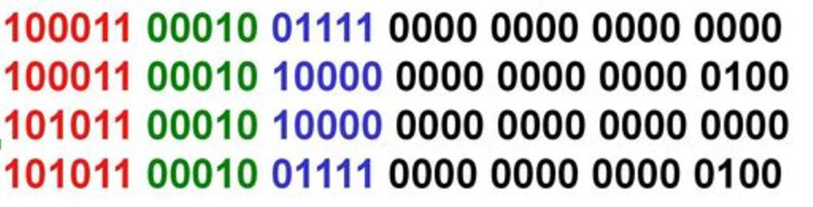

- 优点

  - 代码能被计算机直接识别，==不需要经过编译解析==
  - 直接对硬件产生作用，程序的==执行效率==非常高

- 缺点

  - 程序全是 0 和 1 的指令代码，可读性差，容易出错
  - 不易编写


#### 汇编语言

- 阶段二：汇编语言

  - 为了解决机器语言的缺陷，人们发明了另外一种语言 — 汇编语言
  - 这种语言用==符号==来 代替 0、1 代码（经过汇编器 ，汇编代码再进一步转成二进制）

  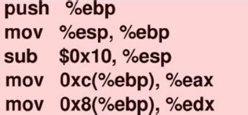

- 优点

  - 像机器语言一样，可以直接访问、控制计算机的各种==硬件==设备
  - 占用内存少，执行速度快

- 缺点

  - 不同的机器（CPU）有不同的汇编语言语法和编译器，代码==缺乏可移植性==
  - 符号非常多，难以记忆
  - 很容易产生 BUG ，难于调试

- 应用场景：操作系统内核、驱动程序、单片机程序


#### 高级语言

- 阶段三：高级语言
  - 高级语言接近自然语言，更符合人类的==思维方式==
- 优点
  - 简单、易用、易于理解，语法和结构类似于普通英文
  - 一个程序还可以在不同的机器上运行，具有==可移植性==
- 缺点
  - 程序不能直接被计算机识别，需要经==编译器==翻译成二进制指令后，才能运行在计算机上
  - 效率要低于机器语言和汇编语言


### JavaScript 的定义

- 维基百科对 JavaScript 的定义
  - JavaScript 是一种==高级的==、==解释型==的编程语言
  - JavaScript 是 一门基于==原型==、==头等函数==的语言，是一门==多范式==的语言，它支持面向对象程序设计、指令式编程以及==函数式编程==
- JavaScript 是一门高级编程语言，是前端开发的重要组成部分


### JavaScript 的历史

- 1994 年，网景公司（Netscape）发布了 Navigator 浏览器 0.9 版

  - 这是历史上第一个比较成熟的网络浏览器
  - 但是，这个版本的浏览器只能用来浏览网页，不具备与访问者交互的能力
  - 网景公司急需一种网页脚本语言，使得浏览器可以与网页互动

  

- 网景公司当时想要选择一种语言来嵌入到浏览器中

  - 采用现有的语言，比如 Perl、Python、Tcl、Scheme 等，允许它们直接嵌入网页
  - 1995 年网景公司招募了 程序员 Brendan Eich，希望将 Scheme 语言作为网页脚本语言

- 就在这时，发生了另外一件大事：1995 年 Sun 公司将 Oak 语言改名为 Java，正式向市场推出

  - Java 推出之后立马在市场上引起了轰动（write once run anywhere）
  - 网景公司决定与 Sun 公司结成联盟，希望 将 Java 嵌入到网页 中来运行

- Brendan Eich 本人非常热衷于 Scheme，对于 Java 不感兴趣，他用 10 天时间设计了 JavaScript

  - 最初这门语言的名字是 Mocha
  - 在 Navigator2.0 beta 版本更名为 LiveScript
  - 在 Navigator2.0 beta 3 版本正式重命名为 JavaScript ，当时是为了给这门语言搭上 Java 这个热词

- 这门语言当时更像是一个多种语言的结合

  - 借鉴 C 语言 的基本语法
  - 借鉴 Java 语言 的数据类型和内存管理
  - 借鉴 Scheme 语言 ，将函数提升到==一等公民==的地位
  - 借鉴 Self 语言 ，使用基于原型（prototype）的继承机制

- 微软公司于 1995 年首次推出 Internet Explorer，从而引发了与 Netscape 的浏览器竞争

  - 微软对 Netscape Navigator 解释器进行了逆向工程，创建了 JScript，以与网景产品进行竞争
  - 这个时候对于开发者来说是一场噩耗，因为需要针对不同的浏览器进行不同的适配

- 1996 年 11 月，网景正式向 ECMA（欧洲计算机制造商协会）提交语言标准

  - 1997 年 6 月，ECMA 以 JavaScript 语言为基础制定了 ECMAScript 标准规范 ==ECMA-262==
  - ECMA 262 是一份标准，定义了 ECMAScript，JavaScript 成为了 ECMAScript 最著名的==实现之一==
  - 除此之外，ActionScript 和 JScript 也都是 ECMAScript 规范的实现语言

- 所以说，==ECMAScript 是一种规范，而 JavaScript 是这种规范的一种实现==


### JavaScript 的组成

ECMAScript 是 JavaScript 的标准，描述了该语言的语法和基本对象
- JavaScript 是 ECMAScript 的语言层面的实现
- 因为除了语言规范之外，JavaScript 还需要对页面和浏览器进行各种操作
- 除了基本实现之外，还包括 DOM 操作和 BOM 操作

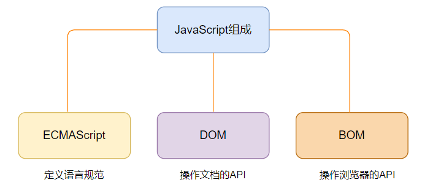


### JavaScript 的应用

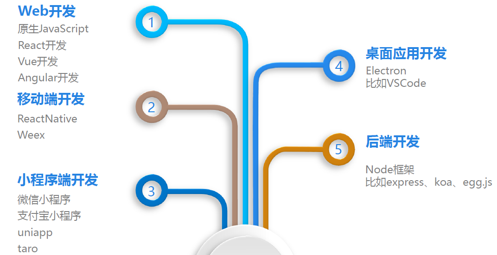


## 基本语法

### 编写方式

- HTML 代码行内（不推荐）

  ```html
  <button onclick="alert(11)">保存</button>
  ```

- script 标签中

  ```html
  <script>
    console.log(Date.now())
  </script>
  ```

- 外部的 script 文件：通过 script 元素的 `src` 属性来引入外部文件

  ```html
  <script src="./index.js"></script>
  ```


### noscript 元素

- `noscript` 元素被用于给不支持 JavaScript 的浏览器提供替代内容

- 下面的情况下 , 浏览器将显示包含在 `noscript` 元素中的内容

  - 浏览器不支持脚本

  - 浏览器对脚本的支持被禁用

  ```html
  <noscript>
    <p>您的浏览器不支持JavaScript或没有开启JavaScript支持</p>
  </noscript>
  ```


### 编写注意事项

- `script` 元素不能写成单标签
  - 在使用外部 js 文件时，script 标签中不可以写 JavaScript 代码（会被覆盖），并且 script 标签不能写成单标签
- 省略 `type` 属性
  - 在早期的代码中，script 标签中会使用 `type=“text/javascript"`
  - 现在不需要，因为 JavaScript 是所有现代浏览器以及 HTML5 中的默认脚本语言
- 加载顺序
  - 作为 HTML 文档内容的一部分，JavaScript 默认遵循 HTML 文档的加载顺序，即自上而下的加载顺序
- JavaScript 代码严格区分大小写
  - HTML 元素和 CSS 属性不区分大小写，但是 在 JavaScript 中严格区分大小写


### 语句和分号

- 语句是向浏览器发出的==指令==，通常表达一个操作或者行为

  ```js
  alert(11);
  console.log(22);
  ```

- 通常每条语句的后面我们会添加一个==分号==，表示语句的结束

  - 当存在==换行符==时，在大多数情况下可以省略分号
  - JavaScript 会将换行符解释成“隐式”的分号


### 注释

- JavaScript 的注释主要分为三种

  - 单行注释

    ```js
    // 单行注释
    ```

  - 多行注释

    ```js
    /*
      多行注释
      多行注释
    */
    ```

  - 文档注释（JS Doc）

    ```js
    /**
     * 是否为数组类型
     * @param {*} variable 变量
     * @returns {boolean}
     */
    function isArray(variable) {
      return Object.prototype.toString.call(variable) === '[object Array]';
    }
    ```

- JavaScript 也不支持注释的嵌套


### 变量

#### 变量的命名格式

- 变量的声明：在 JavaScript 中声明一个变量使用 `var`、`let`、`const` 关键字

- 变量的赋值：使用 `=` 给变量进行赋值

```js
const message = 'Hello World';
let a, b;
```


#### 变量的命名规范

- 第一个字符必须是==字母==、==下划线== 或 美元符号（==$==），其他字符可以是 字母、下划线、美元符号或数字
- 不能使用 [关键字](https://developer.mozilla.org/zh-CN/docs/web/javascript/reference/lexical_grammar#%E5%85%B3%E9%94%AE%E5%AD%97) 和保留字命名
- 变量严格==区分大小写==


## 数据类型

- JavaScript 中的==值==都具有特定的==类型==
- 在 JavaScript 中有 8 种基本的数据类型（7 种原始类型和 1 种复杂类型）
  - Number
  - String
  - Boolean
  - undefined
  - null
  - Object
  - BigInt
  - Symbol


### typeof 操作符

- ECMAScript 的类型系统是松散的，使用 `typeof` ==操作符==可以获取变量的类型
- 对一个值使用 typeof 操作符会返回下列字符串之一
  - `"undefined"`：未定义
  - `"boolean"`：布尔值
  - `"string"`：字符串
  - `"number"`：数值
  - `"object"`：对象（不是函数）或 `null`
  - `"function"`：函数
  - `"symbol"`：符号
- `typeof(x)`：typeof 是一个操作符，并非是一个函数，括号只是将后续的内容当做一个整体


### Number 类型

- `Number` 类型代表==数字==类型（不区分整数和浮点数）

  ```js
  const num1 = 10;
  const num2 = 12.34;
  ```

- 除了常规的数字，还包括所谓的”特殊数值“

  - `Infinity`：类似于数学概念中的无穷大，也可以表示 `-Infinity`
    - 比如 1/0 得到的就是无穷大
  - `NaN`：代表一个计算错误 ，它是一个错误的操作所得到的结果
    - 比如字符串和一个数字相乘

- 数字类型也有其他的进制表示方法

  ```js
  // 十进制
  const num1 = 10;
  // 十六进制
  const num2 = 0xfff;
  // 八进制
  const num3 = 0o111;
  // 二进制
  const num4 = 0b0101;
  ```

- 数字表示的范围

  - 最小正数值 `Number.MIN_VALUE`，小于这个值的数字会被转化为 0
  - 最大正数值 `Number.MAX_VALUE`

- `isNaN()`：用来确定一个值是否为 `NaN`，返回一个布尔值

  ```js
  const num = Number.isNaN(10 * '文字'); // NaN
  ```

  

### String 类型

- JavaScript 中的字符串必须被括在引号里，有三种包含字符串的方式

  - 双引号：`"22"`
  - 单引号：`'11'`
  - 反引号：``

  ```js
  const str1 = '11';
  const str2 = "22";
  const str3 = `33`;
  ```

- 字符串中的转义字符

  | 转义字符 | 表示符号 |
  | -------- | -------- |
  | `\'`     | 单引号   |
  | `\"`     | 双引号   |
  | `\\`     | 反斜杠   |
  | `\n`     | 换行符   |


### Boolean 类型

- `Boolean`（布尔）类型用于表示==真假==

- 布尔是计算机科学中的逻辑数据类型，以发明布尔代数的数学家 乔治 · 布尔 为名

- Boolean 类型仅包含两个值：`true` 和 `false`

  ```js
  const flag = true;
  const isEqual = 1 === 1;
  ```


### undefined 类型

- `undefined` 类型只有一个值，就是特殊值 `undefined` 

- 声明一个变量，但是没有对其进行初始化时，它默认就是 undefined

  ```js
  let name;
  console.log(name); // undefined
  ```

  

### Object 类型

- `Object` 类型是一个特殊的类型，我们通常把它称为==引用类型==或复杂类型

  - 其他的数据类型我们通常称之为==原始类型==，它们的值只保存一个单独的内容
  - Object 往往可以表示一组数据，是其他数据的一个==集合==

- 在 JavaScript 中使用 ==花括号== `{}` 的字面量表示方式来表示一个对象

  ```js
  const info = {
    name: 'xx',
    age: 18
  }
  ```

  

### null 类型

- `null` 类型同样只有一个值，即特殊值 `null`
  - null 类型通常用来表示一个==对象为空==，所以通常我们在给一个对象进行初始化可以赋值为 null
- null 和 undefined 的关系
  - undefined 通常只有在一个变量声明但是未初始化时，它的默认值是 undefined 才会用到
  - 不推荐直接给一个变量赋值为 undefined
  - null 值非常常用，当使用一个变量准备保存一个对象，但是这个对象不确定时，可以先赋值为 null


### 数据类型的转换

- 大多数情况下，运算符和函数会自动将赋予它们的值转换为正确的类型，这是一种==隐式转换==

#### 字符串 String 的转换

- 隐式转换：一个字符串和另一个类型进行操作

  - 如果运算符左右两边有一个是字符串，那么另一边会自动转换成字符串类型进行拼接

  ```js
  '' + 11; // '11'
  ```

- 显式转换

  - 调用 `String()` 函数
  - 调用 `toString` 方法

  ```js
  String(true); // 'true'
  ```

  

#### 数字类型 Number 的转换

- 隐式转换：在算数运算中，通常会将其他类型转换成数字类型来进行运算

  - 比如 `"6" / "3" = 2`
  - 但是如果是 `+` 运算 ，并且其中一边有字符串，那么还是按照字符串来进行拼接

- 显式转换：使用 `Number()` 函数来进行显式的转换

- 其他类型转换数字的规则

  | 值            | 转换后的值                                                   |
  | ------------- | ------------------------------------------------------------ |
  | undefined     | `NaN`                                                        |
  | null          | 0                                                            |
  | true 和 false | 1 和 0                                                       |
  | 字符串        | 去掉首尾空格后的纯数字。如果剩余字符串为==空==，则转换为 ==0== ，否则将从剩余字符串中读取数字，当类型转换出现错误时，返回 `NaN` |


#### 布尔类型 Boolean 的转换

- 布尔类型的转换发生在==逻辑运算==中，也可以通过调用 `Boolean()` 函数进行显式转换
- 转换规则
  - 直观上为 ==“空”== 的值（如 0、空字符串、null 、undefined 和 NaN）将转换为 `false`
  - 其他值变成 `true`
  - 字符串 `"0"` 会转换为 `true`


## 运算符

### 算术运算符

算术运算符用在数学表达式中 , 是对数据进行计算的符号

| 运算符 | 运算规则   | 示例                 |
| ------ | ---------- | -------------------- |
| `+`    | 加法       | 5 + 5 = 10           |
| `+`    | 拼接字符串 | '中' + '国' = '中国' |
| `-`    | 减法       | 8 - 8 = 0            |
| `*`    | 乘法       | 4 * 8 = 32           |
| `/`    | 除法       | 8 / 2 = 4            |
| `%`    | 取余数     | 5 % 2 = 1            |
| `**`   | 幂（ES7）  | 2 ** 4 = 16          |


### 赋值运算符

- 使用 `=` 可以对变量进行赋值

- 链式赋值：链式赋值==从右到左==进行计算，然后将值赋给左边的变量，最后所有变量共享一个值

  ```js
  let a, b, c;
  a = b = c = 2;
  ```


### 原地修改

- 原地修改是对一个变量做运算的简写方式

- 原地修改只能用于变量，不能直接运用于数字

  ```js
  let a = 10, b = 5;
  a += 10; // 20
  b **= 2; // 25
  ```


### 自增、自减

- 自增：`++`

- 自减：`--`

- 自增、自减只能应用于变量，不能直接用于数字

  ```js
  let a = 10;
  a++; // 11
  ```

- 自增、自减可以置于变量前，也可以置于变量后，区别主要在于当用于运算时取到的值是变化前还是变化后

  - 前置形式：`++variable`
  - 后置形式：`variable++`

  ```js
  let a = 1, b = 1;
  console.log(1 + a++); // 2
  console.log(1 + --b); // 1
  ```

  

### 比较运算符

- 用于比较大小的运算符

- 比较运算符的结果都是 Boolean 类型

  | 运算符      | 运算规则           | 示例                                 |
  | ----------- | ------------------ | ------------------------------------ |
  | `==`、`===` | 相等、严格相等     | `'3' == 3`（true）、`'3' === 3`（false） |
  | `!=`、`!==` | 不相等、严格不相等 | '3' !\= 3（false）、'3' !== 3（true） |
  | `>`、`>=`   | 大于、大于等于     | 4 > 3（true）、3 >= 3（true）        |
  | `<`、`<=`   | 小于、小于等于     | 4 \< 3（false）、3 \<= 3（true）       |

- `==` 与 `===` 区别

  - 严格相等运算符 `===` 在进行比较时不会做任何的类型转换
  - 相等运算符 `==` 在比较时可能对不同类型先进行类型转换后再比较，[比较规则](https://developer.mozilla.org/zh-CN/docs/Web/JavaScript/Reference/Operators/Equality)

- 同样的，`!=` 表示不相等，`!==` 表示严格不相等


### 三元运算符

- 用于简化 `if else` 的分支语句

- 使用格式：计算条件结果，如果结果为真，则返回 value1，否则返回 value2

  ```js
  const result = condition ? value1 : value2;
  ```

- 示例

  ```js
  const result = 4 > 3 ? 1 : 2; // 1
  ```


### 逻辑运算符

#### 逻辑或

- `||`：逻辑==或==运算符
- 计算规则
  - 从左到右依次计算操作数
  - 处理每一个操作数时，都将其转化为布尔值
  - 如果结果是 `true`，就停止计算返回这个操作数的==初始值==
  - 如果所有的操作数都被计算过（即转换结果都是 false），则返回==最后一个==操作数

- 返回的值是操作数的==初始形式==，不会转换为 Boolean 类型

```js
console.log(10 || '1'); // 10
console.log('' || null); // null
```


#### 逻辑与

- `&&`：逻辑==与==运算符
- 计算规则
  - 从左到右依次计算操作数
  - 在处理 每一个操作数 时，都将其转化为布尔值
  - 如果结果是 `false`，就==停止计算==，并返回这个操作数的==初始值==
  - 如果所有的操作数都被计算过（都是真值），则返回==最后一个==操作数

- 与运算返回第一个假值，如果没有假值就返回最后一个值

```js
console.log(10 && '1'); // '1'
console.log('' && 10); // ''
```


#### 逻辑非

- `!`：逻辑==非==运算符
- 计算规则
  - 先将操作数转化为布尔类型
  - 返回相反的值
- 两个非运算 `!!` 可以用于将某个值转化为布尔类型

```js
console.log(!'0'); // false
console.log(!!10); // true
```


## 分支语句

- 在程序开发中，程序有三种不同的执行方式
  - 顺序：从上向下，顺序执行代码
  - 分支：根据条件判断，决定执行代码的分支
  - 循环：让特定代码重复 执行

### if 分支语句

- 单分支语句：`if(...)`

  - 计算括号里的条件表达式，如果计算结果是 `true`，就会执行对应的代码块

  ```js
  if (4 > 3) {
    console.log(true); // true
  }
  ```

- 多分支语句：`if.. else..`

  - if 语句有时会包含一个可选的 else 块
  - 如果判断条件成立，则执行 if 语句的块代码；条件不成立，则执行 else 块代码

  ```js
  if (4 < 3) {
    console.log('if');
  } else {
    console.log('else'); // 'else'
  }
  ```

- 多分支结构：`if.. else if.. else..`

  ```js
  const num = 10;
  
  if (num <= 5) {
    console.log('小于等于5');
  } else if (num > 5 && num <= 10) {
    console.log('大于5，小于等于10');
  } else {
    console.log('大于10');
  }
  ```
  
  

### switch 语句

- `switch` 是分支结构的一种语句

  - 通过判断表达式的结果是否等于 case 语句的常量，来执行相应的分支体的
  - 与 if 语句不同的是，switch 语句只能做值的==相等判断== （使用==严格相等== `===`，而 if 语句可以做值的==范围判断==）
  - switch 语句有至少一个 case 代码块和一个可选的 default 代码块

  ```js
  const a = 10;
  
  switch (a) {
    case 10:
      console.log(10); // 10
      break;
    default:
      break;
  }
  ```

- case 穿透：一条 case 语句结束后，默认会自动执行下一个 case 的语句

- `break` 关键字用于阻止 ==case 穿透==


## 循环语句

在 JavaScript 中支持三种循环方式
- `while` 循环
- `do ... while` 循环
- `for` 循环

### while 循环

- `while` 循环语法
  - 当条件成立时，执行代码块
  - 当条件不成立时，跳出代码块
- 必须设置循环结束条件，如果条件一直成立（`true`），那么会产生==死循环==

```js
let count = 1;
while(count < 10) {
  console.log(count);
  count++;
}
```


### do...while 循环

- do..while 循环和 while 循环非常像，二者经常可以相互替代
- do..while 的特点是不管条件成不成立，do 循环体都会==先执行一次==

```js
let count = 1;
do {
  console.log(count);
  count++;
} while(count < 10)
```


### for 循环

- `for` 循环是最常使用的循环形式

- `for` 循环的执行顺序：begin 执行一次，然后进行迭代：每次检查 condition 后，执行 body 和 step

  ```js
  for (begin; condition; step) {
    // 循环体
  }
  ```

  | 语句段         | 举例           | 执行过程                                         |
  | -------------- | -------------- | ------------------------------------------------ |
  | begin          | let i = 0      | 进入循环时执行一次                               |
  | condition      | i < 3          | 在每次循环迭代之前检查，如果为 `false`，停止循环 |
  | body（循环体） | console.log(i) | 条件为 `true` 时，重复执行                       |
  | step           | i++            | 在每次循环体==迭代后执行==                       |

  ```js
  for (let i = 0; i < 3; i++) {
    console.log(i);
  }
  ```


### 循环控制

- 循环的控制

  - 在执行循环过程中，遇到某一个条件时，我们可能想要做一些事情
  - 比如循环体不再执行，跳出循环
  - 比如本次循环体不再执行，执行下一次的循环体

- 循环的控制

  - `break`：直接跳出循环，循环结束
  - `continue`：跳过本次循环，执行下一次循环体

  ```js
  let count = 0;
  
  while(count < 10) {
    count++;
    if (count === 5) continue;
    if (count === 8) break;
    console.log(count)
  }
  ```
  
  

## 函数

- ==函数==其实就是某段代码的==封装==，这段代码帮助我们完成某一个功能
- 在 JavaScript 中，函数也是对象，也可以为函数添加属性

### 声明和调用函数

- 声明函数使用 `function` 关键字，这种写法称之为函数的定义

  ```js
  function 函数名() {
    /* ...封装的代码... */
  }
  ```

  - 函数名的命名规则和前面变量名的命名规则是相同的
  - 函数定义完后里面的代码是==不会执行==的，函数必须==调用==才会执行

- 调用函数：通过 `函数名()` 即可，比如 `test()`

  ```js
  function say() {
    console.log('Hello World!')
  }
  say(); // Hello World!
  ```

  


### 函数的参数

- 参数作用：增加函数的==通用性==，针对相同的数据处理逻辑，能够适应更多的数据

- 形参和实参

  - 形参：==定义==函数时，小括号中的参数，是用来接收参数用的，在函数内部作为变量使用
  - 实参：==调用==函数时，小括号中的参数，用于将数据传递到函数内部

  ```js
  function sum(n1, n2) {
    console.log(n1 + n2);
  }
  sum(1, 2); // 3
  ```


### 函数的返回值

函数不仅仅可以有参数 ，也可以有返回值

- 使用 `return` 关键字来==返回结果==
- 一旦在函数中 执行 return 操作，那么当前函数会终止，后续代码不再执行
- 如果函数中 没有使用 return 语句，那么函数有默认的返回值 `undefined`
- 如果函数使用 return 语句，但是 return 后面没有任何值，那么函数的返回值也是 `undefined`

```js
function sum(n1, n2) {
  return n1 + n2;
}
const result = sum(1, 2); // 3
```


### 函数的递归

- 递归：函数调用自己，在特定条件下结束调用
- 递归是一种重要的编程思想：将一个复杂的任务，转化成可以重复执行的相同任务

```js
function pow(x, n) {
  if (n === 1) return x;
  return x * pow(x, n - 1);
}

console.log(pow(5, 3)); // 125
```


### 局部变量和外部变量

- 在 JavaScript ==ES5 之前==中没有块级作用域的概念，但是==函数==可以定义自己的作用域
  - 作用域表示一些标识符的作用==有效范围== 
  - 函数的作用域表示在函数内部定义的变量，只有在函数内部可以被访问到
- 外部变量和局部变量
  - 定义在函数内部的变量，被称为 局部变量（Local Variables） 
  - 定义在函数外部的变量，被称为 外部变量 
- 全局变量
  - 在函数之外声明的变量，称之为 全局变量
  - 全局变量 在任何函数中都是可访问的
  - 通过 var 声明的全局变量会添加为 window 对象的属性
- 在函数中，访问变量的顺序
  - 优先访问自己函数中的变量，没有找到时，从外部访问


### 函数表达式

- 在 JavaScript 中，函数是一种特殊的值，将函数赋值给变量就叫做函数表达式

- 函数表达式允许省略函数名

  ```js
  const sum = function(n1, n2) {
    return n1 + n2;
  }
  sum(1, 2); // 3
  ```

- 函数声明 和 函数表达式 的创建时机不同

  - 函数表达式是在==代码执行到==达时被创建，并且仅从那一刻起可用
  - 函数声明被定义之前，它就可以被调用
    - 当 JavaScript 准备运行脚本时，首先会在脚本中寻找全局函数声明，并创建这些函数

  

### 回调函数

- 回调函数：将函数==作为参数==传递给另一个函数，在某个时刻调用这个传递的函数，这个被作为参数的函数叫做回调函数

- 匿名函数：如果在传入一个函数时，我们没有指定这个函数的名字，那么这个函数称之为匿名函数

  ```js
  function bar(result) {
    console.log(result);
  }
  function foo(cb) {
    cb(22);
  }
  foo(bar); // 22
  ```

  

### 立即执行函数

- 立即执行函数（Immediately Invoked Function Expression — IIFE 立即调用函数表达式）

  - 一个函数定义完后被立即执行

- 作用：会创建一个独立的==作用域==，可以避免外界访问或修改内部的变量，也避免了外部对内部变量的修改

  ```js
  const btnList = document.querySelectorAll('button');
  
  for (let i = 0; i < btnList.length; i++) {
    (function(i) {
      btnList[i].onclick = function() {
        console.log(`第${i + 1}个按钮被点击`);
      }
    })(i);
  }
  ```

- 立即执行函数的其他写法

  ```js
  !function() {
    console.log(11)
  }();
  
  +function() {
    console.log(22)
  }();
  ```


### 箭头函数

- 箭头函数是 ES6 之后增加的一种编写函数的方法，并且它比函数表达式要更加简洁

  - 箭头函数不会绑定 this、arguments 属性
  - 箭头函数不能作为构造函数来使用 （无显示原型，不能和 `new` 一起来使用，会抛出错误）

- 箭头函数编写方式：`() => {}`

  - `()`：函数的参数
  - `{}`：函数的执行体

  ```js
  const foo = (message) => {
    console.log(message);
  }
  ```

- 箭头函数的编写优化

  - 如果只有一个参数，可以省略 `()`
  - 如果函数执行体中只有一行代码 , 那么可以省略大括号 `{}`
    - 并且这行代码的==返回值==会作为整个函数的返回值
  - 如果函数执行体返回一个对象，那么需要给这个对象加上 `()`

  ```js
  const arr = [1, 2, 3];
  
  arr.forEach(item => {});
  arr.filter(item => item % 2 === 0);
  arr.map(item => ({ name: item }));
  ```


## 对象

- 对象类型是一种存储==键值对==（key - value）的更复杂的数据类型
  - 其中 key 是==字符串== 或 ==Symbol== 类型
  - 其中 value 可以是任意类型，包括基本数据类型、函数类型、对象类型等
- 对象类型底层使用==哈希表==进行实现

### 创建和使用对象

- 对象的创建方法

  - 对象字面量

    ```js
    const info = {
      name: 'obj',
      age: 18
    }
    ```

  - new Object + 动态添加属性

    ```js
    const obj = new Object();
    obj.name = '11';
    ```

  - new 其他类

    ```js
    const date = new Date();
    ```

- 对象的常见操作

  - 访问对象的属性

    ```js
    console.log(location.hash);
    ```

  - 修改对象的属性

    ```js
    location.hash = 'home';
    ```

  - 添加对象的属性

    ```js
    window.age = 18;
    ```

  - 删除对象的属性

    ```js
    const obj = {
      name: 'obj',
      age: 18
    }
    delete obj.name;
    console.log(obj); // { name: 'obj' }
    ```


### 计算属性和遍历对象

- 计算属性：当对象的 key 是一个变量时，可以使用 `[]` 语法动态决定对象的属性名

  ```js
  const key = 'name';
  const obj = {
    [key]: 'obj'
  }
  console.log(obj); // { name: 'obj' }
  ```

- 对象的遍历（迭代）：获取对象中所有的属性和方法

  - `Object.keys()` 方法会返回一个由一个给定对象的自身==可枚举==属性组成的数组

    ```js
    const obj = {
      name: 'obj',
      age: 18
    }
    
    const keyArr = Object.keys(obj);
    
    for (let i = 0; i < keyArr.length; i++) {
      const key = keyArr[i];
      const value = obj[key];
      console.log(key, value);
    }
    ```
  
  - `for...in` 遍历方法

    ```js
    const obj = {
      name: 'obj',
      age: 18
    }
    
    for (const key in object) {
      if (Object.hasOwnProperty.call(object, key)) {
        console.log(key, obj[key]);
      }
    }
    ```


### 值类型和引用类型

- 原始类型的保存方式

  - 在变量中保存的是值本身
  - 所以原始类型也被称之为==值类型==

  ```js
  const male = true;
  const name = 'John Doe';
  const age = 24;
  const adult = true;
  ```

  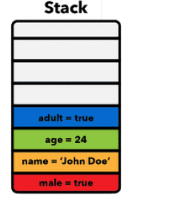

- 对象类型的保存方式

  - 在变量中保存的是对象的“引用”
  - 所以对象类型也被称之为==引用类型==

  ```js
  const person = {
    id: 1,
    name: 'John',
    age: 25
  }
  
  const dog = {
    name: 'puppy',
    personId: 1
  }
  
  function getOwner(dog, persons) {
    return persons.find(person => person.id === dog.personId);
  }
  
  const name = 'John';
  const newPerson = person;
  ```

  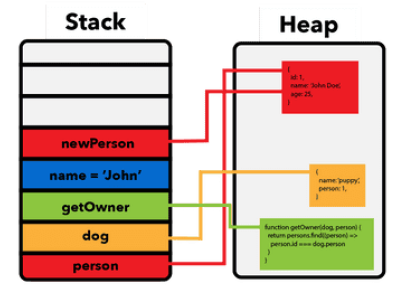

- 内存可以划分为两个区域：栈内存和堆内存

  - ==原始类型==占据的空间是在==栈内存==中分配的
  - ==引用类型==占据的空间是在==堆内存==中分配的

  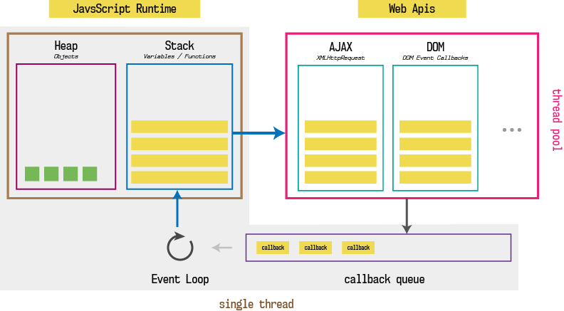


## 常见内置类

### 包装类型

- JavaScript 的原始类型并非对象类型
  - 所以从理论上来说，它们是没有办法获取属性或者调用方法的
  - 但实际上，类似 `'aa'.split('')` 的操作可以正常执行，因为原始类型有其对应的==包装类型==
- 常见的包装类型有：String、Number、Boolean、Symbol、BigInt 类型

- 当我们调用一个原始类型的属性或者方法时，会进行如下操作
  - 根据原始值创建一个原始类型对应的==包装类型对象==
  - 调用对应的属性或者方法，返回一个新的值
  - 创建的包装类对象被销毁
  - 通常 JavaScript 引擎会进行很多的优化，它可以跳过创建包装类的过程在内部直接完成属性的获取或者方法的调用
- `null`、`undefined` 没有任何的方法，也没有对应的“对象包装类”

```js
const num1 = 10;
const num2 = new Number(10);
console.log(typeof num1, typeof num2); // number object
console.log(num1 === num2); // false
```


### Number 类

- Number 类型的数据，它有一个对应的数字包装类型 `Number`

- Number 属性

  - `Number.MAX_SAFE_INTEGER`：JavaScript 中最大的安全整数 `2^53 - 1`
  - `Number.MIN_SAFE_INTEGER`：JavaScript 中最小的安全整数 `-(2^53 - 1)`

- Number 实例方法

  - `toString(base)`：将数字转成字符串，并且按照 base 进制进行转化

    - base 的范围可以从 2 到 36 之间，默认情况下是 10

    - 如果是直接对一个数字操作，需要使用 `..` 运算符

      ```js
      console.log(2..toString()); // '2'
      ```

  - `toFixed(digits)`：格式化一个数字，保留 digits 位的小数，返回值为==字符串==类型

    - digits 的范围是 0 到 20（包含）之间

    ```js
    console.log(2..toFixed(2)); // '2.00'
    ```

- Number 类方法

  - `Number.parseInt(string[, radix])`
    - 将字符串解析成整数，也有对应的全局方法 parseInt
    - radix：指定进制
  - `Number.parseFloat(string)`
    - 将字符串解析成浮点数，也有对应的全局方法 parseFloat


### Math 对象

- 除了 Number 类可以对数字进行处理之外，JavaScript 还提供了一个 `Math` ==对象==

- Math 常见的属性

  - `Math.PI`：圆周率

- Math 常见的方法

  - `Math.floor(n)`：向下取整
  - `Math.ceil(n)`：向上取整
  - `Math.round(n)`：四舍五入取整
  - `Math.random(n)`：生成 0~1 的随机数（包含 0，不包含 1）
  - `Math.pow(x, y)`：返回 x 的 y 次幂

  ```js
  console.log(Math.floor(3.54)); // 3
  console.log(Math.ceil(3.54)); // 4
  console.log(Math.round(3.54)); // 4
  console.log(Math.random()); // 0.1250636779510721
  console.log(Math.pow(3, 2)); // 9
  ```

  

### String 类

- String 类型的数据，它有一个对应的包装类型 `String`

- 字符串的不可变性：字符串在定义后是==不可修改==的

  ```js
  const str = 'str';
  str[0] = 'd';
  console.log(str); // 'str'
  ```
  
- String 常见的属性
  - `length`：获取字符串的长度

#### 访问字符

- 通过字符串的索引 `str[index]`
- 通过 `str.charAt(index)` 方法
- 区别：索引的方式没有找到会返回 undefined，而 charAt() 没有找到会返回==空==字符串

```js
const str = 'Hello World!';
console.log(str[0]); // 'H'
console.log(str.charAt(1)); // 'e'
console.log(str[20], str.charAt(20)); // undefined ''
```


#### 大小写转换

- `toLowerCase()`：将所有的字符转成小写
- `toUpperCase()`：将所有的字符转成大写

```js
const str = 'Hello World!';
console.log(str.toUpperCase()); // 'HELLO WORLD!'
console.log(str.toLowerCase()); // 'hello world!'
```


#### 查找字符串

- `str.indexOf(searchValue[, fromIndex])`：查找字符串位置

  - 从 fromIndex 开始，查找 searchValue 的索引
  - 如果没有找到，那么返回 ==-1==

  ```js
  const str = 'Hello World!';
  console.log(str.indexOf('l', 3)); // 3
  ```

- `str.includes(searchString[, position])`：是否包含字符串

  - 从 position 位置开始查找 searchString，根据情况返回 true 或 false

  ```js
  const str = 'Hello World!';
  console.log(str.includes('l', 4)); // true
  ```


#### 开头和结尾

- `str.startsWith(searchString[, position])`：是否以 xxx 开始

  - 从 position 位置开始，判断字符串是否以 searchString 开头

  ```js
  const str = 'Hello World!';
  console.log(str.startsWith('o', 4)); // true
  ```

- `str.endsWith(searchString[, length])`：是否以 xxx 结尾

  - 在 length 长度内，判断字符串是否以 searchString 结尾

  ```js
  const str = 'Hello World!';
  console.log(str.endsWith('o', 5)); // true
  ```


#### 字符串替换/截取

- `str.replace(regexp | substr, newSubStr | function)`：字符串替换，生成新字符串

  - 查找到对应的字符串，并且使用新的字符串进行替代
  - 也可以传入一个正则表达式来查找，也可以传入一个函数来替换

  ```js
  const str = 'Hello World!';
  console.log(str.replace(/l/g, 'v')); // 'Hevvo Worvd!'
  ```

- 字符串截取

  | 方法                  | 选择方式                      | 负数参数   |
  | --------------------- | ----------------------------- | ---------- |
  | slice(start, end)     | 从 start 到 end（不包含 end） | 允许       |
  | substring(start, end) | 从 start 到 end（不包含 end） | 负值代表 0 |

  ```js
  const str = 'Hello World!';
  console.log(str.slice(-1)); // '!'
  console.log(str.substring(6, 8)); // 'Wo'
  ```

  

#### 其他方法

- `str.contact(str2[, ...strN])`：拼接字符串

  ```js
  console.log('Hello'.concat(' ', 'World', '!')); // 'Hello World!'
  ```

- `str.trim()`：删除首位空格

  ```js
  console.log(' Hello World! '.trim()); // 'Hello World!'
  ```

- `str.split([separator[, limit]])`：字符串分割

  - separator：以什么字符串进行分割，也可以是一个正则表达式
  - limit：限制返回片段的数量

  ```js
  console.log('h e l l o'.split(' ', 3)); // ['h', 'e', 'l']
  ```


### 数组 — Array

- 对象允许存储键值集合，属性值没有固定的顺序

  - 某些情况需要一种==有序的集合==，里面的元素是按照某一个顺序来排列
  - 这个有序的集合，我们可以通过==索引==来获取到它，这个集合就是==数组==
  - 数组元素的索引从 `0` 开始编号

- 数组是一种特殊的==对象==类型

  ```js
  console.log(typeof []); // 'object'
  ```

#### 数组的创建方式

- 字面量方式

  ```js
  const arr = ['1', '2'];
  ```

- `new Array()`

  ```js
  const arr = new Array('1', '2');
  ```


#### 基本操作

- 访问元素

  - 通过 `[]` 进行访问

  - 通过 `arr.at()` 进行访问，支持==负数==索引

  ```js
  const arr = [1, 2, 3];
  console.log(arr[1]); // 2
  console.log(arr.at(-1)); // 3
  ```

- 修改元素

  ```js
  const arr = [1, 2];
  arr[0] = 2;
  ```

  

#### 添加、删除操作

- `push()`：接收==任意数量==的参数，添加到数组末尾，返回==新数组的长度==

- `pop()`：删除数组的最后一个元素，返回==被删除的元素==

- `shift()`：删除数组的第一项，返回被删除的元素

- `unshift()`：接收==任意数量==的参数，添加到数组开头，返回==新数组的长度==

- `splice()`：最强大的数组方法，该方法会==修改原数组==

  - ==删除==：需要给 `splice()` 传入==2==个参数
    - 第一个参数 (**必选**)：开始删除的索引
    - 第二个参数 (**可选**)：删除的个数，不选则删除到尾
    
    ```js
    const arr = [1, 2, 3, 4]
    console.log(arr.splice(1)) // [2, 3, 4]
    console.log(arr) // [1]
    ```

  - ==插入==：需要传入==3==个参数
    
    - 第一个参数：开始的位置
    - 第二个参数：==0==（要删除的元素个数）
    - 第三个参数（可以是任意个）：要插入的元素
    
    ```js
    const arr = [1, 2, 3, 4]
    console.log(arr.splice(1, 0, 8, 8)) // []
    console.log(arr) // [1, 8, 8, 2, 3, 4]
    ```
  
  - ==替换==：需要传入==3==个参数
    
    - 第一个参数：开始的位置
    - 第二个参数：要删除(替换)的元素的个数
    - 第三个参数（可以是任意个）：要插入的元素
    
    ```js
    const arr = [1, 2, 3, 4]
    console.log(arr.splice(1, 2, 8, 8, 8)) // [2, 3]
    console.log(arr) // [1, 8, 8, 8, 4]
    ```
  
  - ==返回值==：返回一个数组，包含从数组中被删除的元素（没有删除元素则返回一个==空数组==）


#### length 属性

- `length` 是一个==可读写==属性，用于修改和获取数组的长度

  - 当我们修改数组的时候，length 属性会自动更新

  - 如果手动增加一个大于默认 length 的数值，那么会增加数组的长度 

    ```js
    const arr = [1, 2];
    arr.length = 3;
    console.log(arr); // [1, 2, <1 empty item>]
    ```

  - 如果减少 length，数组就会被截断

    ```js
    const arr = [1, 2, 3];
    arr.length = 1;
    console.log(arr); // [1]
    ```

- 清空数组最简单的方法：`arr.length = 0;`


#### 数组的遍历

- `for` 循环

  ```js
  const arr = [1, 2, 3];
  
  for (let i = 0; i < arr.length; i++) {
    console.log(arr[i]);
  }
  ```

- `for...in`，获取到索引值

  ```js
  const arr = [1, 2, 3];
  
  for (const index in arr) {
    console.log(arr[index]);
  }
  ```

- `for...of`，获取到每个元素

  ```js
  const arr = [1, 2, 3];
  
  for (const item of arr) {
    console.log(item);
  }
  ```


#### 查找元素

- `arr.indexOf(searchElement[, fromIndex])`：查找某个元素的索引

  - 从 fromIndex 开始查找，如果找到返回对应的索引，没有找到返回 ==-1==

  ```js
  const arr = [1, 2, 3];
  console.log(arr.indexOf(2)); // 1
  ```

- `arr.includes(searchElement[, fromIndex])`：判断数组是否包含某个元素

  - 从 fromIndex 开始搜索，如果找到则返回 true
  - 与 indexOf 区别：可以判断是否含有 `NaN`

  ```js
  const arr = [1, 2, 3];
  console.log(arr.includes(5)); // false
  ```

- `arr.find(cb)`：查找元素，返回数组中满足提供的测试函数的第一个元素的值（同一引用）

  ```js
  const arr = [
    { id: 1, price: 20 },
    { id: 2, price: 30 }
  ];
  console.log(arr.find(item => item.id === 2)); // { id: 2, price: 30 }
  ```

- `arr.findIndex(cb)`：查找元素，返回数组中满足提供的测试函数的第一个元素的索引

  ```js
  const arr = [
    { id: 1, price: 20 },
    { id: 2, price: 30 }
  ];
  console.log(arr.findIndex(item => item.id === 2)); // 1
  ```


#### 排序

- `sort()`：用于对数组进行排序，并且生成一个排序后的新数组，同时原数组也已同步修改

  ```js
  const arr = [1, 3, 2];
  console.log(arr.sort((a, b) => b - a)); // [3, 2, 1]
  console.log(arr);
  ```

- `reverse()`：将数组中元素的位置逆序，并返回该数组，同时原数组也已同步修改

  ```js
  const arr = [1, 2, 3];
  console.log(arr.reverse()); // [1, 2, 3]
  console.log(arr); // [1, 2, 3]
  ```


#### 高阶函数

- `arr.forEach(cb)`：遍历数组

  ```js
  const arr = [1, 2, 3];
  arr.forEach(item => console.log(item)); 
  ```

- `arr.map(cb)`：映射数组

  ```js
  const arr = [1, 2, 3];
  console.log(arr.map(item => item ** 2)); // [1, 4, 9]
  ```

- `arr.filter(cb)`：过滤元素

  ```js
  const arr = [1, 2, 3];
  console.log(arr.filter(item => item % 2 === 0)); // [2]
  ```

- `arr.reduce(cb[, initialValue])`：数组归并

  ```js
  const arr = [1, 2, 3];
  console.log(arr.reduce((prev, curr) => prev * curr, 1)); // 6
  ```


#### 其他方法

- `arr.slice([begin[, end]])`：数组截取

  ```js
  const arr = [1, 2, 3];
  console.log(arr.slice(0, 2)); // [1, 2]
  ```

- `arr.join([separator])`：拼接所有元素，生成一个字符串

  ```js
  const arr = [1, 2, 3];
  console.log(arr.join('*')); // 1*2*3
  ```

  

### 时间 — Date

#### 时间基本概念

- 最初，人们是通过观察太阳的位置来决定时间
  - 这种方式有一个最大的弊端就是不同区域位置大家使用的时间是不一致的
  - 相互之间没有办法通过一个统一的时间来沟通、交流
- 之后，人们开始制定的标准时间是英国伦敦的皇家格林威治天文台的标准时间 （刚好在本初子午线经过的地方）
  - 这个时间也称之为 ==GMT==
  - 其他时区根据标准时间来确定自己的时间，往东的时区（GMT+ hh:mm），往西的时区（GMT- hh:mm）
  
- 但是公转有一定的误差，也会造成 GMT 的时间会造成一定的误差，于是就提出了根据==原子钟==计算的标准时间 ==UTC==
- 目前 GMT 依然在使用，主要表示的是某个时区中的时间，而 ==UTC 是 标准时间==


#### 创建 Date 对象

使用 `Date` 构造函数来创建时间对象

```js
const date1 = new Date();
const date2 = new Date(1667124371247);
const date3 = new Date('2022-10-30');
const date4 = new Date(2022, 10, 30, 18, 6, 22, 456);

console.log(date1); // Sun Oct 30 2022 18:11:46 GMT+0800 (中国标准时间)
console.log(date2); // Sun Oct 30 2022 18:06:11 GMT+0800 (中国标准时间)
console.log(date3); // Sun Oct 30 2022 08:00:00 GMT+0800 (中国标准时间)
console.log(date4); // Wed Nov 30 2022 18:06:22 GMT+0800 (中国标准时间)
```


#### 日期表示方式

- 日期的表示方式有两种：RFC 2822 标准、ISO 8601 标准

  - RFC 2822 标准

    ```js
    const date = new Date('2022-10-30');
    console.log(date); // Sun Oct 30 2022 08:00:00 GMT+0800 (中国标准时间)
    ```

  - ISO 8601 标准

    ```js
    const date = new Date('2022-10-30');
    console.log(date.toISOString());
    /*
    	2022-10-30T00:00:00.000Z
    	T: 分隔日期和时间，没有特殊含义，可以省略
    	.sss：毫秒
    	Z: 时区
    */
    ```

- 从 Date 对象中获取各种详细的信息

  ```js
  const date = new Date('2022-10-30 18:25:33.123');
  
  // 获取年份
  console.log(date.getFullYear()); // 2022
  // 获取月份，索引从 0 开始
  console.log(date.getMonth()); // 9
  // 获取日期
  console.log(date.getDate()); // 30
  // 获取小时
  console.log(date.getHours()); // 18
  // 获取分钟
  console.log(date.getMinutes()); // 25
  // 获取秒
  console.log(date.getSeconds()); // 33
  // 获取毫秒
  console.log(date.getMilliseconds()); // 123
  ```


#### 获取 Unix 时间戳

- Unix 时间戳：它是一个整数值，表示自 1970 年 1 月 1 日 00:00:00 UTC 以来的==毫秒数==
- 在 JavaScript 中，有多种方法可以获取这个时间戳
  - `new Date().getTime()`
  - `new Date().valueOf()`
  - `+new Date()`
  - `Date.now()`

- `Date.parse(str)` ：从一个字符串中读取日期，并且输出对应的 Unix 时间戳
  - 需要符合 RFC2822 或 ISO 8601 日期格式的字符串
  - 如果输入的格式不能被解析，会返回 `NaN`


## 错误处理

### throw 关键字

`throw` 关键字用于抛出一个用户自定义的异常

- 会终止发生异常代码的执行，并向上抛出一个错误
- `throw` 后面可以跟上一个表达式来表示具体的异常信息
- 发生异常后，如果没有捕获异常，异常会一层层向上抛，到达顶层作用域后依然没有捕获，则会终止代码执行

```js
function foo() {
  throw 'Error';
}

foo();
```


### Error 类

- JavaScript 已经内置了一个 `Error` 类，用于创建错误类型

- **Error** 包含三个属性

  - `messsage`：创建 Error 对象时传入的 message
  - `name`：Error 的名称，通常和类的名称一致
  - `stack`：整个 Error 的错误信息，包括函数的调用栈

- **Error** 有一些自己的子类

  | 类          | 描述                           |
  | ----------- | ------------------------------ |
  | RangeError  | 下标值越界时使用的错误类型     |
  | SyntaxError | 解析语法错误时使用的错误类型   |
  | TypeError   | 出现类型错误时，使用的错误类型 |
  | ......      | ......                         |


### 异常的捕获

- 使用 `try...catch` 结构可以捕获异常，后续代码会继续执行

  ```js
  function foo() {
    throw new Error('出错了');
  }
  
  try {
    foo();
  } catch (error) {
    console.log(error.message); // 出错了
  }
  ```

- 在 ES10 中，`catch` 后面绑定的 error 可以省略

  ```js
  try {
    
  } catch {
    
  }
  ```

- 如果有一些必须要执行的代码，可以使用 `finally` 来执行

  - `finally` 表示最终一定会被执行的代码结构
  - 如果 try 和 finally 中都有返回值，那么会使用 ==finally== 当中的返回值

  ```js
  function foo() {
    try {
      return 'try';
    } catch {
    } finally {
      return 'finally'
    }
  }
  
  console.log(foo()); // 'finally'
  ```


## DOM 操作

### 认识 DOM

- DOM：==文档对象模型==
  - 浏览器将页面所有的内容抽象为可以修改的==对象==
  - 整个文档被抽象到 `document` 对象中

- DOM Tree

  - 一个页面不只是有 html、head、body 元素，也包括很多的子元素
  - 在 html 结构中，最终会形成一个树结构
  - 在抽象成 DOM 对象的时候，它们也会形成一个==树结构==，称之为 DOM Tree

  ```html
  <!DOCTYPE html>
  <html lang="en">
  <head>
    <meta charset="UTF-8">
    <title>Document</title>
  </head>
  <body>
    <h1>A Heading</h1>
    <a href="#">Link Text</a>
  </body>
  </html>
  ```

  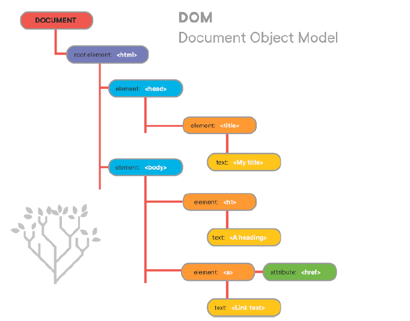


### DOM 继承关系

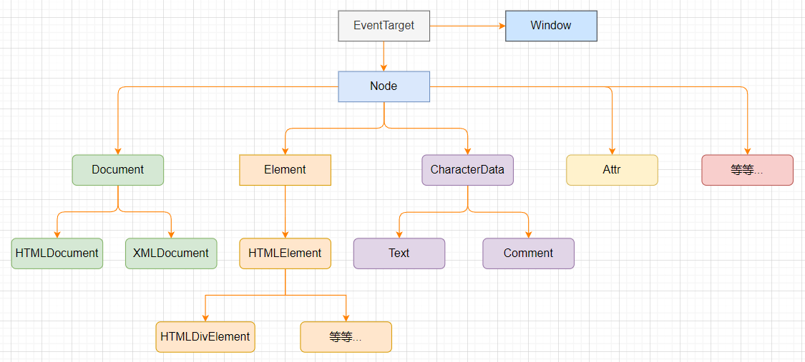


### document 对象

- Document 节点表示的整个载入的网页，它的实例是全局的 `document` 对象
  - 对 DOM 的所有操作都是 从 document 对象开始的
  - 它是 DOM 的入口点，可以从 document 开始去访问任何节点元素
- 对于最顶层的 html、head、body 元素，可以直接从 document 对象中获取到
  - html 元素：`document.documentElement`
  - body 元素：`document.body`
  - head 元素：`document.head`
  - 文档声明：`document.doctype`


### 节点、元素导航

#### 节点导航

- 获取到一个节点（==Node==）后，可以根据这个节点去获取其他的节点

- 节点之间存在如下的关系

  - 父节点：`parentNode`
  - 前兄弟节点：`previousSibling`
  - 后兄弟节点：`nextSibling`
  - 子节点：`childNodes`
  - 第一个子节点：`firstChild`
  - 第二个子节点：`lastChild`

  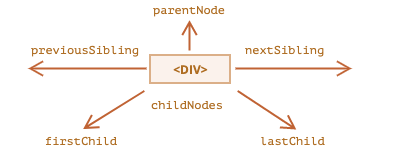


#### 元素导航

- 获取到一个元素（==Element==）后，可以根据这个元素去获取其他的元素
- 节点之间存在如下的关系
  - 父元素：`parentElement`
  - 前兄弟节点：`previousElementSibling`
  - 后兄弟节点：`nextElementSibling`
  - 子节点：`children`
  - 第一个子节点：`firstElementChild`
  - 第二个子节点：`lastElementChild`


#### 表单元素的导航

- `form` 元素可以直接通过 document 来获取：`document.forms`

- form 元素中的内容可以通过 elements 来获取：`form.elements`

- 可以通过子表单的 `name` 属性获取子表单元素

```html
<form>
  <input type="text" name="name">
  <input type="number" name="age">
</form>

<script>
  const form = document.forms[0];
  const elements = form.elements;
  document.addEventListener('click', function() {
    console.log('姓名：', elements.name.value);
    console.log('年龄：', elements.age.value);
  })
</script>
```


### 获取元素

- 当元素彼此靠近或者相邻时，DOM 导航属性非常有用

- 如果要获取任意元素，需要借助 DOM 提供的一些获取元素的方法

  | 方法名                 | 搜索方式   | 是否可以在元素上调用 | 是否实时更新 |
  | ---------------------- | ---------- | :------------------: | :----------: |
  | querySelector          | CSS 选择器 |          ✅           |      ❌       |
  | querySelectorAll       | CSS 选择器 |          ✅           |      ❌       |
  | getElementById         | id         |          ❌           |      ❌       |
  | getElementsByClassName | tag or '*' |          ✅           |      ✅       |
  | getElementsByTagName   | class      |          ✅           |      ✅       |

  

### 节点的属性

#### nodeType

- `nodeType` 属性提供了一种获取==节点类型==的方法

  - 它是一个数值型值

- 常见的 [节点类型](https://developer.mozilla.org/zh-CN/docs/Web/API/Node/nodeType) 有如下

  | 常量               | 值   | 描述                         |
  | ------------------ | ---- | ---------------------------- |
  | Node.ELEMENT_NODE  | 1    | 一个元素节点，例如 div       |
  | Node.TEXT_NODE     | 3    | Element 或 Attr 中实际的文字 |
  | Node.COMMENT_NODE  | 8    | 一个 Comment 节点            |
  | Node.DOCUMENT_NODE | 9    | 一个 Document 节点           |


#### nodeName / tagName

- `nodeName`：获取 Node 节点的名字
- `tagName`：获取元素的标签名字
- 区别
  - tagName 属性仅适用于 Element 节点
  - nodeName 是为任意 Node 定义的


#### innerHTML / textContent

- `innerHTML` 属性

  - 获取元素中的 HTML 字符串形式
  - 设置元素中的内容

- `textContent` 属性

  - 仅仅获取元素中的文本内容

  - 与 `innerText` 的区别

    - innerText 是 `HTMLElement` 的属性，textContent 是 `Node` 的属性
    - textContent 会返回节点中的每一个元素；相反，innerText 受 CSS 样式的影响，并且不会返回==隐藏元素==的文本

    ```html
    <div>
      <span>11</span>
      <span >22</span>
    </div>
    
    <script>
      const box = document.querySelector('.box');
      console.log(box.textContent); // '\n    11\n    22\n  '
      console.log(box.innerText); // '11'
    </script>
    ```

- innerHTML 和 textContent 的区别

  - 使用 innerHTML，我们将其 “作为 HTML” 插入，带有所有 HTML 标签
  - 使用 textContent，我们将其 “作为文本”插入，所有符号均按字面字符串处理


### 元素特性 — attribute

- 一个元素除了有开始、结束标签和内容之外，还有很多的 `attribute`（属性）

  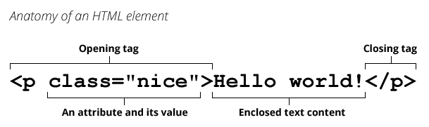

- 浏览器在解析 HTML 元素时，会将对应的 attribute 也创建出来放到对应的==元素对象==上

  - id、class 就是==全局==的 attribute，会有对应的 id、class 属性
  - href 属性 是针对 a 元素的

- 属性 attribute 的分类

  - 标准的 attribute：比如 id、class、value 等
  - 非标准的 attribute：自定义的属性，比如 abc 、 age 等

  ```html
  <div class="box" name="box">11</div>
  ```

- 对于所有的 attribute 访问都支持如下方法

  - `hasAttribute(name)`：检查特性是否存在
  - `getAttribute(name)`：获取特性值
  - `setAttribute(name, value)`：设置特性值
  - `removeAttribute(name)`：移除特性
  - `attributes`：特性的集合，具有 name、value 属性

- attribute 具备的特征

  - 它们的名字是大小写不敏感的（id 与 ID 相同）
  - 它们的值总是==字符串==类型的


### 元素属性 — property

- 对于标准的 `attribute`，会在 DOM 对象上创建与其对应的 `property` 属性

- 在大多数情况下，它们是相互作用的，推荐使用 property 的方式

  - 改变 property，通过 attribute 获取的值，会随着改变
  - 通过 attribute 操作修改，property 的值会随着改变

  ```js
  document.body.setAttribute('class', 'body');
  console.log(document.body.className); // body
  document.body.className = 'io';
  console.log(document.body.getAttribute('class')); // io
  ```


### 元素的 class、style

#### className 和 classList

- 元素的 `class` attribute，对应的 property 并非叫 class，而是 `className`

  - 这是因为 JavaScript 早期是不允许使用 class 这种关键字来作为对象的属性，所以 DOM 规范使用了 className
  - 虽然现在 JavaScript 已经没有这样的限制，但是依然在使用 className 这个名称

- 我们可以对 className 进行赋值，它会替换整个类中的字符串

  ```js
  const box = document.querySelector('.box');
  box.className = 'demo';
  ```

- 需要添加或者移除单个的 class，可以使用 `classList` 属性

  - `classList.add(class)`：添加一个类
  - `classList.remove(class)`：移除类
  - `classList.toggle(class)`：如果类不存在就添加类，存在就移除它
  - `classList.contains(class)`：检查是否含有给定类，返回布尔值

  ```js
  const box = document.querySelector('.box');
  box.classList.toggle('active');
  ```

- `classList` 是==可迭代对象==，可以通过 for...of 进行遍历


#### 元素的 style 属性

- 单独修改某一个 CSS 属性，可以通过 `style` 来操作

  - 对于多词属性，使用==驼峰式==

  ```js
  const box = document.querySelector('.box');
  box.style.color = 'red';
  ```

- 将值设置为空字符串，那么会使用 CSS 的==默认==样式

- 多个样式的写法，需要使用 `cssText` 属性

  ```js
  const box = document.querySelector('.box');
  box.style.cssText = 'color: red; font-size: 20px';
  ```


#### 读取元素样式

- 对于内联样式，可以通过 `style.*` 的方式读取到

- 对于 style 标签、css 文件中的样式，需要借助全局函数 `getComputedStyle` 获取

  ```js
  const box = document.querySelector('.box');
  console.log(getComputedStyle(box).width);
  ```

  

### 元素操作

#### 创建元素

`document.createElement(tagName)`：创建元素

```js
const div = document.createElement('div');
div.className = 'box';
document.body.append(div);
```


#### 插入元素

- `node.append(...nodes or strings)`：在 node ==末尾==插入节点或字符串
- `node.prepend()`：在 node ==开头==插入节点或字符串
- `node.before()`：在 node ==前面==插入节点或字符串
- `node.after()`：在 node ==后面==插入节点或字符串
- `node.replaceWith()`：将 node ==替换==为给定的节点或字符串

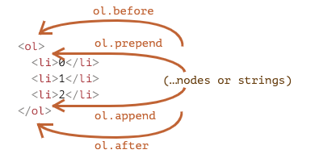


#### 移除和克隆元素

- `node.remove()`：移除 node 本身
- `node.cloneNode(deep)`：克隆节点
  - 可以传入一个 Boolean 类型的值，来决定是否是==深度克隆==
  - 深度克隆会完全克隆对应元素的子元素，否则是浅克隆


### 元素的大小和滚动

- `clientWidth`：contentWith + padding（不包含滚动条）
- `clientHeight`：contentHeight + padding
- `clientTop/clientLeft`：border-top/left 的宽度
- `offsetWidth/offsetHeight`：元素完整的宽度/高度
- `offsetLeft/offsetTop`：距离最近的父定位元素左上角的距离 x/y
- `scrollHeight`：整个可滚动的区域高度
- `scrollTop`：滚动卷去部分的高度

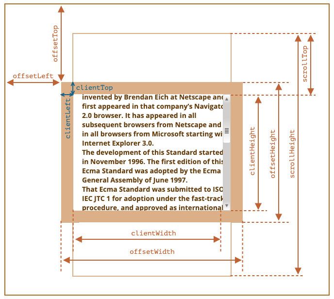


### window 的大小和滚动

- window 的 width 和 height
  - `innerWidth/innerHeight`：获取 window 窗口的宽度和高度（包含滚动条）
  - `outerWidth/outerHeight`：获取 window 窗口的整个宽度和高度（包括调试工具、工具栏）
- window 的滚动位置
  - `scrollX`：X 轴滚动的位置（别名 `pageXOffset`）
  - `scrollY`：Y 轴滚动的位置（别名 `pageYOffset`）
- 滚动方法
  - `scrollBy(x, y)`：将页面滚动至==相对==于当前位置的 (x, y) 位置
  - `scrollTo(pageX, pageY)` 将页面滚动至==绝对坐标==


## 事件处理

### 认识事件

- 事件：用于捕获用户的操作，根据对应的交互响应不同的处理程序

- 事件监听的方式

  - 将事件监听函数直接写在 html 中（不推荐）

    ```html
    <div onclick="alert(11)">click!</div>
    ```

  - DOM 属性，通过元素的 `on[事件名]` 来监听事件

    ```js
    const box = document.querySelector('.box');
    box.onclick = function() {
      alert(11);
    }
    ```

  - 通过 EventTarget 中的 `addEventListener` 来监听

    ```js
    const box = document.querySelector('.box');
    box.addEventListener('click', function() {
      alert(111);
    });
    ```

    

### 事件流

- 事件流：当一个元素触发事件时（比如点击），不仅仅是这个元素本身，因为 HTML 元素是存在父子元素叠加层级
- 两种事件流
  - 早期浏览器开发时，IE 和 Netscape 公司都发现了事件流的形成
  - IE 采用了事件冒泡的方式，Netscape 采用了事件捕获的方式

- 事件冒泡

  - 默认情况下事件从==最内层向外==依次传递，这个顺序称之为==事件冒泡==

  ```js
  document.addEventListener('click', function() {
    console.log('发生点击事件')
  });
  ```

- 事件捕获

  - 事件从==最外层向内==依次传递，这个顺序称之为==事件捕获==

  ```js
  document.addEventListener('click', function() {
    console.log('发生点击事件')
  }, true); // 传递true代表监听事件捕获阶段
  ```

- 事件触发的完整阶段（可以通过 `event.eventPhase` 获取事件当前的阶段）

  - 捕获阶段（Capturing phase）：事件（从 window ）向下走近元素
  - 目标阶段（Target phase）：事件到达目标元素
  - 冒泡阶段（Bubbling phase）：事件从元素上开始冒泡

  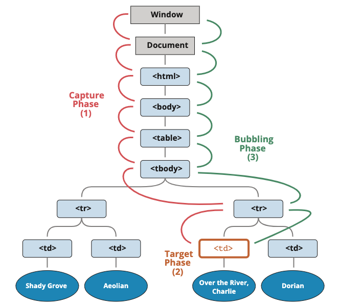


### 事件对象

- 当一个事件发生时，就会有和这个事件相关的很多信息

  - 比如事件的类型是什么，事件发生于哪一个元素、位置信息等
  - 这些信息会被封装到一个 `Event` 对象中，这个对象由==浏览器==创建

- `event` 对象会在传入的事件处理函数==回调==时，被系统传入，可以在回调函数中拿到这个 event 对象

  ```js
  document.addEventListener('click', function(event) {
    console.log('事件对象', event);
  });
  ```

- 常见的属性

  - `type`：事件的类型
  - `target`：当前事件发生的元素
  - `currentTarget`：当前处理事件的元素（比如子元素触发事件，但是在父元素上添加监听，这时候 currentTarget 是父元素）
  - `eventPhase`：事件所处的阶段
  - `offsetX/offsetY` ：事件发生在元素内的位置
  - `clientX/clientY`：事件发生在客户端内的位置
  - `pageX/pageY`：事件发生在客户端相对于 document 的位置

- 常见的方法

  - `preventDefault()`：取消事件的默认行为
  - `stopPropagation`：阻止事件的进一步传递（冒泡和捕获都可以阻止）


### EventTarget

- 我们会发现，所有的节点、元素、包括 window，都继承自 `EventTarget`

- EventTarget 是一个 DOM 接口 ，主要用于==添加==、==删除==、==派发== `Event` 事件

- 常见的方法

  - `addEventListener`：注册某个事件类型以及事件处理函数
  - `removeEventListener`：移除某个事件类型以及事件处理函数
  - `dispatchEvent`：派发某个事件类型到 EventTarget 上

  ```js
  // 监听自定义事件
  document.addEventListener('custom', function() {
    console.log('自定义事件');
    console.log(event.detail);
  });
  
  // 派发方式一：通过 Event
  document.dispatchEvent(new Event('custom'));
  // 派发方式二（携带参数）：通过 CustomEvent，可以通过detail属性传递数据
  document.dispatchEvent(new CustomEvent('custom', { detail: '11' }))
  ```

  

### 事件委托

- 当子元素触发事件时，父元素可以通过冒泡可以监听到子元素的事件触发
- 并且可以通过 `event.target` 获取到当前监听的元素
- 因此当多个子元素都需要监听同一个事件时，可以将事件处理==委托==给父元素

```html
<div id="box">
  <button data-index="1">按钮1</button>
  <button data-index="2">按钮2</button>
  <button data-index="3">按钮3</button>
  <button data-index="4">按钮4</button>
</div>

<script>
  const box = document.getElementById('box');
  box.addEventListener('click', function(e) {
    const { index } = e.target.dataset;
    console.log(`第${index}个按钮被点击`);
  })
</script>
```


### 常见事件

- 常见鼠标事件

  | 事件        | 描述                                   |
  | ----------- | -------------------------------------- |
  | click       | 点击某个对象时触发                     |
  | contextmenu | 点击鼠标右键打开上下文菜单时触发       |
  | dblclick    | 双击某个对象时触发                     |
  | mouseover   | 鼠标移到元素上（支持冒泡）             |
  | mouseout    | 鼠标从某元素移开（支持冒泡）           |
  | mouseenter  | 鼠标指针移动到元素上触发（不支持冒泡） |
  | mouseleave  | 鼠标指针移出元素时触发（不支持冒泡）   |

- 常见键盘事件

  | 事件    | 描述                         |
  | ------- | ---------------------------- |
  | keydown | 键盘按键被按下的瞬间触发     |
  | keyup   | 键盘按键按下后抬起的瞬间触发 |

- 常见表单事件

  | 事件   | 描述                                 |
  | ------ | ------------------------------------ |
  | change | 表单元素内容发生改变并失去焦点时触发 |
  | input  | 表单元素输入时就会触发               |
  | focus  | 表单元素获取焦点时触发               |
  | blur   | 表单元素失去焦点时触发               |
  | reset  | form 表单重置时触发                  |
  | submit | form 表单提交时触发                  |

- 文档加载事件

  - `DOMContentLoaded`：浏览器已完全加载 HTML，并构建了 DOM 树，但像图片和样式表之类的外部资源可能尚未加载完成
  - `load`：浏览器不仅加载完成了 HTML，还加载完成了所有外部资源（图片、样式等）


## BOM 操作

### 认识 BOM

- BOM：==浏览器对象模型==
  - 由浏览器提供的用于处理文档（document）之外的所有内容的其他对象
  - 比如 navigator、location、history 等对象

- JavaScript 有一个非常重要的运行环境就是浏览器
  - 浏览器本身又作为一个应用程序需要对其本身进行操作

  - 所以通常浏览器会有对应的对象模型

  - BOM 看成是==连接 JavaScript 脚本与浏览器窗口==的桥梁

- BOM 主要包括的对象模型
  - `window`：包括全局属性、方法，控制浏览器窗口相关的属性、方法
  - `location`：浏览器连接到的对象的位置 URL
  - `history`：操作浏览器的历史
  - `navigator`：用户代理（浏览器）的状态和标识
  - `screen`：屏幕窗口信息


### window 对象

- `window` 对象在浏览器中具有两个身份

  - 全局对象
    - ECMAScript 规范中的全局对象 `globalThis`，这个全局对象在 Node.js 中是 global
    - 放在 window 对象上的所有属性都可以被访问
  - 浏览器窗口对象：作为浏览器窗口时，提供了对浏览器操作的相关的 API

- `window` 对象上包含许多属性和方法

  - 包含大量的属性：localStorage、console、location、history、screenX、scrollX 等

    ```js
    window.console.log(11);
    ```

  - 包含大量的方法：setTimeout、setInterval、close、scrollTo、open 等

    ```js
    window.setTimeout(() => {
      console.log('5s后触发');
    }, 5000);
    
    window.setInterval(() => {
      console.log('间隔5s触发一次');
    }, 5000);
    ```

  - 包含大量的事件：load、hashchange 等

    ```js
    window.onload = function() {
      console.log('load complete');
    }
    ```

  - 包含从 EventTarget 继承过来的 addEventListener、removeEventListener、dispatchEvent 方法

    ```js
    window.addEventListener('click', (event) => {
      console.log(event.target);
    })
    ```


### location 对象

- `location` 对象用于表示 window 上当前链接到的 URL 信息

  - location 其实是 URL 的一个抽象实现

- 常见属性

  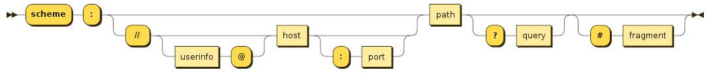

  | 属性     | 描述                                   |
  | -------- | -------------------------------------- |
  | href     | 当前 window 对应的超链接 URL, 整个 URL |
  | protocol | 当前的协议                             |
  | host     | 主机地址                               |
  | hostname | 主机地址，不带端口                     |
  | port     | 端口                                   |
  | pathname | 路径                                   |
  | search   | 查询字符串                             |
  | hash     | 哈希值                                 |

- 常见方法

  - `assign(url)`：赋值一个新的 URL，并且跳转到该 URL
  - `replace(url)`：打开一个新的 URL，并且跳转到该 URL 中（不同的是不会在浏览记录中留下之前的记录）
  - `reload()`：刷新当前页面

- `URLSearchParams`：定义了一些实用的方法来处理 URL 的查询字符串

  - 可以将一个字符串转化成 URLSearchParams 类型
  - 也可以将一个 URLSearchParams 类型转成字符串

  - 中文会使用 encodeURIComponent 和 decodeURIComponent 进行编码和解码

  ```js
  const urlSearch = new URLSearchParams('name=jack&age=20');
  console.log([...urlSearch]); // [['name', 'jack'], ['age', '20']]
  console.log(urlSearch.toString()); 'name=jack&age=20'
  ```

  

### history 对象

- `history` 对象允许我们访问浏览器曾经的会话历史记录

- 对象属性

  - `length`：会话中的记录条数
  - `state`：当前保留的状态值

- 对象方法

  - `back()`：返回上一页，等价于 `history.go(-1)`
  - `forward()`：前进下一页，等价于 `history.go(1)`
  - `go()`：加载历史中的某一页
  - `pushState()`：打开一个指定的地址
  - `replaceState()`：打开一个新的地址，并且使用 replace 方式

  ```js
  setTimeout(() => {
    history.pushState({ data: 11 }, '', '/index');
    console.log(history.length); // 2
    console.log(history.state); // { data: 11 }
  }, 5000)
  ```


### navigator、screen 对象

- `navigator` 对象表示用户代理的状态和标识等信息

  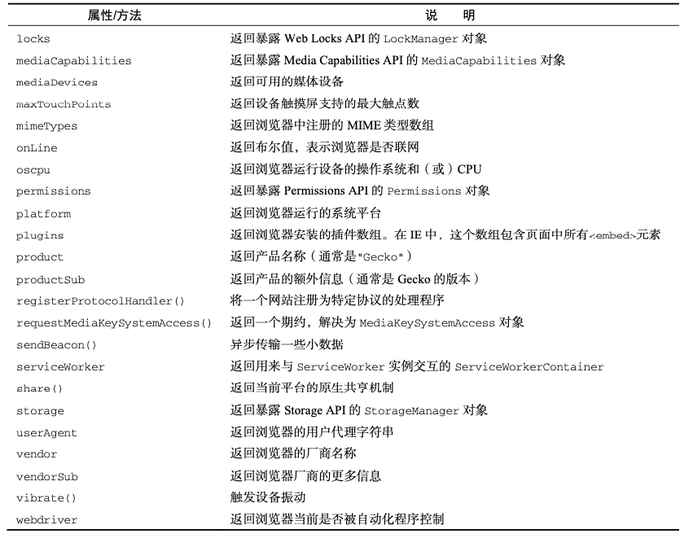

- `screen` 主要记录的是浏览器窗口外面的客户端显示器的信息

  - 比如屏幕的逻辑像素 screen.width、screen.height

  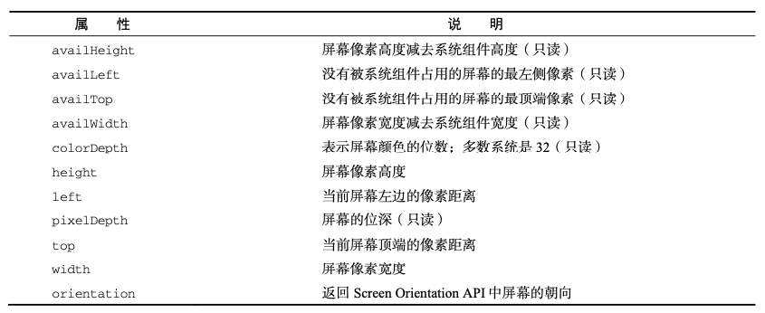
