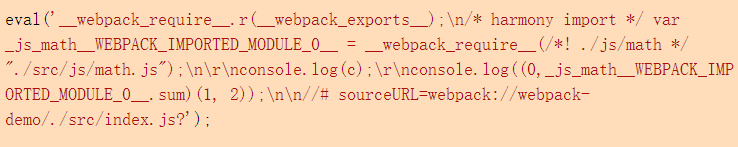
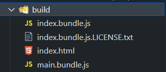
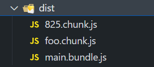
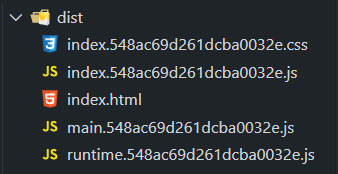

# Webpack

## 认识 Webpack


### 作用

- 前端开发越来越复杂，比如：
  - 通过==模块化==的方式进行开发
  - 使用一些==高级的特性==来提高==开发效率==、==安全性==
    - 使用 **ES6+**、**TypeScript** 进行开发
    - 使用 **sass**、**less** 等方式来编写 CSS 样式
  - 监听文件的变化来==实时==反映到浏览器上，提高开发效率
  - 开发完成后将代码进行==压缩、合并==及其他优化等
- 三个前端框架 React、Vue、Angular 的脚手架也是基于 Webpack 构建


### 定义

```
webpack is a static module bundler for modern JavaScript applications.
```

- **webpack** 是一个用于现代 JavaScript 应用程序的 ==静态模块打包工具==

  - ==bundler==(打包)：webpack 是一个打包工具，可以打包各种静态资源
  - ==static==(静态的)：编写的代码最终都会打包成静态资源，然后部署到静态服务器
  - ==module==(模块化)：webpack 默认支持各种模块化开发，ES Module、CommonJS、AMD 等
  - ==modern==(现代的)：正因为现代前端开发面临各种各样的问题，才催生了 webpack 的出现和发展

- webpack 的安装目前分为两个：**webpack** 和 **webpack-cli**

  - 命令行执行 `webpack` 命令，会执行 `./node_modules/.bin/webpack`

  - `webpack-cli` 负责合并配置选项，并调用==webpack 函数==进行打包和编译

  - 一些第三方的脚手架（比如 Vue 和 React 脚手架）并没有使用 webpack-cli，而是通过一些脚本去调用 webpack 进行打包编译

    
  
  ```js
  const webpack = require('webpack');
  const webpackConfig = require('./webpack.config.js');
  
  const compiler = webpack(webpackConfig);
  
  compiler.run((err, stats) => {
    if (err) {
      console.error(err)
    } else {
      console.log(stats)
    }
  })
  ```
  


## 基本设置

### 打包命令

- `webpack` 命令可以执行打包，默认情况下以当前==工作目录==下 `src/index.js` 作为==打包入口==

- 在打包时==默认==不会更改代码中除 `import` 和 `export` 语句以外的部分

  - 即 webpack 默认只具备模块化打包能力，不具备语法转换功能
  - 额外的 **ES6+** 语法需要借助类似 Babel 的编译工具进行语法转换

- 默认检查当前路径下有没有==webpack.config.js==文件

  - 如果需要手动指定配置文件，可以使用 `--config` 传递配置文件路径

  ```bash
  webpack --config ./scripts/webpack.config.js
  ```


### 打包流程

- 根据命令行配置参数或配置文件找到==入口文件==

- 从入口开始，webpack 会==递归==构建一个 ==依赖关系图==，包含应用程序中引入的所有模块（比如 js、css、图片等），不存在依赖图中的模块不会打包进去

- ==遍历==图结构，打包一个个模块（根据文件类型的不同，使用不同的 ==loader== 来处理）


### 配置文件

- 配置文件支持==函数==或==对象==

  - 导出一个函数

    - 参数一是环境
    - 参数二是传递给 webpack 的配置项

    ```js
    module.exports = function(env, argv) {
      return {
        mode: env.production ? 'production' : 'development',
        devtool: env.production ? 'source-map' : false,
        plugins: [
           new TerserPlugin({
             terserOptions: {
               compress: argv.mode === 'production' // only if `--mode production` was passed
             }
           })
         ]
      };
    };
    ```

  - 导出一个对象

    ```js
    module.exports = {
      mode: 'production',
      entry: './src/index.js'
    };
    ```

- 支持 **TypeScript** 配置文件

  - 安装相关依赖

    ```bash
    npm install -D webpack webpack-cli typescript ts-node @types/node @types/webpack
    # 如果使用版本低于 v4.7.0 的 webpack-dev-server，还需要安装以下依赖
    npm install --save-dev @types/webpack-dev-server
    ```

  - 编写配置文件 **webpack.config.ts**

    ```typescript
    import { resolve } from 'path';
    import { Configuration } from 'webpack';
    // in case you run into any typescript error when configuring `devServer`
    import 'webpack-dev-server';
    
    const config: Configuration = {
      mode: 'production',
      entry: './src/index.js',
      output: {
        path: resolve(__dirname, 'dist'),
        filename: 'bundle.js',
      }
    };
    
    export default config;
    ```

  - 更改配置文件 **tsconfig.json**

    ```json
    {
      "compilerOptions": {
        "module": "ESNext",
        "esModuleInterop": true,
        "allowSyntheticDefaultImports": true,
        "moduleResolution": "Node"
      },
      "ts-node": {
        "compilerOptions": {
          "module": "CommonJS"
        }
      }
    }
    ```


## 基本概念

### module

- 每个引入的文件都是一个==模块==(module)
- 通过互相引用，这些模块会形成一个==图==(ModuleGraph) 数据结构


### chunk

- 在打包过程中，模块会被==合并==成 chunk

  - chunk 合并成 ==chunk 组==，并形成一个通过模块互相连接的图

- 一个 chunk 组中可能有==多个== chunk

  - 例如 SplitChunksPlugin 会将一个 chunk 拆分为一个或多个 chunk

  - 每个 chunk 都有对应的输出文件

- ==chunk 有两种形式==

  - **initial**：在 `entry` 中配置的 chunk，此 chunk 包含为入口起点指定的所有模块及其依赖项
  - **non-initial**：可以==异步==（延迟）加载的块，可能会出现在使用==动态导入== 或 ==SplitChunksPlugin==时

- 如下示例，生成结果为

  - 创建出一个名为 `main` 的 **initial** chunk，包括
    - ./src/index.jsx
    - react
    - react-dom
    - 除 app.jsx 外的所有依赖包

  - 同时还会为 `./app.jsx` 创建一个 **non-initial** chunk，因为该模块是动态导入

  <Tabs>
    <TabItem value="./webpack.config.js" label="./webpack.config.js">

    ```js
    module.exports = {
      entry: './src/index.jsx',
    };
    ```

    </TabItem>

    <TabItem value="./src/index.jsx" label="./src/index.jsx">

    ```js
    import React from 'react';
    import ReactDOM from 'react-dom';
  
    import('./app.jsx').then((App) => {
      ReactDOM.render(<App />, root);
    });
    ```

    </TabItem>
  </Tabs>


### Loader

- webpack 默认只能处理 JavaScript 和 JSON 文件，这是 webpack的自带能力

  - **loader** 用于对模块的源代码进行转换
  - 让 webpack 能够去处理其他类型的文件，以供应用程序使用，以及被添加到依赖图中

- 在 webpack 的配置中，可以通过 `module.rules` 配置 loader

  ```js
  module.exports = {
    module: {
      rules: [
        {
          test: /\.jsx?$/,
          use: [
            {
              loader: 'babel-loader',
              options: {
                presets: ['@babel/preset-env', '@babel/preset-react']
              }
            }
          ]
        }
      ]
    }
  }
  ```


## 配置选项

### 核心配置选项

#### context — 上下文

- `context` 用于指定==基础目录==
  - 必须使用 ==绝对路径==
  - 默认使用 Node.js 进程的工作目录（`process.cwd()`）
  - 用于从配置中解析入口点 (entry point) 和 加载器 (loader)

- 比如当 `entry` 使用相对路径时，会以当前配置的 `context` 作为基础路径


#### entry — 入口

- `entry` 用于指定 webpack 应该使用哪个模块来作为构建其内部==依赖图==的==入口==
  - 动态加载的模块 **不是** 入口起点
  - 规则：每个 HTML 页面都有一个入口起点

- 常用配置方式

  - 单入口（SPA 应用）

    ```js
    const config1 = {
      entry: './src/index.js' 
    }
    
    const config2 = {
      // 也可以传递一个数组，数组中的模块都将被处理
      entry: ['./src/index.js', './src/math.js']
    }
    ```

  - 多入口（MPA 应用）

    ```js
    const config = {
      entry: {
        home: './home.js',
        about: './about.js',
        contact: './contact.js',
      }
    }
    ```

- 当通过插件生成入口时，可以传递空对象 `{}`


#### mode — 模式

- `mode` 用于告知 webpack 使用相应模式的内置优化

- 可选值：`'none'`  | `'development'`  | `'production'`

  - 如果没有设置，webpack 会默认赋值 `production`
  - 设置 `none` 则不使用任何 [默认优化选项](https://github.com/webpack/webpack/blob/main/lib/config/defaults.js)
  
  ```js
  module.exports = {
    mode: 'development'
  }
  ```

- `development` 模式
  - 设置 `process.env.NODE_ENV` 为 development
  - 设置 `optimization.chunkIds` 为 `named`
- `production` 模式
  - 设置 `process.env.NODE_ENV` 为 production
  - 设置 `optimization.chunkIds` 为 `deterministic`
  - 同时会启用一系列优化配置


#### output — 输出

  `output` 用于指定 webpack 在哪里输出它所创建的 *bundle*，以及如何命名这些文件

- `path`：指定打包文件==输出目录==。默认为 `path.join(context, 'dist')`

- `clean`：在生成文件之前对输出目录做一些清理操作，该属性可以替代插件 **clean-webpack-plugin**

- `chunkFilename`：指定 **non-initial** chunk 文件的名称，默认使用 `[id].js`

- `filename`：指定每个输出 bundle 的名称，这些 bundle 将写入到 `output.path` 选项指定的目录下

  - 此选项不会影响那些 **non-initial** chunk 的输出文件，它只影响 **initial** chunk
  
```js
const { resolve } = require('path');

module.exports = {
  entry: './src/index.js',
  output: {
    path: resolve(__dirname, 'build'),
    clean: true, // 在生成文件之前清空 output 目录
    filename: '[name].[chunkhash].js',
    chunkFilename: '[name].[contenthash].js'
  }
}
```


#### Template strings — 模板字符串

  在指定某些文件名、chunk 名等时，可以使用 webpack 内部提供的 **Template strings**，相当于一个==占位符==

- 编译层面的占位符
  - `[fullhash]`：compilation 完整的 hash 值，替代已被废弃的 `[hash]`
- chunk 层面的占位符
  
  | 模板          | 描述                                                         |
  | :------------ | :----------------------------------------------------------- |
  | [id]          | 此 chunk 的 ID                                               |
  | [name]        | 如果设置，则为此 chunk 的名称，否则使用 chunk 的 ID          |
  | [chunkhash]   | 此 chunk 的 hash 值，包含该 chunk 的所有元素（一个chunk 组使用一个相同的 chunkhash） |
  | [contenthash] | 此 chunk 的 hash 值，只包括该内容类型的元素（受 `optimization.realContentHash` 影响） |
- 模块层面的占位符

  | 模板          | 描述               |
  | :------------ | :----------------- |
  | [id]          | 模块的 ID          |
  | [hash]        | 模块的 Hash 值     |
  | [contenthash] | 模块内容的 Hash 值 |
- 文件层面的占位符

  | 模板       | 描述                                                         |
  | :--------- | :----------------------------------------------------------- |
  | [file]     | filename 和路径，不含 query 或 fragment                      |
  | [query]    | 带前缀 `?` 的 query                                          |
  | [fragment] | 带前缀 `#` 的 fragment                                       |
  | [base]     | 只有 filename（包含扩展名），不含 path                       |
  | [path]     | 只有 path，不含 filename                                     |
  | [name]     | 只有 filename，不含扩展名或 path                             |
  | [ext]      | 带前缀 `.` 的扩展名（对 [output.filename](https://webpack.docschina.org/configuration/output/#outputfilename) 不可用） |


#### module.rules — 规则

- 该配置用于定义==资源处理规则==，该属性对应一个==数组==，数组里面存放每个==Rule 对象==，每个 Rule 对象有以下属性

  - `test`：匹配资源的条件（Condition 类型）

  - `exclude`：排除所有符合条件的模块的规则，同样资源下，exclude ==优先级==高于 include（Condition 类型）

  - `include`：引入符合条件的模块的规则（Condition 类型）

  - `oneOf`：规则数组，当规则匹配时，只使用==第一个==匹配规则

  - `sideEffects`：布尔值。指定是否含有副作用，用于==Tree Shaking==

  - `use`：一个应用于模块的 UseEntries 对象数组。每个入口 (entry) 指定使用一个 loader，每个 UseEntries 对象有如下属性

    - `loader`：要使用的 loader 名称
    - `options`：传递给该 loader 的配置

  ```js
  // 写法 1 —— loader/options
  {
    test: /\.css$/,
    loader: 'css-loader',
    options: { importLoaders: 1 }
  }
  
  // 写法 2 —— use loader字符串
  {
    test: /\.css$/,
    use: 'css-loader'
  }
  
  // 写法 3 —— use loader数组
  {
    test: /\.less$/,
    use: ['css-loader', 'less-loader']
  }
  
  // 写法 4（最完整写法，其他写法都是该写法的简写） —— Array<loader 对象>
  {
    test: /\.css$/,
    use: [
      {
        loader: 'css-loader',
        options: { importLoaders: 1 }
      }
    ]
  }
  ```

- 上述所说的 ==Condition== 类型，可以是以下构成
  - 字符串。目录的==绝对==路径或文件绝对路径
  - 正则表达式
  - 函数。调用输入的函数，必须返回一个==布尔值==以匹配
  - 条件数组。至少匹配一个条件
  - 对象：匹配所有属性。每个属性都有一个定义行为
    - `{ and: [Condition] }`：必须匹配数组中的所有条件
    - `{ or: [Condition] }`：匹配数组中任何一个条件
    - `{ not: [Condition] }`：必须排除这个条件
  
  ```js
  const path = require('path');
  
  module.exports = {
    //...
    module: {
      rules: [
        {
          test: /\.css$/,
          include: [
            // will include any paths relative to the current directory starting with `app/styles`
            // e.g. `app/styles.css`, `app/styles/styles.css`, `app/stylesheet.css`
            path.resolve(__dirname, 'app/styles'),
            // add an extra slash to only include the content of the directory `vendor/styles/`
            path.join(__dirname, 'vendor/styles/')
          ]
        }
      ]
    }
  };
  ```
  
- loader 可以==链式调用==，链中的每个 loader 都将对资源进行转换

  - 对于 **Normal Loader**，链默认会==逆序执行==
  - 第一个 loader 将其结果（被转换后的资源）传递给下一个 loader，依此类推


#### resolve — 解析

`resolve` 用于配置模块如何解析

- `alias`：配置路径别名
- `extensions`：尝试按顺序解析的后缀名配置数组

  - 如果有多个文件有相同的名字，但后缀名不同，webpack 会解析列在数组==首位==的后缀的文件 并==跳过==其余的后缀
  - 默认值为 `['.js', '.json', '.wasm']`，使用 `'...'` 可以访问默认拓展名
  
- `fallback`：当正常解析失败时，重定向模块请求

  - webpack 5 不再自动 polyfill Node.js 的核心模块
  - 如果需要在浏览器或类似的环境中运行的代码中使用它们，必须从 NPM 中安装兼容的模块，并自己包含它们
- `mainFiles`：解析目录时要使用的文件名

  - 默认为 `['index']` ，即当 **import** 一个==目录==时，默认会查找该目录下的 **index** 文件
- `modules`：解析模块时应该搜索的目录

  - 默认为 `['node_modules']` ，即查找不带相对或绝对路径时会去该配置路径下查找
  - 这也很好的说明了为什么 **import** 一个第三方模块时，webpack会去==node_modules==下进行查找

```js
const { resolve } = require('path');

module.exports = {
  resolve: {
    alias: {
      '@': resolve(__dirname, './src'),
      'pages': resolve(__dirname, './src/pages')
    },
    // 使用 '...' 访问默认拓展名
    extensions: ['.jsx', '.tsx', '...'],
    modules: ['../node_modules'],
    fallback: {
      querystring: require.resolve('qs')
    }
  } 
}
```


#### plugins — 插件

- **loader** 用于转换某些类型的模块，而插件则可以用于执行范围更广的任务

  - 包括：打包优化，资源管理，注入环境变量

- 插件贯穿于 webpack 的==整个生命周期==，各种配置参数也是以==插件==的形式==注入==到 webpack 的各个生命周期
- 想要使用一个插件，只需要引入它，然后把它添加到 `plugins` 数组中

  ```js
  const HTMLWebpackPlugin = require('html-webpack-plugin');
  
  module.exports = {
    plugins: [
      new HTMLWebpackPlugin({ template: './index.html' })
    ]
  }
  ```


### 其他配置选项

#### 资源路径

##### output.publicPath

- 用于指定应用程序中所有资源的==基础路径==，默认为 `auto`

  - 实质上，发送到 `output.path` 目录的每个文件，都将从 `output.publicPath` 位置引用

  - 这也包括通过代码分离创建的子 chunk 和作为依赖图一部分的所有其他资源

  ```
  静态资源最终访问路径 = output.publicPath + 资源 loader 或插件等配置路径
  ```

- 该属性可以在==入口文件==中动态设置

  - webpack 暴露了一个名为 `__webpack_public_path__` 的全局变量

    ```js
    __webpack_public_path__ = 'xxx';
    ```

  - 如果在入口文件中使用 **ES Module**，则会在 import 之后进行赋值

    - 在这种情况下，必须将赋值操作移至一个==独立模块==中
    - 然后将它的 `import` 语句放置在==入口文件最上面==

    ```js title="index.js"
    import './public-path';
    // ... 其他模块
    ```

- 配置示例

  - 设置为 `output.publicPath = "/"`，打包后的 html 文件会通过==服务根目录==引用静态资源

    - 此时会在前面拼接上==域名==后去查找该资源

    ```html
    <!-- 通过 https://example.com/main.js 下载该资源 -->
    <script defer src="/main.js"></script>
    ```

  - 设置为 `output.publicPath = "./"`，打包后的 html 文件会通过==相对路径==引用静态资源
  
    - 这个时候会相对 html 文件使用==相对路径==去查找资源

    ```html
    <script defer src="./main.js"></script>
    ```


##### devServer.static

- `directory`：告诉服务器从哪里提供内容

  - 只有在希望提供静态文件时才需要这样做
  - 开启 **webpack-dev-server** 服务时，`devServer.static.directory` 目录下的文件会直接被映射到`devServer.static.publicPath` 下
  - 这样可以直接通过 ==域名 + devServer.static.publicPath + 静态资源名==访问资源

- `devServer.static.publicPath`：告诉服务器在哪个 URL 上提供 `devServer.static.directory` 的内容

- 配置示例

  - 假如根目录下的 **static** 目录下有一个 **a.txt** 文件

    ```js
    module.exports = {
      devServer: {
        static: {
          publicPath: '/web',
          directory: resolve(__dirname, './static')
        },
        port: 8080
      }
    }
    ```

  - 这时可以通过 http://localhost:8080/web/a.txt 访问该文件


#### 模块 id 生成算法

`optimization.chunkIds` 告知 webpack 当生成==模块 id== 时使用哪种生成算法

- 对于 **开发环境**，会被设置成 `'named'`

- 对于 **生产环境**，会被设置成 `'deterministic'`

- 如果上述的条件都不符合，会被默认设置为 `'natural'`

| 选项值            | 描述                                                         |
| :---------------- | :----------------------------------------------------------- |
| natural           | 按使用顺序的数字 id（不利于缓存）                            |
| **named**         | 对调试更友好的可读的 id — 使用模块所在的路径作为产物名称     |
| **deterministic** | 在不同的编译中不变的短数字 id，有益于长期缓存。在==生产模式==中会默认开启 |
| size              | 让初始下载包大小更小的数字 id                                |
| total-size        | 让总下载包大小更小的数字 id                                  |


## 资源处理

### 样式资源

- `css-loader`：处理 CSS 样式模块

- `style-loader`：先将样式处理好
  - 通过创建一个==style标签==的方式
  - 通过==页内样式==的方式添加到 document 中的 `head` 中

- 一些 CSS 预处理器相关的 loader
  - 例如 `less-loader`、`sass-loader` 等，这些 loader 本身并不能处理这些语言

  - 需要借助这些预处理器相关的编译工具才可以正常解析，比如 less、sass 工具

- `postcss`：可以处理  CSS 的浏览器兼容性

```js
{
   test: /\.scss$/,
   use: [
     "style-loader"
     {
       loader: 'css-loader',
       options: {
         importLoaders: 2 // 需要的前置Loader个数
       }
     },
     "postcss-loader",
     "sass-loader"
   ]
}
```


### asset module — 资源模块

- ==资源模块==(asset module) 是一种模块类型，它允许使用资源文件（字体，图标等）而无需配置额外 loader

  - 在 webpack 5 之前，通常使用
    - `url-loader` 将文件作为 data URI 内联到 bundle 中
    - `file-loader` 将文件发送到输出目录
  - Webpack 5 新增了==资源模块类型==(asset module type)，通过添加 4 种新的模块类型，来替换所有这些 loader
  
    - `asset/resource` 发送一个单独的文件并导出 URL。之前通过使用 `file-loader` 实现
  
    - `asset/inline` 导出一个资源的 data URI。之前通过使用 `url-loader` 实现
  
    - `asset/source` 导出资源的源代码。之前通过使用 `raw-loader` 实现
  
    - `asset` 在导出一个 data URI 和发送一个单独的文件之间自动选择。之前通过使用 `url-loader` 实现
  
- 处理图片资源

  - 使用 `asset/resource`，该处理方式类似于将静态资源==拷贝==到输出目录

    ```js
    {
      test: /\.(png|jpe?g|gif|svg)$/,
      type: "asset/resource",
      // 设置打包生成文件名
      generator: {
        filename: "img/[name][hash][ext]"
      }
    }
    ```

  - 使用 `asset/inline`，该方式会将图片资源转换为 **base64** 编码 URI

    ```js
    {
      test: /\.(png|jpe?g|gif|svg)$/,
      type: "asset/inline"
    }
    ```

  - 使用 `asset`，webpack 将按照默认条件，自动地在 `resource` 和 `inline` 之间进行选择

    - 小于 **8kb** 的文件，将会视为 `inline` 模块类型，否则会被视为 `resource` 模块类型
    - 设置 `Rule.parser.dataUrlCondition.maxSize` 选项来修改此条件

    ```js
    {
      test: /\.(png|jpe?g|gif|svg)$/,
      type: "asset",
      generator: {
        filename: "img/[name][hash:8][ext]"
      },
      parser: {
        dataUrlCondition: {
          // 10kb 以下转 base64，10kb 以上直接导出文件
          maxSize: 10 * 1024
        }
      }
    }
    ```

- 处理字体文件

  ```js
  {
    test: /\.ttf|eot|woff2?$/i,
    type: "asset-resource",
    generator: {
      filename: "font/[name][hash:8][ext]"
    }
  }
  ```


### 处理 ts/tsx 文件

- 处理方式一：`ts-loader`

  - 编译处理：该 loader 处理 ts 代码需要依赖 typescript 中的 `tsc` 命令进行编译
  - 优点：在处理 ts 代码时会做==类型检验==，检验不通过则编译失败
  - 缺点：无法注入 Polyfill

- 处理方式二：`babel-loader`

  - 编译处理：无需依赖 typescript 的 `tsc` 命令，使用 `@babel/preset-typescript` 预设即可处理 ts 代码
  - 优点：可以注入Polyfill
  - 缺点：无法做类型检验

- 最佳实践：打包前先使用 `tsc` 进行类型检测（`tsc --noEmit`），通过后借助 `babel` 编译 ts 代码

  ```js
  {
    test: /\.tsx?$/,
    use: [
      {
        loader: 'babel-loader',
        options: {
          presets: [
            '@babel/preset-env',
            "@babel/preset-react",
            '@babel/preset-typescript'
          ]
        }
      }
    ]
  }
  ```


### 处理 vue 文件

- 安装对应依赖

  ```bash
  npm install -D vue-loader vue-template-compiler
  ```

- 配置 webpack

  ```js
  const { VueLoaderPlugin } = require('vue-loader');
  
  module.exports = {
    module: {
      rules: [
        // ... 其它规则
        {
          test: /\.vue$/,
          loader: 'vue-loader'
        }
      ]
    },
    plugins: [
      // 请确保引入这个插件！
      new VueLoaderPlugin()
    ]
  }
  ```


## source-map

### 认识 source-map

- 前端代码通常运行在浏览器上时，是通过 **打包压缩** 的

  - 即真实跑在浏览器上的代码和编写的源码是有很大差异的

  - **ES6+** 的代码可能被转换成 **ES5**

  - 对应的代码行号、列号在经过打包后与源码不一致

  - 代码进行==混淆压缩==时，会将**变量名称**等修改

  - 使用 TypeScript 编写的源码，会被编译成 JavaScript

- 当需要进行==调试==时，调试==打包后的代码==是非常困难的

- **source-map** 用于==还原源代码==

  - source-map 是从==已转换的代码==，映射到==原始的源文件==
  - source-map 文件可以使浏览器==重构原始源==并在调试器中==显示重建的原始源==

- webpack 打包时，通过配置 `devtool` 属性可以生成源文件对应的 source-map 文件

  - 在转换完成后，在打包后的代码中添加一个注释，指向生成的 source-map 文件

  ```js
  //# sourceMappingURL=main.js.map
  ```


### 文件结构

- `version`：当前使用的版本

- `sources`：从哪些文件转换过来的 source-map 和打包的代码（从初始的文件）

- `names`：转换前的变量和属性名称（代码混淆时进行的备份）

- `mappings`：source-map 用来和源文件映射的信息（比如位置信息等），一串 base64 可变长度值编码

- `file`：打包后的文件（浏览器加载的文件）

- `sourceContent`：转换前的具体源代码信息（和 sources 是对应的关系）

- `sourceRoot`：所有的 sources 相对的根目录


### devtool 配置选项

- ==缺省值==，即不配置 `devtool` 选项，不生成 source-map（`production` 模式下的默认值）

- `false`：不生成任何和 source-map 相关的内容

- `eval`：`development` 模式下的默认值，不生成 source-map

  - 会在 eval 执行的代码中，添加 `//# sourceURL=`

  - 在执行时会被浏览器解析，并且在调试面板中生成对应的一些文件目录，方便调试代码

    

- `source-map`（最完整的 source-map）

  - 生成一个独立的 source-map 文件，并且在打包后文件中有一个注释，指向 source-map 文件

  - 开发工具会根据这个注释找到 source-map，解析后==还原源码==

    ```js title="main.js"
    //# sourceMappingURL=main.js.map
    ```
  
- `eval-source-map`：会生成 source-map，但是以==DataUrl==（base64编码串）添加到 **eval** 函数后面

  

- `inline-source-map`：会生成 source-map，是以==DataUrl==添加到打包后的文件的最后面

  

- `cheap-source-map`：会生成 source-map，但是会更加==高效==，因为没有生成==列映射==

  - 使用 *source-map*（还需要借助 babel，不然无法生成列信息）

    

  - 使用 *cheap-source-map*

    

- `cheap-module-source-map`

  - 会生成 *source-map*，类似于 *cheap-source-map*，但是对==源自 loader 的 source-map 的处理会更好==

  - 比如如下代码，在经过 **@babel/preset-env** 转换成 ES5 代码后，转换的代码与源代码会有一些差异

    - 源代码

      ```js
      const { dateFormat } = require('./js/format');
      console.log(c);
      console.log(dateFormat(new Date()));
      ```

    - 通过 `cheap-source-map` 映射的源代码

      

  - 此时通过启用 `cheap-module-source-map` 就可以得到更好的源码映射

    

- `hidden-source-map`

  - 会生成 source-map，但是不会自动对生成的文件引用，相当于==删除==了打包后文件对 source-map 文件的==引用注释==
  - 如果手动添加引用注释，则 source-map 依然可以起作用

- `nosources-source-map`：生成 source-map 只有==错误提示==，==无法映射源文件==


### source-map 值组合

- webpack 提供了==26==个 source-map 值，可以进行多组合

- 组合规则

  ```
  [inline-|hidden-|eval-][nosources-][cheap-[module-]]source-map
  ```
  
  - **inline-|hidden-|eval-**：三个值任意选一个，或者不选
  - **nosources**：可选
  - **cheap-[module-]**：cheap 可选，也可以跟随 module
    - 注意 module==不能单独设置==


### 推荐配置

- 开发阶段：推荐使用 `source-map` 或 `cheap-module-source-map`
  - 这是 Vue 和 React 脚手架分别使用的值，可以获取调试信息，方便快速开发
- 测试阶段：与开发阶段保持一致
  - 测试阶段也希望在浏览器下看到正确的错误提示
- 发布阶段：`false` 或者不配置（不安全）


## DevServer 服务

### webpack-dev-server

- 作用：开启一个本地服务器，==提供静态资源服务==，默认情况下实时刷新==整个==页面

  - 启动命令：`webpack serve`
  - 在编译后不会写入到任何输出文件，而是将 bundle 文件保留在==内存==中

- 可以使用 **webpack-dev-middleware** 手动搭建一个本地服务

  ```js
  const express = require('express');
  const webpack = require('webpack');
  const webpackDevMiddleWare = require('webpack-dev-middleware');
  const config = require('./webpack.config');
  
  const app = express();
  
  const compiler = webpack(config);
  const middleware = webpackDevMiddleWare(compiler);
  
  app.use(middleware);
  
  app.listen(3000, () => {
    console.log('服务启动成功');
  });
  ```


### 配置选项

- `hot`：是否启用 HMR
  - `true`：启用热替换

  - `"only"`
    - 默认情况下当代码编译失败修复后，会重新刷新==整个页面==

    - 如果不希望重新刷新整个页面，设置 `hot: "only"` 通过 HMR 只更新编译失败的那一部分 chunk
- `host`：设置主机地址
  - 默认值是==localhost==，如果希望局域网内可访问，可以设置为==0.0.0.0==
  - **localhost** 和 **0.0.0.0** 的区别
    - **localhost**：本质上是一个域名，通常情况下会被解析成 127.0.0.1
    - **127.0.0.1**：==回环地址==，主机自己发出去的包，直接被自己接收
      - 正常的数据库包经过 应用层 -> 传输层 -> 网络层 -> 数据链路层 -> 物理层
      - 而回环地址，是在网络层直接就被获取到
    - **0.0.0.0**：监听 IPV4 上所有的地址，再根据端口找到不同的应用程序
- `port`：设置监听的端口
- `open`：是否打开浏览器
  - 设置为 **true** 会自动打开默认浏览器
  - 也可以设置一个 ==URL==，浏览器会直接打开这个地址
- `compress`：是否为静态文件开启==gzip压缩==
- `historyApiFallback`：可用于适用 HTML5 ==History模式==的路由
  - 解决 SPA 页面在路由跳转后，进行页面刷新返回 **404** 的问题

- `snapshot`（推荐使用默认配置即可）
  - `snapshot.managedPaths`：由包管理器管理的==路径数组==，可以信任它不会被修改
  - `snapshot.immutablePaths`：由包管理器管理的路径数组，在其路径中包含一个版本或哈希，以便所有文件都是不可变的

```js title="webpack.config.js"
module.exports = {
  mode: 'development',
  // 解决node_modules中代码修改后浏览器不刷新
  snapshot: {
    managedPaths: [],
    immutablePaths: []
  },
  devServer: {
    port: 5678,
    open: true,
    hot: true,
    hotOnly: true,
    historyApiFallback: {
      rewrites: [
        { from: /^\/$/, to: '/views/landing.html' },
        { from: /^\/subpage/, to: '/views/subpage.html' },
        { from: /./, to: '/views/404.html' }
      ]
    }
  }
}
```


### 代理

`proxy` 配置用于开启代理服务，一般用于解决==跨域==问题

- `target`：代理到的目标地址
- `pathRewrite`：进行重写路径
- `secure`：https 相关安全认证

- `changeOrigin`：是否自动更新代理后请求头中 `HOST` 字段
  - 如果代理转发的地址是一个==域名==，需要开启此配置

```js
module.exports = {
  devServer: {
    port: 8080,
    proxy: {
      '/api': {
        target: 'http://localhost:5678', // 目标请求地址
        pathRewrite: {
          '^/api': '' // 路径重写
        },
        secure: false // 对 https 服务进行代理支持
        /*
         比如说，配置代理后，发起请求时 axios.get('http://localhost:8080/api/user')
         经过路径重写，此时服务器接收到的请求地址是 http://localhost:8080/user
         如果服务器此时没有对源进行校验，则可以取到数据
         如果服务器出于安全校验到请求源为 http://localhost:8080，而服务器请求接口实则为 http://localhost:5678，校验不一致，拒绝请求
         使用 changeOrigin: true 后，请求时会将请求头中的 HOST 替换为http://localhost:5678，则可以正确拿到数据
        */
        changeOrigin: true
      }
    }
  }
}
```


## HMR

### 认识 HMR

- HMR (Hot Module Replacement)：==模块热替换==

  - 指在应用程序运行过程中，替换、添加、删除模块，只更新发生变化的模块
- 而无需重新刷新整个页面即可更新到最新的代码环境
- HMR 可以提高开发效率

  - ==不重新刷新整个页面==，这样可以保留某些应用程序的==状态==不丢失
  - 只更新需要变化的内容，节省浏览器刷新等待时间
  - 修改源代码，会立即在浏览器更新


### 配置 HMR

- 在 webpack-dev-server 中使用HMR

  - 配置 `devServer.hot` 为 ==true==

    ```js
    module.exports = {
      devServer: {
       hot: true
      }
    }
    ```

  - 需要在==入口文件==指定哪些模块需要使用 HMR，不指定则还是会刷新整个页面

    ```js
    if (module.hot) {
      module.hot.accept("./math.js", () => {
        // 该处传入的回调在热更新之后触发
        console.log("该模块发生更新");
      });
    }
    ```

- ==框架的 HMR==：使用 `module.hot.accept` 来管理 HMR 过于繁琐，可以使用前端框架提供的第三方包支持 HMR

  - React 开发中，可以使用 `react-refresh` 支持 HMR

    - 安装对应依赖

      ```bash
      npm i -D @pmmmwh/react-refresh-webpack-plugin react-refresh
      ```

    - 配置 webpack

      ```js title="webpack.config.js"
      const ReactRefreshWebpackPlugin = require("@pmmmwh/react-refresh-webpack-plugin");
      
      module.exports = {
        plugins: [
          // 只在 development 模式下使用
          new ReactRefreshWebpackPlugin()
        ]
      }
      ```

    - 配置 Babel

      ```js title="babel.config.js"
      module.exports = {
        plugins: [
          // 只在 development 模式下使用
          "react-refresh/babel"
        ]
      }
      ```
  
  - Vue 开发中，`vue-loader` 支持组件的 HMR，开箱即用


### HMR 原理

- **webpack-dev-server** 会创建两个服务
  - 提供静态资源的服务（Express）
  - Socket 服务（net.Socket）
  
- HMR Socket Server 是一个==socket 长连接==
  - 长连接有一个最好的好处是建立连接后双方可以通信（服务器可以直接发送文件到客户端）
  - 当服务器监听到对应的模块发生变化时，会生成两个文件 ==.json==(manifest 文件) 和 ==.js==(update chunk)
  - 通过长连接，可以直接将这两个文件主动发送给客户端
  - 浏览器拿到两个新的文件后，通过 HMR Runtime 机制，加载这两个文件，并且针对修改的模块进行更新
  
  


## 环境分离

### 分离方式

- 方式一：指定不同的配置文件

  ```json
  "scripts": {
    "serve": "webpack serve --config ./config/webpack.dev.js",
    "build": "webpack --config ./config/webpack.prod.js"
  }
  ```

- 方式二：控制 `env` 环境变量

  - 传递环境参数

    ```js
    "scripts": {
      "serve": "webpack serve --config ./config/webpack.common.js --env development",
      "build": "webpack --config ./config/webpack.common.js --env production"
    }
    ```

  - 配置文件读取 `env` 参数，并生成不同的配置

    ```js
    module.exports = function (env){
      // production模式下
      console.log(env) // { WEBPACK_BUNDLE: true, WEBPACK_BUILD: true, production: true }
      
      // development模式下
      console.log(env) // { WEBPACK_BUNDLE: true, WEBPACK_BUILD: true, development: true }
      
      return {
        entry: './src/index.js',
        devtool: env.production ? false : 'source-map'
      };
    }
    ```


### 配置文件分离

- 公共配置信息

  ```js title="webpack.common.js"
  const { resolve } = require('path');
  const HtmlWebpackPlugin = require('html-webpack-plugin');
  
  module.exports = {
    entry: "./src/index.js",
    output: {
      filename: "bundle.js",
      path: resolve(__dirname, "./build")
    },
    module: {
      rules: [
        {
          test: /\.css$/,
          use: ["style-loader", "css-loader"]
        },
        {
          test: /\.jsx?$/,
          use: "babel-loader",
          exclude: /node_modules/
        }
      ]
    },
    plugins: [
      new HtmlWebpackPlugin({
        template: resolve(__dirname, "./index.html")
      })
    ],
    resolve: {
      extensions: [".jsx", "..."]
    }
  };
  
- 开发环境配置信息

  ```js title="webpack.dev.js"
  const ReactRefreshWebpackPlugin = require("@pmmmwh/react-refresh-webpack-plugin");
  const { merge } = require("webpack-merge");
  const commonConfig = require("./webpack.common.js");
  
  const devConfig = {
    mode: "development",
    devtool: "source-map",
    devServer: {
      hot: true,
      open: true
    },
    plugins: [new ReactRefreshWebpackPlugin()]
  };
  
  module.exports = merge(commonConfig, devConfig);
  ```

- 生产环境配置信息

  ```js title="webpack.prod.js"
  const RefreshReactWebpackPlugin = require("@pmmmwh/react-refresh-webpack-plugin");
  const { merge } = require("webpack-merge");
  const commonConfig = require("./webpack.common.js");
  
  const prodConfig = {
    mode: 'production'
  };
  
  module.exports = merge(commonConfig, prodConfig);
  ```

- Babel 配置信息

  ```js title="babel.config.js"
  const presets = [
    [
      '@babel/preset-env',
      {
        corejs: 3,
        useBuiltIns: 'usage'
      }
    ],
    '@babel/preset-react'
  ];
  
  if (process.env.NODE_ENV === 'development') {
    // 开发环境
    plugins.push(['react-refresh/babel']);
  } else {
    // 生产环境
  }
  
  module.exports = {
    presets,
    plugins: []
  }
  ```


## 代码分离

==代码分离（Code Splitting）==是 webpack 中一个非常重要的特性

- 主要目的是将代码分离到不同的 **bundle** 中，之后可以==按需加载==，或者==并行加载==这些文件
- 如果所有的 JavaScript 代码（业务代码、第三方依赖、暂时没有用到的模块）在首页一起加载会影响==首页的加载速度==
- 代码分离可以分出==更小==的 bundle，以及控制资源加载==优先级==，提高网页的性能

### js 分离

#### Entry Points — 入口起点

- 使用 `entry` 指定入口，可以手动分离代码

- 配置示例

  - 配置信息

    ```js
    const { resolve } = require('path');
    
    module.exports = {
      entry: {
        index: './src/index.js',
        main: './src/main.js'
      },
      output: {
        filename: '[name].bundle.js',
        path: resolve(__dirname, 'build')
      } 
    }
    ```

  - 输出结果

     


#### Prevent Duplication — 防止重复

使用 **Entry Dependencies**（配置繁琐，不推荐使用）或 **SplitChunksPlugin** 去重和分离代码

配置 `optimization.splitChunks`

- `chunks`：指定哪些 chunk 需要进行分包
  - 默认为 `async`，即==异步导入==的包进行分包
  - 在 webpack 中，只要是 `import()` 异步导入的模块一定会进行分包
  - 设置为 `all`，则同步引入和异步引入的包均会参与分包

- `minSize`：最小尺寸，即大于此大小的包才会被进行拆分
- `maxSize`：将大于 **maxSize** 的包拆分成不小于 **minSize** 的包
- `cacheGroups`：配置缓存组，用于对拆分的包进行分组

```js
module.exports = {
  optimization: {
    splitChunks: {
      // 'inital' —— 同步导入的包会进行分包（使用import直接进行导入）
      // 'all'：同步引入和异步引入的包均会分包
      chunks: 'all',
      
      // 默认值，单位字节
      minSize: 20000,
      
      // 默认值 0，单位字节
      maxSize: 20000,
      
      // minChunks: 引入的包至少被导入了几次才进行分包
      minChunks: 1, // (默认值)
      
      // 指定拆分 chunk 的名称，默认为 false，也是生产环境的默认值
      // name: false,
      
      cacheGroups: {
        // 配置第三方的包打包到 vendors.js 中
        defaultVendors: {
          test: /[\\/]node_modules[\\/]/,
      
          // 仅在inital-chunk 时才允许覆盖文件名
          filename: '[id]_vendors.js',
      
          // 优先级，当一个模块同时满足多个缓存组时，会根据优先级来选择分离配置进行打包
          priority: -10,
      
          // 对于已经打包过的模块，再次用到时直接进行引用(默认为 true)
          reuseExistingChunk: true
        },
    
        // 配置被引入次数 >=2 次时会被提取进 common_[id].js 中
        default: {
          minChunks: 2,
          filename: 'common_[id].js',
          priority: 10
        }
      }
    }
  }
}
```


#### Dynamic Imports — 动态导入

##### 应用场景

- 动态导入使用最多的一个场景是==懒加载==（比如路由懒加载）

  <Tabs>
    <TabItem value="component.js" label="component.js">

    ```js
    const div = document.createElement('div');
    div.innerHTML = 'Dynamic Import';
    
    export default div;
    ```

    </TabItem>

    <TabItem value="./src/index.js" label="./src/index.js">

    ```js
    const button = document.createElement('button');
    button.innerHTML = '加载组件';
    
    // 页面初始化时不会下载 component.js 文件，当按钮被点击时才去下载并解析
    button.addEventListener('click', () => {
      import(./component').then(module => {
        document.body.appendChild(module.default);
      })
    })
    
    document.body.append(button);
    ```

    </TabItem>
  </Tabs>

- 通过 `import()` 函数引入的模块，打包时都会进行分包


##### 异步文件命名

- 默认情况下，如果没有设置 `output.chunkFilename` ，则会从 `output.filename` 推断值

  - `[name]` 会被预先替换为 `[id]` 或 `[id].`

  - 采取如下配置的打包输出结果

    

    <Tabs>
      <TabItem value="webpack.config.js" label="webpack.config.js">

      ```js
      module.exports = {
        mode: 'production',
        entry: './src/index.js',
        output: {
          path: resolve(__dirname, 'dist'),
          // 此时 [name] 占位符使用了 chunkIds: named 算法计算得到的值
          filename: '[name].bundle.js'
        },
        optimization: {
          chunkIds: 'named'
        }
      }
      ```

      </TabItem>

      <TabItem value="./src/index.js" label="./src/index.js">

      ```js
      import('./foo').then(module => {});
      import('./bar').then(module => {});
      ```

      </TabItem>
    </Tabs>

- 一般来说，对于动态导入的模块，使用 `ouput.chunkFilename` 指定输出文件名
  
  - 可以使用 [Magic Comments](https://webpack.js.org/api/module-methods/#magic-comments) 指定 chunk 的名称
  
  - 采取如下配置的打包输出结果

    - **foo** 文件使用了自定义的名称
    - **bar** 文件使用了自动生成的 id

    

    <Tabs>
      <TabItem value="webpack.config.js" label="webpack.config.js">

      ```js
      module.exports = {
        mode: 'production',
        entry: './src/index.js',
        output: {
          path: resolve(__dirname, 'dist'),
          filename: '[name].bundle.js',
          chunkFilename: '[name].chunk.js',
          clean: true,
        },
        optimization: {
          chunkIds: 'deterministic'
        }
      }
      ```

      </TabItem>

      <TabItem value="./src/index.js" label="./src/index.js">

      ```js
      import(/* webpackChunkName: "foo" */ "./foo").then((module) => {});
      import("./bar").then((module) => {});
      ```

      </TabItem>
    </Tabs>


##### 预获取/预加载模块

- 用于控制==动态加载==模块的加载，使用 [Magic Comments](https://webpack.js.org/api/module-methods/#magic-comments) 进行标记

- prefetch — 预获取：将来某些导航下可能需要的资源

  - 在浏览器==空闲==的时候下载指定的动态模块
  - 等到用到时再去进行==加载==

  ```js
  import(
    /* webpackPrefetch: true */
    './component'
  ).then(module => {})
  ```

- preload — 预加载：当前导航下可能需要资源

  - 跟随它的==父 chunk== 并行下载，具有中等优先级并立即下载

  ```js
  import(
    /* webpackPreload: true */
    './component'
  ).then(module => {})
  ```


### runtime 抽取

- `optimization.runtimeChunk` 可以将 runtime 相关代码进行抽取
  - 默认值是 `false`：每个入口 chunk 中直接嵌入 runtime 相关代码
  - runtime 相关的代码指的是在运行环境中，对模块进行解析、加载、模块信息相关的代码
  - 抽离出来后，有利于==浏览器缓存==策略（不受业务代码的改变而变化）

- 配置选项
  - `true/multiple`：针对每个入口抽取一个 runtime 文件
  - `single`：创建一个在所有生成 chunk 之间共享的运行时文件

  ```js
  module.exports = {
    optimization: {
      runtimeChunk: 'single'
    }
  }
  ```


### css 分离

使用 `mini-css-extract-plugin`，可对 CSS 文件进行分离

- 为了提高编译速度，一般在生产环境下才需要进行 CSS 分离
- 在开发环境下，使用 **style-loader** 创建内部样式即可

```js
const MinCssExtractPlugin = require('mini-css-extract-plugin');

module.exports = function(env) {
  const isProduction = env.production === true;
  
  return {
    module: {
      rules: [
        {
          test: /\.css$/,
          use: [
            isProduction ? MinCssExtractPlugin.loader : 'style-loader',
            'css-loader'
          ]
        }
      ]
    },
    plugins: [
      isProduction && new MinCssExtractPlugin({
        filename: 'css/[name].[contenthash].css',
        chunkFilename: 'css/[name].[contenthash].css'
      })
    ].filter(Boolean)
  }
}
```


## 打包优化

### CDN

#### 认识 CDN


CDN 称之为==内容分发网络==（Content Distribution Network，缩写：CDN）

- 它是指通过相互连接的网络系统，利用最靠近每个用户的服务器（==边缘计算==）
- 更快、更可靠地将音乐、图片、视频、应用程序及其他文件发送给用户
- 提供高性能、可扩展性及低成本的网络内容传递给用户


#### 使用 CDN

- 方式一：打包所有的静态资源，放到 ==CDN 服务器==，用户所有资源通过 CDN 服务器加载

  - 修改 `output.publicPath`，指向 CDN 服务器

    ```js
    module.exports = {
      output: {
        path: resolve(__dirname, 'dist'),
        filename: '[name].bundle.js',
        chunkFilename: '[name].chunk.js',
        publicPath: 'https://example.com/cdn/'
      }
    }
    ```

- 方式二：让一些==第三方库==使用 CDN 加载

  - 一些开源框架会提供 CDN 版本，存放在一些公共的 CDN 服务器上

    - 国际上使用比较多的是 [unpkg](https://unpkg.com)、[JSDelivr](https://www.jsdelivr.com)
    - 国内比较好用是 [bootcdn](https://www.bootcdn.cn)

  - 配置方式：排除第三方库，不参与打包

    - 通过 `externals` 排除某些库（比如 React、lodash）不参与打包

      ```js
      module.exports = {
        externals: {
          /**
           * key 为第三方库的名字
           * value 为第三方库 CDN 的 js 中暴露出来的全局对象
           */
          'react': 'React',
          'react-dom': 'ReactDOM'
        }
      }
      ```

    - 在 html 模块中，通过 CDN 引入外部的第三方库

      ```html
      <script src="https://unpkg.com/react@18.2.0/umd/react.production.min.js"></script>
      <script src="https://unpkg.com/react-dom@18.2.0/umd/react-dom.production.min.js"></script>
      ```


### Hash 占位符

- hash 本身是通过 **MD4** 散列函数处理后，生成一个 128 位的 hash 值（32 个十六进制）
  
- 我们通过实际的打包测试来说明 3 种 **Hash 占位符** 的区别，初次使用 `fullhash`

  - 测试配置
  
    <Tabs>
      <TabItem value="webpack.config.js" label="webpack.config.js">

      ```js
      const { resolve } = require('path');
      const HTMLWebpackPlugin = require('html-webpack-plugin');
      const MinCssExtractPlugin = require('mini-css-extract-plugin');
      
      module.exports = {
        mode: 'production',
        entry: {
          index: './src/index.js',
          main: './src/main.js'
        },
        output: {
          path: resolve(__dirname, 'dist'),
          filename: '[name].[fullhash].js'
        },
        module: {
          rules: [
            {
              test: /\.css$/,
              use: [MinCssExtractPlugin.loader, 'css-loader']
            }
          ]
        },
        optimization: {
          runtimeChunk: 'single'
        },
        plugins: [
          new HTMLWebpackPlugin(),
          new MinCssExtractPlugin({
            filename: '[name].[fullhash].css'
          })
        ]
      };
      ```

      </TabItem>

      <TabItem value="./src/index.js" label="./src/index.js">

      ```js
      import { sum } from './js/math';
      import './style.css';
      console.log(sum(1, 2));
      ```

      </TabItem>

      <TabItem value="./src/main.js" label="./src/main.js">

      ```js
      import { dateFormat } from './js/format';
      console.log(dateFormat(new Date()));
      ```

      </TabItem>

      <TabItem value="./src/js/format.js" label="./src/js/format.js">

      ```js
      export const dateFormat = (date) => date.toUTCString();
      ```

      </TabItem>

      <TabItem value="./src/js/math.js" label="./src/js/math.js">

      ```js
      export const sum = (n1, n2) => n1 + n2;
      ```

      </TabItem>

      <TabItem value="./src/style.css" label="./src/style.css">

      ```css
      html, body {
        height: 100%;
        margin: 0;
      }
      ```

      </TabItem>
    </Tabs>

  - 输出结果
  
    


#### fullhash

- webpack 4 之前使用 **hash**，webpack 5 中==Module.hash==已经被废弃

- `fullhash` 值的生成和整个项目有关系

  - 一旦一个模块变化，所有用到 fullhash 的文件名都会变化

  - 这极不利于生产环境下浏览器缓存策略

- 比如修改 **style.css** 文件再次打包，所有文件名都发生了变化

  


#### chunkhash

`chunkhash` 根据不同的==入口==进行解析来生成 hash 值

- 修改配置，使用 **chunkhash**

  ```js
  module.exports = {
    // ...
    output: {
      path: resolve(__dirname, 'dist'),
      filename: '[name].[chunkhash].js'
    },
    plugins: [
      // ...
      new MinCssExtractPlugin({
        filename: '[name].[chunkhash].css'
      })
    ]
    // ...
  }
  ```

- 从输出结果可以看出，*index.js* 和 *style.css* 共用了同一个 hash 值

  

- 再次修改 *style.css*

  - *style.css* 和 *index.js* 的输出 hash 都发生了变化
  - **main.js** 的 hash 值并没有变化

  


#### contenthash

`contenthash` 表示生成的文件 hash，只和==文件内容==有关系

- 在使用 **contenthash** 时，尽量不要截取长度（类似 `[contenthash:8]`）
  - 这可能会导致生成 [无效的模块 id](https://github.com/webpack/webpack/issues/13398)

- 上述测试结果中

  - 当 *style.css* 的内容发生变化，*index.js* 的输出文件名也发生了变化

  - 使用 **contenthash** 可以避免这种改变

- 修改配置

  ```js
  module.exports = {
    // ...
    output: {
      path: resolve(__dirname, 'dist'),
      filename: '[name].[contenthash].js'
    },
    plugins: [
      // ...
      new MinCssExtractPlugin({
        filename: '[name].[contenthash].css'
      })
    ]
    // ...
  }
  ```

- 输出结果

  

- 再次修改 *style.css* 文件

  - 通过输出结果可以看到 *style.css* 输出 hash 发生变化
  - 而 **index.js** 输出 hash 值仍然==保持不变==

  


### 文件压缩

#### html 压缩

**html-webpack-plugin**  插件可以完成对 HTML 模板的配置， `minify` 属性可以对 html 文件压缩

```js
const HTMLWebpackPlugin = require('html-webpack-plugin');

module.exports = {
  plugins: [
    new HTMLWebpackPlugin({
      minify: {
        // 是否要移除注释
        removeComments: false,
        // 是否移除一些空属性，比如空的类名
        removeEmptyAttributes: true,
        // 折叠空行
        collapseWhitespace: false,
      }
    })
  ]
}
```


#### js 压缩

- **Terser** 是一个 JavaScript 的解释、混淆、压缩的工具集
  - 在 webpack 5 中，生产环境下默认启用此工具集来对 js 代码进行优化处理

- 相关配置属性
  - `compress`：压缩
  - `mangle`：混淆
  - `toplevel`：开启后会对 **顶级作用域** 中的代码进行处理

- 如果默认的配置不满足我们的需求，可以配置 `optimization.minimizer` 来自定义配置

  - 首先需要设置 `optimization.minimize=true`，开启优化功能（生产环境下默认开启）

  - 然后通过 **terser-webpack-plugin** 来自定义优化配置

    ```js
    const TerserWebpackPlugin = require('terser-webpack-plugin')
    
    module.exports = {
      optimization: {
        minimizer: [
          new TerserPlugin({
            // 是否将许可证注释抽取到一个单独的文件中
            extractComments: false,
            // 传递给 terser 的配置
            terserOptions: {
              compress: {
                // 移除 console.* 语句
                drop_console: true
              }
              toplevel: true
            }
          })
        ]
      }
    }
    ```


#### css 压缩

CSS 压缩通常是去除无用的==空格和空行==等，因为很难去修改选择器、属性等

- 使用 **css-minimizer-webpack-plugin** 插件来完成
- 该插件使用 **cssnano** 工具来优化、压缩 CSS

```js
const CssMinimizerPlugin = require('css-minimizer-webpack-plugin');

module.exports = {
  plugins: [
    new CssMinimizerPlugin()
  ]
}
```


#### HTTP 压缩

- HTTP 压缩是一种内置在服务器和客户端之间的，以改进传输速度和带宽利用率的方式

- HTTP 压缩流程

  - HTTP 资源在服务器发送前完成压缩，兼容的浏览器向服务器发送请求时，告知服务器自己支持哪些压缩格式

    

  - 服务器在浏览器支持的压缩格式下，直接返回对应的压缩后的文件，并且在响应头中告知浏览器

    

  - 浏览器下载完成后，自动解压缩文件，然后加载、解析

- 压缩格式有许多种

  - `deflate`：基于 deflate 算法的压缩，使用 zlib 数据格式封装
  - `gzip`：GNU zip 格式，是目前使用比较广泛的压缩算法
  - `pbr`：一种新的开源压缩算法，专为 HTTP 内容的编码而设计；压缩的包更小，但存在浏览器兼容问题

- 在 webpack 中，使用 **compression-webpack-plugin** 来配置 HTTP 压缩

  ```js
  const CompressionPlugin = require('compression-webpack-plugin');
  
  module.exports = {
    plugins: [
      new CompressionPlugin({
        // 设置文件多大时进行压缩，默认为 0，单位字节
        threshold: 0,
        // 匹配哪些文件需要压缩
        test: /\.(css|js)$/,
        // 最小的压缩比例（压缩后的文件大小/原文件大小）达到才进行压缩
        minRatio: 0.7,
        // 压缩采用何种算法
        algorithm: 'gzip'
      })
    ]
  }
  ```


### Tree shaking

#### 认识 Tree shaking

- **Tree Shaking** 是一个术语，在计算机中表示消除 dead code（不可达代码）
  - 最早起源于==LISP==语言，用于消除未调用的代码（纯函数无副作用，可以放心的删除）
  - 后来在 JavaScript 中也得到了应用
  
- 对 JavaScript 进行 Tree Shaking 最早源自打包工具 ==Rollup==

  - 依赖于 ES Module 的==静态语法分析==（不执行任何代码，就可以明确知道模块之间的依赖关系）

  - webpack 2 正式内置了==检测未使用模块==的功能

  - webpack 4 正式扩展了这个能力
    - 通过 package.json 的 `sideEffects` 属性作为标记
  
    - 告知 webpack 在编译时，哪些文件可以被安全删除

  - webpack5 也提供了对部分 [CommonJS](https://github.com/webpack/changelog-v5#commonjs-tree-shaking) 的 Tree shaking 支持


#### 处理 js 文件

webpack实现 Tree Shaking 采用了两种不同的方案

- `usedExports`：通过标记标识符是否被使用，之后通过 **Terser** 来进行优化
- `sideEffects`：跳过整个模块，直接告知该文件是否有副作用

##### usedExports

- 配置该属性后，会自动对==未用到==的标识符进行==标注==

- 测试配置

  <Tabs>
    <TabItem value="webpack.config.js" label="webpack.config.js">

    ```js
    module.exports = {
      mode: 'development',
      entry: './src/index.js',
      optimization: {
        usedExports: true
      }
    }
    ```

    </TabItem>

    <TabItem value="./src/index.js" label="./src/index.js">

    ```js
    import { sum } from './math';
    console.log(sum(1, 2));
    ```

    </TabItem>

    <TabItem value="./src/math.js" label="./src/math.js">

    ```js
    export const sum = (n1, n2) => n1 + n2;
    export const sub = (n1, n2) => n1 - n2;
    ```

    </TabItem>
  </Tabs>

- 打包后的代码，有添加一个注释 `/* unused harmony export sub */`，表示 sub 函数被没有被使用

  

- 这时我们将 `optimization.minimize` 设置为==true==（默认启用 Terser）

  - 更新配置

    ```js
    module.exports = {
      mode: 'development',
      entry: './src/index.js',
      optimization: {
        usedExports: true,
        // 添加这一行配置
        minimize: true
      }
    }
    ```

  - 输出结果中， `sub` 函数相关的代码已被安全删除

    


##### sideEffects

- 告知哪些模块是有副作用的，避免被错误地删除

- 通过实际的例子来理解这个属性，修改 **index.js** 文件

  - 直接将整个模块进行引入

    ```js title="./src/index.js"
    // 没有使用任何导出的变量
    import './math';
    ```

  - 输出结果

    - 虽然在打包后的代码中不含有 *sum*、*sub* 相关的代码

    - 但是 `./src/js/math/js` 这个模块对象还存在，没有完全删除

    

  - 此时，在==package.json==文件中添加属性 `sideEffects: false`（表示所有模块都没有副作用）

    - 输出结果中已经完全不含有 **math.js** 相关的代码

    

- 对于带有副作用的模块，需要显示指定，避免误删

  - 在 `package.json` 中指定

    ```js
    {
      "sideEffects": [
        "./src/js/math.js",
        "./src/**/*.css"
      ]
    }
    ```

  - 在 Rule 规则中使用 `sideEffects` 指定

    ```js
    module.exports  = {
      // ...
      module: {
        rules: [
          {
            test: /\.css$/,
            sideEffects: true, // 指定css含有副作用，避免误删
            use: [MinCssExtractPlugin.loader, 'css-loader']
          }
        ]
      }
    }
    ```


#### 处理 css 文件

- CSS Tree shaking：删除没有用到的 css 代码，比如声明的未被引用的类选择器

- 使用插件 `purgecss-webpack-plugin`

  - `paths`：表示要检测哪些目录下的内容需要被分析
  - `safelist`：指定需要保留的样式规则列表

  ```js
  const { resolve } = require('path');
  const glob = require('glob');
  
  module.exports = {
    plugins: [
      new PurgeCssPlugin({
        paths: glob.sync(`${resolve(__dirname, './src')}/**/*`, { nodir: true }),
        safelist: () => ({ standard: ['html', 'body'] })
      })
    ]
  }
  ```


## 打包分析

### 时间分析

`speed-measure-webpack-plugin` 插件可以统计每一个 loader、Plugin 消耗的打包时间

```js
const SpeedMeasurePlugin = require('speed-measure-webpack-plugin');

const smp = new SpeedMeasurePlugin();

const webpackConfig = smp.wrap({
  entry: './src/index.js',
  // ...webpack配置
});

module.exports = webpackConfig;
```


### 产物分析

- webpack 在打包时可以生成==打包信息==文件，通过该文件可以分析打包产物

- 生成命令

  ```bash
  webpack --profile --json=stats.json
  ```

- 将 json 文件上传至 [分析](https://webpack.github.io/analyse) 网站上，即可查看产物的详细分析


## 自定义 Loader

### 创建自定义 Loader

- **Loader** 本质上是一个导出为==函数==的 JavaScript 模块

  - 解析资源时，会调用这个函数

  - 然后将上一个 Loader 产生的结果或资源文件传入进去

- 这个函数会接收三个参数

  - `content`：资源文件的内容
  - `map`：source map 相关的数据
  - `meta`：一些元数据

  ```js
  module.exports = function(content, map, meta) {
    console.log('content', content);
    return content;
  }
  ```
  
- 创建自定义 Loader

  - 引入自定义 Loader
  
    <Tabs>
      <TabItem value="./loaders/loader_test.js" label="./loaders/loader_test.js">

      ```js
      module.exports = function(content, map, meta) {
        // 对源代码拼接自定义字符串
        return content + '\nconsole.log(22)';
      }
      ```

      </TabItem>

      <TabItem value="webpack.config.js" label="webpack.config.js">

      ```js
      const { resolve } = require('path');
      
      module.exports = {
        mode: 'development',
        entry: './src/index.js',
        output: {
          path: resolve(__dirname, 'dist'),
          filename: '[name].bundle.js'
        },
        module: {
          rules: [
            {
              test: /\.js$/,
              use: ['loader_test01']
            }
          ]
        },
        // 配置 loader 的查找路径
        resolveLoader: {
          modules: ['./loaders', 'node_modules']
        }
      }
      ```

      </TabItem>
    </Tabs>

  - 编译结果

    <Tabs>
      <TabItem value="./src/index.js(编译前)" label="./src/index.js(编译前)">

      ```js
      console.log(11);
      ```

      </TabItem>

      <TabItem value="main.bundle.js(编译后)" label="main.bundle.js(编译后)">

      ```js
      /******/ (function() { // webpackBootstrap
      var __webpack_exports__ = {};
      /*!**********************!*\
        !*** ./src/index.js ***!
        \**********************/
      console.log(11);
      console.log(22);
      /******/ })()
      ```

      </TabItem>
    </Tabs>


### normal/pitch Loader

- Loader 分为两类，大多数 Loader 基于 **normal** Loader 实现

- **normal** Loader：==默认导出==的模块

  ```js
  module.exports = function(content) {
    return content;
  }
  ```

- **pitch** loader：导出 `pitch` 函数的模块

  ```js
  module.exports.pitch = function (remainingRequest, precedingRequest, data) {
    console.log('pitch loader');
  };
  ```


### Loader 执行顺序和 Rule.enforce

- Loader 的==默认==执行顺序

  - **pitch** loader 在 **normal** loader 之前执行

  - **pitch** loader 执行顺序：==从前往后==`loaderContext.loaderIndex++`

    ```js
    function iteratePitchingLoaders(options, loaderContext, callback) {
      ...
     // iterate
     if(currentLoaderObject.pitchExecuted) {
      loaderContext.loaderIndex++;
      return iteratePitchingLoaders(options, loaderContext, callback);
     }
      ...
    }
    ```

  - **normal** loader 执行顺序：==从后往前==`loaderContext.loaderIndex--`

    ```js
    function iterateNormalLoaders(options, loaderContext, args, callback) {
     ...
     // iterate
     if(currentLoaderObject.normalExecuted) {
      loaderContext.loaderIndex--;
      return iterateNormalLoaders(options, loaderContext, args, callback);
     }
      ...
    }
    ```

- `enforce` 可以改变 Loader 的执行顺序

  - 可选值有：`"pre"` 和 `"post"`
  - 所有 Loader 在执行时都有两个阶段
    - **Pitching** 阶段：执行 Loader 上的 **pitch** 方法，按照 ==后置(post)、行内(inline)、普通(normal)、前置(pre)== 的顺序调用
    - **Normal** 阶段：执行 Loader 上的 **默认**方法，按照 ==前置(pre)、普通(normal)、行内(inline)、后置(post)== 的顺序调用

- 使用 `enforce` 改变 Loader 的执行顺序，需要先将拆分成多个 Rule 对象

  - 拆分 Rule 配置

    ```js
    const { resolve } = require('path');
    
    module.exports = {
      module: {
        rules: [
          {
            test: /\.js$/,
            use: 'loader_test01'
          },
          {
            test: /\.js$/,
            use: 'loader_test02',
            enforce: 'pre'
          },
          {
            test: /\.js$/,
            use: 'loader_test03'
          }
        ]
      },
      resolveLoader: {
        modules: ['./loaders', 'node_modules']
      }
    }
    ```

  - 执行顺序

    ```bash
    pitch-loader01
    pitch-loader03
    pitch-loader02
    normal-loader02
    normal-loader03
    normal-loader01
    ```


### 同步/异步 Loader

- 默认创建的 Loader 就是 **同步 Loader**

  - 必须通过 `return` 或 `this.callback` 来返回结果，交给下一个 Loader 来处理
  
  ```js
  module.exports = function(content) {
    // 第一个参数为错误，第二个参数为处理后的内容
    this.callback(null, content);
  }
  ```
  
- 如果需要进行一些异步操作，则可以使用 **异步 Loader**

  - 在异步操作完成后，再回调处理的结果给下一个 Loader
  - 使用 `this.async()` 即可以让这个 Loader 变成==异步==

  ```js
  module.exports = function(content) {
    const callback = this.async();
    setTimeout(() => {
      callback(null, content);
    }, 2000);
  }
  ```


### 自定义参数

- Loader 可以接收一些自定义参数，以实现自定义编译配置

- 传入参数：在 `use.options` 中传入参数

  ```js
  {
    test: /\.js$/,
    use: {
      loader: 'loader_test01',
      options: {
        size: 10 * 1024
      }
    }
  }
  ```

- 获取参数：在 Loader 函数内部通过 `this.getOptions()` 可以获取传入参数

  ```js
  module.exports = function(content) {
    const options = this.getOptions();
    console.log(options); // { size: 10240 }
    return content;
  }
  ```

- 借助 `schema-utils` 库对传入的参数进行校验和提供提示信息，校验不通过则会抛出错误

  ```js
  const { validate } = require('schema-utils');
  
  const schema = {
    type: 'object', // 参数类型
    properties: {
      size: {
        type: 'number', // size属性的类型
        description: '大小' // 描述
      }
    }
  }
  
  module.exports = function(content) {
    const options = this.getOptions();
    validate(schema, options);
    return content;
  }
  ```


### 简易的 babel-loader

```js
const { validate } = require('schema-utils');
const { transform } = require('@babel/core');

const schema = {
  type: 'object',
  properties: {
    presets: {
      type: 'array',
      description: '预设'
    },
    plugins: {
      type: 'array',
      description: '插件'
    }
  }
}

module.exports = function(content) {
  // 启动异步loader
  const callback = this.async();
  // 获取loader的options
  const options = this.getOptions();
  // 校验options
  validate(schema, options);
  // 转换代码
  transform(content, options, (err, result) => {
    if (err) {
      callback(err);
    } else {
      callback(null, result.code);
    }
  });
}
```


## 自定义 Plugin

### 插件注册流程

- webpack 有两个非常重要的类：`Compiler` 和 `Compilation`
  - 通过注入插件的方式，来监听 webpack 的所有==生命周期==
  - 插件的注入离不开各种各样的 **Hook**
  - Compiler 和 Compilation 类中创建了 Tapable 库中的各种 Hook 的实例
  
- webpack 插件的注册流程
  - 在 webpack 函数的 `createCompiler` 方法中，注册了所有的插件
  - 在注册插件时，会调用插件函数或者插件对象的 `apply` 方法
  - 插件方法会接收 `compiler` 对象，通过它来注册 Hook 的事件
  - 某些插件也会传入一个 `compilation` 的对象，可以监听它的 Hook 事件
  - 执行到特定的生命周期时，会触发 Hook 的监听事件，插件内部再对资源进行处理
  
- [Tapable](https://www.npmjs.com/package/tapable) 是官方编写和维护的一个库，用于注册 Hook


### 创建自定义插件

- 通过查阅官方文档提供的 [Compiler Hooks](https://webpack.js.org/api/compiler-hooks) 和 [Compilation Hooks](https://webpack.js.org/api/compilation-hooks)

  - 给某个阶段的 Hook 添加事件监听函数，webpack 编译时会自动去调用监听函数
  - `compilation` 本身是 `compiler` 注册的一个 **SyncHook**

- 自定义插件示例：生成一个 markdown 格式的新文件，文件内容是所有构建生成的文件的列表

  <Tabs>
    <TabItem value="./plugins/FileList" label="./plugins/FileList">

    ```js
    class FileListPlugin {
      static defaultOptions = {
        outputFile: 'assets-list.md',
      };
  
      // 需要传入自定义插件构造函数的任意选项
      constructor(options = {}) {
        // 在应用默认选项前，先应用用户指定选项
        // 合并后的选项暴露给插件方法
        // 记得在这里校验所有选项
        this.options = { ...FileListPlugin.defaultOptions, ...options };
      }
    
      apply(compiler) {
        const pluginName = FileListPlugin.name;
    
        // webpack 模块实例，可以通过 compiler 对象访问，
        // 这样确保使用的是模块的正确版本
        // （不要直接 require/import webpack）
        const { webpack } = compiler;
    
        // Compilation 对象提供了对一些有用常量的访问。
        const { Compilation } = webpack;
    
        // RawSource 是其中一种 “源码”("sources") 类型，
        // 用来在 compilation 中表示资源的源码
        const { RawSource } = webpack.sources;
    
        // 绑定到 “thisCompilation” 钩子，
        // 以便进一步绑定到 compilation 过程更早期的阶段
        compiler.hooks.thisCompilation.tap(pluginName, (compilation) => {
          // 绑定到资源处理流水线(assets processing pipeline)
          compilation.hooks.processAssets.tap(
            {
              name: pluginName,
    
              // 用某个靠后的资源处理阶段，
              // 确保所有资源已被插件添加到 compilation
              stage: Compilation.PROCESS_ASSETS_STAGE_SUMMARIZE,
            },
            (assets) => {
              // "assets" 是一个包含 compilation 中所有资源(assets)的对象。
              // 该对象的键是资源的路径，
              // 值是文件的源码
    
              // 遍历所有资源，
              // 生成 Markdown 文件的内容
              const content =
                    '# In this build:\n\n' +
                    Object.keys(assets)
              .map((filename) => `- ${filename}`)
              .join('\n');
    
              // 向 compilation 添加新的资源，
              // 这样 webpack 就会自动生成并输出到 output 目录
              compilation.emitAsset(this.options.outputFile, new RawSource(content));
            }
          );
        });
      }
    }
  
    module.exports = FileListPlugin;
    ```
  
    </TabItem>
  
    <TabItem value="webpack.config.js" label="webpack.config.js">
  
    ```js
    const FileListPlugin = require('./plugins/fileList');
    
    module.exports = {
      plugins: [
        new FileListPlugin({
          outputFile: 'assets.md'
        })
      ]
    }
    ```
  
    </TabItem>
  </Tabs>


## 扩展知识

### browserslist

- 作用：在不同前端工具之间，==共享==目标浏览器或 Node.js 的配置

  - babel、postcss、webpack 等工具都会读取该配置

  - 根据编写的条件，去 [Can I use](https://caniuse.com/usage-table) 上查询匹配需要适配的浏览器版本

- 常见编写规则

  - `defaults`（默认规则）：`>0.5%, last 2 versions, Firefox ESR, not dead`
  - `>1%`：该==百分比==表示浏览器的==市场占有率==
  - `dead`：24 月内没有官方支持或更新的浏览器
  - `last 2 versions`：每个浏览器的==最新==两个大版本

- 规则逻辑运算符

  - `,` 表示并集，`&` 表示交集
  - `not` 表示取反，从前面的查询结果中排除的部分
  
- **编写规则方式**

  - 方式一：在 **package.json** 文件中增加 `browserslist` 配置

    ```json
    {
      "browserslist": [
        ">1%",
        "last 2 versions",
        "not dead"
      ]
    }
    ```

  - 方式二：在项目根目录创建 `.browserslistrc` 文件（推荐），换行符相当于并集

    ```
    >1%
    last 2 version and not dead
    ```


### PostCSS

- **PostCSS** 是一个通过==JavaScript==来转换==样式==的工具，可以独立使用

  - 可以进行一些==CSS 的转换和适配==，比如自动添加浏览器前缀
  - 实现这些功能，需要借助 PostCSS 对应的插件

- 默认会读取根目录下的 `postcss.config.js` 配置文件

  <Tabs>
    <TabItem value="webpack.config.js" label="webpack.config.js">

    ```js
    module.exports = {
      module: {
        rules: [
          {
            test: /\.css/,
            use: [
              "style-loader",
              {
                loader: "css-loader",
                options: {
                  importLoaders: 1 // 需要的前置Loader个数
                }
              },
              "postcss-loader"
            ]
          }
        ]
      }
    }
    ```

    </TabItem>

    <TabItem value="postcss.config.js" label="postcss.config.js">

    ```js
    module.exports = {
      plugins: ['postcss-preset-env']
    }
    ```

    </TabItem>
  </Tabs>


### DefinePlugin

- `DefinePlugin` 允许创建一个在 **编译** 时可以配置的==全局常量==

  - 这可能会对开发模式和发布模式的构建允许不同的行为非常有用
  - 使用该插件定义的常量也可以直接在前端代码中进行使用，在webpack==编译==时会==替换==掉该常量

- 每个传入 `DefinePlugin` 的键值都是一个标志符或者多个用 `.` 连接起来的标志符

  - 由于该插件会直接替换文本，因此提供的值必须在字符串本身中再包含一个 **实际的引号**

  - 可以使用类似 `'"production"'` 这样的替换引号，或者直接用 `JSON.stringify('production')`

    ```js
    const { DefinePlugin } = require('webpack');
    
    module.exports = {
      plugins: [
        new DefinePlugin({
          'process.env.ENV': JSON.stringify('production'),
          PRODUCTION: JSON.stringify(true)
        })
      ]
    }
    ```

  - 前端代码中使用

    ```js
    // 源代码
    console.log(process.env.ENV + '11')
    console.log(PRODUCTION);
    
    // 编译后
    console.log("production" + '11');
    console.log(true);
    ```


### 打包库文件

使用 webpack 可以打包自己的 JavaScript 库，发布到 npm 上供开源社区一起使用

```js
const { resolve } = require('path')

module.exports = {
  mode: 'production',
  entry: './index.js',
  output: {
    path: resolve(__dirname, './lib'),
    filename: 'index.js',
    
    // umd 可以支持 AMD/CommonJs/浏览器
    libraryTarget: 'umd',
    
    // 打包库的名字
    library: 'custom-utils',
    
    // 使用哪个全局对象来挂载 library，打包后可以使用 globalThis['custom-utils'] 来使用
    globalObject: 'globalThis'
  }
}
```


### 模块化实现原理

- webpack 打包输出的代码，可以实现各种各样的模块化，甚至可以在不同模块类型之间进行调用

  <Tabs>
    <TabItem value="webpack.config.js" label="webpack.config.js">

    ```js
    module.exports  = {
      mode: 'development',
      entry: './src/index.js',
      output: {
        path: resolve(__dirname, 'dist'),
        filename: '[name].js'
      }
    };
    ```
  
    </TabItem>

    <TabItem value="./src/js/math.js" label="./src/js/math.js">

    ```js
    export const sum = (n1, n2) => n1 + n2;
    ```

    </TabItem>

    <TabItem value="./src/js/format.js" label="./src/js/format.js">

    ```js
    const dateFormat = date => date.toLocaleString();
    
    module.exports = { dateFormat };
    ```

    </TabItem>
  </Tabs>

- CommonJS 模块化实现原理

  <Tabs>
    <TabItem value="./src/index.js" label="./src/index.js">

    ```js
    const { dateFormat } = require('./js/format');
    console.log(dateFormat(new Date()));
    ```
  
    </TabItem>
  
    <TabItem value="result" label="编译结果">
  
    ```js
    // 定义一个对象，存储模块
    // key: 模块路径; value: 一个函数
    var __webpack_modules__ = {
      './src/js/format.js': function (module) {
        function dateFormat(date) {
          return date.toLocaleString();
        }
        // 将 module 对象的 exports 属性赋值一个对象，包含 dateFormat 函数
        module.exports = {
          dateFormat
        };
      }
    };
    
    // 缓存加载过的模块
    var __webpack_module_cache__ = {};
    
    // 该函数用于加载模块
    function __webpack_require__(moduleId) {
      // moduleId = './src/js/format.js'
      // 首先在缓存中查找是否存在该模块，有则直接返回
      var cachedModule = __webpack_module_cache__[moduleId];
      if (cachedModule !== undefined) {
        return cachedModule.exports;
      }
      
      // 声明一个新的 module 对象，同时将该需要加载的模块(__webpack_module_cache__[moduleId])放入缓存中
      // 这两个变量都指向一个新创建出来的对象 { exports: {} }
      var module = (__webpack_module_cache__[moduleId] = {
        exports: {}
      });
      
      // 加载执行模块，通过 __webpack_modules__[moduleId] 取到存储在 __webpack_modules__ 中的对应模块
      __webpack_modules__[moduleId](module, module.exports, __webpack_require__);
      
      // 获取 format.js 中导出的变量
      return module.exports;
    }
    
    var __webpack_exports__ = {};
    
    // 立即执行函数，代码执行的入口
    !(function () {
      // 获取 format.js 模块中导出的 dateFormat 函数
      const { dateFormat } = __webpack_require__('./src/js/format.js');
      console.log(dateFormat(new Date()));
    })();
    ```

    </TabItem>
  </Tabs>
  
- ES Module 模块化实现原理

  <Tabs>
    <TabItem value="./src/index.js" label="./src/index.js">

    ```js
    import { sum } from './js/math';
    console.log(sum(1, 2));
    ```
  
    </TabItem>
  
    <TabItem value="result" label="编译结果">
  
    ```js
    'use strict';
    // 定义一个对象，存储模块
    // key: 模块路径; value: 一个函数
    var __webpack_modules__ = {
      './src/js/math.js': function (
      __unused_webpack_module,
      __webpack_exports__,
      __webpack_require__
      ) {
        // 为对象 { exports: {} } 添加 __esModule 属性为 true，标识该模块为 esModule 模块
        __webpack_require__.r(__webpack_exports__);
        
        // 将 './src/js/math.js' 模块中导出的变量做一个代理，代理到 __webpack_exports__ 中
        __webpack_require__.d(__webpack_exports__, {
          sum: function () {
            return sum;
          }
        });
        
        const sum = (n1, n2) => n1 + n2;
      }
    };
    
    // 缓存加载过的模块
    var __webpack_module_cache__ = {};
    
    // 该函数用于加载模块
    function __webpack_require__(moduleId) {
      // moduleId = './src/js/math.js'
      // 首先在缓存中查找是否存在该模块，有则直接返回
      var cachedModule = __webpack_module_cache__[moduleId];
      if (cachedModule !== undefined) {
        return cachedModule.exports;
      }
      
      // 声明一个新的 module 对象，同时将该需要加载的模块(__webpack_module_cache__[moduleId])放入缓存中
      // 这两个变量都指向一个新创建出来的对象 { exports: {} }
      var module = (__webpack_module_cache__[moduleId] = {
        exports: {}
      });
      
      // 加载执行模块，通过 __webpack_modules__[moduleId] 取到存储在 __webpack_modules__ 中的对应模块
      __webpack_modules__[moduleId](module, module.exports, __webpack_require__);
      
      // 返回导入的模块对象
      return module.exports;
    }
    
    !(function () {
      __webpack_require__.d = function (exports, definition) {
        // exports: 新创建出来的模块对象
        // definition：导入的模块内容
        for (var key in definition) {
          // 通过 for..in, 对 definition 做一个代理
          // 从 exports 对象上取属性时，会触发 getter 操作，去 definition 上查找
          if (__webpack_require__.o(definition, key) && !__webpack_require__.o(exports, key)) {
            Object.defineProperty(exports, key, {
              enumerable: true,
              get: definition[key]
            });
          }
        }
      };
    })();
    
    // 定义 __webpack_require__.o 函数，用于判断对象上是否有某个属性
    !(function () {
      __webpack_require__.o = function (obj, prop) {
        return Object.prototype.hasOwnProperty.call(obj, prop);
      };
    })();
    
    !(function () {
      __webpack_require__.r = function (exports) {
        if (typeof Symbol !== 'undefined' && Symbol.toStringTag) {
          Object.defineProperty(exports, Symbol.toStringTag, { value: 'Module' });
        }
        Object.defineProperty(exports, '__esModule', { value: true });
      };
    })();
    
    var __webpack_exports__ = {};
    
    // 代码执行的入口
    !(function () {
      // 执行 __webpack_require__.r 函数，为 __webpack_exports__ 对象添加 __esModule: true
      __webpack_require__.r(__webpack_exports__);
      
      // 执行 __webpack_require__ 函数，获取模块 './src/js/math.js' 导出的变量
      var _js_math__WEBPACK_IMPORTED_MODULE_0__ = __webpack_require__('./src/js/math.js');
      
      console.log((0, _js_math__WEBPACK_IMPORTED_MODULE_0__.sum)(1, 2));
    })();
    ```
  
  </TabItem>
  </Tabs>
  
- CommonJS 和 ES Module 相互加载实现原理

  <Tabs>
    <TabItem value="./src/index.js" label="./src/index.js">

    ```js
    import { dateFormat } from './js/format';
    const { sum } = require('./js/math');
    console.log(sum(1, 2));
    console.log(dateFormat(new Date()));
    ```
  
    </TabItem>
  
    <TabItem value="result" label="编译结果">
  
    ```js
    // 定义一个对象，存储模块
    // key: 模块路径; value: 一个函数
    var __webpack_modules__ = {
      './src/js/format.js': function (module) {
        function dateFormat(date) {
          return date.toLocaleString();
        }
        // 将 dateFormat 函数添加到创建的 module 对象中
        module.exports = {
          dateFormat
        };
      },
      './src/js/math.js': function (
      __unused_webpack_module,
       __webpack_exports__,
       __webpack_require__
      ) {
        'use strict';
        // 为当前模块添加属性 __esModule=true
        __webpack_require__.r(__webpack_exports__);
        // 将 './src/js/math.js' 模块中导出的变量做一个代理
        // 代理到 __webpack_exports__ 中（即创建出来的 exports 对象）
        __webpack_require__.d(__webpack_exports__, {
          sum: function () {
            return sum;
          }
        });
        const sum = (n1, n2) => n1 + n2;
      }
    };
    
    var __webpack_module_cache__ = {};
    
    function __webpack_require__(moduleId) {
      var cachedModule = __webpack_module_cache__[moduleId];
      if (cachedModule !== undefined) {
        return cachedModule.exports;
      }
      var module = (__webpack_module_cache__[moduleId] = {
        exports: {}
      });
      __webpack_modules__[moduleId](module, module.exports, __webpack_require__);
      return module.exports;
    }
    
    !(function () {
      // 获取 ES Module 中默认导出(export default)的变量
      __webpack_require__.n = function (module) {
        var getter =
            module && module.__esModule ?
            function () {
              return module['default'];
            } : 
        function () {
          return module;
        };
        __webpack_require__.d(getter, { a: getter });
        return getter;
      };
    })();
    
    // 对象代理
    !(function () {
      __webpack_require__.d = function (exports, definition) {
        for (var key in definition) {
          if (__webpack_require__.o(definition, key) && !__webpack_require__.o(exports, key)) {
            Object.defineProperty(exports, key, {
              enumerable: true,
              get: definition[key]
            });
          }
        }
      };
    })();
    
    !(function () {
      __webpack_require__.o = function (obj, prop) {
        return Object.prototype.hasOwnProperty.call(obj, prop);
      };
    })();
    
    // 为 exports 对象添加 __esModule 属性，标识当前模块为 ES Module
    !(function () {
      __webpack_require__.r = function (exports) {
        if (typeof Symbol !== 'undefined' && Symbol.toStringTag) {
          Object.defineProperty(exports, Symbol.toStringTag, { value: 'Module' });
        }
        Object.defineProperty(exports, '__esModule', { value: true });
      };
    })();
    
    var __webpack_exports__ = {};
    !(function () {
      'use strict';
      __webpack_require__.r(__webpack_exports__);
      var _js_format__WEBPACK_IMPORTED_MODULE_0__ = __webpack_require__('./src/js/format.js');
      var _js_format__WEBPACK_IMPORTED_MODULE_0___default = __webpack_require__.n(
        _js_format__WEBPACK_IMPORTED_MODULE_0__
      );
    
      const { sum } = __webpack_require__('./src/js/math.js');
      console.log(sum(1, 2));
      console.log(
        (0, _js_format__WEBPACK_IMPORTED_MODULE_0__.dateFormat)(new Date())
      );
    })();
    ```
  
    </TabItem>
  </Tabs>
