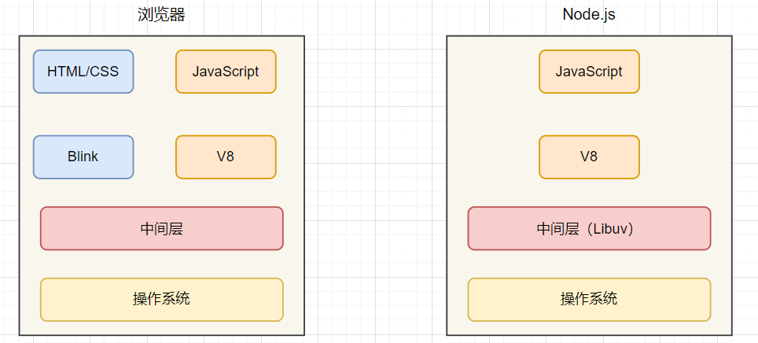
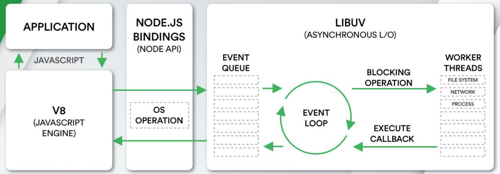
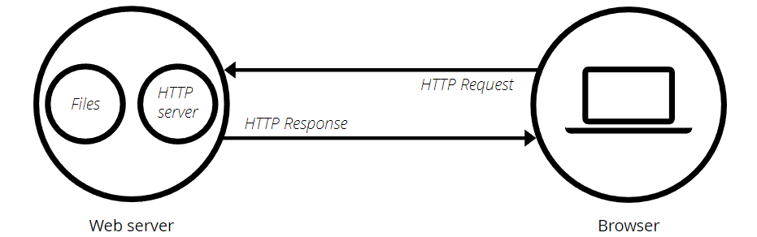
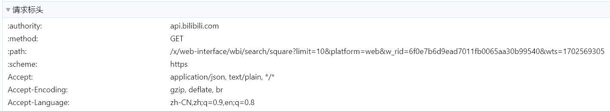

# Node.js

## 认识 Node.js

### 定义

- 官方定义：**Node.js** 是一个==开源==、==跨平台==的 **JavaScript** 运行环境  

  ```markdown
  Node.js® is an open-source, cross-platform JavaScript runtime environment.
  ```

- **Node.js** 基于 ==V8== 引擎来执行 JavaScript 的代码，但是不仅包含 V8 引擎

  - V8 可以嵌入到任何 C++ 应用程序 中，无论是 Chrome 还是 Node.js，都是嵌入了 V8 引擎来执行 JavaScript 代码
  - 在 Chrome 浏览器中，还需要解析、渲染 HTML、CSS 等，另外还需要提供支持浏览器操作的 API、浏览器自己的事件循环等
  - 在 Node.js 中也提供了一些额外的操作，比如文件系统读写、网络 IO、加密、压缩解压文件等操作


### 架构

- **浏览器** 和 **Node.js** 差异

  

- **Node.js** 架构

  

  - JavaScript 代码会经过 V8 引擎，再通过 Node.js 的 Bindings，将任务放到 Libuv 的事件循环中
  - **Libuv** 是 使用 ==C 语言==编写的库（https://libuv.org/）
  - Libuv 提供了事件循环、文件系统读写、网络 IO、线程池 等内容


### 版本发布

- Node.js 的版本分为两个版本

  

  - ==LTS== 版本：相对稳定一些，推荐线上环境使用该版本
  - ==Current== 版本：最新的版本，包含很多新特性，相对不稳定，API 可能随时发生变更

- *LTS* 版本状态是“长期支持”，通常保证关键错误将在总共 30 个月内得到修复

- 使用版本切换工具，可以快速、方便的切换 Node.js 版本

  - `n`：仅在 *Linux* 平台可用

    ```bash
    # 全局安装工具 n
    npm i -g n
    # 查看所有版本
    n
    # 升级到最新 LTS 版本
    n lts
    ```

  - `nvm-windows`：*windows* 平台上的版本切换工具

  

### 应用场景

- 第三方包以 npm 包的形式发布在 npm ==registry== 中
- npm、yarn、pnpm 等==包管理工具==需要依赖 Node.js 运行
- 使用 Node.js 作为 web 服务器开发、中间件、代理服务器
- ==SSR== 需要借助 Node.js 完成前后端渲染
- 编写脚本工具（command.js）
- 使用 Electron 来开发桌面应用程序（基于 Node.js）


## 使用 Node.js

### 全局对象

- 常见的全局对象
  - `process` 对象：提供了 Node 进程中相关的信息。比如 Node 的运行环境、参数信息等
  - `console` 对象：提供了简单的控制台输出函数
  - 定时器函数
    - `setTimeout/setInterval`
    - `setImmediate`
    - `process.nextTick`

- 特殊的全局对象
  - 这些全局对象实际上是==模块==中的变量 ，只是每个模块都有，像是全局变量；在命令行交互中不可以使用
  - `__dirname`：获取当前文件所在的路径（不包括文件名）
  - `__filename`：获取当前文件所在的路径和文件名称（包括后面的文件名称）

- `global` 对象
  - Node 环境的全局对象（类似于浏览器中的 window）
  - 与浏览器中 `window` 的区别：在顶层作用域中通过 `var` 声明的变量不会作为属性添加到全局对象中


### 执行 JavaScript

- Node.js 使用内置集成的 ==V8== 引擎解析、执行 JavaScript

- 使用 Node.js 执行 `js` 文件：直接跟上需要运行的文件即可

  ```bash
  node ./要运行的文件.js
  ```

- 在执行程序的过程中，可以传递一些参数

  ```bash
  node test.js env=development
  ```

- 可以使用 `process.argv` 获取参数==数组==

  ```js
  /**
   * [
      'D:\\nodejs\\node.exe',
      'D:\\code\\Node.js\\code\\01_认识Node.js\\01_获取参数.js',
      'env=development'
    ]
   */
  console.log(process.argv);
  ```


## 常用内置模块

### 文件系统 — fs

#### 认识文件系统

- `fs` 是 **File System** 的缩写，表示文件系统

- 对于==服务器端==语言或框架，往往都需要与文件系统建立连接
  - 提供静态服务，就需要服务器能读取磁盘资源并返回给客户端
  - 使用数据库存储用户数据，数据库本身也是在操作文件
  - 读写配置文件

- Node.js 文件操作的 API 分为了三大类

  - 同步操作：代码会被阻塞，不会继续执行

    ```js
    const { readFileSync } = require("fs");
    
    /**
     * @description 同步操作
     */
    const content = readFileSync("./demo.txt", { encoding: "utf-8" });
    console.log(content);
    ```

  - 异步回调函数操作：代码不会被阻塞，当获取到结果时，传入的回调函数被执行

    ```js
    const { readFile } = require("fs");
    
    /**
     * @description 异步回调操作
     */
    readFile("./demo.txt", (err, data) => {
      if (err) return;
      console.log(data.toString());
    });
    ```

  - 异步 **Promise** 操作：返回一个 **Promise**

    ```js
    const { readFile } = require("fs/promises");
    
    /**
     * @description Promise 异步操作
     */
    readFile("./demo.txt", { encoding: "utf-8" })
      .then((content) => console.log(content))
      .catch((err) => console.error(err));
    ```


#### 文件操作符

- 文件描述符（File Descriptors）
  - 在常见的操作系统上，对于每个进程，内核都维护着一张当前打开着的==文件==和==资源==的表格
  - 每个==打开的==文件都分配了一个称为文件描述符的简单的==数字标识符==
  - 在系统层，所有文件系统操作都使用这些文件描述符来==标识==和==跟踪==每个特定的文件
  - **Windows** 系统使用了一个虽然不同但概念上类似的机制来跟踪资源

- 为了简化用户的工作，Node.js 抽象出操作系统之间的特定差异，并为所有打开的文件分配一个数字型的文件描述符

- `fs.open()` 方法用于分配新的文件描述符

  - 一旦被分配，则文件描述符可用于从文件读取数据、向文件写入数据、或请求关于文件的信息

  ```js
  const { readFileSync, openSync } = require("fs");
  
  const fd = openSync("./demo.txt");
  const content = readFileSync(fd, { encoding: "utf-8" });
  
  console.log(content);
  ```

  

#### 文件读写

- `readFile`：读取文件内容

  ```js
  const { readFileSync } = require("fs");
  
  /**
   * @description 读取文件
   */
  const content1 = readFileSync("./demo.txt");
  
  /**
   * @description 不配置编码格式，默认返回 Buffer
   * <Buffer 48 65 6c 6c 6f 20 4e 6f 64 65 2e 6a 73 21>
   */
  console.log(content1);
  
  const content2 = readFileSync("./demo.txt", { encoding: "utf-8" });
  /**
   * Hello Node.js!
   */
  console.log(content2);
  ```

- `watchFile`：写入文件内容

  ```js
  const { writeFileSync } = require("fs");
  
  writeFileSync("./demo.txt", "Hello World!", {
    /**
     * @description "a+" 代表在文件 “末尾追加”，不配置 flag 默认会覆盖原文件
     */
    flag: "a+"
  });
  ```

- 读取/写入可以传入一个额外的配置对象

  - `flag`：文件的读写方式
  - `encoding`：文件读/写的编码格式，不进行配置则默认使用 `Buffer`（二进制数据）


#### 文件夹操作

- `mkdirSync`：新建文件夹

- `readdirSync`：获取文件夹内的内容

  - `withFileTypes`：设置此属性为 ==true==，获得的文件对象会携带文件类型判断方法

  ```js
  const { readdirSync } = require("fs");
  const { resolve } = require("path");
  
  /**
   * 获取文件夹内的所有文件列表
   * @param {string} dir 目录路径
   */
  function getDirFileList(dir, temp = []) {
    const dirent = readdirSync(dir, { withFileTypes: true });
  
    for (const file of dirent) {
      const { name } = file;
  
      if (file.isDirectory()) {
        // 文件夹
        getDirFileList(resolve(dir, name), temp);
      } else if (file.isFile()) {
        // 文件
        temp.push(name);
      }
    }
  
    return temp;
  }
  
  const list = getDirFileList("./");
  ```


### 路径解析 — path

- `path` 模块用于 Node.js 中的路径获取、解析、拼接等场景

- 常见 API

  - `resolve()`：路径拼接，遇到 `/`、相对路径时==解析查找==后进行拼接
  - `basename()`：获取文件名
  - `extname()`：获取文件后缀名

  

### 事件系统 — events

- Node.js 中的核心 API 都是基于==异步事件==驱动的
  - 在这个体系中，某些对象（发射器）发出某一个事件
  - 监听这个事件（监听器），并且传入的回调函数，这个回调函数会在监听到事件时调用

- 常见 API

  ```js
  const EventEmitter = require("events");
  
  /**
   * @description 创建事件控制实例
   */
  const emitter = new EventEmitter();
  
  /**
   * @description 监听事件
   */
  emitter.on("action", (...args) => {
    // [ '向左', '向右' ]
    console.log(args);
  });
  
  /**
   * @description 发射事件
   */
  emitter.emit("action", "向左", "向右");
  
  /**
   * @description 移除监听
   */
  emitter.off("action");
  ```


### 二进制操作 — Buffer

#### 认识 Buffer

- 计算机中所有的内容：文字、数字、图片、音频、视频最终都会使用==二进制==来表示
  - Node.js 提供了一个类 `Buffer`，并且它是==全局==可用的

- Buffer 中存储的是二进制数据
  - 可以将 Buffer 看成是一个存储二进制的数组
  - 这个数组中的每一项，可以保存 ==8== 位二进制：`1111 1111`（也可称为一个==字节==）


#### 创建 Buffer

- 创建 Buffer 时，并不会频繁的向操作系统申请内存
  - 它会默认先申请一个 ==8 * 1024== (8kb) 个字节大小的内存
  - 当所要存储的数据空间不足时，再次向操作系统申请内存

- 使用 `Buffer.from()` 编码，通过 `toString()` 解码

  - 默认会使用 `UTF-8` 的编码格式
  - 编码、解码需要使用相同的==编码格式==，否则解码可能会==乱码==  

  ```js
  const buf = Buffer.from("Hello");
  
  /**
   * 对于字符串 "Hello"，解析每个字符
   * 先将字符经过 ASCII 编码等到每个字节的十六进制表示
   * 最后再将十六进制转换为二进制存储到每个二进制字节（8位）中
   */
  console.log(buf); // <Buffer 48 65 6c 6c 6f>
  
  /**
   * 解码
   */
  console.log(buf.toString());
  ```

- 使用 `Buffer.alloc()` 可以手动申请==给定字节==的内存空间

  - 申请到的空间默认没有进行填充，每个字节默认为 `00`
  - 可以手动操作每个字节的数据

  ```js
  const buffer = Buffer.alloc(8);
  
  /**
   * @description 创建出来的空间默认为空
   * <Buffer 00 00 00 00 00 00 00 00>
   */
  console.log(buffer);
  
  /**
   * @description 手动填充字节空间
   */
  buffer.write("Hello World");
  
  /**
   * 申请的空间不够，只填充了前8个字符
   * Hello Wo
   */
  console.log(buffer.toString());
  ```


#### 读写二进制文件

- 对于文件读取，若未指定编码格式，默认会以 `Buffer` 形式呈现

  ```js
  const { readFileSync } = require("fs");
  
  const data = readFileSync("./demo.txt");
  
  console.log(data); // <Buffer 48 65 6c 6c 6f 20 57 6f 72 6c 64>
  console.log(data.toString()); // Hello World
  ```

- 对于文件写入，支持直接写入 `Buffer` 二进制数据

  ```js
  const { writeFileSync } = require("fs");
  
  const buffer = Buffer.from("Hello World!");
  
  writeFileSync("./test.txt", buffer);
  ```


### 流 — Stream

#### 认识流

- ==流==是==连续字节==的一种表现形式和抽象概念；流应该是==可读可写==的
  - Node.js 中很多对象是基于流实现的，如 http 模块的 `request/response` 对象
  - 所有的流都是 `EventEmitter` 的实例

- Node.js 中有四种基本流类型
  - `Writable`：可以向其写入数据的流
  - `Readable`：可以从中读取数据的流
  - `Duplex`：同时为 Readable 和 Writable
  - `Transform`：Duplex 可以在写入和读取数据时修改或转换数据的流


#### 文件读写流

- 相比直接读写文件，使用可读/可写流，可以控制==读取位置==、==读取大小==、==暂停和恢复==读写

- 创建读取流：`fs.createReadStream`

  ```js
  const { createReadStream } = require("fs");
  
  /**
   * @description 创建可读流
   */
  const reader = createReadStream("./package.json", {
    /**
     * @description 开始位置
     */
    start: 0,
    /**
     * @description 结束位置
     */
    end: 200,
    /**
     * @description 一次读取字节大小，默认 64kb
     */
    highWaterMark: 10,
    /**
     * @description 读取编码
     */
    encoding: "utf-8"
  });
  
  /**
   * @description 读取到数据
   */
  reader.on("data", (data) => {
    console.log(data);
  
    // 暂停读取
    reader.pause();
  
    // 每间隔 1s 继续读取
    setTimeout(() => reader.resume(), 1000);
  });
  
  /**
   * @description 读取完成
   */
  reader.on("close", () => console.log("文件读取结束"));
  ```

- 创建写入流：`fs.createWriteStream`

  - 区别于读取流，写入流不会自动关闭，需要手动调用 `close` 方法关闭写入流

  ```js
  const { createWriteStream } = require("fs");
  
  /**
   * @description 创建写入流
   */
  const writer = createWriteStream("./test.txt", { flags: "a+" });
  
  /**
   * @description 写入流关闭
   */
  writer.on("close", () => console.log("写入完成"));
  
  /**
   * @description 写入数据
   */
  writer.write("Hello");
  
  /**
   * @description 关闭写入流
   * 等同于 writer.write("World!") + writer.close()
   */
  writer.end("World!");
  ```

- `reader.pipe()`：将 *Writable* 流绑定到 *readable*，使其自动切换到流动模式并将其所有数据推送到绑定的 *Writable*

  ```js
  const { createReadStream, createWriteStream } = require("fs");
  
  /**
   * @description 创建可读流
   */
  const reader = createReadStream("./demo.txt");
  
  /**
   * @description 创建可写流
   */
  const writer = createWriteStream("./test.txt");
  
  /**
   * @description 将可读流读取的数据直接传送给可写流
   */
  reader.pipe(writer);
  ```


## 服务器 — http 模块

### 认识 Web 服务器

- 当应用程序（客户端）需要某一个资源时，可以向一台服务器，通过 ==HTTP== 请求获取到这个资源

  - 提供资源的这个服务器，就是一个 ==Web 服务器==
  - 在 Node.js 中，通过内置的 `http` 模块可以开启一个服务器

  ```js
  const http = require("http");
  
  /**
   * @description 创建一个服务
   */
  const server = http.createServer((req, res) => {
    res.end("Hello World!");
  });
  
  /**
   * @description 监听端口，为这个端口提供服务
   */
  server.listen(3000, () => {
    console.log("Server running at http://localhost:3000");
  });
  
  ```

  

- 调用 `http.createServer` 实际是在创建 `http.Server` 的实例

  ```js
  /**
   * req 对象是一个可读流
   * res 对象是一个可写流
   */
  new http.Server((req, res) => {
    res.end("Hello World!");
  }).listen(3000, () => {
    console.log("Server running at http://localhost:3000");
  });
  ```


### 请求对象 — request

#### 请求基本信息

- 客户端发送一次 *HTTP* 请求，会包含许多信息

  - Node.js 将所有请求相关的信息封装到 `request` 对象
  - 此对象是一个==可读流==的实例

  ```js
  const http = require("http");
  
  http.createServer((req, res) => {
    /**
     * @description 请求的路径
     */
    console.log(req.url);
    /**
     * @description 请求方式
     */
    console.log(req.method);
    /**
     * @description 请求头信息
     */
    console.log(req.headers);
  }).listen(3000);
  ```

- 通过匹配不同的 *url* 和 *method*，创建不同的接口（==后端路由==）

  ```js
  const http = require("http");
  
  http.createServer((req, res) => {
    const { method, url } = req;
    console.log("method", method);
  
    if (url === '/login' && method === 'POST') {
      res.end('欢迎登录');
    } else if (url === '/home' && method === 'GET') {
      res.end('首页')
    }
  }).listen(4000);
  ```

  

#### 请求头

`request.headers` 包含了此次请求所携带的==请求头==，包含许多重要的信息



- `Content-Type`：请求所携带数据的类型

  | 类型                                | 说明                            |
  | ----------------------------------- | ------------------------------- |
  | *application/json*                  | JSON 数据类型                   |
  | *application/x-www-form-urlencoded* | 形如 `name=ikun&level=1` 的数据 |
  | *multipart/form-data*               | 表单数据 / 文件上传             |

- `Connection: Keep-Alive`：*HTTP* 是否保持连接

  - 在 Node.js 中，默认的保持连接时间为 ==5s==


  ```
  HTTP/1.1 200 OK
  Connection: Keep-Alive
  ```

- `Accept`：告知服务器，客户端可接受文件的格式类型

  ```
  Accept: text/html, application/xhtml+xml, application/xml;q=0.9, */*;q=0.8
  ```


#### 请求参数解析

- 解析 `query` 参数

  ```js
  const http = require("http");
  const url = require("url");
  
  http.createServer((req, res) => {
    /**
     * 例如客户端请求 http://localhost:4000?pageNum=1&pageSize=20
     * @description 先解析出 url 中的 queryString
     */
    const { query } = url.parse(req.url);
    /**
     * @description 解析 queryString 中的查询参数
     */
    const queryParams = Object.fromEntries(new URLSearchParams(query));
    // { pageNum: '1', pageSize: '20' }
    console.log(queryParams);
  
    /**
     * @description 关闭写入流，响应此次请求
     */
    res.end("Hello");
  }).listen(4000);
  ```

- 解析 `body` 参数，对于此类参数，需要监听 `data` 事件，获取传递的参数

  ```js
  const http = require("http");
  
  http.createServer((req, res) => {
    /**
     * @description 将请求对象的读取编码设置为 UTF-8，否则在 data 事件中获取到的数据是 buffer 类型
     */
    req.setEncoding("utf-8");
    /**
     * @description 获取传递的请求体内容
     */
    req.on("data", (data) => {
      const paramType = req.headers["content-type"];
  
      if (/application\/x-www-form-urlencoded/.test(paramType)) {
        /**
         * @description pageNum=1&pageSize=20 类型数据
         */
        req.body = Object.fromEntries(new URLSearchParams(data));
      } else if (/application\/json/.test(paramType)) {
        /**
         * @description JSON 类型数据
         */
        req.body = JSON.parse(data);
      }
    });
    
    /**
     * @description 关闭写入流，响应此次请求
     */
    res.end("Hello");
  }).listen(4000);
  ```


### 响应对象 — response

#### 返回响应结果

- 响应数据：`response.end(data)`

  - `end` 方法会写入数据，同时会关闭写入流
  - 必须手动关闭写入流，否则请求端会一直无法收到响应导致==超时==或==失败==

  ```js
  const http = require("http");
  
  http.createServer((req, res) => {
    /**
     * @description 设置响应结果
     */
    res.end("Hello World!");
  }).listen(4000);
  ```

- 设置响应状态码：设置 `statusCode` 属性

  ```js
  const http = require("http");
  
  http.createServer((req, res) => {
    /**
     * @description 设置状态码
     */
    res.statusCode = 200;
    /**
     * @description 设置响应结果
     */
    res.end("Hello World!");
  }).listen(4000);
  ```


#### 响应头

- 返回头部信息，主要有两种方式

  - `response.setHeader`：一次写入一个头部信息

    ```js
    response.setHeader("Content-Type", "application/json;charset=UTF-8");
    ```

  - `response.writeHead`：同时写入 *header* 和 *status*

    ```js
    response.writeHead(200, {
      "Content-Type": "application/json;charset=UTF-8"
    });
    ```

- 客户端可以根据响应头设置的 `Content-Type` 来正确的解析数据类型


### 发送 HTTP 请求

在 Node.js 中，通过 `http.request` 可以创建一个 HTTP 连接

- 该 API 返回一个==可写==流，通过写入数据即可发送一个 HTTP 请求

```js
const http = require("http");

/**
 * @description 创建连接，返回一个请求对象（可写流）
 */
const request = http.request(
  {
    hostname: "localhost",
    port: 4000,
    method: "POST",
    headers: {
      "Content-Type": "application/json;charset=UTF-8"
    }
  },
  (res) => {
    /**
     * @description 设置数据解析编码
     */
    res.setEncoding("utf-8");
    /**
     * @description 获取响应结果
     */
    res.on("data", console.log);
  }
);

/**
 * @description 发送请求
 */
request.end(JSON.stringify({ id: 111 }));
```

