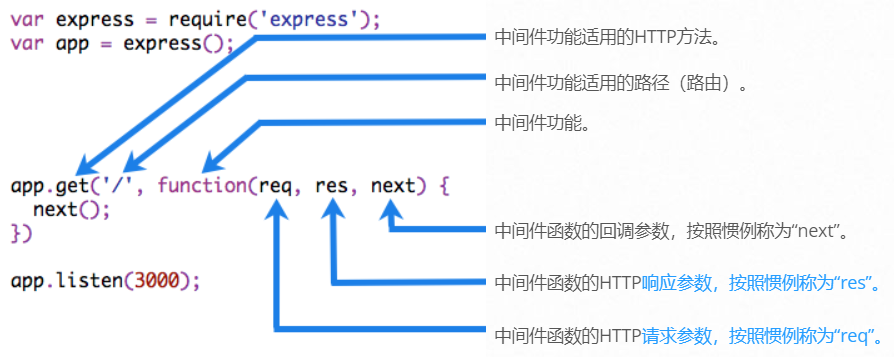

# Express

## 认识 Express

- 定义：`Express` 是一个用于 Node.js 的快速、不拘一格、极简主义的 Web 框架

  ```txt
  Fast, unopinionated, minimalist web framework for Node.js
  ```

- 安装：`npm install express`

- 框架核心理念：==中间件==

- 基本使用

  ```js
  /**
   * 此应用程序启动一个服务器并在端口 3000 上监听连接
   * 应用程序以 "Hello World!" 响应对根 URL (/) 或路由的 get 请求
   * 对于其他所有路径，它将以 404 Not Found 响应
   */
  const express = require('express');
  
  const app = express();
  const port = 3000;
  
  app.get('/', (req, res) => {
    res.send('Hello World!');
  });
  
  app.listen(port, () => {
    console.log(`Application is running at: http://localhost:${port}`);
  });
  ```


## 路由

### 认识路由

- 路由是指应用程序的端点 (URI) 如何响应客户端请求

  - 每个路由可以有一个或多个处理函数，当路由匹配时执行
  - 路由匹配本质上也只是一种特定匹配的中间件

- 路由定义采用以下结构

  ```js
  app.METHOD(PATH, ...handleFns)
  ```

  - `app` 是 `express` 的一个实例
  - `METHOD` 是小写的 HTTP 请求方法
  - `PATH` 是服务器上的路径
  - `HANDLER` 是路由匹配时执行的函数，可传递多个函数（中间件）


### 路由方法

- 路由方法派生自 HTTP 方法之一，并附加到 `express` 类的实例

  - 支持所有 HTTP 请求方法对应的方法，如 `get`、`post`  等

  ```js
  // GET method route
  app.get('/', (req, res) => {
    res.send('GET request to the homepage');
  });
  
  // POST method route
  app.post('/', (req, res) => {
    res.send('POST request to the homepage');
  });
  ```

- 除此之外，还有一种特殊的方法 `app.all()`，用于处理==所有请求方式==的 HTTP 请求

  ```js
  app.all('/', (req, res) => {
    res.send('Handle all method request');
  });
  ```


### 路由路径

- 路由路径定义了可以发出请求的端点

  - Express 使用 [path-to-regexp](https://www.npmjs.com/package/path-to-regexp) 来匹配路由路径
  - 路由路径可以是字符串、字符串模式或正则表达式

  ```js
  // 处理所有的 Get 请求
  app.get('*', (req, res) => {
    res.send('Handle all path of get method');
  });
  ```

- ==查询字符串==不是路由路径的一部分，不参与匹配


### 响应请求

- 下表中响应对象（`res`）上的方法可以向客户端发送响应，并终止请求-响应循环
- 如果没有从路由处理程序调用这些方法，则客户端请求将被挂起

| 方法                                                         | 描述                                               |
| ------------------------------------------------------------ | -------------------------------------------------- |
| [res.download()](https://expressjs.com/en/4x/api.html#res.download) | 提示要下载的文件                                   |
| [res.end()](https://expressjs.com/en/4x/api.html#res.end)    | 结束响应过程                                       |
| [res.json()](https://expressjs.com/en/4x/api.html#res.json)  | 发送 JSON 响应                                     |
| [res.jsonp()](https://expressjs.com/en/4x/api.html#res.jsonp) | 发送带有 JSONP 支持的 JSON 响应                    |
| [res.redirect()](https://expressjs.com/en/4x/api.html#res.redirect) | 重定向请求                                         |
| [res.render()](https://expressjs.com/en/4x/api.html#res.render) | 渲染视图模板                                       |
| [res.send()](https://expressjs.com/en/4x/api.html#res.send)  | 发送各种类型的响应                                 |
| [res.sendFile()](https://expressjs.com/en/4x/api.html#res.sendFile) | 将文件作为字节流发送                               |
| [res.sendStatus()](https://expressjs.com/en/4x/api.html#res.sendStatus) | 设置响应状态码并将其字符串表示形式作为响应正文发送 |


### 路由参数

- 路由参数是命名的 URL 段用于捕获在 URL 中的位置指定的值，也可称作==动态路由==

- 在处理函数的 `req.params` 中可以拿到所有的命名路由参数

  ```js
  app.get('/users/:userId/follow/:followId', (req) => {
    const { userId, followId } = req.params;
  });
  ```


### 模块化路由实例

- 使用 `express.Router` 类创建模块化、可安装的路由处理程序
  - 防止将所有的处理逻辑编写到 *app* 中
  - 一个 `Router` 实例是一个完整的中间件和路由系统；因此，它通常被称为 "mini-app"

- 使用方式

  - 创建路由程序

    ```js
    const express = require('express');
    const router = express.Router();
    
    router.get('/:id', (req, res, next) => {
      res.end('获取用户数据');
    });
    
    module.exports = router;
    ```

  - 在应用程序中注册路由

    ```js
    const express = require('express');
    const userRouter = require('./user');
    
    const app = express();
    
    // 第一个参数为注册路由的根路径
    app.use('/user', userRouter);
    ```


## 中间件

### 认识中间件

- Express 应用程序本质上是一系列中间件函数的调用

  

- 中间件的作用

  - 执行任何代码
  - 更改请求和响应对象
  - 结束请求-响应周期
  - 调用堆栈中的下一个中间件

- 中间件的本质是传递给 Express 的一个回调函数，该函数接收 3 个参数

  - 请求对象（`request`）
  - 响应对象（`response`）
  - `next` 函数（用于执行下一个中间件的函数）

  ```js
  const express = require('express');
  const app = express();
  
  const myLogger = (req, res, next) => {
    console.log('LOGGED');
    next();
  }
  
  app.use(myLogger);
  
  app.get('/', (req, res) => {
    res.send('Hello World!');
  });
  ```


### 中间件应用

#### 参数解析

- 解析 query 参数

  ```js
  app.get('/user', (req, res, next) => {
    console.log(req.query);
  });
  ```

- 解析 json 格式数据

  ```js
  app.use(express.json());
  ```

- 解析 urlencoded 格式数据

  ```js
  app.use(express.urlencoded({ extended: true }));
  ```

- 解析 formData 格式数据

  ```js
  const express = require('express');
  const multer = require('multer');
  
  const upload = multer();
  const app = express();
  
  app.post('/test', upload.any(), (req, res) => {
    // 包含表单数据
    console.log(req.body);
    res.send("Success");
  });
  ```


#### 静态资源服务

- 使用 Express 内置的中间件可以提供静态资源服务

  ```js
  app.use(express.static('./client'));
  ```

- 为获得最佳效果，使用==反向代理==（如 nginx）缓存以提高服务静态资产的性能，同时可以释放 Express 来执行专门的应用程序任务


#### 文件上传

- 客户端实现

  ```html
  <form id="single">
    <label for="single-file">
      单文件上传：
      <input type="file" id="single-file" name="file" />
    </label>
  </form>
  
  <form id="multiple">
    <label for="multiple">
      多文件上传：
      <input type="file" id="multiple" name="files" multiple />
    </label>
  </form>
  
  <button id="upload-single">单文件上传</button>
  <button id="upload-multiple">多文件上传</button>
  
  <script>
    const singleForm = document.querySelector("#single");
    const singleBtn = document.querySelector("#upload-single");
  
    const multipleForm = document.querySelector("#multiple");
    const multipleBtn = document.querySelector("#upload-multiple");
  
    // 单文件上传
    singleBtn.addEventListener("click", () => {
      fetch("/upload/single", {
        method: "post",
        body: new FormData(singleForm)
      });
    });
  
    // 多文件上传
    multipleBtn.addEventListener("click", () => {
      fetch("/upload/multiple", {
        method: "post",
        body: new FormData(multipleForm)
      });
    });
  </script>
  ```

- 服务端实现

  ```js
  const { resolve, extname } = require("path");
  const express = require("express");
  const multer = require("multer");
  
  const app = express();
  
  app.use(express.static("./"));
  
  const storage = multer.diskStorage({
    /**
     * @description 配置上传目录
     */
    destination: function (req, file, cb) {
      cb(null, resolve(__dirname, "upload"));
    },
    /**
     * @description 配置上传文件的名称
     */
    filename: function (req, file, cb) {
      const { originalname } = file;
      const filename = `${Date.now()}${extname(originalname)}`;
  
      cb(null, filename);
    }
  });
  
  const upload = multer({ storage });
  
  /**
   * @description 单个文件上传接口
   * 其中 single 函数传递的 "file" 与客户端上传文件对应的表单 name 保持一致
   */
  app.post("/upload/single", upload.single("file"), (req, res) => {
    res.send("单文件上传接口测试成功");
  });
  
  /**
   * @description 多文件上传接口
   * 其中 array 函数传递的 "file" 与客户端上传文件对应的表单 name 保持一致
   */
  app.post("/upload/multiple", upload.array("files"), (req, res) => {
    res.send("多文件上传接口测试成功");
  });
  
  app.listen(3000, () => {
    console.log("启动成功");
  });
  ```


#### 文件下载

- 服务端实现

  ```js
  /**
   * @description 文件下载接口
   */
  app.post("/download/:fileId", (req, res) => {
    // 一般来说，需要根据客户端传递文件 id，然后去查询数据库得到需要下载的文件
    const { fileId } = req.params;
  
    /**
     * @description 模拟下载，直接读取某个文件
     */
    const filePath = resolve(__dirname, "./upload/geek.exe");
    const fileName = basename(filePath);
  
    // 设置请求头，告知客户端当前下载的文件名
    res.setHeader("Download-Filename", fileName);
    // 发送文件
    res.send(readFileSync(filePath));
  });
  ```

- 客户端读取服务端返回的文件，并下载

  ```html
  <a id="download">下载文件</a>
  
  <script>
    const downloadLink = document.querySelector("#download");
  
    const download = (file, filename) => {
      // 指定二进制文件的 MIME 类型
      const blob = new Blob([file], { type: "application/octet-stream" });
  
      const a = document.createElement("a");
      a.href = URL.createObjectURL(blob);
      a.download = filename;
      a.click();
      a.remove();
    };
  
    downloadLink.addEventListener("click", async (e) => {
      e.preventDefault();
  
      // XMLHttpRequest 下载
      const xhr = new XMLHttpRequest();
      xhr.open("GET", "/download/11");
      xhr.responseType = "arraybuffer";
      xhr.onload = () => {
        const file = xhr.response;
        const filename = xhr.getResponseHeader("Download-Filename");
  
        download(file, filename);
      };
      xhr.send();
  
      // Fetch 下载
      const { file, filename } = await fetch("/download/111", {
        method: "post"
      }).then(async (response) => {
        const file = await response.blob();
  
        return {
          file,
          filename: response.headers.get("Download-Filename")
        };
      });
  
      download(file, filename);
    });
  </script>
  ```


### 错误处理

- 传递错误：给 `next` 函数传递参数

  ```js
  app.get('/:id', (req, res, next) => {
    // 比如去查询数据库
    const err = true;
    
    if (err) {
      next(new Error('BROKEN'));
    } else {
      res.end('获取用户数据');
    }
  })
  ```

- 编写错误处理中间件

  - 错误处理函数有四个参数而不是三个：`(err, req, res, next)`
  - 错误处理中间件在其他 `app.use()` 和路由调用之后

  ```js
  app.use((err, req, res, next) => {
    switch(err.message) {
      case "NOT FOUND":
        res.status(404).json({ message });
        break;
      // ......
    }
    
    res.status(500);
  });
  ```
