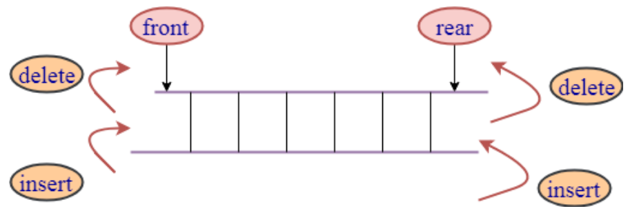

# 双端队列

## 认识双端队列

- **双端队列** 在单向队列的基础上解除了一部分限制，允许在队列的==两端==添加（入队）和删除（出队）元素

  

- 因为解除了一部分限制，所以在解决一些特定问题时会更加的方便


## 封装双端队列

| 属性/方法          | 描述                           |
| ------------------ | ------------------------------ |
| pushFront(element) | 向队列头部添加一个元素         |
| pushBack(element)  | 向队列尾部添加一个元素         |
| popFront()         | 将队头元素出队，并返回这个元素 |
| popBack()          | 将队尾元素出队，并返回这个元素 |
| peekFront()        | 查看队头元素                   |
| peekBack()         | 查看队尾元素                   |
| isEmpty            | 队列是否为空                   |
| size               | 队列内元素个数                 |

### 基于数组实现

```typescript
/**
 * @description 双端队列-基于数组
 */
class ArrayDeque<T> {
  /**
   * @description 创建一个数组，用于存放队列元素
   */
  private store: T[] = [];

  /**
   * @description 在队列头部入队
   * @param element 入队元素
   */
  pushFront(element: T) {
    this.store.unshift(element);
  }

  /**
   * @description 在队列尾部入队
   * @param element 入队元素
   */
  pushBack(element: T) {
    this.store.push(element);
  }

  /**
   * @description 在队列头部出队
   * @returns 出队元素
   */
  popFront(): T | null {
    return this.store.shift() ?? null;
  }

  /**
   * @description 在队列尾部出队
   * @returns 出队元素
   */
  popBack(): T | null {
    return this.store.pop() ?? null;
  }

  /**
   * @description 查看队列头部元素
   */
  peekFront(): T | null {
    return this.store[0] ?? null;
  }

  /**
   * @description 查看队列尾部元素
   */
  peekBack(): T | null {
    return this.store.at(-1) ?? null;
  }

  /**
   * @description 获取队列元素个数
   */
  get size(): number {
    return this.store.length;
  }

  /**
   * @description 队列是否为空
   */
  get isEmpty(): boolean {
    return this.size === 0;
  }
}
```


### 基于链表实现

采用 [双向链表](../linkedList/doubly-linkedList#双向链表完整实现) 来存储队列元素

```typescript
import DoublyLinkedList from "./DoublyLinkedList";

/**
 * @description 双端队列-基于链表
 */
class LinkedDeque<T> {
  /**
   * @description 创建一个双向链表，用于存放队列元素
   */
  private store = new DoublyLinkedList<T>();

  /**
   * @description 在队列头部入队
   * @param element 入队元素
   */
  pushFront(element: T) {
    this.store.prepend(element);
  }

  /**
   * @description 在队列尾部入队
   * @param element 入队元素
   */
  pushBack(element: T) {
    this.store.append(element);
  }

  /**
   * @description 在队列头部出队
   * @returns 出队元素
   */
  popFront(): T | null {
    return this.store.removeAt(0);
  }

  /**
   * @description 在队列尾部出队
   * @returns 出队元素
   */
  popBack(): T | null {
    return this.store.removeAt(this.size - 1);
  }

  /**
   * @description 查看队列头部元素
   */
  peekFront(): T | null {
    return this.store.get(0);
  }

  /**
   * @description 查看队列尾部元素
   */
  peekBack(): T | null {
    return this.store.get(this.size - 1);
  }

  /**
   * @description 获取队列元素个数
   */
  get size(): number {
    return this.store.size;
  }

  /**
   * @description 队列是否为空
   */
  get isEmpty(): boolean {
    return this.size === 0;
  }
}
```
