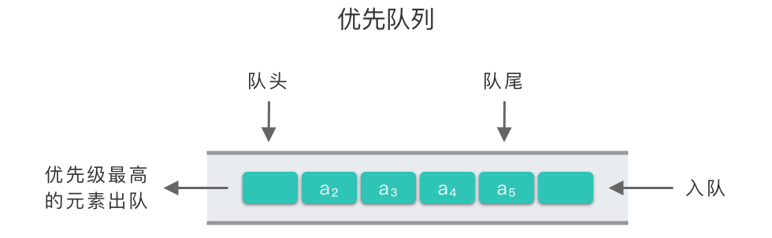

# 优先队列

## 认识优先队列

- **优先队列**（priority queue）是计算机科学中的一种抽象数据类型，队列中每个元素都有各自的==优先级==

  - 优先级最高的元素最先得到服务
  - 优先级相同的元素按照其在优先队列中的顺序得到服务

  

- 优先队列常用于操作系统的任务调度，也是 **贪心算法** 的重要组成部分

- 优先级队列可以用数组、链表等数据结构来实现，出于性能考虑，==堆==是最常用的实现方式


## 封装优先队列

| 属性/方法                  | 描述                           |
| -------------------------- | ------------------------------ |
| enqueue(element, priority) | 向队列添加一个元素             |
| dequeue()                  | 将队头元素出队，并返回这个元素 |
| peek()                     | 查看队头元素                   |
| isEmpty                    | 队列是否为空                   |
| size                       | 队列内元素个数                 |

- 优先队列内部使用 [堆](../heap#封装堆结构) 来存储元素，默认使用 **最大堆**（即优先级高的元素优先出队）
- 为了能记录元素的优先级，我们采用 `PriorityNode` 类来封装元素及其优先级，因而存储到堆中的元素实际为该类的实例

```typescript
import Heap from "./Heap";

/**
 * @description 优先级节点
 */
class PriorityNode<T> {
  /**
   * @description 队列元素值
   */
  value: T;
  /**
   * @description 队列元素优先级
   */
  private priority: number;

  /**
   * @description 构造函数
   * @param value 元素值
   * @param priority 元素优先级
   */
  constructor(value: T, priority: number) {
    this.value = value;
    this.priority = priority;
  }

  /**
   * @description 使用 priority 属性作为元素的优先级
   */
  valueOf() {
    return this.priority;
  }
}

/**
 * @description 优先队列
 */
class PriorityQueue<T> {
  /**
   * @description 声明一个最大堆，用于存储队列元素及其优先级
   */
  private store: Heap<PriorityNode<T>> = new Heap();

  /**
   * @description 入队
   * @param element 入队元素
   * @param priority 入队元素优先级
   */
  enqueue(element: T, priority: number) {
    this.store.insert(new PriorityNode(element, priority));
  }

  /**
   * @description 出队
   * @returns 出队元素
   */
  dequeue(): T | null {
    return this.store.extract()?.value ?? null;
  }

  /**
   * @description 获取队头元素
   */
  peek(): T | null {
    return this.store.peek()?.value ?? null;
  }

  /**
   * @description 获取队列元素个数
   */
  get size(): number {
    return this.store.size;
  }

  /**
   * @description 队列是否为空
   */
  get isEmpty(): boolean {
    return this.size === 0;
  }
}
```
