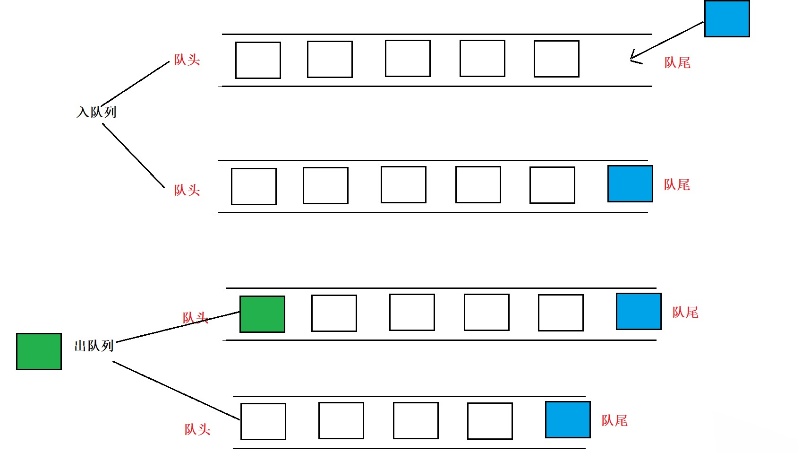

# 队列

## 认识队列

- ==队列==（Queue）是一种受限的==线性结构==，按照==先进先出==的原理运作

  - 仅允许在集合的==后端==进行插入，在集合的==前端==进行删除
  - 通常使用 **数组** 或 **链表** 来实现

- 队列的特点

  - 先进先出，后进后出
  - 除头尾节点之外，每个元素有一个前驱，一个后继

  

- 队列的两种操作

  - ==入队==：向一个队列插入新元素，它是把新元素插入到队尾，使之成为新的队尾元素

  - ==出队==：从一个队列删除元素，它是把队头元素删除掉，使其相邻的元素成为新的队头元素

- 队列的应用

  - 层序遍历
  - 广度优先搜索


## 封装队列

队列常见的操作

| 方法             | 描述                           |
| ---------------- | ------------------------------ |
| enqueue(element) | 向队列添加一个元素（element）  |
| dequeue()        | 将队头元素出队，并返回这个元素 |
| peek()           | 查看队头元素                   |
| isEmpty          | 队列是否为空                   |
| size             | 队列内元素个数                 |

### 基于数组实现

```typescript
export default class ArrayQueue<T> {
  /**
   * @description 创建一个数组，用于存放队列元素
   */
  private store: T[] = [];

  /**
   * @description 入队
   * @param element 入队元素
   */
  enqueue(element: T) {
    this.store.push(element);
  }

  /**
   * @description 出队
   * @returns 出队元素
   */
  dequeue(): T | null {
    return this.store.shift() ?? null;
  }

  /**
   * @description 获取队头元素
   */
  peek(): T | null {
    return this.store[0] ?? null;
  }

  /**
   * @description 获取队列元素个数
   */
  get size(): number {
    return this.store.length;
  }

  /**
   * @description 队列是否为空
   */
  get isEmpty(): boolean {
    return this.size === 0;
  }
}
```


### 基于链表实现

采用 [双向链表](./linkedList/doubly-linkedList#双向链表完整实现) 来存储队列元素

```typescript
import DoublyLinkedList from "./DoublyLinkedList";

class LinkedQueue<T> {
  /**
   * @description 创建一个双向链表，用于存放队列元素
   */
  private store = new DoublyLinkedList<T>();

  /**
   * @description 入队
   * @param element 入队元素
   */
  enqueue(element: T) {
    this.store.append(element);
  }

  /**
   * @description 出队
   * @returns 出队元素
   */
  dequeue(): T | null {
    return this.store.removeAt(0) ?? null;
  }

  /**
   * @description 获取队头元素
   */
  peek(): T | null {
    return this.store.get(0) ?? null;
  }

  /**
   * @description 获取队列元素个数
   */
  get size(): number {
    return this.store.size;
  }

  /**
   * @description 队列是否为空
   */
  get isEmpty(): boolean {
    return this.size === 0;
  }
}
```
