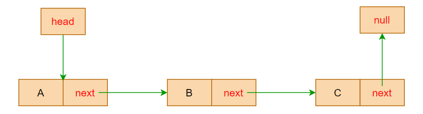
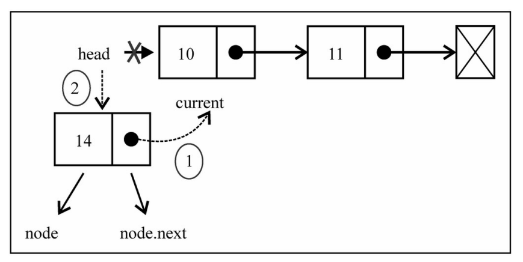
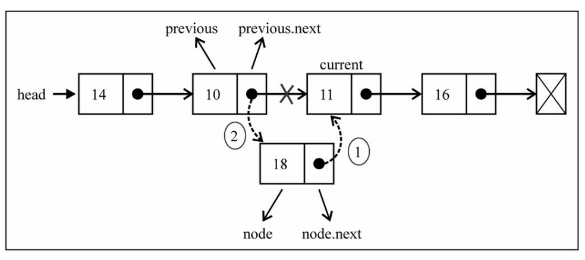
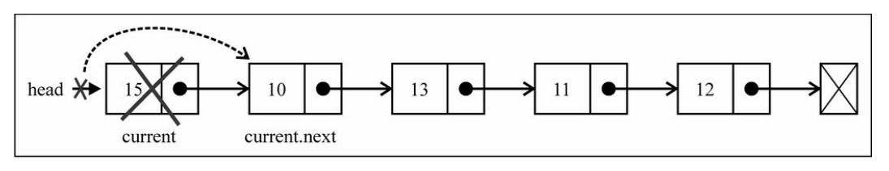
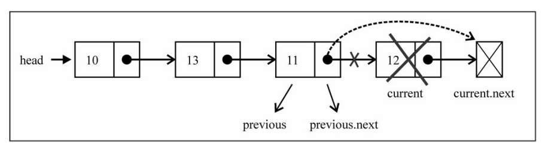

# 单向链表

## 认识单向链表

- 单向链表是最简单的一种链表，链表中每一个节点包含两个域：一个==信息域==和一个==指针域==

  - 信息域保存关于节点的信息
  - 指针域存储==下一个节点的地址==，在最后一个节点指向一个==特殊的结束标记==，比如 `null`
  - 同时还包含一个==头指针== `head`，指向链表的==第一个节点==

  

- 单向链表只可==向一个方向==（从头至尾）遍历


## 封装单向链表

| 属性/方法               | 描述                       |
| ----------------------- | -------------------------- |
| append(value)           | 向链表尾部添加一个节点     |
| insert(position, value) | 向链表指定位置插入一个节点 |
| get(position)           | 查看指定位置的节点         |
| update(position, value) | 修改指定位置节点值         |
| removeAt(position)      | 删除指定位置的节点         |
| traverse()              | 遍历链表，返回遍历结果     |
| isEmpty                 | 链表是否为空               |
| size                    | 链表内元素个数             |

### 初始化链表结构

- 准备一个 `LinkedNode` 类，用于保存每个节点的信息

  ```typescript
  /**
   * @description 节点类
   */
  class LinkedNode<T> {
    /**
     * @description 节点的值
     */
    value: T;
    /**
     * @description 下一个节点的指针，初始为 null
     */
    next: LinkedNode<T> | null = null;
  
    constructor(value: T) {
      this.value = value;
    }
  }
  ```

- 定义链表类 `LinkedList`，包含一个头指针（指向第一个节点）和长度属性

  ```typescript
  /**
   * @description 单向链表
   */
  class LinkedList<T> {
    /**
     * @description 链表长度
     */
    private length = 0;
    /**
     * @description 头指针
     */
    private head: LinkedNode<T> | null = null;
  
    /**
     * @description 获取链表元素个数
     */
    get size(): number {
      return this.length;
    }
  
    /**
     * @description 链表是否为空
     */
    get isEmpty(): boolean {
      return this.length === 0;
    }
  }
  ```


### 插入方法 — insert

- 首先我们先定义一个方法，用于查找指定位置的节点信息

  ```typescript
  class LinkedList<T> {
    /**
     * @description 根据位置查找节点
     * @param position 位置
     */
    private findNodeByPosition(position: number) {
      // 从头节点开始遍历
      let current = this.head;
      // 记录前一个节点
      let prev: LinkedNode<T> | null = null;
      // 记录当前搜索索引位置
      let index = 0;
  
      while (current && ++index <= position) {
        prev = current;
        current = current.next;
      }
  
      return { prev, target: current };
    }
  }
  ```

- `insert` 方法用于==在指定位置插入节点==，返回是否成功插入

  - 情况一：插入的位置是 `0`，即插入到链表头部

    - 先让插入节点 `insertNode.next` 指向原来的头节点
    - 再让头指针 `head` 指向这个插入的节点 `insertNode`

    

  - 情况二：插入到其他位置

    - 先根据这个位置，查找到对应的==节点== `target` 和它的==前一个节点== `prev`
    - 让前一个节点 `prev.next` 指向这个插入的节点 `insertNode`
    - 再让插入节点 `insertNode.next` 指向原位置节点 `target`

    

- 插入完成后，链表长度 `length` 递增 1

```typescript
class LinkedList<T> {
  /**
   * 向指定位置插入一个节点
   * @param position 指定位置
   * @param value 插入节点值
   * @returns 是否插入成功
   */
  insert(position: number, value: T): boolean {
    // 位置越界，插入失败
    if (position < 0 || position > this.length) return false;

    // 创建新节点
    const insertNode = new LinkedNode<T>(value);

    if (position === 0) {
      /**
       * 在头部插入
       */
      // 先让【插入节点】的 next 指向【头节点】
      insertNode.next = this.head;
      // 再让这个【插入节点】作为新的【头节点】
      this.head = insertNode;
    } else {
      /**
       * 在其他位置插入
       */
      // 查找指定位置的节点
      const { prev, target } = this.findNodeByPosition(position);

      /**
       * 先让上一个节点的 next 指向 insertNode
       * 再让 insertNode 的 next 指向当前位置节点
       */
      prev!.next = insertNode;
      insertNode.next = target;
    }

    // 插入完成，更新链表长度
    this.length++;

    return true;
  }
}
```


### 添加方法 — append

- `append` 方法用于在链表==末尾==追加节点

- 因此只需要使用 `insert` 方法即可，即在链表长度位置 `length` 处插入

```typescript
class LinkedList<T> {
  /**
   * @description 添加节点
   * @param element 节点值
   */
  append(value: T) {
    // 转化为在最后一个节点后面插入
    this.insert(this.length, value);
  }
}
```


### 查找方法 — get

`get` 方法用于==查找指定位置的节点==，查找不到返回 `null`

```typescript
class LinkedList<T> {
  /**
   * @description 查询指定位置的节点值，查找不到返回 null
   * @param position 指定位置
   */
  get(position: number): T | null {
    // 位置越界，返回空值
    if (position < 0 || position >= this.length) return null;

    return this.findNodeByPosition(position).target?.value ?? null;
  }
}
```


### 更新方法 — update

`update` 方法用于==修改指定位置的节点值==，返回是否修改成功

```typescript
class LinkedList<T> {
  /**
   * @description 修改指定位置的节点值
   * @param position 指定位置
   * @param value 节点新值
   * @returns 是否修改成功
   */
  update(position: number, value: T): boolean {
    // 位置越界，修改失败
    if (position < 0 || position >= this.length) return false;

    // 查找指定位置的节点
    const { target } = this.findNodeByPosition(position);

    // 不存在该节点，修改失败
    if (!target) return false;

    // 更新节点值
    target.value = value;

    return true;
  }
}
```


### 删除方法 — removeAt

- `removeAt` 方法用于==删除指定位置节点==，返回删除的节点值，查找不到返回 `null`

  - 情况一：删除位置是 `0`，即删除链表头部节点

    - 直接让头部 `head` 指向头部节点的下一个节点 `head.next`

    

  - 情况二：删除其他位置节点

    - 先根据这个位置，查找到对应的==节点== `target` 和它的==前一个节点== `prev`
    - 让前一个节点 `prev.next` 指向这个删除节点的下一个节点 `target.next`

    

- 删除完成后，链表长度 `length` 递减 1

```typescript
class LinkedList<T> {
  /**
   * @description 删除指定位置的节点
   * @param position 指定位置
   * @returns 删除的节点值，删除失败则返回 null
   */
  removeAt(position: number): T | null {
    // 位置越界，删除失败
    if (position < 0 || position >= this.length) return null;

    // 记录删除的节点，初始指向头节点
    let deletedNode: LinkedNode<T> | null = this.head;

    if (position === 0) {
      /**
       * 删除头部节点，让头部指向下一个节点
       */
      this.head = this.head?.next ?? null;
    } else {
      /**
       * 删除其他位置节点
       */
      // 查询删除位置的节点
      const { prev, target } = this.findNodeByPosition(position);
      // 非头部节点，让【上一个节点】的 next 指向【当前删除节点】的下一个节点
      prev!.next = target?.next ?? null;
      // 记录被删除的节点
      deletedNode = target;
    }

    // 删除完成，更新长度
    this.length--;

    // 返回删除的节点值
    return deletedNode?.value ?? null;
  }
}
```


### 遍历方法 — traverse

`traverse` 方法用于遍历链表，并以 **数组** 形式返回遍历结果

```typescript
/**
 * @description 单向链表
 */
class LinkedList<T> {
  /**
   * @description 遍历链表
   * @returns 遍历结果数组
   */
  traverse(): T[] {
    // 声明一个数组，用于存放遍历结果
    const result: T[] = [];
    // 从头节点开始遍历
    let current = this.head;

    while (current) {
      result.push(current.value);
      current = current.next;
    }

    return result;
  }
}
```


### 单向链表完整实现

```typescript
/**
 * @description 节点类
 */
class LinkedNode<T> {
  /**
   * @description 节点的值
   */
  value: T;
  /**
   * @description 下一个节点的指针，初始为 null
   */
  next: LinkedNode<T> | null = null;

  constructor(value: T) {
    this.value = value;
  }
}

/**
 * @description 单向链表
 */
class LinkedList<T> {
  /**
   * @description 链表长度
   */
  private length = 0;
  /**
   * @description 头指针
   */
  private head: LinkedNode<T> | null = null;

  /**
   * @description 根据位置查找节点
   * @param position 位置
   */
  private findNodeByPosition(position: number) {
    // 从头节点开始遍历
    let current = this.head;
    // 记录前一个节点
    let prev: LinkedNode<T> | null = null;
    // 记录当前搜索索引位置
    let index = 0;

    while (current && ++index <= position) {
      prev = current;
      current = current.next;
    }

    return { prev, target: current };
  }

  /**
   * @description 遍历链表
   * @returns 遍历结果数组
   */
  traverse(): T[] {
    // 声明一个数组，用于存放遍历结果
    const result: T[] = [];
    // 从头节点开始遍历
    let current = this.head;

    while (current) {
      result.push(current.value);
      current = current.next;
    }

    return result;
  }

  /**
   * @description 添加节点
   * @param element 节点值
   */
  append(value: T) {
    // 转化为在最后一个节点后面插入
    this.insert(this.length, value);
  }

  /**
   * 向指定位置插入一个节点
   * @param position 指定位置
   * @param value 插入节点值
   * @returns 是否插入成功
   */
  insert(position: number, value: T): boolean {
    // 位置越界，插入失败
    if (position < 0 || position > this.length) return false;

    // 创建新节点
    const insertNode = new LinkedNode<T>(value);

    if (position === 0) {
      /**
       * 在头部插入
       */
      // 先让【插入节点】的 next 指向【头节点】
      insertNode.next = this.head;
      // 再让这个【插入节点】作为新的【头节点】
      this.head = insertNode;
    } else {
      /**
       * 在其他位置插入
       */
      // 查找指定位置的节点
      const { prev, target } = this.findNodeByPosition(position);

      /**
       * 先让上一个节点的 next 指向 insertNode
       * 再让 insertNode 的 next 指向当前位置节点
       */
      prev!.next = insertNode;
      insertNode.next = target;
    }

    // 插入完成，更新链表长度
    this.length++;

    return true;
  }

  /**
   * @description 查询指定位置的节点值，查找不到返回 null
   * @param position 指定位置
   */
  get(position: number): T | null {
    // 位置越界，返回空值
    if (position < 0 || position >= this.length) return null;

    return this.findNodeByPosition(position).target?.value ?? null;
  }

  /**
   * @description 修改指定位置的节点值
   * @param position 指定位置
   * @param value 节点新值
   * @returns 是否修改成功
   */
  update(position: number, value: T): boolean {
    // 位置越界，修改失败
    if (position < 0 || position >= this.length) return false;

    // 查找指定位置的节点
    const { target } = this.findNodeByPosition(position);

    // 不存在该节点，修改失败
    if (!target) return false;

    // 更新节点值
    target.value = value;

    return true;
  }

  /**
   * @description 删除指定位置的节点
   * @param position 指定位置
   * @returns 删除的节点值，删除失败则返回 null
   */
  removeAt(position: number): T | null {
    // 位置越界，删除失败
    if (position < 0 || position >= this.length) return null;

    // 记录删除的节点，初始指向头节点
    let deletedNode: LinkedNode<T> | null = this.head;

    if (position === 0) {
      /**
       * 删除头部节点，让头部指向下一个节点
       */
      this.head = this.head?.next ?? null;
    } else {
      /**
       * 删除其他位置节点
       */
      // 查询删除位置的节点
      const { prev, target } = this.findNodeByPosition(position);
      // 非头部节点，让【上一个节点】的 next 指向【当前删除节点】的下一个节点
      prev!.next = target?.next ?? null;
      // 记录被删除的节点
      deletedNode = target;
    }

    // 删除完成，更新长度
    this.length--;

    // 返回删除的节点值
    return deletedNode?.value ?? null;
  }

  /**
   * @description 获取链表元素个数
   */
  get size(): number {
    return this.length;
  }

  /**
   * @description 链表是否为空
   */
  get isEmpty(): boolean {
    return this.length === 0;
  }
}
```
