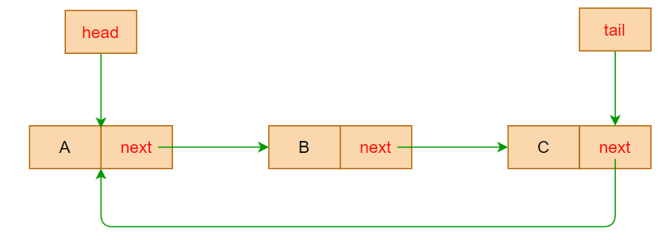
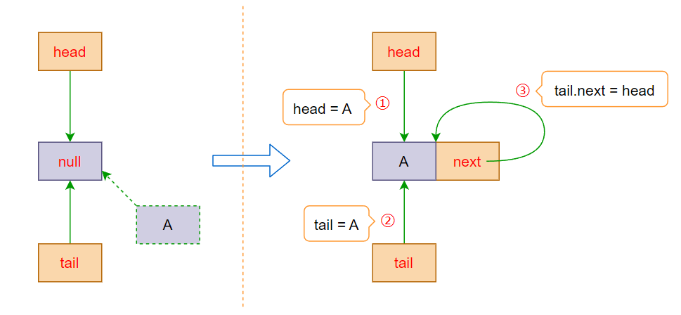
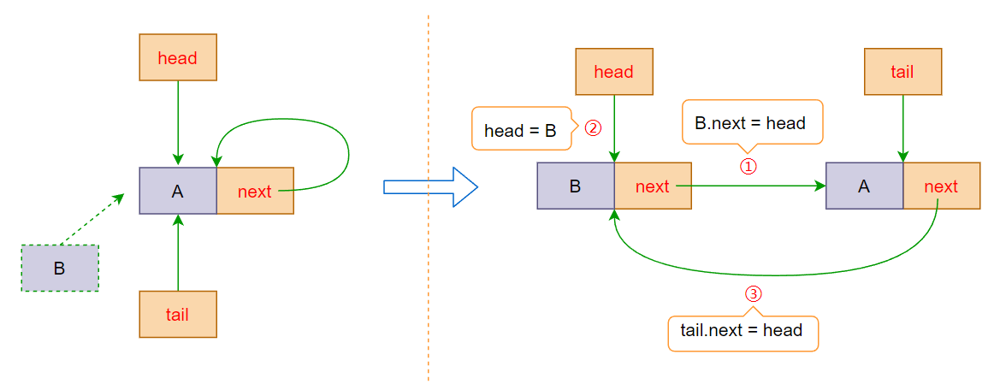
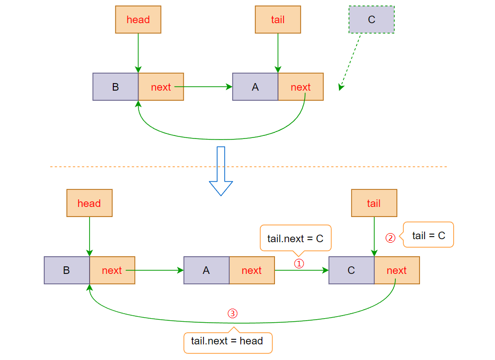
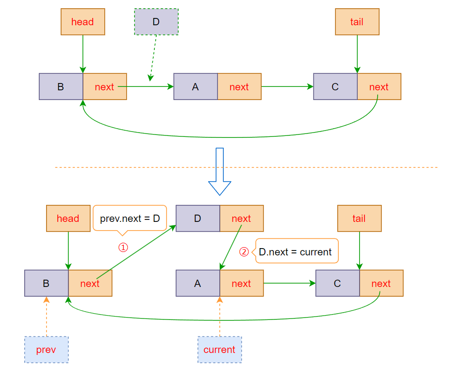
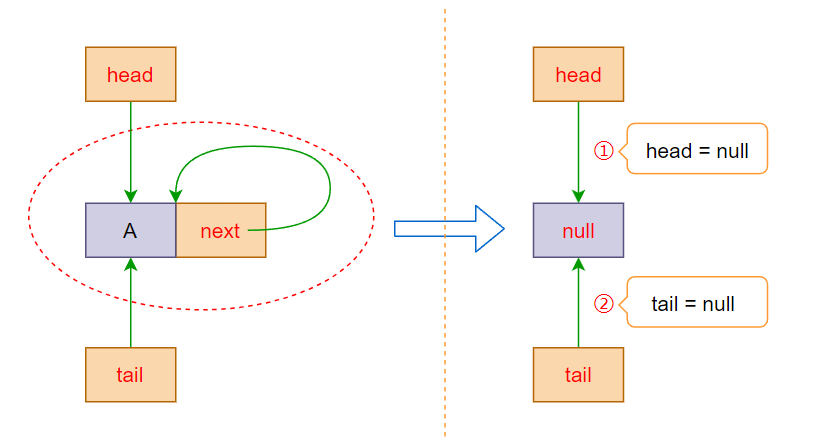
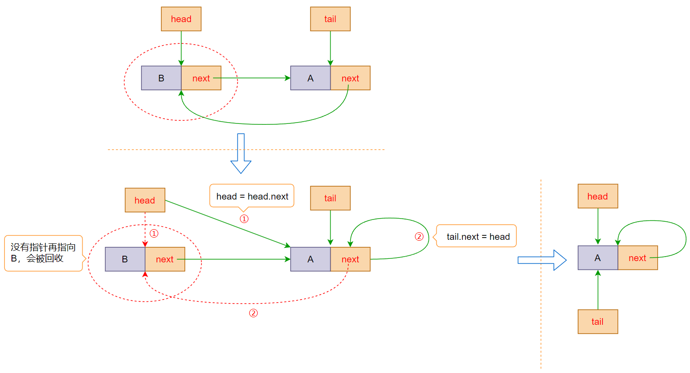
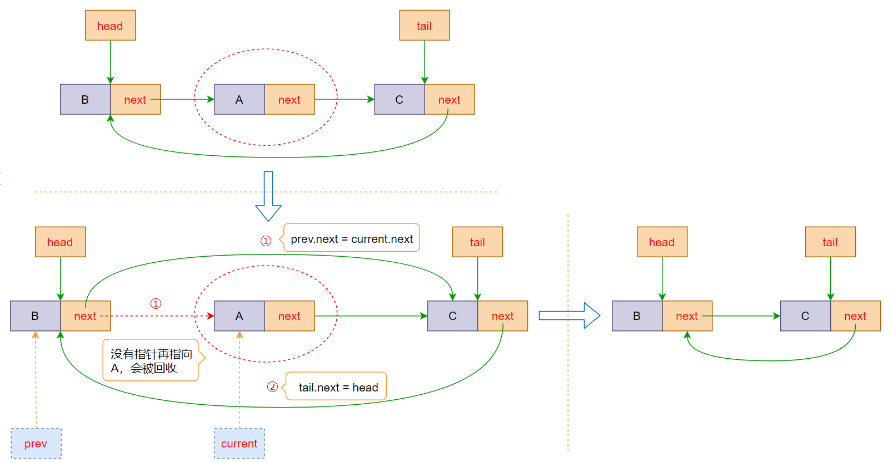

# 循环链表

## 认识循环链表

- **循环链表**（Circular LinkedList）是一种特殊的链表数据结构

  - 在普通链表的基础上，循环链表的==最后一个结点指向头结点==，形成一个==环==
  - 从循环链表中的==任何一个结点==出发都能找到任何其他结点

  

- 循环链表的操作和单向链表的操作基本一致，差别仅仅在于算法中的==循环条件==有所不同


## 封装循环链表

| 方法                    | 描述                       |
| ----------------------- | -------------------------- |
| append(value)           | 向链表尾部添加一个节点     |
| insert(position, value) | 向链表指定位置插入一个节点 |
| get(position)           | 查看指定位置的节点         |
| update(position, value) | 修改指定位置节点值         |
| removeAt(position)      | 删除指定位置的节点         |
| traverse()              | 遍历链表，返回遍历结果     |
| isEmpty                 | 链表是否为空               |
| size                    | 链表内元素个数             |

### 初始化循环链表结构

- 对于之前在单向链表中封装的 `LinkedNode` 节点类，可以继续复用，无需进行修改

- 创建循环链表类 `CircularLinkedList`，在循环链表中需要始终满足==尾部节点的下一个节点指向头部节点==

  - 为了快速拿到尾部节点，我们可以增加一个 `tail` 属性，初始指向 `null`
  - 在对链表进行增删节点时，若链表非空，需要始终满足 `this.tail.next = this.head`

  ```typescript
  /**
   * @description 循环链表
   */
  class CircularLinkedList<T> {
    /**
     * @description 链表长度
     */
    private length = 0;
    /**
     * @description 头指针
     */
    private head: LinkedNode<T> | null = null;
    /**
     * @description 尾指针
     */
    private tail: LinkedNode<T> | null = null;
  
    /**
     * @description 获取链表元素个数
     */
    get size(): number {
      return this.length;
    }
  
    /**
     * @description 链表是否为空
     */
    get isEmpty(): boolean {
      return this.length === 0;
    }
  }
  ```


### 插入方法 — insert

- 情况一：链表为空，直接让头尾指针都指向这个新增的节点

  

- 情况二：在非空链表头部插入节点

  - 先让【插入节点】的 next 指向【头部节点】

  - 再让头指针指向【插入节点】，使其称为新的【头部节点】

  - 最后让尾指针的 next 重新指向头节点

  

- 情况三：在非空链表尾部插入节点

  - 先让【尾部节点】的 next 指向【插入节点】

  - 再让尾指针重新指向这个【插入节点】

  - 最后让尾指针的 next 重新指向头节点

  

- 情况四：在非空链表中间位置插入

  - 先根据插入位置查询对应位置的节点信息
  - 让目标位置节点的【前一个节点】的 next 指向【当前插入的节点】
  - 再让【插入节点】的 next 指向【原位置上的节点】

  

```typescript
/**
 * @description 循环链表
 */
class CircularLinkedList<T> {
  /**
   * 向指定位置插入一个节点
   * @param position 指定位置
   * @param value 插入节点值
   * @returns 是否插入成功
   */
  insert(position: number, value: T): boolean {
    // 位置越界，插入失败
    if (position < 0 || position > this.length) return false;

    // 创建新节点
    const insertNode = new LinkedNode<T>(value);

    if (this.length === 0) {
      /**
       * 情况一：链表为空，直接让头尾指针都指向这个新增的节点
       */
      this.head = insertNode;
      this.tail = insertNode;
    } else {
      if (position === 0) {
        /**
         * 情况二：在头部插入节点
         */
        // 先让【插入节点】的 next 指向【头部节点】
        insertNode.next = this.head;
        // 再让头指针指向【插入节点】，使其称为新的【头部节点】
        this.head = insertNode;
      } else if (position === this.length) {
        /**
         * 情况三：在尾部插入节点
         */
        // 先根据尾指针找到【尾部节点】，让其 next 指向【插入节点】
        this.tail!.next = insertNode;
        // 再让尾指针重新指向这个【插入节点】
        this.tail = insertNode;
      } else {
        /**
         * 情况四：在中间位置插入
         */
        // 先查询插入位置的节点
        const { prev, target } = this.findNodeByPosition(position);
        // 先让【前一个节点】的 next 指向【当前插入的节点】
        prev!.next = insertNode;
        // 再让【插入节点】的 next 指向【原位置上的节点】
        insertNode.next = target;
      }
    }

    // 让尾指针的 next 重新指向头节点
    this.tail!.next = this.head;

    // 插入完成，更新链表长度
    this.length++;

    return true;
  }
}
```


### 删除方法 — removeAt

- 情况一：链表为空，直接终止删除操作

- 情况二：非空链表中只有一个节点，直接让头尾指针都指向 null 即可

  

- 情况三：在非空链表头部删除节点

  - 先让【插入节点】的 next 指向【头节点】

  - 再让尾指针的 next 重新指向头节点

  

- 情况四：在非空链表尾部或其他位置删除节点

  - 先根据插入位置查询对应位置的节点信息
  - 让【删除节点前一个节点】的 next 指向 【删除节点的下一个节点】
  - 若删除的是为尾部节点，还需要将尾指针指向【前一个节点】

  

```typescript
/**
 * @description 循环链表
 */
class CircularLinkedList<T> {
  /**
   * @description 删除指定位置的节点
   * @param position 指定位置
   * @returns 删除的节点值，删除失败则返回 null
   */
  removeAt(position: number): T | null {
    // 位置越界，删除失败
    if (position < 0 || position >= this.length) return null;

    // 记录删除的节点，初始值为头节点
    let deletedNode: LinkedNode<T> | null = this.head;

    if (this.length === 1) {
      /**
       * 情况一：链表中只有一个节点，直接让头尾指针都指向 null 即可
       */
      this.head = null;
      this.tail = null;
    } else {
      if (position === 0) {
        /**
         * 情况二：在头部删除节点
         */
        // 让头指针指向【头节点指向的下一个节点】
        this.head = this.head!.next;
      } else {
        /**
         * 情况三：在尾部或中间位置删除节点
         */
        // 先查询删除位置的节点
        const { prev, target } = this.findNodeByPosition(position);
        // 让【删除节点前一个节点】的 next 指向 【删除节点的下一个节点】
        prev!.next = target!.next;

        // 若删除的是为尾部节点，还需要将尾指针指向【前一个节点】
        if (position === this.length - 1) this.tail = prev;

        // 记录删除节点
        deletedNode = target;
      }

      // 让尾指针的 next 重新指向头节点
      this.tail!.next = this.head;
    }

    // 删除完成，更新长度
    this.length--;

    // 返回删除的节点值
    return deletedNode?.value ?? null;
  }
}
```


### 遍历方法 — traverse

- 由于循环链表的尾部节点的 `next` 指向头节点，所以在遍历时需要设置==终止条件==
- 即当==遍历完最后一个节点==时，跳出循环遍历，否则会进入死循环

```typescript
/**
 * @description 循环链表
 */
class CircularLinkedList<T> {
  /**
   * @description 是否为尾部节点
   */
  private isTailNode(node: LinkedNode<T> | null) {
    return node === this.tail;
  }

  /**
   * @description 遍历链表
   * @returns 遍历结果数组
   */
  traverse(): T[] {
    // 声明一个数组，用于存放遍历结果
    const result: T[] = [];
    // 从头节点开始遍历
    let current = this.head;

    while (current) {
      // 存储遍历结果
      result.push(current.value);

      // 如果已经遍历完最后一个节点，则终止遍历
      if (this.isTailNode(current)) break;

      current = current.next;
    }

    return result;
  }
}
```


### 循环链表完整实现

除了上述实现的几个方法外，其他方法可以直接复用单向链表的方法

```typescript
/**
 * @description 节点类
 */
class LinkedNode<T> {
  /**
   * @description 节点的值
   */
  value: T;
  /**
   * @description 下一个节点的指针，初始为 null
   */
  next: LinkedNode<T> | null = null;

  constructor(value: T) {
    this.value = value;
  }
}

/**
 * @description 循环链表
 */
class CircularLinkedList<T> {
  /**
   * @description 链表长度
   */
  private length = 0;
  /**
   * @description 头指针
   */
  private head: LinkedNode<T> | null = null;
  /**
   * @description 尾指针
   */
  private tail: LinkedNode<T> | null = null;

  /**
   * @description 根据位置查找节点
   * @param position 位置
   */
  private findNodeByPosition(position: number) {
    // 从头节点开始遍历
    let current = this.head;
    // 记录前一个节点
    let prev: LinkedNode<T> | null = null;
    // 记录当前搜索索引位置
    let index = 0;

    while (current && ++index <= position) {
      prev = current;
      current = current.next;
    }

    return { prev, target: current };
  }

  /**
   * @description 是否为尾部节点
   */
  private isTailNode(node: LinkedNode<T> | null) {
    return node === this.tail;
  }

  /**
   * @description 遍历链表
   * @returns 遍历结果数组
   */
  traverse(): T[] {
    // 声明一个数组，用于存放遍历结果
    const result: T[] = [];
    // 从头节点开始遍历
    let current = this.head;

    while (current) {
      // 存储遍历结果
      result.push(current.value);

      // 如果已经遍历完最后一个节点，则终止遍历
      if (this.isTailNode(current)) break;

      current = current.next;
    }

    return result;
  }

  /**
   * @description 添加节点
   * @param element 节点值
   */
  append(value: T) {
    // 转化为在最后一个节点后面插入
    this.insert(this.length, value);
  }

  /**
   * 向指定位置插入一个节点
   * @param position 指定位置
   * @param value 插入节点值
   * @returns 是否插入成功
   */
  insert(position: number, value: T): boolean {
    // 位置越界，插入失败
    if (position < 0 || position > this.length) return false;

    // 创建新节点
    const insertNode = new LinkedNode<T>(value);

    if (this.length === 0) {
      /**
       * 情况一：链表为空，直接让头尾指针都指向这个新增的节点
       */
      this.head = insertNode;
      this.tail = insertNode;
    } else {
      if (position === 0) {
        /**
         * 情况二：在头部插入节点
         */
        // 先让【插入节点】的 next 指向【头部节点】
        insertNode.next = this.head;
        // 再让头指针指向【插入节点】，使其称为新的【头部节点】
        this.head = insertNode;
      } else if (position === this.length) {
        /**
         * 情况三：在尾部插入节点
         */
        // 先根据尾指针找到【尾部节点】，让其 next 指向【插入节点】
        this.tail!.next = insertNode;
        // 再让尾指针重新指向这个【插入节点】
        this.tail = insertNode;
      } else {
        /**
         * 情况四：在中间位置插入
         */
        // 先查询插入位置的节点
        const { prev, target } = this.findNodeByPosition(position);
        // 先让【前一个节点】的 next 指向【当前插入的节点】
        prev!.next = insertNode;
        // 再让【插入节点】的 next 指向【原位置上的节点】
        insertNode.next = target;
      }
    }

    // 让尾指针的 next 重新指向头节点
    this.tail!.next = this.head;

    // 插入完成，更新链表长度
    this.length++;

    return true;
  }

  /**
   * @description 查询指定位置的节点值，查找不到返回 null
   * @param position 指定位置
   */
  get(position: number): T | null {
    // 位置越界，返回空值
    if (position < 0 || position >= this.length) return null;

    return this.findNodeByPosition(position).target?.value ?? null;
  }

  /**
   * @description 修改指定位置的节点值
   * @param position 指定位置
   * @param value 节点新值
   * @returns 是否修改成功
   */
  update(position: number, value: T): boolean {
    // 位置越界，修改失败
    if (position < 0 || position >= this.length) return false;

    // 查找指定位置的节点
    const { target } = this.findNodeByPosition(position);

    // 不存在该节点，修改失败
    if (!target) return false;

    // 更新节点值
    target.value = value;

    return true;
  }

  /**
   * @description 删除指定位置的节点
   * @param position 指定位置
   * @returns 删除的节点值，删除失败则返回 null
   */
  removeAt(position: number): T | null {
    // 位置越界，删除失败
    if (position < 0 || position >= this.length) return null;

    // 记录删除的节点，初始值为头节点
    let deletedNode: LinkedNode<T> | null = this.head;

    if (this.length === 1) {
      /**
       * 情况一：链表中只有一个节点，直接让头尾指针都指向 null 即可
       */
      this.head = null;
      this.tail = null;
    } else {
      if (position === 0) {
        /**
         * 情况二：在头部删除节点
         */
        // 让头指针指向【头节点指向的下一个节点】
        this.head = this.head!.next;
      } else {
        /**
         * 情况三：在尾部或中间位置删除节点
         */
        // 先查询删除位置的节点
        const { prev, target } = this.findNodeByPosition(position);
        // 让【删除节点前一个节点】的 next 指向 【删除节点的下一个节点】
        prev!.next = target!.next;

        // 若删除的是为尾部节点，还需要将尾指针指向【前一个节点】
        if (position === this.length - 1) this.tail = prev;

        // 记录删除节点
        deletedNode = target;
      }

      // 让尾指针的 next 重新指向头节点
      this.tail!.next = this.head;
    }

    // 删除完成，更新长度
    this.length--;

    // 返回删除的节点值
    return deletedNode?.value ?? null;
  }

  /**
   * @description 获取链表元素个数
   */
  get size(): number {
    return this.length;
  }

  /**
   * @description 链表是否为空
   */
  get isEmpty(): boolean {
    return this.length === 0;
  }
}
```
