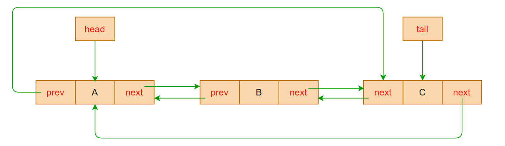

# 双向循环链表

## 认识双向循环链表

- **双向循环链表**（Doubly Circular LinkedList）是一种特殊的链表数据结构，同时满足 **双向链表** 和 **循环链表** 的特征

  - 它的每个数据结点中都有两个指针，分别指向==直接后继==和==直接前驱==节点
  - ==最后一个结点指向头结点==，形成一个环

  

- 使用双向循环链表，可以非常方便实现各种数据操作


## 封装双向循环链表

| 方法                    | 描述                             |
| ----------------------- | -------------------------------- |
| append(value)           | 向链表尾部添加一个节点           |
| prepend(value)          | 向链表头部添加一个节点           |
| insert(position, value) | 向链表指定位置插入一个节点       |
| get(position)           | 查看指定位置的节点               |
| update(position, value) | 修改指定位置节点值               |
| removeAt(position)      | 删除指定位置的节点               |
| traverse()              | 从头部向后遍历链表，返回遍历结果 |
| postTraverse()          | 从尾部向前遍历链表，返回遍历结果 |
| isEmpty                 | 链表是否为空                     |
| size                    | 链表内元素个数                   |

```typescript
/**
 * @description 链表节点类
 */
class LinkedNode<T> {
  /**
   * @description 节点的值
   */
  value: T;
  /**
   * @description 上一个节点的指针，初始为 null
   */
  prev: LinkedNode<T> | null = null;
  /**
   * @description 下一个节点的指针，初始为 null
   */
  next: LinkedNode<T> | null = null;

  constructor(value: T) {
    this.value = value;
  }
}

/**
 * @description 双向循环链表
 */
class DoublyCircularLinkedList<T> {
  /**
   * @description 链表长度
   */
  private length = 0;
  /**
   * @description 头指针
   */
  private head: LinkedNode<T> | null = null;
  /**
   * @description 尾指针
   */
  private tail: LinkedNode<T> | null = null;

  /**
   * @description 根据位置查找节点
   * @param position 位置
   */
  private findNodeByPosition(position: number): LinkedNode<T> | null {
    // 从头节点开始遍历
    let current = this.head;
    // 记录当前搜索索引位置
    let index = 0;

    while (current && ++index <= position) {
      current = current.next;
    }

    return current;
  }

  /**
   * @description 是否为头部节点
   */
  private isHeadNode(node: LinkedNode<T> | null) {
    return this.head === node;
  }

  /**
   * @description 是否为尾部节点
   */
  private isTailNode(node: LinkedNode<T> | null) {
    return this.tail === node;
  }

  /**
   * @description 从头部向后遍历链表
   * @returns 遍历结果数组
   */
  traverse(): T[] {
    // 声明一个数组，用于存放遍历结果
    const result: T[] = [];
    // 从头节点开始遍历
    let current = this.head;

    while (current) {
      result.push(current.value);

      // 如果已经遍历完最后一个节点，则终止遍历
      if (this.isTailNode(current)) break;

      current = current.next;
    }

    return result;
  }

  /**
   * @description 从尾部向前遍历链表
   * @returns 遍历结果数组
   */
  postTraverse() {
    // 声明一个数组，用于存放遍历结果
    const result: T[] = [];
    // 从头节点开始遍历
    let current = this.tail;

    while (current) {
      result.push(current.value);

      // 如果已经遍历完第一个节点，则终止遍历
      if (this.isHeadNode(current)) break;

      current = current.prev;
    }

    return result;
  }

  /**
   * 向链表头部添加节点
   * @param value 节点值
   */
  prepend(value: T) {
    // 转化为在头部插入
    this.insert(0, value);
  }

  /**
   * @description 向链表尾部添加节点
   * @param element 节点值
   */
  append(value: T) {
    // 转化为在最后一个节点后面插入
    this.insert(this.length, value);
  }

  /**
   * 向指定位置插入一个节点
   * @param position 指定位置
   * @param value 插入节点值
   * @returns 是否插入成功
   */
  insert(position: number, value: T): boolean {
    // 位置越界，插入失败
    if (position < 0 || position > this.length) return false;

    // 创建新节点
    const insertNode = new LinkedNode<T>(value);

    if (this.length === 0) {
      /**
       * 情况一：链表为空，直接让头尾指针都指向【新增的节点】
       */
      this.head = insertNode;
      this.tail = insertNode;
    } else {
      if (position === 0) {
        /**
         * 情况二：在头部插入节点
         */
        // 1.【插入节点】的 next 指向【头部节点】
        insertNode.next = this.head;
        // 2.【头部节点】的 prev 指向【插入节点】
        this.head!.prev = insertNode;
        // 3. 让头指针指向这个【插入节点】，使其称为新的【头部节点】
        this.head = insertNode;
      } else if (position === this.length) {
        /**
         * 情况三：在尾部插入节点
         */
        // 1.根据尾指针找到【尾部节点】，让其 next 指向【插入节点】
        this.tail!.next = insertNode;
        // 2.【插入节点】的 prev 指向【尾部节点】
        insertNode.prev = this.tail;
        // 3.尾指针重新指向这个【插入节点】
        this.tail = insertNode;
      } else {
        /**
         * 情况四：在中间位置插入
         */
        // 查询插入位置的节点
        const target = this.findNodeByPosition(position)!;
        // 获取插入位置的前一个节点
        const prev = target.prev!;

        // 1.让插入位置【前一个节点】和【当前插入的节点】互为相邻节点
        prev!.next = insertNode;
        insertNode.prev = prev;

        // 2.让【插入节点】和【当前插入位置节点】互为相邻节点
        insertNode.next = target;
        target.prev = insertNode;
      }
    }

    // 让尾指针的 next 重新指向【头节点】
    this.tail!.next = this.head;
    // 让头指针的 prev 重新指向【尾节点】
    this.head!.prev = this.tail;

    // 插入完成，更新链表长度
    this.length++;

    return true;
  }

  /**
   * @description 查询指定位置的节点值，查找不到返回 null
   * @param position 指定位置
   */
  get(position: number): T | null {
    // 位置越界，返回空值
    if (position < 0 || position >= this.length) return null;

    return this.findNodeByPosition(position)?.value ?? null;
  }

  /**
   * @description 修改指定位置的节点值
   * @param position 指定位置
   * @param value 节点新值
   * @returns 是否修改成功
   */
  update(position: number, value: T): boolean {
    // 位置越界，修改失败
    if (position < 0 || position >= this.length) return false;

    // 查找指定位置的节点
    const target = this.findNodeByPosition(position);

    // 不存在该节点，修改失败
    if (!target) return false;

    // 更新节点值
    target.value = value;

    return true;
  }

  /**
   * @description 删除指定位置的节点
   * @param position 指定位置
   * @returns 删除的节点值，删除失败则返回 null
   */
  removeAt(position: number): T | null {
    // 位置越界，删除失败
    if (position < 0 || position >= this.length) return null;

    // 记录删除的节点，初始值为头节点
    let deletedNode: LinkedNode<T> | null = this.head;

    if (this.length === 1) {
      /**
       * 情况一：链表中只有一个节点，直接让头尾指针都指向 null 即可
       */
      this.head = null;
      this.tail = null;
    } else {
      if (position === 0) {
        /**
         * 情况二：在头部删除节点
         */
        // 头指针指向【头节点的下一个节点】
        this.head = this.head!.next;
      } else if (position === this.length - 1) {
        /**
         * 情况三：在尾部删除节点
         */
        // 存储删除节点
        deletedNode = this.tail;
        // 1.获取尾节点的前一个节点
        const prev = this.tail!.prev!;
        // 2.尾指针指向【前一个节点】
        this.tail = prev;
      } else {
        /**
         * 情况四：在中间位置删除节点
         */
        // 1.查询删除位置的节点
        const target = this.findNodeByPosition(position)!;
        // 2.获取【删除位置的前一个节点】
        const prev = target.prev!;
        // 3.【删除节点前一个节点】的 next 指向【删除节点的下一个节点】
        prev.next = target.next;
        // 4.【删除节点的下一个节点】的 prev 指向【删除节点前一个节点】
        target.next!.prev = prev;
        // 记录删除节点
        deletedNode = target;
      }

      // 让尾指针的 next 重新指向【头节点】
      this.tail!.next = this.head;
      // 让头指针的 prev 重新指向【尾节点】
      this.head!.prev = this.tail;
    }

    // 删除完成，更新长度
    this.length--;

    // 返回删除的节点值
    return deletedNode?.value ?? null;
  }

  /**
   * @description 获取链表元素个数
   */
  get size(): number {
    return this.length;
  }

  /**
   * @description 链表是否为空
   */
  get isEmpty(): boolean {
    return this.length === 0;
  }
}
```

