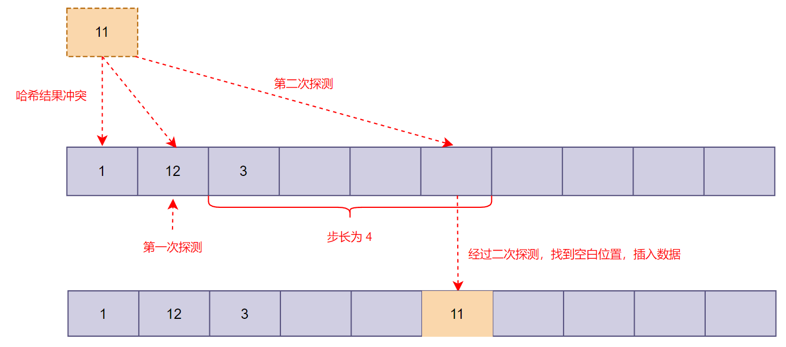

# 哈希表

## 认识哈希表

- 散列表（Hash table，也叫哈希表），是根据键（Key）而==直接访问==在存储器存储位置的数据结构
  - 它通过计算出一个键值的函数，将所需查询的数据==映射==到表中一个位置来进行访问
  - 这个函数被称作==哈希函数==（散列函数）

- 哈希表通常是==基于数组==进行实现的，但相比数组有许多不同
  - 提供非常快速的==插入==、==删除==、==查找==操作，时间复杂度可以达到 `O(1)`
  - 默认情况下，哈希表中的数据是==没有顺序==的，且哈希表中的==键不能重复==


## 哈希函数

### 认识哈希函数

- 哈希函数：一个将哈希表的==键==映射到某个位置的函数

  - 若关键字为 `k`，则其值存放在 `f(k)` 的存储位置上
  - 对不同的关键字可能得到同一散列地址，即 `k1 ≠ k2` ，而 `f(k1) = f(k2)`，这种现象称为==冲突==

- 通过哈希函数计算出来一个 **HashCode**，我们将其作为==数组的索引==，可以达到更快的访问速度

  


### 构造哈希函数

- 哈希函数设计的基本要求
  - 哈希函数计算得到的散列值是一个非负整数
  - 如果 `key1 = key2`，那 `f(key1) = f(key2)`
  - 如果 `key1 ≠ key2`，那 `f(key1) ≠ f(key2)`

- 为了实现将 **键转化为数组下标**，可以采用==幂的连乘==结合==除留余数法==来完成转化

#### 幂的连乘

- 如果直接采用 `f(k) = k` 的算法，即取 **k** 的每个字符的 ==UTF-16 码元值==进行 **累加**，产生冲突的概率极高

  

- 采用==幂的连乘==，可以有效的减少冲突概率

  - 算法：**字符编码 * r^n**，其中 n 为 当前字符的位数 

  


#### 除留余数法

- 采用幂的连乘虽然可以有效地减小冲突概率，但是计算出来的结果非常大
  - 如果使用这个结果作为 **数组下标**，那么需要申请一块==非常大的内存空间==
  - 同时这个数组的利用率非常低，无法做到==均匀分布==

- 除留余数法：取关键字被某个不大于散列表表长 m 的数 p 除后所得的余数为散列地址

  - 即 `f(k) = k mod p`（p \<= m）
  - 对 p 的选择很重要，一般取 m（选择==素数==），若 p 选择地不好，容易产生冲突

  


## 处理冲突

- 虽然可以通过较好的哈希函数尽可能减少冲突，但是==冲突仍然不可避免==
- 处理冲突有两种常见的方案：**链地址法**、**开放地址法**

### 链地址法

- 链地址法是一种常见的解决冲突的方案

  - 其核心逻辑在于每个数组单元中存储的不再是单个数据，而是一个链条

  - 这个链条通常使用==数组或链表==实现


- **链地址法适用于存储大对象、大数据量的哈希表**，**比起开放寻址法，它更加灵活**


### 开放地址法

- 开放地址法的主要工作方式是==寻找空白的空间==来添加重复的数据

  - 某个数据经过哈希函数哈希化之后，存储位置已经被占用了

  - 我们就从当前位置开始，依次往后查找，看是否有空闲位置，直到找到为止

  - 主要方式有 **线性探测**、**平方探测**、**再哈希**

- **开放寻址法适用于数据量比较小、装载因子小的场景**

#### 线性探测


- **线性探测**：线性的查找空白的单元
  - 当哈希化得到的位置为占用后，可以依次向后查找，直到找到空白位置
  - 线性探测每次查找的 ==步长 为 1==
  - 比如从下标值 x 开始探测，那么线性测试就是 x+1 -> x+2 -> x+3 依次探测

- 线性探测再遇到==聚集==时，搜索性能会变低，从而影响整个哈希表的操作效率
  - 在哈希表中，哈希函数的结果==不均匀==地占据表的单元，形成区块
  - 散列到区块中的任何关键字需要查找==多次试选==单元才能插入表中，造成时间浪费


#### 平方探测

- 线性探测在遇到 **聚集** 后，需要消耗较长的时长，通过修改==探测步长==可以优化探测速度

- **平方探测** 通过动态更新步长，以减少因聚集而导致耗时的探测操作

  - 比如从下标值 x 开始探测，那么平方探测就是 x+1² -> x+2² -> x+3² 依次探测

  

- 平方探测虽然可能减少探测次数，但出现相同平方步长的数据，仍然会产生步长不一的一种聚集


#### 再哈希法

- 为了消除线性探测和平方探测中步长一致导致的探测聚集，还有一种常见的解决办法：再哈希
- **再哈希**：把关键字用另外一个哈希函数，==再做一次哈希化==，用这次哈希化的结果作为 **步长**
  - 这个哈希函数与第一个哈希函数不能相同
  - 不能输出为 0，否则进入==探测死循环==

- 计算机专家已经设计出一种工作很好的哈希函数

  ```
  stepSize = constant - (key % constant)
  ```

  其中 constant 是素数，且小于数组的容量


## 哈希化效率

### 装填因子

- **装填因子** 表示当前哈希表中已经包含的数据项和整个哈希表长度的比值
  - ==装填因子 = 总数据项 / 哈希表长度==

- 开放地址法的装填因子最大为 1，链地址法的装填因子可以大于 1（链条可以无限延伸下去）


### 开放地址法效率

- 哈希表如果没有产生冲突，那么效率就会更高
  - 如果发生冲突，存取时间就依赖后来的==探测长度==

- 性能比较：平方探测和再哈希法的性能相当，优于线性探测


### 链地址法效率

- 对于链地址法，平均每个链条的数据项等于==哈希表总数据项 / 数组长度==（等于装填因子）
  - 当装填因子越大，每次查找元素时所要花费的时间越长
  - 因此装填因子达到==一定大==时，需要进行==扩容==；达到==一定小==时，需要进行==缩容==（实现均匀分布）

- 除了要控制装填因子外，还需要控制数据量在每个链条中==均匀分布==（选择 **素数** 进行运算）


## 封装哈希表

### 实现哈希函数

- 一个好的哈希函数应该具备==快速计算==、==均匀分布==的特点

- 快速计算的优化算法：==霍纳法则==（秦九韶算法）

  - 默认情况下使用幂的连乘的计算多项式，需要进行 `n(n + 1) / 2` 次 **乘法** 和 `n` 次 **加法**，时间复杂度 `O(n²)`

    

  - 通过使用霍纳法则（提取公因子），可以优化为 `n` 次 **乘法** 和 `n` 次 **加法**，时间复杂度 `O(n)`

    

- 均匀分布：幂的连乘的==底数==和除留余数法中的==取余数==（即哈希表的长度），都要选择==素数==

```typescript
/**
 * @description 哈希函数
 * @param key 键名
 * @param len 哈希表长度
 */
function hash(key: string, len: number): number {
  let hashCode = 0;

  for (const char of key) {
    /**
     * 这里幂的底数选择素数 37
     * charCodeAt - 获取字符的 UTF-16 码元值
     */
    hashCode = hashCode * 37 + char.charCodeAt(0);
  }

  // 除留取余
  return hashCode % len;
}
```


### 实现哈希表

| 方法            | 描述                   |
| --------------- | ---------------------- |
| put(key, value) | 插入/修改键值对        |
| get(key)        | 根据键获取值           |
| remove(key)     | 删除键值对             |
| size            | 获取哈希表中键值对个数 |

#### 初始化哈希表结构

采用 **链地址法** 来解决冲突，每个链条使用 **数组** 进行实现

```typescript
/**
 * @description 哈希表
 */
class HashTable<T> {
  /**
   * @description 初始化一个数组，用于存放每个键值对数组集合
   */
  private store: [string, T][][] = [];
  /**
   * @description 哈希表长度，默认为素数 7
   */
  private length = 7;
  /**
   * @description 记录哈希表中存放的键值对个数
   */
  private _size_ = 0;

  /**
   * @description 获取键值对个数
   */
  get size() {
    return this._size_;
  }

  /**
   * @description 设置键值对个数
   */
  private set size(newSize: number) {
    this._size_ = newSize;
  }

  /**
   * 将键名哈希化为数组索引
   * @param key 键名
   * @returns 数组索引
   */
  private hash(key: string): number {
    let hashCode = 0;

    for (const char of key) {
      hashCode = hashCode * 37 + char.charCodeAt(0);
    }

    return hashCode % this.length;
  }
}
```


#### 插入方法 — put

- 首先将数据的==键==通过哈希函数得到一个==数组下标==
- 然后根据下标查找对应位置的数据
  - 如果为空，创建一个 **entries** 数组放入这个空间
  - 如果不为空，先搜索键名是否已存在
    - 存在则==替换==键值对的值
    - 不存在则==新增键值对== **entries**

```typescript
/**
 * @description 哈希表
 */
class HashTable<T> {
  /**
   * @description 设置键值对
   * @param key 键名
   * @param value 属性值
   */
  put(key: string, value: T) {
    // 获取哈希化得到的数组下标
    const index = this.hash(key);
    // 获取键值对存储数组
    let bucket = this.store[index];

    if (!bucket) {
      /**
       * 映射到的空间无内容，创建一个 entries 数组放入这个空间
       * 并将传递的键值对追加进数组
       */
      this.store[index] = [[key, value]];
    } else {
      /**
       * 映射到的空间不为空
       * 先查询键名是否已存在，存在则替换值，否则新增键值对
       */
      for (const entries of bucket) {
        if (entries[0] === key) {
          // 更新值
          entries[1] = value;
          return;
        }
      }

      // 键名不存在，新增键值对
      bucket.push([key, value]);
    }

    // 插入完成，更新键值对个数
    this.size++;
  }
}
```


#### 查询方法 — get

`get` 方法用于查询给定 **键** 对应的值，不存在键则返回 `null`

```typescript
/**
 * @description 哈希表
 */
class HashTable<T> {
  /**
   * @description 根据键查询属性值
   * @param key 键名
   * @returns 属性值，没有查询到返回 null
   */
  get(key: string): T | null {
    // 获取哈希化得到的数组下标
    const index = this.hash(key);
    // 获取键值对存储数组
    const bucket = this.store[index];

    if (!bucket) return null;

    // 遍历 entries 数组，根据键查找值
    for (const [k, value] of bucket) {
      if (key === k) return value;
    }

    // 没有查找到
    return null;
  }
}
```


#### 删除方法 — remove

`remove` 方法用于删除指定键的键值对，返回被删除的值，不存在键则返回 `null`

```typescript
/**
 * @description 哈希表
 */
class HashTable<T> {
  /**
   * @description 根据键删除键值对
   * @param key 键名
   * @returns 被删除的属性值，没有查询到返回 null
   */
  remove(key: string): T | null {
    // 获取哈希化得到的数组下标
    const index = this.hash(key);
    // 获取键值对存储数组
    const bucket = this.store[index];

    if (!bucket) return null;

    // 遍历 entries 数组，根据键查找到后删除
    for (let i = 0, len = bucket.length; i < len; i++) {
      if (key === bucket[i][0]) {
        // 删除此键值对
        const [deleteEntries] = bucket.splice(i, 1);
        // 删除完成，更新键值对个数
        this.size--;
        // 返回键值
        return deleteEntries[1];
      }
    }

    // 没有查找到，返回 null
    return null;
  }
}
```


#### 哈希表扩容 / 缩容

- **装填因子** 是衡量一个哈希表效率的重要因素
  - 因此需要在合适的节点进哈希表进行合适的扩容或缩容，以维持哈希表实现快速访问
  - 同时在扩容/缩容时，需要保证容量选择==素数==，这样能使哈希表==均匀分布==

- 当装填因子==大于 0.75==时进行==扩容==，==小于 0.25== 时进行==缩容==处理
  - 每次扩容/缩容时，将容量先扩大/缩小为原来的 ==2 倍 / 一半==
  - 若调整后的容量不是一个素数，则==就近==查找最近的素数
- 同时调整容量后，需要将原来哈希表中的所有数据进行==重新散列==

```typescript
/**
 * @description 哈希表
 */
class HashTable<T> {
  /**
   * @description 是否是素数
   */
  private isPrime(num: number): boolean {
    // 因数是成对出现的，一个小于等于算数平方根，另外一个大于等于算数平方根
    const sqrt = Math.floor(Math.sqrt(num));

    for (let i = 2; i <= sqrt; i++) {
      if (num % i === 0) return false;
    }

    return true;
  }

  /**
   * @description 查找最近的素数（向上查找）
   */
  private findNearestPrime(num: number) {
    // 自身就是素数，直接返回
    if (this.isPrime(num)) {
      return num;
    }

    // 递增查找最近的素数
    while (!this.isPrime(++num)) {}

    return num;
  }

  /**
   * @description 调整数组长度后，重新对所有数据进行哈希化
   */
  private reHashAllData() {
    const prevStore = this.store;

    // 清空哈希表，重新对所有数据哈希化
    this.store = new Array(this.length);

    for (const bucket of prevStore) {
      if (!bucket) continue;

      for (const [key, value] of bucket) {
        this.put(key, value);
      }
    }
  }

  /**
   * @description 监听设置键值对个数，调整数组长度以控制装填因子
   */
  private set size(newSize: number) {
    // 计算装填因子
    const loadFactor = newSize / this.length;

    if (loadFactor > 0.75) {
      // 扩容，先乘以 2，再查找最近的素数
      this.length = this.findNearestPrime(this.length * 2);
      this.reHashAllData();
    } else if (loadFactor < 0.25 && this.length > 7) {
      // 缩容，先除以 2，再查找最近的素数，同时控制最小长度为 7
      this.length = this.findNearestPrime(Math.floor(this.length / 2));
      this.reHashAllData();
    }

    this._size_ = newSize;
  }
}
```


#### 哈希表完整实现

```typescript
/**
 * @description 哈希表
 */
class HashTable<T> {
  /**
   * @description 初始化一个数组，用于存放每个键值对数组集合
   */
  private store: [string, T][][] = [];
  /**
   * @description 哈希表长度，默认为素数 7
   */
  private length = 7;
  /**
   * @description 记录哈希表中存放的键值对个数
   */
  private _size_ = 0;

  /**
   * @description 获取键值对个数
   */
  get size() {
    return this._size_;
  }

  /**
   * @description 是否是素数
   */
  private isPrime(num: number): boolean {
    // 因数是成对出现的，一个小于等于算数平方根，另外一个大于等于算数平方根
    const sqrt = Math.floor(Math.sqrt(num));

    for (let i = 2; i <= sqrt; i++) {
      if (num % i === 0) return false;
    }

    return true;
  }

  /**
   * @description 查找最近的素数（向上查找）
   */
  private findNearestPrime(num: number) {
    // 自身就是素数，直接返回
    if (this.isPrime(num)) {
      return num;
    }

    // 递增查找最近的素数
    while (!this.isPrime(++num)) {}

    return num;
  }

  /**
   * @description 调整数组长度后，重新对所有数据进行哈希化
   */
  private reHashAllData() {
    const prevStore = this.store;

    // 清空哈希表，重新对所有数据哈希化
    this.store = new Array(this.length);

    for (const bucket of prevStore) {
      if (!bucket) continue;

      for (const [key, value] of bucket) {
        this.put(key, value);
      }
    }
  }

  /**
   * @description 监听设置键值对个数，调整数组长度以控制装填因子
   */
  private set size(newSize: number) {
    // 计算装填因子
    const loadFactor = newSize / this.length;

    if (loadFactor > 0.75) {
      // 扩容，先乘以 2，再查找最近的素数
      this.length = this.findNearestPrime(this.length * 2);
      this.reHashAllData();
    } else if (loadFactor < 0.25 && this.length > 7) {
      // 缩容，先除以 2，再查找最近的素数，同时控制最小长度为 7
      this.length = this.findNearestPrime(Math.floor(this.length / 2));
      this.reHashAllData();
    }

    this._size_ = newSize;
  }

  /**
   * 将键名哈希化为数组索引
   * @param key 键名
   * @returns 数组索引
   */
  private hash(key: string): number {
    let hashCode = 0;

    for (const char of key) {
      hashCode = hashCode * 37 + char.charCodeAt(0);
    }

    return hashCode % this.length;
  }

  /**
   * @description 设置键值对
   * @param key 键名
   * @param value 属性值
   */
  put(key: string, value: T) {
    // 获取哈希化得到的数组下标
    const index = this.hash(key);
    // 获取键值对存储数组
    let bucket = this.store[index];

    if (!bucket) {
      /**
       * 映射到的空间无内容，创建一个 entries 数组放入这个空间
       * 并将传递的键值对追加进数组
       */
      this.store[index] = [[key, value]];
    } else {
      /**
       * 映射到的空间不为空
       * 先查询键名是否已存在，存在则替换值，否则新增键值对
       */
      for (const entries of bucket) {
        if (entries[0] === key) {
          // 更新值
          entries[1] = value;
          return;
        }
      }

      // 键名不存在，新增键值对
      bucket.push([key, value]);
    }

    // 插入完成，更新键值对个数
    this.size++;
  }

  /**
   * @description 根据键查询属性值
   * @param key 键名
   * @returns 属性值，没有查询到返回 null
   */
  get(key: string): T | null {
    // 获取哈希化得到的数组下标
    const index = this.hash(key);
    // 获取键值对存储数组
    const bucket = this.store[index];

    if (!bucket) return null;

    // 遍历 entries 数组，根据键查找值
    for (const [k, value] of bucket) {
      if (key === k) return value;
    }

    // 没有查找到，返回 null
    return null;
  }

  /**
   * @description 根据键删除键值对
   * @param key 键名
   * @returns 被删除的属性值，没有查询到返回 null
   */
  remove(key: string): T | null {
    // 获取哈希化得到的数组下标
    const index = this.hash(key);
    // 获取键值对存储数组
    const bucket = this.store[index];

    if (!bucket) return null;

    // 遍历 entries 数组，根据键查找到后删除
    for (let i = 0, len = bucket.length; i < len; i++) {
      if (key === bucket[i][0]) {
        // 删除此键值对
        const [deleteEntries] = bucket.splice(i, 1);
        // 删除完成，更新键值对个数
        this.size--;
        // 返回键值
        return deleteEntries[1];
      }
    }

    // 没有查找到，返回 null
    return null;
  }
}
```
