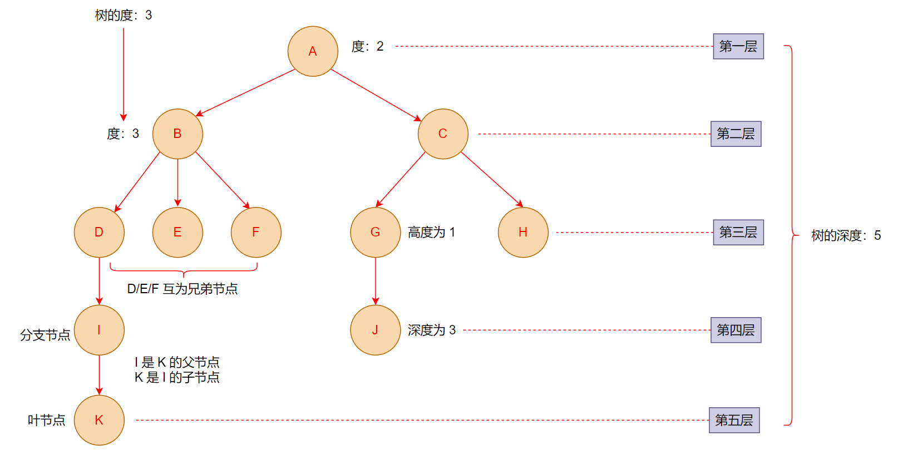

# 树

## 认识树结构

- 在计算机科学中，**树** 是一种抽象数据类型或是实现这种抽象数据类型的数据结构
  - 它是由 n（n > 0）个==有限节点==组成一个具有==层次关系==的集合
  - 用来模拟具有树状结构性质的数据集合
  
  

- 树结构的特点

  - 每个节点都只有==有限个==子节点或无子节点
  - 没有父节点的节点称为==根节点==
  - 每一个非根节点有且只有一个父节点
  - 除了根节点外，每个子节点可以分为多个==不相交==的子树
  - 树里面没有环路

- 树和其他数据结构的区别
  - 数组：==访问速度快==，插入和删除时速度普遍较慢
  - 链表：==查找速度慢==，插入和删除操作也会收到查找速度的影响
  - 哈希表：插入/查询/删除效率都非常高，但==空间利用率不高==、==键无法重复==、同时表中元素是==无序==的
  - 树结构综合了其他数据结构的优点，也在一定程度上弥补了他们的缺点

- 树在实际生活中和计算机科学中都有广泛的应用，比如公司组织架构、前端 DOM 树等

## 树的术语

- **节点的度**：一个节点含有的==子树的个数==

- **树的度**：一棵树中，最大的节点度

- **叶节点**：==度为零==的节点

- **分支节点**：度不为零的节点

- **父节点**：若一个节点含有子节点，则这个节点称为其子节点的父节点

- **子节点**：一个节点含有的==子树的根节==点称为该节点的子节点

- **兄弟节点**：具有相同父节点的节点互称为兄弟节点
- **节点的层次**：从根开始定义起，根为第 1 层，根的子节点为第 2 层，以此类推
- **深度**：对于任意节点 n，其深度为从根到 n 的==唯一路径长==，==根的深度为 0==
- **高度**：对于任意节点 n，其高度为从 n 到一片树叶的==最长路径长==，所有树叶的高度为 0
- **树的深度**：树中所有==节点中的最大层次==是这棵树的深度

## 树的种类

- **无序树**：树中任意节点的子节点之间没有顺序关系，这种树称为无序树，也称为自由树

- **有序树**：树中任意节点的子节点之间有顺序关系，这种树称为有序树
- **等叉树**：是每个节点的键值个数都相同、子节点个数也都相同
  - 二叉树：每个节点==最多含有两个子树==的树
    - 完全二叉树
    - 满二叉树：所有叶节点都在最底层的完全二叉树
    - 平衡二叉树（AVL 树）：当且仅当任何节点的两棵子树的==高度差不大于 1== 的二叉树
    - 二叉查找树
  - 霍夫曼树：带权路径最短的二叉树称为哈夫曼树或最优二叉树
  - 多叉树
- **不等叉树**：每个节点的键值个数不一定相同、子节点个数也不一定相同
  - B 树：一种对读写操作进行优化的自平衡的二叉查找树，能够保持数据有序，拥有多于两个子树
