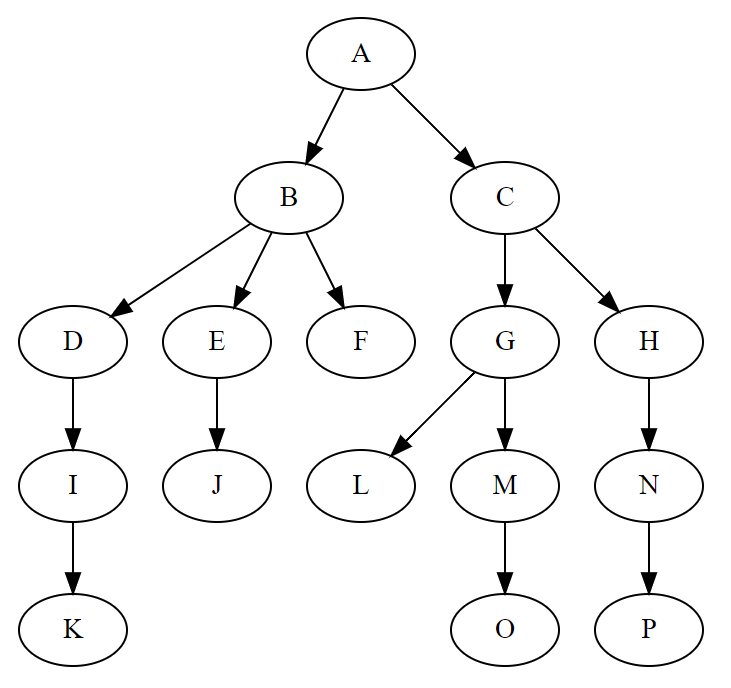

# 树

## 认识树结构

- 在计算机科学中，**树** 是一种抽象数据类型或是实现这种抽象数据类型的数据结构
  - 它是由 n（n > 0）个==有限节点==组成一个具有==层次关系==的集合
  - 用来模拟具有树状结构性质的数据集合
  
  

- 树在实际生活中和计算机科学中都有广泛的应用，比如公司组织架构、前端 DOM 树等
- 树和其他数据结构的区别
  - 数组：==访问速度快==，插入和删除时速度普遍较慢
  - 链表：==查找速度慢==，插入和删除操作也会收到查找速度的影响
  - 哈希表：插入/查询/删除效率都非常高，但==空间利用率不高==、==键无法重复==、同时表中元素是==无序==的

- 树结构综合了上面的数据结构的优点，也在一定程度上弥补了他们的缺点
