# 二叉树

## 认识二叉树

### 二叉树的由来

- 树的普通表示方式

  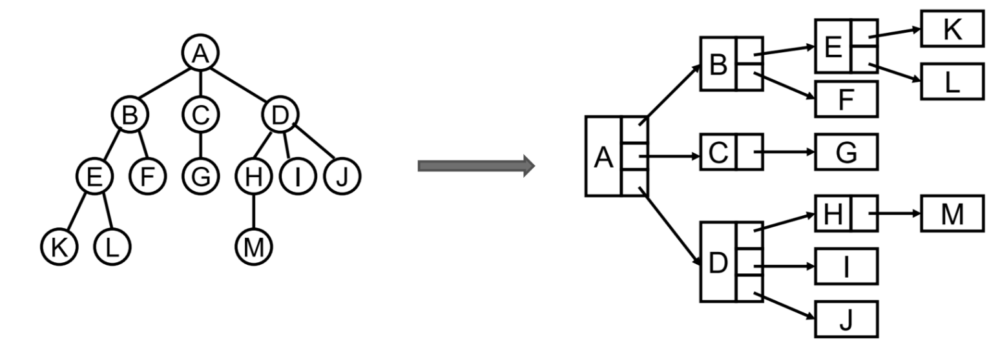

- 树的==儿子 — 兄弟==表示法（每个节点只记录一个子节点和一个兄弟节点）

  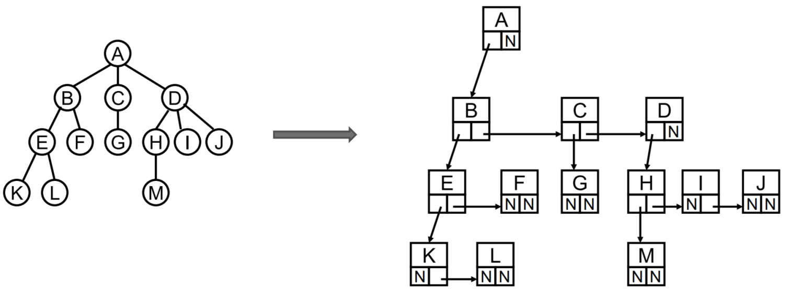

- 将儿子 — 兄弟表示法旋转，可以得到一个以 A 为 **根** 的二叉树

  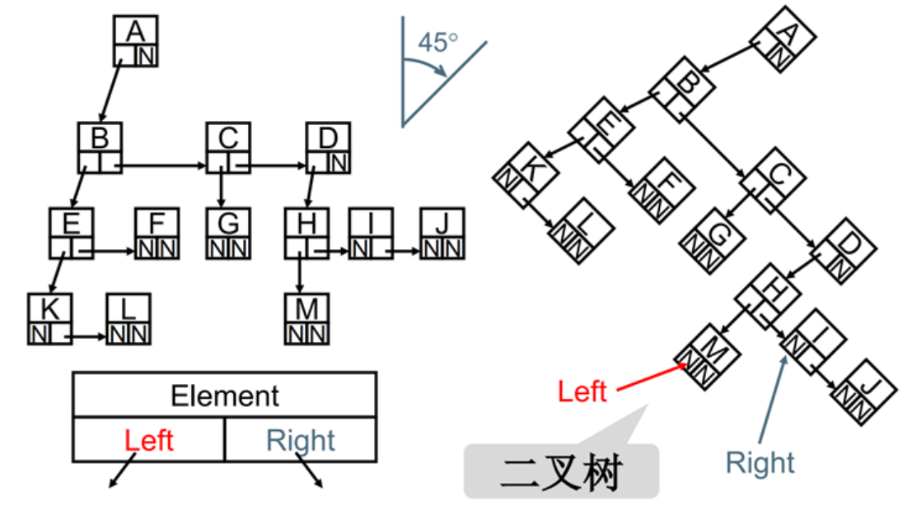

- 通过 **儿子 — 兄弟** 表示法，可以得出一个重要结论：==所有的树结构都可以用 **二叉树** 模拟出来==


### 定义及特性

- 在计算机科学中，二叉树（Binary tree）是每个节点==最多只有两个分支==的树结构

  - 通常分支被称作“左子树”或“右子树”，分支具有左右次序，不能随意颠倒
  - 二叉树可以为空

- 二叉树有五种形态

  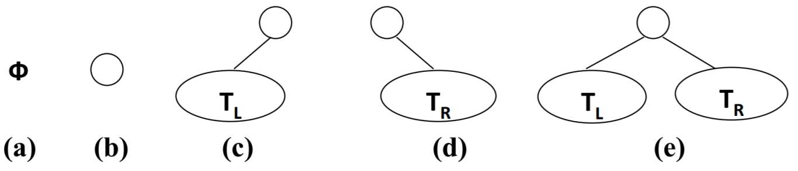

  - 空树
  - 只有一个根节点
  - 只有根节点和左子树
  - 只有根节点和右子树
  - 根节点和左右子树均存在

- 二叉树的特性
  - 一个二叉树第 i 层的最大节点数为：`2^(i-1)`（i >= 1）
  - 深度为 k 的二叉树的最大节点总数为： `2^k - 1`（k >= 1）
  - 对任何非空二叉树 T，若 **n0** 表示叶节点的个数、**n2** 是度为 2 的非叶节点个数，那么两者满足关系 `n0 = n2 + 1`


## 特殊的二叉树

### 完美二叉树

- 定义：在二叉树中，除了最下一层的叶节点外，每层节点都有 2 个子节点，就构成了完美二叉树（满二叉树）

  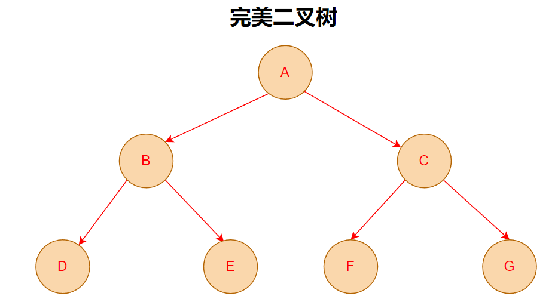

- 性质：对于一棵深度为 **k** 的完美二叉树

  - 共有 **2^k - 1** 个节点
  - 节点个数一定为==奇数==


### 完全二叉树

- 完全二叉树定义

  - 除二叉树最后一层外，其他各层的节点数都达到最大个数
  - 且最后一层==从左向右的叶节点连续存在==，只缺右侧若干节点

  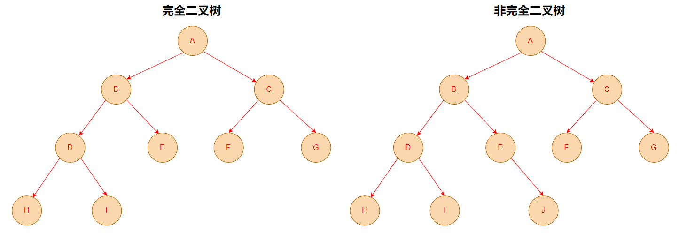

- 完全二叉树的性质

  - 深度为 **k** 的完全二叉树，至少有 **2^(k-1)** 个节点，至多有 **2^k - 1** 个节点
  - ==完美二叉树是特殊的完全二叉树==，反之完全二叉树不一定是完美二叉树


## 二叉树的存储

二叉树的存储常见的方式是 **数组** 或 **链表**

### 数组存储

- 使用数组可以作为二叉树的一种存储方式，即通过==广度优先==顺序存储每一个节点

  - 对于完全二叉树，采用按从上至下、从左到右顺序存储

    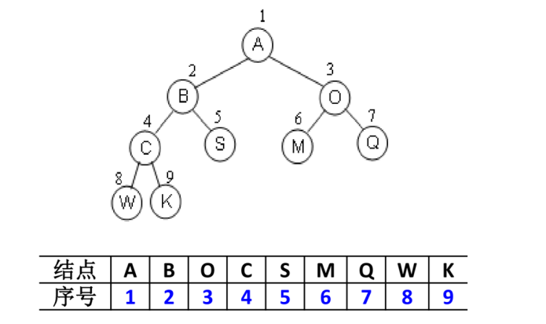

  - 对于非完全二叉树，需要先将其转化成一个完全二叉树，不存在的节点以空值代替，再进行顺序存储

    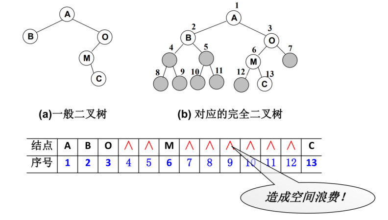

- 根据上述分析可知
  - 如果是完全二叉树，使用数组存储无疑是最节省内存的一种方式
  - 如果是非完全二叉树，其实会浪费比较多的数组存储空间


### 链表存储

- 为了减少存储空间的浪费，提高存储的灵活性，存储二叉树通常使用 **链表**

- 每个链表节点包含三个字段

  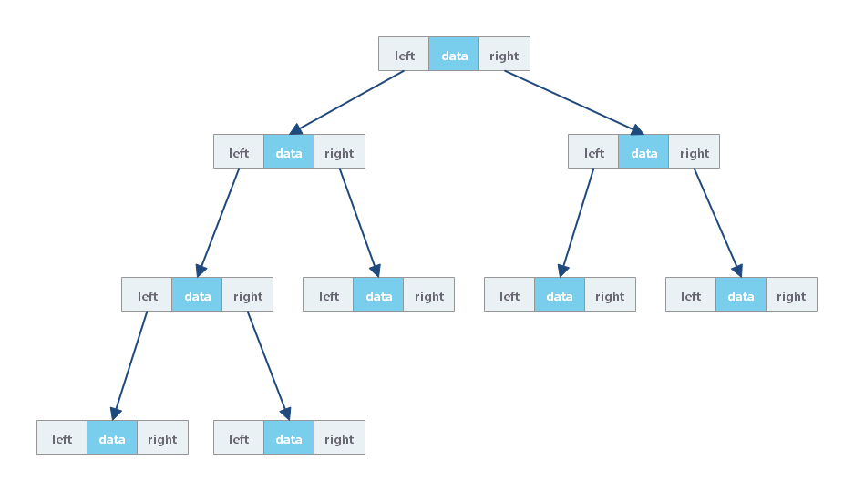

  - 其中 `data` 存储节点数据
  - 另外两个 — `left` 和 `right`，分别存储左右子树的==指针==


## 二叉树的遍历

### 先序遍历

**先序** 遍历规定==先访问根节点==，再访问其左子树，最后访问右子树

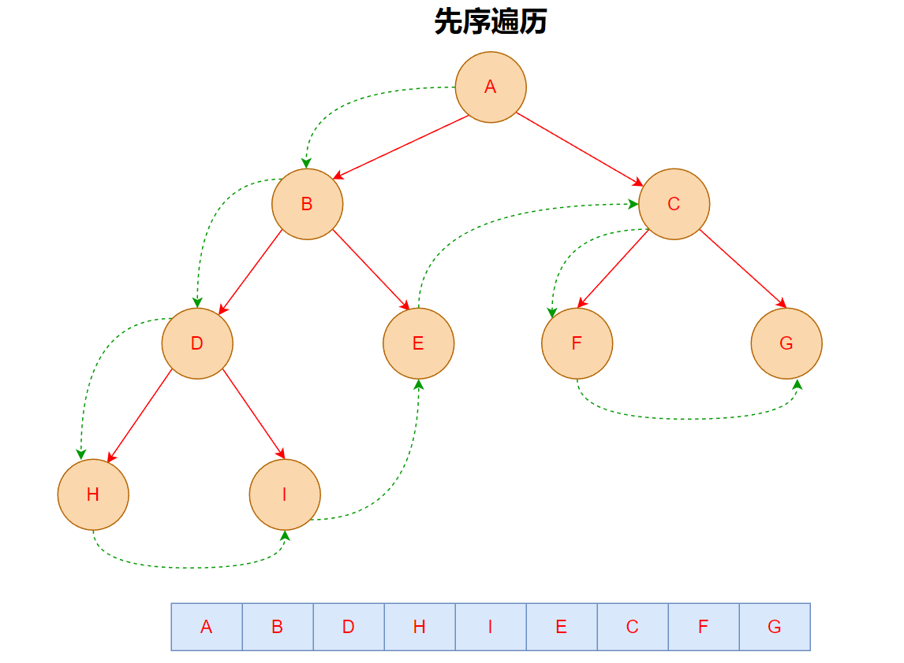


### 中序遍历

**中序** 遍历规定==先访问左子树==，再访问其根节点，最后访问右子树

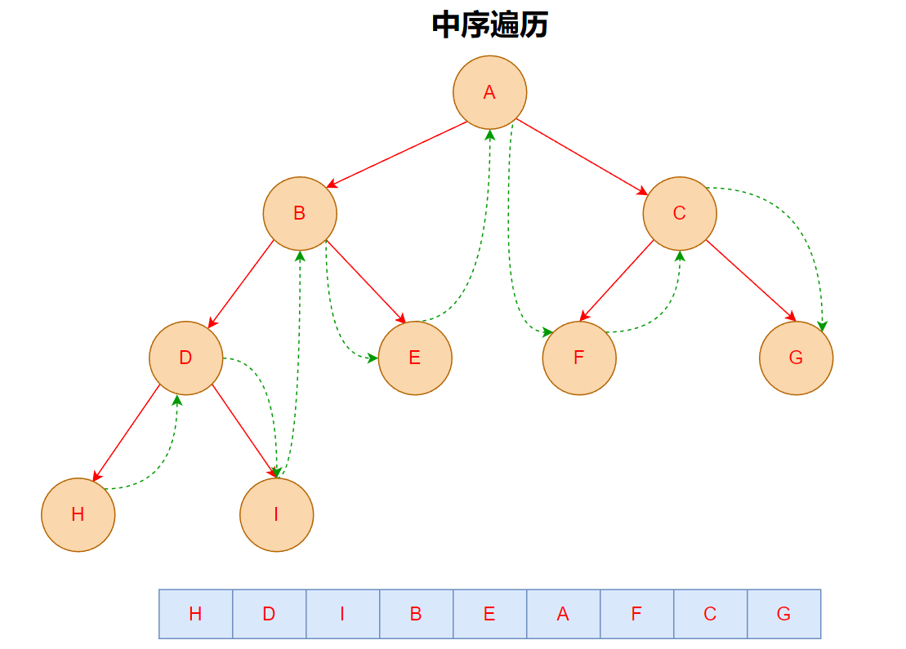


### 后序遍历

**后序** 遍历规定==先访问左子树==，再访问其右子树，最后访问根节点

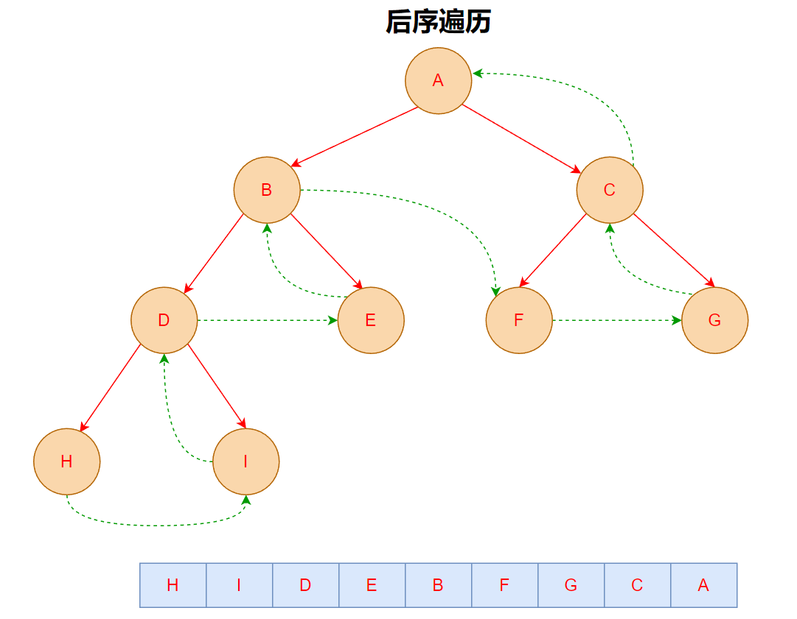


### 层序遍历

**层序** 遍历以==从上至下、从左至右==的方式进行访问

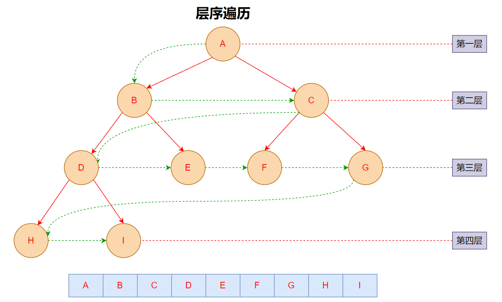


## 二叉搜索树

### 认识二叉搜索树

- **二叉搜索树**（Binary Search Tree），也称二叉排序树或二叉查找树

- 二叉搜索树是一颗二叉树，可以为空；如果不为空，满足以下性质

  - 非空==左子树==的所有键值==小于==其根节点的键值
  - 非空==右子树==的所有键值==大于==其根节点的键值
  - 左、右子树本身也属于二叉搜索树

  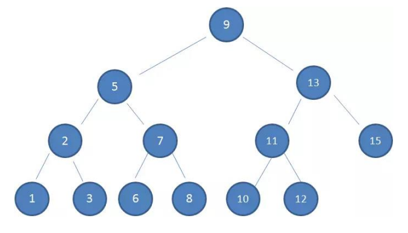

- 二叉查找树相比于其他数据结构的优势在于==查找==、==插入==的时间复杂度较低，为 `O(log n)`
  - 相对==较小==的值总是保存在==左节点==上
  - 相对==较大==的值总是保存在==右节点==上


### 封装二叉搜索树

| 方法                 | 描述                             |
| -------------------- | -------------------------------- |
| insert(value)        | 向树中插入数据                   |
| search(value)        | 在树中查找一个数据，返回是否存在 |
| min                  | 获取树中节点最小值               |
| max                  | 获取树中节点最大值               |
| preOrderTraverse()   | 获取前序遍历结果                 |
| inOrderTraverse()    | 获取中序遍历结果                 |
| postOrderTraverse()  | 获取后序遍历结果                 |
| levelOrderTraverse() | 获取层序遍历结果                 |
| remove(value)        | 从书中删除数据，返回是否成功删除 |

#### 初始化 BST 结构

- 准备一个 `TreeNode` 类，用于保存每个节点的信息

  ```typescript
  /**
   * @description 树节点
   */
  class TreeNode<T> {
    /**
     * @description 节点的值
     */
    value: T;
    /**
     * @description 左子树
     */
    left: TreeNode<T> | null = null;
    /**
     * @description 右子树
     */
    right: TreeNode<T> | null = null;
  
    constructor(value: T) {
      this.value = value;
    }
  }
  ```

- 定义二叉搜索树类，包含一个根节点 `root`

  ```typescript
  /**
   * @description 二叉搜索树
   */
  class BSTree<T> {
    /**
     * @description 根节点
     */
    root: TreeNode<T> | null = null;
  }
  ```


#### 插入方法 — insert

- `insert` 方法用于向二叉搜索树中插入数据
- 插入操作可分为两种情况
  - 若为 **空树**，则直接创建一个树节点，作为根节点
  - 若不为空树，则先比较根节点数据值和当前插入的数据值
    - 若小于根节点数据值，则沿着左子树查找空位然后插入数据
    - 若大于根节点数据值，则沿着右子树查找空位然后插入数据

```typescript
/**
 * @description 二叉搜索树
 */
class BSTree<T> {
  /**
   * @description 向树中插入数据
   * @param value 数据值
   */
  insert(value: T) {
    // 创建一个节点
    const insertNode = new TreeNode<T>(value);

    if (this.root === null) {
      // 如果当前树为空树，直接放在根节点
      this.root = insertNode;
      return;
    }

    let accessor = this.root;

    while (accessor !== null) {
      // 插入的值小于左子树节点值，沿着左子树查找
      if (value < accessor.value) {
        if (accessor.left !== null) {
          // 左子树不为空，继续递归左子树查找
          accessor = accessor.left;
        } else {
          // 左子树为空，插入节点，结束查找
          accessor.left = insertNode;
          break;
        }
      } else {
        // 插入的值大于右子树节点值，沿着右子树查找
        if (accessor.right !== null) {
          // 右子树不为空，继续递归右子树查找
          accessor = accessor.right;
        } else {
          // 右子树为空，插入节点，结束查找
          accessor.right = insertNode;
          break;
        }
      }
    }
  }
}
```


#### 搜索方法 — search

- `search` 方法用于在二叉搜索树中查找数据，返回是否查找到
- 查找规则：==二分查找==
  - 若为 **空树**，查找失败
  - 若不为空树，则先比较根节点数据值和当前插入的数据值
    - 若小于根节点数据值，则沿着左子树查找
    - 若大于根节点数据值，则沿着右子树查找

```typescript
/**
 * @description 二叉搜索树
 */
class BSTree<T> {
  /**
   * @description 在树中查找一个数据
   * @param value 要查找的数据值
   * @returns 返回是否查找到
   */
  search(value: T): boolean {
    // 如果当前树为空树，直接返回无法查找到
    if (this.root === null) {
      return false;
    }

    let accessor: TreeNode<T> | null = this.root;

    while (accessor !== null) {
      // 查找到节点值，返回 true
      if (value === accessor.value) {
        return true;
      }

      if (value < accessor.value) {
        // 给定值比当前节点值小，遍访左子树搜索
        accessor = accessor.left;
      } else {
        // 给定值比当前节点值大，遍访右子树搜索
        accessor = accessor.right;
      }
    }

    return false;
  }
}
```


#### 获取最值 — min/max

- `min`：获取二叉搜索树中==最小==的节点值

  - 若为 **空树**，直接终止查找
  - 若不为空树，从根节点出发，沿着左子树查找，当查找到==叶子节点==时，此节点值为最小值

  ```typescript
  /**
   * @description 二叉搜索树
   */
  class BSTree<T> {
    /**
     * @description 获取树中节点最小值
     */
    get min(): T | null {
      if (this.root === null) {
        // 如果为空树，直接返回
        return null;
      }
  
      /**
       * 由于二叉搜索树中，左子树节点值都小于根节点
       * 因此只需要沿着左子树查找，直到查找到叶子节点即可
       */
      let accessor = this.root;
  
      while (accessor.left !== null) {
        accessor = accessor.left;
      }
  
      return accessor.value;
    }
  }
  ```

- `max`：获取二叉搜索树中==最大==的节点值

  - 若为 **空树**，直接终止查找
  - 若不为空树，从根节点出发，沿着右子树查找，当查找到==叶子节点==时，此节点值为最大值

  ```typescript
  /**
   * @description 二叉搜索树
   */
  class BSTree<T> {
    /**
     * @description 获取树中节点最大值
     */
    get max(): T | null {
      if (this.root === null) {
        // 如果为空树，直接返回
        return null;
      }
  
      /**
       * 由于二叉搜索树中，右子树节点值都大于根节点
       * 因此只需要沿着右子树查找，直到查找到叶子节点即可
       */
      let accessor = this.root;
  
      while (accessor.right !== null) {
        accessor = accessor.right;
      }
  
      return accessor.value;
    }
  }
  ```


#### 遍历二叉搜索树

##### 先序遍历实现

**先序** 遍历以 ==根节点==➡️==左子树==➡️==右子树== 的顺序进行访问

- 递归实现版本

  ```typescript
  /**
   * @description 二叉搜索树
   */
  class BSTree<T> {
    /**
     * @description 前序遍历 - 递归
     */
    preOrderTraverse(node = this.root, traverseResult: T[] = []): T[] {
      // 如果为空树，直接终止
      if (node === null) {
        return traverseResult;
      }
  
      const { left, right, value } = node;
  
      // 存储根节点值
      traverseResult.push(value);
      // 递归访问左子树
      this.preOrderTraverse(left, traverseResult);
      // 递归访问右子树
      this.preOrderTraverse(right, traverseResult);
  
      return traverseResult;
    }
  }
  ```

- 非递归实现版本

  ```typescript
  /**
   * @description 二叉搜索树
   */
  class BSTree<T> {
    /**
     * @description 前序遍历 - 非递归
     */
    preOrderTraverse(): T[] {
      // 如果为空树，直接终止
      if (this.root === null) {
        return [];
      }
  
      // 声明一个数组，用于存放遍历结果
      const traverseResult: T[] = [];
      // 声明一个栈，用于临时存储遍历节点
      const stack: TreeNode<T>[] = [];
  
      let accessor: TreeNode<T> | null = this.root;
  
      while (accessor !== null || stack.length > 0) {
        if (accessor !== null) {
          // 存储遍历的节点值
          traverseResult.push(accessor.value);
          // 存入堆栈，用于回溯取出上层节点
          stack.push(accessor);
          // 以当前节点为根节点，遍历其左子树
          accessor = accessor.left;
        } else {
          // 左子树遍历完成，从堆栈出取出栈顶元素，开始遍访其右子树
          accessor = stack.pop()!.right;
        }
      }
  
      return traverseResult;
    }
  }
  ```


##### 中序遍历实现

**中序** 遍历以 ==左子树==➡️==根节点==➡️==右子树== 的顺序进行访问

- 递归实现版本

  ```typescript
  /**
   * @description 二叉搜索树
   */
  class BSTree<T> {
    /**
     * @description 中序遍历 - 递归
     */
    inOrderTraverse(node = this.root, traverseResult: T[] = []): T[] {
      if (node === null) {
        return traverseResult;
      }
  
      const { left, value, right } = node;
  
      // 递归访问左子树
      this.inOrderTraverse(left, traverseResult);
      // 存储根节点值
      traverseResult.push(value);
      // 递归访问右子树
      this.inOrderTraverse(right, traverseResult);
  
      return traverseResult;
    }
  }
  ```

- 非递归实现版本

  ```typescript
  /**
   * @description 二叉搜索树
   */
  class BSTree<T> {
    /**
     * @description 中序遍历 - 非递归
     */
    inOrderTraverse(): T[] {
      // 如果为空树，直接终止
      if (this.root === null) {
        return [];
      }
  
      // 声明一个数组，用于存放遍历结果
      const traverseResult: T[] = [];
      // 声明一个栈，用于临时存储遍历节点
      const stack: TreeNode<T>[] = [];
  
      let accessor: TreeNode<T> | null = this.root;
  
      while (accessor !== null || stack.length > 0) {
        if (accessor !== null) {
          // 存入堆栈，用于回溯取出
          stack.push(accessor);
          // 以当前节点为根节点，遍历其左子树
          accessor = accessor.left;
        } else {
          // 左子树遍访完成，弹出栈顶元素
          accessor = stack.pop()!;
          // 存储遍历的节点值
          traverseResult.push(accessor.value);
          // 开始遍访右子树
          accessor = accessor.right;
        }
      }
  
      return traverseResult;
    }
  }
  ```


##### 后序遍历实现

**后序** 遍历以 ==左子树==➡️==右子树==➡️==根节点== 的顺序进行访问

- 递归实现版本

  ```typescript
  /**
   * @description 二叉搜索树
   */
  class BSTree<T> {
    /**
     * @description 后序遍历 - 递归
     */
    postOrderTraverse(node = this.root, traverseResult: T[] = []): T[] {
      if (node === null) {
        return traverseResult;
      }
  
      const { left, value, right } = node;
  
      // 递归访问左子树
      this.postOrderTraverse(left, traverseResult);
      // 递归访问右子树
      this.postOrderTraverse(right, traverseResult);
      // 存储根节点值
      traverseResult.push(value);
  
      return traverseResult;
    }
  }
  ```

- 非递归实现版本

  ```typescript
  /**
   * @description 二叉搜索树
   */
  class BSTree<T> {
    /**
     * @description 后序遍历 - 非递归
     */
    postOrderTraverse(): T[] {
      // 如果为空树，直接终止
      if (this.root === null) {
        return [];
      }
  
      // 声明一个数组，用于存放遍历结果
      const traverseResult: T[] = [];
      // 声明一个栈，用于临时存储遍历节点
      const stack: TreeNode<T>[] = [];
  
      let accessor: TreeNode<T> | null = this.root;
      // 存储最近访问的节点
      let lastVisitedNode: TreeNode<T> | null = null;
  
      while (accessor !== null || stack.length > 0) {
        if (accessor !== null) {
          // 存入堆栈，用于回溯取出
          stack.push(accessor);
          // 以当前节点为根节点，遍历其左子树
          accessor = accessor.left;
        } else {
          // 读取栈顶元素的右子树
          const topRight = stack.at(-1)!.right;
  
          if (topRight !== null && topRight !== lastVisitedNode) {
            // 栈顶元素的右子树不为空，且没有访问过，则遍访右子树
            accessor = topRight;
          } else {
            // 左子树遍访完成，弹出栈顶元素
            accessor = stack.pop()!;
            // 存储遍历的节点值
            traverseResult.push(accessor.value);
            // 记录最近访问的节点
            lastVisitedNode = accessor;
            // 重置遍历指针
            accessor = null;
          }
        }
      }
  
      return traverseResult;
    }
  }
  ```


##### 层序遍历实现

- **层序** 遍历以==从上至下、从左至右==的方式进行访问

- 可以借助==队列==来完成层序遍历（[队列实现参考](../queue#基于链表实现)）

```typescript
import LinkedQueue from "./LinkedQueue";

/**
 * @description 二叉搜索树
 */
class BSTree<T> {
  /**
   * @description 层序遍历
   */
  levelOrderTraverse(): T[] {
    // 如果为空树，直接终止
    if (this.root === null) {
      return [];
    }

    // 声明一个数组，用于存放遍历结果
    const traverseResult: T[] = [];

    // 创建一个队列
    const queue = new LinkedQueue<TreeNode<T>>();
    // 先把根节点插入队列
    queue.enqueue(this.root);

    // 遍历二叉搜索树，队列为空时结束遍历
    while (queue.size > 0) {
      // 每次出队一个节点
      const { left, right, value } = queue.dequeue()!;

      // 存储此次出队节点的值
      traverseResult.push(value);

      // 每出队一个节点，将其左右子树依次入队
      if (left !== null) queue.enqueue(left);
      if (right !== null) queue.enqueue(right);
    }

    return traverseResult;
  }
}
```


#### 删除方法 — remove

##### 查找节点信息

定义一个查找方法 `findTreeNode`，用于查找节点的信息

```typescript
/**
 * @description 查找节点生成的信息
 */
interface AccessorNodeInfo<T> {
  /**
   * @description 节点的父节点
   */
  parent: TreeNode<T> | null;
  /**
   * @description 目标节点
   */
  target: TreeNode<T>;
  /**
   * @description 当前节点是否父节点的左节点还是右节点
   */
  nodeType: "right" | "left";
}

/**
 * @description 二叉搜索树
 */
class BSTree<T> {
  /**
   * @description 查找节点
   */
  private findTreeNode(value: T): AccessorNodeInfo<T> | null {
    // 遍历的指针
    let accessor: TreeNode<T> | null = this.root;
    // 遍历节点的父节点
    let parent: TreeNode<T> | null = null;
    // 遍历节点属于父节点的左子树还是右子树
    let nodeType: "left" | "right" = "left";

    while (accessor !== null) {
      // 查找到节点值，返回 true
      if (value === accessor.value) {
        return { parent, target: accessor, nodeType };
      }

      // 遍历子树之前，保存子树的父节点
      parent = accessor;

      if (value < accessor.value) {
        // 给定值比当前节点小，遍访左子树搜索
        accessor = accessor.left;
        nodeType = "left";
      } else {
        // 给定值比当前节点大，遍访右子树搜索
        accessor = accessor.right;
        nodeType = "right";
      }
    }

    return null;
  }
}
```


##### 空树或删除节点不存在

若是空树 或 删除节点不存在于树中，则直接返回 **删除失败**

```typescript
/**
 * @description 二叉搜索树
 */
class BSTree<T> {
  /**
   * @description 根据数据值删除节点
   * @returns 返回是否删除成功
   */
  remove(value: T): boolean {
    // 如果当前树为空树，直接返回删除失败
    if (this.root === null) {
      return false;
    }

    // 查询删除节点信息
    const delNode = this.findTreeNode(value);

    if (delNode === null) {
      // 未查找到要删除的节点，删除失败
      return false;
    }
  }
```


##### 没有子节点

删除的节点是 **叶子节点**：让 ==删除节点原来的位置== 指向 `null` 即可

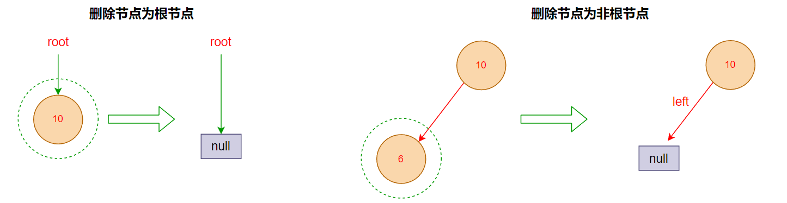

```typescript
/**
 * @description 二叉搜索树
 */
class BSTree<T> {
  /**
   * @description 根据数据值删除节点
   * @returns 返回是否删除成功
   */
  remove(value: T): boolean {
    // 查询删除节点信息
    const delNode = this.findTreeNode(value);

    // 获取目标节点信息
    const { parent, target, nodeType } = delNode;
    const { left, right } = target;

    if (left === null && right === null) {
      /**
       * @description 当前要删除的节点不存在子节点
       */
      if (target === this.root) {
        // 删除的节点是根节点，直接让根节点置为 null
        this.root = null;
      } else {
        // 删除的节点非根节点，通过父节点将【指向该节点的引用】指向 null
        parent![nodeType] = null;
      }
    }

    return true;
  }
}
```


##### 有一个子节点

删除的节点包含一个子节点：让 ==删除节点原来的位置== 指向其 ==子节点== 即可

- 删除节点为根节点

  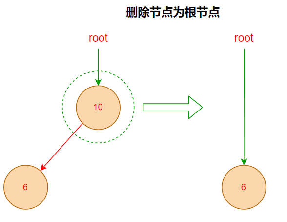

- 删除节点不为根节点

  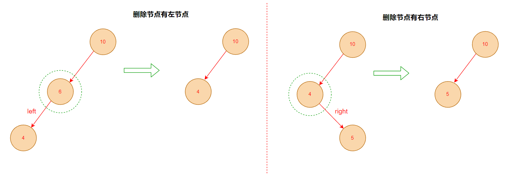

```typescript
/**
 * @description 二叉搜索树
 */
class BSTree<T> {
  /**
   * @description 根据数据值删除节点
   * @returns 返回是否删除成功
   */
  remove(value: T): boolean {
    // 查询删除节点信息
    const delNode = this.findTreeNode(value);

    // 获取目标节点信息
    const { target } = delNode;
    const { left, right } = target;

    if (left === null && right === null) {
      // ....
    } else if (left !== null && right !== null) {
      // ...
    } else {
      /**
       * @description 当前要删除的节点存在一个子节点
       */
      // 先拿到这个删除节点的子节点
      const childNode = target.left ?? target.right;

      if (target === this.root) {
        // 删除的节点是根节点，直接让根节点指向其子节点
        this.root = childNode;
      } else {
        // 删除的节点非根节点，通过父节点将【指向该删除节点的引用】指向【该删除节点的子节点】
        parent![nodeType] = childNode;
      }
    }

    return true;
  }
}
```


##### 有两个子节点

- 对于删除节点有两个子节点的情况，需要查找其==前驱节点==或==后继节点==，再使用其替换==删除节点原来的位置==

  - 前驱节点：左子树中最大值节点
  - 后继节点：右子树中最小值节点

  

- 这里我们采用前驱节点处理法，声明一个查找前驱节点的方法

  ```typescript
  /**
   * @description 二叉搜索树
   */
  class BSTree<T> {
    /**
     * @description 查找前驱节点 - 即查找删除节点的左子树中最大值
     * @param delNode 要删除的节点
     */
    private findPreAccessorNode(delNode: TreeNode<T>) {
      // 从左子树进行查找
      let accessor: TreeNode<T> | null = delNode.left!;
      let parent: TreeNode<T> | null = delNode;
  
      // 沿着右子树查找，查找到叶子节点即为最大值节点
      while (accessor.right !== null) {
        parent = accessor;
        accessor = accessor.right;
      }
  
      /**
       * 若前驱节点不等于删除节点的左子节点
       * 1. 先使用前驱节点的【左子树】替换前驱节点的位置
       * 2. 再让前驱节点的左子节点指针指向删除节点的左子树
       */
      if (accessor !== delNode.left) {
        parent.right = accessor.left;
        accessor.left = delNode.left;
      }
  
      /**
       * 将删除节点的右子树拼接在前驱节点的右子树上
       */
      accessor.right = delNode.right;
  
      return accessor;
    }
  }
  ```

- 使用前驱节点替换删除节点

  ```typescript
  /**
   * @description 二叉搜索树
   */
  class BSTree<T> {
    /**
     * @description 根据数据值删除节点
     * @returns 返回是否删除成功
     */
    remove(value: T): boolean {
      // 查询删除节点信息
      const delNode = this.findTreeNode(value);
  
      // 获取目标节点信息
      const { target } = delNode;
      const { left, right } = target;
  
      if (left === null && right === null) {
        // ....
      } else if (left !== null && right !== null) {
        /**
         * @description 当前要删除的节点存在两个子节点
         */
        // 获取到进行替换的前驱节点
        const preAccessorNode = this.findPreAccessorNode(target);
  
        if (target === this.root) {
          // 删除的节点是根节点，直接让根节点指向这个【前驱节点】
          this.root = preAccessorNode;
        } else {
          // 删除的节点非根节点，通过父节点将【指向该节点的引用】指向这个【前驱节点】
          parent![nodeType] = preAccessorNode;
        }
      }
  
      return true;
    }
  }
  ```


#### 二叉搜索树完整实现

```typescript
import LinkedQueue from "./LinkedQueue";

/**
 * @description 树节点
 */
class TreeNode<T> {
  /**
   * @description 节点的值
   */
  value: T;
  /**
   * @description 左子树
   */
  left: TreeNode<T> | null = null;
  /**
   * @description 右子树
   */
  right: TreeNode<T> | null = null;

  constructor(value: T) {
    this.value = value;
  }
}

/**
 * @description 查找节点生成的信息
 */
interface AccessorNodeInfo<T> {
  /**
   * @description 节点的父节点
   */
  parent: TreeNode<T> | null;
  /**
   * @description 目标节点
   */
  target: TreeNode<T>;
  /**
   * @description 当前节点是否父节点的左节点还是右节点
   */
  nodeType: "right" | "left";
}

/**
 * @description 二叉搜索树
 */
class BSTree<T> {
  /**
   * @description 根节点
   */
  root: TreeNode<T> | null = null;

  /**
   * @description 向树中插入数据
   * @param value 数据值
   */
  insert(value: T) {
    // 创建一个节点
    const insertNode = new TreeNode<T>(value);

    if (this.root === null) {
      // 如果当前树为空树，直接放在根节点
      this.root = insertNode;
      return;
    }

    let accessor = this.root;

    while (accessor !== null) {
      // 插入的值小于左子树节点值，沿着左子树查找
      if (value < accessor.value) {
        if (accessor.left !== null) {
          // 左子树不为空，继续递归左子树查找
          accessor = accessor.left;
        } else {
          // 左子树为空，插入节点，结束查找
          accessor.left = insertNode;
          break;
        }
      } else {
        // 插入的值大于右子树节点值，沿着右子树查找
        if (accessor.right !== null) {
          // 右子树不为空，继续递归右子树查找
          accessor = accessor.right;
        } else {
          // 右子树为空，插入节点，结束查找
          accessor.right = insertNode;
          break;
        }
      }
    }
  }

  /**
   * @description 在树中查找一个数据
   * @param value 要查找的数据值
   * @returns 返回是否查找到
   */
  search(value: T): boolean {
    // 如果当前树为空树，直接返回无法查找到
    if (this.root === null) {
      return false;
    }

    let accessor: TreeNode<T> | null = this.root;

    while (accessor !== null) {
      // 查找到节点值，返回 true
      if (value === accessor.value) {
        return true;
      }

      if (value < accessor.value) {
        // 给定值比当前节点值小，遍访左子树搜索
        accessor = accessor.left;
      } else {
        // 给定值比当前节点值大，遍访右子树搜索
        accessor = accessor.right;
      }
    }

    return false;
  }

  /**
   * @description 获取树中节点最小值
   */
  get min(): T | null {
    if (this.root === null) {
      // 如果为空树，直接返回
      return null;
    }

    /**
     * 由于二叉搜索树中，左子树节点值都小于根节点
     * 因此只需要沿着左子树查找，直到查找到叶子节点即可
     */
    let accessor = this.root;

    while (accessor.left !== null) {
      accessor = accessor.left;
    }

    return accessor.value;
  }

  /**
   * @description 获取树中节点最大值
   */
  get max(): T | null {
    if (this.root === null) {
      // 如果为空树，直接返回
      return null;
    }

    /**
     * 由于二叉搜索树中，右子树节点值都大于根节点
     * 因此只需要沿着右子树查找，直到查找到叶子节点即可
     */
    let accessor = this.root;

    while (accessor.right !== null) {
      accessor = accessor.right;
    }

    return accessor.value;
  }

  /**
   * @description 前序遍历
   */
  preOrderTraverse(): T[] {
    // 如果为空树，直接终止
    if (this.root === null) {
      return [];
    }

    // 声明一个数组，用于存放遍历结果
    const traverseResult: T[] = [];
    // 声明一个栈，用于临时存储遍历节点
    const stack: TreeNode<T>[] = [];

    let accessor: TreeNode<T> | null = this.root;

    while (accessor !== null || stack.length > 0) {
      if (accessor !== null) {
        // 存储遍历的节点值
        traverseResult.push(accessor.value);
        // 存入堆栈，用于回溯取出上层节点
        stack.push(accessor);
        // 以当前节点为根节点，遍历其左子树
        accessor = accessor.left;
      } else {
        // 左子树遍历完成，从堆栈出取出栈顶元素，开始遍访其右子树
        accessor = stack.pop()!.right;
      }
    }

    return traverseResult;
  }

  /**
   * @description 中序遍历
   */
  inOrderTraverse(): T[] {
    // 如果为空树，直接终止
    if (this.root === null) {
      return [];
    }

    // 声明一个数组，用于存放遍历结果
    const traverseResult: T[] = [];
    // 声明一个栈，用于临时存储遍历节点
    const stack: TreeNode<T>[] = [];

    let accessor: TreeNode<T> | null = this.root;

    while (accessor !== null || stack.length > 0) {
      if (accessor !== null) {
        // 存入堆栈，用于回溯取出
        stack.push(accessor);
        // 以当前节点为根节点，遍历其左子树
        accessor = accessor.left;
      } else {
        // 左子树遍访完成，弹出栈顶元素
        accessor = stack.pop()!;
        // 存储遍历的节点值
        traverseResult.push(accessor.value);
        // 开始遍访右子树
        accessor = accessor.right;
      }
    }

    return traverseResult;
  }

  /**
   * @description 后序遍历
   */
  postOrderTraverse(): T[] {
    // 如果为空树，直接终止
    if (this.root === null) {
      return [];
    }

    // 声明一个数组，用于存放遍历结果
    const traverseResult: T[] = [];
    // 声明一个栈，用于临时存储遍历节点
    const stack: TreeNode<T>[] = [];

    let accessor: TreeNode<T> | null = this.root;
    // 存储最近访问的节点
    let lastVisitedNode: TreeNode<T> | null = null;

    while (accessor !== null || stack.length > 0) {
      if (accessor !== null) {
        // 存入堆栈，用于回溯取出
        stack.push(accessor);
        // 以当前节点为根节点，遍历其左子树
        accessor = accessor.left;
      } else {
        // 读取栈顶元素的右子树
        const topRight = stack.at(-1)!.right;

        if (topRight !== null && topRight !== lastVisitedNode) {
          // 栈顶元素的右子树不为空，且没有访问过，则遍访右子树
          accessor = topRight;
        } else {
          // 左子树遍访完成，弹出栈顶元素
          accessor = stack.pop()!;
          // 存储遍历的节点值
          traverseResult.push(accessor.value);
          // 记录最近访问的节点
          lastVisitedNode = accessor;
          // 重置遍历指针
          accessor = null;
        }
      }
    }

    return traverseResult;
  }

  /**
   * @description 层序遍历
   */
  levelOrderTraverse(): T[] {
    // 如果为空树，直接终止
    if (this.root === null) {
      return [];
    }

    // 声明一个数组，用于存放遍历结果
    const traverseResult: T[] = [];

    // 创建一个队列
    const queue = new LinkedQueue<TreeNode<T>>();
    // 先把根节点插入队列
    queue.enqueue(this.root);

    // 遍历二叉搜索树，队列为空时结束遍历
    while (queue.size > 0) {
      // 每次出队一个节点
      const { left, right, value } = queue.dequeue()!;

      // 存储此次出队节点的值
      traverseResult.push(value);

      // 每出队一个节点，将左右子树依次入队
      if (left !== null) queue.enqueue(left);
      if (right !== null) queue.enqueue(right);
    }

    return traverseResult;
  }

  /**
   * @description 查找节点
   */
  private findTreeNode(value: T): AccessorNodeInfo<T> | null {
    // 遍历的指针
    let accessor: TreeNode<T> | null = this.root;
    // 遍历节点的父节点
    let parent: TreeNode<T> | null = null;
    // 遍历节点属于父节点的左子树还是右子树
    let nodeType: "left" | "right" = "left";

    while (accessor !== null) {
      // 查找到节点值，返回 true
      if (value === accessor.value) {
        return { parent, target: accessor, nodeType };
      }

      // 遍历子树之前，保存子树的父节点
      parent = accessor;

      if (value < accessor.value) {
        // 给定值比当前节点小，遍访左子树搜索
        accessor = accessor.left;
        nodeType = "left";
      } else {
        // 给定值比当前节点大，遍访右子树搜索
        accessor = accessor.right;
        nodeType = "right";
      }
    }

    return null;
  }

  /**
   * @description 查找前驱节点 - 即查找删除节点的左子树中最大值
   * @param delNode 要删除的节点
   */
  private findPreAccessorNode(delNode: TreeNode<T>) {
    // 从左子树进行查找
    let accessor: TreeNode<T> | null = delNode.left!;
    let parent: TreeNode<T> | null = delNode;

    // 沿着右子树查找，查找到叶子节点即为最大值节点
    while (accessor.right !== null) {
      parent = accessor;
      accessor = accessor.right;
    }

    /**
     * 若前驱节点不等于删除节点的左子节点
     * 1. 先使用前驱节点的【左子树】替换前驱节点的位置
     * 2. 再让前驱节点的左子节点指针指向删除节点的左子树
     */
    if (accessor !== delNode.left) {
      parent.right = accessor.left;
      accessor.left = delNode.left;
    }

    /**
     * 将删除节点的右子树拼接在前驱节点的右子树上
     */
    accessor.right = delNode.right;

    return accessor;
  }

  /**
   * @description 删除、替换节点
   * @param delNode 要删除的节点
   * @param replaceNode 替换删除节点原位置的节点
   */
  private replaceDelNode(delNodeInfo: AccessorNodeInfo<T>, replaceNode: TreeNode<T> | null) {
    const { target, parent, nodeType } = delNodeInfo;

    if (target === this.root) {
      // 删除的节点是根节点，直接让根节点指向【替换节点】
      this.root = replaceNode;
    } else {
      // 删除的节点非根节点，通过父节点将【指向该删除节点的引用】指向【替换节点】
      parent![nodeType] = replaceNode;
    }
  }

  /**
   * @description 根据数据值删除节点
   * @returns 返回是否删除成功
   */
  remove(value: T): boolean {
    // 如果当前树为空树，直接返回删除失败
    if (this.root === null) {
      return false;
    }

    // 查询删除节点信息
    const delNode = this.findTreeNode(value);

    if (delNode === null) {
      // 未查找到要删除的节点，删除失败
      return false;
    }

    // 获取目标节点信息
    const { target } = delNode;
    const { left, right } = target;

    if (left === null && right === null) {
      /**
       * @description 情况一：当前要删除的节点不存在子节点
       * 直接使用 null 替换删除节点原来的位置
       */
      this.replaceDelNode(delNode, null);
    } else if (left !== null && right !== null) {
      /**
       * @description 情况三：当前要删除的节点存在两个子节点
       * 先获取到进行替换的前驱节点
       * 再使用前驱节点替换删除节点原来的位置
       */
      const preAccessorNode = this.findPreAccessorNode(target);
      this.replaceDelNode(delNode, preAccessorNode);
    } else {
      /**
       * @description 情况二：当前要删除的节点存在一个子节点
       * 先拿到这个删除节点的子节点
       * 再使用这个子节点替换删除节点原来的位置
       */
      const childNode = target.left ?? target.right;
      this.replaceDelNode(delNode, childNode);
    }

    return true;
  }
}
```


### 二叉搜索树的缺陷

- 比较好的二叉搜索树数据应该是==左右分布均匀==的

  - 对于一棵平衡二叉树来说，插入/查找等操作的效率是 `O(logN)` 

- 当连续插入有序数据时，二叉树开始慢慢==左倾斜==或==右倾斜==

  - 对于一棵非平衡二叉树，相当于编写了一个链表，查找效率变成了 `O(N)`

  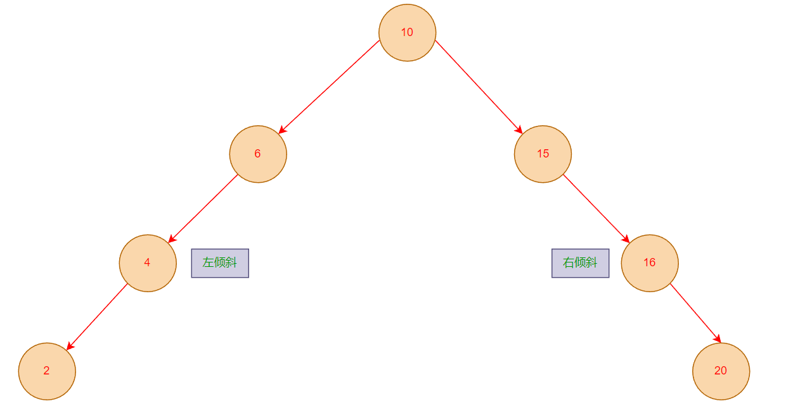

- 为了保证二叉搜索树的操作性能，需要尽可能的保证一棵树的==平衡==
  - **AVL 树**：AVL 树是最早的一种平衡树
    - 一种 自平衡二叉搜索树 ，其==左右子树的高度差不超过 1==
    - 如果一个 AVL 树的左子树高度和右子树高度之差超过 1，就需要进行平衡调整，以保持平衡状态
    - 但是，每次插入/删除操作相对于红黑树效率都不高，所以整体效率不如红黑树
  - **红黑树**：红黑树也通过一些特性来保持树的平衡
    - 每个节点都是带有颜色属性的二叉查找树，颜色为红色或黑色
    - 插入/删除等操作，红黑树的性能要优于 AVL 树
    - 因此现在平衡树的应用基本都是红黑树
