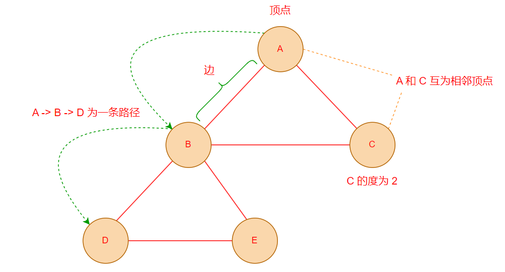
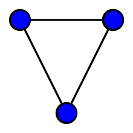
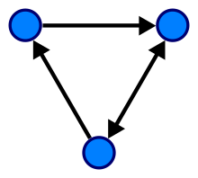
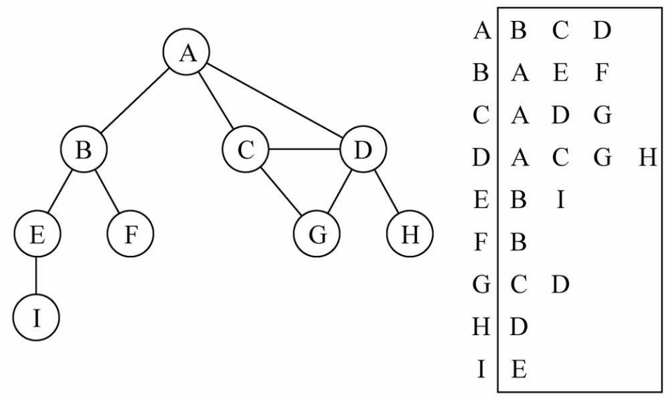
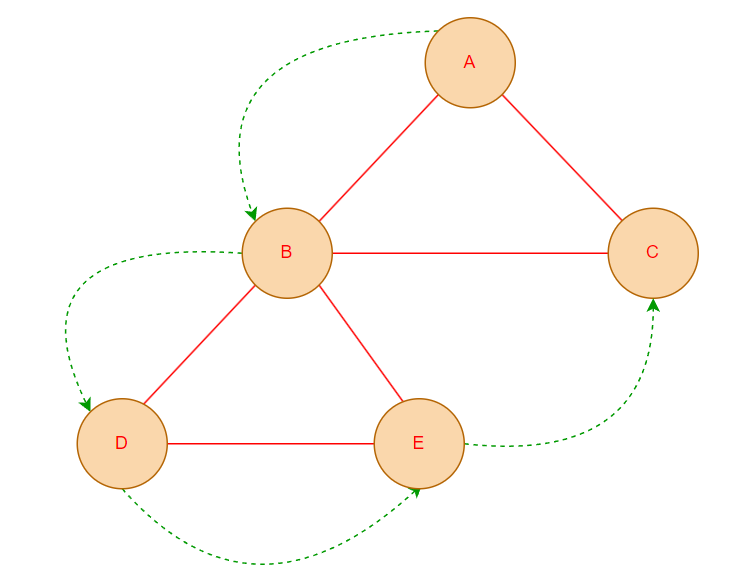
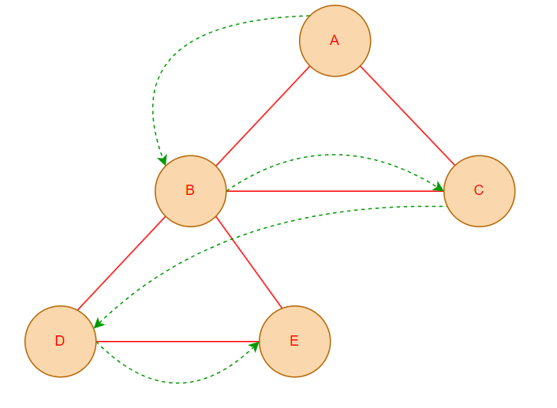

# 图

## 认识图结构

- 图论是数学的一个分支，在数学的概念上，树是图的一种
  - 它以图为研究对象，研究==顶点==和==边==组成的图形的数学理论和方法
  - 一般认为，图论起源于历史上的 [柯尼斯堡七桥问题](https://zh.wikipedia.org/wiki/%E6%9F%AF%E5%B0%BC%E6%96%AF%E5%A0%A1%E4%B8%83%E6%A1%A5%E9%97%AE%E9%A2%98)

- 在计算机科学中，==图==（graph）是一种抽象数据类型，用于实现数学中图论的无向图和有向图的概念
  - 图的数据结构包含一个有限（可能是可变的）的集合作为 **节点** 集合
  - 以及一个无序对（对应无向图）或有序对（对应有向图）的集合作为 **边** 的集合

- 图的现实实例

  - **六度分隔理论**：世界上任何互不相识的两人，只需要很少的中间人就能够建立起联系

    

  - **地铁线路图**

    


## 图的术语



- **顶点**：图中的一个节点
- **边**：顶点与顶点之间的连线
- **相邻顶点**：由一条边连接在一起的两个顶点互为相邻顶点

- **度**：一个顶点的度是相邻顶点的数量

- **路径**：路径是顶点 v1，v2...，vn 的一个==连续序列==

  - 简单路径：不包含重复的顶点的路径
  - 回路：第一个顶点和最后一个顶点相同的路径

- **无向图**：连接节点的边没有方向的图

   

- **有向图**：连接节点的边包含方向的图

  


## 图的存储方式

一个图包含很多==顶点==，另外包含顶点和顶点之间的连线(==边==)，这两个重要信息需要在程序中进行存储

### 邻接矩阵

- 在图论和计算机科学中，邻接矩阵（adjacency matrix）是一种方阵，用来表示==有限图==

  - 它的每个元素代表各点之间==是否有边相连==（有边相连使用 1 表示，没有使用 0 表示）
  - 在计算机程序中，可以使用一个==二维数组==来保存顶点直接的连接关系

  

- 邻接矩阵的缺陷：如果图是一个==稀疏图==，会浪费大量的空白空间（大量空间存放 0）


### 邻接表

- 邻接表（adjacency list）由图中每个==顶点==以及和顶点==相邻的顶点列表==组成

  - 这个列表可以由数组、链表、哈希表存储

  

- 邻接表的缺陷
  - 计算出度（指向的其他顶点数量）比较简单
  - 计算入度较复杂（指向当前顶点的其他顶点数量），但使用场景较少


## 图的遍历

- 图的遍历：将图中每个顶点访问一遍，并且==不能有重复==的访问

- 图的遍历方式有两种：**深度优先搜索** 和 **广度优先搜索**

### 深度优先搜索

- 深度优先搜索（Depth-First-Search，简称 **DFS**）思路

  - 从第一个指定的顶点开始遍历图，沿着路径直到这条路径最后顶点被访问了
  -  接着原路回退并探索下一条路径

  

- 在计算机程序中，深度优先搜索一般使用 **递归** 或 **栈** 实现


### 广度优先搜索

- 广度优先搜索（Breadth-First-Search，简称 **BFS**）思路

  - 从指定的第一个顶点开始遍历图，先访问其所有的==相邻点==
  - 类似于依次访问图的一层

  

- 在计算机程序中，广度优先搜索一般使用 **队列** 实现


## 封装图结构

| 方法          | 描述                       |
| ------------- | -------------------------- |
| addVertex(v)  | 如果顶点不存在，则添加顶点 |
| addEdge(v, w) | 使两个顶点之间建立关联边   |
| dfs()         | 深度优先搜索               |
| bfs()         | 广度优先搜索               |

### 初始化图结构

- 这里我们使用 **邻接表** 来存储图中顶点之间的关系

- 声明一个 `Graph` 类包含两个属性
  - 顶点列表（使用数组存储）
  - 顶点-邻接边集合映射（使用哈希表存储，值为一个 `Set`，防止重复建立关联边）

```typescript
/**
 * @description 图结构
 */
class Graph<T> {
  /**
   * @description 顶点列表
   */
  private vertexList: T[] = [];
  /**
   * @description 【顶点-邻接边集合】映射
   */
  private adjacencyMap = new Map<T, Set<T>>();
}
```


### 添加顶点 — addVertex

`addVertex` 方法用于向图中添加一个顶点，若添加的顶点已存在于图中，则不进行重复添加

```typescript
/**
 * @description 图结构
 */
class Graph<T> {
  /**
   * @description 添加顶点，如果顶点已存在则不进行操作
   * @param v 顶点的值
   */
  addVertex(v: T) {
    // 图中已包含该顶点，不执行添加操作
    if (this.vertexList.includes(v)) {
      return;
    }

    // 向顶点列表中追加一个顶点
    this.vertexList.push(v);

    // 新增【顶点-邻接边集合】映射
    this.adjacencyMap.set(v, new Set());
  }
}
```


### 添加边 — addEdge

`addEdge` 方法用于给两个顶点之间建立边关联，需要同时为两个顶点互相建立关联

```typescript
/**
 * @description 图结构
 */
class Graph<T> {
  /**
   * @description 为两个顶点建立关联边
   */
  addEdge(v: T, w: T) {
    // 为 v 和 w 互相建立关联边，使其互为相邻顶点
    this.adjacencyMap.get(v)?.add(w);
    this.adjacencyMap.get(w)?.add(v);
  }
}
```


### 遍历图结构

#### 深度优先 — DFS

- **递归** 实现深度优先搜索

  ```typescript
  /**
   * @description 图结构
   */
  class Graph<T> {
    /**
     * @description 深度优先搜索 - 递归
     * @param vertexList 节点列表
     * @param visited 已经访问过的节点集合
     * @param traverseResult 遍历结果
     * @returns 遍历结果
     */
    dfs_Recursion(
      vertexList: T[] = this.vertexList,
      visited = new Set<T>(),
      traverseResult: T[] = []
    ) {
      // 若图中顶点个数小于 1，直接返回顶点列表，终止遍历
      if (vertexList.length <= 0) {
        return traverseResult;
      }
  
      for (const vertex of vertexList) {
        // 如果该顶点已经被访问过，跳过此次遍历
        if (visited.has(vertex)) continue;
  
        // 存储遍历值
        traverseResult.push(vertex);
        // 标识此节点已经访问过
        visited.add(vertex);
  
        // 获取此节点的邻边
        const adjacencyList = this.adjacencyMap.get(vertex);
        // 不存在邻边，跳过遍历
        if (!adjacencyList) continue;
  
        // 递归遍历邻边列表
        this.dfs_Recursion([...adjacencyList], visited, traverseResult);
      }
  
      return traverseResult;
    }
  }
  ```

- **栈** 实现深度优先搜索

  ```typescript
  /**
   * @description 图结构
   */
  class Graph<T> {
    /**
     * @description 深度优先搜索
     * @returns 遍历结果
     */
    dfs(): T[] {
      // 若图中顶点个数小于 1，直接返回顶点列表，终止遍历
      if (this.vertexList.length <= 1) {
        return this.vertexList;
      }
  
      // 声明一个数组，用于存放遍历结果
      const traverseResult: T[] = [];
      // 声明一个栈，默认把第一个顶点存入
      const stack = [this.vertexList[0]];
      // 声明一个【已经访问过的节点集合】
      const visited = new Set<T>();
  
      while (stack.length > 0) {
        // 从栈顶出栈一个元素
        const vertex = stack.pop()!;
  
        // 如果该顶点已经被访问过，跳过此次遍历
        if (visited.has(vertex)) continue;
  
        // 存储遍历值
        traverseResult.push(vertex);
        // 标识此节点已经访问过
        visited.add(vertex);
  
        // 获取此节点的邻边
        const adjacencyList = this.adjacencyMap.get(vertex);
        // 不存在邻边，跳过遍历
        if (!adjacencyList) continue;
  
        // 将邻边节点依次入栈，跳过已经访问过的节点
        for (const adjacent of adjacencyList) {
          if (visited.has(adjacent)) continue;
          stack.push(adjacent);
        }
      }
  
      return traverseResult;
    }
  }
  ```


#### 广度优先 — BFS

为了实现广度优先搜索，我们可以借助 **队列**（ [队列实现参考](./queue#基于链表实现) ）

```typescript
import LinkedQueue from "./LinkedQueue";

/**
 * @description 图结构
 */
class Graph<T> {
  /**
   * @description 广度优先搜索
   * @returns 遍历结果
   */
  bfs(): T[] {
    // 若图中顶点个数小于 1，直接返回顶点列表，终止遍历
    if (this.vertexList.length <= 1) {
      return this.vertexList;
    }

    // 声明一个数组，用于存放遍历结果
    const traverseResult: T[] = [];
    // 声明一个【已经访问过的节点集合】
    const visited = new Set<T>();

    // 创建一个队列，默认把第一个节点入队
    const queue = new LinkedQueue<T>();
    queue.enqueue(this.vertexList[0]);

    while (queue.size > 0) {
      // 每次出队一个元素
      const vertex = queue.dequeue()!;

      // 如果该顶点已经被访问过，跳过此次遍历
      if (visited.has(vertex)) continue;

      // 存储遍历值
      traverseResult.push(vertex);
      // 标识此节点已经访问过
      visited.add(vertex);

      // 获取此节点的邻边
      const adjacencyList = this.adjacencyMap.get(vertex);
      // 不存在邻边，跳过遍历
      if (!adjacencyList) continue;

      // 将邻边节点依次入队，跳过已经访问过的节点
      for (const adjacent of adjacencyList) {
        if (visited.has(adjacent)) continue;
        queue.enqueue(adjacent);
      }
    }

    return traverseResult;
  }
}
```


### 图结构完整实现

```typescript
import LinkedQueue from "./LinkedQueue";

/**
 * @description 图结构
 */
export default class Graph<T> {
  /**
   * @description 顶点列表
   */
  private vertexList: T[] = [];
  /**
   * @description 【顶点-邻接边集合】映射
   */
  private adjacencyMap = new Map<T, Set<T>>();

  /**
   * @description 添加顶点，如果顶点已存在则不进行操作
   * @param v 顶点的值
   */
  addVertex(v: T) {
    // 图中已包含新增顶点，不执行添加操作
    if (this.vertexList.includes(v)) {
      return;
    }

    // 向顶点列表中追加一个顶点
    this.vertexList.push(v);
    // 新增【顶点-邻接边集合】映射
    this.adjacencyMap.set(v, new Set());
  }

  /**
   * @description 为两个顶点建立关联边
   */
  addEdge(v: T, w: T) {
    // 为 v 和 w 互相建立关联边，使其互为相邻顶点
    this.adjacencyMap.get(v)?.add(w);
    this.adjacencyMap.get(w)?.add(v);
  }

  /**
   * @description 深度优先搜索
   * @returns 遍历结果
   */
  dfs(): T[] {
    // 若图中顶点个数小于 1，直接返回顶点列表，终止遍历
    if (this.vertexList.length <= 1) {
      return this.vertexList;
    }

    // 声明一个数组，用于存放遍历结果
    const traverseResult: T[] = [];
    // 声明一个栈，默认把第一个顶点存入
    const stack = [this.vertexList[0]];
    // 声明一个【已经访问过的节点集合】
    const visited = new Set<T>();

    while (stack.length > 0) {
      // 从栈顶出栈一个元素
      const vertex = stack.pop()!;

      // 如果该顶点已经被访问过，跳过此次遍历
      if (visited.has(vertex)) continue;

      // 存储遍历值
      traverseResult.push(vertex);
      // 标识此节点已经访问过
      visited.add(vertex);

      // 获取此节点的邻边
      const adjacencyList = this.adjacencyMap.get(vertex);
      // 不存在邻边，跳过遍历
      if (!adjacencyList) continue;

      // 将邻边节点依次入栈，跳过已经访问过的节点
      for (const adjacent of adjacencyList) {
        if (visited.has(adjacent)) continue;
        stack.push(adjacent);
      }
    }

    return traverseResult;
  }

  /**
   * @description 广度优先搜索
   * @returns 遍历结果
   */
  bfs(): T[] {
    // 若图中顶点个数小于 1，直接返回顶点列表，终止遍历
    if (this.vertexList.length <= 1) {
      return this.vertexList;
    }

    // 声明一个数组，用于存放遍历结果
    const traverseResult: T[] = [];
    // 声明一个【已经访问过的节点集合】
    const visited = new Set<T>();

    // 创建一个队列，默认把第一个节点入队
    const queue = new LinkedQueue<T>();
    queue.enqueue(this.vertexList[0]);

    while (queue.size > 0) {
      // 每次出队一个元素
      const vertex = queue.dequeue()!;

      // 如果该顶点已经被访问过，跳过此次遍历
      if (visited.has(vertex)) continue;

      // 存储遍历值
      traverseResult.push(vertex);
      // 标识此节点已经访问过
      visited.add(vertex);

      // 获取此节点的邻边
      const adjacencyList = this.adjacencyMap.get(vertex);
      // 不存在邻边，跳过遍历
      if (!adjacencyList) continue;

      // 将邻边节点依次入队，跳过已经访问过的节点
      for (const adjacent of adjacencyList) {
        if (visited.has(adjacent)) continue;
        queue.enqueue(adjacent);
      }
    }

    return traverseResult;
  }
}
```
