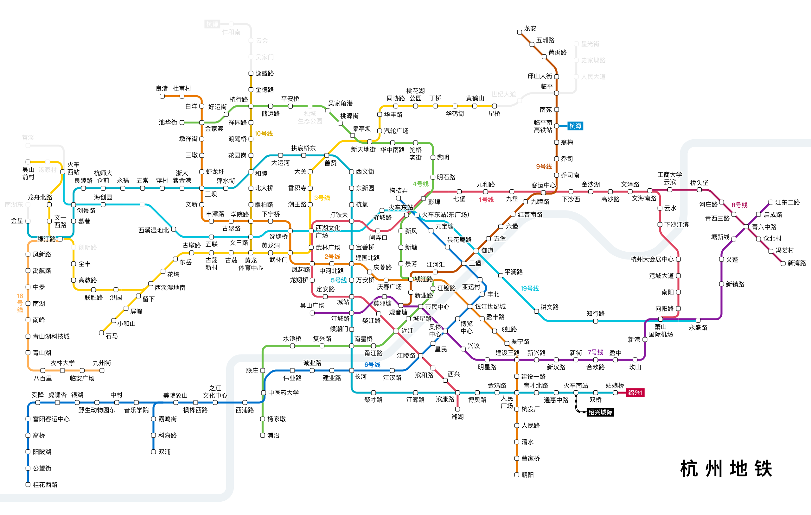

# 图

## 认识图结构

- 图论是数学的一个分支，在数学的概念上，树是图的一种
  - 它以图为研究对象，研究==顶点==和==边==组成的图形的数学理论和方法
  - 一般认为，图论起源于历史上的 [柯尼斯堡七桥问题](https://zh.wikipedia.org/wiki/%E6%9F%AF%E5%B0%BC%E6%96%AF%E5%A0%A1%E4%B8%83%E6%A1%A5%E9%97%AE%E9%A2%98)

- 在计算机科学中，==图==（graph）是一种抽象数据类型，用于实现数学中图论的无向图和有向图的概念
  - 图的数据结构包含一个有限（可能是可变的）的集合作为 **节点** 集合
  - 以及一个无序对（对应无向图）或有序对（对应有向图）的集合作为 **边** 的集合

- 图的现实实例

  - **六度分隔理论**：世界上任何互不相识的两人，只需要很少的中间人就能够建立起联系

    

  - **地铁线路图**

    
