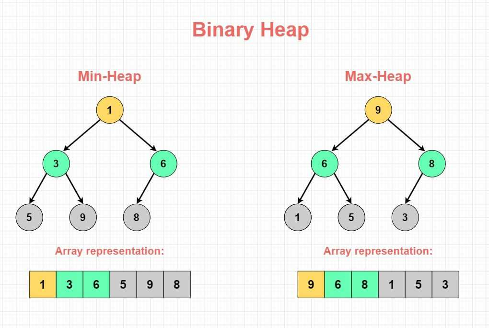
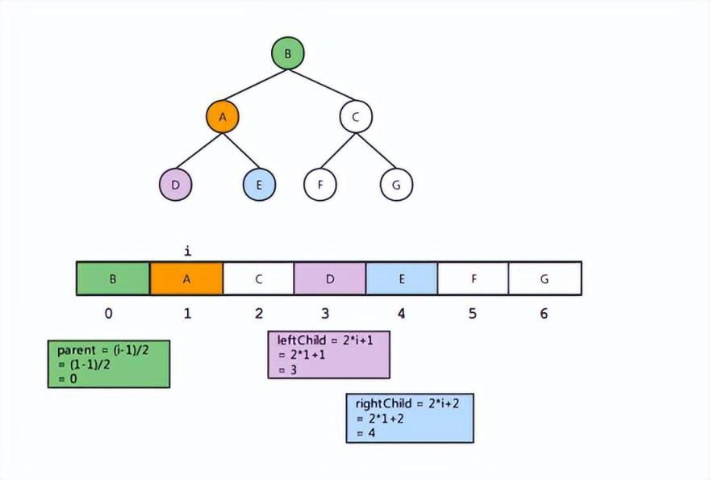
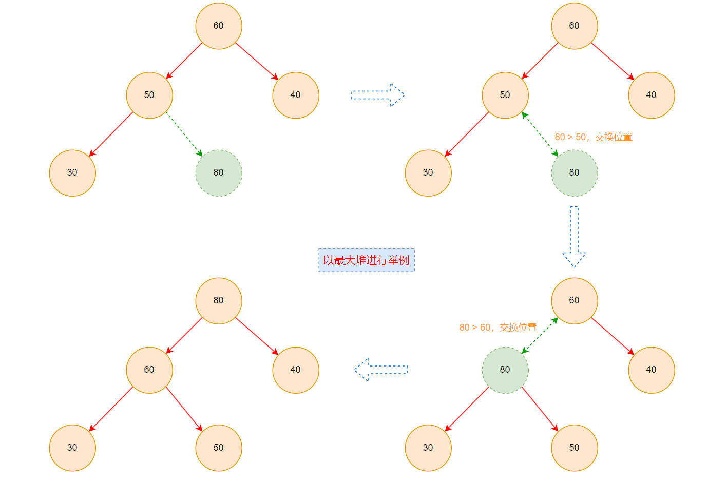
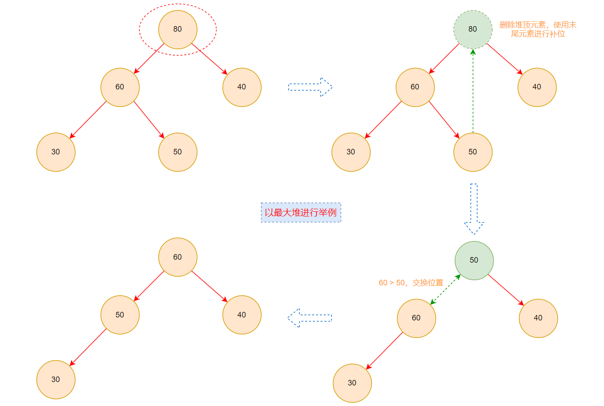
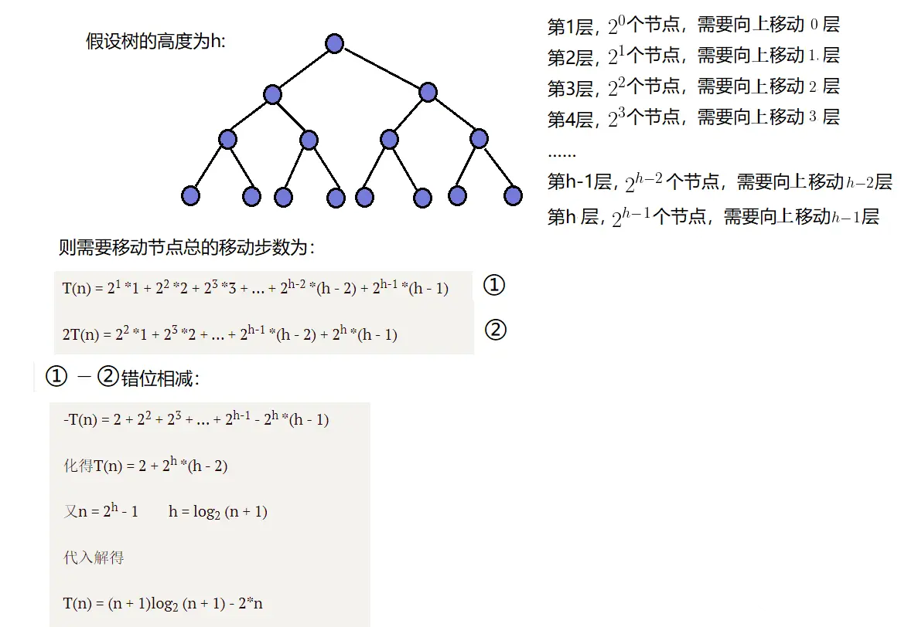
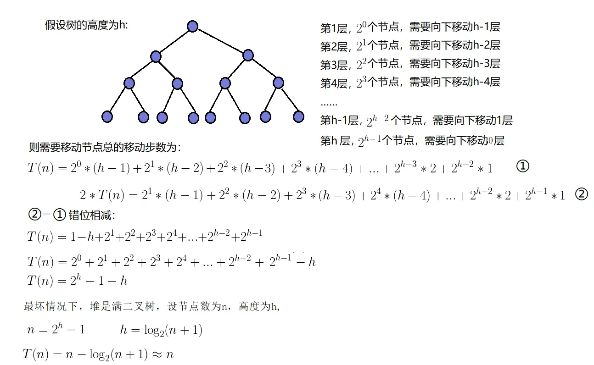

# 堆

## 认识堆结构

- **堆**（Heap）是计算机科学中的一种特别的==完全二叉树==

  - 堆通常是用来解决 **Top K 问题**（在一组数据中，找出最前面的 K 个最大/最小的元素）

- 堆可以进行很多分类，但==二叉堆==最具有应用普遍性。二叉堆又可以划分为==最大堆==和==最小堆==

  - 最小堆（Max Heap）：堆中每一个节点都==小于等于==它的子节点
  - 最大堆（Min Heap）：堆中每一个节点都==大于等于==它的子节点

  

- 堆始于 J. W. J. Williams 在 1964 年发表的 **堆排序**，当时他提出了二叉堆树作为此算法的数据结构


## 堆的存储

- 堆在表现上是一颗==完全二叉树==，但在存储上通常使用==顺序存储方式==（数组或链表）

- 当使用 **数组** 存储完全二叉树时，父节点的索引和左右子节点的索引之间存在一定的关联关系

  - 对于每个节点在数组中的索引 **i**，如果 **i = 0**，则为 **根节点**
  - 其父节点的索引：**floor( (i - 1) / 2)**
  - 其左子节点的索引：**2 * i + 1**
  - 其右子节点的索引：**2 * i + 2**

  


## 封装堆结构

| 属性/方法       | 描述                            |
| --------------- | ------------------------------- |
| insert(value)   | 向堆中插入新元素                |
| extract()       | 删除堆顶（最大/最小）元素并返回 |
| peek()          | 获取堆顶（最大/最小）元素       |
| buildHeap(list) | 原地建堆                        |
| isEmpty         | 堆是否为空                      |
| size            | 获取堆中元素个数                |

### 初始化堆结构

- 声明一个 `Heap` 类，内部使用 **数组** 进行数据存储
- 在创建堆实例时，外界可以决定是采用最大堆还是最小堆

```typescript
/**
 * @description 堆结构
 */
class Heap<T> {
  /**
   * @description 声明一个数组，用于存储堆中的元素
   */
  store: T[] = [];
  /**
   * @description 堆中的元素个数
   */
  private length: number = 0;
  /**
   * @description 堆类型
   */
  private heapType: "MAX_HEAP" | "MIN_HEAP";

  /**
   * 构造函数
   * @param heapType 堆类型（默认为最大堆）
   */
  constructor(heapType: "MAX_HEAP" | "MIN_HEAP" = "MAX_HEAP") {
    this.heapType = heapType;
  }

  /**
   * @description 查看堆顶元素
   */
  peek(): T | null {
    return this.store[0] ?? null;
  }

  /**
   * @description 获取堆中元素个数
   */
  get size(): number {
    return this.length;
  }

  /**
   * @description 堆是否为空
   */
  isEmpty(): boolean {
    return this.length === 0;
  }
}
```


### 插入方法 — insert



- 对于插入元素，按照完全二叉树的特性，我们先进行 **尾部插入**
- 插入元素后，由于依然要保持二叉堆的特性，对该插入元素进行==上滤==操作
  - “上滤“ 指将元素值与父节点值进行比较，若不满足二叉堆特性，则需要交换元素位置

```typescript
/**
 * @description 堆结构
 */
class Heap<T> {
  /**
   * @description 交互数组中两个元素位置
   */
  private swap(i: number, j: number) {
    const temp = this.store[i];
    this.store[i] = this.store[j];
    this.store[j] = temp;
  }

  /**
   * @description 上滤
   * @param position 进行上滤操作的元素位置索引
   */
  private heapifyUp(position: number) {
    // 当 position = 0 时，代表根节点，则终止上滤
    while (position > 0) {
      // 获取父节点索引位置
      const parentPosition = Math.floor((position - 1) / 2);
      // 获取当前节点和父节点
      const current = this.store[position];
      const parent = this.store[parentPosition];

      if (
        (this.heapType === "MAX_HEAP" && current > parent) || 
        (this.heapType === "MIN_HEAP" && current < parent)
      ) {
        /**
         * 满足以下任一种情况，需要进行上滤操作
         * 1.如果为最大堆，并且当前元素值大于父节点元素值
         * 2.如果为最小堆，并且当前元素值小于父节点元素值
         */
        this.swap(position, parentPosition);
        // 更新索引位置，继续上滤
        position = parentPosition;
      } else {
        // 已满足最大堆/最小堆特性，终止上滤操作
        break;
      }
    }
  }

  /**
   * @description 向堆中插入元素
   * @param value
   */
  insert(value: T) {
    // 先将元素追加到数组末尾
    this.store.push(value);
    // 更新堆中元素个数
    this.length++;
    // 对添加的元素进行上滤操作
    this.heapifyUp(this.length - 1);
  }
}
```


### 删除方法 — extract

- `extract` 方法用于删除并提取堆顶元素
  - 若堆中元素为空，直接终止删除操作并返回 **null**
  - 若堆中只有一个元素，删除这个元素并返回即可

- 若不满足上述两种情况，则删除后需要重新建堆，以继续满足二叉堆的特性

  - 首先删除数组尾部元素放在堆顶，使其成为新的堆顶元素（这样对整个堆结构的破坏性最小，进行调整的次数相对最少）
  - 然后对 **堆顶元素** 进行==下滤==操作，重新建立二叉堆
    - ”下滤“ 指将元素值与其左右子节点值进行比较，与其中的 **较大（最大堆）/ 较小（最小堆）** 值进行换位

  

```typescript
/**
 * @description 堆结构
 */
class Heap<T> {
  /**
   * @description 下滤
   * @param position 进行下滤操作的元素位置索引
   */
  private heapifyDown(position: number) {
    // 当前节点不再有子节点时，终止下滤操作
    while (2 * position + 1 < this.length) {
      // 左子节点位置索引
      const leftPosition = 2 * position + 1;
      // 右子节点位置索引
      const rightPosition = 2 * position + 2;

      let newPosition = leftPosition;

      if (this.heapType === "MAX_HEAP") {
        // 若为最大堆，则获取其中的较大值，与当前节点值进行比较
        let higher = this.store[leftPosition];

        // 若其右子节点存在，则比较左右子节点获取较大者
        if (rightPosition < this.length) {
          const rightValue = this.store[rightPosition];

          if (rightValue > higher) {
            higher = rightValue;
            newPosition = rightPosition;
          }
        }

        // 若当前节点值【大于等于】子节点中的较大值，则终止下滤
        if (this.store[position] >= higher) break;
      } else {
        // 若为最小堆，则获取其中的较小值，与当前节点值进行比较
        let lower = this.store[leftPosition];

        // 若其右子节点存在，则比较左右子节点获取较小者
        if (rightPosition < this.length) {
          const rightValue = this.store[rightPosition];

          if (rightValue < lower) {
            lower = rightValue;
            newPosition = rightPosition;
          }
        }

        // 若当前节点值【小于等于】子节点中的较小值，则终止下滤
        if (this.store[position] <= lower) break;
      }

      // 不满足二叉堆特性，交换元素位置
      this.swap(position, newPosition);
      // 更新索引位置，继续下滤
      position = newPosition;
    }
  }

  /**
   * @description 删除堆顶元素并返回
   */
  extract(): T | null {
    // 若堆为空，无需进行后续操作
    if (this.length === 0) return null;
    // 若堆中只有一个元素，删除这个元素并返回即可
    if (this.length === 1) {
      // 更新堆中元素个数
      this.length--;
      // 出栈这个元素并返回
      return this.store.pop()!;
    }

    // 提取堆顶元素
    const topElement = this.peek();

    // 让数组中最后一个元素出栈，替换堆顶元素
    this.store[0] = this.store.pop()!;
    // 更新堆中元素个数
    this.length--;
    // 对新的堆顶元素进行下滤操作，重新建立二叉堆
    this.heapifyDown(0);

    return topElement;
  }
}
```


### 原地建堆 — buildHeap

- 原地建堆：建立堆的过程中，不使用额外的内存空间，直接在原有数组上进行操作

- 原地建堆可采用==向上调整==算法或==向下调整==算法

  - 向上调整算法：从==第二个元素==开始进行==向上==调整，当循环到最后一个元素时完成建堆

    

  - 向下调整算法：从==倒数的第一个非叶结点的子树==开始==向下==调整，当循环到根节点时完成建堆

    

- 一般而言，原地建堆采用==向下调整算法==，效率要优于向上调整算法

```typescript
/**
 * @description 堆结构
 */
class Heap<T> {
  /**
   * @description 原地建堆
   * @param list 数据列表
   */
  buildHeap(list: T[]) {
    // 更新堆数据和长度
    this.store = list;
    this.length = list.length;

    // 第一个非叶子节点的索引位置
    const position = Math.floor((this.length - 2) / 2);

    for (let i = position; i >= 0; i--) {
      // 对每一个元素进行下滤
      this.heapifyDown(i);
    }
  }
}
```


### 堆的完整实现

```typescript
/**
 * @description 堆结构
 */
export default class Heap<T> {
  /**
   * @description 声明一个数组，用于存储堆中的元素
   */
  store: T[] = [];
  /**
   * @description 堆中的元素个数
   */
  private length: number = 0;
  /**
   * @description 堆类型
   */
  private heapType: "MAX_HEAP" | "MIN_HEAP";

  /**
   * 构造函数
   * @param heapType 堆类型（默认为最大堆）
   */
  constructor(heapType: "MAX_HEAP" | "MIN_HEAP" = "MAX_HEAP") {
    this.heapType = heapType;
  }

  /**
   * @description 交互数组中两个元素位置
   */
  private swap(i: number, j: number) {
    const temp = this.store[i];
    this.store[i] = this.store[j];
    this.store[j] = temp;
  }

  /**
   * @description 上滤
   * @param position 进行上滤操作的元素位置索引
   */
  private heapifyUp(position: number) {
    // 当 position = 0 时，代表根节点，则终止上滤
    while (position > 0) {
      // 获取父节点索引位置
      const parentPosition = Math.floor((position - 1) / 2);
      // 获取当前节点和父节点
      const current = this.store[position];
      const parent = this.store[parentPosition];

      if (
        (this.heapType === "MAX_HEAP" && current > parent) || 
        (this.heapType === "MIN_HEAP" && current < parent)
      ) {
        /**
         * 满足以下任一种情况，需要进行上滤操作
         * 1.如果为最大堆，并且当前元素值大于父节点元素值
         * 2.如果为最小堆，并且当前元素值小于父节点元素值
         */
        this.swap(position, parentPosition);
        // 更新索引位置，继续上滤
        position = parentPosition;
      } else {
        // 已满足最大堆/最小堆特性，终止上滤操作
        break;
      }
    }
  }

  /**
   * @description 下滤
   * @param position 进行下滤操作的元素位置索引
   */
  private heapifyDown(position: number) {
    // 当前节点不再有子节点时，终止下滤操作
    while (2 * position + 1 < this.length) {
      // 左子节点位置索引
      const leftPosition = 2 * position + 1;
      // 右子节点位置索引
      const rightPosition = 2 * position + 2;

      let newPosition = leftPosition;

      if (this.heapType === "MAX_HEAP") {
        // 若为最大堆，则获取其中的较大值，与当前节点值进行比较
        let higher = this.store[leftPosition];

        // 若其右子节点存在，则比较左右子节点获取较大者
        if (rightPosition < this.length) {
          const rightValue = this.store[rightPosition];

          if (rightValue > higher) {
            higher = rightValue;
            newPosition = rightPosition;
          }
        }

        // 若当前节点值【大于等于】子节点中的较大值，则终止下滤
        if (this.store[position] >= higher) break;
      } else {
        // 若为最小堆，则获取其中的较小值，与当前节点值进行比较
        let lower = this.store[leftPosition];

        // 若其右子节点存在，则比较左右子节点获取较小者
        if (rightPosition < this.length) {
          const rightValue = this.store[rightPosition];

          if (rightValue < lower) {
            lower = rightValue;
            newPosition = rightPosition;
          }
        }

        // 若当前节点值【小于等于】子节点中的较小值，则终止下滤
        if (this.store[position] <= lower) break;
      }

      // 不满足二叉堆特性，交换元素位置
      this.swap(position, newPosition);
      // 更新索引位置，继续下滤
      position = newPosition;
    }
  }

  /**
   * @description 向堆中插入元素
   * @param value
   */
  insert(value: T) {
    // 先将元素追加到数组末尾
    this.store.push(value);
    // 更新堆中元素个数
    this.length++;
    // 对添加的元素进行上滤操作
    this.heapifyUp(this.length - 1);
  }

  /**
   * @description 查看堆顶元素
   */
  peek(): T | null {
    return this.store[0] ?? null;
  }

  /**
   * @description 删除堆顶元素并返回
   */
  extract(): T | null {
    // 若堆为空，无需进行后续操作
    if (this.length === 0) return null;
    // 若堆中只有一个元素，删除这个元素并返回即可
    if (this.length === 1) {
      // 更新堆中元素个数
      this.length--;
      // 出栈这个元素并返回
      return this.store.pop()!;
    }

    // 提取堆顶元素
    const topElement = this.peek();

    // 让数组中最后一个元素出栈，替换堆顶元素
    this.store[0] = this.store.pop()!;
    // 更新堆中元素个数
    this.length--;
    // 对新的堆顶元素进行下滤操作，重新建立二叉堆
    this.heapifyDown(0);

    return topElement;
  }

  /**
   * @description 原地建堆
   * @param list 数据列表
   */
  buildHeap(list: T[]) {
    // 更新堆数据和长度
    this.store = list;
    this.length = list.length;

    // 第一个非叶子节点的索引位置
    const position = Math.floor((this.length - 2) / 2);

    for (let i = position; i >= 0; i--) {
      // 对每一个元素进行下滤
      this.heapifyDown(i);
    }
  }

  /**
   * @description 获取堆中元素个数
   */
  get size(): number {
    return this.length;
  }

  /**
   * @description 堆是否为空
   */
  isEmpty(): boolean {
    return this.length === 0;
  }
}
```
