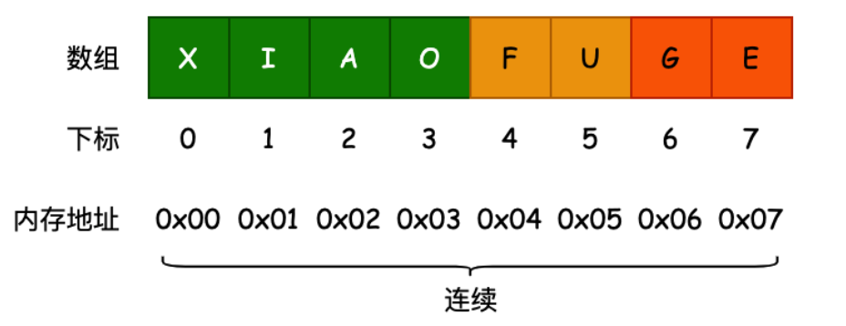

# 数组

## 线性结构

- ==线性结构==（Linear List）是由 ==n (n>=0)== 个数据元素（a[0]，a[1]，a[2]…，a[n-1]）组成的==有限序列==
  - 数据元素的个数 n 定义为表的==长度==，表里没有一个元素时称为==空表==
  - 将非空的线性表记作（a[0]，a[1]，a[2]…，a[n-1] 对应于每个元素）
  - 数据元素 `a[i]`（0 ≤ i ≤ n - 1）是一个抽象符号，其具体含义在不同情况下可以不同
- 常见的线性结构：
  - 数组结构
  - 栈结构
  - 队列结构
  - 链表结构

## 数组结构

- 在计算机科学中，**数组数据结构** 是由相同类型的元素的集合所组成的数据结构，分配一块==连续的内存==来存储

  - 利用元素的==索引==`index` 可以计算出该元素对应的存储地址
  - 是几乎每种编程语言都会提供的一种==原生数据结构==
  - 可以借助数组结构来实现其他的数据结构，比如栈、队列等

  

- 数组设计之初是在形式上依赖==内存分配==而成的，所以必须在使用前==预先请求空间==，这使得数组有以下特性
  - 请求空间以后==大小固定==，不能再改变
  - 在内存中有==空间连续性==的表现，中间不会存放其他程序需要调用的数据，为此数组的专用内存空间
  - 在旧式编程语言中（如有**中端语言**之称的 C），程序不会对数组的操作做边界判断，也就有潜在的==越界操作==的风险
- 因为简单数组强烈依赖电脑硬件之内存，所以不适用于现代的程序设计
  - 许多编程语言均提供了更高级的数据结构：如 `ArrayList` 、`Vector` 等==动态数组==

