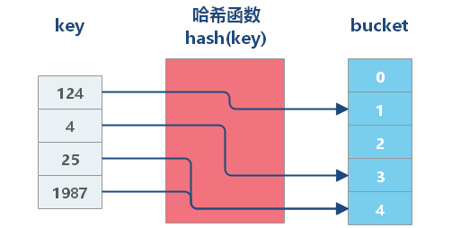
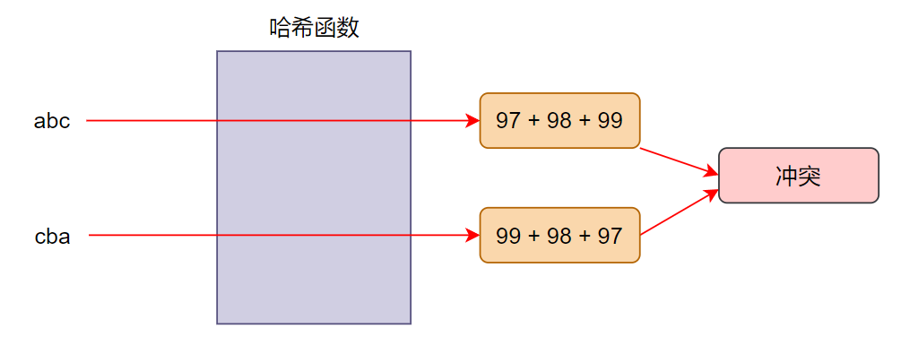
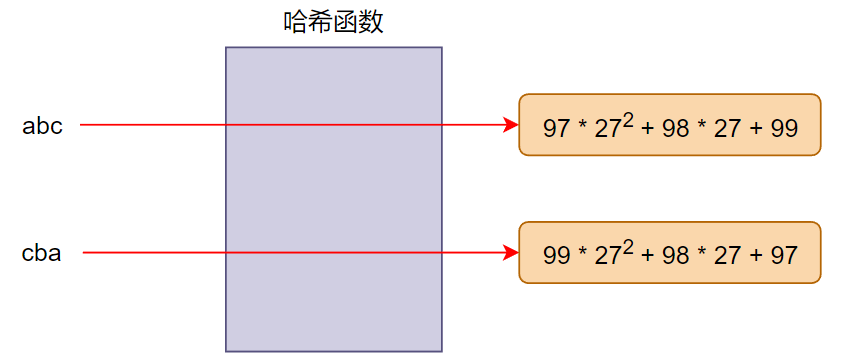
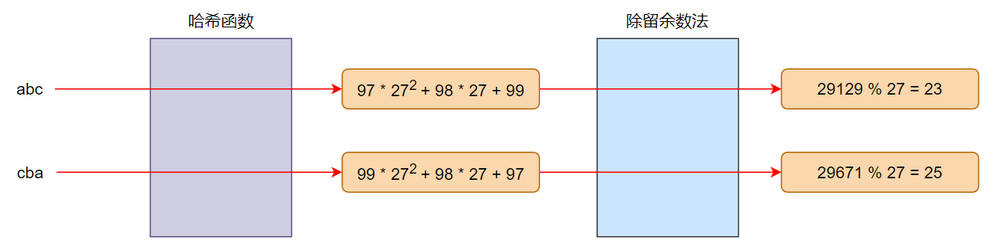
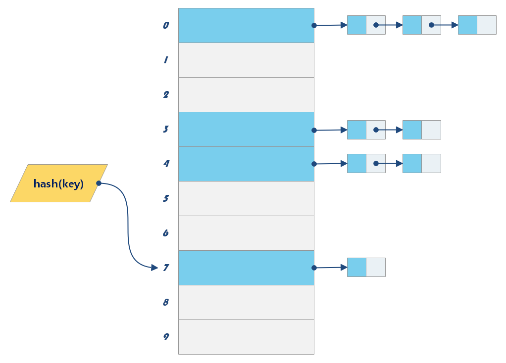
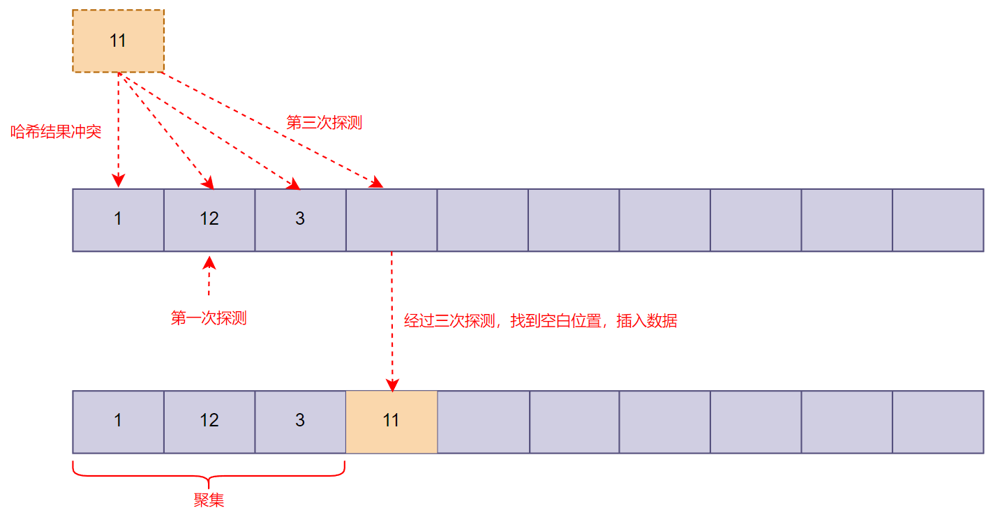
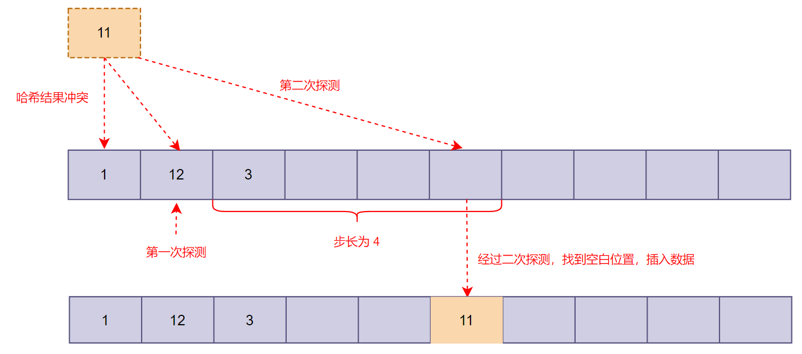

# 哈希表

## 认识哈希表

- 散列表（Hash table，也叫哈希表），是根据键（Key）而==直接访问==在存储器存储位置的数据结构
  - 它通过计算出一个键值的函数，将所需查询的数据==映射==到表中一个位置来进行访问
  - 这个函数被称作==哈希函数==（散列函数）

- 哈希表通常是==基于数组==进行实现的，但相比数组有许多不同
  - 提供非常快速的==插入==、==删除==、==查找==操作，时间复杂度可以达到 `O(1)`
  - 默认情况下，哈希表中的数据是==没有顺序==的，且哈希表中的==键不能重复==


## 哈希函数

### 认识哈希函数

- 哈希函数：一个将哈希表的==键==映射到某个位置的函数

  - 若关键字为 `k`，则其值存放在 `f(k)` 的存储位置上
  - 对不同的关键字可能得到同一散列地址，即 `k1 ≠ k2` ，而 `f(k1) = f(k2)`，这种现象称为==冲突==

- 通过哈希函数计算出来一个 **HashCode**，我们将其作为==数组的索引==，可以达到更快的访问速度

  


### 构造哈希函数

- 哈希函数设计的基本要求
  - 哈希函数计算得到的散列值是一个非负整数
  - 如果 `key1 = key2`，那 `f(key1) = f(key2)`
  - 如果 `key1 ≠ key2`，那 `f(key1) ≠ f(key2)`

- 为了实现将 **键转化为数组下标**，可以采用==幂的连乘==结合==除留余数法==来完成转化

#### 幂的连乘

- 如果直接采用 `f(k) = k` 的算法，即取 **k** 的每个字符的 ==ASCII 编码==进行 **累加**，产生冲突的概率极高

  

- 采用==幂的连乘==，可以有效的减少冲突概率

  - 算法：**字符编码 * r^n**，其中 n 为 当前字符的位数 

  


#### 除留余数法

- 采用幂的连乘虽然可以有效地减小冲突概率，但是计算出来的结果非常大
  - 如果使用这个结果作为 **数组下标**，那么需要申请一块==非常大的内存空间==
  - 同时这个数组的利用率非常低，无法做到==均匀分布==

- 除留余数法：取关键字被某个不大于散列表表长 m 的数 p 除后所得的余数为散列地址

  - 即 `f(k) = k mod p`（p \<= m）
  - 对 p 的选择很重要，一般取 m（选择==素数==），若 p 选择地不好，容易产生冲突

  

- 为了使哈希化结果 **均匀发布、减少冲突**，幂的连乘的==底数==和除留余数法中的==取余数==，都尽量要选择==素数==


## 处理冲突

- 虽然可以通过较好的哈希函数尽可能减少冲突，但是==冲突仍然不可避免==
- 处理冲突有两种常见的方案：**链地址法**、**开放地址法**

### 链地址法

链地址法是一种常见的解决冲突的方案

- 其核心逻辑在于每个数组单元中存储的不再是单个数据，而是一个链条
- 这个链条通常使用==数组或链表==实现




### 开放地址法

开放地址法的主要工作方式是==寻找空白的空间==来添加重复的数据

- 某个数据经过哈希函数哈希化之后，存储位置已经被占用了
- 我们就从当前位置开始，依次往后查找，看是否有空闲位置，直到找到为止
- 主要方式有 **线性探测**、**平方探测**、**再哈希**

#### 线性探测



- **线性探测**：线性的查找空白的单元
  - 当哈希化得到的位置为占用后，可以依次向后查找，直到找到空白位置
  - 线性探测每次查找的 ==步长 为 1==
  - 比如从下标值 x 开始探测，那么线性测试就是 x+1 -> x+2 -> x+3 依次探测

- 线性探测再遇到==聚集==时，搜索性能会变低，从而影响整个哈希表的操作效率
  - 在哈希表中，哈希函数的结果==不均匀==地占据表的单元，形成区块
  - 散列到区块中的任何关键字需要查找==多次试选==单元才能插入表中，造成时间浪费


#### 平方探测

- 线性探测在遇到 **聚集** 后，需要消耗较长的时长，通过修改==探测步长==可以优化探测速度

- **平方探测** 通过动态更新步长，以减少因聚集而导致耗时的探测操作

  - 比如从下标值 x 开始探测，那么平方探测就是 x+1² -> x+2² -> x+3² 依次探测

  

- 平方探测虽然可能减少探测次数，但出现相同平方步长的数据，仍然会产生步长不一的一种聚集


#### 再哈希法

- 为了消除线性探测和平方探测中步长一致导致的探测聚集，还有一种常见的解决办法：再哈希
- **再哈希**：把关键字用另外一个哈希函数，==再做一次哈希化==，用这次哈希化的结果作为 **步长**
  - 这个哈希函数与第一个哈希函数不能相同
  - 不能输出为 0，否则进入==探测死循环==

- 计算机专家已经设计出一种工作很好的哈希函数

  ```
  stepSize = constant - (key % constant)
  ```

  其中 constant 是素数，且小于数组的容量


## 哈希化效率

### 装填因子

- **装填因子** 表示当前哈希表中已经包含的数据项和整个哈希表长度的比值
  - ==装填因子 = 总数据项 / 哈希表长度==

- 开放地址法的装填因子最大为 1，链地址法的装填因子可以大于 1（链表可以无限延伸下去）


### 开放地址法效率

- 哈希表如果没有产生冲突，那么效率就会更高
  - 如果发生冲突，存取时间就依赖后来的==探测长度==

- 性能比较：平方探测和再哈希法的性能相当，优化线性探测


### 链地址法效率

- 对于链地址法，平均每个链条的数据项等于==哈希表总数据项 / 数组长度==（等于装填因子）
  - 当装填因子越大，每次查找元素时所要花费的时间越长
  - 因此装填因子达到==一定大==时，需要进行==扩容==；达到==一定小==时，需要进行==缩容==

- 除了要控制装填因子外，还需要控制数据量在每个链条中==均匀分布==（选择 **素数** 进行运算）
