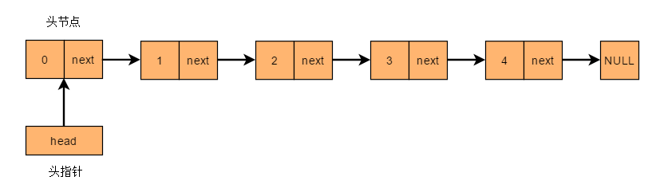

# 链表

## 认识链表

- 在计算机科学中，**链表**（Linked list）是一种常见的基础数据结构

  - 是一种==线性结构==，但是并不会按线性的顺序存储数据，而是在每一个节点里存放下一个节点的==指针==
  - 常用于组织 **检索较少，而删除、添加、遍历较多** 的数据

  

- 链表相对于数组的优缺点

  - 优势
    - 内存空间==不是必须连续==的，可以充分利用计算机的内存，实现灵活的==内存动态管理==
    - 链表不必在创建时就确定大小，并且大小可以==无限的延伸==下去
    - 链表在插入和删除数据时，时间复杂度可以达到 **O(1)**
  - 劣势
    - 失去了数组随机读取的优点，访问元素时必须从头开始查找，时间复杂度 **O(n)**
    - 由于增加了结点的指针域，==空间开销比较大==

- 链表在实现上，又可以分为单向链接、双向链表、循环链表等

## 单向链表

### 认识单向链表

- 单向链表是最简单的一种链表，每一个节点包含两个域：一个==信息域==和一个==指针域==

  - 信息域保存关于节点的信息
  - 指针域存储下一个节点的地址，在最后一个节点保存一个==特殊的结束标记==，比如 `null`
  - 同时还包含一个==头指针== `head`，指向链表的==第一个节点==

  

- 单向链表只可向一个方向遍历
