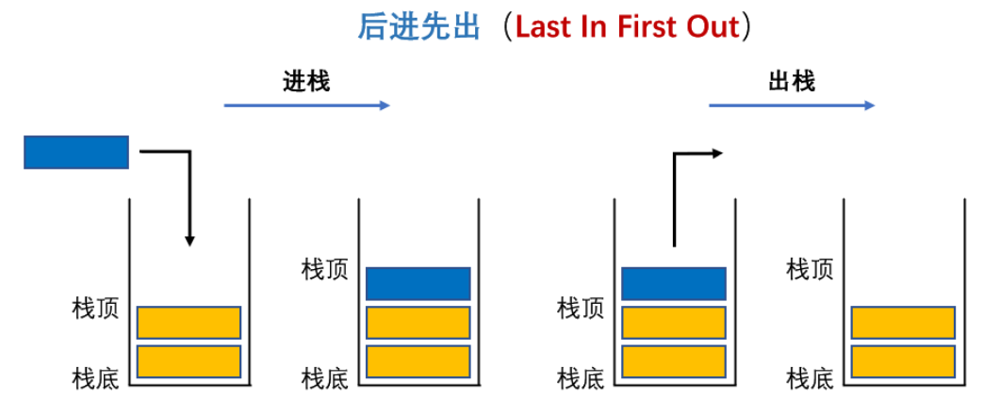

# 栈

## 认识栈

- ==栈==（Stack）是一种受限的==线性结构==，按照==后进先出==的原理运作
  
  - 仅允许在集合的一端（==栈顶==）进行插入（`push`）和删除（`pop`）运算，另一端称为==栈底==
  - 通常使用 **数组** 或 **链表** 来实现
  
- 栈的特点

  - 先进后出，后进先出
  - 除头尾节点之外，每个元素有一个前驱，一个后继

  

- 栈的两种操作

  - ==入栈==：向一个栈插入新元素，它是把新元素放到栈顶元素的上面，使之成为新的栈顶元素

  - ==出栈==：从一个栈删除元素，它是把栈顶元素删除掉，使其相邻的元素成为新的栈顶元素

- 栈的应用
  - 回溯
  - 递归
  - 深度优先搜索


## 封装栈

栈常见的操作

| 方法          | 描述                           |
| ------------- | ------------------------------ |
| push(element) | 向栈顶添加一个元素（element）  |
| pop()         | 将栈顶元素出栈，并返回这个元素 |
| peek()        | 查看栈顶元素                   |
| isEmpty       | 栈是否为空                     |
| size          | 返回栈内元素个数               |

### 基于数组实现

```typescript
class ArrayStack<T> {
  /**
   * @description 用于存放栈内元素
   */
  private data: T[] = [];

  /**
   * @description 入栈
   * @param element 入栈元素
   */
  push(element: T) {
    this.data.push(element);
  }

  /**
   * @description 出栈
   * @returns 出栈元素
   */
  pop(): T | undefined {
    return this.data.pop();
  }

  /**
   * @description 获取栈顶元素
   */
  peek(): T | undefined {
    return this.data.at(-1);
  }

  /**
   * @description 获取栈的元素个数
   */
  get size(): number {
    return this.data.length;
  }

  /**
   * @description 栈是否为空
   */
  get isEmpty(): boolean {
    return this.size === 0;
  }
}
```
