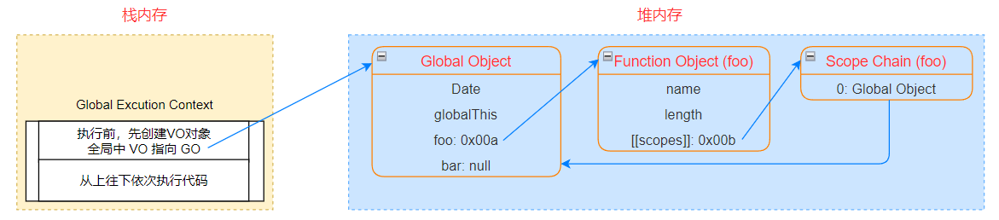
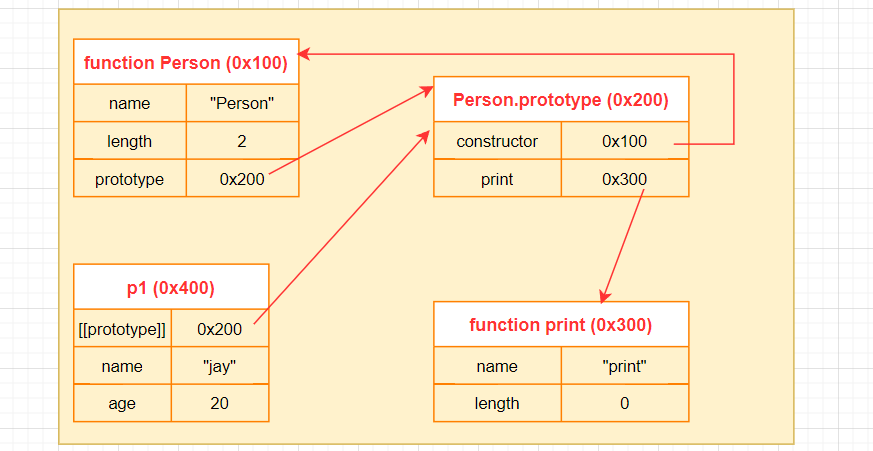
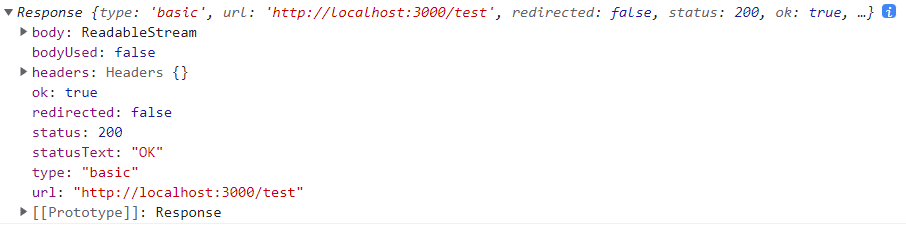

# JavaScript 进阶

## this 绑定规则

### 全局作用域 this 指向

- 浏览器环境：指向 `window`
- NodeJS 环境
  - 指向一个==空对象== `{}` 
  - 执行 js 文件，会当作一个模块进行加载 -> 编译 -> 放入一个函数 `compiledWrapper.call({})`，使用 `call` 调用该函数同时绑定了一个==空对象==

- this 绑定特点
  - 函数在调用时，JavaScript 引擎会默认给 this 绑定一个值
  - this 的绑定和定义的位置没有关系
  - this 的绑定和==调用方式==以及调用的==位置==有关
  - this 是在==运行时==被==动态绑定==的


### 绑定规则一：默认绑定

- ==独立函数调用== —— 函数没有被绑定到某个对象上进行调用，函数调用时没有==调用主体==

- this 指向

  - 默认绑定时严格模式（``"use strict"``）：指向 `undefined`
  - 非严格模式
    - 浏览器环境：指向 `window` 对象
    - NodeJS 环境：指向 `{}`

- 案例（浏览器环境下）

  ```js
  // 直接调用
  function foo() {
    console.log(this);
  }
  foo(); // window
  
  // 创建一个对象，对象中的属性指向foo
  const obj = {
    foo: function() {
      console.log(this);
    }
  };
  const bar = obj.foo;
  bar(); // window
  
  // 闭包函数
  function fun() {
    return function() {
      console.log(this);
    }
  }
  const fn = fun();
  fn(); // window
  
  // 严格模式
  const o = {
    name: 'why',
    foo() {
      "use strict";
      console.log(this)
    }
  }
  
  const boo = o.foo;
  boo(); // undefined
  ```

  

### 绑定规则二：隐式绑定

- 通过某个对象进行调用——将函数作为对象的属性方法，此时 this 绑定为这个==发起调用的对象==

- 案例

  ```js
  function foo() {
    console.log(this);
  }
  
  const obj = {
    name: 'obj',
    foo
  }
  
  obj.foo(); // { name: 'obj', foo: [Function: foo] }
  
  const obj1 = {
    name: 'obj1',
    foo() {
      console.log(this);
    }
  }
  
  const obj2 = {
    name: 'obj2',
    bar: obj1.foo
  }
  
  obj2.bar(); // { name: 'obj2', bar: [Function: foo] }
  ```

  

### 绑定规则三：显示绑定

- 隐式绑定有一个前提：必须在调用对象内部有一个对函数的引用（比如一个属性）

- 如果不希望在对象内部包含这个函数的引用，又想在这个对象上进行强制调用（隐式绑定），可以使用显示绑定

  - `call(thisArg: any, ...argArray: any[])`
  - `apply(thisArg: any, argArray?: any[])`
  - `bind(thisArg: any, ...argArray: any[])`

  ```js
  function foo(...args) {
    console.log(this, ...args)
  }
  
  foo.call(true, 1, 2); // Boolean {true} 1 2
  foo.apply(true, [1, 2]); // Boolean {true} 1 2
  
  const bar = foo.bind("aaa", 1, 2);
  bar(); // 显示绑定优先级 > 隐式绑定 String {'aaa'} 1 2
  bar(3, 4); // String {'aaa'} 1 2 3 4
  ```

  

### 绑定规则四：new 绑定 

- 使用 `new` 关键字调用函数时，会执行以下操作

  - 创建一个新的对象，this 指向这个创建的对象
  - 这个新对象会被执行 `prototype` 连接
  - 这个新对象会==绑定==到函数调用的的 `this` 上
  - 如果函数没有 `return` ==非空对象==，表达式会返回这个生成的新对象

  ```js
  function Person(name) {
    this.name = name;
    this.say = function () {
      console.log(this.name);
    }
  }
  
  const p = new Person('why');
  console.log(p); // Person {name: 'why', say: ƒ}
  p.say(); // why
  ```

  

### 内置函数的 this 绑定

- `setTimeout/setInterval`

  - 浏览器环境：指向 `window`

    ```js
    setTimeout(function() {
      console.log(this); // window
    }, 1000);
    ```

  - NodeJS 环境：指向创建出来的定时器对象

    ```js
    const timer = setTimeout(function() {
      console.log(this); // Timeout {}
      console.log(timer === this); // true
    }, 1000);
    ```

- 浏览器事件监听函数，如 `onClick`、`addEventListener`——指向绑定事件的元素

- 数组的遍历方法 `forEach/map/find/filter`

  - 默认情况（不传递 this 指向）

    - 浏览器：指向 `window`

      ```js
      [1].forEach(function () {
        console.log(this); // window
      });
      ```

    - NodeJS 环境：指向全局对象 `global`

      ```js
      [1].forEach(function () {
        console.log(this); // Object [global] {}
      });
      ```

  - 可以传递第二个参数指定 this：指向传递的 this 参数

    ```js
    [1].forEach(function () {
      console.log(this) // String {'aaa'}
    }, 'aaa');
    ```

    


### 绑定规则优先级

- 默认绑定的优先级最低

  ```js
  function foo() {
    console.log(this);
  }
  
  const obj = { name: 'obj', foo };
  obj.foo(); // { name: 'obj', foo: [Function: foo] }
  ```

- 显示绑定的优先级高于隐式绑定

  - `bind` 优先级高于 `apply/call`

  ```js
  const o = {
    name: 'o',
    foo() {
      console.log(this);
    }
  }
  o.foo(); // { name: 'o', foo: [Function: foo] }
  o.foo.call('aaa'); // String {'aaa'}
  
  function foo() {
    console.log(this);
  }
  const o2 = {
    name: 'o2',
    foo: foo.bind('aaa')
  }
  o2.foo(); // String {'aaa'}
  
  // bind 优先级高于 call/apply
  foo.bind('ooo').call('ccc'); // String {'ooo'}
  ```

- new 绑定的优先级高于显示绑定

  ```js
  function foo() {
    console.log(this);
  }
  const bar = foo.bind('aaa');
  const obj = new bar(); // foo {}
  ```

- ==优先级==：new 绑定 > 显示绑定 > 隐式绑定 > 默认绑定


### this 特殊绑定

- 忽略显示绑定：使用 `call/apply/bind` 显示绑定时传入 `null` 或 `undefined` 时，会忽略显示绑定，指向==全局对象==

  - 浏览器环境下指向 `window`
  - NodeJS 环境指向 `global`

  ```js
  // 忽略显示绑定
  function foo() {
    console.log(this);
  }
  
  // 浏览器环境：window
  // Node环境：Global
  foo.call(null);
  foo.apply(undefined);
  foo.bind(null)();
  ```

- 间接函数引用：会解析成==独立函数==调用

  ```js
  const obj1 = {
    name: 'obj1',
    foo() {
      console.log(this);
    }
  };
  
  const obj2 = { name: 'obj2' };
  
  // 赋值语句返回foo函数
  (obj2.foo = obj1.foo)(); // 指向全局对象
  ```


### 箭头函数 this 访问

- 箭头函数没有自己的 ==this== 和 ==arguments== ，上述四种绑定规则不适用于箭头函数

- 在箭头函数中使用 `this`，会向==上层**作用域**==中进行查找

  ```js
  const message = 'app';
  
  const obj = {
    message: 'obj',
    foo1: () => console.log(this.message),
    foo2() {
      return () => {
        console.log(this.message);
      };
    }
  };
  
  obj.foo1(); // undefined，全局对象上不存在message属性
  obj.foo2()(); // obj
  obj.foo2.call({ message: 'obj2' })(); // 上层作用域 foo2 函数内部绑定 obj2
  ```
  
  


### call/apply/bind 模拟

- 模拟 `call` 函数

  ```js
  // 剩余参数定义的数组，如果没有传递参数，会是一个空数组
  // Object(variable) 函数可以将变量转化为对应的对象类型
  Function.prototype.customCall = function(thisArg, ...argArray) {
    // 获取要调用的函数
    const fn = this;
    // 判断thisArg的类型
    const newThisArg = (thisArg !== undefined && thisArg !== null) ? Object(thisArg) : globalThis;
    // 将传递的thisArg绑定在调用的函数上
    const key = Symbol();
    // 使用Symbol值作为key，防止覆盖newThisArg上的属性
    newThisArg[key] = fn;
    // 调用函数
    const result = newThisArg[key](...argArray);
    // 删除fn属性
    delete newThisArg[key];
    // 返回函数执行的结果
    return result;
  }
  
  function foo() {
    console.log(this);
  }
  
  function sum(n1, n2) {
    console.log(this);
    return n1 + n2;
  }
  
  foo.customCall(null); // window
  foo.customCall(11); // Number {11, [Symbol()]: f}
  const res = sum.customCall('aaa', 10, 20); // String {'aaa', [Symbol()]: f}
  console.log(res); // 30
  ```

- 模拟 `apply` 函数

  ```js
  Function.prototype.customApply = function(thisArg, argArray = []) {
    // 获取要调用的函数
    const fn = this;
    // 判断thisArg的类型
    const newThisArg = (thisArg !== undefined && thisArg !== null) ? Object(thisArg) : globalThis;
    // 将传递的thisArg绑定在调用的函数上
    const key = Symbol();
    // 使用Symbol值作为key，防止覆盖newThisArg上的属性
    newThisArg[key] = fn;
    // 调用函数
    const result = newThisArg[key](...argArray);
    // 删除fn属性
    delete newThisArg[key];
    // 将函数调用结果返回
    return result;
  }
  
  function foo() {
    console.log(this);
  }
  
  function sum(...numbers) {
    console.log(this, Math.max(...numbers));
  }
  
  foo.customApply(11); // Number {11, [Symbol()]: f}
  sum.customApply(null, [1, 2, 3]); // window 3
  ```

- 模拟 `bind` 函数

  ```js
  Function.prototype.customBind = function(thisArg, ...argArray) {
    // 获取要调用的函数
    const fn = this;
    // 判断thisArg的类型
    const newThisArg = (thisArg !== undefined && thisArg!== null) ? Object(thisArg) : globalThis;
    return function(...args) {
      // 将传递的thisArg绑定在生成的函数上
      const key = Symbol();
    	// 使用Symbol值作为key，防止覆盖newThisArg上的属性
    	newThisArg[key] = fn;
      // 调用函数
      const result = newThisArg[key](...argArray, ...args);
      // 删除fn属性
      delete newThisArg[key];
      // 将函数调用结果返回
      return result; 
    }
  }
  
  function foo() {
    console.log(this);
  }
  
  function sum(...args) {
    console.log(this, args);
  }
  
  foo.customBind('111')(); // String {'111', [Symbol()]: ƒ}
  sum.customBind({}, 10, 20)(30, 40, 50); // {[Symbol()]: ƒ} [10, 20, 30, 40, 50]
  ```

  


## 深入浏览器渲染原理

### 网页解析过程


### 浏览器内核

- 浏览器最核心的部分是==渲染引擎（Rendering Engine）==，一般也称为==浏览器内核==。负责==解析==网页语法，并==渲染==网页

- 不同浏览器的内核

  - ==Trident==：IE、360安全浏览器、搜狗高速浏览器、百度浏览器、UC浏览器
  - ==Gecko==：Mozilla Firefox
  - ==Presto== -> ==Blink==：Opera
  - ==Webkit==：Safari、360极速浏览器、搜狗高速浏览器、移动端浏览器（Android、iOS）
  - ==Webkit== -> ==Blink==（Webkit 的一个分支）：Google Chrome

  


### 渲染页面的流程

- 渲染页面更详细的[流程](https://web.dev/howbrowserswork/)

  


#### HTML 解析过程

- 因为默认情况下服务器会给浏览器返回 `index.html` 文件，所以解析 HTML 是所有步骤的开始
- 解析 HTML ，会构建 DOM Tree

```html
<!DOCTYPE html>
<html lang="en">
<head>
  <meta charset="UTF-8">
  <meta http-equiv="X-UA-Compatible" content="IE=edge">
  <meta name="viewport" content="width=device-width, initial-scale=1.0">
  <title>Document</title>
</head>
<body>
  <p>Hello <span>web performance</span> students!</p>
  <div>
    
  </div>
</body>
</html>
```


#### 生成 CSS 规则

- 在解析的过程中，如果遇到 CSS 的 `link` 元素，那么会由浏览器负责==下载==对应的 CSS 文件
  - 下载 CSS 文件是不会影响 DOM 的继续解析
- 浏览器下载完 CSS 文件后，就会对 CSS 文件进行解析，解析出对应的==规则树==（CSSOM：CSS 对象模型）

```css
body { font-size: 16px; }
p { font-weight: bold; }
span { color: red; }
p span { display: none; }
img { float: right; }
```


#### 构建 Render Tree

- 当有了 DOM Tree 和 CSSOM 后，就可以两个结合来构建 Render Tree
- `link` 元素不会阻塞 DOM Tree 的构建过程，但是会阻塞 Render Tree 的构建过程
  - Render Tree 在构建时，需要对应的 CSSOM
- Render Tree 和 DOM Tree 并不是一一对应的关系
  - 比如对于 `display: none` 的元素，不会出现在 Render Tree 中


#### 布局和绘制

- ==布局==（Layout）：在渲染树上运行布局以计算每个节点的几何体
  - 渲染树会表示显示哪些节点以及其他样式，但是不表示每个节点的尺寸、位置等信息
  - 布局是确定呈现树中所有节点的==大小和位置信息==
- ==绘制==（Paint）：将每个节点绘制到屏幕上
  - 在绘制阶段，浏览器将布局阶段计算的每个 ==frame== 转为屏幕上实际的==像素点==
  - 包括将元素的可见部分进行绘制，比如文本、颜色、边框、阴影、替换元素（比如 img）


### 回流和重绘

#### 回流

- ==回流==（reflow，也可以称为重排）
  - 第一次确定节点的大小和位置，称之为布局
  - 之后对节点布局（大小、位置）修改重新计算称之为回流
- 引起回流的情况
  - DOM 结构发生改变（添加新的节点或者移除节点）
  - 改变了布局（修改了 width、height、padding、font-size 等值）
  - 窗口 resize（修改了窗口的尺寸等）
- 回流是一项非常消耗性能的操作，要尽量避免发生回流
  - 修改样式时尽量一次性修改，通过动态添加 class 修改
  - 尽量避免频繁地操作 DOM
  - 对某些元素使用绝对定位，降低回流的开销


#### 重绘

- ==重绘==（repaint）
  - 第一次渲染内容称为绘制
  - 之后重新渲染称为重绘
- 引起重绘的情况
  - 修改背景色、文字颜色、边框颜色、样式等
  - ==回流一定会引起重绘==


### Composite 合成

- 绘制的过程，可以将布局后的元素绘制到多个==合成图层==中，这是浏览器的一种优化手段

- 默认情况下，==标准流==中的内容都会被绘制在同一个图层（Layer）中

- 一些特殊的属性，会创建一个新的合成层，并且新的图层可以利用 GPU 来==加速绘制==

  - 每个合成层都是==单独渲染==的，一个合成层发生回流时，不会影响其他的合成层

- 可以形成新的合成层的 CSS 属性

  - 3D transform
  - video、canvas、iframe
  - opacity 动画转换时
  - position: fixed
  - will-change：一个实验性的属性，提前告诉浏览器元素可能发生哪些变化
  - animation 或 transition 设置了 opacity、transform

  ```html
  <style>
    body {
      background-color: skyblue;
    }
    .container {
      width: 200px;
      height: 200px;
      background-color: orange;
      position: fixed;
    }
  </style>
  
  <body>
    <div class="container"></div>
  </body>
  ```

  

- 分层确实可以提高性能，但是它以==内存管理==为代价，因此不应作为 web 性能优化策略的一部分==过度==使用


### script 元素和页面解析
- 浏览器在解析 HTML 的过程中，遇到了 script 元素是不能继续构建 DOM 树的

  - 它会停止继续构建，首先下载 JavaScript 代码，并且执行 JavaScript 的脚本
  - 只有等到 JavaScript 脚本==执行结束==后，才会继续解析 HTML，构建 DOM 树
  - 这是因为 JavaScript 可以操作并修改 DOM，如果等到 DOM 树构建完成并且渲染再执行 JavaScript，会造成严重的回流和重绘，影响页面的性能
  - 所以会在遇到 script 元素时，优先下载和执行 JavaScript 代码，再继续构建 DOM 树

- 但是这样往往会带来新的问题，特别是在 ==SPA== 页面中

  - 下载处理 js 脚本的时间需要更长，所以会造成页面的解析阻塞，在脚本下载、执行完成之前，用户在界面上什么都看不到
  - 为了解决这个问题，script 元素提供了两个属性（attribute）— **defer** 和 **async**

- `defer` 属性告诉浏览器==不要等待==脚本下载，继续解析 HTML，构建 DOM Tree

  - 脚本会由浏览器来进行下载，但是不会阻塞 DOM Tree 的构建过程
  - 如果脚本提前下载好了，它会等待 DOM Tree 构建完成，在 `DOMContentLoaded` 事件==之前==先执行 defer 脚本中的代码
  - 多个带 defer 的脚本是可以保证按==正确的顺序==执行
  - 从某种角度来说，defer 可以提高页面的性能，并且推荐放到 head 元素中
  - defer 仅适用于==外部脚本==，对于 script 标签中的默认内容会被忽略

  ```html
  <head>
    <script src="./defer_demo.js"></script>
  </head>
  
  <body>
    <script>
      window.addEventListener('DOMContentLoaded', () => {
        console.log('DOMContentLoaded')
      });
    </script>
  </body>
  ```

- `async` 属性能让一个脚本==完全独立==
  - 浏览器不会因 async 脚本而阻塞解析（与 defer 类似）
  - async 脚本不能保证顺序，它是独立下载、独立运行，不会等待其他脚本
  - async 脚本不能保证在 `DOMContentLoaded` 之前或之后执行
- **defer** 通常用于需要在文档解析后操作 DOM 的 JavaScript 代码，并且对多个 script 文件有顺序要求
- **async** 通常用于独立的脚本，对其他脚本，甚至 DOM 没有依赖


## 深入 JavaScript 运行原理

### JavaScript 引擎

- JavaScript 引擎作用
  - ==高级编程语言==都是需要转义成最终的==机器指令==来执行
  - 编写的 JavaScript 无论交给==浏览器==或 ==Node== 执行，最后都是需要被 ==CPU 执行==的
  - CPU只认识自己的指令集（机器语言），才能被CPU所执行
  - 所以我们需要 ==JavaScript 引擎==帮助我们将 ==JavaScript 代码==翻译成 ==CPU 指令==来执行；
- 常见 JavaScript 引擎
  - ==SpiderMonkey==：第一款 JavaScript 引擎，由 Brendan Eich 开发（JavaScript 作者）
  - ==Chakra==：微软开发，用于 IE 浏览器
  - ==JavaScriptCore==：WebKit 中的 JavaScript 引擎，Apple 公司开发
  - ==V8==：Google 开发的强大 JavaScript 引擎，也帮助 Chrome 从众多浏览器中脱颖而出
- 浏览器内核和 JavaScript 引擎
  - 浏览器内核负责 HTML 解析、布局、渲染等
  - JavaScript 引擎负责执行 JavaScript 代码


### V8 引擎工作原理

#### V8 引擎执行 JavaScript

- 官方对于V8的定义

  - V8 是用 ==C ++== 编写的 Google ==开源==高性能 JavaScript 和 WebAssembly 引擎，它用于 Chrome 和 Node.js 等
  - V8 可以==独立==运行，也可以嵌入到任何 C ++ 应用程序中
  - V8 引擎本身的源码非常复杂，大概有超过==100w==行 C++ 代码

- V8 引擎执行 JavaScript 原理图

  

- ==Parse== 模块：将源代码经过==词法分析==、==语法分析==转化成 ==AST 树==

  - ==词法分析==：将源代码中的每一个词分析成一个 ==tokens== 数组，数组中每个对象包括该词的具体类型和值
  - ==语法分析==：将每个分析出来的词进行语法分析，生成 AST 树
  - Parse 的 V8 官方文档： https://v8.dev/blog/scanner

- ==Ignition== 是一个解释器，会将 AST 转换成 ByteCode（字节码）

  - 由于同一份源代码需要在不同的环境执行，对于不同架构的 CPU，所对应的==机器指令==不同，所以需要转换为==跨平台==的==字节码==
  - 字节码在对应的平台上转换为对应的==机器码==，然后才能执行
  - Ignition 的 V8 官方文档： https://v8.dev/blog/ignition-interpreter

- ==TurboFan== 是一个编译器，可以将==字节码==编译为 CPU 可以直接执行的==机器码==

  - 如果一个函数被多次调用，会被标记为==热点函数==，那么就会经过 ==TurboFan== 直接转换成优化的==机器码==，提高代码的执行性能
  - 如果后续执行函数的过程中，函数执行操作发生了变化（比如 sum 函数原来执行的是 number 类型计算，后来执行变成了 string 类型拼接），之前优化的机器码并不能正确的处理运算，就会==逆向还原==为字节码
  - 某种意义上来说，使用 TypeScript 编写编译而成的源代码，由于有类型限制，所以比直接使用 JavaScript 编写的源代码运行效率要高
  - TurboFan 的 V8 官方文档： https://v8.dev/blog/turbofan-jit

  ```js
  function sum(n1, n2) {
    return n1 + n2;
  }
  sum(1, 2);
  sum('1', '2');
  ```


  


#### V8 引擎的解析 (Parse)

​	

- ==Blink== 将源码通过 ==Stream流== 将获取到源码传递给 ==V8引擎==

- ==Scanner== 会进行==词法分析==（lexical analysis），词法分析会将代码转换成 ==tokens==

- 接下来 ==tokens== 会被转换成 ==AST== 树，经过 Parser 和 PreParser

  - ==Parser== 就是直接将tokens转成AST树架构

  - ==PreParser== 称之为==预解析==，为什么需要预解析呢

    - 并不是所有的 JavaScript 代码，在一开始时就会被执行。如果一开始就对所有的 JavaScript 代码进行解析，必然会
      影响网页的运行效率
    - V8 引擎实现了 ==Lazy Parsing==（延迟解析）的方案，它的作用是将不必要的函数进行==预解析==，只解析暂时需要的内容，而对函数的==全量解析==是在函数被调用时才会进行
    - 比如在一个函数 outer 内部定义了一个函数 inner，那么 inner 函数就只会进行预解析，只有运行时才会开始真正解析

    ```js
    function outer() {
      function inner() {}
    }
    outer();
    ```

- 生成AST树后，会被 ==Ignition== 转成字节码（bytecode），之后开始执行代码


### 全局代码执行过程

```js
console.log(message); // undefined
var message = 'code';
var n1 = 10;
var n2 = 20;
var res = n1 + n2;
console.log(res); // 30
```

#### 初始化全局对象


- js 引擎在==执行代码之前==，会在==堆内存==中创建一个==全局对象==：Global Object（GO）
- 该对象可以被所有的作用域访问，同时该对象会包含 Date、Array、setTimeout 等全局属性和方法
- 其中还有一个属性 `globalThis` （比如浏览器环境下的 window）指向自己


#### 创建执行上下文


- js 引擎内部有一个==执行上下文栈==（Execution Context Stack），它是用于执行代码的调用栈，==栈顶==的执行上下文即正在执行的上下文
- 为了执行全局的代码块，会构建一个==全局执行上下文==（Global Execution Context），放入到 ECS 中执行
  - 在代码执行前，在 parser 转成 AST 的过程中，会将全局定义的变量、函数等加入到 Global Object 中，但是并不会赋值
    - 这个过程也称之为变量的==作用域提升==
  - 在代码执行中，对变量赋值，或者执行其他的函数


#### 创建 VO 对象

- 每一个执行上下文会关联一个 ==VO==（Variable Object），变量和函数声明会被添加到这个 VO 对象中

  

- 当全局代码被执行的时候，VO 即 GO 对象，同时全局中还有一个 `this` 指向全局对象

  


#### 执行全局代码

- 执行代码前所有的准备工作已做好，开始一行行执行代码

  ```js
  // 打印message变量，查找当前VO中的变量message，取值为undefined
  console.log(message); // undefined
  // 将VO中的message变量赋值为 'code'
  var message = 'code';
  // 将VO中的n1变量赋值为 10
  var n1 = 10;
  // 将VO中的n2变量赋值为 20
  var n2 = 20;
  // 将VO中的res变量赋值为 10 + 20 = 30
  var res = n1 + n2;
  // 打印res，为30
  console.log(res); // 30
  ```

- 全局代码执行完后，对应的内存结构

  


### 函数执行过程

```js
function foo(num) {
  var count = 10;
  var res = num + count;
  console.log(res);
}
foo(20);
console.log('11');
```

- 初始化全局对象

- 创建全局执行上下文

- 创建 VO 对象（指向 GO），解析到 `foo` 函数声明，创建函数对象并将==内存地址==（指针）赋值给 foo 变量

  

- 函数解析完成，执行 `foo()` ，根据函数体创建一个==函数执行上下文==（Functional Execution Context）并且压入到执行栈中

  - 每个执行上下文都会关联一个 VO，当进入一个函数执行上下文时，会创建一个 AO 对象（Activation Object）
  - 这个 AO 对象会使用 arguments 作为初始化，并且初始值是传入的参数
  - 这个 AO 对象会作为执行上下文的 VO 来存放变量的初始化

  

  

- 开始一行行执行函数体代码，对变量进行赋值

  

- 函数体代码执行完成，函数执行上下文从执行栈中==弹出==销毁，函数的 AO 也被销毁，此时栈顶的执行上下文又变成了全局执行上下文，执行全局的下一行代码，打印 11

  


### 作用域和作用域链
- 当进入到一个执行上下文时，执行上下文也会关联一个==作用域链==（Scope Chain）

  - 作用域链是一个对象列表，用于变量标识符的求值
  - 当进入一个执行上下文时，这个作用域链被创建，并且根据代码类型，添加一系列的对象
  - 作用域链在代码==解析==时就已经确定，与执行的位置无关

  
  
- 变量查找过程：先在自己的 VO 对象中查找，无法找到则沿着==作用域链==进行查找

  ```js
  var message = 'Global Message';
  function foo() {
    var num = 10;
    function bar() {
      console.log(message);
      console.log(num);
    }
    return bar;
  }
  var bar = foo();
  bar();
  ```

  - 初始化全局对象

  - 创建全局执行上下文

  - 创建全局执行上下文的 VO 对象（指向 GO），解析到 `foo` 函数声明和变量声明，创建函数对象并将==内存地址==（指针）赋值给 foo 变量，同时创建 `message` 变量

    - 函数对象中除了包含函数的一些属性

    - 还包含作用域链 `[[scopes]]`，foo 函数的作用域链中只有一个全局对象 GO

    

    

  - 函数解析完成，先对 `message` 变量赋值，然后执行 `foo()` ，根据函数体创建一个==函数执行上下文==

  - 创建 `foo` 的 AO 对象，遇到 `bar` 函数定义，创建函数对象并将内存地址赋值给 bar 变量

    - 此时 bar 函数的作用域链 为 `foo` 函数的 ==AO== 和 全局对象 GO

    

    


  - `foo()` 执行完毕，foo 的函数执行上下文从栈顶弹出，将定义的 `bar` 函数返回，由全局的 bar 变量进行接收

    

  - 执行 `bar()`，创建 `bar` 函数执行上下文，压入执行栈顶，创建 bar 函数的 AO 对象

    

  - 开始执行 `bar` 函数体代码

    

    - 首先打印 `message` 变量，先在自己的 AO 中查找，没有找到；在作用域链中查找，先查找 `foo` 函数的 AO 对象，也没有查找到；继续往上查找，在全局对象 GO 中查找到，打印 “Global Message”
    - 打印 `num` 变量，先在自己的 AO 中查找，没有找到；在作用域链中查找，先查找 `foo` 函数的 AO 对象，查找到打印 10

    ```js
    console.log(message); // 'Global Message'
    console.log(num); // 10
    ```


### 函数参数的作用域

```markdown
If the function's formal parameters do not include any default value initializers then the body declarations are instantiated in the same Environment Record as the parameters. If default value parameter initializers exist, a second Environment Record is created for the body declarations.

如果函数参数不存在默认值，那么函数体内部的声明和函数参数的声明会存放到同一个环境记录（作用域）内。如果参数存在默认值，那么函数参数部分会创建第二个环境记录
```

```js
const x = 10;
function foo(x, y = x++) { // 此次x++操作访问的x是函数参数中声明的x
  console.log(x); // 2
}
foo(1);
console.log(x); // 10
```


### 词法环境和环境记录

- 前面提到的 ==VO==、==AO==、==GO== 等都是基于早期( ES5 之前) ECMAScript 的版本规范
- 在新的 ECMA 代码执行描述中，对于代码的执行流程描述修改了一些词汇

#### 词法环境

- ==词法环境==（Lexical Environment）是一种规范类型，用于在词法嵌套结构中定义关联的变量、函数等标识符

  

  - 一个词法环境由==环境记录==（Environment Record ）和一个==外部词法环境==（outer Lexical Environment）组成
  - 一个词法环境经常用于关联一个函数声明、代码块语句、try catch 语句，当它们的代码被执行时，词法环境被创建出来
  - 执行代码时，执行上下文会关联对应的词法环境

- 一个执行上下文会关联三个词法环境（ES13新增 PrivateEnvironment）

  

  - LexicalEnvironment 用于处理 `let`、`const` 声明的标识符

    

  - VariableEnvironment 用于处理 `var` 和 `function` 声明的标识符

    

  - PrivateEnvironment 用于处理类中的私有成员


#### 环境记录

- 环境记录（Environment Record）是一个具有三个具体子类的抽象类

  

  - 声明式环境记录：用于定义 ECMAScript 语法元素的效果，如函数声明、变量声明和直接将标识符绑定与 ECMAScript 语言值关联起来的 Catch 子句

    

  - 对象式环境记录：用于定义 ECMAScript 元素的效果，例如 WithStatement，它将标识符绑定与某些对象的属性关联起来

    

  - 全局式环境记录：用于记录全局声明的变量

    

- 新 ECMA 描述内存图

  ```js
  function foo() {
    console.log('foo function');
  }
  var message = 'Hello World!'
  foo();
  ```

  


## 内存管理和闭包

### 认识内存管理

- 任何编程语言，在代码执行过程中都需要==分配内存==，某些编程语言需要==手动==管理内存，某些编程语言会==自动==管理内存
  - 手动管理内存：比如 C、C++
  - 自动管理内存：比如 Java、JavaScript、Python

- 内存的管理的==生命周期==
  - ==分配==申请所需要的内存
  - ==使用==分配的内存
  - 不需要使用时，对其进行==释放==

- JavaScript 的内存管理

  - JavaScript会在==定义变量==时分配内存
  - 不同数据类型的内存分配方式不同
    - 对于==基本数据类型==内存的分配，在执行时直接在==栈空间==进行分配
    - 对于==复杂数据类型==内存的分配，会在==堆内存==中开辟一块空间，并且将这块空间的==引用（指针）==指向变量引用

  


### JavaScript 垃圾回收

#### 认识垃圾回收

- 因为内存的==大小==是有限的，所以当内存==不再使用==时，需要对其==释放==，以便有更多的内存空间可以使用

- 在手动管理内存的语言中，需要通过一些方式来手动释放不再需要的内存

  - 但是这种管理的方式其实非常的==低效==，影响编写逻辑代码的效率
  - 并且这种方式对开发者的要求也很高，一不小心就会产生==内存泄露==

- 大部分现代的编程语言都是有自己的垃圾回收机制（==GC==）

  - 对于那些==不再使用==的对象，需要被回收，以释放更多的内存空间
  - 而对于语言运行环境，比如 Java 的运行环境 JVM，JavaScript 的运行环境 js 引擎都有内存==垃圾回收器==
  - GC 通过一些 GC 算法，对不再需要的内存进行释放


#### 常见 GC 算法

- ==引用计数==：当一个对象有一个引用指向它时，那么这个对象的引用就 +1，当一个对象的引用为 0 时，表示这个对象就可以被销
  毁掉。但这个算法有一个很大的弊端就是会产生==循环引用==，对于循环引用的对象无法进行释放

  

- ==标记清除==：设置一个==根对象==（root object），垃圾回收器会定期从这个根开始，找所有从根开始==有引用到的对象==，对于那些没有引用到的对象，就认为是==不可达==的对象。下图的 M 和 N 对象即使存在循环引用，由于不可达，也会被回收

  

- JS 引擎比较广泛的采用的就是==标记清除==算法，当然类似于V8引擎为了进行更好的优化，也会结合一些其他的算法

  - 标记整理（Mark Compact）
    - 与标记清除类似，但回收期间同时会将保留的存储对象搬运汇集到==连续==的内存空间 ，从而==整合空闲空间==，避免内存碎片化
  - 分代收集（Generational collection) —— 对象被分成两组：“新的“ 和 “旧的
    - 新的对象出现，完成它们的工作并很快不再使用，它们可以很快被清理
    - 那些长期存活的对象会变得 “老旧”，而且被检查的频次也会减少
  - 增量收集（Incremental collection）
    - 如果有许多对象，并且试图一次遍历并标记整个对象集，需要较长的时间，并在执行过程中带来明显的延迟
    - V8 引擎将垃圾收集工作分成几部分来做，然后将这几部分会逐一进行处理，这样可以将延迟时间分片
  - 闲时收集（Idle-time collection）
    - 垃圾收集器只会在 CPU 空闲时尝试运行，以减少可能对代码执行的影响

- 事实上，V8 引擎为了提供内存的管理效率，对内存进行非常详细的划分

  


### 闭包的定义

- 计算机科学中对闭包的定义（维基百科）
  - 闭包（Closure），又称==词法闭包==（Lexical Closure）或 ==函数闭包==（function closures）
  - 是在支持==头等函数==（函数可作为一等公民）的编程语言中，实现==词法绑定==的一种技术
  - 闭包在实现上是一个结构体，它存储了一个函数和一个关联的环境
  - 闭包跟函数最大的区别在于，当捕捉闭包的时候，它的==自由变量==会在捕捉时被确定，这样即使脱离了捕捉时的上下文，它也能正常运行
- 闭包的概念出现于60年代，最早实现闭包的程序是 ==Scheme==，JavaScript 中有大量的设计是来源于 Scheme
- MDN 对 JavaScript 闭包的解释
  - 一个函数和对其周围状态（==词法环境==）的引用捆绑在一起（或者说函数被引用包围），这样的组合就是闭包（closure）
  - 闭包让你可以在一个内层函数中访问到其外层函数的作用域
  - 在 JavaScript 中，每当创建一个函数，闭包就会在函数创建的同时被创建出来
- 一个普通的函数，如果它可以访问外层作用域的==自由变量==，那么这个==这个函数和周围环境==组成的==结构体==就是一个闭包


### 闭包的访问过程

```js
function foo() {
  var num = 10;
  var age = 20;
  function bar() {
    console.log(num);
  }
  return bar;
}
var bar = foo();
bar();
```


- `bar` 函数引用了外层 `foo` 函数 AO 对象中的 `num` 变量，形成了闭包

  


### 闭包的内存泄漏

- 上述代码执行完成后对应的内存结构

  

- 根据 GC 的==标记清除==算法，从全局对象 GO 出发

  - `bar` 变量引用 `bar` 函数对象
  - `bar` 函数对象的作用域链中有对 `foo` 函数 AO 的引用，所以 `foo` 函数的 AO 对象不会被销毁，无法回收
  - `foo` 函数已执行完成，但其 AO 对象无法被销毁，造成了==内存泄漏==

- 解决内存泄漏的方法

  - 将 `bar = null`，让全局对象中的 `bar` 变量不再引用函数对象
  - 则 `bar` 函数对象 和 `foo` 的 AO对象都可以被销毁

  

  - 如果要销毁 `foo` 函数内部，则将 `foo = null` 即可


### V8 引擎对闭包的优化

- 如果 `bar` 函数没有引用外层 `foo` 函数的自由变量，则这个闭包不会被创建出来，对应的内存可以被回收

  ```js
  function foo() {
    var num = 10;
    var age = 20;
    function bar() {
      debugger;
    }
    return bar;
  }
  var bar = foo();
  bar();
  ```

  

- 创建出来闭包只会保留==有引用到的自由变量==，其他自由变量可以被回收

  ```js
  function foo() {
    var num = 10;
    var age = 20;
    function bar() {
      debugger;
      // console.log(num);
    }
    return bar;
  }
  var bar = foo();
  bar();
  ```

  


## 函数式编程

### 函数进阶

#### 函数对象的属性

- JavaScript 中函数也是一个对象，也可以有属性和方法

- `name`：获取函数的名字

  ```js
  function foo() {}
  const bar = () => {}
  console.log(foo.name, bar.name); // 'foo' 'bar'
  ```

- `length`：返回函数参数（==形参==）的个数，剩余参数和有默认值的参数不参与计算

  ```js
  function foo(a, b, c = '', ...args) {}
  console.log(foo.length); // 2
  ```


#### arguments

- `arguments` 是一个对应于==传递于函数的参数==的==类数组对象==，函数执行时存储于函数的 VO 对象中

  - `arguments.callee` 指向当前的函数

  ```js
  function foo() {
    console.log(arguments.length); // 1
    console.log(arguments.callee === foo); // true
  }
  foo(11);
  ```

- 转化为数组类型

  - `Array.from(arguments)`
  - `[...arguments]`
  - `Array.prototype.slice.call(arguments)`

- 箭头函数不绑定 arguments，在箭头函数中使用 arguments 会去上层作用域查找

  ```js
  function foo() {
    return () => {
      console.log([...arguments]);
    }
  }
  foo(11, 22)(); // [11, 22]
  ```

- 全局作用域中的 arguments

  - 浏览器环境中没有 arguments
  - NodeJS 中 arguments来自于 `compiledWrapper` 函数


#### 剩余参数

- ES6 中引入了==剩余参数==（rest parameter），可以将不定数量的参数放入到一个==数组==中

  - 如果最后一个参数是 `...` 为前缀的，那么会将剩余的参数作为一个数组放到该参数中

  ```js
  function foo(...args) {
    console.log(args);
  }
  foo(1, 2, 3); // [1, 2, 3]
  ```

- 剩余参数和 arguments 的区别

  - 剩余参数只包含那些没有对应形参的实参，而 arguments 对象包含了传给函数的所有实参
  - arguments 对象是一个类数组对象，而剩余参数是一个真正的数组

- 剩余参数必须放到参数列表的最后一个位置，并且剩余参数不会被计算入函数的 `length` 值中


#### 默认参数

- ==函数默认参数==允许在没有值或 `undefined` 被传入时使用默认形参

  ```js
  function foo(message = 'Hello World') {
    console.log(message);
  }
  
  foo(); // 'Hello World'
  foo(undefined); // 'Hello World'
  foo(null); // null
  ```

- 通常默认参数需要放在参数列表最后的位置，默认值参数以及后面的参数都不计算在 length 之内


### 纯函数

- ==纯函数==是函数式编程中一个非常重要的概念，JavaScript 符合函数式编程的范式，所以也有纯函数的概念

  - 在 React 中纯函数的概念被多次提及
  - 由于纯函数不产生副作用，在使用打包工具进行打包时，可以通过 ==Tree Shaking== 技术使生成的包体积更小

- 维基百科定义 — 在程序设计中，若一个函数符合以下要求，则它可能被认为是纯函数

  - 此函数在==相同的输入值==时，需产生==相同的输出==

  - 函数的==输出==与==输入值以外==的其他隐藏信息或状态无关，也和由I/O设备产生的外部输出无关

  ```js
  let n = 1;
  function foo(num) {
    return num + n;
  }
  foo(1); // 2
  n = 2;
  foo(1); // 3 -> foo函数不是纯函数，由于其引用了外层作用域的变量，相同的输入可能得到不同的输出
  ```

  - 该函数不能有语义上可观察的==函数副作用==，诸如“触发事件”，使输出设备输出，或更改输出值以外物件的内容等

- 具体而言

  - ==确定==的输入，一定会产生==确定==的输出
  - 函数在执行过程中，不能产生==副作用==

- 副作用

  - 在计算机科学中，副作用表示==在执行一个函数时==，除了==返回函数值外==，还对调用函数产生了==附加的影响==，比如==修改了全局变量==、修改==参数==或者==改变外部存储==等

  - 副作用案例

    - 比如数组的 slice 方法就是一个纯函数，不会修改数组本身；而 splice 函数不是一个纯函数

    ```js
    // 1.修改外部变量
    let name = 'aa'
    function foo() {
      name = 'bb';
    }
    
    // 2.修改参数
    function foo(obj) {
      obj.name = '11';
    }
    ```

- 纯函数的作用和优点
  - 编写时候保证了函数的纯度，不需要关心传入的内容是如何获得，或者依赖其他的外部变量是否已经发生了修改
  - 在使用纯函数时，确定的输入内容不会被任意篡改，并且确定的输入一定会有确定的输出
  - React 中要求无论是函数组件还是类组件，这个组件都必须像纯函数一样保护它们的 `props` ==不被修改==


### 柯里化

#### 认识柯里化

- ==柯里化==也是函数式编程里面一个非常重要的概念

  - 是一种关于函数的高阶技术
  - 它不仅被用于 JavaScript，还被用于其他支持函数式编程的语言

- 维基百科的定义

  - 在计算机科学中，柯里化是把接收==多个参数==的函数 ，变成接收一个==单一参数==（最初函数的第一个参数）的函数，并且返回接受余下的参数，而且返回结果的==新函数==的技术
  - 柯里化声称“如果你固定某些参数，你将得到接受余下参数的一个函数“

- 概述

  - 只传递给函数==一部分参数==来调用它，同时它返回一个函数去处理剩下的参数，这个过程称为==柯里化==
  - 柯里化是一种函数的转换，将一个函数从可调用的 `f(a,b,c)` 转换为可调用的 `f(a)(b)(c)` 
  - 柯里化不会调用函数，它只是对函数进行转换

  ```js
  function sum(a, b, c) {
    return a + b + c
  }
  sum(10, 20, 30);
  
  function curry() {
    return a => b => c => a + b + c;
  }
  const newSum = curry();
  newSum(10)(20)(30);
  ```

- 柯里化的优点

  - 让函数的职责==单一==

    - 在函数式编程中，往往希望一个函数处理的问题尽可能的==单一==，而不是将大量的处理过程交给一个函数来处理
    - 使用柯里化，将每次传入的参数在单一的函数中处理完成，然后将处理结果传递给下一个函数进行处理

  - 定制函数，复用逻辑

    ```js
    /**
     * 日志打印函数
     * @param {*} date 时间
     * @param {*} type 日志类型
     * @param {*} message 消息
     */
    function log(date) {
      return type => message => `[${date.getHours()}:${date.getMinutes()}:${date.getSeconds()}]-${type}-${message}`;
    }
    
    const log1 = log(new Date());
    
    console.log(log1('BUG')('BUG1')); // [19:35:32]-BUG-BUG1
    console.log(log1('BUG')('BUG2')); // [19:35:32]-BUG-BUG2
    
    const log2 = log(new Date())('FEATURE');
    console.log(log2('新增功能1')); // [19:35:32]-FEATURE-新增功能1
    console.log(log2('新增功能2')); // [19:35:32]-FEATURE-新增功能2
    ```


#### 自动柯里化函数

- ==实现自动柯里化函数==：传递一个函数，使其任意柯里化

  ```js
  function sum(a, b, c, d) {
    return a + b + c + d;
  }
  
  // 取函数的参数长度 -> fn.length
  function currying(fn) {
    function curried(...args) {
      // 获取当前已接收的参数长度，达到参数个数后调用原函数返回结果
      if (args.length >= fn.length) {
        return fn.apply(this, args);
      } else {
        // 递归调用，将当前已传递的所有参数进行合并
        return curried.bind(this, ...args);
      }
    }
    return curried;
  }
  
  const newSum = currying(sum);
  
  console.log(newSum(10, 20, 30, 40)); // 100
  console.log(newSum(10, 20)(30, 40)); // 100
  console.log(newSum(10, 20, 30)(40)); // 100
  console.log(newSum(10)(20)(30)(40)); // 100
  ```


### 组合函数

- 组合函数是在 JavaScript 开发过程中对函数的的使用==技巧==、==模式==

  - 比如现在要将一个数据经过两个函数 fn1, fn2 依次处理，那么可以将 fn1 和 fn2 的处理过程封装成一个组合函数

    ```js
    // 需求：将一个数先翻倍，再平方
    function double(n) {
      return n * 2;
    }
    function square(n) {
      return n ** 2;
    }
    console.log(square(double(3))) // 36
    
    function compose(n) {
      return square(double(n));
    }
    console.log(compose(3)) // 36
    ```

- 实现任意组合函数

  ```js
  function compose(...fns) {
    const length = fns.length;
    for (let i = 0; i < length; i++) {
      if (typeof fns[i] !== 'function') {
        throw new TypeError('传入的参数非函数类型');
      }
    }
    
    return function (...args) {
      let index = 0
      let res = length ? fns[0].apply(this, args) : args;
      while (++index < length) {
        res = fns[index].call(this, res);
      }
      return res;
    }
  }
  
  function square(n) {
    return n ** 2;
  }
  
  function double(n) {
    return n * 2;
  }
  
  function add(n) {
    return n + 1;
  }
  
  const composeFn = compose(add, double, square);
  console.log(composeFn(5)); // 144
  ```
  
  


## 面向对象

### 对象操作进阶

#### 控制属性操作

- 如果要对对象的一个属性进行精准的操作控制，可以使用==属性描述符==
  - 通过属性描述符可以精准的添加或修改对象的属性
  - 属性描述符需要使用 `Object.defineProperty` 来对属性进行添加或者修改

- `Object.defineProperty(obj, prop, descriptor)`
  - 参数
    - `obj`：要定义属性的对象
    - `prop`：要定义或修改的属性的名称或Symbo
    - `descriptor`：要定义或修改的属性描述符
  - 返回值：被传递给函数的对象，同时==修改原有对象==


#### 属性描述符

- 属性描述符分为==数据属性描述符==和==存取属性描述符==

  | 属性描述符分类 | configurable | enumerable | value | writable | get  | set  |
  | :------------: | :----------: | :--------: | :---: | :------: | :--: | :--: |
  | 数据属性描述符 |      ✅       |     ✅      |   ✅   |    ✅     |  ❌   |  ❌   |
  | 存取属性描述符 |      ✅       |     ✅      |   ❌   |    ❌     |  ✅   |  ✅   |


- `[[Configurable]]`：表示属性是否可以通过 `delete` 删除属性；是否可以修改它的特性；或者是否可以重新定义属性描述符

  - 直接在一个对象上定义某个属性时，这个属性的 `configurable` 默认为 ==true==
  - 通过属性描述符定义时，这个属性的 `configurable` 默认值为 ==false==

  ```js
  const obj = {};
  obj.name = 'why';
  
  Object.defineProperty(obj, 'age', {
    value: 20,
    enumerable: true
  })
  
  delete obj.name;
  delete obj.age;
  
  console.log(obj); // { age: 20 }
  ```

- `[[Enumerable]]`：表示属性是否可以通过 `for-in` 、`Object.keys()` 返回该属性（是否==可枚举==）

  - 直接在一个对象上定义某个属性时，这个属性的 `enumerable` 为 ==true==
  - 通过属性描述符定义时，这个属性的 `enumerable` 默认值为 ==false==

  ```js
  const obj = {};
  obj.name = 'why';
  
  Object.defineProperty(obj, 'age', {
    value: 20
  })
  
  console.log(obj); // { name: 'why' }
  ```

- `[[Writable]]`：表示是否可以==写入==属性的值

  - 直接在一个对象上定义某个属性时，这个属性的 `writable` 为 ==true==
  - 通过属性描述符定义时，这个属性的 `writable` 默认值为 ==false==

  ```js
  const obj = { name: 'why' };
  
  Object.defineProperty(obj, 'age', {
    enumerable: true,
    writable: false,
    value: 20
  })
  
  obj.name = 'obj';
  obj.age = 30;
  
  console.log(obj); // { name: 'obj', age: 20 }
  ```

- `[[value]]`：属性对应的 value 值，读取属性时会返回该值，修改属性时会对其进行修改。默认值为 ==undefined==

  ```js
  const obj = {};
  
  Object.defineProperty(obj, 'name', {
    configurable: true,
    enumerable: true,
    writable: true,
    value: '11'
  });
  
  console.log(obj); // { name: '11 }
  ```

- `[[get]]`：获取对象属性时会执行的函数。默认值为 ==undefined==

- `[[set]]`：设置对象属性时会执行的函数。默认值为 ==undefined==

  ```js
  const obj = {
    _name: 'why',
    _age: 20,
    get age() {
      return this._age;
    },
    set age(value) {
      this._age = value;
    }
  };
  
  // 存取属性描述符作用
  // 1. 隐藏某一个私有属性
  // 2. 可以捕获一个属性的设置值和获取值的过程
  Object.defineProperty(obj, 'name', {
    configurable: true, 
    enumerable: true,
    get() {
      console.log('获取属性值');
      return this._name;
    },
    set(value) {
      console.log('设置属性值');
      this._name = value;
    }
  })
  
  console.log(obj.name);
  obj.name = 'obj';
  console.log(obj);
  ```


#### 对象方法补充

- `Object.defineProperties(obj, properties)`：定义多个属性描述符

  ```js
  const obj = {};
  
  Object.defineProperties(obj, {
    name: {
      enumerable: true,
      configurable: false,
      writable: true,
      value: 'why'
    },
    age: {
      enumerable: true,
      configurable: false,
      get() {},
      set() {}
    }
  });
  ```

- `Object.getOwnPropertyDescriptor(obj, propertyName)`：获取对象某个属性的属性描述符

- `Object.getOwnPropertyDescriptors(obj)`：获取对象所有属性的属性描述符

- `Object.preventExtensions(obj)`：禁止对象继续添加属性

  ```js
  const obj = {};
  
  obj.name = 'why';
  console.log(obj); // { name: 'why' }
  Object.preventExtensions(obj);
  obj.age = 20;
  console.log(obj); // { name: 'why' }
  ```

- `Object.seal(obj)`：密封对象，不允许配置和删除属性

  - 实际是调用 ***Object.preventExtensions***

  - 并且将现有属性的 `configurable: false`
  
  ```js
  const obj = {
    name: '11'
  }
  
  Object.seal(obj);
  delete obj.name;
  
  console.log(obj); // { name: '11' }
  ```

- `Object.freeze(obj)`：冻结对象，不允许修改现有属性

  - 实际上是调用 ***Object.seal***

  - 并且将现有属性的 `writable: false`
  
  ```js
  const obj = {
    name: '11'
  }
  
  Object.freeze(obj);
  delete obj.name;
  console.log(obj); // { name: '11 }
  
  obj.name = '11';
  console.log(obj); // { name: '11 }
  ```
  


### 原型

#### 对象的原型

- JavaScript 中==每个对象==都有一个特殊的内置属性 `[[prototype]]`，这个属性可以称之为对象的==原型（隐式原型）==

- 查看原型

  - 早期的 ECMAScript 没有规范如何去查看对象的原型，许多浏览器为对象实现了一个属性 `__proto__`（非标准属性，可能存在浏览器兼容问题），指向该对象的 `[[prototype]]`
  - ES5开始，可以通过 `Object.getPrototypeOf` 获取对象的原型

  ```js
  const obj = {};
  console.log(obj.__proto__); // [Object: null prototype] {}
  console.log(Object.getPrototypeOf(obj)); // [Object: null prototype] {}
  console.log(obj.__proto__ === Object.getPrototypeOf(obj)); // true
  ```

- 对象原型的作用：当我们获取对象的属性值时，会触发属性的 `[[get]]` 操作

  - 首先检查该属性是否有对应的属性，能查找到则直接使用
  - 没有查找到则会访问对象的==原型对象==的属性
  - 原型对象上也没有查找到，会沿着==原型链==进行查找


#### 函数的原型

- 函数作为对象来说，也是有隐式原型 `[[prototype]]`

  ```js
  function foo() {}
  console.log(foo.__proto__ === Function.prototype); // true
  ```

- 作为一个函数，所有的函数（==箭头函数除外==）都有一个==显示原型 `prototype`==

  ```js
  function Person() {}
  const p = new Person();
  console.log(p.__proto__ === Person.prototype); // true
  console.log(Object.getOwnPropertyDescriptors(Person.prototype));
  /*
  {
    constructor: {
      value: [Function: Person],
      writable: true,
      enumerable: false,
      configurable: true
    }
  }
  */
  ```

- 原型对象上面有一个属性 `constructor`，默认情况下原型上都会添加这个属性，指向当前的==函数对象==

  ```js
  function Person() {}
  const p = new Person();
  console.log(Person.prototype.constructor.name); // 'Person'
  console.log(Person.prototype.constructor === Person); // true
  ```


### 构造函数

- 在 JavaScript 中，构造函数从表现形式上与普通函数没有区别，当一个普通函数使用 `new` 操作符进行调用，就成为了构造函数

- ==new== 操作符调用函数后的操作

  1. 在内存中创建一个==新==的空==对象 `{}`==
  2. 这个对象内部的 `[[prototype]]` 属性会被==赋值==为该构造函数的 `prototype` 属性
  3. 构造函数内部的 ==this==，会==指向==创建出来的新对象
  4. 执行函数体代码
  5. 如果构造函数没有返回==非空==对象，则返回创建出来的新对象

  ```js
  function Person(name, age) {
    this.name = name;
    this.age = age;
  }
  Person.prototype.print = function() {
    console.log(this.name, this.age);
  }
  
  const p1 = new Person('jay', 20);
  p1.print(); // jay 20
  console.log(p1.__proto__ === Person.prototype); // true
  ```

- 创建对象的内存表现

  
  
  
  

### 原型链

- 从一个对象上获取属性的查找规则
  - 如果在当前对象中没有获取到就会去它的原型上面获取
  - 原型对象上也没有查找到，会在这个原型对象的原型上查找
  - 直到找到最==顶层==的原型对象为止，这种机制就叫做==原型链==

  ```js
  const obj = {};
  obj.__proto__ = { message: '11' };
  Object.prototype.name = 'obj';
  
  console.log(obj.message); // '11'
  console.log(obj.name); // 'obj'
  ```
  
  
  
- ==顶层原型对象==：`Object.prototype`

  - 该对象有原型属性，但是它的原型属性已经指向 ==null==，即该对象已经是==顶层原型==
  - 该对象上有很多默认的属性和方法，如 `valueOf`、`isPrototypeOf` 等

  ```js
  const obj = {};
  console.log(obj.__proto__); // [Object: null prototype] {}
  console.log(Object.prototype); // [Object: null prototype] {}
  console.log(Object.__proto__ === Function.prototype); // true
  console.log(obj.__proto__ === Object.prototype); // true
  console.log(Object.prototype.__proto__); // null
  ```

- `Object` 是==所有类的父类==


### 继承

- 面向对象有三大特性：封装、继承、多态
  - 封装：将属性和方法封装到一个类中，可以称之为封装的过程
  - 继承：将重复的代码和逻辑抽取到父类中，子类直接继承即可，也是多态前提（纯面向对象中）
  - 多态：不同的对象在执行时表现出不同的形态
- 以下几种继承方案，是在ES6 出现类 class 之前，社区对于类（构造函数）继承方案的演变过程

#### 原型链实现继承

- 实现方式

  ```js
  // 定义父类构造函数
  function Person() {
    this.name = 'Avril';
  }
  // 父类原型上添加方法
  Person.prototype.singing = function() {
    console.log(this.name + ' is singing');
  }
  // 定义子类构造函数
  function Student() {
    this.sid = '001';
  }
  
  // 创建父类对象，并且作为子类的原型对象
  const p = new Person();
  Student.prototype = p;
  
  // 子类原型上添加方法
  Student.prototype.studying = function () {
    console.log(this.name + ' is studying');
  }
  
  const stu = new Student();
  console.log(stu.name, stu.sid); // Avril 001
  stu.singing(); // Avril is singing
  stu.studying(); // Avril is studying
  ```

  

- 弊端：某些属性其实是保存在 p 对象上的，不属于当前 stu 对象

  - 这些属性会被多个对象共享，不属于实例对象本身
  - `new Student()` 时，对于传递的参数无法很好的处理


#### 借用构造函数继承

- 为解决原型链继承的弊端，JavaScript社区提出了一种==借用构造函数==的方式
  - 在子类构造函数的内部调用父类构造函数
  - 通过 `Person.call(this, ...args)` 处理参数

- 实现方式

  ```js
  function Person(name, age) {
    this.name = name;
    this.age = age;
  }
  
  Person.prototype.singing = function() {
    console.log(this.name + ' is singing');
  }
  
  function Student(name, age, sid) {
    Person.call(this, name, age); // 关键代码，调用后会在stu对象上添加这些属性
    this.sid = sid;
  }
  
  const p = new Person();
  Student.prototype = p;
  
  Student.prototype.studying = function () {
    console.log(this.name + ' is studying');
  }
  
  const stu = new Student('Avril', 17, '001');
  console.log(stu.name, stu.age, stu.sid); // Avril 17 001
  stu.singing(); // Avril is singing
  stu.studying(); // Avril is studying
  ```

  

- 这种方式实现继承已经基本没有问题，但仍存在弊端

  - `Person` 构造函数至少被调用==两次==
  - 调用 `const p = new Person()` 时，会在 p 对象上添加无用的属性 `name`、`age`


#### 寄生组合式继承

- 为了解决上述继承方案的弊端，我们需要实现一个对象 o，该对象需要满足如下条件

  ```js
  Student.prototype = o;
  o.__proto__ = Person.prototype;
  ```

- 实现该对象 o 的方式

  - 由 Douglas Crockford 提出的==原型式继承函数==

    ```js
    function createObj(oriObj) {
      function foo() {}
      foo.prototype = oriObj;
      return new foo();
    }
    
    const obj = {};
    const o = createObj(obj);
    console.log(o.__proto__ === obj); // true
    ```

  - 使用 `Object.setPrototypeOf(o, ori)`

    ```js
    function createObj(oriObj) {
      const o = {};
      Object.setPrototypeOf(o, oriObj);
      return o;
    }
    
    const obj = {};
    const o = createObj(obj);
    console.log(o.__proto__ === obj); // true
    ```

  - 使用 `Object.create(ori)`

    ```js
    const obj = {};
    const o = Object.create(obj);
    console.log(o.__proto__ === obj); // true
    ```

- 最终的继承方案——寄生组合式继承

  ```js
  /**
   * 实现继承
   * @param {*} subType 子构造函数
   * @param {*} superType 父构造函数
   */
   function inherit(subType, superType) {
    subType.prototype = Object.create(superType.prototype);
     
    // 将 subType 函数对象的 [[prototype]] 指向 superType，用于继承父类的静态属性和方法
    Object.setPrototypeOf(subType, superType);
     
    // 重新定义 subType 的 constructor，否则打印子类对象时，对应的构造函数是指向父构造函数
    Object.defineProperty(subType.prototype, 'constructor', {
      enumerable: false,
      configurable: true,
      writable: true,
      value: subType
    });
  }
  
  function Person(name, age) {
    this.name = name;
    this.age = age;
  }
  
  Person.getStampTime = function() {
    return Date.now();
  }
  
  Person.prototype.singing = function() {
    console.log(this.name + ' is singing');
  }
  
  function Student(name, age, sid) {
    Person.call(this, name, age);
    this.sid = sid;
  }
  
  // 实现继承
  inherit(Student, Person);
  
  Student.prototype.studying = function() {
    console.log(this.name + ' is studying');
  }
  
  const stu = new Student('Avril', 17, '001');
  console.log(stu); // Student { name: 'Avril', age: 20, sid: '001' }
  stu.singing(); // Avril is singing
  stu.studying(); // Avril is studying
  console.log(Student.getStampTime()); // 1670064180492
  ```
  
  


### 对象原型方法

- `hasOwnProperty(PropertyKey)`：判断对象上是否存在某一属性（不包括原型上的属性）

- `in/for in` 操作符：判断对象或对象原型上是否存在某一属性

  ```js
  const obj = {
    name: 'why',
    age: 20
  }
  
  const o = Object.create(obj, {
    address: {
      enumerable: true,
      value: '杭州'
    }
  });
  
  console.log(o.__proto__ === obj); // true
  console.log(o.hasOwnProperty('address')); // true
  console.log(o.hasOwnProperty('age')); // false
  
  console.log('address' in o); // true
  console.log('age' in o); // true
  for (const key in o) {
    console.log(key); // name age address
  }
  ```

- `instanceof`：用于检测==构造函数的 `prototype`==，是否出现在某个对象的==原型链==上

- `isPrototypeOf`：用于检测==某个对象==，是否出现在某个对象的==原型链==上

  ```js
  function inherit(subType, superType) {
    subType.prototype = Object.create(superType.prototype);
    Object.defineProperty(subType.prototype, 'constructor', {
      enumerable: false,
      configurable: true,
      writable: true,
      value: subType
    });
  }
  
  function Person() {}
  function Student() {}
  inherit(Student, Person);
  const s = new Student();
  
  console.log(s instanceof Student, s.__proto__ === Student.prototype); // true true
  console.log(s instanceof Person, Student.prototype.__proto__ === Person.prototype); // true true
  
  // Object是所有类的父类
  console.log(s instanceof Object, Person.prototype.__proto__ === Object.prototype); // true true
  
  console.log(Student.prototype.isPrototypeOf(s)); // true
  console.log(Person.prototype.isPrototypeOf(s)); // true
  console.log(Object.prototype.isPrototypeOf(s)); // true
  console.log(Person.prototype.isPrototypeOf(Student.prototype)) // true
  ```

  

### 对象、函数、原型关系

```js
const obj = {};
function Person() {}
const p = new Person();
```

- 对象、函数、原型之间的关系图


- 对于 ==Function== 构造函数，`Function.__proto__ = Function.prototype `


### ES6 类 (class)

#### class 类的定义

- 在ES6中，可以通过关键字 `class` 来声明类的定义

  - 类的声明本质上只是==原型、原型链==的语法糖，主要的区别在于类==必须使用 `new` 调用==
  - 可以使用两种方式来声明类：类声明和类表达式

  ```js
  class Person {}
  const p = new Person();
  
  console.log(Person.prototype.constructor === Person); // true
  console.log(p.__proto__ === Person.prototype); // true
  console.log(typeof Person); // function
  ```

- `constructor`：每个类都可以有一个自己的构造函数（方法），这个方法的名称是固定的

  ```js
  class Person {
    constructor(name, age) {
      this.name = name;
      this.age = age;
    }
  }
  
  const p = new Person('Avril', 17);
  console.log(p); // Person { name: 'Avril', age: 17 }
  ```

- 类的实例方法，会挂载到类的原型对象 `prototype` 上

  ```js
  class Person {
    hello() {
      console.log('Hello World!')
    }
  }
  
  const p = new Person();
  p.hello(); // Hello World!
  ```

- 类的访问器方法：使用 `get` 和 `set` 

  ```js
  class Person {
    constructor(name) {
      this._name = name;
    }
    get name() {
      return this._name;
    }
    set name(value) {
      this._name = value;
    }
  }
  
  const p = new Person('Avril');
  console.log(p.name); // Avril
  p.name = 'jay';
  console.log(p.name); // jay
  ```

- 类的静态属性和方法：使用 `static` 关键字定义，会挂载在类对象本身上

  ```js
  class Person {
    static DATE = '2022-12-03'
    static print(message) {
      console.log(message);
    }
  }
  
  Person.print(Person.DATE); // 2022-12-03
  ```


#### 类的继承

- 在ES6中实现类的继承，可以直接使用 `extends` 关键字进行继承

  - 子类可以对父类的方法进行==继承==和==重写==
  - 父类的==静态方法==也可以被子类继承，继承原理 `子类.__proto__ = 父类`

  ```js
  class Person {}
  class Student extends Person{}
  ```

- `super` 关键字

  - super 可以访问父类的属性和方法
    - super.method(...) 调用一个父类方法
    - `super(...args)` 来调用一个父类构造函数（只能在子类 `constructor` 中进行调用）
  - 在子（派生）类的构造函数中使用 `this` 或者返回默认对象之前，必须先通过 `super` 调用父类的构造函数
  - super 的使用位置有三个：子类的构造函数、实例方法、静态方法

- 类的混入 mixin：JavaScript 的类只支持==单继承==：只能有一个父类

  ```js
  function mixinRunning(baseClass) {
    return class extends baseClass {
      running() {
        console.log('running');
      }
    }
  }
  
  function mixinSinging(baseClass) {
    return class extends baseClass {
      singing() {
        console.log('singing');
      }
    }
  }
  
  class Person {}
  class Student extends mixinRunning(mixinSinging(Person)) {}
  
  const stu = new Student();
  stu.running(); // running
  stu.singing(); // singin
  ```


## ES6 - ES13 新特性

### ES6

#### let / const

>
>
>基本使用

- `let`：用于声明一个变量，赋值后可以再次修改

  ```js
  let message = 'Hello';
  message = 'Hello World!';
  ```

- `const`：用于声明一个常量

  - 它表示保存的数据一旦被赋值，就不能被修改
  - 如果赋值的是引用类型，那么可以通过引用找到对应的对象，修改对象的==内容==

  ```js
  const arr = [1, 2, 3];
  arr[1] = 3;
  ```

- 使用 let、const 声明的变量，不可重复声明


>
>
>作用域提升

- `var` 声明的变量存在==作用域提升==，变量在词法解析时已经被创建出来，在变量声明前就可以进行访问，只不过值为 ==undefined==

- `let/const` 声明的变量，在其绑定的词法环境被实例化时就已经被创建出来，但是在进行词法绑定求值（执行声明语句之前），不允许被访问（==暂时性死区==），所以不存在作用域提升

  

- 暂时性死区

  - 从块作用域的顶部一直到变量声明完成之前，这个变量处在暂时性死区
  - 暂时性死区取决于代码的执行顺序，与代码定义的位置无关

  ```js
  function foo() {
    console.log(message);
  }
  
  console.log(message); // ReferenceError: Cannot access 'message' before initialization
  const message = 'Hello World';
  foo(); // Hello World
  ```


>
>
>全局对象添加属性


- 全局作用域中，通过 `var` 声明的变量会添加到全局对象中（存放于全局环境记录中的 `[[ObjectRecord]]`中）
- 全局作用域中，使用 `let/const` 声明的变量则不会添加到全局对象中（存放于全局环境记录中的 `[[DeclarativeRecord]]`中）


>
>
>块级作用域

- 在 ES6 之前，只会形成两个作用域：全局作用域和函数作用域

- 通过 `var` 声明的变量不具备块级作用域

  ```js
  {
    var message = 'var declaration';
  }
  console.log(message); // var declaration
  ```

- ES6 中新增了==块级作用域==

  - 通过 `let/const`、`function`、`class` 声明的标识符都具备块级作用域的限制

    ```js
    {
      const a = 1;
      class Person {}
    }
    
    if (true) {
      let b = 2
    }
    // 外部不可访问a、b、Person
    ```

  - 在块中使用 `function` 定义的函数，JS引擎有经过特殊处理，外层仍然可以访问到，但不可以在声明之前==提前==访问

    ```js
    foo(); // foo is not a function
    
    {
      function foo() {
        console.log('foo');
      }
    }
    
    foo(); // foo
    ```


#### 对象字面量增强

ES6 中对对象字面量进行了增强

- 属性的简写

  ```js
  const name = 'Avril';
  const age = 18;
  const obj = { name, age }; // { name: 'Avril', age: 18 }
  ```

- 方法的简写

  ```js
  const obj = {
    name: 'Avril',
    hello() {
      console.log(`Hello, ${this.name}`);
    }
  }
  ```

- 计算属性名

  ```js
  const key = 'name';
  const obj = {
    [key]: 'Avril'
  }; // { name: 'Avril' }
  ```


#### 解构

ES6 中新增了一个从数组或对象中方便获取数据的方法，称之为解构

- 对象解构

  ```js
  const info = {
    name: 'Avril',
    age: 18
  }
  
  const { name: Name, address = 'Canada', ...rest } = info;
  ```

- 数组解构

  ```js
  const hobbies = [undefined, '跳', 'Rap', '篮球'];
  const [A = '唱', B, ...rest] = hobbies;
  console.log(A, B, rest); // '唱' '跳' ['Rap', '篮球']
  ```

  

#### 模板字符串

- 字符串模板可以嵌入 JS 的变量或者表达式来拼接字符串

  - 使用 `` 符号来编写的字符串，称之为模板字符串
  - 在模板字符串中，可以通过 `${}` 来嵌入动态的内容

  ```js
  const message = 'Hello';
  function print({ name }) {
    return name;
  }
  console.log(`${message}, ${print({ name: 'Avril' })}`); // Hello, Avril
  ```

- 模板字符串还有另外一种用法：==标签模板==字符串。使用标签模板字符串，并且在调用的时候插入其他的变量

  - 模板字符串被拆分
  - 第一个元素是被模块字符串拆分的字符串组合，是一个类数组对象
  - 后面的元素是一个个模块字符串传入的内容

  ```js
  function foo(template, name, age) {
    console.log(template, name, age);
  }
  
  const name = 'Avril';
  const age = 18;
  
  foo`Hello ${name} World ${age}`; // ['Hello ', ' World ', '', raw: Array(3)] 'Avril' 18
  ```


#### 展开语法

- 展开语法

  - 在函数调用数组构造时，将数组表达式或者 string 在语法层面展开
  - 在构造字面量对象时，将对象表达式按 key-value 的方式展开（ES9新增）
  - 展开操作实际上是进行了一系列的==迭代==操作

  ```js
  const obj = { name: 'obj' };
  const info = { ...obj };
  
  function foo(name, age) {}
  foo(...['Avril', 18]);
  ```

- 展开运算符其实是一种==浅拷贝==

  ```js
  const commodity = {
    name: 'PS5',
    tags: ['数码', '游戏']
  }
  
  const other = { ...commodity };
  console.log(commodity.tags === other.tags); // true
  ```


#### 数值的表示

- ES6 中规范了二进制和八进制的写法

  ```js
  const b = 0b0101;
  const o = 0o675;
  const x = 0xfefe;
  const n = 100;
  ```

- ES2021 新增特性：数字过长时，可以使用 `_` 作为连接符

  ```js
  const num = 100_001_111_222;
  ```


#### Symbol

- `Symbol` 是ES6中新增的一个==基本数据类型==，翻译为符号

  - 作用：避免对象==属性名的冲突==，覆盖原来对象属性值
  - Symbol 值是通过 Symbol 函数来生成的，会生成一个==唯一值==，可以作为对象属性名

  ```js
  const s1 = Symbol('aaa');
  const s2 = Symbol('aaa');
  console.log(s1 === s2); // false
  const obj = {
    [s1]: 'aaa',
    [s2]: 123
  }
  ```

- 使用 **Symbol** 作为对象的 key 时，无法通过 `for/Object.keys()` 遍历得到这些 Symbol 值，需要通过`Object.getOwnPropertySymbols()` 来获取 key

  ```js
  const obj = {
    [Symbol()]: 123
  }
  console.log(Object.keys(obj)); // []
  console.log(Object.getOwnPropertySymbols(obj)); // [Symbol()]
  ```

- 创建相同的 **Symbol** 值

  - `Symbol.for(key)` 可以生成相同的 Symbol 值
  - `Symbol.keyFor(Symbol)` 获取 key

  ```js
  const s1 = Symbol.for('same');
  const s2 = Symbol.for('same');
  console.log(s1 === s2); // true
  console.log(Symbol.keyFor(s1), Symbol.keyFor(s2)); // 'same' 'same'
  ```


#### Set / WeakSet

>
>
>Set

- `Set` 是ES6中新增的一种数据结构，代表==集合==

  - 集合中的元素不能==重复==，对于引用数据类型，内存地址不能相同

  - 使用 `Set` 可以对数组去重

    ```js
    const arr = [1, 1, 2];
    const newArr = [...new Set(arr)]; // [1, 2]
    ```

- Set 的API

  - `size`：返回集合中元素的个数
  - `add(value)`：向集合中添加元素
  - `delete(value): boolean`：从集合中删除指定元素
  - `has(value): boolean`：判断集合中是否含有指定元素
  - `clear()`：清空集合

  ```js
  const set = new Set();
  set.add(1);
  set.add(1);
  set.add(2);
  console.log(set); // Set(2) { 1, 2 }
  set.delete(1);
  console.log(set.has(2)); // true
  console.log(set); // Set(1) { 2 }
  set.clear();
  console.log(set); // Set(0) {}
  ```

- 遍历Set

  ```js
  const set = new Set([1, 2, 3]);
  
  set.forEach(item => {
    console.log(item); // 1 2 3
  })
  
  for (const item of set) {
    console.log(item); // 1 2 3
  }
  ```


>
>
>WeakSet

- 与 Set 类似，同样是内部元素不可重复的集合，与 Set 的区别

  - WeakSet 只能存放==对象==类型，不可存放基本数据类型
  - WeakSet 对元素的引用是==弱引用==，如果没有其他引用对该元素进行引用，那么该元素会被 ==GC== 回收

  ```js
  const set = new Set();
  const ws = new WeakSet();
  let obj1 = {};
  let obj2 = {};
  set.add(obj1);
  ws.add(obj2);
  obj1 = null;
  obj2 = null;
  ```

  - 如下图所示，在 `obj1 = null`、`obj2 = null` 后，Set 对元素的引用是强引用，`{ name: 'obj1' }`这个对象不会被销毁；而 WeakSet 引用的对象 `{ name: 'obj2' }` 会在下一次 GC 到来时对该对象进行回收销毁

  

- WeakSet 的API

  - `add(value)`：向集合中添加元素

  - `delete(value): boolean`：从集合中删除指定元素

  - `has(value): boolean`：判断集合中是否含有指定元素

- 需要注意的是，存储到 WeakSet 中的对象是无法获取的（可能已经被回收），不能通过遍历得到


#### Map / WeakMap

>
>
>Map

- `Map` 是ES6中新增的一种数据结构，用于存储==映射==关系

- 使用对象存储 key-value 时，只能使用==字符串==或 `Symbol` 作为key，而在Map中，可以使用对象来作为 key 值

- Map 的相关API

  - `size`：获取映射对数
  - `set(key, value)`：设置键值对
  - `get(key)`：根据key获取值
  - `has(key)`：是否包含某个key
  - `delete(key)`：删除映射对
  - `clear()`：清空Map

- 遍历Map

  ```js
  const map = new Map([['name', 'aaa'], [{ name: 'bbb' }, 'ccc']]);
  console.log(map); // Map(2) { 'name' => 'aaa', { name: 'bbb' } => 'ccc' }
  map.forEach((value, key) => {
    /* 
      aaa name
      ccc { name: 'bbb' }
    */
    console.log(value, key); 
  })
  
  for (const [key, value] of map) {
    console.log(key, value);
  }
  ```


>
>
>WeakMap

- `WeakMap`与 Map 相似，也是以键值对的形式存在，与 Map 的区别
  - WeakMap 的 key 只能使用==对象==类型，不接受其他类型作为 key
  - WeakMap 的 ==key== 对对象的引用是==弱引用==，如果没有其他引用对这个对象进行引用，那么该对象会被 ==GC== 回收

- WeakMap 的相关API
  - `set(key, value)`：设置键值对
  - `get(key)`：根据key获取值
  - `has(key)`：是否包含某个key
  - `delete(key)`：删除映射对
- 与 WeakSet 类似，WeakMap 也不能进行遍历操作


### ES8

#### Object values

- `Object.values(obj)` 用于获取对象所有的可枚举属性值

  ```js
  const obj = {
    name: 'Avril',
    age: 18
  }
  
  Object.defineProperty(obj, 'address', {
    enumerable: false,
    configurable: true,
    value: 'Canada',
    writable: true
  })
  
  console.log(Object.values(obj)); // ['Avril', 18]
  ```


#### Object entries

- `Object.entries(obj)` 可以获取到一个数组，数组中会存放可枚举属性的键值对数组

  ```js
  const obj = {
    name: 'Avril',
    age: 18
  }
  
  Object.defineProperty(obj, 'address', {
    enumerable: false,
    configurable: true,
    value: 'Canada',
    writable: true
  })
  
  console.log(Object.entries(obj)); // [ [ 'name', 'Avril' ], [ 'age', 18 ] ]
  ```

  

#### String Padding

- `padStart(maxLength: number, fillString?: string)`：在字符串头部填充
- `padEnd(maxLength: number, fillString?: string)`：在字符串胃部填充

```js
const str = 'Hello World';
console.log(str.padStart(15, '!').padEnd(20, '*')); // !!!!Hello World*****
```


### ES10

#### flat / flatMap

- `flat(deepth)`：根据指定深度对数组进行==降维==，默认深度为==1==，深度为 `Infinity` 时可实现全部降维，返回降维后的新数组

  ```js
  const arr1 = [[[1], 2]];
  const arr2 = [[[[1], [2], [3]]]];
  console.log(arr1.flat()); // [ [ 1 ], 2 ]
  console.log(arr2.flat(Infinity)); // [ 1, 2, 3 ]
  ```

- `flatMap`：首先使用映射函数映射每个元素，然后再将结果进行降维

  - 先执行 `map` 操作，再做 `flat` 操作
  - flatMap 中 flat 的深度默认为1

  ```js
  // 案例：提取所有的字符
  const arr = ['Hello', 'World'];
  const newArr = arr.flatMap(item => [...item]);
  console.log('newArr', newArr); // ['H', 'e', 'l', 'l', 'o', 'W', 'o', 'r', 'l', 'd']
  ```

 

#### Object fromEntries

- `Object.fromEntries(obj)`：将 entries 数组转化为对象类型

  ```js
  const entries = [['name', 'why'], ['age', 18]];
  console.log(Object.fromEntries(entries)); // { name: 'why', age: 18 }
  
  // 案例：将queryString转化为对象类型
  const queryString = 'name=why&age=18';
  const params = new URLSearchParams(queryString);
  console.log(Object.fromEntries(params)); // { name: 'why', age: '18' }
  ```


#### trimStart / trimEnd

```js
const message = '  Hello World!  ';
console.log(message.trim()); // 'Hello World!'
console.log(message.trimStart()); // 'Hello World!  '
console.log(message.trimEnd()); // '  Hello World!'
```


### ES11

#### BigInt

- 在 ES11 之前，可以表示的==最大安全==数字为 `Number.MAX_SAFE_INTEGER = 9007199254740991`，当超过这个数字后，数据可能无法==正确==表示

- ES11中引入了 `BigInt` 类型，在数字后面添加一个 `n` 即可正确表示，在运算时，BingInt 类型的数据无法和数字类型直接进行运算

```js
const num = 9007199254740993n;
console.log(num + 10); // TypeError: Cannot mix BigInt and other types, use explicit conversions
console.log(num + BigInt(100)); // 9007199254741093n
```


#### Nullish coalescing operator

- 空值合并运算符 `??`，只有当运算符左边为 ==null== 或 ==undefined== 时，才会取右边的值

  ```js
  console.log(0 || 10); // 10
  console.log(0 ?? 10); // 0
  console.log(undefined ?? 10); // 10
  ```

  

#### Optional chaining

- 可选链 `?`：防止从空值上取值报错

  ```js
  const obj = {
    name: 'obj',
    // children: {
    //   name: '11'
    // }
  }
  console.log(obj.children?.name); // undefined
  
  const arr = [null];
  console.log(arr[0]?.name); // undefined
  ```

  

#### GlobalThis

- 在 ES11 之前，浏览器环境和 NodeJS 环境 中获取==全局对象==的方式不一致

  - 浏览器中通过 `window` 或 `this` 获取
  - NodeJs 中通过 `global` 获取

- 在 ES11 中，新增关键字 `globalThis`，可兼容浏览器环境和 NodeJS 环境获取==全局对象==

  ```js
  console.log(window === globalThis); // true
  ```


### ES12

#### FinalizationRegistry

- `FinalizationRegistry` 可以监听对象的销毁（被GC回收）

  ```js
  let obj = { name: 'obj' };
  let info = { name: 'info' };
  
  const f = new FinalizationRegistry((key) => {
    // info被回收
    // obj被回收
    console.log(`${key}被回收`);
  });
  
  f.register(obj, 'obj');
  f.register(info, 'info');
  
  obj = null;
  info = null;
  ```


#### WeakRef

- 如果默认将一个对象赋值给另外一个引用，那么这个引用是==强引用==
- 如果我们希望该引用为一个==弱引用==，则可以使用 `WeakRef`

```js
let obj = { name: 'obj' };
let info = new WeakRef(obj);

const f = new FinalizationRegistry((key) => {
  console.log(`${key}被回收`); // obj被回收
});

f.register(obj, 'obj');

obj = null; // // info对{ name: 'obj' }是弱引用，obj对象会被回收
```


### ES13

#### Array.prototype.at()

- `at()` 方法接收一个整数值并返回该索引对应的元素，允许正数和负数

  ```js
  const arr = [1, 2, 3];
  console.log(arr.at(-1)); // 3
  ```


#### Object.hasOwn()

- `Object.hasOwn(obj, propKey)`

  - 该方法用于判断一个对象中是否有某个自己的属性
  - 不检查原型链上的属性

  ```js
  console.log(Object.hasOwn({}, toString)); // false
  console.log(Object.hasOwn({ name: 'Avril' }, 'name')) // true
  ```

- 与 **Object.prototype.hasOwnProperty** 的区别

  - 防止对象内部有重写 hasOwnProperty 属性
  - 对于隐式原型指向 `null` 的对象，hasOwnProperty 无法进行判断

  ```js
  const info = Object.create(null);
  info.name = 'Avril';
  
  console.log(Object.hasOwn(info, 'name')); // true
  console.log(info.hasOwnProperty('name')); // info.hasOwnProperty is not a function
  ```


#### 类的新成员

- **public instance fields**：公共实例属性

- **public static fields**：公共静态属性

  ```js
  class Person {
    sex = '男'
    static totalCount = '70亿'
  }
  
  const p = new Person();
  console.log(p.sex, Person.totalCount); // '男' '70亿'
  ```

- **private instance fields**：私有实例属性

- **private static fields**：私有静态属性

  ```js
  class Person {
    #address = '湖北'
    static hello() {
      console.log('Hello World');
    }
    where() {
      console.log(this.#address);
    }
  }
  
  Person.hello(); // 'Hello World'
  new Person().where(); // '湖北'
  ```

- **static block**：静态代码块（内部的代码会在类被==解析==时就会执行）

  ```js
  class Person {
    static {
      console.log('初始化'); // '初始化'
    }
  }
  ```

  


## Proxy - Reflect

### Proxy

#### 监听对象操作

- 在ES6之前，对于监听对象的操作，可以通过 `Object.defineProperty` 的==存取属性==描述符来实现，但这种方式存在缺点

  - `Object.defineProperty` 设计初衷是为了定义属性描述符，并非用于监听对象属性变化
  - `Object.defineProperty` 无法监听对象属性的增加、删除等操作

  ```js
  const obj = {
    name: 'obj',
    age: 10
  }
  
  Object.keys(obj).forEach(key => {
    const value = obj[key];
    Object.defineProperty(obj, key, {
      get() {
        console.log(`obj对象的属性${key}被获取`);
        return value;
      },
      set(newValue) {
        console.log(`obj对象的属性${key}被设置值`);
        value = newValue;
      }
    })
  });
  
  console.log(obj.name); // obj对象的属性name被获取 obj
  obj.height = 1.88; // 新增属性无法监听到
  ```

- 在ES6中，新增了一个 `Proxy` 类，用于创建一个代理，对原始对象的操作都可以通过代理对象来完成

  ```js
  const obj = {
    name: 'obj',
    age: 10
  }
  
  const proxy = new Proxy(obj, {
    get(target, key, receiver) {
      console.log(`obj对象的属性${key}被获取`);
      return target[key];
    },
    set(target, key, value, receiver) {
      console.log(`obj对象的属性${key}被设置值`);
      target[key] = value;
    }
  });
  
  console.log(proxy.name); // obj对象的属性name被获取 obj
  proxy.height = 1.88; // obj对象的属性height被设置值
  console.log(obj); // { name: 'obj', age: 10, height: 1.88 }
  ```


#### Proxy 的捕获器

- `Proxy` 有 13 种 [捕获器](https://developer.mozilla.org/zh-CN/docs/Web/JavaScript/Reference/Global_Objects/Proxy#handler_%E5%AF%B9%E8%B1%A1%E7%9A%84%E6%96%B9%E6%B3%95)，可以监听对象的操作

  |       捕获器       |          说明           |
  | :----------------: | :---------------------: |
  |      ==get==       |  属性读取操作的捕获器   |
  |      ==set==       |  属性设置操作的捕获器   |
  |      ==has==       |   `in` 操作符的捕获器   |
  | ==deleteProperty== | `delete` 操作符的捕获器 |
  |       apply        |  函数调用操作的捕获器   |
  |     construct      |  `new` 操作符的捕获器   |
  |       ......       |         .......         |

  ```js
  const obj = {
    name: 'obj',
    age: 10
  }
  
  const proxy = new Proxy(obj, {
    has(target, key) {
      return key in target;
    },
    get(target, key, receiver) {
      return target[key];
    },
    set(target, key, value, receiver) {
      target[key] = value;
      return value;
    },
    deleteProperty(target, key) {
      return delete target[key];
    }
  });
  
  
  function foo(...args) {
    console.log(this, args);
  }
  
  const fooProxy = new Proxy(foo, {
    apply(target, thisArg, argArray) {
      return target.apply(thisArg, argArray);
    },
    construct(target, argArray) {
      return new target(...argArray);
    }
  });
  
  fooProxy(1, 2, 3); // window [1, 2, 3]
  fooProxy.apply({ name: 'obj' }, [1, 2]); // { name: 'obj' } [ 1, 2 ]
  const f = new fooProxy(1, 2); // foo {} [1, 2]
  ```

  

### Reflect

#### 认识 Reflect

- `Reflect`（反射）是ES6新增的一个API，它是一个==对象==
- 作用：主要提供了许多==操作对象的方法==，类似于 ==Object 中操作对象的方法==
- `Object` 对象上含有操作对象的一系列方法，为什么还需要新增Reflect对象？
  - 在早期 ECMA 规范中没有考虑到==对象操作设计==的规范，将这些 API 都放在了 Object 上面，然而 Object 本身作为一个构造函数，附加这些 API 不合理
  - 在ES6中新增了 Reflect，将这些操作都集中在了 Reflect 对象上
  - 另外在使用 Reflect 结合 Proxy 时，可以做到==不操作原对象==
- Object 和 Reflect 对象并非一一对应，[区别](https://developer.mozilla.org/zh-CN/docs/Web/JavaScript/Reference/Global_Objects/Reflect/Comparing_Reflect_and_Object_methods)


#### Reflect 常见方法

- `Reflect` 中的常见 API 与 `Proxy` 一一对应

  |        方法        |                             描述                             |
  | :----------------: | :----------------------------------------------------------: |
  |      ==get==       |         获取对象上某个属性的值，类似于 `target[key]`         |
  |      ==set==       |                      设置对象某个属性值                      |
  |      ==has==       |       判断一个对象是否存在某个属性，等同于 `in` 操作符       |
  | ==deleteProperty== |                 相当于 `delete target[key]`                  |
  |      ownKeys       | 返回一个包含所有自身属性（不包括继承属性）的数组，类似于Object.keys()，但不受 ==enumerable== 的影响，且包括 ==Symbol== key |
  |     construct      | 对构造函数进行 `new` 操作，相当于执行 `new target(...args)`  |
  |       ......       |                            ......                            |

  ```js
  const obj = {
    name: 'Avril',
    age: 18
  };
  
  const proxy = new Proxy(obj, {
    has(target, key) {
      return Reflect.has(target, key);
    },
    deleteProperty(target, key) {
      return Reflect.deleteProperty(target, key);
    },
    get(target, key, receiver) {
      return Reflect.get(target, key, receiver);
    },
    set(target, key, newValue, receiver) {
      return Reflect.set(target, key, newValue, receiver);
    }
  });
  ```


#### receiver 参数作用

- 先来看一段代码

  ```js
  const obj = {
    _name: 'obj',
    get name() {
      return this._name;
    },
    set name(value) {
      this._name = value;
    }
  }
  
  const proxy = new Proxy(obj, {
    get(target, key) {
      return Reflect.get(target, key);
    },
    set(target, key, value) {
      Reflect.set(target, key, value);
    }
  });
  
  console.log(proxy.name);

- `proxy.name` 访问 name 属性时，会执行的操作：

  - 访问 `proxy.name` 时，会触发 proxy 的 **get** 拦截器，去访问 obj 的 `get name` 存取访问器，然后通过 `this._name` 访问到obj 对象的 `_name` 属性值
  - 当通过 `this._name` 取值时，是直接通过 ==obj== 对象取值，此次取值已经==绕过==了 proxy 代理
  - 要想在访问 `_name` 时不绕过 proxy 代理，则需要让 `this._name` 中的 ==this = proxy== ，即 obj 对象内部方法的 **this** 指向要指向==proxy==
  - `Reflect.get` 和 `Reflect.set` 方法可以传递最后一个参数 ==receiver==，该参数可以改变 obj 对象内部方法调用时的 ==this 指向==

  ```js
  const obj = {
    _name: 'obj',
    get name() {
      return this._name;
    },
    set name(value) {
      this._name = value;
    }
  }
  
  const proxy = new Proxy(obj, {
    get(target, key, receiver) {
      // 此处传递过来的receiver参数是指向proxy对象的
      console.log(receiver === proxy); // true 
      // 此拦截器会执行2次，第一次是访问name属性，第二次是访问_name属性
      return Reflect.get(target, key, receiver);
    },
    set(target, key, value, receiver) {
      Reflect.set(target, key, value, receiver);
    }
  });
  
  console.log(proxy.name); // obj
  ```

  


#### Reflect.construct

- 作用：可以执行 A 类的构造函数，但创建出来的对象类型可以指向 B 类。该方法在 babel 转换 ES6 类继承时有用到

  ```js
  function Student(name, age) {
    this.name = name;
    this.age = age;
  }
  
  function Teacher() {}
  
  const teacher = Reflect.construct(Student, ['json', 18], Teacher);
  console.log(teacher); // Teacher { name: 'json', age: 18 }
  console.log(Reflect.getPrototypeOf(teacher) === Teacher.prototype); // true
  ```

  


### 模拟响应式

```js
const weakMap = new WeakMap();
let activeFn = null;

/**
 * 该类用于存储需要响应式的函数
 */
class Depend {
  constructor() {
    this.depends = new Set();
  }

  collect() {
    if (typeof activeFn === 'function') {
      this.depends.add(activeFn);
    }
  }

  update() {
    this.depends.forEach(method => method());
  }
}

/**
 * 收集依赖
 * 创建一个WeakMap，首先存储各个响应式对象，以每个响应式对象作为key, value也是一个map
 * 再以每个对象的属性key作为map的key，以每个依赖该属性值的函数数组作为value
 * 取值逻辑: 根据响应式对象作为key从weakMap(响应式对象 - map)中取出一个map(该响应式对象的key - methods的集合)
 * @param {*} obj data对象
 * @param {*} key key
 */
function getDepend(obj, key) {
  let objMap = weakMap.get(obj);
  if (!objMap) {
    objMap = new Map();
    weakMap.set(obj, objMap);
  }

  let depend = objMap.get(key);
  if (!depend) {
    depend = new Depend();
    objMap.set(key, depend);
  }

  return depend;
}

/**
 * 创建一个响应式对象
 * @param {*} obj 原始对象
 */
function reactive(obj) {
  return new Proxy(obj, {
    get(target, key, receiver) {
      // 收集依赖函数
      const depend = getDepend(obj, key);
      depend.collect();
      return Reflect.get(target, key, receiver);
    },
    set(target, key, value, receiver) {
      Reflect.set(target, key, value, receiver);
      // 更新数据，重新执行依赖函数
      const depend = getDepend(obj, key);
      depend.update();
    }
  });
}

/**
 * template中需要响应的函数执行
 */
function render(template) {
  Object.values(template).forEach(fn => {
    activeFn = fn;
    fn();
    activeFn = null;
  });
}

// data
const obj = reactive({
  name: 'obj',
  way: '测试'
});

const info = reactive({
  username: 'jack',
  age: 18
});

// template
const template = {
  foo() {
    console.log(obj.name, info.username);
  },
  bar() {
    console.log(info.age);
  }
}

// 注册要render的template模板
render(template);

// 更新数据，自动更新template
obj.name = 'obj1';
info.age = 20;
```


## Promise

### 认识 Promise

- `Promise` 是 ES6 中新增的一个==类==，可以翻译成期约、承诺

- 通过 `new` 创建 Promise 对象时，需要传入一个回调函数，称之为 ==executor==

  - 这个回调函数会被==立即执行== ，并且会传入另外两个回调函数 `resolve`、`reject`
  - 当调用 resolve 回调函数时， 会执行 Promise 对象的 `then` 方法传入的回调函数
  - 当调用 reject 回调函数时， 会执行 Promise 对象的 `catch` 方法传入的回调函数

  ```js
  function getData(num) {
    new Promise((resolve, reject) => {
      setTimeout(() => {
        if (num % 2 === 0) {
          resolve(true);
        } else {
          reject(false);
        }
      }, 2000);
    }).then(res => {
      console.log('resolve', res);
    }).catch(err => {
      console.log('reject', err);
    });
  }
  
  getData(1); // reject false
  getData(2); // resolve true
  ```


### Promise 的状态

- `Promise` 有 3 个状态，需要注意的是，状态由 **pending** 转为 **fulfilled** 或 **rejected** 后，状态就==不能再次发生改变==了

  - ==pending==：初始状态，该 Promise 当前既没有 resolve 也没有 reject
  - ==fulfilled==：已解决，操作成功
  - ==rejected==：已拒绝，操作失败

  ```js
  new Promise((resolve, reject) => {
    resolve(11);
    reject(22);
    resolve(33);
  }).then(res => {
    console.log('res', res); // res 11
  }).catch(err => {
    console.log('err', err);
  });
  ```


### Promise 的 resolve 参数

- 传入普通的值或对象：状态变为==成功==（pending -> fulfilled）

  ```js
  new Promise((resolve, reject) => {
    resolve({ name: 'obj' })
  }).then(res => {
    console.log('res', res); // res { name: 'obj' }
  }, err => {
    console.log('err', err);
  });
  ```
- 传入一个 `Promise`，那么当前 Promise 的状态会由==传入的 Promise 的状态决定==，相当于==状态移交==

  ```js
  new Promise((resolve, reject) => {
    resolve(new Promise((res, rej) => {
      reject(11);
    }));
  }).then(res => {
    console.log('res', res);
  }, err => {
    console.log('err', err); // err 11
  });
  ```
- 传入一个实现了 `then` 方法的==对象==，那么会==执行==该对象的 then 方法，同时传入成功和失败的回调，后续的状态由该 then 方法决定

  ````js
  new Promise((resolve, reject) => {
    resolve({
      then(res, rej) {
        res(22);
      }
    });
  }).then(res => {
    console.log('res', res); // res 22
  }, err => {
    console.log('err', err);
  });
  ````


### Promise 实例方法

#### then

- `then` 方法接受两个参数

  - fulfilled 的回调函数：当状态变成 fulfilled 时会回调的函数
  - reject 的回调函数：当状态变成 reject 时会回调的函数

  ```js
  const promise = new Promise((resolve, reject) => {
    reject(11);
  });
  
  promise.then(res => {
    console.log('res', res);
  }, err => {
    console.log('err', err); // err 11
  })
  ```

- 一个 Promise 的 `then` 方法可以被多次调用

  - 每次调用都可以传入对应的 fulfilled 回调

  - 当 Promise 的状态变成 fulfilled 的时候，这些回调函数都会被执行

  ```js
  const promise = new Promise((resolve, reject) => {
    resolve(11);
  });
  
  promise.then(res => console.log('res1', res)); // res1 11
  promise.then(res => console.log('res2', res)); // res1 11
  ```

- `then` 方法本身返回一个 Promise，所以可以进行==链式调用==，这个返回的 Promise 的状态

  - 当 then 方法中的回调函数本身在执行的时候，那么它处于 **pending** 状态

  - 当 then 方法中的回调函数返回一个结果时，那么它处于 **fulfilled** 状态，并且会将结果作为 resolve 的参数

    - 返回一个普通的值

      ```js
      Promise.resolve().then(res => {
        return 11; // 等价于 return new Promise(resolve => resolve(11))
      }).then(res => {
        console.log(res); // 11
      })
      ```

    - 返回一个 Promise

      ```js
      Promise.resolve().then(res => {
        return new Promise((resolve, reject) => {
          reject(22);
        });
      }).then(res => {
        console.log(res); 
      }).catch(err => {
        console.log('err', err); // err 22
      });
      ```

    - 返回一个 实现 then 方法的对象

      ```js
      Promise.resolve().then(res => {
        return {
          then(resolve) {
            resolve(33);
          }
        }
      }).then(res => {
        console.log('res', res); // res 33
      });
      ```

  - 当 then 方法==抛出异常==时，那么它处于 reject 状态

    ```js
    Promise.resolve().then(res => {
      throw 22;
    }).catch(err => {
      console.log('err', err); // err 22
    });
    ```

- 终止 Promise 的链式调用：返回一个 ==pending== 状态的 Promise


#### catch

- `catch` 方法是 `then` 方法的语法糖，用于捕获拒绝或异常

- 一个 Promise 的 catch 方法也是可以被多次调用的

  - 每次调用都可以传入对应的 reject 回调

  - 当 Promise 的状态变成 reject 的时候，这些回调函数都会被执行


  ```js
  const promise = new Promise((resolve, reject) => {
    reject(11);
  });
  
  promise.then(res => {}, err => {
    console.log('err1', err); // err1 11
  });
  
  promise.catch(err => {
    console.log('err2', err); // err2 11
  });
  ```

- `catch` 可用于捕获 Promise ==链式调用==中的失败或异常，会匹配==第一个==发生失败或异常的 Promise

  ```js
  const promise = new Promise((resolve, reject) => {
    throw new Error('error message');
  });
  
  promise.then(res => {
    throw 22;
  }).catch(err => {
    console.log(err.message); // error message
  });
  ```

- `catch` 方法也会返回一个 Promise，`catch` 的回调函数返回值的情况与 `then` 方法的回调返回值一致

  ```js
  new Promise((resolve, reject) => {
    reject(11);
  }).catch(err => {
    return 22;
  }).then(res => {
    console.log('res', res); // res 22
  });
  ```


#### finally

- `finally` 是在 ES9 中新增的一个特性：表示 无论 Promise 对象无论变成 fulfilled 还是 rejected 状态，最终都会被执行
  的代码

  ```js
  new Promise((resolve, reject) => {
    resolve(11)
  }).finally(() => { 
    console.log('finally'); // finally
  });
  ```


### Promise 类方法

#### resolve / reject

- `Promise.resolve()` 相当于 new Promise，并且自动执行 ==resolve==

  - resolve 参数的形态
    - 一个普通的值或者对象
    - 是 Promise
    - 是一个 实现 `then` 方法的对象 

  ```js
  Promise
    .resolve(11) // 等价于 new Promise(resolve => resolve(11))
  	.then(res => console.log('res', res)); // res 11
  ```

- `Promise.reject()` 相当于 new Promise，并且自动执行==reject==

  - 传入的参数无论是什么形态，都会直接作为 reject 状态的参数

  ```js
  Promise
    .reject(22) // 等价于 new Promise((resolve, reject) => reject(22))
    .catch(err => console.log('err', err)); // err 22
  ```


#### all

- `Promise.all(promises)`
- 所有的 Promise 都变成 ==fulfilled== 时再调用 `then` 的回调
  
- 若其中有一个变成 ==rejected==，则会在 `catch` 中捕获到第一个失败的结果


  ```js
  const p1 = new Promise((resolve, reject) => {
    setTimeout(() => {
      resolve(11);
    }, 3000);
  });
  
  const p2 = new Promise((resolve, reject) => {
    setTimeout(() => {
      resolve(22);
    }, 2000);
  });
  
  const p3 = new Promise((resolve, reject) => {
    setTimeout(() => {
      reject(33);
    }, 1000);
  });
  
  Promise.all([p1, p2]).then(res => {
    console.log('res', res); // res [11, 22]
  }).catch(err => {
    console.log('err', err);
  });
  
  Promise.all([p1, p2, p3]).then(res => {
    console.log('res', res);
  }).catch(err => {
    console.log('err', err); // err 33
  });
  ```


#### allSettled

- `Promise.allSettled(promises)`

  - 等待所有的 Promise 有结果，无论是 ==fulfilled== 还是 ==rejected==，才会有最终的状态，并且这个结果一定是 ==fulfilled== 的
  - `then` 方法的回调中会拿到一个对象
    - ==status==：Promise的状态
    - ==value/reson==：fulfilled/rejected 的结果

  ```js
  const p1 = new Promise((resolve, reject) => {
    setTimeout(() => {
      resolve(Promise.resolve(11));
    }, 3000);
  });
  
  const p2 = new Promise((resolve, reject) => {
    setTimeout(() => {
      resolve(22);
    }, 2000);
  });
  
  const p3 = new Promise((resolve, reject) => {
    setTimeout(() => {
      reject(33);
    }, 1000);
  });
  
  Promise.allSettled([p1, p2, p3]).then(res => {
    /*
    [
      { status: 'fulfilled', value: 11 },
      { status: 'fulfilled', value: 22 },
      { status: 'rejected', reason: 33 }
    ]
    */
    console.log(res);
  });
  ```


#### race / any

- `Promise.race(promises)`

  - 只要有一个 Promise 有了结果，不管是 ==fulfilled== 还是 ==rejected==，结果就对应于==第一个==有结果的 Promise
  
  ```js
  const p1 = new Promise((resolve, reject) => {
    setTimeout(() => {
      resolve(Promise.resolve(11));
    }, 3000);
  });
  
  const p2 = new Promise((resolve, reject) => {
    setTimeout(() => {
      reject(22);
    }, 2000);
  });
  
  Promise.race([p1, p2]).then(res => {
    console.log('res', res);
  }).catch(err => {
    console.log('err', err); // err 22
  })
  ```

- `Promise.any(promises: any[])`

  - 会等到一个 ==fulfilled== 状态时，才会决定新 Promise 的状态
  - 如果所有的 Promise 的状态都是 ==rejected==，也会等到所有的 Promise 都变成 ==rejected== 状态，同时抛出一个 `AggregateError`

  ```js
  const p1 = new Promise((resolve, reject) => {
    setTimeout(() => {
      resolve(Promise.resolve(11));
    }, 3000);
  });
  
  const p2 = new Promise((resolve, reject) => {
    setTimeout(() => {
      reject(22);
    }, 2000);
  });
  
  Promise.any([p1, p2]).then(res => {
    console.log('res', res); // res 11
  }).catch(err => {
    console.log('err', err);
  })
  ```


### 实现 Promise

```js
const PENDING_STATUS = 'pending';
const FULFILLED_STATUS = 'fulfilled';
const REJECTED_STATUS = 'rejected';

/**
 * 异常捕获函数
 * @param {Function} execFn 要执行的函数
 * @param {*} value 当前Promise成功/失败的结果
 * @param {*} resolve 
 * @param {*} reject 
 */
function catchError(execFn, value, resolve, reject) {
  try {
    // 拿到当前回调的返回值
    const result = execFn(value);

    if ((result instanceof Promise) || (result instanceof CustomPromise)) {
      // 如果传递的value是一个Promise，则状态由该Promise决定
      result.then(res => {
        resolve(res);
      }, err => {
        reject(err);
      });
    } else if (Object.prototype.toString.call(result) === '[object Object]' 
               && typeof result.then === 'function') {
      // 如果传递的value是一个对象，并且实现了thenable
      result.then(resolve, reject);
    } else {
      // 将返回值传递给下一个Promise的resolve值
      resolve(result);
    }
  } catch (error) {
    // 抛出异常，则将当前Promise的状态更新为rejected
    reject(error);
  }
}

/**
 * 转换非Promise
 * @param {*} promiseArr 
 */
function transToPromise(promiseArr) {
  if (!Array.isArray(promiseArr)) {
    throw new TypeError();
  }
  // 数组中不是Promise的值需要先转换成Promise
  return promiseArr.map(item => {
    if ((item instanceof Promise) || (item instanceof CustomPromise)) {
      return item;
    }
    return CustomPromise.resolve(item);
  });
}

class CustomPromise {
  constructor(executor) {
    if (typeof executor !== 'function') {
      throw new TypeError('Promise resolver undefined is not a function');
    }

    this.status = PENDING_STATUS; // 记录Promise的状态，默认是pending状态
    this.value = undefined; // 记录成功的回调传递的参数
    this.reason = undefined; // 记录失败的回调传递的参数
    this.onFulFilledFns = []; // 收集成功的回调
    this.onRejectedFns = []; // 收集失败的回调

    const resolve = (value) => {
      // 只有状态为pending时才执行，Promise的状态只能被改变一次
      if (this.status === PENDING_STATUS) {
        this.status = FULFILLED_STATUS; // 更新Promise的状态为fulfilled
        this.value = value;
        // 使用微任务，等收集完成功回调后再自动依次执行
        queueMicrotask(() => {
          this.onFulFilledFns.forEach(fn => fn(this.value));
        });
      }
    }

    const reject = (reason) => {
      // 只有状态为pending时才执行，Promise的状态只能被改变一次
      if (this.status === PENDING_STATUS) {
        this.status = REJECTED_STATUS; // 更新Promise的状态为rejected
        this.reason = reason;
        // 使用微任务，等收集完失败回调后自动再依次执行
        queueMicrotask(() => {
          this.onRejectedFns.forEach(fn => fn(this.reason));
        });
      }
    }

    try {
      // 传入的executor会被立即执行，并且需要传递onFulFilled和onRejected函数
      executor(resolve, reject);
    } catch (error) {
      // 如果捕获到异常抛出，则调用reject将错误返回
      reject(error);
    }
  }

  then(onFulFilled, onRejected) {
    // 如果没有传递onFulFilled函数，则交由一下Promise处理
    onFulFilled = onFulFilled || (value => { return value });
    // 如果没有传递onRejected处理函数，则将错误处理抛出，交由下一个Promise处理
    onRejected = onRejected || (reason => { throw reason });

    return new CustomPromise((resolve, reject) => {
      if (this.status === FULFILLED_STATUS && typeof onFulFilled === 'function') {
        /**
         * 如果在调用then方法时，Promise的状态已经确定，则直接调用传递的回调
         * 同时需要拿到onFulFilled的返回值，作为下一个Promise的resolve值
         */
        catchError(onFulFilled, this.value, resolve, reject);
      }
  
      if (this.status === REJECTED_STATUS && typeof onRejected === 'function') {
        /**
         * 如果在调用then方法时，Promise的状态已经确定，则直接调用传递的回调
         * 同时需要拿到onRejected的返回值，也是作为下一个Promise的resolve值
         */
        catchError(onRejected, this.reason, resolve, reject);
      }
  
      if (this.status === PENDING_STATUS) {
        // 如果在调用then方法时Promise的状态还未确定，则将回调收集存储，等待状态确定后再去依次回调
        if (typeof onFulFilled === 'function') this.onFulFilledFns.push(() => {
          /**
           * 调用onFulFilled回调，并传递当前Promise成功的值
           * 同时需要拿到onFulFilled的返回值，作为下一个Promise的resolve值
           */
          catchError(onFulFilled, this.value, resolve, reject);
        });

        if (typeof onRejected === 'function') this.onRejectedFns.push(() => {
          /**
           * 调用onRejected回调，并传递当前Promise失败的值
           * 同时需要拿到onRejected的返回值，也是作为下一个Promise的resolve值
           */
          catchError(onRejected, this.reason, resolve, reject);
        });
      }
    })
  }

  catch(onRejected) {
    return this.then(undefined, onRejected);
  }

  finally(onFinally) {
    // 无论成功还是失败都会调用
    return this.then(onFinally, onFinally);
  }

  static resolve(value) {
    return new CustomPromise(resolve => resolve(value));
  }

  static reject(reason) {
    return new CustomPromise((resolve, reject) => reject(reason));
  }

  static all(promises) {
    const promiseArr = transToPromise(promises);
    // 所有的Promise都成功则成功，有失败则reject第一个失败的Promise
    return new CustomPromise((resolve, reject) => {
      // 数组中不是Promise的值需要先转换成Promise
      const values = [];
      promiseArr.forEach(p => {
        p.then(res => {
          values.push(res);
          if (values.length === promiseArr.length) resolve(values);
        }, err => {
          reject(err);
        });
      });
    });
  }

  static allSettled(promises) {
    const promiseArr = transToPromise(promises);
    // 所有的Promise拿到结果后执行resolve
    return new CustomPromise(resolve => {
      const values = [];
      promiseArr.forEach(p => {
        p.then(res => {
          values.push({ status: FULFILLED_STATUS, value: res });
          if (values.length === promiseArr.length) resolve(values);
        }, err => {
          values.push({ status: REJECTED_STATUS, reason: err });
          if (values.length === promiseArr.length) resolve(values);
        });
      });
    });
  }

  static race(promises) {
    const promiseArr = transToPromise(promises);
    // 只要有一个Promise有了结果，就返回该Promise的结果
    return new CustomPromise((resolve, reject) => {
      promiseArr.forEach(p => {
        p.then(res => {
          resolve(res);
        }, err => {
          reject(err);
        });
      });
    });
  }

  static any(promises) {
    const promiseArr = transToPromise(promises);
    // 等到一个成功的结果再resolve，如果都是rejected，也会等到所有的Promise都变成rejected状态
    return new CustomPromise((resolve, reject) => {
      const reasons = [];
      promiseArr.forEach(p => {
        p.then(res => {
          resolve(res);
        }, err => {
          reasons.push(err);
          if (reasons.length === promiseArr.length) { 
            reject(new AggregateError(reasons, 'All promises were rejected'));
          }
        });
      });
    });
  }
}
```


### async / await

#### async 异步函数

- `async` 关键字用于声明一个==异步函数==

  - 异步函数的返回值一定是一个 Promise
  - 异步函数的执行过程和普通的函数是一致的，默认情况下也是会被==同步==执行

  ```js
  async function foo() {
    console.log('foo');
  }
  
  foo(); // foo
  console.log('sync'); // sync
  ```

- 异步函数有返回值时，和普通函数会有区别

  - 返回普通值，返回值相当于被包裹到 `Promise.resolve` 中
  - 返回 Promise ，状态由会由返回的这个 Promise 决定
  - 返回一个实现了 `then` 方法的对象，那么会由对象的 **then** 方法来决定状态

- 如果在异步函数中抛出了异常，并不会像普通函数一样报错，而是会作为 Promise 的 **reject** 来传递

  ```js
  async function foo() {
    throw 'reject';
  }
  
  foo().catch(err => console.log('err', err)); // err reject
  ```


#### await 关键字

- `async` 函数另一个特殊之处就是可以在内部使用 `await` 关键字，普通函数中不可以使用
- `await` 关键字的特点
  - 通常使用 await 时后面会跟上一个表达式，这个表达式会返回一个 Promise
  - await 会等到 Promise 的状态变成 **fulfilled** 状态，再==继续执行==异步函数
- `await` 不同表达式的结果
  - 一个普通的值，那么会直接返回这个值
  - 一个 Promise ，状态由会由返回的这个 Promise 决定，如果是 **reject** 状态，则异步函数会==抛出异常==
  - 一个实现了 `then` 方法的对象，那么会由对象的 **then** 方法来决定状态


## 迭代器 生成器

### 迭代器

#### 认识迭代器

- 维基百科定义：==迭代器（iterator）==是确使用户可在容器对象（例如链表或数组）上遍访的对象，使用该接口无需关心对象的内部实现细节

  - 其行为像数据库中的光标，迭代器最早出现在1974年设计的 CLU 编程语言中
  - 在各种编程语言的实现中，迭代器的实现方式各不相同，但是基本都有迭代器，比如 Java、Python 等

- 迭代器是帮助我们对某个数据结构进行==遍历==的==对象==

- 在 JavaScript 中，迭代器也是一个具体的对象，这个对象需要符合==迭代器协议（iterator protocol）==

  - 迭代器协议定义了产生一系列值（无论是有限还是无限个）的标准方式
  - 在 JavaScript 中，迭代器协议要求对象实现一个特定的 `next` 方法，然后该对象成为了一个==迭代器==

- `next` 方法的要求：一个==无参或一个参数==的函数，返回一个对象，该对象需要包含以下两个属性

  - `done`：一个布尔值
    - 如果迭代器可以产生序列中的下一个值，则为 ==false==
    - 如果迭代器已将序列迭代完毕，则为 ==true==
  - `value`：迭代器返回的任意值。done 为 true 时可以省略

  ```js
  const arr = [1, 2];
  
  let index = 0;
  const iterator = {
    next() {
      if (index < arr.length) {
        return { done: false, value: arr[index++] };
      }
      return { done: true, value: undefined };
    }
  }
  
  console.log(iterator.next()); // { done: false, value: 1 }
  console.log(iterator.next()); // { done: false, value: 2 }
  console.log(iterator.next()); // { done: true, value: undefined }
  ```


#### 可迭代对象

- 当一个==对象==实现了==可迭代协议（iterable protocol）==时，它就是一个==可迭代对象==

  - 它和迭代器不是同一个概念
  - 可迭代协议要求这个对象必须实现 ==@@iterator== 方法
  - 在 JavaScript 中，在实现上需要为该对象添加 `Symbol.iterator` 方法，该方法要求返回一个==迭代器==

  ```js
  const iterableObj = {
    numbers: [1, 4, 9, 16],
    [Symbol.iterator]() {
      let index = 0;
      return {
        next: () => {
          if (index < this.numbers.length) {
            return { done: false, value: this.numbers[index++] };
          }
          return { done: true, value: undefined };
        }
      }
    }
  }
  
  for (const iterator of iterableObj) {
    console.log(iterator); // 1 4 9 16
  }
  
  console.log([...iterableObj, 25]); // [1, 4, 9, 16, 25]
  ```

- 内置可迭代对象

  - 事实上很多内置对象已经实现了可迭代协议，可以生成一个可迭代对象
  - 比如 `String`、`Array`、`Map`、`Set`、函数的 `arguments` 对象、DOM的 `NodeList` 集合等等

  ```js
  const str = 'abc'
  console.log([...str]); // ['a', 'b', 'c']
  
  const set = new Set([1, 2]);
  console.log([...set]); // [1, 2]
  
  function foo() {
    console.log([...arguments]);
  }
  foo(1, 2, 3); // [1, 2, 3]
  ```

- ==可迭代对象的应用==

  - `for...of` 语法（自动调用迭代器的 **next** 方法取 **value**）、展开语法（`...`）、`yield*`、数组的解构赋值
  - 创建一些对象时：`new Map([iterable])`、`new Set([iterable])`（==[]== 表示可选参数，并非传递一个可迭代对象数组）
  - 一些方法的调用：`Promise.all(iterable)`、`Array.from(iterable)`

  ```js
  const iterableObj = {
    numbers: [1, 4, 9, 16],
    [Symbol.iterator]() {
      let index = 0;
      return {
        next: () => {
          if (index < this.numbers.length) {
            return { done: false, value: this.numbers[index++] };
          }
          return { done: true, value: undefined };
        }
      }
    }
  }
  
  Promise.all(iterableObj).then(res => {
    console.log(res); // [1, 4, 9 ,16] 
  });
  
  console.log(Array.from(iterableObj)); // [1, 4, 9 ,16]
  ```


#### 迭代器的中断

- 迭代器在某些情况下会在没有完全迭代的情况下中断，可以使用 `return` 方法监听迭代中断

  - 比如遍历的过程中通过 `break`、`return`、`throw` 中断了循环操作
  - 比如在解构的时候，没有解构所有的值

  ```js
  class Demo {
    constructor(data) {
      this.data = data;
    }
  
    [Symbol.iterator]() {
      let index = 0;
      return {
        next: () => {
          if (index < this.data.length) {
            return { done: false, value: this.data[index++] };
          }
          return { done: true, value: undefined };
        },
        return: () => {
          console.log('迭代器提前终止', index);
          return { done: true };
        }
      }
    }
  }
  
  const d = new Demo([1, 4]);
  const [a] = d; // 迭代器提前终止 1
  console.log(a); // 1
  ```

  


### 生成器

#### 认识生成器

- 生成器是 ES6 中新增的一种==函数控制、使用==的方案，它可以控制函数什么时候==继续执行==、==暂停执行==等

- 生成器函数也是一个函数，但是和普通函数有一些区别

  - 生成器函数需要在 `function` 关键字后面加一个符号：`*`

  - 生成器函数中可以通过 `yield` 关键字来控制函数的==执行流程==

  - 生成器函数的返回值是一个==生成器（Generator）==，生成器是一种特殊的==迭代器==

  - 生成器也是一个==可迭代对象==，生成器对象与其 `[Symbol.iterator]` 方法返回的迭代器==指向同一对象==

    ```js
    function* foo() {
      yield 11;
      yield 22;
    }
    
    const generator = foo();
    console.log(generator === generator[Symbol.iterator]()) // true
    console.log([...generator]); // [11, 22]
    ```


#### 生成器函数执行

- 调用生成器函数时，会返回一个生成器对象，但该生成器函数内部的代码==并不会执行==

- 调用生成器对象的 `next` 方法，就会执行生成器函数内部的代码

  - 每调用一次就会执行一段代码，在遇到 `yield` 便会==暂停==执行，遇到 `return` 时会==停止==执行

  -  `yield` 和 `return` 关键字后面表达式的值会作为调用生成器 `next` 方法返回的对象的 ==value== 值
  
  ```js
  function* foo() {
    console.log('函数开始执行');
  
    const a = 1;
    console.log('第一段代码：', a);
    yield a;
  
    const b = 10;
    console.log('第二段代码：', b);
    yield b;
  
    console.log('函数执行结束');
    return 123;
  }
  
  const generator = foo();
  
  /*
    函数开始执行
    第一段代码： 1
    { value: 1, done: false }
    -------
    第二段代码： 10
    { value: 10, done: false }
    -------
    函数执行结束
    { value: 123, done: true }
    -------
    { value: undefined, done: true }
  */
  console.log(generator.next());
  console.log('-------')
  console.log(generator.next());
  console.log('-------')
  console.log(generator.next());
  console.log('-------')
  console.log(generator.next());
  ```

- 生成器在调用 `next` 方法时可以传递参数

  - 该参数可以从==上一段==代码的 `yield` 表达式的返回结果取到

  - 第一次执行 `next` 方法时一般不传递参数，第一次执行的参数通过调用生成器函数时传递
  
  ```js
  function* bar(n) {
    console.log('n', n);
    
    const n1 = yield 1;
    console.log('n1', n1);
  
    const n2 = yield 10 * n1;
    console.log('n2', n2);
  
    return n2;
  }
  
  const generator = bar(0);
  
  /*
  	n 0
    { value: 1, done: false }
  */
  console.log(generator.next());
  
  /*
  	n1 3
    { value: 30, done: false }
  */
  console.log(generator.next(3)); // 参数3对应于在生成器函数的第一个yield表达式的返回值
  
  /*
    n2 9
    { value: 9, done: true }
  */
  console.log(generator.next(9)); // 参数9对应于在生成器函数的第二个yield表达式的返回值
  ```
  
  

#### return / throw 方法

- 还有一个可以给生成器函数传递参数的方法是通过 `return` 函数

  - 调用 `return` 方法会以==传递的参数==作为此次==迭代的结果==
  - 并且生成器函数就会结束，之后调用 `next` 不会继续生成值了

  ```js
  function* baz() {
    const a = 1;
    console.log('第一段代码：', a);
    yield a;
  
    const b = 10;
    console.log('第二段代码：', b);
    yield b;
  }
  
  const generator = baz();
  
  /**
    第一段代码： 1
    { value: 1, done: false }
  */
  console.log(generator.next());
  
  /** 
    调用了生成器的return方法，相当于在第一段代码的后面加上了 return 15 语句
    就会提前终止生成器的执行
  **/ 
  console.log(generator.return(15)); // { value: 15, done: true }
  
  console.log(generator.next()); // { value: undefined, done: true }
  ```

- 除了给生成器函数内部传递参数之外，也可以给生成器函数内部抛出异常

  - 抛出异常后需要在生成器函数中捕获异常

  ```js
  function* test() {
    const a = 1;
    console.log('第一段代码：', a);
    try {
      // 调用了生成器的throw方法，相当于yield语句会抛出异常
      yield 2 * a;
    } catch (error) {
      console.log(error); // error message
      yield 'aaa';
    }
  
    yield 'bbb';
  }
  
  const generator = test();
  
  /*
  	第一段代码： 1
    { value: 2, done: false }
  */
  console.log(generator.next());
  
  /*
  	error message
    { value: 'aaa', done: false }
  */
  console.log(generator.throw('error message')); // 调用了生成器的throw方法，向函数内部抛入一个异常
  
  console.log(generator.next()); // { value: 'bbb', done: false }
  ```


#### 生成器替代迭代器

- 在大多数情况下，可以使用生成器替代迭代器，使编码的代码更简洁

- 案例：构建可迭代对象，`yield *` 可以用来生产一个==可迭代对象==

  - `yield *` 相当于是一种 `yield` 的语法糖 ，只不过会依次迭代这个可迭代对象，每次迭代其中的一个值
  
  ```js
  const iterableObj = {
    numbers: [1, 4, 9, 16],
    *[Symbol.iterator]() {
      yield* this.numbers; // 等价于 for (const i of this.numbers) { yield i }
    }
  }
  
  console.log([...iterableObj]); // [1, 4, 9, 16]
  ```

- 案例：使用生成器模拟数组的 `flat` 方法

  ```js
  class ArrayDemo {
    constructor(array) {
      this.arr = array;
      this.depth = 0; // 指定的降维深度
    }
  
    *generator(current, currentDepth) {
      for (const iterator of current) {
        // 比较深度再递归
        if (currentDepth < this.depth && Array.isArray(iterator)) {
          yield* this.generator(iterator, currentDepth + 1);
        } else {
          yield iterator;
        }
      }
    }
  
    flat(depth = 1) {
      this.depth = depth;
      return [...this.generator(this.arr, 0)];
    }
  }
  
  const oriArray = [1, [2, 3, [4, [5]]], [[7], [8, [9]]]];
  const array = new ArrayDemo(oriArray);
  
  console.log(array.flat()); // [ 1, 2, 3, [ 4, [ 5 ] ], [ 7 ], [ 8, [ 9 ] ] ]
  console.log(array.flat(2)); // [ 1, 2, 3, 4, [5], 7, 8, [ 9 ] ]
  console.log(array.flat(Infinity)); // [ 1, 2, 3, 4, 5, 6, 7, 8, 9 ]
  ```


#### 模拟 async / await

```js
function requestData(data) {
  return new Promise(resolve => {
    setTimeout(() => {
      resolve({ ...data, date: new Date().toLocaleDateString() });
    }, 2000);
  });
}

function* getData() {
  const res1 = yield requestData({ id: 1 });
  console.log('res1', res1);
  const res2 = yield requestData({ id: 2 });
  console.log('res2', res2);
}

// 自动执行生成器函数
function co(generatorFn) {
  const generator = generatorFn();

  function exec(res) {
    const { value, done } = generator.next(res);
    if (!done) {
      value.then((res) => {
        exec(res);
      }).catch(() => {});
    }
  }

  exec();
}

/*
	res1 { id: 1, date: '2022/6/27' }
	res2 { id: 2, date: '2022/6/27' }
*/
co(getData);
```


## 事件循环

### 进程和线程

- 进程和线程是操作系统中的两个概念

  - 进程（process）：计算机==已经运行的程序==，是==操作系统管理程序==的一种方式
  - 线程（thread）：操作系统能够运行==运算调度的最小单位==，通常情况下它被==包含==在进程中

  

- 操作系统的工作方式：分配==时间片==，快速在==多个线程==之间进行==切换==

- 浏览器中的 JavaScript 线程

  - 目前多数的浏览器都是==多进程==的，每个进程中又有很多==线程==，其中包括执行 JavaScript 代码的线程
  - JavaScript 代码执行是在一个==单独的线程==中执行的，所以 JavaScript 代码在==同一个时刻只能做一件事==
  - 所以真正==耗时的操作==，实际上==不是==由 JavaScript 线程来执行
    - 浏览器的每个进程是多线程的，那么==其他线程==可以来完成这个耗时的操作
    - 比如网络请求、定时器、DOM 事件监听


### 浏览器的事件循环

- 事件循环像是一个==桥梁==，是连接着应用程序的 ==JavaScript 和系统调用==之间的通道

- 浏览器执行 JavaScript 代码的流程

  - 获取到要执行的 JavaScript  代码开始执行，对于不需要耗时的操作（同步代码）==JavaScript 线程==直接执行

  - 当遇到需要耗时的操作，如==定时器==、==网络请求==、==Promise==、==DOM 事件==等，会将这些耗时的操作交由浏览器的==其他线程==执行，==不阻塞== JavaScript 线程的代码执行

  - 浏览器的其他线程执行完耗时操作后，将对应的==回调函数==加入浏览器的==事件队列==

  - JavaScript 线程取出完成耗时操作的==回调函数==，在 JavaScript 线程中进行执行


- ==浏览器的宏任务和微任务==

  - 浏览器的事件队列维护着两个队列
  - ==宏任务队列==：ajax、setTimeout、setInterval、DOM监听、UI Rendering等

  - ==微任务队列==：Promise 的 then 回调、Mutation Observer API、queueMicrotask 等

  - 优先级
    - 编写的顶层 script 代码优先执行
    - ==在执行任何宏任务前，必须保证微任务队列已经被清空==


- 案例

  - Promise 执行顺序

    ```js
    setTimeout(function () {
      console.log("setTimeout1");
      new Promise(function (resolve) {
        resolve();
      }).then(function () {
        new Promise(function (resolve) {
          resolve();
        }).then(function () {
          console.log("then4");
        });
        console.log("then2");
      });
    });
    
    new Promise(function (resolve) {
      console.log("promise1");
      resolve();
    }).then(function () {
      console.log("then1");
    });
    
    setTimeout(() => console.log("setTimeout2"));
    
    console.log(2);
    
    queueMicrotask(() => console.log("queueMicrotask1"));
    
    new Promise(function (resolve) {
      resolve();
    }).then(() => {
      console.log("then3");
    });
    
    /*
      promise1
      2
      then1
      queueMicrotask1
      then3
      setTimeout1
      then2
      then4
      setTimeout2
    */
    ```

  - Promise 结合 async / await

    ```js
    async function async1() {
      console.log('async1 start');
      await async2();
      console.log('async1 end');
    }
    
    async function async2() {
      console.log('async2');
    }
    
    console.log('script start');
    
    setTimeout(() => {
      console.log('setTimeout');
    })
    
    async1();
    
    new Promise((resolve) => {
      console.log('promise1');
      resolve();
    }).then(() => {
      console.log('promise2');
    });
    
    console.log('script end');
    
    /*
      script start
      async1 start
      async2
      promise1
      script end
      async1 end
      promise2
      setTimeout
    */
    ```


### NodeJS 的事件循环


- NodeJS 中的事件循环是由 ==LIBUV== 来实现

  - LIBUV 主要维护了一个 ==EventLoop== 和 ==worker threads（线程池）==
  - EventLoop 负责调用系统的一些其他操作：文件的 IO、Network、child_process 等

- NodeJS 的事件循环阶段

  - 文件 IO、数据库、网络 IO、定时器、子进程，在完成对应的操作后，都会将对应的==结果和回调函数==放到任务队列中
  - 事件循环会不断地从==任务队列==中取出对应的事件，放入 JavaScript 线程中执行

- NodeJS 中一次完整的事件循环 ==Tick== 分成很多个阶段，该阶段中的任务都是==宏任务==

  - ==定时器（Timers）==：`setTimeout` 和 `setInterval` 的回调函数
  - ==待定回调（Pending Callback）==：对某些系统操作（如TCP错误类型）执行的回调
  - ==idle，prepare==：仅系统内部使用
  - ==轮询（Poll）==：检索新的 I/O 事件；执行与 I/O 相关的回调（没有任务执行时会停留在这个阶段检测新任务）
  - ==检测（check）==：`setImmediate` 回调函数在这里执行
  - ==关闭的回调函数==：一些关闭的回调函数，如：`socket.on('close', ...)`

  

- ==NodeJS 的宏任务和微任务==

  - 宏任务：setTimeout、setInterval、IO 事件、setImmediate、close 事件
  - 微任务：Promise 的 then 回调、process.nextTick、queueMicrotask

- ==NodeJS 中的事件队列==

  - 微任务队列
    - ==next tick queue==：process.nextTick
    - ==other queue==：Promise 的 then 回调、queueMicrotask
  - 宏任务队列
    - ==time queue==：setTimeout、setInterval
    - ==poll queue==：IO事件
    - ==check queue==：setImmediate
    - ==close queue==：close事件

- 在每一次事件循环的Tick中，会按照如下顺序来执行代码

  - next tick microtask queue
  - other microtask  queue
  - timer queue
  - poll queue
  - check queue
  - close queue
  
  ```js
  async function async1() {
    console.log('async1 start')
    await async2()
    console.log('async1 end')
  }
  
  async function async2() {
    console.log('async2')
  }
  
  console.log('script start')
  
  setTimeout(() => {
    console.log('setTimeout0')
  }, 0)
  
  setTimeout(() => {
    console.log('setTimeout2')
  }, 300)
  
  setImmediate(() => console.log('setImmediate'));
  
  process.nextTick(() => console.log('nextTick1'));
  
  async1();
  
  process.nextTick(() => console.log('nextTick2'));
  
  new Promise(function (resolve) {
    console.log('promise1')
    resolve();
    console.log('promise2')
  }).then(function () {
    console.log('promise3')
  })
  
  console.log('script end')
  
  /*
    script start
    async1 start
    async2
    promise1
    promise2
    script end
    nextTick1
    nextTick2
    async1 end
    promise3
    setTimeout0
    setImmediate
    setTimeout2
  */
  ```


## JSON 和数据存储

### JSON

#### 认识 JSON

- JSON 是一种非常重要的==数据格式==，并不是编程语言，是一种可以在==服务器和客户端==之间传输的数据格式
- JSON的全称是 JavaScript Object Notation（ JavaScript 对象符号）
  - JSON是由 Douglas Crockford 构想和设计的一种轻量级资源交换格式，算是 JavaScript 的一个子集
  - 虽然 JSON 被提出的时候主要应用于 JavaScript 中，但是目前已独立于编程语言，可以在各个编程语言中使用
- 其他的传输格式
  - ==XML==：在早期的网络传输中主要是使用 XML 来进行数据交换，但这种格式在解析、传输等各方面都弱于 JSON，目前被很少使用
  - ==Protobuf==：在网络传输中已经被越来越多使用的传输格式，由 Google 创立，但直到 2021 年的 3.x 版本才支持 JavaScript
- JSON 的使用场景
  - 网络数据的传输载体
  - 项目的某些配置文件
  - 非关系型数据库将 JSON 作为存储格式


#### JSON 语法

- JSON 的顶层支持三种类型的值

  - ==简单值==：数字 (Number)、字符串( String，必须使用双引号)、布尔类型 (Boolean)、**null** 类型
  - ==对象值==：由 key - value组成，key 是字符串类型，并且必须添加双引号，value 可以是简单值、对象值、数组值
  - ==数组值==：数组元素可以是简单值、对象值、数组值

  ```json
  {
    "name": "Avril",
    "age": 18,
    "hobbies": ["singing", "skateboarding"]
  }
  ```

- 对于不符合 JSON 语法的组成值，在序列化的时候会被==过滤==


#### JSON 序列化

>
>
>JSON.stringify(value, replacer?, space?)

- 作用：将 JavaScript 值转换为 JSON 字符串

  - 只传递 **value** 参数

    ```js
    const obj = { name: 'obj' };
    console.log(JSON.stringify(obj)); // {"name":"obj"}
    ```


  - 传递 **replacer** 参数

    ```js
    const obj = {
      name: 'obj',
      children: [
        { name: 'obj-children-1', id: 1 },
        { name: 'obj-children-2', id: 2 }
      ]
    }
    
    // 1. 传递一个数组，则在JSON序列化时只会包含传递数组中的属性
    // {"name":"obj","children":[{"name":"obj-children-1"},{"name":"obj-children-2"}]}
    console.log(JSON.stringify(obj, ['name', 'children']));
    
    // 2. 传递一个(key, value) => {} 的函数，则可以自行替换当前key对应value
    // {"name":"replacer","children":[{"name":"replacer","id":1},{"name":"replacer","id":2}]}
    console.log(JSON.stringify(obj, (key, value) => {
      if (key === 'name') return 'replacer';
      return value;
    }));
    ```


  - 传递 **space** 参数，用于设置间距（传数字类型），也可以设置用于占位字符串（传字符串）

    ```js
    const obj = {
      name: 'obj',
      children: [
        { name: 'obj-children-1', id: 1 }
      ]
    }
    
    /*
      {
        "name": "obj",
        "children": [
          {
            "name": "obj-children-1",
            "id": 1
          }
        ]
      }
    */
    console.log(JSON.stringify(obj, null, 2));
    
    /*
      {
      *"name": "obj",
      *"children": [
      **{
      ***"name": "obj-children-1",
      ***"id": 1
      **}
      *]
      }
    */
    console.log(JSON.stringify(obj, null, '*'));
    ```


- 如果要转换的对象中含有 `toJSON()` 方法，则此次序列化的结果等于 `toJSON` 方法的==返回值==

  ```js
  const obj = {
    name: 'obj',
    children: [
      { name: 'obj-children-1', id: 1 }
    ],
    toJSON() {
      return 'toJSON';
    }
  }
  
  console.log(JSON.stringify(obj)); // toJSON
  ```


>
>
>JSON.parse(jsonString, reviver?)

- 作用：将 JSON 对象转换为 JavaScript 值

  - 只传递 **jsonString**

    ```js
    const obj = '{"name":"obj"}';
    console.log(JSON.parse(obj)); // { name: 'obj' }
    ```

  - 传递 **receiver** 参数，可以对 value 值处理

    ```js
    const obj = '{"name":"obj","age":18}';
    console.log(JSON.parse(obj, (key, value) => {
      if (key === 'age') return value + 1;
      return value;
    })); // { name: 'obj', age: 19 }
    ```

- JSON 序列化用于==深拷贝==

  - 必须有一个前提 —— JSON 字符串的组成元素==符合 JSON 语法==
  - 不符合的元素会被过滤（比如函数、undefined、Set、Map等）

  ```js
  const obj = {
    name: 'obj',
    children: [
      { id: 1, name: 'obj-children-1' },
      { id: 2, name: 'obj-children-2' }
    ]
  }
  
  const copyObj = JSON.parse(JSON.stringify(obj));
  ```


### Storage

- WebStorage 主要提供了一种机制，可以让浏览器提供一种比 **cookie** 更直观的 **key-value** 存储方式
  - ==localStorage==：本地存储。提供的是一种永久性的存储方法，在关闭网页重新打开时，存储的内容依然保留
  - ==sessionStorage==：会话存储。提供的是本次会话的存储，在关闭掉会话时，存储的内容会被清除
- localStorage 和 sessionStorage区别
  - 关闭网页后，localStorage 会被保留，而 sessionStorage 会被清除
  - 在页面内实现跳转，都会被保留
  - 在页面外实现跳转（打开新的网页），localStorage 会被保留，sessionStorage 会被清除
- 常见 API
  - `Storage.length`：只读属性。返回存储在 Storage 对象中的数据项==数量==
  - `Storage.getItem(key)`：返回 key 对应的 value
  - `Storage.setItem(key, value)`：根据 key-value 进行存储
  - `Storage.removeItem(key)`：根据 key ==删除==对应的存储记录
  - `Storage.clear()`：==清空== Storage 存储


### Cookie

#### 认识 Cookie

- **Cookie**：类型为==小型文本文件==，某些网站为了辨别用户身份而存储在用户本地终端上的数据。浏览器会在特定情况下==携带== cookie 来发送请求

- 按照在客户端中的存储位置，Cookie 可以分为 ==内存== Cookie 和 ==硬盘== Cookie

  - 内存 Cookie 由浏览器维护，保持在==内存==中，没有设置过期时间，浏览器关闭时 Cookie 就会消失。默认情况下 Cookie 是内存Cookie
  - 硬盘 Cookie 保存在==硬盘==中，有一个==过期时间==（大于0），用户手动清理或到过期时间时才会被清理

- 一般情况下，Cookie 由服务端设置，当请求响应头中带有 `Set-Cookie` 时，浏览器会==自动设置== Cookie。特定情况下浏览器会自动带上这个 Cookie

  

  

- Cookie 的缺点（目前大多数都已使用 **Token** 代替 Cookie）

  - 同域下请求时，每次请求浏览器都会自动带上Cookie
  - 明文传输
  - 大小限制：4KB


#### Cookie 常见属性

- Cookie 的生命周期

  - 默认情况下的 Cookie 是内存 Cookie，也称为会话 Cookie，在浏览器关闭时会自动被删除
  - 通过 **expires** 或 **max-age** 来设置过期时间
    - expires：设置的是 `Date.toUTCString()`，设置格式：expires=过期时间
    - max-age：设置过期的秒数，格式：max-age=秒数

  ```js
  const koa = require('koa');
  const Router = require('koa-router');
  const koaStatic = require('koa-static');
  
  const app = new koa();
  const router = new Router();
  
  router.get('/login', ctx => {
    ctx.body = 'login';
    ctx.response.set('Access-Control-Allow-Origin', 'http://localhost:8000');
    ctx.response.set('Access-Control-Allow-Credentials', true);
    ctx.cookies.set('name', 'why', {
      // maxAge: 60 * 1000,
      expires: new Date('2022-7-17 15:48:00').toUTCString(),
      httpOnly: false,
    })
  })
  
  app.use(router.routes()).use(router.allowedMethods());
  
  app.listen(8000, () => {
    console.log('服务器启动成功');
  })
  ```

- Cookie 的作用域（允许 Cookie 可以发送给哪些 url ）

  - **Domain**：指定哪些主机可以接受 Cookie
    - 如果不指定，默认为 origin，不包括子域名
    - 如果指定 Domain，则包含子域名，例如设置 Domain=github.com，则 Cookie 也包含在子域名中（如 www.github.com）
  - **Path**：指定主机下哪些路径可以接受 Cookie，例如设置 Path=/docs，则以下地址都会匹配
    - /docs
    - /docs/Web
    - /docs/Web/DOM


#### JavaScript 操作Cookie

- `document.cookie` 这个接口可以设置浏览器 Cookie，也可以读取 Cookie，但只能读取自己设置的 Cookie，无法读取到服务器设置的 Cookie

- 删除服务器设置的 Cookie：==设置过期时间为0==，同时需要该 Cookie 项的 `httpOnly` 为==false==

  ```js
  document.cookie='name="";max-age=0';
  ```


## 正则表达式

### 认识正则表达式

- 正则表达式的定义（维基百科）

  - 正则表达式（Regular Expression，常简写为 regex、regexp 或 RE），是计算机科学的一个概念
  - 正则表达式使用单个字符串来描述、匹配一系列匹配某个句法规则的字符串
  - 许多程序设计语言都支持利用正则表达式进行字符串操作

- 正则表达式是一种==字符串匹配==利器，可以搜索、获取、替代字符串

- 在 JavaScript 中，正则表达式使用 `RegExp` 类来创建，也有对应的字面量的方式

- 正则表达式主要由两部分组成：==模式==（patterns）和 ==修饰符==（flags）

  ```js
  const reg1 = new RegExp('abc', 'i');
  const reg2 = /abc/i;
  ```

  

### 正则表达式使用

- JavaScript 中的正则表达式被用于 RegExp 的 实例方法

  - `exec()`：在一个指定字符串中执行一个搜索匹配，返回一个数组（未匹配到返回 null ）

    ```js
    const reg = /abc/i;
    const str = 'zzz abc cba abc';
    
    console.log(reg.test(str)); // true
    console.log(reg.exec(str)); // [ 'abc', index: 4, input: 'zzz abc cba abc', groups: undefined ]
    ```

  - `test()`：执行一个检索，用来查看正则表达式与指定的字符串是否匹配，返回一个==布尔值==

    ```js
    const reg = /abc/i;
    const str = 'zzz abc cba abc';
    
    console.log(reg.test(str)); // true
    ```

- 也包括 String 的一些实例方法可以传入正则表达式

  - `match()`：检索返回一个字符串匹配正则表达式的结果

    - 如果使用 **g** 标志，返回与完整正则表达式匹配的所有结果，但不会返回捕获组
    - 如果未使用 **g** 标志，仅返回==第一个==完整匹配及其相关的捕获组

    ```js
    const str = 'zzz abc cba abc';
    console.log(str.match(/abc/i)); // [ 'abc', index: 4, input: 'zzz abc cba abc', groups: undefined ]
    console.log(str.match(/abc/ig)); // ['abc', 'abc']
    ```

  - `matchAll()`：返回一个包含所有匹配正则表达式的结果及分组捕获组的==迭代器==

    - 使用该方法时，传入的正则表达式必须是==全局==模式匹配

    ```js
    const str = 'zzz abc cba abc';
    const iterator = str.matchAll(/abc/ig);
    
    // [ 'abc', index: 4, input: 'zzz abc cba abc', groups: undefined ]
    console.log(iterator.next().value);
    // [ 'abc', index: 12, input: 'zzz abc cba abc', groups: undefined ]
    console.log(iterator.next().value);
    ```

  - `replace()`：返回一个由替换值替换部分或所有的模式匹配项后的新字符串

    - 模式可以是一个字符串或者一个正则表达式

    ```js
    const str = 'a1c 1_1 09nb76';
    const reg = /\d/g;
    console.log(str.replace(reg, '')); // ac _ nb
    ```


### 修饰符

| 修饰符          | 描述                                                         |
| --------------- | ------------------------------------------------------------ |
| `g`（global）   | 全局匹配                                                     |
| `i`（ignore）   | 忽略大小写                                                   |
| `m`（multiple） | 多行匹配（将开始和结束字符 (`^` and `$`) 视为在多行上工作，而非整个字符串） |
| `s`             | 允许 `.` 去匹配新的行                                        |


### 规则

#### 字符类

- ==字符类==是一个特殊的符号，匹配特定集中的任何一个符号

  | 字符 | 描述                                                         |
  | ---- | ------------------------------------------------------------ |
  | `\d` | 数字：0 ~ 9 的字符                                           |
  | `\s` | 空格符号：包括空格，制表符 (\t)  ，换行符 (\n) 和其他少数稀有字符 |
  | `\w` | “单字”字符：拉丁字母、数字、下划线                           |
  | `.`  | **点** 是一种特殊字符类，它匹配 “==除换行符==之外的任何字符” |

  ```js
  const str = 'a1bc  12g c31';
  const reg1 = /\d+/g;
  const reg2 = /\s+/g;
  const reg3 = /\w+/g;
  const reg4 = /c./g;
  
  console.log(str.match(reg1)); // [ '1', '12', '31' ]
  console.log(str.match(reg2)); // [ '  ', ' ' ]
  console.log(str.match(reg3)); // [ 'a1bc', '12g', 'c31' ]
  console.log(str.match(reg4)); // [ 'c ', 'c3' ]
  ```

- ==反向类==

  | 字符 | 描述                                 |
  | ---- | ------------------------------------ |
  | `\D` | 非数字，除 **\d** 以外的任何字符     |
  | `\S` | 非空格符号，除 **\s** 以外的任何字符 |
  | `\W` | 非单字字符，除 **\W** 以外的任何字符 |


#### 锚点

- 符号 `^` 和 `$` 在正则表达式中具有特殊的意义，它们被称为==锚点==

  - `^` 匹配文本==开头==
  - `$` 匹配文本==末尾==

  ```js
  const reg = /^ab\w?c$/;
  console.log(reg.test('abc')); // true
  console.log(reg.test('abec')); // true
  console.log(reg.test('abcd')); // false
  console.log(reg.test('abddc')); // false
  ```

- ==词边界==（Word boundary）

  - 词边界 `\b` 是一种检查，它会检查字符串中的位置是否是词边界

  - 词边界测试 `\b` 检查位置的一侧是否匹配 `\w`

  - 在字符串 "Hello, Java!" 中，以下位置对应于 `\b`

    

  ```js
  // 匹配时间
  const message = 'Time is 23:48, n is 123:456';
  const reg1 = /\d\d:\d\d/g;
  const reg2 = /\b\d\d:\d\d\b/g;
  
  console.log(message.match(reg1)); // [ '23:48', '23:45' ] 无效匹配
  console.log(message.match(reg2)); // ['23:48']
  ```


#### 转义字符串

- 如果要把特殊字符作为常规字符来使用，需要使用 `\` 对其进行转义

- 常见需要转义的字符

  - `[`、`]`、`\`、`^`、`$`、`.`、`|`、`?`、`*`、`+`、`(`、`)`
  - 斜杠符号 `/` 并不是一个特殊符号，但是在字面量正则表达式中也需要转义

  ```js
  const reg = /\.jsx?$/;
  const fileNames = ['a.html', 'b.css', 'c.js', 'd.jsx', 'e.ts', 'f.tsx'];
  const jsFiles = fileNames.filter(fileName => reg.test(fileName)); // [ 'c.js', 'd.jsx' ]
  ```


#### 集合和范围

- ==集合==：匹配多个字符中的==任意一个==即可，使用 `[]` 表示

  ```js
  const reg = /[abc]/;
  console.log(reg.test('I am')); // true
  console.log(reg.test('to be')); // true
  console.log(reg.test('so do I')); // false
  ```

- ==范围==：匹配给定范围的字符串

  - `[]` 也可以包含字符范围

  - 比如 `[a-z]` 会匹配从 a 到 z 范围内的字母
    - `\d` 和 `[0-9]` 相同

    - `\w` 和 `[a-zA-Z0-9_]` 相同
  
  ```js
  const passwordReg = /[\w\.]{8,16}/;
  ```

- ==“排除”范围==：对给定的范围进行取反

  - 使用 `[^..]` 进行反向匹配

  ```js
  // 不含数字
  const noNumberReg = /^[^\d]*$/;
  ```


#### 量词

- ==量词==：用来形容所需要的==数量==的词

- 表示方法：`{n,m}`

  - 确定的位数：`{n}`
  - 指定最小位数：`{n,}`
  - 指定最大位数：`{0,m}`

  ```js
  const reg1 = /\d{5}/;
  const reg2 = /\d{5,}/;
  const reg3 = /\d{0,5}/;
  ```

- 缩写

  - `+`：一个或多个，相当于 `{1,}`
  - `?`：零个或一个，相当于 `{0,1}`
  - `*`：零个或多个，相当于 `{0,}`


#### 贪婪、懒惰模式

- ==贪婪==模式 —— 匹配字符串中所有的书名

  ```js
  const reg = /《.+》/g;
  const str = '我喜欢的书：《城南旧事》和《安徒生童话》';
  
  console.log(str.match(reg)); // ['《城南旧事》和《安徒生童话》']
  ```

  - 默认情况下的匹配规则是查找到匹配的内容后，会继续向后查找，一直找到==最后一个==匹配的内容，
  - 这种匹配的方式，称之为贪婪模式

- ==懒惰==模式中的==量词==与贪婪模式中的是相反的

  - 只要获取到对应的内容后，就不再继续向后匹配
  - 在量词后面再加一个==问号== `?` 即可启用懒惰模式

  ```js
  const reg = /《.+?》/g;
  const str = '我喜欢的书：《城南旧事》和《安徒生童话》';
  
  console.log(str.match(reg)); // ['《城南旧事》', '《安徒生童话》']
  ```


#### 捕获组

- 模式的一部分可以用括号括起来 `(...)`，称为==捕获组==

  - 它允许将匹配的一部分作为结果数组中的单独项
  - 它将括号视为一个整体

- 方法 `str.match(regexp)`，如果没有 **g** 标志，将查找第一个匹配并将它作为一个数组返回

  - 在索引 0 处：完全匹配
  - 在索引 1 处：第一个捕获组的内容
  - ......

  ```js
  const reg = /(\d\d):(\d\d)/;
  const str = 'Now Time is 14:50';
  const [time, hour, minute] = str.match(reg);
  
  console.log(`时间：${time}`); // '时间：14:50'
  console.log(`时钟：${hour}`); // '时钟：14'
  console.log(`分钟：${minute}`); // '分钟：50'
  ```

- ==命名组==

  - 对于更复杂的模式，计算捕获组索引很不方便
  - 在开始括号之后放置 `?<name>` 可以对组进行命名

  ```js
  const reg = /(?<hour>\d\d):(?<minute>\d\d)/;
  const str = 'Now Time is 14:50';
  const result = str.match(reg);
  const [time] = result;
  const { hour, minute } = result.groups;
  
  console.log(`时间：${time}`); // '时间：14:50'
  console.log(`时钟：${hour}`); // '时钟：14'
  console.log(`分钟：${minute}`); // '分钟：50'
  ```

- ==非捕获组==

  - 有时需要**括号**才能正确应用量词，如果不希望它们的内容出现在结果中
  - 可以通过在开头添加 `?:` 来**排除**组

  ```js
  const reg = /(?:《)(?<bookName>.+?)(?:》)/g;
  const str = '我喜欢的书：《城南旧事》和《安徒生童话》';
  
  for (const [_, bookName] of str.matchAll(reg)) {
    console.log(bookName);
  }
  ```

- ==或（or）==是正则表达式中的一个术语，表示逻辑或

  - 在正则表达式中，用竖线 `|` 表示
  - 通常会和捕获组一起来使用，在其中表示多个值

  ```js
  const reg = /(\d{5})|([a-zA-Z]{5})/;
  ```


## 模块化

### 认识模块化

- 模块化的概述
  - 模块化的目的是将程序划分成一个个==小的结构==
  - 这个结构中编写逻辑代码，有自己的==作用域== ，定义变量标识时不会影响到其他的结构
  - 这个结构可以将暴露的变量、函数、对象等==导出==，给其结构使用
  - 也可以通过某种方式，==导入==其他结构中的变量、函数、对象等
- 随着前端和 JavaScript 的快速发展，JavaScript 代码变得越来越复杂
  - 但是 JavaScript 本身，直到 ES6 中才推出了模块化标准
  - 在此之前，为了让 JavaScript 支持模块化，出现过许多不同的模块化规范：AMD、CMD、CommonJS 等


### CommonJS

#### 认识 CommonJS

- **CommonJS** 是一个==规范==，最初提出来是用于浏览器以外的其他地方，最初命名为 **ServerJS**，后来为了体现其广泛性，修改为CommonJS，也简称 ==CJS==

- NodeJS 中实现了 CommonJS 规范

  - 在 NodeJS 中==每一个 js 文件都是一个单独的模块==
  - 在这个模块中包含 CommonJS 规范的==核心变量==：`exports`、`module.exports`、`require`
  - `exports` 和 `module.exports` 可以对模块中的内容进行==导出==
  - `require` 函数可以帮助我们==导入==其他模块（自定义模块、系统模块、第三方模块）中的内容


#### 实现模块化原理

- CommonJS 实现模块化的原理：==**对象的引用**==

  ```js
  // moduleA.js
  const obj = { num: 1 };
  module.exports = obj;
  
  // moduleB.js
  const moduleA = require('./moduleA.js');
  console.log(moduleA === obj); // true
  ```

​		

- **module.exports** 和 **exports** 的关系

  - 在 CommonJS 规范中所规定的，导出所用到的是 `exports`

  - 但在 NodeJs 的实现中，导出的内容由 `module.exports` 所决定

  - 在 NodeJS 实现的模块化源码中，有这样一段实现

    ```js
    module.exports = {};
    exports = module.exports;
    ```


#### require(X) 查找规则

- 情况一：**X** 是 NodeJS 的==内置模块==，如 `path`、`fs` —— 直接返回内置模块，并且==停止查找==

- 情况二：**X** 是路径，以 `./`、`../`、`/` 开头

  - 第一步：将 **X** 当作一个文件在对应的目录下查找
    1. 如果有==后缀名==，按照后缀名的格式查找对应的文件
    2. 如果没有后缀名，会按照如下顺序
       1. 直接查找文件 **X**（不带后缀名）
       2. 查找 **X.js** 文件
       3. 查找 **X.json** 文件
       4. 查找 **X.node** 文件
  - 第二步：没有找到对应的文件，将 **X** 作为一个目录，查找目录下面的 ==index== 文件
    1. 查找 **X/index.js** 文件
    2. 查找 **X/index.json** 文件
    3. 查找 **X/index.node** 文件
  - 如果都没有找到，则报错 ==not found==

- 情况三：直接是一个 **X**（不含路径，也不是内置模块）：在当前文件内部的 `module.path` 属性的路径数组中一层层往上查找，没有找到则报错

  ```js
  // 当前文件路径：D:\\code\\js-advance\\12_模块化\\CommonJs\\node_modules
  console.log(module.paths)
  /*
    [
      'D:\\code\\js-advance\\12_模块化\\CommonJs\\node_modules',
      'D:\\code\\js-advance\\12_模块化\\node_modules',
      'D:\\code\\js-advance\\node_modules',
      'D:\\code\\node_modules',
      'D:\\node_modules'
    ]
  */
  ```


#### 模块加载过程

- 模块在被==第一次引入==时，模块中的代码会被执行一次

- 模块被多次引入时，会==缓存==，最终==只运行一次== —— 每一个 **Module 实例**都有一个属性 `loaded`，被加载后会自动置为 ==true==

- 如果有==循环引用==，加载顺序采用==深度优先==算法

  - 例如下图的模块引入方式，最终加载顺序：main -> aaa -> ccc -> ddd -> eee -> bbb

  

- CommonJS 的缺点：加载模块是==同步==的，同步就意味着只有==等到引入的模块加载完成后，当前模块中后续的代码才能被执行==


### ES Module

- 在ES6中，JavaScript 正式推出了模块化标准
  - 采用 `export` 和 `import` 来实现模块的导入导出
  - 使用 ES Module 将自动开启==严格模式==


#### 模块导出

`export` 关键字将一个模块中的变量、函数、类等导出

- 单个声明导出：在声明语句前加上 `export` 即可导出

  ```js
  export const num = 1;
  export function sum(n1, n2) {
    return n1 + n2;
  }
  ```

- 列表导出：任意数量的导出

  - 将所有需要导出的标识符，放到 export 后面的 `{}` 中

  - 这里的 `{}` 是一种特殊的语法，并非是一个对象


  ```js
  const num = 1;
  function sum(n1, n2) {
    return n1 + n2;
  }
  
  export { num, sum };
  ```

- 重命名导出：在导出时可以使用 `as` 取别名

  ```js
  const num = 1;
  
  export { num as aa };
  ```

- ==默认导出==（`export default`），默认导出只能有一个

  ```js
  const num = 1;
  
  // 方式1
  export { num as default };
  
  // 方式2
  export default num;
  ```


#### 模块导入

- 命名导入

  ```js
  import { num, sum } from 'X';
  ```

- 导入时取别名

  ```js
  import { num as aaa } from 'X';
  ```

- 全部导入并存放到一个标识符中

  ```js
  import * as all from 'X';
  ```

- 导入默认导出的变量

  ```js
  import variable from 'X';
  ```


#### 导入导出结合使用

在开发和封装一个功能库时，通常我们会暴露的所有接口放到一个 **index.js** 中，此时可以将 `export` 和 `import` 结合使用

- 命名导出

  ```js
  export {
  	import1, // 命名导出
    import2 as newName, // 导出时取别名
  } from './module';
  ```

- 导出所有的命名导出

  ```js
  export * from './module'; // 不包含模块内的默认导出
  export * as newName from './module'; // 导出时可以取别名
  ```

- 默认导出

  ```js
  // 引入其他模块的默认导出，并作为当前模块的默认导出
  export { default } from './module';
  
  // 提取其他模块的默认导出，作为当前模块的命名导出
  export { default as namedExport } from './other';
  ```

  

#### import 函数

- 使用 `import x from 'X'` 导入模块是==同步==导入

  - 即在解析完导出的模块变量之前，后续的代码会阻塞执行

  - 比如在浏览器上，在对应依赖的模块没有被==下载==完之前，不会执行后续代码

- 使用 `import(path)` 函数可以==异步导入==一个模块，该函数返回一个 ==Promise==

  ```js
  import('./util.mjs').then(res => {
    console.log(res); // { num: 1 }
  });
  console.log('不会阻塞后面代码的执行');
  ```

- ES11为 ==import== 对象新增了 `meta` 属性，返回一个对象，其中 `url` 属性可以获取当前模块的url

  ```js
  /*
    {
      url: 'file:///D:/code/js-advance/12_%E6%A8%A1%E5%9D%97%E5%8C%96/ES%20Module/main.mjs'
    }
  */
  console.log(import.meta);
  ```


#### ES Module 解析流程

ES Module 的解析过程可以分为三个阶段（https://hacks.mozilla.org/2018/03/es-modules-a-cartoon-deep-dive/）

```js
// main.js
import { count } from './counter.js';
import { render } from './display.js'
```

- 阶段一：==构建==。根据地址查找 js 文件并下载，将其解析成==模块记录==（Module Record）

  - 解析一个模块时，采用==静态分析==，如果检测到该模块含有其他依赖（requestedModules），则下载依赖的模块，生成模块记录

    

  - 对于已经解析过或正在解析的模块，会缓存到 ==Module Map== 中，再次加载时不会重复解析

    

- 阶段二：==实例化==。对模块记录进行实例化，并且分配内存空间，解析模块的==导入和导出==语句，把模块指向对应的内存地址

  - 这个阶段只会做静态分析，中间具体的代码并不会运行

  - JavaScript 引擎为每个模块创建一个==模块环境记录==（Module Environment Record），将模块中的导入导出标识符==绑定==到模块环境记录中，并且在内存中初始化这些标识符，需要注意的是，这个时候只是初始化变量，还==没有具体求值==

    

    

  - 通过内存地址，可以将导入导出联系起来

- 阶段三：==运行==。运行代码，计算值，并且将值填充到内存地址中

  - 运行模块中的代码，导出的变量开始求值，这样导入那边就可以拿到导出的变量
  - 导出的模块中，可以再次修改导出的变量，在导入那边可以获取到更新后的值，反之则不允许

  


## 网络编程

### 认识前后端分离

- 早期的网页都是通过后端渲染来完成的：==服务器端渲染==（SSR，server side render）

  - 客户端发出请求 --> 服务端接收请求并返回相应 HTML 文档
  - 页面刷新，客户端加载新的 HTML 文档

  

- 服务器端渲染的缺点

  - 当用户点击页面中的某个按钮向服务器发送请求时，页面本质上只是一些数据发生了变化 ，而此时服务器却要将重绘的==整个页面==再返回给浏览器加载，属于重复的操作
  - 一些数据的变化却迫使服务器要返回整个 HTML 文档，也会给网络带宽带来不必要的开销

- AJAX（Asynchronous JavaScript And XML）是一种实现==无页面刷新获取服务器数据==的技术，AJAX 的出现带来了==前后端分离==的架构

  

- AJAX 最主要的两个特性

  - 在不重新加载页面的情况下发送请求给服务器
  - 接收并使用从服务器发来的数据


### HTTP

#### 认识 HTTP

- ==HTTP== 的维基百科解释

  - 超文本传输协议（HTTP，HyperText Transfer Protocol）是一种用于分布式、协作式和超媒体信息系统的==应用层协议==
  - HTTP 是万维网的==数据通信==的基础，设计 HTTP 最初的目的是为了提供一种发布和接收 HTML 页面的方法
  - 通过 HTTP 或 HTTPS 协议请求的资源由==统一资源标识符==（URI）来标识

- HTTP 是一个客户端和服务端之间请求和响应的标准

  - 通过使用网页浏览器、网络爬虫或其它工具，客户端发起一个 HTTP 请求到服务器上指定端口（默认端口为 80），这个客户端称为==用户代理程序==（User Agent）
  - 响应的服务器上存储着一些资源，比如 HTML 文件和图像，这个响应服务器为==源服务器==（Origin Server）

  

- 网页中的资源通常是被放在 Web 资源服务器中，由浏览器自动发送 HTTP 请求来获取、解析、展示

  


#### HTTP 的组成


- 一次HTTP 请求主要包括

  - ==请求==（Request）

    

  - ==响应==（Response）

    


#### HTTP 的版本

- `HTTP/0.9`
  - 发布于 1991 年
  - 只支持 GET 请求方法获取文本数据，当时主要是为了获取 HTML 页面文档
- `HTTP/1.0`
  - 发布于 1996 年
  - 支持 POST、HEAD 等请求方法，支持请求头、响应头等，支持更多种数据类型（不再局限于文本数据）
  - 但是浏览器的每次请求都需要与服务器建立一个 ==TCP 连接==，请求处理完成后立即断开 TCP 连接，每次建立连接增加了性能损耗
- `HTTP/1.1`（目前使用最广泛的版本）
  - 发布于 1997 年
  - 增加了 PUT、DELETE 等请求方法
  - 采用持久连接（`Connection: keep-alive`），多个请求可以共用同一个 TCP 连接
- 2015年，`HTTP/2.0`
- 2018年，`HTTP/3.0`


#### HTTP 的请求方式

- 在 RFC 中定义了一组请求方式，来表示要对给定资源执行的操作
  - `GET`：请求一个指定资源的表示形式，使用 GET 的请求应该只被用于==获取数据==
  - `HEAD`：请求一个与 GET 请求的响应相同的响应，但==没有响应体==
    - 比如在准备下载一个文件前，先获取文件的大小，再决定是否进行下载
  - `POST`：用于将实体==提交==到指定的资源
  - `PUT`：用请求有效载荷（payload）==替换==目标资源的所有当前表示
  - `DELETE`：==删除==指定的资源
  - `PATCH`：用于对资源应==部分修改==
  - `CONNECT`：==建立==一个到目标资源标识的服务器的==通道==，通常用在代理服务器，网页开发很少用到
  - `TRACE`：沿着到目标资源的路径执行一个==消息环回测试==
- 在实际开发中使用最多的是 **GET**、**POST** 请求


#### HTTP 请求头

在 Request 对象的 Header 中包含很多有用的信息，客户端会默认传递过来一些信息


- **Content-Type**：请求携带的数据类型
  - `application/x-www-form-urlencoded`：表示数据被编码成以 `&` 分隔的键-值对，同时以 `=` 分隔键和值
  - `application/json`：json 类型
  - `text/plain`：文本类型
  - `application/xml`：xml 类型
  - `multipart/form-data`：表示是上传文件

- **Content-Length**：数据的大小长度
- **keep-alive**
  - http 是基于 TCP 协议的，但通常在进行一次请求和响应结束后会立刻中断
  - 在 http1.0 中，想要继续保持连接
    - 客户端需要在请求头中添加 `Connection: keep-alive`
    - 服务器需要在响应头中添加 `Connection: keey-alive`
    - 当客户端再次放请求时，就会使用同一个连接，直接一方中断连接
  - 在 http1.1 中，所有连接默认是 `Connection: keep-alive`
    - 不同的 Web 服务器会有不同的保持 keep-alive 的时间
    - NodeJS 中默认是 5s

- **accept-encoding**：告知服务器，客户端支持的==文件==压缩格式，比如 js 文件可以使用 gzip 编码，对应 gz 文件
- **accept**：告知服务器，客户端可接受==数据==的格式类型
- **user-agent**：客户端相关的信息


#### HTTP 响应状态码

- HTTP 状态码（Http Status Code）：用来表示 HTTP 响应状态的数字代码

  - HTTP 状态码非常多，可以根据不同的情况，给客户端返回不同的状态码
  - [响应码解析地址](https://developer.mozilla.org/zh-CN/docs/web/http/status)

- 常见的 HTTP 状态码

  | HTTP 状态码 | 状态描述              | 信息说明                                                     |
  | ----------- | --------------------- | ------------------------------------------------------------ |
  | 200         | OK                    | 客户端请求成功                                               |
  | 201         | Created               | POST 请求，创建新的资源                                      |
  | 301         | Moved Permanently     | 请求资源的 URL 已经修改，响应中会给出新的 URL（重定向）      |
  | 400         | Bad Request           | 客户端的错误，服务器无法或者不进行处理                       |
  | 401         | Unauthorized          | 未授权的错误，必须携带请求的身份信息                         |
  | 403         | Forbidden             | 客户端没有权限访问，被拒绝                                   |
  | 404         | Not Found             | 服务器找不到请求的资源                                       |
  | 500         | Internal Server Error | 服务器遇到了不知道如何处理的情况                             |
  | 501         | Not Implemented       | 服务器不支持请求的功能，无法完成请求                         |
  | 502         | Bad Gateway           | 作为网关或者代理工作的服务器尝试执行请求时，从远程服务器接收到了一个无效的响应 |
  | 503         | Service Unavailable   | 服务器不可用，可能处理维护或者重载状态，暂时无法访问         |


### XMLHttpRequest

#### 创建 AJAX 请求

- 创建 AJAX 请求的步骤

  1. 创建网络请求的 AJAX 对象（使用 XMLHttpRequest）

  2. 监听 XMLHttpRequest 对象状态的变化，或者监听 `onload` 事件（请求完成时触发）

  3. 配置网络请求（通过 `open` 方法）

  4. 发送（`send`）网络请求

  ```js
  // 1.创建XMLHttpRequest对象
  const xhr = new XMLHttpRequest();
  
  // 2.监听请求状态的改变
  xhr.onreadystatechange = function() {
    console.log(xhr.readyState);
  }
  
  // 3.创建连接
  xhr.open('GET', 'http://localhost:3000/test');
  
  // 4. 发送请求
  xhr.send();
  ```

- 发送==同步==请求，调用 `open` 方法时，传递第三个参数（是否为异步请求，默认为 ==true==）

  ```js
  xhr.open('GET', 'http://localhost:3000/test', false);
  ```

- 一次网络请求中包括如下的状态

  | 状态             | 状态值 | 描述                                          |
  | ---------------- | ------ | --------------------------------------------- |
  | UNSENT           | 0      | 代理被创建，但尚未调用 open 方法              |
  | OPENED           | 1      | open 方法已经被调用                           |
  | HEADERS_RECEIVED | 2      | send 方法已经被调用，并且头部和状态已经可获得 |
  | LOADING          | 3      | 下载中；responseText 属性已经包含部分数据     |
  | DONE             | 4      | 下载操作已完成                                |


#### 事件监听

- 除了 **readystatechange** 还有其他的事件可以监听

  - `progress`：一个响应数据包到达，此时整个 response body 都在 response 中
  - `abort`：调用 **xhr.abort()** 取消了请求
  - `error`：发生连接错误，如域错误。不会发生诸如 404 这类的 HTTP 错误
  - `load`：请求成功完成
  - `timeout`：由于请求超时而取消了该请求（仅发生在设置了 `timeout` 的情况下）

- 可以直接监听 `load` 事件来获取请求完成的数据

  ```js
  xhr.onload = function() {
    console.log(xhr.response);
  }
  ```

  

#### GET/POST 传递请求参数

- GET 请求的 ==query== 参数

  ```js
  xhr.open('GET', 'http://localhost:3000/test?name=john&age=24');
  xhr.send();
  ```

- POST 请求 ==x-www-form-urlencoded== 格式

  ```js
  xhr.open('POST', 'http://localhost:3000/test');
  xhr.setRequestHeader('Content-Type', 'application/x-www-form-urlencoded');
  xhr.send("name=john&age=18");
  ```

- POST 请求 ==FormData== 格式

  ```js
  xhr.open('POST', 'http://localhost:3000/test');
  
  const formData = new FormData();
  formData.append('name', 'john');
  formData.append('age', 18);
  
  xhr.send(formData);
  ```

- POST 请求 JSON 格式

  ```js
  const data = { name: 'john', age: 18 };
  
  xhr.open('POST', 'http://localhost:3000/test');
  xhr.setRequestHeader('Content-Type', 'application/json');
  xhr.send(JSON.stringify(data));


#### 响应数据和响应类型

- 发送请求后，可以通过 `xhr.response` 获取响应的正文内容

- 通过 `responseType` 可以设置返回数据的类型

  - 如果将 responseType 的值设置为空字符串，则会使用 `text` 作为默认值

  - 目前服务器通常返回的都是 json 数据，通常直接设置为 `json` 即可

    ```js
    xhr.responseType = 'json';
    ```

- response 和 responseText 、 responseXML 的区别

  - 早期通常服务器返回的数据是普通的文本和 XML，所以通常会通过 responseText、responseXML 来获取响应结果
  - 之后将它们转化成 JavaScript 对象形式

- 如果需要获取 HTTP 响应的网络状态，可以通过 `status` 和 `statusText` 来获取

  ```js
  xhr.onload = function() {
    console.log(xhr.status); // 200
    console.log(xhr.statusText); // 'OK'
  }
  ```


#### 超时时间和取消请求

- 在网络请求的过程中，为了避免长时间的服务器无响应，通常会为请求设置一个==超时时间== `timeout`

  - 当达到超时时间后依然没有收到响应，这个请求会自动被==取消==掉
  - 超时时间的默认值为 `0`，表示没有设置超时时间

  ```js
  xhr.timeout = 10000;
  ```

- 也可以通过 `xhr.abort()` 方法强制取消请求


### Fetch

#### 认识 Fetch

- `Fetch` 是早期的 XMLHttpRequest 的替代方案，它提供了一种更加现代的处理方案

  - 返回值是一个 **Promise**，提供了一种更加优雅的处理结果方式
  - 在请求发送成功时，调用 resolve 回调 then
  - 在请求发送失败时，调用 reject 回调 catch

- `fetch` 函数的使用

  

  - `input`：定义要获取的资源地址，是一个 URL 字符串，或使用一个 Request 对象（实验性特性)
  - `init`：其他初始化参数
    - `method`：请求使用的方法，如 GET、POST
    - `headers`：请求头信息
    - `body`：请求的 body 信息

  ```js
  fetch('http://localhost:3000/test?name=john&age=18', {
    method: 'GET'
  });
  ```

  

#### GET/POST 传递请求参数

- GET 请求的 ==query== 参数

  ```js
  fetch('http://localhost:3000/test?name=john&age=18', {
    method: 'GET'
  });
  ```

- POST 请求 ==x-www-form-urlencoded== 格式

  ```js
  fetch('http://localhost:3000/test', {
    method: 'POST',
    headers: {
      'Content-Type': 'application/x-www-form-urlencoded'
    },
    body: "name=john&age=18"
  });
  ```

- POST 请求 ==FormData== 格式

  ```js
  const formData = new FormData();
  formData.append('name', 'john');
  formData.append('age', 18);
  
  fetch('http://localhost:3000/test', {
    method: 'POST',
    body: formData
  });
  ```

- POST 请求 JSON 格式

  ```js
  const data = { name: 'john', age: 18 };
  
  fetch('http://localhost:3000/test', {
    method: 'POST',
    headers: {
      'Content-Type': 'application/json'
    },
    body: JSON.stringify(data)
  });
  ```


#### Fetch 数据的响应
- Fetch 的数据响应主要分为两个阶段

- 阶段一：当服务器返回了响应

  - fetch 返回的 Promise 就使用内建的 Response 对象来对响应头进行解析
  - 在这个阶段，通过检查响应头，可以检查 HTTP 状态以确定请求是否成功
  - 如果 fetch 无法建立一个 HTTP 请求，例如==网络问题==，或请求的==网址不存在==，那么 Promise 就会 **reject**
  - ==异常的 HTTP 状态==，例如 404 或 500，不会导致出现 error

- 在 `response` 的属性中获取到 HTTP 状态

  - `status`：HTTP 状态码，如 200
  - `statusText`：状态描述，如 OK
  - `ok`：布尔值，如果 HTTP 状态码为 200 ~ 299 ，则为 true

  

- 第二阶段，为了获取响应体，需要使用一个其他的方法

  - `response.text()`：将 response 以文本形式返回
  - `response.json()`：将 response 解析为 JSON

  ```js
  // 1.Promise 形式
  fetch('http://localhost:3000/test')
    .then(response => response.json())
    .then(res => {
    	console.log('res', res)
  	});
  
  // 2.async/await 形式
  async function getData() {
    const response = await fetch('http://localhost:3000/test');
    const data = await response.json();
    console.log('data', data);
  }
  ```

  


## 补充知识

### 严格模式

#### 认识严格模式

- 在 ECMAScript 5 标准中，JavaScript 提出了==严格模式（Strict Mode）==

  - 严格模式是一种==具有限制性的 JavaScript 模式==
  - 支持严格模式的浏览器在检测到代码开启严格模式后，会以更加严格的方式对代码进行检测和执行

- 严格模式对正常的 JavaScript 语义进行了一些限制

  - 通过==抛出错误==来消除一些原有的==静默==错误

  ```js
  const obj = {};
  Object.defineProperty(obj, 'num', { writable: false }); // 定义obj的num属性，且不可写入
  obj.num = 10; // 静默处理，非严格模式下不报错
  console.log(obj.num); // undefined
  ```

  - 让 ==JavaScript 引擎==在执行代码时可以进行更多的==优化==
  - 禁用了在 ==ECMAScript 未来版本==中可能会定义的一些==语法==。比如禁用一些保留关键字

- 开启严格模式

  - 针对整个 js 文件开启：在文件顶部写上 `"use strict;"`
  - 针对某个函数开启：在函数开头写上 `"use strict"`
  - 使用 Webpack 等打包工具生成的代码，一般会默认自动开启严格模式


#### 严格模式的限制

- 禁止意外创建==全局变量==

  ```js
  function foo() {
    num = 10; // 阻止创建全局变量
  }
  foo();
  ```

- 不允许函数==参数名==重复

  ```js
  function foo(x, y, x) { // 禁止参数重名
    console.log(x, y, x);
  }
  foo(10, 20, 30);
  ```

- 禁止==静默==错误

  ```js
  true.app = 10;
  NaN = 20;
  ```

- 不允许使用原先的==八进制==格式

  ```js
  const num = 0123; // 8进制数123，严格模式下禁止该格式
  const num2 = 0o123; // ES6之后的8进制格式
  ```

- 不允许使用 ==with== 语句

  ```js
  const name = 'global';
  const obj = { name: 'obj' };
  
  // SyntaxError: Strict mode code may not include a with statement
  with(obj) {
    console.log(name);
  }
  ```

- 禁止 `eval` 函数向上引用变量

  ```js
  const code = 'var msg = "Hello"';
  eval(code);
  console.log(msg); // 开启严格模式后会提示msg未定义
  ```

- ==自执行函数的 this== 指向 `undefined`

  ```js
  "use strict";
  function foo() {
    console.log(this);
  }
  foo(); // undefined
  ```

- ==this== 绑定不会默认转成对象

  ```js
  function normal() {
    console.log(this);
  }
  
  function strict() {
    "use strict";
    console.log(this);
  }
  
  normal.call("11"); // String {'11'}
  strict.call("11"); // '11'
  ```

  


### 防抖和节流

>
>
>防抖

- 防抖（debounce）过程

  - 当事件触发时，相应的函数并不会立即触发，而是会等待一定的时间
  - 当事件密集触发时，函数的触发会被频繁的推迟
  - 只有等待了一段时间也没有事件触发，才会真正的执行响应函数

  

```js
/**
 * 防抖函数
 * @param {*} fn 要进行防抖的处理函数
 * @param {*} delay 间隔时间
 * @param {*} immediate 初次是否立即触发
 * @param {*} cb 回调
 */
function debounce(fn, delay, immediate = false, cb) {
  // 定义一个自由变量，保存定时器timer
  let timer = null;
  // 定义一个自由变量，标识处理函数是否立即执行过
  let isInvoke = false;

  function _debounce(...args) {
    // 清除定时器
    if (timer) clearTimeout(timer);
    // 初次触发
    if (immediate && !isInvoke) {
      const result = fn.apply(this, args);
      // 将函数执行的结果回调出去
      if (typeof cb === 'function') cb(result);
      isInvoke = true;
    } else {
      timer = setTimeout(() => {
        const result = fn.apply(this, args);
        if (typeof cb === 'function') cb(result);
        // 状态进行初始化
        timer = null;
        isInvoke = false;
      }, delay);
    }
  }

  // 取消功能
  _debounce.onCancel = () => {
    if (timer) clearTimeout(timer);
    timer = null;
    isInvoke = false;
  }

  return _debounce;
}
```


>
>
>节流

- 节流（throttle）过程

  - 当事件触发时，会执行这个事件的响应函数
  - 如果这个事件会被频繁触发，那么节流函数会按照一定的频率来执行函数
  - 不管在这个中间有多少次触发这个事件，执行函数的==频率总是固定的==

  

```js
/**
 * 节流函数
 * @param {*} fn 要进行防抖的处理函数
 * @param {*} interval 触发事件的间隔时间
 * @param {*} options -lending: 首次是否触发; -trailing: 当前在时间段内触发了后不再触发，是否需要在当前时间段末尾触发		一次事件函数调用
 * @param {*} cb 回调
 */
function throttle(fn, interval, options = { lending: true, trailing: false }, cb) {
  let timer = null;
  let startTime = 0;

  const { lending, trailing } = options;

  function _throttle(...args) {
    const nowTime = Date.now();

    // lending: 首次触发
    if (!lending && !startTime) startTime = nowTime;
    const restTime = interval - (nowTime - startTime);

    if (restTime <= 0) {
      // 刚好在时间间隔的末端执行了事件，则前面加过的定时器需要取消掉，防止重复执行
      if (timer) {
        clearTimeout(timer);
        timer = null;
      }
      
      const result = fn.apply(this, args);
      // 将函数执行的结果回调出去
      if (typeof cb === 'function') cb(result);
      // 更新时间
      startTime = nowTime;
    } else if (trailing && !timer) {
      timer = setTimeout(() => {
        const result = fn.apply(this, args);
        // 将函数执行的结果回调出去
        if (typeof cb === 'function') cb(result);
        // lending为true，需要将startTime置为当前时间，防止再次触发事件
        startTime = lending ? Date.now() : 0;
        timer = null;
      }, restTime);
    }
  }
  
  // 取消功能
  _throttle.onCancel = () => {
    if (timer) clearTimeout(timer);
    startTime = 0;
    timer = null;
  }

  return _throttle;
}
```


### 深拷贝

- 使用内置函数 `structuredClone` 实现（兼容性较差）

- 手动实现一个简易版的深拷贝

  ```js
  /**
   * 是否为对象类型
   * @param {*} value 需要判断的值
   */
  function isObject(value) {
    const valueType = typeof value;
    return (value !== null && value !== undefined) 
    	&& (valueType === 'object' || valueType === 'function'); 
  }
  
  /**
   * 深拷贝函数
   * @param {*} origin 原始数据
   * @param {*} map 存储自身引用
   */
  function deepCopy(origin, map = new WeakMap()) {
    // 1.如果是symbol类型
    if (typeof origin === 'symbol') {
      return Symbol(origin.description);
    }
  
    // 2.如果是原始类型，直接返回
    if (!isObject(origin)) {
      return origin;
    }
  
    // 3.如果是Set类型
    if (origin instanceof Set) {
      const newSet = new Set();
      for (const item of origin) {
        newSet.add(deepCopy(item, map));
      }
      return newSet;
    }
  
    // 4.如果是Map类型
    if (origin instanceof Map) {
      const newMap = new Map();
      for (const [key, value] of origin) {
        newMap.set(deepCopy(key, map), deepCopy(value, map));
      }
      return newMap;
    }
  
    // 5.如果是函数类型，直接返回
    if (typeof origin === 'function') {
      return origin;
    }
  
    // 遇到循环引用，直接返回自身的引用
    const self = map.get(origin);
    if (self) return self;
  
    // 6.如果是数组或对象，需要进行深拷贝
    const newObj = Array.isArray(origin) ? [] : {};
    // 存储自身引用
    map.set(origin, newObj);
  
    // 6.1 遍历字符串key
    for (const key in origin) {
      if (!Object.hasOwn(origin, key)) continue;
      newObj[key] = deepCopy(origin[key], map);
    }
  
    // 6.2 遍历Symbol类型key
    for (const key of Object.getOwnPropertySymbols(origin)) {
      newObj[Symbol(key.description)] = deepCopy(origin[key], map);
    }
    return newObj;
  }
  ```


