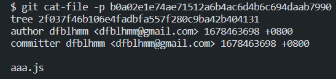

# Git

## 版本控制

### 认识版本控制

- 版本控制（Version Control）

  - 是维护工程蓝图的标准作法，能追踪工程蓝图从诞生一直到定案的过程
  - 也是一种软件工程技巧，借此能在软件开发的过程中确保由不同人所编辑的同一程序文件都得到同步
  - 在软件开发中，版本控制可以帮助程序员进行代码的==追踪==、==维护==、==控制==等一系列操作

  

- 版本控制在程序开发中的功能
  - 不同版本的存储管理
  - 重大版本的备份维护
  - 回退到之前的项目版本
  - 记录项目的历史记录
  - 多人开发的代码合并


### 版本控制的历史

- 没有版本控制的时代
  - 通常通过文件备份的方式来进行管理，再通过 `diff` 命令来对比两个文件的差异
- CVS（Concurrent Versions System）
  - 第一个被大规模使用的版本控制工具，诞生于 1985 年
  - 由荷兰阿姆斯特丹 VU 大学的 Dick Grune 教授实现，也算是 SVN 的前身
- SVN（Subversion）
  - SVN 由 CollabNet 公司于 2000 年资助并发起开发，目的是取代 CVS，并对 CVS 进行了很多的优化
  - SVN 和 CVS 一样，也属于集中式版本控制工具
  - SVN 在早期公司开发中使用率非常高，但是目前已经被 Git 取代
- Git（Linus 的作品）
  - 早期的时候，Linux 社区使用的是 BitKeeper 来进行版本控制
  - 因为一些原因，BitKeeper 想要收回对 Linux 社区的免费授权
  - 于是 Linus 用了大概一周的时间，开发了 Git 用来取代 BitKeeper
  - Linus 完成了 Git 的核心设计，之后将 Git 交由另外一个 Git 的主要贡献者（Junio C Hamano）来维护


### 集中式版本控制

- CVS 和 SVN 都是是属于==集中式版本控制系统==（Centralized Version Control Systems）

  - 它们的主要特点是==单一的集中管理的服务器==，保存所有文件的修订版本
  - 协同开发人员通过客户端，连接到这台服务器取出最新的文件或者提交更新

  

- 集中式版本控制系统的核心问题：==中央服务器不能出现故障==
  - 在服务器宕机的时间内，无法提交更新，无法协同工作
  - 如果中心数据库所在的磁盘发生损坏，又没有做备份，将丢失所有数据


### 分布式版本控制

- Git 属于分布式版本控制系统（Distributed Version Control System）

  - 客户端并不只提取最新版本的文件快照，而是把代码仓库完整的镜像下来，包括完整的历史记录
  - 任何一处协同工作用的服务器发生故障，事后都可以用任何一个镜像出来的本地仓库恢复
  - 每一次的克隆操作，实际上都是一次对代码仓库的完整备份

  


## Git 配置选项

### 配置分类

Git 自带一个 `git config` 的工具来帮助设置控制 Git 外观和行为的配置变量

- `/etc/gitconfig` 文件：包含系统上每一个用户及他们仓库的通用配置

  - 如果在执行 `git config` 时带上 `--system` 选项，那么它就会读写该文件中的配置变量
  - 由于它是系统配置文件，因此需要管理员或超级用户权限来修改它

  ```shell
  git config --system --list
  ```

- `~/.gitconfig` 文件：只针对当前用户

  - 可以传递 `--global` 选项让 Git 读写此文件，这会对当前系统上所有的仓库生效

  ```shell
  git config --global --list
  ```

- `.git/config`：当前仓库的 Git 目录中的 config 文件，只针对该仓库

  - 可以传递 `--local` 选项让 Git 强制读写此文件，默认情况下使用的就是它

  ```shell
  git config --local --list
  ```


### 设置配置

- 设置用户名

  ```shell
  git config --global user.name "myName"
  ```

- 设置邮箱

  ```shell
  git config --global user.email "name@gmail.com"
  ```

- 查看配置

  ```shell
  # 查看所有配置
  git config --global --list
  
  # 查看邮箱
  git config --global --get user.email
  ```

  

### 命令别名

- Git 并不会在输入部分命令时自动推断出你想要的命令

- 如果不想每次都输入完整的 Git 命令，可以通过 git config 文件来为每一个命令设置一个别名

  ```shell
  # 设置查看分支别名
  git config --global alias.br branch
  
  # 使用别名
  git br
  ```


### 设置代理

```shell
# 设置http代理
git config --global http.proxy http://127.0.0.1:10808
git config --global https.proxy https://127.0.0.1:10808

# 设置socks5代理(V2Ray)
git config --global http.proxy 'socks5://127.0.0.1:10808'
git config --global https.proxy 'socks5://127.0.0.1:10808'

# 取消代理
git config --global --unset http.proxy
git config --global --unset https.proxy
```


## Git 获取仓库

- 使用 Git 来管理源代码，那么本地也需要有一个 Git 仓库

- 通常有两种获取 Git 项目仓库的方式

  - ==初始化==一个 Git 仓库，并且可以将当前项目的文件都添加到 Git 仓库中

    - 该命令将创建一个名为 `.git` 的子目录，这个子目录含有初始化的 Git 仓库中所有的必须文件，这些文件是 Git 仓库的核心
    - 这个时候仅仅是做了一个初始化的操作，项目里的文件还没有被跟踪

    ```shell
    git init
    ```

  - 从其它服务器==克隆==一个已存在的 Git 仓库 

    ```shell
    git clone https://github.com/facebook/react.git
    ```

    


## Git 记录文件变化

### 文件的状态

- 文件的状态

  - ==未跟踪==：默认情况下 Git 仓库下的文件也没有添加到 Git 仓库管理中，需要通过 `add` 命令来进行添加
  - ==已跟踪==：添加到 Git 仓库管理的文件处于已跟踪状态，Git 可以对其进行各种跟踪管理

- 已跟踪的文件又可以进行状态划分

  - **Staged**：暂缓区中的文件状态
  - **Unmodified**：已经提交到 Git 仓库的文件
  - **Modified**：修改了某个文件后，会处于 Modified 状态

  


### Git 操作流程图


### 检测文件状态 — git status

- `git status`：查看当前 Git 仓库所有文件的状态

  - Untracked files：未跟踪的文件

    

  - modified：文件被修改

    

- `git status -s`：查看简介的文件状态信息

  


### 添加到暂存区 — git add
- `git add 文件名`：添加文件到暂存区

  - 跟踪新的文件
  - 被跟踪的文件，修改后也需要提交到暂存区

  

- `git add .`：添加所有新增/修改的文件到暂存区中
- `git rm --cached 文件`：将文件从暂存区中移除


### Git 忽略文件

- 有些文件无需纳入 Git 的管理，也不希望总出现在未跟踪文件列表

  - 通常都是些自动生成的文件，比如日志文件，或者编译过程中创建的临时文件
  - 可以创建一个名为 `.gitignore` 的文件，列出要忽略的文件的模式

  ```tex
  /test
  /demo.js
  ```

- 这个文件通常不需要手动创建，必要时添加需要忽略内容即可，有一些现成的[模板](https://github.com/github/gitignore)


### 文件更新提交 — git commit
- `git commit -m "提交信息"`：将暂存区中的文件进行提交

  

- 使用 `git commit -a -m "提交信息"` 可以简化文件的暂存和提交，等同于

  ```shell
  git add .
  git commit -m '提交信息'
  ```

  

### Git 校验和（CommitId）
- Git 中所有的数据在存储前都计算其==校验和（Commit Id）==，然后以校验和来引用
  - Git 中计算校验和的机制叫做 SHA-1 散列
  - 这是一个由 40 位十六进制字符组成的字符串，基于 Git 中文件的内容或目录结构计算出来

- 在进行提交操作时，Git 会保存一个提交对象（commit object）

  

  - 该提交对象会包含一个指向暂存内容快照的指针
  - 还包含了作者的姓名和邮箱、提交时输入的信息以及指向它的父对象的指针
  - 首次提交产生的提交对象没有父对象，普通提交操作产生的提交对象有一个父对象
  - 而由多个分支合并产生的提交对象有多个父对象

- Git 提交对象：存放于本地仓库的 `.git/objects` 中

  - 每个校验和都对应一个 `tree`

    

  - 通过该 `tree` 属性可以查找到当前操作的文件记录

    


### 查看提交历史 — git log

- `git log`：查看历史提交记录

  - 不传入任何参数的情况下，会按时间先后顺序列出所有的提交，最近的更新排在最上面
  - 会列出每个提交的 SHA-1 校验和、作者和邮件地址、提交时间以及提交说明

  

- `git log --pretty=oneline`

  - 按行依次显示历史记录

    

  - `git log --pretty=oneline --graph`：按图结构显示历史记录

    


### 版本回退 — git reset

- `git reset --hard`：进行版本回退，需要先知道目前处于哪一个版本。Git 通过 `HEAD` 指针记录当前版本

  - `HEAD` 是当前分支引用的指针，它总是指向该分支上的==最后一次提交==
  - 可以将它看做该分支上的最后一次提交的快照

  

- 可以通过 HEAD 来改变 Git 目前的版本指向

  - 前一个版本是 `HEAD^`，前前一个版本就是 `HEAD^^`

    ```shell
    git reset --hard HEAD^
    ```

  - 前 n 个版本，可以使用 `HEAD~n`

    ```shell
    git reset --hard HEAD~5
    ```

  - 可以指定某一个 commit id

    ```shell
    git reset --hard b0a02e1e74ae71512a6b4ac6d4b6c694daab7990
    ```


### 暂时保存更改 — git stash

- `git stash`：暂时提取分支上所有的改动并存储，通常用于分支临时切换
- `git stash pop`：恢复暂时保存的内容


## Git 远程仓库和验证

### 认识远程仓库

- 远程仓库（Remote Repository ）

  - 只将代码存放在本地仓库中，意味着只是在进行本地操作
  - 在真实开发中，通常是多人开发的，所以需要将管理的代码共享到远程仓库中

  

- 远程仓库通常是搭建在某一个服务器上的，目前可以使用 Git 服务器的方式

  - 使用第三方的 Git 服务器：比如 GitHub、Gitee、Gitlab 等
  - 自建服务器搭建一个Git 服务


### 远程仓库的验证

- 对于私有的仓库的操作，远程仓库会对操作者进行==身份验证==
- 目前 Git 服务器验证主要有两种方式
  - 基于 ==HTTP 的凭证存储==（Credential Storage）
  - 基于 ==SSH 的密钥==

#### 凭证

- 因为本身 HTTP 协议是==无状态==的连接，所以每一个连接都需要用户名和密码，Git 拥有一个凭证系统来处理这个事情
- 一些 Git Crediential 的选项
  - 默认所有都不缓存。每一次连接都会询问用户名和密码
  - **cache**  模式会将凭证存放在内存中一段时间。 密码不会被存储在磁盘中，并且在 15 分钟后从内存中清除
  - **store**  模式会将凭证用明文的形式存放在磁盘中，并且永不过期
  - 使用的是 Mac， Git 还有一种 “osxkeychain ” 模式，将凭证缓存到系统用户的钥匙串中（加密）
  - 使用的是 Windows ，在 Git 安装时会默认安装一个叫做 "Git Credential Manager for Windows” 的辅助工具来记住凭证


#### SSH 密钥

- **Secure Shell**（SSH ）是一种==加密的网络传输协议==，可在不安全的网络中为网络服务提供安全的传输环境

- SSH 以==非对称加密==实现身份验证

  - 生成一对公钥和私钥，通过生成的密钥进行认证，这样就可以在不输入密码的情况下登录
  - 公钥需要放在远程 Git 服务器中，而对应的私钥需要由用户自行保管

  

- 使用 `ssh-keygen` 可以生成公钥和私钥

  ```shell
  # 使用默认配置
  ssh-keygen
  # 创建时可以指定加密算法和邮箱
  ssh-keygen -t ed25519 -C "xxx@gmail.com"
  ```

  

### 管理远程仓库

- `git remote add <shortname> <url>`：添加远程仓库（让本地仓库与远程仓库建立连接）

  ```shell
  git remote add origin git@github.com:dfblhmm/git-demo.git
  ```

- `git remote -v`：查看远程仓库

  

- `git remote rename <oldName> <newName>`

  ```shell
  git remote rename origin remote
  ```

- `git remote remove <name>`：移除远程仓库链接

  ```shell
  git remote remove origin
  ```


### 远程仓库的交互

- `git clone`：将远程仓库克隆到本地新创建的目录中

  ```shell
  git clone git@github.com:dfblhmm/git-demo.git
  ```

- `git push`：将本地仓库中的代码推送到远程仓库

  - 第一次推送时需要为当前分支设置==远程跟踪分支==

    ```shell
    # 方式一：为当前分支设置远程跟踪分支
    git branch --set-upstream-to=origin/main main
    git push
    
    # 方式二: push 时添加 -u 参数
    git push -u origin main
    ```

  - 将本地新建分支推送的远程仓库

    ```shell
    git push origin dev
    ```

- `git fetch`：从远程仓库下载最新的代码

- `git merge`：获取到代码后默认并没有合并到本地仓库，需要通过 merge 合并

- `git pull`：等同于执行 fetch + merge


### 合并冲突

- 如果多人修改了同一个文件的同一个地方，就会发生冲突。冲突需要手动解决

  

- ==需要先拉取最新的版本，然后修改后再提交==


### 常见开源协议


## Git 标签 tag

### 创建 tag

- 对于重大的版本常常会打上一个==标签==，以表示它的重要性，方便进行版本的查看和回退

  - Git 可以给仓库历史中的某一个提交打上标签
  - 一般打上标签的版本，会作为正式版发布

- Git 支持两种标签：轻量标签和附注标签

  - 轻量标签

    ```shell
    git tag V1.0
    ```

  - 附注标签：通过 `-a` 标记，并且通过 `-m` 添加额外信息

- 默认情况下，`git push` 命令并不会传送标签到远程仓库服务器上，需要显式地指定推送

  - 推送指定标签

    ```shell
    git push origin V1.0.0
    ```

  - 推送本地仓库所有的标签

    ```shell
    git push origin --tags
    ```

- 从仓库中克隆或拉取，也能得到别人提交的标签


### 删除和检出 tag

- `git tag -d <tagName>`：删除本地 tag

  ```shell
  git tag -d V1.0.0
  ```

- `git push origin -d <tagName>`：删除远程 tag

  ```shell
  git push origin -d V1.0.0
  ```

- `git checkout <tagName>`：检出 tag

  ```shell
  git checkout V1.0.0
  ```


## Git 分支 branch

### 认识分支

- Git 的分支，本质上仅仅是==指向提交对象==的==可变指针==

- Git 的默认主分支名字是 master 

  - 分支指针会在每次提交时自动移动

  - 修改 Git 默认主分支名字

    ```shell
    git config --global init.defaultBranch main(自定义分支名)
    ```


### 分支管理

#### 创建和切换分支

- `git branch <branchName>`：创建分支

  ```shell
  git branch develop
  ```

- `git checkout <branchName>`：切换分支

  ```shell
  git checkout develop
  ```

- `git checkout -b <branchName>`：创建并切换分支

  ```shell
  git checkout -b develop
  ```


#### 查看和删除分支

- `git branch`：查看分支

  ```shell
  git branch # 查看当前所有的分支
  git branch -v # 同时查看最后一次提交
  git branch --merged # 查看所有合并到当前分支的分支
  git branch --no-merged # 查看所有没有合并到当前分支的分支
  ```

- `git branch -d <branchName>`：删除分支

  ```shell
  git branch -d feature # 删除分支
  git branch -D feature # 强制删除分支（未合并的分支）
  ```


#### 合并分支

- `git merge <branchName>`：合并目标分支到当前分支

  ```shell
  git merge develop
  ```


### 远程分支管理

远程分支也是一种分支结构，以 `origin/<branch>` 命名

- `git push <remote> <branch>`：推送分支到远程

  ```shell
  git push origin develop
  ```

- `git checkout --track <remote>/<branch>`：跟踪远程分支

  - 当克隆一个仓库时，它通常会自动地创建一个跟踪 **origin/master** 的 **master** 分支
  - 检出的分支不存在，且远程刚好只有一个名字与之匹配的远程分支，Git 就会创建一个跟踪分支

  ```shell
  git checkout --track origin/feature
  git checkout feature
  ```

- `git push origin -d <branch>`：删除远程分支

  ```shell
  git push origin -d feature
  ```

  

### git rebase 用法

- 在 Git 中整合来自不同分支的修改主要有两种方法

  - merge

    

  - rebase

    

- 认识 rebase

  - 在上面的图例中，提取在 C4 中引入的补丁和修改，然后在 C3 的基础上应用一次
  - 在 Git 中，这种操作就叫做 rebase（变基，改变当前分支的 base）
  - 使用 rebase 命令将提交到某一分支上的所有修改都移至另一分支上，就好像“重新播放”一样
  - 通过 rebase 操作，可以使提交记录呈现==线性==结构

- rebase 工作流程

  - 首先找到这两个分支的==最近共同祖先==
  - 对比当前分支相对于该祖先的历次提交，提取相应的修改并存为临时文件
  - 然后将当前分支指向目标基底
  - 最后以此将之前另存为临时文件的修改依序应用

  

  ```shell
  git checkout dev # 切换到dev分支
  git rebase master # 将master分支作为基底进行rebase操作
  git checkout master # 切回master分支
  git merge dev # 合并dev分支
  ```

- rebase 和 merge 比较

  - merge 用于记录 git 的所有历史，会将分支错综复杂的历史全部记录下来
  - rebase 用于简化历史记录，将两个分支的历史简化，整个历史更加简洁

- rebase 有一条黄金法则：==永远不要在主分支上使用 rebase==

  - 如果在==主分支==上使用 rebase 会造成大量的提交历史在主分支中不同
  - 多人开发时，其他人依然在原来的主分支中，对于提交历史来说会有很大的变化

  


### git cherry-pick 

- `git cherry-pick`：有选择的合并其他分支的 commit

  ```shell
  # 合并指定分支最后依次提交
  git cherry-pick <branch>
  
  # 合并某次提交
  git cherry-pick <hash>
  
  # 合并e和f，尖括号内为e和f两次commit对应的hash值
  git cherry-pick <hash of e> <hash of f>
  
  # 合并e到f所有commit，不包含e
  git cherry-pick e..f
  
  # 合并e到f所有commit，包含e
  git cherry-pick e^..f
  ```

  


## Git 提交规范

- `feat`：增加新功能
- `fix`：修复问题/BUG
- `style`：代码风格相关无影响运行结果的
- `perf`：优化/性能提升
- `refactor`：重构
- `revert`：撤销修改
- `test`：测试相关
- `docs`：文档/注释
- `build`：对构建系统或者外部依赖项进行了修改
- `chore`：依赖更新/脚手架配置修改等
- `workflow`：工作流改进
- `ci`：持续集成
- `types`：类型定义文件更改
- `wip`：开发中


## Git 命令速查表

