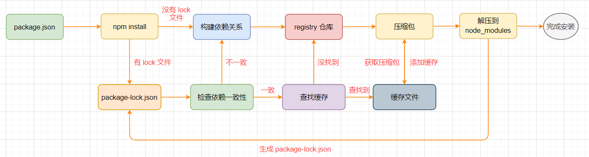
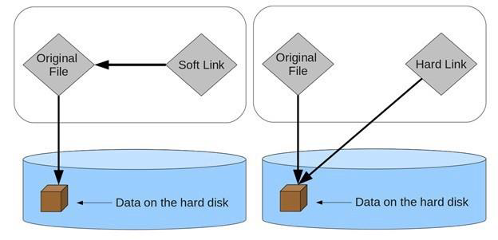
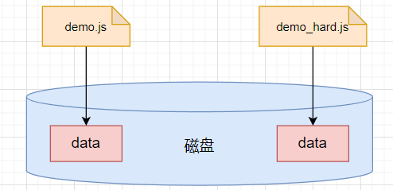
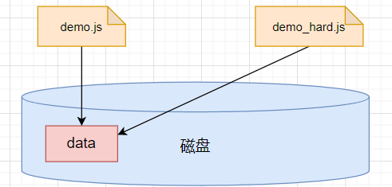
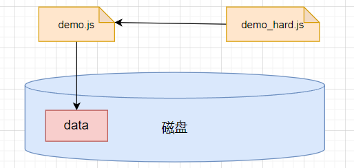
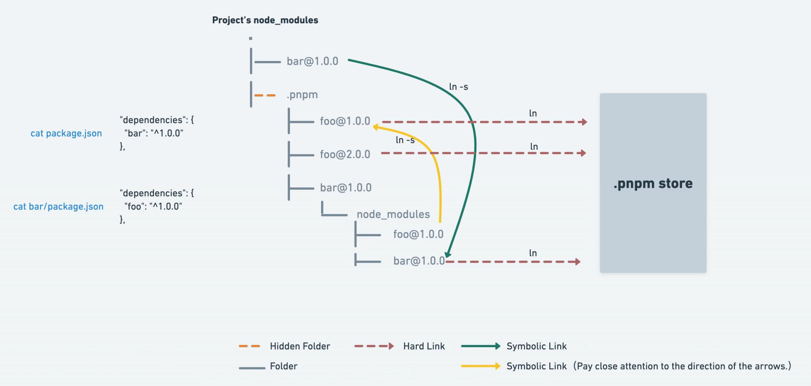

# 前端包管理工具

## 认识包管理工具

- 在项目开发过程中，可能需要依赖一些第三方库，或者想将自己封装好的工具库分享给世界上其他程序员使用
- 在包管理工具出现，需要手动管理需要依赖的库的更新，这种传统的方式非常麻烦，并且容易出错
- 所以需要使用一个专业的工具来管理我们的代码
  - 通过工具将代码发布到特定的位置
  - 其他程序员直接通过工具来安装、升级、删除我们发布的代码


## npm

### 认识 npm

- 包管理工具 `npm`
  - Node Package Manager，即 Node 包管理器，安装 Node.js 时会自动安装
  - 目前已经不仅仅是 Node 包管理器，在前端项目中也在使用它来管理依赖的包
- `npm` 管理的包存放在 **npm registry**（https://registry.npmjs.org）中
  - 发布自己的包其实是发布到 registry 上面
  - 安装一个包时其实是从 registry 上面下载的包


### package.json 文件

#### 认识 package.json

- 每一个项目都会有一个对应的==配置文件==

  - 这个配置文件会记录项目的==名称==、==版本号==、描述等
  - 也会记录所依赖的其他库的信息和版本号

- 生成该配置文件

  ```bash
  # 创建时输入项目信息
  npm init
  # 创建时自动生成项目信息
  npm init -y
  ```


#### 常见属性

- ==必填属性==
  - `name`：项目名称
  - `version`：项目版本号
- 其他描述信息
  - `description`：项目的描述信息
  - `author`：作者相关信息（发布时用到）
  - `license`：开源协议（发布时用到）
  - `private`
    - 记录当前的项目是否是私有的
    - 当值为 ==true== 时，`npm publish` 不能发布该项目，防止私有项目或模块发布出去
  - `main`：程序的==入口==文件
- `scripts`
  - 用于配置一些==脚本==命令，以键值对的形式存在
  - 配置后通过 `npm run [命令名]` 来执行对应命令
  - 对于常用的 **start**、**test**、**stop**、**restart** 可以省略 run
- 依赖相关信息

  - `dependencies`

    - 指定开发环境和生产环境都需要依赖的包
    - 通常开发用到的一些库模块，如 react、react-dom、axios 等

  - `devDependencies`
  
    - 一些包在生产环境不需要依赖，比如 webpack、babel 等
  
  - `peerDependencies`

    - 对等依赖，即依赖的一个包，它必须是以另外一个宿主包为前提的
    - 比如 ant-design 是依赖于 react、react-dom
    - 如果没有安装对应宿主包，则在安装该依赖时会报==警告==
- `engines`
  - 用于指定 Node 和 npm 的版本号
  - 在安装的过程中，会先检查对应的引擎版本，如果不符合就会报错


#### 版本管理规范

- npm 的包通常需要遵从 **semver** 版本规范
  - [semver](https://semver.org/lang/zh-CN/)
  - [npm semver](https://docs.npmjs.com/misc/semver)

- semver 版本规范是 `X.Y.Z`
  - X：主版本号，做了不兼容的 API 修改（可能不兼容之前的版本）
  - Y：次版本号，做了向下兼容的功能性新增（==新功能==增加，但是兼容之前的版本）
  - Z：修订号，做了向下兼容的问题修正（没有新功能，修复了之前版本的 ==bug==）
- 版本号的锁定范围
  - `x.y.z`：一个明确的版本号
  - `^x.y.z`：x 是保持不变的，y 和 z 永远安装最新的版本
  - `~x.y.z`：x 和 y 保持不变， z 永远安装最新的版本


### package-lock.json 文件

**package-lock.json** 文件解析

- `name`：项目的名称
- `version`：项目的版本
- `lockfileVersion`：lock 文件的版本
- `requires`：使用 requires 来跟踪模块的依赖关系
- `packages`：将包位置映射到包含有关该包信息的对象
  - 根项目使用键列出 `""`，所有其他包都使用它们在根项目文件夹中的相对路径列出
  - 当前项目依赖 react，react 依赖 loose-envify，loose-envify 又依赖 js-tokens
  - react 中的属性如下
    - `version`：实际安装的 react 的版本
    - `resolved`：用来记录下载的地址（registry 仓库中的位置）
    - `requires/dependencies`：记录当前模块的依赖
    - `integrity`：用来从缓存中获取索引，再通过索引去获取压缩包文件

```json
{
  "name": "code",
  "version": "1.0.0",
  "lockfileVersion": 3,
  "requires": true,
  "packages": {
    "": {
      "name": "code",
      "version": "1.0.0",
      "license": "ISC",
      "dependencies": {
        "react": "^18.2.0"
      }
    },
    "node_modules/js-tokens": {
      "version": "4.0.0",
      "resolved": "https://registry.npmmirror.com/js-tokens/-/js-tokens-4.0.0.tgz",
      "integrity": "sha512-RdJUflcE3cUzKiMqQgsCu06FPu9UdIJO0beYbPhHN4k6apgJtifcoCtT9bcxOpYBtpD2kCM6Sbzg4CausW/PKQ=="
    },
    "node_modules/loose-envify": {
      "version": "1.4.0",
      "resolved": "https://registry.npmmirror.com/loose-envify/-/loose-envify-1.4.0.tgz",
      "integrity": "sha512-lyuxPGr/Wfhrlem2CL/UcnUc1zcqKAImBDzukY7Y5F/yQiNdko6+fRLevlw1HgMySw7f611UIY408EtxRSoK3Q==",
      "dependencies": {
        "js-tokens": "^3.0.0 || ^4.0.0"
      },
      "bin": {
        "loose-envify": "cli.js"
      }
    },
    "node_modules/react": {
      "version": "18.2.0",
      "resolved": "https://registry.npmmirror.com/react/-/react-18.2.0.tgz",
      "integrity": "sha512-/3IjMdb2L9QbBdWiW5e3P2/npwMBaU9mHCSCUzNln0ZCYbcfTsGbTJrU/kGemdH2IWmB2ioZ+zkxtmq6g09fGQ==",
      "dependencies": {
        "loose-envify": "^1.1.0"
      },
      "engines": {
        "node": ">=0.10.0"
      }
    }
  }
}
```


### npm install

#### 全局安装和局部安装

- 全局安装

  - 通常使用全局安装的包都是一些==工具==包
  - 全部安装的包，会自动加入系统==环境变量==中

  ```bash
  npm install -g pm2 
  ```

- 局部安装：分为==开发==依赖和==生产==依赖

  - 默认安装的是生产依赖

    ```bash
    npm install react
    npm install react-dom -S
    npm install axios --save
    ```

  - 指定为开发依赖的包，在发布后进行安装时，不会安装对应的开发依赖

    ```bash
    npm install webpack
    npm install webpack -D
    npm install @babel/core --save-dev

- 执行 `npm install` 命令：会安装 **package.json** 中所有的依赖


#### 安装流程

从 npm V5 版本开始支持了==缓存策略==




### 常用命令

- 卸载依赖包

  ```bash
  npm uni package
  npm uni package -D
  npm uni package -g
  ```

- 更新某个包

  ```bash
  npm update package
  ```

- 强制重新 build

  ```bash
  npm rebuild
  ```

- 清理缓存

  ```bash
  npm cache verify
  ```


### npx 工具

- `npx` 是 npm 5.2 之后自带的一个命令

  - 常用于执行某个模块的命令
  - 使用 npx 执行命令，会自动去找 `node_modules/.bin` 下的可执行命令

- 使用局部命令的方式

  - 手动查找到可执行命令文件

    ```bash
    ./node_modules/.bin/webpack
    ```

  - 配置成 **scripts** 脚本

    ```bash
    {
    	"scripts": {
    		"build": "webpack"
    	}
    }
    ```

  - 使用 `npx` 自动查找

    ```bash
    npx webpack
    ```

    

### 发布 npm 包

- 命令行登录

  ```bash
  npm login
  ```

- 发布到 **npm registry** 上

  ```bash
  npm publish
  ```

- 更新仓库

  - 修改版本号
  - 重新发布

- 删除发布的包

  ```bash
  npm unpublish
  ```

- 让发布的包过期

  ```bash
  npm deprecate
  ```

  


## yarn

- `yarn` 是由 Facebook、Google、Exponent 和 Tilde 联合推出了一个新的 JS 包管理工具

  - yarn 是为了弥补 早期 npm 的一些缺陷而出现的
  - 比如安装依赖速度很慢、版本依赖混乱等一系列的问题

- 命令对比

  | npm                                     | yarn                          | 描述                       |
  | --------------------------------------- | ----------------------------- | -------------------------- |
  | npm install                             | yarn install                  | 根据 package.json 安装依赖 |
  | npm install [package]                   | yarn ==add== [package]        | 安装一个包                 |
  | npm install [package] [--save/-S]       | yarn add [package]            | 安装一个生产依赖的包       |
  | npm install [package] [--save-dev/-D]   | yarn add [package] [--dev/-D] | 安装一个开发依赖的包       |
  | npm rebuild                             | yarn install --force          | 重新安装                   |
  | npm uninstall [package]                 | yarn ==remove== [package]     | 卸载一个包                 |
  | npm uninstall [package] [--save/-S]     | yarn remove [package]         | 卸载一个生产依赖的包       |
  | npm uninstall [package] [--save-dev/-D] | yarn remove [package]         | 卸载一个开发依赖的包       |
  | npm cache verify                        | yarn cache clean              | 清理缓存                   |
  | rm -rf node_modules && npm install      | yarn upgrade                  | 删除 node_modules 并重装   |

  


## pnpm

- `pnpm`：performant npm

  


### 硬链接和软链接



- 硬链接（hard link）
  - 电脑文件系统中的多个文件平等地共享同一个文件存储单元
  - 删除一个文件名字后，还可以用其它名字继续访问该文件

- 软链接（符号链接 soft link、symbolic link）
  - 软链接是一类特殊的文件（类似快捷方式）
  - 其包含有一条以绝对路径或者相对路径的形式指向其它文件或者目录的==引用==

- 文件的不同操作

  - 文件的拷贝：复制生成一份新的文件数据

    ```bash
    cp demo.js demo_copy.js
    ```

    

  - 文件的硬链接

    ```bash
    ln demo.js demo_hard.js
    ```

    

  - 文件的软链接

    ```bash
    ln -s demo.js demo_soft.js
    ```

    


### 管理依赖方式

- 当使用 npm 或 Yarn 时，多个项目都有一个相同的依赖包，在硬盘上就需要==保存多份==该相同依赖包的副本

- 使用 pnpm 时，依赖包将被存放在一个==统一的位置==

  - 对同一依赖包的相同版本，磁盘上==只有一份==这个依赖包的文件数据
  - 对同一依赖包的不同版本，仅有版本之间==不同的文件==会被存储起来
  - 所有文件都保存在硬盘上的统一的位置
    - 当安装软件包时，其包含的所有文件都会==硬链接==到此位置，而不会占用额外的硬盘空间
    - 在项目之间可以方便地共享相同版本的依赖包

  


- 创建==非扁平的== **node_modules** 目录

  - 当使用 npm 安装依赖包时，所有依赖包都将被==提升==到 node_modules 的根目录下
  - 这样源码可以访问本不属于当前项目所设定的依赖包

  

- 使用 `pnpm store path` 可以获取统一存储依赖的路径
- 使用 `pnpm store prune` 可以从 store 中删除当前==未被引用==的包来释放空间


### 使用方式

- 作为一个包管理工具，可以使用全局安装

  ```bash
  npm i -g pnpm
  ```

- 命令对比

  | npm                     | pnpm                  |
  | ----------------------- | --------------------- |
  | npm install             | pnpm install          |
  | npm install [package]   | pnpm add [package]    |
  | npm uninstall [package] | pnpm remove [package] |
  | npm run [cmd]           | pnpm [cmd]            |

  