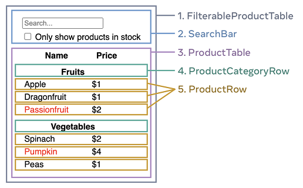
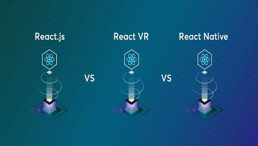

# React 核心

## 认识 React

### React 定义和特点


- ==React== 是用于构建 ==Web== 和原生==交互界面==的 JavaScript 库

- React 由 Facebook 更新和维护，大量流行的其他框架借鉴了 React 的思想

- React 的特点

  - 声明式编程

    

  - 组件化开发

    

  - 跨平台编写

    


### React 的开发依赖

- 开发 React 依赖的三个库
  - `react`：包含 react 所必须的核心代码
  - `react-dom`：react 渲染在不同平台所需要的核心代码
  - `@babel/preset-react`：将 jsx 转译成 React 代码的工具

- `react-dom` 针对 web 端 和 native 端所完成的事情不同
  - web 端：将 jsx 最终渲染成真实的 DOM，显示在浏览器中
  - native 端：将 jsx 最终渲染成原生的控件


## JSX 语法

### 认识 JSX 语法

- JSX 是 一种 JavaScript 的==语法扩展==（Extension）

  ```jsx
  const element = <h1>Hello JSX!</h1>;
  ```

  - 在很多地方也称之为 JavaScript XML ，像是一段 XML 语法
  - 它用于描述UI 界面，并且可以和 JavaScript 融合在一起使用

- React 认为==渲染逻辑==本质上与其他 ==UI 逻辑==存在内在==耦合==

  - UI 需要绑定事件
  - UI 中需要展示数据状态
  - 在某些状态发生改变时，又需要更新 UI

- 渲染逻辑和 UI 逻辑密不可分

  - 因此 React 没有将标记分离到不同的文件中
  - 而是将它们组合到了一起 ，这个地方就是==组件==


### JSX 使用规则

>
>
>只能返回一个根元素

- 如果想要在一个组件中包含多个元素，**需要用一个父标签把它们包裹起来**

  ```jsx
  const element = <div><br/><br/></div>;
  ```

- 如果不想在标签中增加一个额外的 `<div>`，可以用 `<>` 和 `</>` 元素来代替（`Fragment` 的语法糖）

  ```jsx
  const element = <><br/><br/></>;
  const element2 = <Fragment><br/><br/></Fragment>;
  ```

- 编写的元素结构需要换行时，可以使用一个 `()` 将结构包括起来

  ```jsx
  const element = (
    <Fragment>
      <h2>React</h2>
      <p>用于构建 Web 和原生交互界面的库</p>
    </Fragment>
  );
  ```

- 为什么多个 JSX 标签必须要用一个父元素或者 Fragment 来包裹 ？

  - JSX 虽然看起来很像 HTML，但在底层其实被转化为了 JavaScript 对象
  - **不能在一个函数中返回多个对象**，除非用一个数组把他们包装起来
  - 添加一个父标签进行包裹后，这些被包裹的子元素会作为父标签的 `children`，会转化为一个数组


>
>
>标签必须闭合

- JSX 要求标签必须正确闭合

  ```jsx
  const element = <div>Hello JSX</div>;
  ```

- 对于单标签元素，必须添加结束符 `/`

  ```jsx
  const element = <br />;
  ```

- 对于双标签元素，如果不传递 `children`，可以写成一个单标签元素

  ```jsx
  const element = <div title="无子元素" />;
  ```


>
>
>大多数属性使用驼峰命名法

- JSX 最终会被转化为 JavaScript

  - JSX 中的属性也会变成 JavaScript 对象中的键值对
  - 但 JavaScript 对变量的命名有限制，例如不能使用==关键字==和==保留字==
  - 所以==大多数==属性需要采用小驼峰命名法

  ```jsx
  const element = <div>Hello JSX</div>;
  ```

- 由于 `class` 是一个保留字，所以在 React 中需要用 `className` 来代替

  ```jsx
  const element = <div className="info">Hello JSX</div>;
  ```

- 由于历史原因，`aria-*` 和 `data-*` 属性是以带 `-` 符号的 HTML 格式书写的


### JSX 使用语法

- 注释：`{/*标签*/}`

  ```jsx
  const element = (
    <div className="app">
      {/*<span style={{marginLeft: '50px'}}>haha</span>*/}
    </div>
  );
  ```

- 通过大括号 `{}` 可以插入 JavaScript ==表达式==，只能在以下两种场景中使用大括号

  - 用作 JSX 标签内的==元素==

    ```jsx
    const element = <div>{ new Date().toString() }</div>;
    ```

  - 用作紧跟在 `=` 符号后的==属性==

    ```jsx
    const className = 'app';
    const element = (
      <div className={className}>
        Hello JSX
      </div>
    );
    ```

- JSX 嵌入变量作为子元素

  - 当变量是 `Number/String/Array` 类型时，会直接渲染出来（注意数字 `0` 也会被渲染）
  - 当变量是 `null/undefined/Boolean` 类型时，不会进行渲染
  - ==对象类型== 不能作为子元素

- JSX 中的内联样式和对象，需要使用 “双大括号” `{{}}`

  - JSX 中的对象表示

    ```jsx
    const element = <ul style={{ color: 'pink' }}>;
    ```

  - 内联 `style` 属性，需要使用==驼峰命名法==编写

    ```jsx
    const element = <ul style={{ backgroundColor: 'black' }}>;
    ```


### JSX 语法本质

- JSX 仅仅只是 `React.createElement(component, props, ...children)` 函数的语法糖

- 该函数可以传递三个参数

  - `type`：当前 ReactElement 的类型
    - 如果是标签元素，那么就使用字符串表示
    - 如果是组件元素，那么就直接使用组件的名字

  - `props`：传递的 props，以对象的属性和值的形式存储

  - `children`：存放在 标签/组件 中的子元素


- **JSX** 和 **createElement** 的对比

  - 使用 JSX 编写

    ```jsx
    const element = (
      <div className="div">
        <h1 style={{ color: 'red' }}>11</h1>  
        <span id="span">22</span>
      </div>
    );
    ```

  - 使用 `createElement` 编写

    ```jsx
    const element = React.createElement(
      "div",
      { className: "div" },
      React.createElement("h1", { style: { color: 'red' }}, "11"), 
      React.createElement("span", { id: "span" }, "22")
    );
    ```

    


## 描述 UI

### 条件渲染

条件渲染：根据不同的情况显示不同的内容

- 条件判断语句 `if/else`

  ```jsx
  function Demo({ number }) {
    if (number % 2 === 0) {
      return <h1>偶数</h1>;
    } else {
      return <h1>奇数</h1>;
    }
  }
  ```

- 三元运算符 `? :`

  ```jsx
  function Demo({ number }) {
    return (
      <h1>{ number % 2 === 0 ? '偶数' : '奇数'  }</h1>
    );
  }
  ```

- 与运算符 `&&`

  - 左侧（我们的条件）为 `true` 时，它则返回其右侧的值

    ```jsx
    function Demo({ completed }) {
      return (
        <div className={ completed ? 'completed' : '' }>
          代办任务
          { completed && <span>已完成</span> }
        </div>
      );
    }
    ```

  - **切勿将数字放在 `&&` 左侧**，因为数字 `0` 也会被渲染，除非强制转换为==布尔类型==（`!!`）

    ```jsx
    function Demo({ number }) {
      return <h1>{ !!number && 'Hello' }</h1>;
    }
    ```

- 在一些情况下，不想有任何东西进行渲染，可以直接返回 `null`


### 列表渲染

列表渲染：操作数组中的数据，从而将一个数据集渲染成多个相似的组件

- 在 React 中，展示列表最多的方式就是使用数组的 `map` 高阶函数

  ```jsx
  const names = ['Amy', 'Jack', 'Mike'];
  const element = (
    <ul>
     	{ names.map(name => <li key={name}>{name}</li>) }
    </ul>
  );
  ```

- 可以使用数组的 `filter` 函数对列表项进行过滤

  ```jsx
  const numbers = [1, 2, 3, 4];
  const oldNumber = (
    <ul>
     	{ 
        numbers.filter(n => n % 2 !== 0).map(n => <li key={n}>{n}</li>) 
      }
    </ul>
  );
  ```

  

>
>
>指定列表项的 key

- 列表渲染时，使用 `key` 保持列表项的顺序
- `key` 的作用
  - 从众多的兄弟元素中==唯一标识==出某一项
  - 即使元素的位置在渲染的过程中发生了改变，它提供的 `key` 值也能让 React 在整个生命周期中一直认得它
- `key` 需要满足的条件
  - key 值不要求全局唯一，但在==兄弟节点==之间必须是唯一的
  - key 值不能改变，即不要在渲染时动态地生成 key，比如 `key={ Math.random() }` 的错误方式

- React 默认会将列表项的==索引==作为 key
  - 数组项的顺序在插入、删除或者重新排序等操作中，会产生一些问题
  - 最佳的设定方式：**来自数据库的数据** 或 **本地产生唯一数据**

- 组件不会把 `key` 当作 props 的一部分


### 事件处理

- 为了响应界面的操作，需要对元素添加事件处理函数

- 在 React 中添加事件处理

  - React 事件的命名采用==小驼峰式==（如 `onClick`）
  - 通过 `{}` 传入一个事件处理函数作为元素的 **prop**，这个函数会在事件发生时被自动执行
  - 处理函数被执行时，默认会将==事件对象==作为参数传递过来

  ```jsx
  const element = <div onClick={e => console.log(e)}>Hello React</div>;
  ```


>
>
>事件传播

- 事件分三个阶段传播
  - 它向下传播，调用所有的 `onClickCapture` 处理函数（捕获阶段）
  - 它执行被点击元素的 `onClick` 处理函数（执行阶段）
  - 它向上传播，调用所有的 `onClick` 处理函数（冒泡阶段）
- 在 React 中所有事件都会传播，除了 `onScroll`，它仅适用于附加到的 JSX 标签


## 组件化开发
