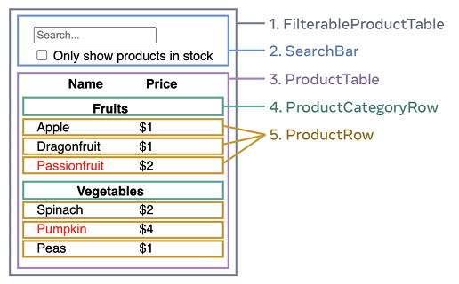
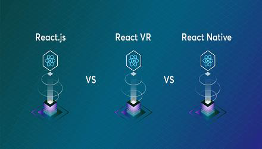
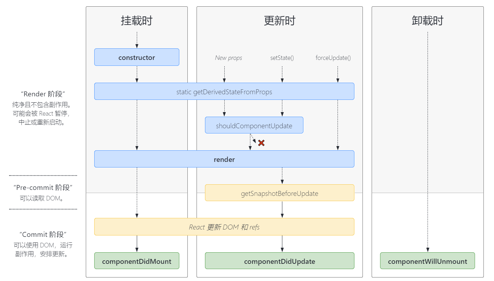

import Tabs from '@theme/Tabs';
import TabItem from '@theme/TabItem';

# React 核心

## 认识 React

### React 定义和特点


- ==React== 是用于构建 ==Web== 和原生==交互界面==的 JavaScript 库

- React 由 Facebook 更新和维护，大量流行的其他框架借鉴了 React 的思想

- React 的特点

  - 声明式编程

    

  - 组件化开发

    

  - 跨平台编写

    


### React 的开发依赖

- 开发 React 依赖的三个库
  - `react`：包含 react 所必须的核心代码
  - `react-dom`：react 渲染在不同平台所需要的核心代码
  - `@babel/preset-react`：将 jsx 转译成 React 代码的工具

- `react-dom` 针对 web 端 和 native 端所完成的事情不同
  - web 端：将 jsx 最终渲染成真实的 DOM，显示在浏览器中
  - native 端：将 jsx 最终渲染成原生的控件


## JSX 语法

### 认识 JSX 语法

- JSX 是 一种 JavaScript 的==语法扩展==（Extension）

  ```jsx
  const element = <h1>Hello JSX!</h1>;
  ```

  - 在很多地方也称之为 JavaScript XML ，像是一段 XML 语法
  - 它用于描述UI 界面，并且可以和 JavaScript 融合在一起使用

- React 认为==渲染逻辑==本质上与其他 ==UI 逻辑==存在内在==耦合==

  - UI 需要绑定事件
  - UI 中需要展示数据状态
  - 在某些状态发生改变时，又需要更新 UI

- 渲染逻辑和 UI 逻辑密不可分

  - 因此 React 没有将标记分离到不同的文件中
  - 而是将它们组合到了一起 ，这个地方就是==组件==


### JSX 使用规则

>
>
>只能返回一个根元素

- 如果想要在一个组件中包含多个元素，**需要用一个父标签把它们包裹起来**

  ```jsx
  const element = <div><br/><br/></div>;
  ```

- 如果不想在标签中增加一个额外的 `<div>`，可以用 `<>` 和 `</>` 元素来代替（`Fragment` 的语法糖）

  ```jsx
  const element = <><br/><br/></>;
  const element2 = <Fragment><br/><br/></Fragment>;
  ```

- 编写的元素结构需要换行时，可以使用一个 `()` 将结构包括起来

  ```jsx
  const element = (
    <Fragment>
      <h2>React</h2>
      <p>用于构建 Web 和原生交互界面的库</p>
    </Fragment>
  );
  ```

- 为什么多个 JSX 标签必须要用一个父元素或者 Fragment 来包裹 ？

  - JSX 虽然看起来很像 HTML，但在底层其实被转化为了 JavaScript 对象
  - **不能在一个函数中返回多个对象**，除非用一个数组把他们包装起来
  - 添加一个父标签进行包裹后，这些被包裹的子元素会作为父标签的 `children`，会转化为一个数组


>
>
>标签必须闭合

- JSX 要求标签必须正确闭合

  ```jsx
  const element = <div>Hello JSX</div>;
  ```

- 对于单标签元素，必须添加结束符 `/`

  ```jsx
  const element = <br />;
  ```

- 对于双标签元素，如果不传递 `children`，可以写成一个单标签元素

  ```jsx
  const element = <div title="无子元素" />;
  ```


>
>
>大多数属性使用驼峰命名法

- JSX 最终会被转化为 JavaScript

  - JSX 中的属性也会变成 JavaScript 对象中的键值对
  - 但 JavaScript 对变量的命名有限制，例如不能使用==关键字==和==保留字==
  - 所以==大多数==属性需要采用小驼峰命名法

  ```jsx
  const element = <div>Hello JSX</div>;
  ```

- 由于 `class` 是一个保留字，所以在 React 中需要用 `className` 来代替

  ```jsx
  const element = <div className="info">Hello JSX</div>;
  ```

- 由于历史原因，`aria-*` 和 `data-*` 属性是以带 `-` 符号的 HTML 格式书写的


### JSX 使用语法

- 注释：`{/*标签*/}`

  ```jsx
  const element = (
    <div className="app">
      {/*<span style={{marginLeft: '50px'}}>haha</span>*/}
    </div>
  );
  ```

- 通过大括号 `{}` 可以插入 JavaScript ==表达式==，只能在以下两种场景中使用大括号

  - 用作 JSX 标签内的==元素==

    ```jsx
    const element = <div>{ new Date().toString() }</div>;
    ```

  - 用作紧跟在 `=` 符号后的==属性==

    ```jsx
    const className = 'app';
    const element = (
      <div className={className}>
        Hello JSX
      </div>
    );
    ```

- JSX 嵌入变量作为子元素

  - 当变量是 `Number/String/Array` 类型时，会直接渲染出来（注意数字 `0` 也会被渲染）
  - 当变量是 `null/undefined/Boolean` 类型时，不会进行渲染
  - ==对象类型== 不能作为子元素

- JSX 中的内联样式和对象，需要使用 “双大括号” `{{}}`

  - JSX 中的对象表示

    ```jsx
    const element = <ul style={{ color: 'pink' }}>;
    ```

  - 内联 `style` 属性，需要使用==驼峰命名法==编写

    ```jsx
    const element = <ul style={{ backgroundColor: 'black' }}>;
    ```


### JSX 语法本质

- JSX 仅仅只是 `React.createElement(component, props, ...children)` 函数的语法糖

- 该函数可以传递三个参数

  - `type`：当前 ReactElement 的类型
    - 如果是标签元素，那么就使用字符串表示
    - 如果是组件元素，那么就直接使用组件的名字

  - `props`：传递的 props，以对象的属性和值的形式存储

  - `children`：存放在 标签/组件 中的子元素


- **JSX** 和 **createElement** 的对比

  - 使用 JSX 编写

    ```jsx
    const element = (
      <div className="div">
        <h1 style={{ color: 'red' }}>11</h1>  
        <span id="span">22</span>
      </div>
    );
    ```

  - 使用 `createElement` 编写

    ```jsx
    const element = React.createElement(
      "div",
      { className: "div" },
      React.createElement("h1", { style: { color: 'red' }}, "11"), 
      React.createElement("span", { id: "span" }, "22")
    );
    ```

    


## 描述 UI

### 条件渲染

条件渲染：根据不同的情况显示不同的内容

- 条件判断语句 `if/else`

  ```jsx
  function Demo({ number }) {
    if (number % 2 === 0) {
      return <h1>偶数</h1>;
    } else {
      return <h1>奇数</h1>;
    }
  }
  ```

- 三元运算符 `? :`

  ```jsx
  function Demo({ number }) {
    return (
      <h1>{ number % 2 === 0 ? '偶数' : '奇数'  }</h1>
    );
  }
  ```

- 与运算符 `&&`

  - 左侧（我们的条件）为 `true` 时，它则返回其右侧的值

    ```jsx
    function Demo({ completed }) {
      return (
        <div className={ completed ? 'completed' : '' }>
          代办任务
          { completed && <span>已完成</span> }
        </div>
      );
    }
    ```

  - **切勿将数字放在 `&&` 左侧**，因为数字 `0` 也会被渲染，除非强制转换为==布尔类型==（`!!`）

    ```jsx
    function Demo({ number }) {
      return <h1>{ !!number && 'Hello' }</h1>;
    }
    ```

- 在一些情况下，不想有任何东西进行渲染，可以直接返回 `null`


### 列表渲染

列表渲染：操作数组中的数据，从而将一个数据集渲染成多个相似的组件

- 在 React 中，展示列表最多的方式就是使用数组的 `map` 高阶函数

  ```jsx
  const names = ['Amy', 'Jack', 'Mike'];
  const element = (
    <ul>
     	{ names.map(name => <li key={name}>{name}</li>) }
    </ul>
  );
  ```

- 可以使用数组的 `filter` 函数对列表项进行过滤

  ```jsx
  const numbers = [1, 2, 3, 4];
  const oldNumber = (
    <ul>
     	{ 
        numbers.filter(n => n % 2 !== 0).map(n => <li key={n}>{n}</li>) 
      }
    </ul>
  );
  ```

  

>
>
>指定列表项的 key

- 列表渲染时，使用 `key` 保持列表项的顺序
- `key` 的作用
  - 从众多的兄弟元素中==唯一标识==出某一项
  - 即使元素的位置在渲染的过程中发生了改变，它提供的 `key` 值也能让 React 在整个生命周期中追踪到它，以便进行==复用==
- `key` 需要满足的条件
  - key 值不要求全局唯一，但在==兄弟节点==之间必须是唯一的
  - key 值不能改变，即不要在渲染时动态地生成 key，比如 `key={ Math.random() }` 的错误方式

- React 默认会将列表项的==索引==作为 key
  - 数组项的顺序在插入、删除或者重新排序等操作中，会产生一些问题
  - 最佳的设定方式：**来自数据库的数据** 或 **本地产生唯一数据**

- 组件不会把 `key` 当作 props 的一部分


### 事件处理

- 为了响应界面的操作，需要对元素添加事件处理函数

- 在 React 中添加事件处理

  - React 事件的命名采用==小驼峰式==（如 `onClick`）
  - 通过 `{}` 传入一个事件处理函数作为元素的 **prop**，这个函数会在事件发生时被自动执行
  - React 中的事件是==合成事件==，生成的事件对象为 `SyntheticEvent` 的实例

  ```jsx
  const element = <div onClick={e => console.log(e)}>Hello React</div>;
  ```

- 处理函数被执行时，默认会将==事件对象==作为参数传递过来

  ```jsx
  const element = (
    <div onClick={() => console.log('div click')}>
      <span onClick={e => e.stopPropagation()}>
        阻止事件向上传播
      </span>
    </div>
  );
  ```

  

>
>
>事件传播

- 事件分三个阶段传播
  - 它向下传播，调用所有的 `onClickCapture` 处理函数（捕获阶段）
  - 它执行被点击元素的 `onClick` 处理函数（执行阶段）
  - 它向上传播，调用所有的 `onClick` 处理函数（冒泡阶段）
- 在 React 中所有事件都会传播，除了 `onScroll`，它仅适用于附加到的 JSX 标签


## 组件化开发

### 定义组件

- ==组件==是 React 的核心概念之一，它们是构建用户界面（UI）的基础
  - 根据组件的定义方式，可以分为==函数组件==和==类组件==
  - 组件必须要像一个==纯函数==那样进行编写
- 不同于 Vue.js，使用组件不需要进行注册操作，引入后直接使用即可


#### 类组件

- 组件的名称必须是==大写字母==开头
- 类组件需要继承自 `Component/PureComponent`
- 必须实现 `render` 函数，可以返回 **React 元素**、**数组**、**Portals**、**字符串**、**数值**、**布尔值**、*null*、*undefined*

```jsx
import React from 'react';
import ReactDOM from 'react-dom/client';

class App extends React.Component {
  render() {
    return <h2>Hello React</h2>;
  }
}

ReactDOM
  .createRoot(document.getElementById('root'))
  .render(<App />);
```


#### 函数组件

- 组件的名称同样必须以==大写字母==开头
- 函数式组件没有==生命周期==和自己的==状态==，需要借助 **Hooks** 来实现对应的功能

```jsx
function App() {
  return <h2>Hello React</h2>;
}
```


### 组件的状态 state

#### 定义和读取状态

- `state` 的作用

  - ==保留== 渲染之间的数据
  - ==触发== React 使用新数据渲染组件（重新渲染）

- *state* 是==隔离且私有==的，如果渲染同一个组件两次，每个副本都会有完全隔离的状态

- 声明和使用状态：通过读取组件实例上的 `state` ==对象==

  ```jsx
  class App extends React.Component {
    state = {
      name: 'Taylor',
      age: 42
    };
    
    render() {
      const { name, age } = this.state;
      return (
        <div>
          <h2>{ name }</h2>
          <h2>{ age }</h2>
        </div>
      );
    }
  }
  ```


#### 更新状态

- React 不推荐直接修改 *state*，这可能会导致一系列的问题

- 更新组件的状态，需要调用组件实例上的 `setState` 方法

  - 调用后，组件上的 `render` 函数会自动重新执行
  - 然后组件会重新渲染，UI 会使用最新的状态数据进行展示

  ```jsx
  /**
   * 计数器
   */
  class App extends React.Component {
    state = {
      count: 0
    };
  
    increment = () => {
      const { count } = this.state;
      this.setState({ count: count + 1 });
    }
  
    render() {
      const { count } = this.state;
      return (
        <>
          <h2>{ count }</h2>
          <button onClick={this.increment}>+1</button>
        </>
      );
    }
  }
  ```

- 想要更新一个==对象类型==的 *state* 时，不能直接修改原有的对象（数组也是如此）

  - 需要创建一个==新对象==
  - 或者生成一个原对象的==拷贝==副本

  ```jsx
  class App extends React.Component {
    state = {
      info: { name: '', age: 10 }
    };
  
    changeInfo = () => {
      const { info } = this.state;
      // 需要创建一个新对象，或者拷贝一份原对象
      this.setState({ info: { ...info, name: 'React' } });
    }
  
    render() {
      const { name, age } = this.state.info;
      return (
        <>
          <h2>姓名：{ count }</h2>
        	<h2>年龄：{ age }</h2>
          <button onClick={this.changeInfo}>+1</button>
        </>
      );
    }
  }
  ```


### 组件的参数 props

#### 认识 props

- React 组件使用 `props` 来互相通信
  - 每个父组件都可以提供 *props* 给它的子组件，从而将一些信息传递给它
  - 相较于 HTML 属性，可以通过 *props* 传递任何 JavaScript 值，包括对象、数组和函数，==甚至是 React 元素==

- `props` 是==只读==的，禁止子组件通过引用直接修改父组件传递的数据


#### 传递 props

- 要传递 props，需要将它们添加到 JSX，就像使用 HTML 属性一样

  ```jsx
  const Img = () => ;
  ```

- 使用 JSX 展开语法传递 props（避免重复的传递操作）

  ```jsx
  const Img = (props) => 
  ```

- 还可以只保留当前组件需要接收的 *props*，并使用展开运算符将==其他 props== 传递下去

  ```jsx
  const Button = (props) => {
    const { kind, ...other } = props;
    const className = kind === "primary" ? "primary-button" : "secondary-button";
    return <button className={className} {...other} />;
  };
  ```

- 当内容嵌套在 JSX 标签中时，组件可以在名为 `children` 的 *prop* 中接收到该内容

  ```jsx
  const Button = ({ children }) => <button>{ children }</button>;
  const Demo = () => <Button>按钮</Button>
  ```

- 在传递 *props* 时，可以直接将 ==React 元素==传递给子组件，子组件可以直接进行渲染（实现类似==插槽==的功能）

  ```jsx
  const Demo = ({ leftSlot, rightSlot }) => {
    <div>
      { leftSlot }
      使用 props 实现插槽
      { rightSlot }
    </div>
  };
  
  const Warpper = () => {
    return (
      <Demo
        leftSlot={<button>按钮</button>}
        rightSlot={<span>文本</span>}
      />
    );
  };
  ```


#### 读取 props

- 对于类组件，可以从 `this.props` 中获取到父组件传递的数据

  ```jsx
  class Header extends React.Component {
    render() {
      const { title, fontSize } = this.props;
      return <h1 style={{ fontSize }}>{ title }</h1>;
    }
  }
  ```

- 对于函数式组件，函数的==第一个参数== 就是接收到的 *props* 对象

  ```jsx
  const Header = ({ title, fontSize }) => <h1 style={{ fontSize }}>{ title }</h1>;
  ```


### 组件之间通信

#### 父传子：props

- 父组件想要给子组件传递数据，直接使用 `props` 传递即可

  ```jsx
  const Button = ({ title }) => <button>{ title }</button>;
  const Demo = () => <Button title="播放" />;
  ```

- 在子组件中，可以对接收的 `props` 进行校验和指定默认值

  - 使用组件的 `propTypes` 属性进行校验

    ```jsx
    import PropTypes from 'prop-types';
    
    const App = () => {};
    App.propTypes = {
      optionalArray: PropTypes.array.isRequired, // 数组类型且必传
      optionalBool: PropTypes.bool,
      optionalFunc: PropTypes.func
    }
    ```

  - 使用组件的 `defaultProps` 属性指定默认值

    ```jsx
    const App = () => {};
    App.defaultProps = {
      dataSource: []
    };
    ```

    

#### 子传父：回调函数

子组件想要给父组件传递数据通过==回调函数==

- 父组件传递一个==回调函数==给子组件
- 在合适的时候，子组件执行这个函数，执行时可以携带一些==数据==传递给父组件

```jsx
const App = ({ play }) => {
  return (
    <button onClick={() => play('播放')}>播放</button>
  );
}
```


#### 数据共享：Context

`Context` 上下文的作用

- 组件能够==无需==通过显式传递参数的方式将信息==逐层传递==
- 在多个子组件中进行==数据共享==


>
>
>创建 Context

- 通过 `React.createContext(defaultValue)` 创建一个上下文对象
  - 该函数接收一个参数：==默认值==
  - 如果不传递默认值，则默认状态为 `null`

- 该 *context* 对象本身不包含任何信息， 它只表示其他组件读取或提供的 那个 *context*
  - `Context.Provider` 可以为被它包裹的组件提供上下文的值
  - `Context.Consumer` 是一个很少会用到的备选方案，它用于读取上下文的值


>
>
>提供上下文数据

- 要想为后代子组件提供数据，需要使用 `<Context.Provider>` 组件

  - 可以使用该组件的 `value` 属性提供数据

  ```jsx
  function App() {
    const [theme, setTheme] = useState('light');
    
    return (
      <ThemeContext.Provider value={theme}>
        <OtherComponent />
      </ThemeContext.Provider>
    );
  }
  ```

- 如果 `value` 的值来自 *state* 和 *props*，当 *value* 的值发生变化时，后代组件会自动==重新渲染==


>
>
>使用上下文数据

- 使用 `<Context.Consumer>` 组件获取数据

  - 该组件的 `children` 为一个函数
  - 函数的第一个参数即为被共享的 `value` 值

  ```jsx
  function Button() {
    return (
      <ThemeContext.Consumer>
        { theme => <button className={theme} /> }
      </ThemeContext.Consumer>
    );
  }
  ```

- 对于类组件，可以使用==静态属性== `contextType`

  - 使用该属性绑定上下文后，组件实例中 `this.context` 即为被共享的 `value` 值

  ```jsx
  class Button extends React.Component {
    static contextType = ThemeContext;
  
    render() {
      const theme = this.context;
      const className = 'button-' + theme;
      return (
        <button className={className}>
          {this.props.children}
        </button>
      );
    }
  }
  ```

- 对于函数式组件，直接使用 `useContext` Hooks 即可

  ```jsx
  function Button() {
    const theme = useContext(ThemeContext);
    
    return <button className={theme} />;
  }
  ```


#### 事件监听：事件总线

- 通过全局事件总线，在一个地方发出事件并携带参数，在其他任意地方监听这个事件并作出响应
- 一些第三方库如 `mitt` 就可以实现类似的功能


### 组件的生命周期



- ==生命周期==是一个 抽象的概念 ，在生命周期的整个过程，分成了很多个阶段
  - ==挂载==阶段：组件第一次在 DOM 树中被渲染的过程
  - ==更新==阶段：组件状态发生变化，重新渲染的过程
  - ==卸载==阶段：组件从 DOM 树中被移除的过程
- 当组件到达某个生命周期时，会对组件内部实现的某些函数进行回调，这些函数就是==生命周期函数==

- 需要注意的时，函数式组件没有上述的生命周期函数，可以借助 **Hooks** 进行模拟
- 常见生命周期的用途
  - `constructor`：初始化组件==状态==和==方法==绑定
  - `render`：返回组成该组件内容的元素
  - `componentDidMount`：可以进行网络请求、获取 DOM、绑定事件监听等
  - `componentWillUnmount`：取消事件监听、定时器等


### React 内置组件

#### Fragment

- 作用：允许在不添加额外节点的情况下将子元素组合，通常使用 `<>...</>` 代替

  ```jsx
  const element = (
    <>
    	<h2>Hello React</h2>
    	<p>用于构建 Web 和原生交互界面的 JavaScript 库</p>
    </>
  )
  ```

- 该组件只接收一个唯一的 *prop* —— `key` 


#### StrictMode

- 作用：一个用来突出显示应用程序中潜在问题的工具

  - 与 *Fragment* 一样，`StrictMode` 不会渲染任何可见的 UI
  - 它为其后代元素触发额外的检查和警告
  - 严格模式检查仅在开发模式下运行，不会影响生产构建

  ```jsx
  import React, { StrictMode } from 'react';
  import ReactDOM from 'react-dom/client';
  import App from './App';
  
  ReactDOM
    .createRoot(document.getElementById('root'))
    .render((
      <StrictMode>
        <App />
      </StrictMode>
    ));
  ```

- 严格模式检查的内容

  - 识别不安全的生命周期
  - 过时的 API
  - 检查意外的副作用 —— 后代组件会被==渲染两次==


#### Suspense

- 作用：允许显示一个退路方案（`fallback`）直到它的子组件完成加载，参数：

  - `children`：实际的 UI 渲染内容
  - `fallback`：一个在实际的 UI 未渲染完成时代替其渲染的备用 UI

  ```jsx
  <Suspense fallback={<Loading />}>
    <SomeComponent />
  </Suspense>
  ```

- 该组件常常用于包裹使用了 ==懒加载== `lazy` 的组件

  - 使用了懒加载的组件，在打包时会被==独立分包==，加快首屏渲染速度

  ```jsx
  const SomeComponent = React.lazy('./someComponent');
  
  function App() {
    return (
      <React.Suspense fallback={<Loading />}>
        <SomeComponent />
      </React.Suspense>
    );
  }
  ```

  

### 其他补充

#### (非) 受控组件

>
>
>受控组件

- 在 HTML 中，表单元素通常自己维护 *state*，并根据用户输入进行更新

- 在 React 中，==可变状态==通常保存在组件的状态中，并且只能通过使用 `setState()` 来更新

  - 将两者结合起来，使 React 的 state 成为==“唯一数据源”==
  - 渲染表单的 React 组件还控制着用户输入过程中表单发生的操作
  - 被 React 以这种方式控制取值的表单输入元素就叫做 ==“受控组件"==（即表单的值由 React 状态进行控制）

- 当表单元素绑定 React 状态后，变为受控组件

  - 此时表单元素不可以再次手动输入编辑
  - 通常需要监听受控元素的 `onChange` 事件来更新状态

  ```jsx
  export default class Test extends React.Component {
    state = {
      input: ''
    }
  
    changeInput = (e) => {
      this.setState({ input: e.target.value });
    }
  
    render() {
      return <input value={this.state.input} onChange={this.changeInput} />
    }
  }
  ```

- 如果绑定了状态，输入仍可编辑，可能是意外地绑定了 `undefined/null`

  ```jsx
  const element = <input type="checkbox" checked={undefined} />;
  ```


>
>
>非受控组件

- 非受控组件：数据将交由 DOM 节点来处理，需要获取数据时，通过绑定 `ref` 来访问 DOM
- 在非受控组件中通常使用 `defaultValue` 来设置默认值

```jsx
export default class Test extends React.Component {
 constructor(props) {
   super(props);
   this.inputRef = React.createRef(); 
 }

  handleInputChange = () => {
    console.log('value', this.inputRef.current.value);
  }

  render() {
    return (
      <input 
        ref={this.inputRef}
        defaultValue="Hello React"
        onChange={this.handleInputChange}
      />
    );
  }
}
```


#### 记忆值：Ref

- 作用：希望组件“记住”某些信息，但又不想让这些信息触发新的渲染

>
>
>获取原生 DOM

- 在 React 的开发模式中，通常情况下不需要、也不建议直接操作 DOM 元素，需要给 DOM 绑定 `ref` 属性来获取

- 对于类组件，绑定 DOM 元素主要有两种方式

  - 传入一个 `Ref` 对象

    - 该对象通过 `React.createRef` 创建出来
    - 通过该对象的 `current` 属性即可访问绑定的 DOM 元素

    ```jsx
    class Demo extends React.Component {
      constructor(props) {
        super(props);
        this.inputRef = React.createRef();
      }
    
      componentDidMount() {
        // 输入框自动聚焦
        this.inputRef.current.focus();
      }
    
      render() {
        return <input type="text" ref={this.inputRef} />;
      }
    }
    ```

  - 传入一个==回调函数==

    - 该函数会在 DOM 被挂载时进行回调，这个回调函数会传入一个元素对象
    - ==陷阱==：如果 `ref` 回调函数是以内联函数的方式定义的（相当于每次更新都创建了一个==新==的函数对象），在==更新==过程中它会被执行==两次==，第一次传入参数 `null`，然后第二次会传入参数 DOM 元素
    - ==解决办法==：将该获取 *ref* 的函数挂载在组件实例上，不要每次都创建一个新的函数对象

    ```jsx
    export default class Demo extends React.Component {
      componentDidMount() {
        // 输入框自动聚焦
        this.inputRef.focus();
      }
    
      getRef = (ref) => {
        this.inputRef = ref;
      }
    
      render() {
        return <input type="text" ref={this.getRef} />;
      }
    }
    ```

- 对于函数式组件，如果要获取函数组件内部的 DOM，需要借助 `React.forwardRef` 高阶函数

  ```jsx
  const Input = React.forwardRef((props, ref) => {
    return <input type="text" ref={ref} />;
  });
  
  export default class Demo extends React.Component {
    componentDidMount() {
      // 输入框自动聚焦
      this.inputRef.focus();
    }
  
    getRef = (ref) => {
      this.inputRef = ref;
    }
  
    render() {
      return <Input ref={this.getRef} />;
    }
  }
  ```


>
>
>获取组件实例

- 对于类组件，直接给组件绑定 `ref` 属性，即可获取到组件实例

  ```jsx
  class Counter extends React.Component {
    state = {
      count: 0
    }
  
    increment = () => {
      this.setState({ count: this.state.count + 1 });
    }
  
    render() {
      return <h2>{this.state.count}</h2>;
    }
  }
  
  export default class Demo extends React.Component {
    getRef = (ref) => {
      this.counterRef = ref;
    }
  
    add = () => {
      // 让子组件中的计数器 +1
      this.counterRef.increment();
    }
  
    render() {
      return (
        <>
          <Counter ref={this.getRef} />
          <button onClick={this.add}>+1</button>
        </>
      )
    }
  }
  ```

- 对于函数式组件，不存在组件实例，需要借助 `React.forwardRef` 和 `useImperativeHandle` 结合


#### 改变节点位置：Portals

- `createPortal` 允许将 JSX 作为 `children` 渲染至 DOM 的不同部分，参数：

  - `children`：需要渲染的 React 元素
  - `domNode`：目标 DOM 节点，会作为子元素转移到目标 DOM 节点的内部

  ```jsx
  import { createPortal } from 'react-dom';
  
  export default function MyComponent() {
    return (
      <div style={{ border: '2px solid black' }}>
        <p>这个子节点被放置在父节点 div 中。</p>
        {createPortal(
          <p>这个子节点被放置在 document body 中。</p>,
          document.body
        )}
      </div>
    );
  }
  ```

- ==注意点==：*portal* 中的事件传播==遵循 React 树==，而不是 DOM 树

  ```jsx
  import { createPortal } from 'react-dom';
  
  export default function MyComponent() {
    useEffect(() => {
      const bodyClick = () => console.log('body 事件监听');
  
      document.body.addEventListener('click', bodyClick);
  
      return () => {
        document.body.removeEventListener('click', bodyClick);
      }
    }, []);
  
    const handleClick = (e) => {
      e.stopPropagation();
      console.log('这个事件监听会被触发，并且阻止冒泡是无法生效的');
    }
  
    return (
      <div onClick={handleClick}>
        <p>这个子节点被放置在父节点 div 中。</p>
        { createPortal(<div>事件监听</div>, document.body) }
        {/**
         * 要想 handleClick 不触发，需要手动阻止 portal 元素的冒泡
         * 但是无法阻止冒泡到 body 上
         * 如果需要阻止，需要在 body 事件监听中通过event.target 对该元素的点击进行过滤判断
         **/}
        {/* { createPortal(<div onClick={e => e.stopPropagation()}>事件监听</div>, document.body) } */}
      </div>
    );
  }
  ```

  

#### 高阶组件

- 高阶组件（Higher-Order Components，简称为 HOC）是==参数为组件，返回值为新组件的**函数**==
  - 高阶组件本身不是一个组件，而是一个函数
  - 主要作用：对组件进行==劫持==和==增强==
  - 主要用于类组件，**Hooks** 出现后，通过==自定义 Hook== 基本可以实现类似高阶组件的功能

- 实际应用

  - `props` 增强（比如 React-Router V6 后，类组件无法使用 `navigate` 方法）

    ```jsx
    import React, { PureComponent, ReactElement } from 'react';
    import { useNavigate } from 'react-router-dom';
    
    // 高阶组件
    function withRouter(WrapperComponent) {
      return (props) => {
        const navigate = useNavigate();
    
        return <WrapperComponent {...props} navigate={navigate} />;
      };
    }
    
    class App extends PureComponent {
      handleClick = () => {
        // 经过高阶组件增强后，类组件实现了跳转路由的功能
        this.props.navigate('/demo');
      }
    
      render() {
        return <button onClick={this.handleClick}>跳转</button>;
      }
    }
    
    export default withRouter(App);
    ```

  - 自定义 *react-redux* 的 `connect` 函数

    ```jsx
    import React, { PureComponent } from 'react';
    import store from './redux-store';
    
    export default function connect(mapStateToProps, mapDispatchToProps) {
      return function handleMapCpn(WrapperComponent) {
        return class extends PureComponent {
        	super(props, context) {
           	this.state = {
              storeState: mapStateToProps(store.getState())
            } 
          }
    
          componentDidMount() {
            this.unSubscribe = store.subscribe(() => {
              this.setState({
                storeState: mapDispatchToProps(store.getState())
              })
            })
          }
          
          componentWillUnmount() {
            this.unSubscribe();
          }
          
          render() {
            return (
              <WrapperComponent
                {...this.props}
                {...mapStateToProps(store.getState())}
                {...mapDispatchToProps(store.dispatch)}
              />
            )
          }
        }
      }
    }
    ```

    

#### 性能优化

>
>
>类组件

- ==默认情况==下，只要==父组件重新渲染==或者当前组件调用了==更新状态==（即使状态并未改变）的方法

  - 此时组件就会重新渲染，同时当前组件的所有子组件都会重新渲染
  - 这会造成无意义的 **diff 比较**和**更新 DOM**

  ```jsx
  export default class Counter extends React.Component {
    state = {
      count: 0
    }
  
    increment = () => {
      // 状态并未改变，也进行了重新渲染
      this.setState({ count: this.state.count });
    }
  
    render() {
      console.log('render');
  
      return (
        <>
          <h2>{this.state.count}</h2>
          <button onClick={this.increment}>更新</button>
        </>
      );
    }
  }
  ```

- 可以借助 `shouldComponentUpdate` 钩子函数控制类组件是否重新渲染

  - 返回 `false`：跳过更新
  - 不返回或返回 `true`：进行更新

  ```jsx
  /* ...... */
  shouldComponentUpdate(nextProps, nextState) {
    if (nextState.count === this.state.count) {
      return false;
    }
  }
  ```

- 同时，React 内部已经内置了 `PureComponent` 组件

  - 直接继承即可实现对应的自动比较更新
  - 该组件内部实现的是==浅比较== `shallowEqual`

  ```jsx
  export default class Counter extends React.PureComponent {}
  ```


>
>
>函数式组件

- 对于函数式组件，直接使用 `memo` 高阶函数即可实现 `props` 的浅比较

  ```jsx
  const App = memo(({ title }) => {
    return <h2>{title}</h2>;
  });
  ```

  

#### 错误边界

- 错误边界是一种 React 组件，需要结合 `getDerivedStateFromError` 和 `componentDidCatch` 一起使用

  - 这种组件可以捕获发生在其==子组件树任何位置==的 JavaScript 错误，并打印这些错误
  - 同时展示==降级 UI==
  - **自 React 16 起，任何未被错误边界捕获的错误将会导致整个 React 组件树被卸载**

  ```jsx
  class ErrorBoundary extends React.Component {
    constructor(props) {
      super(props);
      this.state = { hasError: false };
    }
  
    static getDerivedStateFromError(error) {
      // 更新 state 使下一次渲染能够显示降级后的 UI
      return { hasError: true };
    }
  
    componentDidCatch(error, errorInfo) {
      // 你同样可以将错误日志上报给服务器
      logErrorToMyService(error, errorInfo);
    }
  
    render() {
      if (this.state.hasError) {
        // 你可以自定义降级后的 UI 并渲染
        return <h1>Something went wrong.</h1>;
      }
  
      return this.props.children;
    }
  }
  ```

- 错误边界可以捕获发生在整个子组件树的渲染期间、生命周期方法以及构造函数中的错误

  - 无法捕获事件处理、异步代码、服务端渲染、它自己抛出的错误
  - 函数组件要想实现错误边界组件，需要自己实现类似的功能，或者使用 `react-error-boundary`


## React 过渡动画

- 借助 `react-transition-group` 可以为 React 组件在切换时添加一些过渡动画，提供更好的交互
- 该库主要包含四个组件
  - `Transition`：该组件是一个和平台无关的组件，在前端开发中，比较常用的是 *CSSTransition*
  - `CSSTransition`：添加过渡动画效果
  - `SwitchTransition`：用于两个组件显示和隐藏切换
  - `TransitionGroup`：将多个动画组件包裹在其中，一般用于列表中元素的动画


### CSSTransition

- `CSSTransition` 用于执行组件显示/隐藏切换的动画
  - 动画执行过程中，有三个状态：`appear`、`enter`、`exit`
  - 属性 `classNames` 指定类名==前缀==
  - 属性 `timeout` 指定动画时间，最好与 css 样式中的时间保持一致
  - 属性 `appear` 指定是否在初次进入添加动画
  
- 需要指定 `in` 属性来触发==进入==或==退出==状态

  - 如果添加 `unmountOnExit={true}`，组件会在执行退出动画结束后被移除掉
  - 当 *in* 为 `true` 时触发进入状态
    - 会添加 `-enter`、`-enter-acitve` 的类名开始执行动画
    - 当动画执行结束后，会移除两个这两个类名，并且添加 `enter-done` 的类名
  - 当 *in* 为 `false` 时触发退出状态
    - 会添加 `-exit`、`-exit-active` 的类名开始执行动画
    - 当动画执行结束后，会移除这两个类名，并且添加 `-exit-done` 的类名

<div style={{ marginLeft: 32, marginTop: -20 }}>
  <Tabs>
  <TabItem value="App.jsx" label="App.jsx">

```jsx
import React, { PureComponent } from 'react';
import { CSSTransition } from 'react-transition-group';
import './App.css';

export default class App extends PureComponent {
  state = {
    show: true
  }

  toggleShow = () => {
    this.setState({
      show: !this.state.show
    });
  }

  render() {
    const { show } = this.state;

    return (
      <div>
        <button onClick={this.toggleShow}>切换显示</button>

        <CSSTransition 
          in={show}
          timeout={2000}
          unmountOnExit
          classNames="react"
          >
          <h2>Hello React</h2>
        </CSSTransition>
      </div>
    );
  }
}
```

  </TabItem>

  <TabItem value="App.css" label="App.css">


```css
/* 首次进入 */
.react-appear {
  transform: translate(-200px);
}
.react-appear-active {
  transform: translate(0);
  transition: transform 2s ease;
}

/* 进入动画 */
.react-enter {
  opacity: 0;
}
.react-enter-active {
  opacity: 1;
  transition: opacity 2s ease;
}

/* 离开动画 */
.react-exit {
  opacity: 1;
}
.react-exit-active {
  opacity: 0;
  transition: opacity 2s ease;
}
```

  </TabItem>
  </Tabs>
</div>


### SwitchTransition

- `SwitchTransition` 可以完成两个组件之间切换的炫酷动画

- *SwitchTransition* 中主要有一个属性 `mode`
  - `in-out`：新组件先进入，旧组件再移除
  - `out-in`：旧组件先移除，新组件再进入
- *SwitchTransition* 仍然需要借助 `CSSTransition` 来设置动画
  - 此时不再借助 `in` 属性，而是通过 `key` 属性来进行切换组件

<div style={{ marginLeft: 12, marginTop: -10 }}>
  <Tabs>
  <TabItem value="App.jsx" label="App.jsx">

```jsx
import React, { PureComponent } from 'react';
import { CSSTransition, SwitchTransition } from 'react-transition-group';
import './App.css';

export default class App extends PureComponent {
  state = {
    toggle: true
  }

  toggleShow = () => {
    this.setState({
      toggle: !this.state.toggle
    });
  }

  render() {
    const { toggle } = this.state;

    return (
      <div>
        <button onClick={this.toggleShow}>切换显示</button>

        <SwitchTransition>
          <CSSTransition 
            key={toggle ? 'React' : 'Vue'}
            timeout={2000}
            unmountOnExit
            appear
            classNames="toggle"
          >
            <h2>{ toggle ? 'Hello React' : 'Hello Vue' }</h2>
          </CSSTransition>
        </SwitchTransition>
      </div>
    );
  }
}
```

  </TabItem>

  <TabItem value="App.css" label="App.css">


```css
/* 首次进入 */
.toggle-appear {
  transform: translate(-200px);
}
.toggle-appear-active {
  transform: translate(0);
  transition: transform 2s ease;
}

/* 进入动画 */
.toggle-enter {
  opacity: 0;
}
.toggle-enter-active {
  opacity: 1;
  transition: opacity 2s ease;
}

/* 离开动画 */
.toggle-exit {
  opacity: 1;
}
.toggle-exit-active {
  opacity: 0;
  transition: opacity 2s ease;
}
```

  </TabItem>
  </Tabs>
</div>


### TransitionGroup

- `TransitionGroup` 用于对一组数据的变化添加动画
  - 需要将这些 *CSSTransition* 放入到一个 *TransitionGroup* 中来完成动画

<div style={{ marginLeft: 12, marginTop: -10 }}>
  <Tabs>
  <TabItem value="App.jsx" label="App.jsx">


```jsx
export default class App extends PureComponent {
  state = {
    list: [0, 1, 2, 3]
  }

  update = () => {
    const { list } = this.state;
    this.setState({ list: [list.length, ...list] });
  }

  render() {
    const { list } = this.state;

    return (
      <div>
        <TransitionGroup>
          {
            list.map(i => (
              <CSSTransition
                key={i}
                timeout={2000}
                appear
                classNames="group"
              >
                <span className="item">{i}</span>
              </CSSTransition>
            ))
          }
        </TransitionGroup>

        <div>
          <button onClick={this.update}>更新</button>
        </div>
      </div>
    )
  }
}
```

  </TabItem>

  <TabItem value="App.css" label="App.css">


```css
/* 首次进入/进入动画 */
.group-appear, .group-enter {
  transform: translateY(-200px);
}
.group-appear-active, .group-enter-active {
  transform: translateY(0);
  transition: transform 2s ease;
}

.item {
  display: inline-block;
  padding: 10px 20px;
  background: skyblue;
  margin: 10px;
}
```

  </TabItem>
  </Tabs>
</div>


## React 样式方案

### 全局样式


### 模块化样式


### CSS In JS
