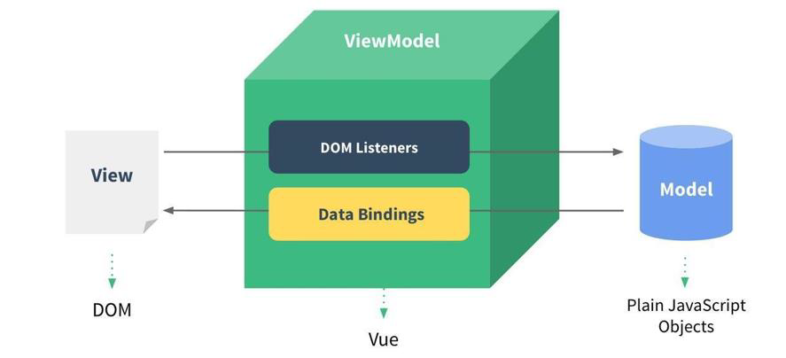
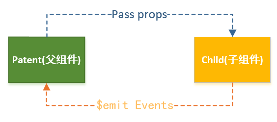
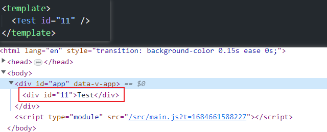
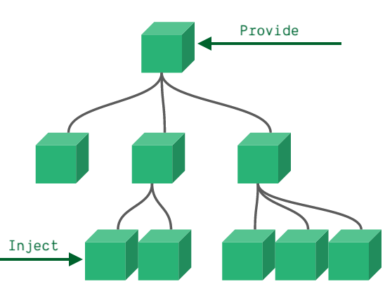

# Vue

## 认识 Vue

### Vue 定义

- Vue 是一套用于==构建用户界面==的==渐进式 JavaScript 框架==

  - 全称是 Vue.js 或 Vuejs
  - 它基于标准 HTML、CSS 和 JavaScript 构建，并提供了一套声明式的、组件化的编程模型
  - 帮助开发者高效地开发用户界面，无论任务是简单还是复杂


- 核心概念：==数据驱动视图==


### 声明式编程

- 原生开发和 Vue 开发的模式是完全不同的，属于==命令式编程== 和 ==声明式编程== 两种不同的开发模式
  - 命令式编程关注的是 **"how to do"**，自己完成整个 how 的过程
  - 声明式编程关注的是 **”what to do"**，由框架完成 how 的过程
- 在原生的实现过程中，操作过程
  - 每完成一个操作，都需要通过 JavaScript 编写一些代码，来给浏览器一个指令
  - 这种编写代码的过程，称之为命令式编程
  - 在早期的原生 JavaScript 和 jQuery 开发的过程中，都是通过这种命令式的方式
- 在 Vue 的实现过程中，操作过程
  - 在 createApp 传入的对象中声明需要的内容，模板（template）、数据（data）、方法（methods）
  - 这种编写代码的过程，称之为声明式编程
  - 目前 Vue、React、Angular、小程序的编程模式，都是属于声明式编程


### MVVM 模型
- MVC 和 MVVM 都是一种软件的体系结构

  - MVC（Model View Controller），是在前期被使用非常框架的架构模式，比如 iOS、前端
  - MVVM（Model View ViewModel），是目前非常流行的架构模式

- Vue 官方说明：Vue 虽然并没有完全遵守 MVVM 的模型，但是整个设计是受到它的启发

  


## 模板语法

### Mustache 语法
- 将数据插入到模板中，使用的是 **“Mustache”** 语法 (即双大括号 `{{}}`)

- 可以使用 **data** 中的数据，也可以使用 JavaScript ==表达式==

  ```html
  <div id="root">
    <!-- 基本插值语法 -->
    <div>{{ message }}</div>
    <!-- 插入一个表达式 -->
    <div>{{ Math.pow(count, 2) }}</div>
    <!-- 调用methods方法 -->
    <div>{{ reverse() }}</div>
  </div>
  
  <script>
    const App = {
      data() {
        return {
          message: 'Hello Vue!',
          count: 10
        }
      },
      methods: {
        reverse() {
          return this.message.split(' ').reverse().join(' ');
        }
      }
    };
  
    Vue.createApp(App).mount('#root');
  </script>
  ```


### v-bind 属性绑定

`v-bind` 用于动态绑定 **attribute**，也可以是组件的 **prop**

#### 绑定基本属性

- 绑定语法：`v-bind:属性名 = "属性值"`

  - 缩写：`:属性名 = "属性值"`

  ```vue
  <!-- 完整写法, id来自动态数据 -->
  <h2 v-bind:id="id">111</h2>
  <!-- 语法糖 -->
  <h3 :title="'h2'">222</h3>
  ```

- 动态绑定属性：==属性名==是动态确定的

  ```vue
  <!-- key的值来自动态的数据 -->
  <h2 :[key]="222">2222</h2>
  ```

- 动态绑定指定对象的所有属性：`v-bind = "obj"`

  ```vue
  <div v-bind="{ id: 'aa', title: 'div' }">3333</div>
  ```

  

#### 绑定 class

- 对象语法：`{ 类名: 布尔值 }`；为 **true** 则添加该类名，为 **false** 则移除该类名

  ```vue
  <div class="static" :class="{ active: true, show: false }">111</div>
  ```

- 数组语法

  ```vue
  <div :class="['active', { show: true }]">222</div>
  ```

  

#### 绑定 style

- 对象语法

  - CSS 属性名可以是==驼峰标识==，也可以使用 `-` 连接（属性名需要加 `""`）
  - 属性值不是变量时要使用字符串表示，否则会解析为变量

  ```vue
  <div :style="{ fontSize: '30px', 'background-color': 'orange' }">Style</div>
  ```

- 数组语法

  ```vue
  <div :style="[{ fontSize: '30px' }, { 'background-color': 'orange' }]">Style</div>
  ```

  


### v-on 事件绑定

`v-on` 用于为元素绑定事件监听

#### 绑定语法

- 语法：`v-on:事件名 = "methods处理函数"`

  - 简写：`@事件名 = "methods处理函数"`

  ```vue
  <h2>{{ count }}</h2>
  <button v-on:click="add">+1</button>
  <button @click="sub">-1</button>
  ```

- 绑定多个事件

  ```vue
  <div @click="add" @mouseout="sub">+1</button>
  <div v-on="{ click: add, mouseout: sub }">+1</button>
  ```

  

#### 参数传递

- 如果方法不需要额外参数，方法后可以不添加 `()`

  ```vue
  <button v-on:click="add">+1</button>
  ```

- 如果需要显式地获取浏览器封装的==事件对象 Event==，可以使用 `$event` 进行访问

  ```vue
  <div @click="handleClick($event, 11)">333</div>
  ```

  

#### 事件修饰符

- 事件修饰符修饰符相当于对事件进行了一些特殊的处理

- 常用修饰符

  - `.stop`：自动调用 event.stopPropagation
  - `.prevent`：自动调用 event.preventDefault
  - `.{keyAlias}`： 仅当事件是从特定键触发时才触发回调

  ```vue
  <div>
    <!-- 自动阻止冒泡 -->
    <button @click.stop="add">+1</button>
    <!-- 表单输入时按下回车键触发 -->
    <input @keyup.enter="add">
  </div>
  ```


### 条件渲染

- 某些情况下，需要根据当前的条件决定某些元素或组件是否渲染

- 条件渲染相关的指令

  - `v-if`
  - `v-else`
  - `v-else-if`
  - `v-show`

  ```vue
  <h2 v-if="score > 90">A</h2>
  <h2 v-else-if="score > 80">B</h2>
  <h2 v-else-if="score > 60">C</h2>
  <h2 v-else>D</h2>
  ```

- **v-if** 和 **v-show** 区别

  - `v-if` 为 false 时，DOM 元素都不会被渲染
  - `v-show` 为 false 时，只是设置了 `display: none`，DOM 元素还是会被渲染
  - 如果需要在显示和隐藏之间频繁的切换，使用 **v-show**，只判断一次选择 **v-if**


### v-for 列表渲染

- 基本格式：`v-for = "item in 数据"`

  - 也可以使用 `of` 代替 `in`，实际效果一样

- `v-for` 支持的数据类型

  - 对象

    ```vue
    <div v-for="(value, key, index) in { name: 'Arril', age: 18 }">
      {{ key }} - {{ value }}
    </div>
    ```

  - 可迭代对象

    ```vue
    <ul>
      <li v-for="item in ['a', 'b', 'c']">{{ item }}</li>
    </ul>
    ```

- 使用 **v-for** 进行列表渲染时，官方建议给元素或者组件绑定一个 `key` 属性

  - **key** 属性主要用于 Vue 的 ==虚拟 DOM  的 diff 算法== ，在新旧 nodes 对比时辨识 ==VNodes==（虚拟节点）
  - 如果不使用 key，Vue 会使用一种最大限度减少动态元素、并且尽可能复用相同类型元素的算法
  - 而使用 key 时，会基于 key 的变化重新排列元素顺序，并且会销毁 key 不存在的元素


### v-model 双向绑定

#### v-model 作用

- 在前端处理表单时，常常需要将表单输入框的内容同步给 JavaScript 中相应的变量

  ```vue
  <!-- v-model实现原理 -->
  <input
    :value="text"
    @input="event => text = event.target.value">
  ```

- `v-model` 指令简化了这一步骤

  ```vue
  <input v-model="text">
  ```


#### v-model 绑定表单

- 文本 `input`

  ```vue
  <p>Message is: {{ message }}</p>
  <input v-model="message" placeholder="edit me" />
  ```

- 多行文本 `textarea`

  ```vue
  <span>Multiline message is:</span>
  <p style="white-space: pre-line;">{{ message }}</p>
  <textarea v-model="message" placeholder="add multiple lines"></textarea>
  ```

- 复选框 `checkbox`

  - 单一复选框

    ```vue
    <input type="checkbox" id="checkbox" v-model="checked" />
    <label for="checkbox">{{ checked }}</label>
    ```

  - 多选复选框

    ```vue
    <template>
      <div>Checked names: {{ checkedNames }}</div>
    
      <input type="checkbox" id="jack" value="Jack" v-model="checkedNames">
      <label for="jack">Jack</label>
    
      <input type="checkbox" id="john" value="John" v-model="checkedNames">
      <label for="john">John</label>
    
      <input type="checkbox" id="mike" value="Mike" v-model="checkedNames">
      <label for="mike">Mike</label>
    </template>
    
    <script>
      export default {
        data() {
          return {
            checkedNames: []
          }
        }
      }
    </script>
    ```

- 单选按钮 `radio`

  ```vue
  <div>Picked: {{ picked }}</div>
  
  <input type="radio" id="one" value="One" v-model="picked" />
  <label for="one">One</label>
  
  <input type="radio" id="two" value="Two" v-model="picked" />
  <label for="two">Two</label>
  ```

- 选择器 `select`

  ```vue
  <div>Selected: {{ selected }}</div>
  
  <select v-model="selected">
    <option disabled value="">Please select one</option>
    <option>A</option>
    <option>B</option>
    <option>C</option>
  </select>
  ```


#### 修饰符

- `.lazy`：将触发事件修改为 **change** 事件，默认为 **input** 事件
- `.number`：让用户输入自动转换为数字
- `.trim`：默认自动去除用户输入内容中两端的空格


### template 元素

- 如果想要对多个元素应用指令，又不想多渲染一层 DOM 元素

- 可以使用 `template` 元素，该元素真实渲染时不会被渲染出来，类似 React 中的 `Fragment`

  ```vue
  <template v-if="count > 15">
    <h2>{{count}}</h2>
  </template>
  ```


### 其他指令

#### v-once 指令

`v-once` 用于指定元素或者组件只渲染一次

- 当数据发生变化时，元素或组件以及其所有的子元素将视为==静态内容==，并且跳过更新。该指令可以用于性能优化

  ```vue
  <h2 v-once>{{ count }}</h2>
  <button @click="count++">+1</button>
  ```

- 如果是子节点，也只会渲染一次

  ```vue
  <div v-once>
    <h2 v-once>{{ count }}</h2>
  	<button @click="count++">+1</button>
  </div>
  ```


#### v-text 指令

`v-text` 用于指定元素 **textContent**，会覆盖元素中所有现有的内容

```vue
<div v-text="Math.pow(count, 2)"></div>
```


#### v-html 指令

`v-html` 用于指定元素的 **innerHTML**，会覆盖元素中所有现有的内容

```vue
<div v-html="'<span>11</span>'"></div>
```


#### v-pre 指令

`v-pre` 用于跳过该元素及其所有子元素的编译

- 使用该指令后可以显示原始双大括号标签及内容

```vue
<span v-pre>{{ this will not be compiled }}</span>
```


#### v-cloak 指令

`v-cloak` 用于隐藏尚未完成编译的 DOM 模板

- 当使用直接在 DOM 中书写的模板时，用户可能先看到的是还没编译完成的双大括号标签，直到挂载的组件将它们替换为实际渲染的内容
- 该指令还需要配合 `[v-cloak] { display: none }` 的 CSS 规则

```vue
<style>
  [v-cloak] {
    display: none;
  }
</style>

<div v-cloak>{{ count }}</div>
```


#### v-memo 指令

`v-memo` 用于缓存一个模板的子树，直到其依赖的数据发生更新

- 该指令一定程度上可以减少计算次数，提高渲染性能

```vue
<div v-memo="[count, message]">
 	{{ Math.pow(count, 2) }} - {{ message }}
</div>
```


## Options API

### data

`data` 是用于声明组件初始响应式状态的==函数==

- 该函数应当返回一个普通 JavaScript 对象，Vue 会将它转换为==响应式==对象
- 组件实例代理了该数据对象上所有的属性
- 当数据发生变化时，引用的模板片段会==自动刷新==

```vue
<template>
	<h2>{{ count }}</h2>
	<button @click="count++">+1</button>
</template>

<script>
  export default {
    data() {
      return {
        count: 0
      }
    }
  }
</script>
```


### methods

`methods` 用于声明要混入到组件实例中的方法

- 声明的方法可以直接通过组件实例访问，或者在模板语法表达式中使用
- 所有的方法都会将它们的 `this` 上下文自动绑定为==组件实例==
- 在声明方法时==避免使用箭头函数==，因为它们不能通过 `this` 访问组件实例

```vue
<template>
  <h2>{{ count }}</h2>
  <button @click="add">+1</button>
</template>

<script>
  export default {
    data() {
      return {
        count: 0
      }
    },
    methods: {
      add() {
        this.count++;
      }
    }
  }
</script>
```


### computed

`computed` 用于声明要在组件实例上暴露的计算属性

- 官方推荐使用**计算属性**来描述依赖响应式状态的复杂逻辑

  ```vue
  <template>
  	<h2>{{ fullName }}</h2>
  </template>
  
  <script>
    export default {
      data() {
        return {
          firstName: 'Avril',
          lastName: 'Lavigne'
        }
      },
      computed: {
        fullName() {
          return this.firstName + this.lastName;
        }
      }
    }
  </script>

- 计算属性会基于==依赖==关系进行==缓存==，如果采用 **methods** 来实现计算，每次都会重新计算

  ```vue
  <template>
  	<!-- 使用两次，只会进行一次计算 -->
  	<h2>{{ fullName }}</h2>
  	<h2>{{ fullName }}</h2>
  
  	<!-- 使用两次，每次都会计算 -->
  	<h2>{{ getFullName() }}</h2>
  	<h2>{{ getFullName() }}</h2>
  </template>
  
  <script>
    export default {
      data() {
        return {
          firstName: 'Avril',
          lastName: 'Lavigne'
        }
      },
      methods: {
        getFullName() {
          return this.firstName + this.lastName;
        }
      },
      computed: {
        fullName() {
          return this.firstName + this.lastName;
        }
      }
    }
  </script>
  ```

- 在大多数情况下，计算属性只需要一个 **getter** 方法 即可

  - 所以通常将计算属性直接写成一个函数
  - 实际上计算属性也可以进行 **getter** 和 **setter** 的同时控制

  ```vue
  <script>
    export default {
      data() {
        return {
          firstName: 'Avril',
          lastName: 'Lavigne'
        }
      },
      computed: {
        fullName: {
          get() {
          	return this.firstName + this.lastName;
          },
          set(newValue) {
            // ......
          }
        }
      }
    }
  </script>
  ```


### watch

`watch` 可以在每次响应式属性发生变化时触发一个函数

- 可以为数据添加监听器，监听其改变

  ```vue
  <template>
  	<input @oninput="handleInput" :value="search">
  </template>
  
  <script>
    export default {
      data() {
        return {
          search: '',
          info: { name: 'Avril' }
        }
      },
      methods: {
        handleInput({ target }) {
          this.search = target.value;
        }
      },
      watch: {
        // 每当 search 改变时，这个函数就会执行
        search(newValue, oldValue) {
          console.log(newValue, oldValue);
        },
        // watch 选项也支持把键设置成用 . 分隔的路径
        'info.name'(newValue) {
          // ...
        }
      }
    }
  </script>
  ```

- 监听器的其他选项

  - `deep`：默认是浅层监听
    - 被侦听的属性，仅在被赋新值时，才会触发回调函数——而嵌套属性的变化不会触发
    - 设置 `deep: true` 则可以监听响应对象深层的属性
  - `immediate`：在创建侦听器时，立即执行一遍回调
  - `flush`：默认情况下，创建的侦听器回调，都会在 Vue 组件==更新之前==被调用
    - 这意味着在侦听器回调中访问的 DOM 将是被 Vue 更新之前的状态
    - 设置 `flush: 'post'`  可以在侦听器回调中能访问被 Vue ==更新之后==的 DOM

- 可以使用组件实例的 `$watch()` 方法来命令式地创建一个侦听器

  ```vue
  <script>
    export default {
      created() {
        // 创建一个侦听器
        const unwatch = this.$watch('question', (newQuestion) => {
          // ...
        }, { immediate: true });
      }
    }
  </script>
  ```

- 添加的侦听器，会在宿主组件==卸载==时自动停止，也可以手动取消

  ```vue
  <script>
    export default {
      created() {
        const unwatch = this.$watch('foo', callback);
        // ...当该侦听器不再需要时
        unwatch();
      }
    }
  </script>
  ```

  


## 组件化

### 认识组件化

- 组件允许将 UI 划分为==独立==的、==可重用==的部分，并且可以对每个部分进行单独的思考

- 组件化提供了一种抽象，让我们可以开发出一个个独立可复用的小组件，来构造我们的应用

- 在 Vue 中，任何的应用都会被抽象成一颗组件树

  


### 注册组件

- 注册组件分为两种

  - 全局组件：在任何其他的组件中都可以使用的组件

    ```js
    import { createApp } from 'vue';
    
    const app = createApp({});
    
    app.component(
      // 注册的名字
      'MyComponent',
      // 组件的实现
      {
        /* ... */
      }
    );
    ```

  - 局部组件：只有在组件中注册后才能使用的组件

    ```vue
    <template>
      <ComponentA />
    </template>
    
    <script>
    import ComponentA from './ComponentA.vue'
    
    export default {
      components: {
        ComponentA
      }
    }
    </script>
    ```

- 注册组件的命名（推荐使用驼峰标识）

  - 方式一：使用 **kebab-case** （短横线分割符）

    ```js
    app.component('my-component-name', {
      /* ... */
    });
    ```

  - 方式二：使用 **PascalCase** （驼峰标识符）

    ```js
    app.component('MyComponentName', {
      /* ... */
    });
    ```

  - 为了方便，Vue 支持将模板中使用 kebab-case 的标签解析为使用 PascalCase 注册的组件

    - 这意味着一个以 `MyComponent` 为名注册的组件，在模板中可以通过 `<MyComponent>` 或 `<my-component>` 引用


### 组件间通信

#### 父传子



- 父组件传递给子组件：通过 `props` 属性，在子组件中需要定义需要接收的 props

##### props 的常见用法
- 字符串数组：数组中的字符串就是 attribute 的名称

  ```vue
  <script>
  export default {
    props: ['name', 'singer']
  }
  </script>
  ```

- 对象类型：在指定 attribute 名称的同时，可以指定它需要传递的类型、是否是必须的、默认值等

  - `type`：指定 prop 的类型，可选类型（**String**、**Number**、**Boolean**、**Array**、**Object**、**Date**、**Function**、**Symbol**）
  - `required`：指定 prop 属性是否必传
  - `default`：设置默认值，没传时使用默认值
    - 如果 prop 类型为对象类型，必须指定为一个函数返回默认值的形式

  ```vue
  <script>
  export default {
    props: {
      propA: {
        type: String,
        // 指定 propA 必传
        required: true
      },
      
      propB: {
        type: Object,
        // 必须从一个工厂函数返回默认值，防止被其他使用地方篡改
        default: () => ({ name: 'Avril', age: 18 })
      },
      
      propC: {
        type: Array,
        default() {
          return []
        }
      },
      
      propD: {
        // 可以指定多个类型
        type: [Number, String]
      },
      
      propE: {
        // 自定义校验
        validator(value) {
          return ['success', 'waning'].includes(value);
        }
      },
      
      propF: {
        type: Function,
        // 函数类型 prop 的默认值，直接定义成一个函数
        default() {
          // ...
        }
      }
    }
  }
  </script>
  ```


##### 非 Props 的 Attribute

- 非 Props 的 Attribute 定义

  - 传递给一个组件某个属性，但是该属性并没有定义对应的 props 或 emits 时，就称之为 非 Prop 的 Attribute
  - 常见的包括 class、style、id 属性等

- Attribute 继承

  - 当组件有单个根节点 时，非 Prop 的 Attribute 将自动添加到==根节点==的 Attribute 中；如果根节点是一个组件，则会继续往下进行==透传==

    ```vue
    <template>
      <div>Test</div>
    </template>
    
    <script>
    export default {}
    </script>
    ```

    

  - 多个根节点的 attribute 如果没有显示的绑定，会报警告，必须手动的指定要绑定到哪一个属性上

- 通过 `$attrs` 可以访问所有的 非 props 的 attribute

  ```vue
  <template>
    <div :id="$attrs.id">Test1</div>
    <div :class="$attrs.class">Test2</div>
  </template>
  
  <script>
  export default {}
  </script>
  ```

- 如果不希望继承非 props 的 attribute，可以对组件设置 `inheritAttrs: false`

  ```vue
  <script>
  export default {
    inheritAttrs: false
  }
  </script>
  ```

  

#### 子传父

- 子组件传递给父组件：通过 `$emit` 触发事件

- 传递流程

  - 在子组件中定义好在某些情况下触发的事件名称（`emits` 数组定义）

  - 在子组件中发生某个事件的时候，根据事件名称触发对应的事件（`this.$emit('事件名称', params)`）

    ```vue
    <template>
      <button @click="click">按钮</button>
    </template>
    
    <script>
    export default {
      inheritAttrs: false,
      emits: ['add'],
      methods: {
        click() {
          this.$emit('add', 11);
        }
      }
    }
    </script>
    ```

  - 在父组件中以 `v-on` 监听子组件发出的事件

    ```vue
    <template>
      <Test @add="add" />
    </template>
    
    <script>
    import Test from './components/Test.vue';
    
    export default {
      components: {
        Test
      },
      methods: {
        add(count) {
          console.log('count', count);
        }
      }
    };
    </script>
    ```


#### 非父子组件间通信

##### 依赖注入

- 作用：解决 ==prop 逐级透传== 问题

  

  - 一个父组件相对于其所有的后代组件，会作为==依赖提供者==（`provide`）

    ```vue
    <script>
    export default {
      provide: {
        count: 100
      }
    };
    </script>
    ```

  - 任何后代的组件树，无论层级有多深，都可以==注入==（`inject`）由父组件提供给整条链路的依赖

    ```vue
    <template>
      <h2>{{ count }}</h2>
    </template>
    
    <script>
    export default {
      inject: ['count']
    }
    </script>
    ```

- 如果提供依赖来自当前组件实例的状态 (比如那些由 `data()` 定义的数据属性)，那么可以以函数形式使用 `provide`

  ```vue
  <script>
  export default {
    provide() {
      return {
        count: this.count
      }
    },
    data() {
      return {
        count: 101
      }
    }
  };
  </script>

- 为保证注入方和供给方之间的响应性链接，我们需要使用 `computed` 函数提供一个计算属性

  ```vue
  <script>
  export default {
    provide() {
      return {
        count: computed(() => this.count)
      }
    },
    data() {
      return {
        count: 101
      }
    }
  };
  </script>
  ```

  

##### 事件总线

- 通过全局事件总线，在一个地方发出事件并携带参数，在其他任意地方监听这个事件并作出响应

- 流程实例

  - 声明一个事件对象

    ```js
    import mitt from 'mitt';
    
    export default mitt();
    ```

  - 发出事件

    ```vue
    <template>
      <h2>{{ count }}</h2>
      <button @click="count ++">+1</button>
    </template>
    
    <script>
    import emitter from './emitter';
    
    export default {
      data() {
        return {
          count: 0
        }
      },
      watch: {
        count(newValue) {
          emitter.emit('add', newValue);
        }
      }
    }
    </script>
    ```

  - 另一个地方监听并处理事件

    ```vue
    <template>
      <h3>{{ count }}</h3>
    </template>
    
    <script>
    import emitter from './emitter';
    
    export default {
      data() {
        return {
          count: 0
        }
      },
      methods: {
        add(count) {
          this.count = count;
        }
      },
      created() {
        emitter.on('add', this.add);
      },
      unmounted() {
        emitter.off('add', this.add);
      }
    }
    </script>
    ```


### 插槽

- 插槽的作用：为子组件传递一些==模板片段==，让子组件在它们的组件中渲染这些片段

#### 插槽的使用

- 使用方式

  - Vue 中将 `slot` 元素作为承载分发内容的出口

  - 在封装组件中，使用特殊的元素 `slot` 就可以为封装组件开启一个插槽

    ```vue
    <template>
      <button>
        <slot></slot>
      </button>
    </template>
    ```

  - 该插槽插入什么内容取决于==父组件==如何使用，在组件的 ==children== 内自定义渲染内容

    ```vue
    <template>
    	<Button>反馈</Button>
    </template>
    
    <script>
    export default {
      components: {
        Button
      }
    };
    </script>
    ```

- 如果一个组件中含有多个插槽，插入多个内容时

  - 默认情况下每个插槽都会获取到父组件中插入的内容来显示

- 在使用插槽时，如果定义一个默认的内容

  - 这个默认的内容只会在没有提供插入的内容时，才会显示

  ```vue
  <template>
  	<slot>默认内容</slot>
  </template>
  ```

  

#### 具名插槽

- 作用：给插槽进行命名，父组件可以进行精准的替换

  - `slot` 元素有一个 特殊的属性 `name`
  - 一个不带 name 的 slot ，会带有隐含的名字 `default`

- 使用方式

  - 子组件模板中给 `slot` 元素添加 `name` 属性进行命名

    ```vue
    <template>
      <slot name="left"></slot>
      <slot name="center"></slot>
      <slot name="right"></slot>
    </template>
    ```

  - 父组件使用时通过 `v-slot:[插槽名]` 替换对应的内容，`v-slot` 指令只能用在 ==template== 元素上

    ```vue
    <template>
    	<Button>
        <template v-slot:left>left</template>
        <template v-slot:center>center</template>
        <template v-slot:right>right</template>
      </Button>
    </template>
    ```

- 可以通过 `v-slot:[dynamicSlotName]` 方式动态绑定一个插槽名称

  ```vue
  <template>
  	<Button>
      <template v-slot:[name]>111</template>
    </Button>
  </template>
  
  <script>
  import Button from './components/Button.vue';
  
  export default {
    components: {
      Button
    },
    data() {
      return {
        name: 'right'
      }
    }
  };
  </script>
  ```

- 具名插槽的简写：把参数之前的内容 (`v-slot:`) 替换为字符 `#`

  ```vue
  <template>
  	<Button>
      <template #left>left</template>
      <template #[name]>动态插槽名</template>
    </Button>
  </template>
  ```


#### 作用域插槽

- 作用：让子组件在渲染时将一部分数据提供给插槽，供父组件使用

- 流程示例

  - 子组件接收一个数字区间 `range`，随机生成这个区间的一个整数，再将数据通过作用域插槽传递给使用者

    ```vue
    <template>
      <slot :randomNumber="randomNumber"></slot>
    </template>
    
    <script>
    export default {
      props: {
        range: {
          type: Array,
          required: true
        }
      },
      computed: {
        randomNumber() {
          const [min, max] = this.range;
          const minInt = Math.ceil(min);
          const maxInt = Math.floor(max);
          return Math.floor(Math.random() * (maxInt - minInt + 1)) + minInt;
        }
      }
    }
    </script>
    ```

  - 父组件通过 `v-slot:[插槽名] = "props"` 获取到子组件传递过来的数据，进行自定义渲染

    ```vue
    <template>
      <Test :range="[3, 7]">
        <!-- 子组件作用域插槽传递的数据，收集成一个对象，可以通过对象解构直接提取 -->
        <template v-slot:default="{ randomNumber }">
          <h2>{{ randomNumber }}</h2>
        </template>
      </Test>
    </template>
    
    <script>
    import Test from './components/Test.vue';
    
    export default {
      components: {
        Test
      }
    };
    </script>
    ```

- 独占默认插槽的缩写

  - 如果插槽是默认插槽，使用的时候可以省略 `default`

    ```vue
    <template>
      <Test :range="[3, 7]">
        <!-- 子组件作用域插槽传递的数据，收集成一个对象，可以通过对象解构直接提取 -->
        <template v-slot="{ randomNumber }">
          <h2>{{ randomNumber }}</h2>
        </template>
      </Test>
    </template>
    ```

  - 只有默认插槽时，可以将 `v-slot` 直接用在组件上

    ```vue
    <template>
      <Test :range="[3, 7]" v-slot:default="{ randomNumber }">
        <h2>{{ randomNumber }}</h2>
      </Test>
    </template>
    ```

  - 如果同时使用了具名插槽与默认插槽，则需要为默认插槽使用显式的 `<template>` 标签

- 具名作用域插槽的简写

  ```vue
  <template>
    <Test>
      <!-- 使用 #[插槽名]="slotProps" 形式 -->
      <template #left="{ randomNumber }">
        <h2>{{ randomNumber }}</h2>
      </template>
    </Test>
  </template>
  ```


### 组件生命周期

#### 认识生命周期

- 每一个组件所经历的 ==创建==、==挂载==、==更新==、==卸载== 的过程，称作组件的==生命周期==
- 在组件的整个生命周期历程中，每达到一个阶段，被回调的函数称作==生命周期函数==

- 所有生命周期钩子函数的 `this` 上下文都会自动指向当前调用它的==组件实例==，不能使用箭头函数来声明


#### 生命周期函数

- 当组件运行到指定的阶段时，会自动回调在组件中声明的生命周期函数


### 其他补充

#### 模板引用

- 在某些情况下，需要直接访问底层 DOM 元素或组件实例
  - 可以使用特殊的属性 `ref`
  - 它允许在一个特定的 DOM 元素或子组件实例被挂载后，获得对它的直接引用

- 访问模板引用：挂载结束后引用都会被暴露在 `this.$refs` 之上

  ```vue
  <template>
    <Test ref="test" />
    <h2 ref="title">Test</h2>
  </template>
  
  <script>
  import Test from './components/Test.vue';
  
  export default {
    components: {
      Test
    },
    mounted() {
      console.log(this.$refs.test);
      console.log(this.$refs.title);
    }
  };
  </script>
  ```

- 除了使用字符串值作名字，`ref` attribute 还可以绑定为一个函数

  - 该传入的函数在每次==组件更新==、==组件卸载==时都被调用

    ```vue
    <input :ref="(el) => { /* 将 el 赋值给一个数据属性或 ref 变量 */ }">
    ```

  - 当绑定的元素被卸载时，此时的 `el` 参数会是 `null`

- 可以使用 `$parent` 访问父组件实例；使用 `$root` 访问当前组件树的根组件实例


#### 动态组件

- 动态组件：通过内置组件 `<component>`，通过一个 特殊的属性 `is` 来实现

  - 要渲染的实际组件由 `is` 决定
  - 当 `is` 是字符串，它既可以是 HTML 标签名也可以是组件的注册名

  ```vue
  <template>
    <component :is="flag ? 'Test' : 'Demo'" />
    <button @click="flag = !flag">切换组件</button>
  </template>
  
  <script>
  import Test from './components/Test.vue';
  import Demo from './components/Demo.vue';
  
  export default {
    components: {
      Test,
      Demo
    },
    data() {
      return {
        flag: true
      }
    }
  };
  </script>
  ```


#### KeepAlive

- `<KeepAlive>` 是一个内置组件

  - 它的功能是在多个组件间动态切换时==缓存==被移除的组件实例
  - 被缓存的组件，切换回来后其状态仍然可以进行==保留==

- 配置属性

  - `include` (string | RegExp | Array)：包含。根据组件的 `name` 选项进行匹配
  - `exclude`：排除
  - `max` (number)：最大缓存实例数。优先销毁==最久没有被访问==的实例

  ```vue
  <KeepAlive :include="['a', 'b']">
    <component :is="view" />
  </KeepAlive>
  ```

- 缓存实例的生命周期（`activated`、`deactivated`）

  ```vue
  <script>
  export default {
    activated() {
      // 在首次挂载、
      // 以及每次从缓存中被重新插入的时候调用
    },
    deactivated() {
      // 在从 DOM 上移除、进入缓存
      // 以及组件卸载时调用
    }
  }
  </script>
  ```


#### 异步组件

- 异步组件：运行时是懒加载的，打包时会被==独立分包==

  - 使用 `defineAsyncComponent` 定义

  ```vue
  <script>
  import { defineAsyncComponent } from 'vue';
  const Demo = defineAsyncComponent(() => import('./components/Demo.vue'));
  
  export default {
    components: {
      Demo
    }
  };
  </script>
  ```


#### 组件的 v-model

- 当使用在一个组件上时，`v-model` 会被展开为如下的形式

  - 父组件引用定义

    ```vue
    <CustomInput
      :modelValue="searchText"
      @update:modelValue="newValue => searchText = newValue"
    />
    ```

  - 子组件对应定义示例

    ```vue
    <template>
      <input
        :value="modelValue"
        @input="$emit('update:modelValue', $event.target.value)"
      />
    </template>
    
    <!-- CustomInput.vue -->
    <script>
    export default {
      props: ['modelValue'],
      emits: ['update:modelValue']
    }
    </script>
    ```

- 默认情况下，`v-model` 在组件上都是使用 `modelValue` 作为 prop，并以 `update:modelValue` 作为对应的事件

  - 可以通过给 `v-model` 指定一个参数来更改这些名字

    ```vue
    <MyComponent v-model:title="bookTitle" />
    ```

  - 相对应的，子组件应声明一个 `title` prop，并通过触发 `update:title` 事件更新父组件值

    ```vue
    <!-- MyComponent.vue -->
    <script>
    export default {
      props: ['title'],
      emits: ['update:title']
    }
    </script>
    ```


#### mixins 混入

- 定义：一个包含组件选项对象的数组，这些选项都将被混入到当前组件的实例中

  - 通过这种方式，可以将一些可复用的逻辑进行抽取
  - Vue 3 之后，Composition API 是更推荐的方式

  ```js
  const mixin = {
    created() {
      console.log(1)();
    },
    mounted() {}
  }
  
  createApp({
    created() {
      console.log(2)
    },
    mixins: [mixin]
  });
  ```

  


## Composition API

### 认识组合 API
- Options API 的主要弊端：代码逻辑过于分散，维护困难
- 组合式 API：将同一个逻辑关注点相关的代码收集在一起


### setup() 函数

#### 认识 setup 函数

- `setup()` 钩子是在组件中使用组合式 API 的==入口==
- `setup()` 函数中返回的对象会暴露给模板和组件实例
- `setup` 函数中不可以使用 `this`，因为 Vue 底层在调用该函数中没有为其绑定 `this`


#### 访问 props

- `setup` 函数的第一个参数是组件的 `props`
- 如果对 `props` 对象进行了解构，解构出的变量将会丢失响应性，可以使用 `toRefs` 和 `toRef` 保持其响应性

```vue
<script>
export default {
  props: {
    title: String
  },
  setup(props) {
    console.log(props.title)
  }
}
</script>
```


#### Setup 上下文

- 传入 `setup` 函数的第二个参数是一个 ==Setup 上下文==对象，该上下文对象是==非响应式==的

- 上下文对象暴露了其他一些在 `setup` 中可能会用到的值

  - `attrs`：透传 Attributes（非响应式的对象，等价于 $attrs）
  - `slots`：插槽（非响应式的对象，等价于 $slots）
  - `emit`：触发事件（函数，等价于 $emit）
  - `expose`：暴露公共属性（函数），当父组件通过模板引用访问该组件的实例时，仅能访问 `expose` 函数暴露出的内容

  ```vue
  <script>
  export default {
    setup(props, { attrs, slots, emit, expose }) {}
  }
  </script>
  ```


### 响应式：核心

#### reactive()
- 作用：返回一个对象的==响应式代理==
- 返回的对象以及其中嵌套的对象都会通过 `Proxy`包裹，因此==不等于==源对象

- 响应式转换默认是==“深层”==的：它会影响到所有嵌套的属性

```vue
<template>
  <h2>{{ counter.count }}</h2>
  <button @click="add">+1</button>
</template>

<script>
import { reactive } from 'vue';

export default {
  setup() {
    const counter = reactive({ count: 0 });
    const add = () => counter.count++;
    
    return { counter, add };
  }
}
</script>
```


#### ref()

- 作用：接受一个内部值，返回一个==响应式==的、==可更改==的 `ref` 对象

  - 此对象只有一个指向其内部值的属性 `.value`
  - 它是响应式的，即所有对 `.value` 的操作都将被追踪，并且写操作会触发与之相关的副作用

  ```js
  const count = ref(0);
  console.log(count.value); // 0
  ```

- `ref` 的解包

  - 在==模板==中引入 ref 的值时，会自动进行==解包==操作，所以在模板中无需通过 ref.value 的方式来使用
  - 在 `setup` 函数内部 ，它依然是一个 ref 引用，对其进行操作时，依然需要使用 **ref.value** 的方式

  ```vue
  <template>
    <h2>{{ count }}</h2>
    <button @click="add">+1</button>
  </template>
  
  <script>
  import { reactive, ref } from 'vue';
  
  export default {
    setup() {
      const count = ref(0);
      const add = () => count.value++;
  
      return { count, add };
    }
  }
  </script>
  ```

- 如果将一个==对象==赋值给 `ref`，那么这个对象将通过 `reactive` 转为具有==深层次响应式==的对象

  - 如果对象中包含了嵌套的 ref，它们将被深层地==解包==

  ```js
  const count = ref(0);
  const obj = reactive({ count });
  
  // ref 会被解包
  console.log(obj.count === count.value); // true
  
  // 会更新 obj.count
  count.value++;
  console.log(count.value); // 2
  console.log(obj.count); // 2
  
  // 也会更新 count ref
  obj.count++;
  console.log(obj.count); // 3
  console.log(count.value); // 3
  ```

- `ref` 也可用于模板引用和组件引用

  ```vue
  <template>
    <input type="text" ref="input">
  </template>
  
  <script>
  import { onMounted, reactive, readonly, ref } from 'vue';
  
  export default {
    setup() {
      const input = ref(null);
      onMounted(() => {
        console.log('input', input.value);
      });
      return { input };
    }
  }
  </script>
  ```

  

#### readonly()

- 作用：接受一个对象 (不论是响应式还是普通的) 或是一个 ref，返回一个原值的==只读代理==

  - `readonly` 返回的对象的 ==setter== 方法被劫持
  - 可以防止子组件修改父组件传入的 **props**

  ```js
  const original = ref(0);
  const copy = readonly(original);
  
  // 更改源属性会触发其依赖的侦听器
  original.count++;
  // 更改该只读副本将会失败，并会得到一个警告
  copy.count++; // warning!
  ```

  

#### computed()

- 作用：接受一个 getter 函数，默认返回一个==只读==的响应式 `ref` 对象

  - 创建一个只读的计算属性 ref

    ```js
    const count = ref(1);
    const plusOne = computed(() => count.value + 1);
    
    console.log(plusOne.value); // 2
    
    plusOne.value++; // 错误
    ```

  - 创建一个可写的计算属性 ref

    ```js
    const count = ref(1);
    const plusOne = computed({
      get: () => count.value + 1,
      set: (val) => {
        count.value = val - 1
      }
    });
    
    plusOne.value = 1;
    console.log(count.value); // 0
    ```


#### watchEffect()

- 作用：==立即执行==一个函数，同时响应式地==追踪其依赖==，并在依赖更改时重新执行

  - 第一个参数就是要运行的副作用函数

    ```js
    const count = ref(0);
    watchEffect(() => console.log(count.value));
    // -> 输出 0
    count.value++;
    // -> 输出 1
    ```

  - 第二个参数是一个可选的选项，可以用来调整副作用的刷新时机或调试副作用的依赖

  - 返回值是一个用来==停止==该副作用的函数（==停止监听==）

    ```js
    const stop = watchEffect(() => {})
    
    // 当不再需要此侦听器时:
    stop();
    ```

- 默认情况下，侦听器将在组件渲染之前执行
  - 设置 `flush: 'post'` 将会使侦听器延迟到组件渲染之后再执行


#### watch()

- 作用：侦听一个或多个响应式数据源，并在数据源变化时调用所给的回调函数

  - `watch` 需要指定侦听的数据源，并且执行其回调函数
  - 默认情况下是==惰性==的，只有当被侦听的源发生变化时才会执行回调
  - 返回一个可以==停止侦听==的函数

- 当直接侦听一个响应式对象时，侦听器会自动启用深层模式

  ```js
  const state = reactive({ count: 0 });
  watch(state, () => {
    /* 深层级变更状态所触发的回调 */
  });
  ```

- 当使用 getter 函数作为源时，回调只在此函数的返回值变化时才会触发

  ```js
  const state = reactive({ count: 0 });
  watch(
    () => state,
    (newValue, oldValue) => {
      // newValue === oldValue
    },
    { deep: true }
  );
  ```

- 与 `watchEffect` 相比，`watch` 的区别

  - 懒执行副作用
  - 更加明确是应该由哪个状态触发侦听器重新执行
  - 可以访问所侦听状态的前一个值和当前值


### 响应式：工具

#### toRef / toRefs

- `toRef()`：基于响应式对象上的一个属性，创建一个对应的 ref

- `toRefs()`：将一个响应式对象转换为一个普通对象，这个普通对象的每个属性都是指向源对象相应属性的 ref

  - 每个单独的 ref 都是使用 `toRef()` 创建的

- 用途：消费者组件可以==解构/展开==返回的对象而==不会失去响应性==

  ```vue
  <template>
    <h2>{{ count1 }}</h2>
    <h2>{{ count2 }}</h2>
    <button @click="add">+1</button>
  </template>
  
  <script>
  import { reactive, toRef, toRefs } from 'vue';
  
  export default {
    setup() {
      const counter = reactive({ count: 0 });
      const add = () => counter.count++;
  
      const { count: count1 } = toRefs(counter);
      const count2 = toRef(counter, 'count');
  
      return { count1, count2, add };
    }
  }
  </script>
  ```


#### triggerRef()

- 强制触发依赖于一个==浅层 ref== 的副作用，这通常在对浅引用的内部值进行深度变更后使用

  ```js
  const shallow = shallowRef({
    greet: 'Hello, world'
  })
  
  // 触发该副作用第一次应该会打印 "Hello, world"
  watchEffect(() => {
    console.log(shallow.value.greet)
  })
  
  // 这次变更不应触发副作用，因为这个 ref 是浅层的
  shallow.value.greet = 'Hello, universe'
  
  // 强制触发响应式，打印 "Hello, universe"
  triggerRef(shallow)
  ```


### 生命周期钩子

- `setup` 中使用[生命周期](https://cn.vuejs.org/api/composition-api-lifecycle.html#onunmounted)函数：使用直接导入的 **onX** 函数注册生命周期钩子

  | 选项式 API    | 组合式 API      |
  | ------------- | --------------- |
  | beforeCreate  | setup           |
  | created       | setup           |
  | beforeMount   | onBeforeMount   |
  | mounted       | onMounted       |
  | beforeUpdate  | onBeforeUpdate  |
  | updated       | onUpdated       |
  | beforeUnmount | onBeforeUnmount |
  | unmounted     | onUnmounted     |
  | activated     | onActivated     |
  | deactivated   | onDeactivated   |


### 依赖注入

#### provide()

- 作用：提供一个值，可以被后代组件注入

  ```vue
  <script>
  import { ref, provide } from 'vue';
    
  export default {
    setup() {
      // 提供静态值
      provide('message', 'Hello World');
  
      // 提供响应式的值
      const count = ref(0);
      provide('count', count);
    }
  }
  </script>
  ```


#### inject()

- 注入一个由祖先组件或整个应用 (通过 `app.provide()`) 提供的值

  ```vue
  <script>
  import { inject } from 'vue';
  
  export default {
    setup() {
      // 注入响应式的值
      const count = inject('count')
      // 注入一个值，若为空则使用提供的默认值
      const bar = inject('foo', 'default value')
      // 注入一个值，若为空则使用提供的工厂函数
      const baz = inject('foo', () => new Map());
    }
  }
  </script>
  ```


### script setup 语法

#### 认识 setup 语法糖

- `<script setup> `是在单文件组件 (SFC) 中使用组合式 API 的编译时语法糖，优势

  - 更少的样板内容，更简洁的代码。

  - 能够使用纯 TypeScript 声明 props 和自定义事件。

  - 更好的运行时性能 (其模板会被编译成同一作用域内的渲染函数，避免了渲染上下文代理对象)

  - 更好的 IDE 类型推导性能

- 要启用该语法，需要在 `<script>` 代码块上添加 `setup` 属性

  - `<script setup>` 中的代码会在==每次组件实例被创建==的时候执行
  - 任何在 `<script setup>` 声明的顶层的绑定 (包括变量，函数声明，以及 import 导入的内容) 都能==在模板中直接使用==

  ```vue
  <template>
    <button @click="log">{{ msg }}</button>
  </template>
  
  <script setup>
  // 变量
  const msg = 'Hello!'
  
  // 函数
  function log() {
    console.log(msg)
  }
  </script>
  ```

  

#### 响应式

- 响应式状态需要明确使用==响应式 API== 创建

  - 和 `setup()` 函数的返回值一样，ref 在模板中使用的时候会自动解包

  ```vue
  <script setup>
  import { ref } from 'vue';
  
  const count = ref(0);
  </script>
  
  <template>
    <button @click="count++">{{ count }}</button>
  </template>
  ```


#### 使用组件

- `<script setup>` 范围里的值也能被==直接作为==自定义组件的标签名使用

  ```vue
  <script setup>
  import MyComponent from './MyComponent.vue';
  </script>
  
  <template>
    <MyComponent />
  </template>
  ```

  

#### props 和 emits

- 为了在声明 `props` 和 `emits` 选项时获得完整的类型推导支持

  - 可以使用 `defineProps` 和 `defineEmits` API
  - 它们直接可用

  ```vue
  <script setup>
  const props = defineProps({
    foo: String
  });
  
  const emit = defineEmits(['change', 'delete']);
  // setup 代码
  </script>
  ```


#### defineExpose()

- 使用 `<script setup>`组件是**默认关闭**的

  - 即通过模板引用或者 `$parent` 链获取到的组件的公开实例，**不会**暴露任何声明的绑定
  - 可以通过 `defineExpose` 编译器宏来显式指定需要暴露出去的属性

  ```vue
  <script setup>
  import { ref } from 'vue';
  
  const a = 1;
  const b = ref(2);
  
  defineExpose({ a, b });
  </script>
  ```

- 当父组件通过模板引用的方式获取到当前组件的实例，就可以获取到子组件中暴露出来的属性
