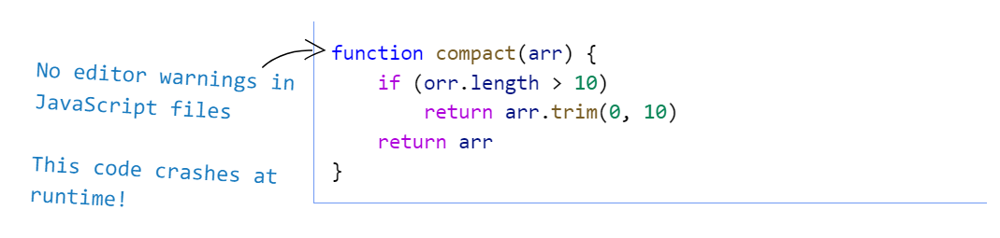
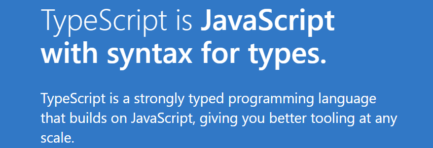
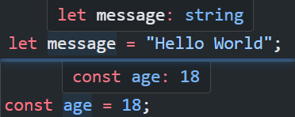

# TypeScript

## 认识 TypeScript

### 类型缺失的 JavaScript

- 其实上由于各种历史因素，JavaScript 语言本身存在很多的缺点

  - 随着 ECMAScript 不断提出的新特性，让这门语言更加现代、更加安全、更加方便
  - 然而到目前为止，JavaScript 在==类型检测==上依然是毫无进展

- 缺失类型带来的问题

  

  - 无法在==代码编译期间==就发现代码错误，许多错误必须要等到==代码执行==时才能发现
  - 对于工具/框架的开发者，无法给使用者提供==类型提示==，还需要对各种==错误边界==进行处理
  - 尤其是对于 JavaScript 这一单线程语言而言，错误会导致后续的代码都无法执行

- 为了弥补 JavaScript 类型约束上的缺陷，许多公司推出了自己的方案
  - 2014 年，Facebook 推出了 ==flow== 来对 JavaScript 进行类型检查
  - 同年，Microsoft 也推出了 ==TypeScript== 1.0 版本
  - 目前，TypeScript 已经成为了最为流行的 JavaScript 超集
  
  

### TypeScript 定义和特点

> 定义



- 官方定义：TypeScript is **JavaScript with syntax for types**
- TypeScript 是拥有==类型==的 JavaScript ==超集==


> 特点

- 始于 JavaScript，归于 JavaScript

  - 基于 JavaScript 进行构建，包含 JavaScript 的所有语法特性
  - 可以编译成==普通==、==干净==、==完整==的 JavaScript 代码

- 拥有先进的 JavaScript

  - 包含 ECMAScript 和 ==未来提案== 中的特性
  - 对原有的 JavaScript 进行了==语法扩展==，同时也可以编译成==向下兼容==的代码

- 是一个强大的工具，用于构建大型项目
  - ==静态语法分析==可以实时分析代码错误
  - 类型是可选的，强大的==类型推导==能力
  
  

### TypeScript 运行环境

- 方案一：使用 `ts-node` 工具（Node.js 环境）

  ```shell
  # 对于 ts-node 工具包，全局安装即可
  npm i -g ts-node tslib @types/node
  # 运行 ts 文件
  ts-node index.ts
  ```

- 方案二：使用 `webpack` 搭建环境（浏览器环境）

  ```typescript
  import { resolve } from "path";
  import { Configuration } from "webpack";
  import HtmlWebpackPlugin from "html-webpack-plugin";
  
  const config: Configuration = {
    mode: "development",
    devtool: "source-map",
    entry: "./src/index.ts",
    output: {
      filename: "bundle.js",
      path: resolve(__dirname, "./build")
    },
    module: {
      rules: [
        {
          test: /\.ts$/,
          use: "ts-loader"
        }
      ]
    },
    resolve: {
      extensions: [".ts", "..."]
    },
    plugins: [
      new HtmlWebpackPlugin({
        template: resolve(__dirname, "./index.html")
      })
    ]
  };
  
  export default config;
  ```


## 变量声明

### 类型注解

- 在 TypeScript 定义变量（标识符）和 ES6 之后一致，可以使用 `var/let/const` 来定义

- 在 TypeScript 中定义变量需要指定标识符的==类型==

  - 声明了类型后 TypeScript 就会进行==类型检测==，声明的类型可以称之为==类型注解==

  - 完整的声明格式

    ```typescript
    var/let/const 标识符: 数据类型 = 赋值;
    ```

  - TSLint 不推荐使用 `var` 来声明变量

- 在 TypeScript 中的数据类型与 JavaScript 中数据的包装类型是两个不同的概念

  ```typescript
  /*
  * string: TypeScript中字符串的类型
  * String: JavaScript中字符串的包装类
  */
  const str: string = 'Hello, TypeScript!';
  ```


### 类型推导

- 变量==初始化==值时，TypeScript 会根据初始化的值进行==类型推导==，自动推导出变量的类型

  ```typescript
  /*
  * message 变量会自动推导为 string 类型
  */
  let message = "Hello World!";
  
  // Error: 不能将类型“number”分配给类型“string”
  message = 22;
  ```

- 使用 `let` 声明推导出来的类型比 `const` 更为宽泛

  

  ```typescript
  /*
  * message 变量推导为 string 类型
  */
  let message = "Hello World";
  
  /*
  * age 变量推导为字面量类型 18
  */
  const age = 18;
  ```


## 数据类型

### JavaScript 类型

#### number

- 与 JavaScript 一样，TypeScript 不区分整数类型和浮点型，统一为 `number` 类型

  ```typescript
  const num: number = 10;
  ```

- TypeScript 同样支持二进制、八进制、十六进制的表示

  ```typescript
  const n1: number = 0b101;
  const n2: number = 0o123;
  const n3: number = 0xff;
  ```


#### bigint

- `bigint` 用于表示绝对值大于或等于 2^53^ 的数字

  ```typescript
  const number: bigint = 12345678900000001n;
  ```

- 使用 `typeof` 测试时，返回 `"bigint"`

  ```typescript
  typeof 1n === "bigint"; // true
  ```


#### boolean

`boolean` 类型只有两个取值：`true` 和 `false`

```typescript
let flag: boolean = true;
flag = Date.now() % 2 === 0;
```


#### string

`string` 类型表示字符串类型，可以使用单引号或者双引号表示

```typescript
const message: string = "Hello World";
```


#### null / undefined

- 在 JavaScript 中，`undefined` 和 `null` 是两个基本数据类型

- 在TypeScript中，它们既是实际的值，也是自己的类型

  ```typescript
  const s1: null = null;
  const s2: undefined = undefined;
  ```


#### symbol

`symbol` 表示符号类型，用于生成一个独一无二的值

```typescript
const t1 = Symbol('title');
const t2 = Symbol('title');

const info = {
  [t1]: 'a',
  [t2]: 'b'
};
```


#### Array

- `Array` 用于表示数组类型，数组中存放的元素属于同一类型

- 数组类型存在两种定义方式

  - `类型[]` 方式

    ```typescript
    const arr: number[] = [1, 2, 3];
    ```

  - `Array<类型>` 方式（泛型）

    ```typescript
    const arr: Array<string> = ['JavaScript', 'TypeScript'];
    ```


#### object

- `object` 表示对象类型，但是此类型约束表示的是==空对象==，无法添加属性和方法

  ```typescript
  const info: object = {};
  /*
  * 类型“object”上不存在属性“name”
  */
  info.name = '';
  ```

- 通常使用接口 `interface` 来约束对象的属性和行为

  ```typescript
  interface Info {
    name: string;
    age: number;
  }
  
  const info: Info = {
    name: 'Avril',
    age: 17
  };
  ```


### TypeScript 类型

#### any

- 无法确定一个变量的类型，并且可能它会发生一些变化，这种情况使用 `any` 类型

- 一旦使用了 `any` 类型，TS 会关闭对其的类型检测

  - 此时所有的操作都变成合法的
  - 这会带来类型安全问题，要尽量避免使用 `any` 类型

  ```typescript
  const num: any = 10;
  /*
  * 类型安全隐患
  */
  num.length = 10;
  num.split('');
  ```

- `any` 类型的变量可以赋值给任意类型

  ```typescript
  let a: any = "str";
  a = 123;
  a = false;
  ```


#### unknown

- `unknown` 类型用于描述类型==不确定==的变量

  - 与 `any` 相反，其做任何操作都是==不合法==的
  - 必须要先进行类型缩小后，才可以进行对象类型的操作

  ```typescript
  function foo(variable: unknown) {
    if (typeof variable === "number") {
      console.log(variable.toFixed(2));
    } else if (typeof variable === 'string') {
      variable.split(' ');
    }
  }
  ```

- 只能赋值给 `any` 和 `unknown` 类型，防止去干扰其他==确定的类型==

  ```typescript
  let b: unknown;
  /**
   * 不能将类型“unknown”分配给类型“string”
   */
  const c: string = b;
  ```

  

#### void

- `void` 通常用来指定一个函数是==没有返回值==

  - 可以将 `undefined` 赋值给 `void` 类型

  ```typescript
  function foo(): void {
    console.log(11);
    return undefined;
  }
  ```

- 当基于==上下文==的类型推导出返回类型为 void 的时候，并不会强制函数一定不能返回内容

  ```typescript
  const numbers = [1, 2, 3];
  /**
   * forEach 传入的回调函数没有返回值，但在此处也可以返回值
   */
  numbers.forEach(n => n.toFixed(2));
  ```


#### never

- `never` 表示永远不会发生值的类型

  - 比如一个函数中是一个死循环或者抛出一个异常，此时函数无返回值，可以指定为 `never` 类型

  ```typescript
  function throwError(): never {
    throw new Error('error');
  }
  ```

- 应用场景：强制完成类型穷举

  ```typescript
  /**
   * 接收 string/number 类型参数，强制对类型进行完整穷举
   */
  function getType(variable: string | boolean) {
    switch (typeof variable) {
      case 'string':
        console.log('string类型');
        break;
      default:
        /**
         * 编译时就会报错 (不能将类型“boolean”分配给类型“never”)
         * 强制要求完成类型穷举
         */
        const extract: never = variable;
    }
  }
  ```

  

#### tuple

- `tuple` 表示==元组==类型(固定长度的数组)

  - 相比数组，元组可以存放不同类型的元素，并且可以指定每一个元素的类型
  - 元组中每个元素都有自己特定的类型，根据索引值获取到的值可以得到确定的类型

  ```typescript
  const tuple: [string, number] = ['aaa', 11];
  const [str, num] = tuple;
  
  console.log(str.charAt(1));
  console.log(num.toFixed(2));
  ```

- 元组类型通常用于指定==函数返回值==的类型

  ```typescript
  function useState<T>(init: T): [T, (v: T) => void] {
    const state = init;
    const setState = (newValue: T): void => {};
  
    return [state, setState];
  }
  ```


#### enum

- `enum` 表示==枚举==类型

  - 枚举就是将一系列可能的值，一个个列举出来定义在一个类型中

  ```typescript
  enum Gender {
    MALE,
    FEMALE
  }
  
  const male: Gender = Gender.MALE;
  ```

- 枚举类型默认是有值的

  - 默认从 `0` 开始依次递增，如果改变了一个枚举的数值，后续未定义的枚举会以此依次递增

    ```typescript
    enum Gender {
      MALE = 100,
      FEMALE
    }
    
    const male: Gender = Gender.FEMALE;
    console.log(male === 101); // true
    ```

  - 也可以使用其他类型（常量或计算值）作为枚举类型的值

    ```typescript
    /*
    * 常量
    */
    enum Direction {
      Up = "UP",
      Down = "DOWN",
      Left = "LEFT",
      Right = "RIGHT",
    }
    
    /*
    * 计算值
    */
    enum FileAccess {
      // constant members
      None,
      Read = 1 << 1,
      Write = 1 << 2,
      ReadWrite = Read | Write,
      // computed member
      G = "123".length,
    }
    ```

- 使用==数字枚举==成员的枚举类型支持反向映射

  ```typescript
  enum Direction {
    LEFT,
    RIGHT
  }
  
  const left = Direction.LEFT;
  console.log(Direction[left]); // "LEFT"
  ```

  


## 类型系统

### 类型别名和接口

> 类型别名 type

- 类型别名使用 `type` 关键字，可以对需要复用的类型进行抽取

  ```typescript
  type IDType = string | number;
  const variable: IDType = 11;
  ```


> 接口 interface

- 接口使用 `interface` 关键字，主要用于声明对象类型

  ```typescript
  interface Info {
    name: string;
    id: string;
  }
  ```

- 对于对象类型，属性支持额外的修饰符

  - `?`：可选属性，可选属性是声明类型和 `undefined` 的联合类型
  - `readonly`：只读属性，只允许读取，不可重写
  
  ```typescript
  interface Position {
    x: number;
    readonly y: number;
    z?: number;
  }
  
  const position2d: Position = { x: 100, y: 100 };
  // position2d.y = 200; 不可进行属性值重写
  const position3d: Position = { x: 100, y: 100, z: 100 };
  ```
  
- 通过 `接口["成员属性"]` 的方式可以访问接口成员的类型

  ```typescript
  interface IPerson {
    name: string;
    hobbies: string[];
  }
  
  // type A = string[]
  type A = IPerson["hobbies"];
  ```

  

> 类型别名和接口区别

- 类型别名通常用于定义 ==非对象==类型，接口通常用于定义对象类型

  - 类型别名可以声明任意类型
  - 接口只能声明对象类型和函数签名

- 类型别名不可重复声明

  - 接口可以==重复声明==，且类型声明会进行==合并==
  - 合并时，同一属性的类型需要相同

  ```typescript
  interface Person {
    name: string;
  }
  
  interface Person {
    age: number;
  }
  
  const person: Person = {
    name: 'Avril',
    age: 17
  };
  ```

- 接口可以使用==继承== 等扩展语法


### 联合类型

- 联合类型是由两个或者多个其他类型组成的类型，使用 `|` 操作符

  - 表示可以是这些类型中的任何一个值
  - 联合类型中的每一个类型被称之为联合成员

  ```typescript
  interface Info {
    id: string | number;
    name: string;
  }
  
  const info: Info = { id: 10, name: 'Enemy' };
  const info2: Info = { id: '_10032104', name: 'Airwaves' };
  ```

- 在使用联合类型的变量时，需要进行==类型缩小==后再使用

  ```typescript
  function getLength(id: string | number) {
    if (typeof id === 'string') {
      return id.length;
    }
    return id.toString().length;
  }
  ```


### 交叉类型

- 交叉类型表示需要==同时满足==多个类型的条件，使用 `&` 操作符

  - 使用交叉类型，在定义类型时可以对原有类型进行扩展

  ```typescript
  interface Info {
    name: string;
    color: string;
  }
  
  interface IAction {
    run: () => void;
  }
  
  const dog: IAction & Info = {
    name: '小白',
    color: 'white',
    run() {
      console.log(`${this.name} is running!`);
    }
  }
  ```

- 对两个无交集的类型进行交叉，会得到 `never` 类型

  ```typescript
  /**
   * type ID = never
   */
  type ID = number & string;
  ```

- 对两个联合类型进行交叉，会取==交集==

  ```typescript
  type T1 = number | string;
  type T2 = string | boolean;
  
  /**
   * type T = string
   */
  type T = T1 & T2;
  ```

  

### 类型断言

- 使用 `as` 关键字进行类型断言，可以缩小类型范围

  ```typescript
  /**
   * 将 Element 类型断言为 HTMLDivElement
   */
  const div = document.querySelector('#root') as HTMLDivElement;
  ```

- 只允许类型断言转换为 **更具体** 或者 **不太具体** 的类型范围

  ```typescript
  /**
   * 向更具体的类型进行断言
   */
  const v1: string | undefined = '11';
  const v2 = v1 as string;
  
  /**
   * 向更宽泛的类型进行断言(不推荐，可能出现类型安全问题)
   */
  const v3: string = '22';
  const v4 = v3 as any;
  ```

- 使用 `!` 可以进行==非空断言==，去除类型中的 `undefined/null` 类型

  - 除非确定值一定存在，否则非空断言会导致类型安全问题

  ```typescript
  /**
   * 去除获取的 null 类型
   */
  const { scrollTop } = document.querySelector('div')!;
  ```


### 字面量类型

- 字面量类型类似于==枚举==，将取值在有限的范围内

  - 字面量类型结合联合类型，可以实现枚举的效果，并且可以获取很好的代码提示

  ```typescript
  type Direction = 'left' | 'right';
  
  function action(direction: Direction) {
    if (direction === 'left') {
      console.log('Turn Left');
    } else {
      console.log('Turn Right');
    }
  }
  ```

- 对象在进行字面量推理的时候，会推导为==更通用==的类型

  - 添加 `as const` 可以强制推导成字面量类型

  ```typescript
  /**
   * const info: {
      readonly name: "Avril";
      readonly age: 17;
    }
   */
  const info = {
    name: 'Avril',
    age: 17
  } as const;
  ```


### 类型缩小

类型缩小旨在将==不确定的类型==向==确定的类型==缩小

> typeof

- 在 TypeScript 中，`typeof` 是一种类型保护

  - 在 `typeof` 的条件作用域内，类型会被缩小约束

  ```typescript
  function getLength(id: string | number) {
    if (typeof id === 'string') {
      return id.length;
    }
    return id.toString().length;
  }
  ```

- 除了能用于类型保护外，`typeof` 还可以获取一个标识符的类型，起到==提取类型==的作用

  ```typescript
  const info = {
    name: 'Avril',
    age: 17
  };
  
  /**
   * type ID = {
      name: string;
      age: number;
    }
   */
  type ID = typeof info;
  ```


> 平等缩小

使用 `switch` 或相等的一些运算符（`===`、`!==`）来表达相等性

```typescript
function action(direction: 'left' | 'right') {
  if (direction === 'left') {
    console.log('Turn Left');
  } else {
    console.log('Turn Right');
  }

  switch (direction) {
    case 'left':
      console.log('Turn Left');
      break;
    case 'right':
      console.log('Turn Right');
  }
}
```


> instanceof

使用 `instanceof` 检查一个值是否是另一个值的 ==实例==

```typescript
function validateJson(json: string) {
  try {
    return true;
  } catch (error) {
    return error as Error;
  }
}

const result = validateJson("{}")

if (result instanceof Error) {
  console.log(result.message);
}
```


> in

`in` 操作符用于确定对象是否含有给定名称的属性

```typescript
interface Teacher {
  teaching: () => void;
}

interface Student {
  studying: () => void;
}

function action(person: Teacher | Student) {
  if ('studying' in person) {
    /**
     * 此作用域内确定为 Student 类型
     */
    person.studying();
  } else {
    /**
     * 此作用域内确定为 Teacher 类型
     */
    person.teaching();
  }
}
```


## 函数类型

### 函数类型声明

#### 函数类型表达式

- 在 TypeScript 中，通过编写==函数类型表达式==可以约束函数的类型

  - 语法：`(参数: 类型) => 返回值类型`
  - 不同于其他编程语言，参数列表中的==形参名称==不能省略

  ```typescript
  type Sum = (n1: number, n2: number) => number;
  
  const sum: Sum = (n1, n2) => n1 + n2;
  ```

- 声明函数时，形参的个数可以==少于==类型声明中的参数个数

  - 类型声明中多余的形参会被忽略
  - 但声明函数时，形参个数==不能多于==类型声明中的个数

  ```tex
  In JavaScript, if you call a function with more arguments than there are parameters, the extra arguments are simply ignored. TypeScript behaves the same way.
  ```

  ```typescript
  type Sum = (n1: number, n2: number) => number;
  
  /*
  * 无报错
  */
  const sum1: Sum = (n1) => n1 * 2;
  
  /**
   * Target signature provides too few arguments. Expected 3 or more, but got 2
   */
  const sum2: Sum = (n1, n2, n3) => n1 + n2;
  ```


#### 调用签名

在 JavaScript 中，函数除了可以被调用，也可以有属性值

- 函数类型表达式只能表达一个可以被调用的函数，无法为函数添加属性
- 此时可以使用==接口==为函数添加属性，同时使用==调用签名==声明函数的调用类型

- 调用签名语法：`(参数: 类型): 返回值类型`

```typescript
interface Sum {
  description: string;
  (n1: number, n2: number): number;
}

const sum: Sum = (n1, n2) => n1 + n2;
sum.description = '两数之和';
```


#### 构造签名

在 JavaScript 中，函数也可以被当作一个==构造函数== 通过 `new` 进行调用

- 此时可以为函数类型添加==构造签名==，只需在 **调用签名** 前面添加 `new` 操作符

```typescript
type SomeConstructor = {
  new (name: string): Dog;
};

function fn(ctor: SomeConstructor) {
  return new ctor("hello");
}

class Dog {
  name: string;
  constructor(name: string) {
    this.name = name;
  }
}

fn(Dog);
```


### 函数参数类型

#### 可选参数

- 在声明函数的参数类型时，可以为参数名称添加 `?` 后缀，表示此参数是可选的

  - 添加可选类型后，此参数的类型相当于给定类型与 `undefined` 的联合类型

  ```typescript
  function sum(x: number, y?: number) {}
  
  sum(1);
  sum(1, 2);
  ```

- 可选参数需要放在必选参数的后面


#### 默认参数

- 在声明函数的参数类型时，可以为参数赋予==默认值==

  - 默认参数不需要添加类型注解，TS 会根据默认值自动进行==类型推导==
  - 对于默认参数，可以显式的传递 `undefined`（会被忽略），此时也会使用函数声明的默认参数

  ```typescript
  function drawCircle(radius: number, x = 0, y = 0) {
    const ctx = document.querySelector('canvas')!.getContext('2d') as CanvasRenderingContext2D;
    
    ctx.arc(x, y, radius, 0, Math.PI * 2);
  }
  
  /**
   * 此时 x 仍然会以 0 进行运算
   */
  drawCircle(50, undefined);
  ```

- 同样，默认参数也需要放在必选参数的后面


#### 剩余参数

- TS 同样支持剩余参数，剩余参数会以==数组==的形式进行存放

  ```typescript
  const sum = (init: number, ...args: number[]) => args.reduce((pre, cur) => pre + cur, init);
  ```

- 默认参数需要放在参数列表的最后


### 函数重载

- 在 TS 中，可以为函数编写不同的重载签名，表示函数可以以不同的方式进行调用

  - 编写多个重载签名，再去编写一个通用的函数以及实现
  - 有实现体的函数无法被直接调用，只能去调用匹配的重载签名

  ```typescript
  function sum(arg1: number, arg2: number): number;
  function sum(arg1: string, arg2: string): string;
  function sum(arg1: any, arg2: any): any {
    return arg1 + arg2;
  }
  
  sum('Hello', 'World');
  sum(11, 22);
  ```

- 也可以使用接口声明多个==调用签名==来实现函数的重载

  ```typescript
  interface NavigateOptions {
    replace?: boolean;
    relative?: string;
  }
  
  /**
   * 声明多个重载签名
   */
  interface Navigate {
    (to: string, options: NavigateOptions): void;
    (delta: number): void;
  }
  
  const navigate: Navigate = () => {};
  
  navigate(2);
  navigate('/home', { replace: true });
  ```

- 在可能的情况下，如果联合类型能够实现，尽量使用联合类型来实现函数的多种调用形式


### 函数 this 类型

#### 指定 this 类型

- 在没有进行任何配置时，函数内 `this` 的默认类型为 `any`

  - 此时在 *this* 上做任何操作都是合法且不进行类型检测

- 如果在 **tsconfig.json** 中配置了 `noImplicitThis: true`

  - TS 会根据==上下文==推导 *this*

    ```typescript
    const person = {
      name: 'Avril',
      occupation: 'singer',
      print() {
        /**
         * 根据上下文自动推导出 this 的类型
         * this: {
            name: string;
            occupation: string;
            print(): void;
          }
         */
        console.log(`she is ${this.name} who is a ${this.occupation}`);
      }
    }
    ```

  - 在不能正确推导时就会报错，需要明确的指定

    ```typescript
    function foo() {
      /**
       * 无法自动推导出 this 的类型，需要明确指定
       */
      console.log(this);
    }
    ```

- 函数的第一个参数可用于指定 `this` 的类型，且参数名称必须叫 `this`

  - 后续调用函数传入参数时，从第二个参数开始传递，*this* 参数会在编译后被删除

  ```typescript
  function foo(this: typeof window) {
    console.log(this.location.href);
  }
  ```

  

#### this 内置工具

- `ThisParameterType` 用于提取一个函数类型的 *this* 参数类型

  - 如果这个函数类型没有 *this* 参数返回 `unknown`

  ```typescript
  function bar(this: { data: number[] }) {}
  /**
   * type ThisOfBar = ThisParameterType<typeof bar>
   */
  type ThisOfBar = ThisParameterType<typeof bar>;
  ```

- `OmitThisParameter` 用于移除一个函数的 *this* 参数类型，并且返回当前的函数类型

  ```typescript
  function demo(this: {}, ...args: string[]) {}
  /**
   * type OmitThisOfDemo = (...args: string[]) => void
   */
  type OmitThisOfDemo = OmitThisParameter<typeof demo>;
  ```

- `ThisType` 被用作标记一个==上下文==的 *this* 类型

  ```typescript
  interface IData {
    id: string;
    price: number;
  }
  
  interface IProduct {
    data: IData;
    share: () => string;
    order: () => void;
  }
  
  /**
   * 通过 ThisType，可以将 product 对象中每个方法中的上下文 this 推导为 IData
   * 在每个方法中，可以直接去获取 data 中的数据
   */
  const product: IProduct & ThisType<IData> = {
    data: {
      id: '1696417118933',
      price: 3999
    },
    share() {
      return `https://example.com/share?id=${this.id}`
    },
    order() {
      window.open(`https://example.com/order?id=${this.id}`)
    }
  }
  
  product.order.call(product.data);
  product.share.call(product.data);
  ```


## 面向对象

### 类的定义

- 在 TS 中，同样使用 `class` 关键字来定义一个类

- 在类的内部声明类的属性以及对应的类型

  - 默认情况下，由于 `strictPropertyInitialization` 配置的存在，在声明属性的时候必须要进行==初始化==
  - 可以在声明的时候直接给予初始值，或者配合 `constructor` 进行赋值
  - 如果不想初始化，可以使用 `!` 跳过检测

  ```typescript
  class Person {
    name: string;
    age: number = 0;
    address!: string;
  
    constructor(name: string) {
      this.name = name;
    }
    
    say() {
      console.log(`Hello, I am ${this.name}`);
    }
  }
  ```

- 属性的修饰符

  - `?`：可选属性，可以不进行初始化
  - `readonly`：只读属性（只允许在==构造器==或属性声明时赋值）

  ```typescript
  class Person {
    name?: string;
    readonly age: number = 0;
  }
  ```

- 类除了可以作为一个工厂函数，也可以作为一种数据类型

  ```typescript
  class Person {
    name: string;
  
    constructor(name: string) {
      this.name = name;
    }
  }
  
  /*
  * 此处 Person 既可以作为一个创建实例对象的类
  * 也可以作为一种类型来约束变量 p
  */
  const p: Person = new Person('Avril');
  ```


### 类的继承

- 与 JavaScript 中一致，在 TS 中使用 `extends` 可以完成类的继承

  - ==继承==不仅可以抽取可复用的逻辑，而且是==多态==的前提

- 在子类中通过 `super` 访问父类的属性和方法，也可以对父类的属性和方法进行重写

  ```typescript
  class Person {
    name: string;
  
    constructor(name: string) {
      this.name = name;
    }
    
    print() {}
  }
  
  class Student extends Person {
    constructor(name: string) {
      // 访问父类构造器
      super(name);
    }
  
    // 重写父类中的方法
    print() {
      console.log(this.name);
    }
  }
  ```

  

### 类的成员修饰符

- `public`： 修饰的是在任何地方可见、公有的属性或方法，默认编写的属性就是 *public* 的
- `private`： 修饰的是仅在==同一类==中可见、私有的属性或方法
- `protected`： 修饰的是仅在==类自身及子类==中可见、受保护的属性或方法

```typescript
class Person {
  private address: string = '北京'
  protected gender: '男' | '女' = '男'
  
  print() {
    console.log(this.address); // '北京'
  }
}

class Student extends Person {
  print() {
    console.log(this.gender) // '男'
  }
}

const p1 = new Person('app')
// p1.address —— 无法访问
// p1.gender —— 无法访问
```


### 参数属性

TS 提供了特殊的语法糖，可以把一个==构造函数参数==转成一个==同名同值==的类属性

- 通过在构造函数参数前添加一个==可见性==修饰符来创建参数属性
- 同时这些类属性字段也会得到这些修饰符
- 甚至在构造函数中的赋值操作也可以省略

```typescript
class Person {
  constructor(public name: string, readonly age: number) {}
}

const p = new Person('Avril', 17);
console.log(p); // { name: 'Avril', age: 17 }

/**
 * 无法为“age”赋值，因为它是只读属性
 */
// p.age = 20
```


### 抽象类

- ==抽象类==为 TS 中新增的类型，不存在于 JavaScript 中

  - 是对一类事物的抽象，可以定义一些通用的抽象方法而不做实现，由继承的子类去做具体实现
  - 通过 `abstract` 声明抽象类

  ```typescript
  /*
  * 抽象形状类
  */
  abstract class Shape {
    abstract getArea(): number
  }
  
  class Rectangle extends Shape {
    constructor(public width: number, public height: number) {
      super();
    }
  
    getArea() {
      return this.height * this.width;
    }
  }
  
  class Circle extends Shape {
    constructor(public r: number) {
      super();
    }
  
    getArea() {
      return Math.PI * this.r ** 2;
    }
  }
  
  const rectangle = new Rectangle(10, 20);
  console.log(rectangle.getArea()); // 300
  
  const circle = new Circle(10);
  console.log(circle.getArea()); // 314.1592653589793
  ```

-  抽象类的特点

  - 抽象类是不能被==实例化==
  - 抽象类可以没有抽象方法，也可以拥有具体实现的方法
  - 抽象方法必须被子类实现

- 抽象类与接口的区别

  - 抽象类是事物的抽象，用于捕捉子类的通用特性；接口是对通用行为的抽象
  - 一个类可以同时实现多个接口，但只能继承一个类
  - 抽象类中可以有实现体的方法，接口中只能存在函数的声明


### 接口补充

#### 索引签名

通过索引签名，可以对具有==同一特征==的属性 — 值进行列举

- 索引签名的属性类型必须是 `string` 或 `number`

  ```typescript
  interface IPrice {
    /*
    * 声明对象的 key 为 string 类型，值为数字类型
    */
    [key: string]: number;
  }
  
  const price: IPrice = {
    'apple': 3,
    'banana': 5
  }
  ```

- 如果同时声明，则需要满足 —— 数字索引的返回类型是字符索引返回类型的==子类型==

  ```typescript
  interface ICollection {
    [key: string]: any;
    [key: number]: number;
  }
  
  const numbers: ICollection = [1, 2, 4];
  ```

- 利用索引签名可以创建映射类型和一系列内置工具


#### 接口继承

接口同样支持继承（`extends`）于其他接口，同时还支持继承==多个接口==

```typescript
interface Person {
  name: string;
  age: number;
}

interface Student {
  studying: () => void;
}

interface Undergraduate extends Person, Student {
  profession: string;
}

const john: Undergraduate = {
  name: 'john',
  age: 22,
  studying() {},
  profession: 'computer specialty'
}
```


#### 实现接口

- 接口定义后，也是可以被类实现，以约束类的行为
- 由于 TS 的类型检测基于 ==鸭子类型==，所以实现的接口的类和对象都可以通过类型校验

```typescript
interface ITask {
  task: () => void;
}

class Teacher implements ITask {
  task() {
    console.log('Teaching');
  }
}

class Student implements ITask {
  task() {
    console.log('Studying');
  }
}

/**
 * role 参数需要实现 ITask 接口
 */
function runTask(role: ITask) {
  role.task();
}

runTask(new Teacher());
runTask(new Student());

/**
 * 实现了接口的任意对象也可通过类型校验
 */
runTask({
  task() {}
});
```


### 严格字面量赋值检测

- 每个对象字面量==最初赋值==都被认为是 “新鲜的（fresh）”

- 当一个新的对象字面量分配给一个变量或传递给一个==非空目标类型==的参数时，对象字面量指定目标类型中==不存在==的属性是错误的

  ```typescript
  interface IPerson {
    name: string;
    age: number;
  }
  
  const p: IPerson = {
    name: 'Avril',
    age: 17,
    /**
     * Error: “address”不在类型“IPerson”中
     */
    address: 'Canada'
  }
  ```

- 当类型断言或对象字面量的类型扩大时，新鲜度会消失

  ```typescript
  interface IPerson {
    name: string;
    age: number;
  }
  
  /**
   * 类型断言，此时可以绕过 TS 类型检测
   */
  const p: IPerson = {
    name: 'Avril',
    age: 17,
    address: 'Canada'
  } as IPerson;
  
  
  const person = {
    name: 'Avril',
    age: 17,
    address: 'Canada'
  }
  
  /**
   * 二次赋值，此时可以绕过 TS 类型检测
   */
  const realPerson: IPerson = person;
  ```


## 泛型编程

### 泛型定义

- 泛型定义：将==类型参数化==，用于封装通用的接口

  - 泛型使用 `<类型>` 语法定义

    ```typescript
    function foo<T>(arg: T) {}
    ```

  - 在定义泛型时，可以使用 `=` 赋默认值，使用时未传递类型则使用默认类型

    ```typescript
    function foo<T = string>(arg: T) {}
    ```

- 在使用泛型时，可以显式的传递类型，也可以自动类型推导出类型

  ```typescript
  function foo<T, V>(v1: T, v2: V) {}
  
  // 显式传递
  foo<string, number>("string", 22);
  // 根据传递的参数类型自动类型推导
  foo("string", 22);
  ```

  

### 泛型接口/类

- 定义接口或类时可以结合泛型动态决定属性类型

- 泛型接口：`interface 接口<T>`

  ```typescript
  interface IPosition<T = number> {
    x: T;
    y: T;
  }
  
  const position1: IPosition = { x: 100, y: 100 };
  const position2: IPosition<string> = { x: '100.00', y: '100.00' };
  ```

- 泛型类：`class 类<T>`

  ```typescript
  class Point<T> {
    constructor(public x: T, public y: T) {}
  }
  
  const p1: Point<number> = new Point(1, 2)
  const p2 = new Point<string>('1.0', '2.0')
  ```


### 泛型约束

- 泛型约束：对传入的类型进行一定的约束，比如拥有相同的属性或行为

  - 使用 `extends` 关键字对泛型进行约束，使其必须满足某些条件

  ```typescript
  /**
   * 遍历一个可迭代对象
   */
  function ergodic<T extends Iterable<any>>(arg: T) {
    for (const iterator of arg) {
      console.log('iterator', iterator);
    }
  }
  
  ergodic('123');
  ergodic([1, 2, 3]);
  ergodic(new Set([1, 2, 3]));
  ```

- 类型参数可以被其他类型参数约束

  - `keyof` 操作符：获取一个对象所有的属性名组成的==联合类型==

  ```typescript
  function getProperty<T, K extends keyof T>(obj: T, key: K) {
    return obj[key];
  }
   
  const x = { a: 1, b: 2 };
  // 传入的属性约束为只能是 x 对象中的属性
  getProperty(x, "a");
  ```


### 映射类型

- 映射类型建立在索引签名的语法上，是使用了属性名的联合类型的泛型

  - 在映射时，会遍历每一个属性键名生成一个新的类型
  - 映射类型只能使用 `type` 完成，无法使用 `interface`
  - 大部分内置类型工具都是通过映射类型来实现的 

  ```typescript
  type CopyType<T> = {
    /**
     * in 操作符会自动遍历每一个属性键名
     */
    [P in keyof T]: T[P];
  }
  
  interface IPerson {
    name: string;
    age?: number;
  }
  
  /**
   * type A = {
      name: string;
      age?: number | undefined;
    }
   */
  type A = CopyType<IPerson>;
  ```

- 在使用映射类型时，使用==映射修饰符==可以对原有类型进行修改

  - 两个额外的修饰符 `readonly` 和 `?`
  - 通过前缀 `-` 或 `+` 删除或添加这些修饰符，不写默认指定为 `+`

  ```typescript
  type MyRequired<T> = {
    /**
     * "-?" 会将所有可选属性 -> 必选属性
     */
    [P in keyof T]-?: T[P];
  }
  
  interface IPerson {
    name?: string;
    age?: number;
  }
  
  /**
   * type A = {
      name: string;
      age: number;
    }
   */
  type A = MyRequired<IPerson>;
  ```


### 条件类型

- 条件类型：基于==输入==的值的类型来决定==输出==的值的类型

  - 类似于 JS 中的三元运算符，条件类型语法

    ```typescript
    type Type = SomeType extends OtherType ? TrueType : FalseType;
    ```

  - 使用条件类型可以根据传入的类型，推断出不同的类型

    ```typescript
    interface IdLabel {
      id: number /* 一些字段 */;
    }
    
    interface NameLabel {
      name: string /* 其它字段 */;
    }
    
    type NameOrId<T extends number | string> = T extends number ? IdLabel : NameLabel;
    
    const e1: NameOrId<string> = { name: '1' };
    const e2: NameOrId<number> = { id: 1 };
    ```

- 在条件类型中推断

  - 条件类型提供了 `infer` 关键字，可以从正在比较的类型中推断类型，然后在 `true` 分支里引用该推断结果
  - `infer T` 类型于一个类型==占位符== 

  ```typescript
  type MyReturnType<T extends (...args: any[]) => any> = 
  	T extends (...args: any[]) => infer R ? R : never;
  
  // type A = string[]
  type A = MyReturnType<typeof String.prototype.split>;
  ```

- 分发条件类型

  - 当在泛型中使用条件类型的时候，如果传入一个==联合类型==，就会变成分发的

    ```typescript
    type ToArray<T> = T extends any ? Array<T> : never;
    
    /**
     * type A = string[] | number[]
     * 如果直接使用 Array<T>，结果是 (string | number)[]
     */
    type A = ToArray<string | number>;
    ```

  - 在条件类型中，泛型默认是分发的，如果要避免这种行为，将 `extends` 前后的类型都加上 `[]` 即可

    ```typescript
    type ToArray<T> = [T] extends [any] ? Array<T> : never;
    
    /**
     * type A = (string | number)[]
     * 此时会取消条件分发模式
     */
    type A = ToArray<string | number>;
    ```


### 内置类型工具

>Partial< Type >

用于构造一个 Type 下面的所有属性都设置为==可选==的类型，转换过程是==浅层==的

```typescript
type MyPartial<T> = {
  [P in keyof T]?: T[P];
}

// 深层转换
type MyDeepPartial<T> = {
  [P in keyof T]?: T[P] extends object ? MyDeepPartial<T[P]> : T[P];
}

interface IPerson {
  name: string;
  age: number;
}

/**
 * type A = {
    name?: string | undefined;
    age?: number | undefined;
  }
 */
type A = MyPartial<IPerson>;

const p: MyPartial<IPerson> = { name: 'Avril' };
```


>Required< Type >

用于构造一个 Type 下面的所有属性都设置为==必选==的类型，转换过程是==浅层==的

```typescript
type MyRequired<T> = {
  [P in keyof T]-?: T[P];
}

// 深层转换
type MyDeepRequired<T> = {
  [P in keyof T]-?: T[P] extends object ? MyDeepRequired<T[P]> : T[P];
}

interface IPerson {
  name: string;
  age?: number;
}

/**
 * type T = {
    name: string;
    age: number;
  }
 */
type T = MyRequired<IPerson>;

const p: T = { 
  name: 'Avril',
  age: 17 
};
```


>Readonly< Type >

用于构造一个 Type 下面的所有属性全都设置为==只读==的类型，转换过程是==浅层==的

```typescript
type MyReadonly<T> = {
  readonly [P in keyof T]: T[P];
}

// 深层转换
type MyDeepReadonly<T> = {
  readonly [P in keyof T]: T[P] extends object ? MyDeepReadonly<T[P]> : T[P];
}

interface IPerson {
  name: string;
  age?: number;
}

/**
 * type T = {
    readonly name: string;
    readonly age?: number;
  }
 */
type T = MyReadonly<IPerson>;

const p: T = { name: 'Avril' };

// 无法为“name”赋值，因为它是只读属性
// p.name = 10;
```


>Record<Keys, Type>

用于构造一个==对象==类型，它所有的 **键** 都是 Keys 类型，所有的 **值** 都是 Type 类型

```typescript
/**
 * type Key = string | number | symbol
 */
type Key = keyof any;

type MyRecord<K extends Key, V> = {
  [P in K]: V;
}

interface Action {
  step: number;
  speed: number;
}

type DirectionAction = MyRecord<'left' | 'top', Action>;

const action: DirectionAction = {
  left: { step: 10, speed: 1 },
  top: { step: 10, speed: 1 }
};
```


>Exclude<U, E>

用于构造一个类型，它是从 U ==联合类型==里面==排除==了所有可以赋给 E 的类型

```typescript
type MyExclude<U, K extends U> = U extends K ? never : U;

/**
 * type A = string
 */
type A = MyExclude<string | number, number>;

const a: A = "Hello World";
```


>Extract<Type, U>

用于构造一个类型，它是从 Type 类型里面==提取==了所有可以赋给 U 的类型

```typescript
type MyExtract<T, U extends T> = T extends U ? T : never;

/**
 * type A = "name"
 */
type A = MyExtract<'name' | 'string', 'name'>;
```


>Pick<Type, Keys>

用于构造一个类型，它是从 Type 类型里面挑选出一些属性 Keys

```typescript
type MyPick<T, K extends keyof T> = {
  [P in K]: T[P];
}

interface IPerson {
  name: string;
  age: number;
  address: string;
}

/**
 * type A = {
    name: string;
    age: number;
  }
 */
type A = MyPick<IPerson, 'name' | 'age'>;

const p: A = {
  name: 'Avril',
  age: 17
};
```


>Omit<Type, Keys>

用于构造一个类型，它是从 Type 类型里面==过滤==出一些属性 Keys

```typescript

type MyOmit<T, K extends keyof T> = {
  [P in Exclude<keyof T, K>]: T[P];
}

interface IPerson {
  name: string;
  age: number;
  address: string;
}

/**
 * type A = {
    name: string;
  }
 */
type A = MyOmit<IPerson, 'age' | 'address'>;

const p: A = { name: 'Avril' };
```


>NonNullable< Type >

用于构造一个类型，这个类型从 Type 中排除了 `null/undefined` 的类型

```typescript
type MyNonNullable<T> = T extends null | undefined ? never : T;

/**
 * type A = string
 */
type A = MyNonNullable<string | null | undefined>;

const a: A = "Hello World";
```


> Parameters< Type >

用于构造一个函数的==参数列表==的类型

```typescript
type MyParameters<T extends (...args: any[]) => any> = 
	T extends (...args: infer P) => any ? P : never;

/**
 * type A = [start: number, end?: number | undefined]
 */
type A = MyParameters<typeof String.prototype.substring>;
```


>ReturnType< Type >

用于构造一个函数的==返回值==的类型

```typescript
type MyReturnType<T extends (...args: any[]) => any> = 
	T extends (...args: any[]) => infer R ? R : never;

/**
 * type A = string[]
 */
type A = MyReturnType<typeof String.prototype.split>;
```


## 模块化
